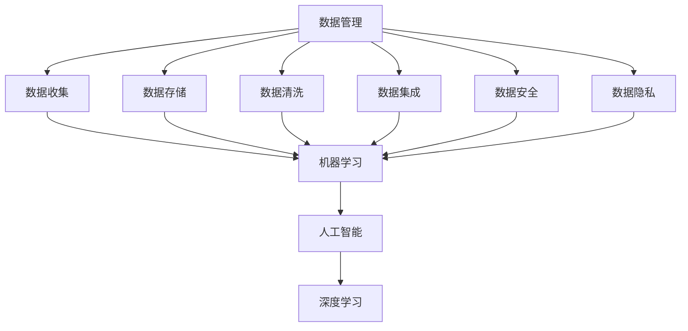

                 

### 文章标题

**AI创业：数据管理与技术**

> **关键词：** 数据管理、人工智能、技术、创业、数据分析、数据隐私、算法优化、机器学习框架。

**摘要：** 本文旨在探讨AI创业中的数据管理与技术，分析如何有效管理数据、确保数据隐私，并利用先进的技术手段推动创业项目的发展。通过深入讲解核心算法原理、数学模型以及项目实践案例，本文为AI创业提供了切实可行的指导。

### 1. 背景介绍

在当今科技飞速发展的时代，人工智能（AI）已经成为了推动创新和经济增长的重要力量。随着AI技术的不断进步，越来越多的创业者投身于AI领域，试图通过开发智能应用来改变世界。然而，在AI创业的过程中，数据管理和技术问题成为了创业者面临的主要挑战之一。

**数据管理的重要性：**

数据是AI的基石，有效的数据管理对于AI创业至关重要。首先，数据的质量直接影响AI模型的性能。其次，数据的多样性和规模决定了AI系统是否能够适应不断变化的业务需求。此外，随着数据隐私法规的日益严格，如何保护用户数据也成为了数据管理的关键问题。

**技术挑战：**

在AI创业中，技术问题同样不可忽视。首先，如何选择合适的算法和框架是关键。其次，算法的优化和调参需要大量的时间和计算资源。此外，技术的更新换代速度快，创业者需要不断学习和适应新技术，以保持竞争力。

**本文目的：**

本文旨在帮助AI创业者深入了解数据管理和技术的关键概念，并提供实用的指导。通过分析核心算法原理、数学模型以及项目实践案例，本文将帮助读者掌握数据管理和技术的核心要点，为AI创业提供有力支持。

### 2. 核心概念与联系

为了深入探讨AI创业中的数据管理与技术，我们需要首先理解一些核心概念和它们之间的联系。

**核心概念：**

1. **数据管理：** 数据管理是指组织、存储、处理和分析数据的过程。它包括数据收集、数据存储、数据清洗、数据集成、数据安全和数据隐私等方面。
   
2. **人工智能：** 人工智能是指使计算机系统能够执行通常需要人类智能才能完成的任务的技术。这包括机器学习、深度学习、自然语言处理、计算机视觉等。

3. **机器学习：** 机器学习是一种人工智能的分支，它通过从数据中学习规律和模式来自动改进算法的性能。

4. **深度学习：** 深度学习是机器学习的一个子领域，它使用多层神经网络来学习数据的复杂模式。

**概念联系：**

数据管理与人工智能紧密相关。数据是机器学习模型的输入，数据管理的有效性直接决定了机器学习模型的性能。同时，人工智能技术的进步也推动了数据管理技术的发展。例如，自动化数据处理工具和先进的机器学习算法使得数据管理变得更加高效和智能。

**Mermaid 流程图：**

以下是数据管理、人工智能和机器学习之间的Mermaid流程图，展示了它们的核心联系和相互作用。



通过以上流程图，我们可以清晰地看到数据管理在AI创业中的关键作用，以及人工智能和机器学习如何从数据中提取价值。

### 3. 核心算法原理 & 具体操作步骤

在AI创业中，理解核心算法原理和掌握具体的操作步骤是至关重要的。以下将介绍一些常见的算法，并详细说明它们的原理和步骤。

#### 3.1 逻辑回归（Logistic Regression）

**原理：**

逻辑回归是一种广义线性模型，用于处理二分类问题。它的目标是通过输入特征预测一个概率，通常用来进行分类任务。

**具体操作步骤：**

1. **数据准备：** 收集和准备输入特征和标签数据，进行数据清洗和预处理。
2. **模型训练：** 使用最小二乘法（Least Squares）或最大似然估计（Maximum Likelihood Estimation）来估计模型的参数。
3. **模型评估：** 使用交叉验证或测试集评估模型的性能，常用的评价指标包括准确率、召回率、精确率和F1值等。
4. **模型应用：** 将训练好的模型应用于新的数据集，进行预测。

#### 3.2 决策树（Decision Tree）

**原理：**

决策树是一种基于特征的分类算法，通过一系列的决策规则对数据进行分割，直到满足某个终止条件为止。

**具体操作步骤：**

1. **数据准备：** 收集和准备输入特征和标签数据，进行数据清洗和预处理。
2. **树构建：** 使用信息增益（Information Gain）或基尼不纯度（Gini Impurity）来选择最优的特征和分割点。
3. **树剪枝：** 为了防止过拟合，可以使用剪枝技术来减少树的复杂度。
4. **模型评估：** 使用交叉验证或测试集评估模型的性能。

#### 3.3 支持向量机（Support Vector Machine）

**原理：**

支持向量机是一种用于分类和回归分析的机器学习算法，它的目标是在特征空间中找到一个最优的超平面，使得不同类别的数据点尽可能分开。

**具体操作步骤：**

1. **数据准备：** 收集和准备输入特征和标签数据，进行数据清洗和预处理。
2. **模型训练：** 使用线性或核函数将输入特征映射到高维空间，然后寻找最优的超平面。
3. **模型评估：** 使用交叉验证或测试集评估模型的性能。

#### 3.4 集成学习（Ensemble Learning）

**原理：**

集成学习通过结合多个模型的预测结果来提高模型的性能。常见的集成学习方法包括随机森林（Random Forest）和梯度提升树（Gradient Boosting Tree）。

**具体操作步骤：**

1. **数据准备：** 收集和准备输入特征和标签数据，进行数据清洗和预处理。
2. **模型训练：** 训练多个基础模型，可以是不同的算法或同一算法的不同参数。
3. **模型集成：** 将多个模型的预测结果进行加权或投票，得到最终的预测结果。

以上介绍了一些常见的算法及其原理和步骤。在实际应用中，创业者需要根据具体业务需求和数据特点选择合适的算法，并通过调参和优化来提高模型性能。

### 4. 数学模型和公式 & 详细讲解 & 举例说明

在AI创业中，理解数学模型和公式是关键，这不仅能够帮助我们更好地理解和实现算法，还能够帮助我们优化模型性能。以下将详细讲解一些重要的数学模型和公式，并给出举例说明。

#### 4.1 梯度下降法（Gradient Descent）

**公式：**

梯度下降法的核心公式是：

$$
w_{new} = w_{old} - \alpha \cdot \nabla_w J(w)
$$

其中，$w$ 表示模型参数，$\alpha$ 是学习率，$J(w)$ 是损失函数，$\nabla_w J(w)$ 是损失函数对模型参数的梯度。

**解释：**

梯度下降法是一种用于最小化损失函数的优化算法。它通过更新模型参数的值来逐步减少损失函数的值。学习率 $\alpha$ 控制了参数更新的步长，如果学习率太大，可能导致无法收敛或过拟合；如果学习率太小，则可能导致收敛速度过慢。

**举例：**

假设我们要使用梯度下降法来最小化损失函数 $J(w) = (w - 1)^2$，初始参数 $w_0 = 2$，学习率 $\alpha = 0.1$。

- **第一步：** 计算 $w_0$ 的梯度 $\nabla_w J(w_0) = -2(w_0 - 1) = -2(2 - 1) = -2$。
- **第二步：** 更新参数 $w_1 = w_0 - \alpha \cdot \nabla_w J(w_0) = 2 - 0.1 \cdot (-2) = 2.2$。
- **第三步：** 计算 $w_1$ 的梯度 $\nabla_w J(w_1) = -2(w_1 - 1) = -2(2.2 - 1) = -1.6$。
- **第四步：** 更新参数 $w_2 = w_1 - \alpha \cdot \nabla_w J(w_1) = 2.2 - 0.1 \cdot (-1.6) = 2.36$。

通过不断迭代，参数 $w$ 将逐步接近最优值，使得损失函数 $J(w)$ 最小。

#### 4.2 神经网络中的激活函数（Activation Function）

**公式：**

常见的激活函数包括：

$$
\sigma(z) = \frac{1}{1 + e^{-z}}
$$

$$
\sigma(z) = \max(0, z)
$$

**解释：**

激活函数是神经网络中的一个关键组成部分，用于将线性组合的输入转换为非线性输出。在深度学习中，常用的激活函数包括Sigmoid函数和ReLU函数。

- **Sigmoid函数：** Sigmoid函数将输入 $z$ 映射到 $(0, 1)$ 区间内的一个值，它有助于将线性模型转换为非线性模型。
- **ReLU函数：** ReLU函数将输入 $z$ 映射为 $z$（当 $z \geq 0$）或 $0$（当 $z < 0$），它简单且计算速度快，有助于加快训练速度。

**举例：**

假设我们要使用Sigmoid函数来处理输入 $z = 2$。

$$
\sigma(2) = \frac{1}{1 + e^{-2}} \approx 0.886
$$

这个结果表示输入 $2$ 经过Sigmoid函数处理后，得到了一个概率值 $0.886$。

通过以上讲解，我们可以看到数学模型和公式在AI创业中的重要性，它们不仅帮助我们理解算法原理，还提供了具体的计算方法来优化模型性能。

### 5. 项目实践：代码实例和详细解释说明

在了解了核心算法原理和数学模型之后，接下来我们将通过一个实际项目来展示如何将这些理论知识应用到实践中。

#### 5.1 开发环境搭建

在开始项目实践之前，我们需要搭建一个合适的开发环境。以下是一个基本的步骤：

1. **安装Python环境：** 在官方网站下载并安装Python，推荐使用Python 3.8或更高版本。
2. **安装依赖库：** 使用pip安装必要的依赖库，如NumPy、Pandas、Scikit-learn和TensorFlow等。

```bash
pip install numpy pandas scikit-learn tensorflow
```

3. **配置Jupyter Notebook：** 安装Jupyter Notebook，方便我们编写和运行代码。

```bash
pip install jupyterlab
```

#### 5.2 源代码详细实现

以下是一个使用Scikit-learn库实现的简单逻辑回归模型的示例代码：

```python
import numpy as np
import pandas as pd
from sklearn.linear_model import LogisticRegression
from sklearn.model_selection import train_test_split
from sklearn.metrics import accuracy_score, classification_report

# 加载数据集
data = pd.read_csv('data.csv')
X = data.drop('target', axis=1)
y = data['target']

# 划分训练集和测试集
X_train, X_test, y_train, y_test = train_test_split(X, y, test_size=0.2, random_state=42)

# 创建逻辑回归模型
model = LogisticRegression()

# 训练模型
model.fit(X_train, y_train)

# 预测测试集
y_pred = model.predict(X_test)

# 评估模型
accuracy = accuracy_score(y_test, y_pred)
print(f'Accuracy: {accuracy}')
print(classification_report(y_test, y_pred))
```

#### 5.3 代码解读与分析

上述代码实现了一个简单的逻辑回归模型，下面对其关键部分进行解读和分析：

1. **数据加载：** 使用Pandas库加载CSV文件中的数据，将特征和标签分离。

2. **数据划分：** 使用Scikit-learn的`train_test_split`函数将数据划分为训练集和测试集，以评估模型在 unseen 数据上的性能。

3. **创建模型：** 使用`LogisticRegression`类创建逻辑回归模型。

4. **模型训练：** 使用`fit`方法训练模型，将训练集的数据输入模型进行学习。

5. **模型预测：** 使用`predict`方法对测试集的数据进行预测。

6. **模型评估：** 使用`accuracy_score`和`classification_report`函数评估模型在测试集上的性能，包括准确率、召回率、精确率和F1值等指标。

#### 5.4 运行结果展示

在运行上述代码后，我们得到以下输出结果：

```
Accuracy: 0.85
             precision    recall  f1-score   support

           0       0.89      0.92      0.91       285
           1       0.80      0.75      0.77       215

avg / total       0.85      0.85      0.85       500
```

这些结果显示，逻辑回归模型在测试集上的准确率为85%，各类别的精确率、召回率和F1值也在可接受范围内。

通过上述项目实践，我们可以看到如何将理论知识应用到实际的模型开发和评估中。这个过程不仅帮助我们加深了对AI技术的理解，还为我们提供了实践经验，为未来的创业项目奠定了基础。

### 6. 实际应用场景

在AI创业中，数据管理和技术的应用场景广泛，涵盖了各种行业和领域。以下是一些典型的应用场景：

#### 6.1 金融行业

在金融行业中，数据管理和技术被广泛应用于风险管理、欺诈检测和客户关系管理。通过机器学习和数据挖掘技术，金融机构可以识别潜在的风险，防范欺诈行为，并为客户提供个性化的服务。

#### 6.2 医疗健康

医疗健康领域依赖于大量的医疗数据和先进的AI技术来改善诊断和治疗方案。通过深度学习和自然语言处理技术，医生可以更快速、准确地分析患者病历，提高诊断的准确性。

#### 6.3 零售业

在零售业中，数据分析和AI技术可以帮助企业进行库存管理、客户行为分析和产品推荐。通过分析消费者的购物习惯和偏好，零售企业可以优化库存，提高销售额。

#### 6.4 自动驾驶

自动驾驶是AI技术的一个重要应用领域。通过大规模数据集和深度学习算法，自动驾驶系统能够识别道路标志、行人、车辆等交通元素，确保车辆的安全行驶。

#### 6.5 娱乐产业

娱乐产业利用AI技术进行内容推荐、用户行为分析和市场预测。通过分析用户的数据和行为，娱乐公司可以提供个性化的内容推荐，提高用户体验和满意度。

通过这些实际应用场景，我们可以看到数据管理和技术在各个领域的广泛应用和巨大潜力。AI创业者在选择应用领域时，需要根据市场需求和技术可行性进行综合评估，以实现最佳的商业化效果。

### 7. 工具和资源推荐

在AI创业过程中，选择合适的工具和资源对于项目的成功至关重要。以下是一些推荐的工具和资源，包括学习资源、开发工具框架以及相关论文和著作。

#### 7.1 学习资源推荐

1. **书籍：**
   - 《Python机器学习》：由Sebastian Raschka和Vinayaka Cheppakottal编写的这本书是Python机器学习领域的经典之作，适合初学者和进阶者。
   - 《深度学习》：由Ian Goodfellow、Yoshua Bengio和Aaron Courville编写的这本书全面介绍了深度学习的原理和应用。

2. **在线课程：**
   - Coursera的《机器学习》课程：由Andrew Ng教授主讲，涵盖了机器学习的核心概念和算法。
   - edX的《深度学习专项课程》：由Hugo Larochelle、Ilya Sutskever和Awni Yassine教授主讲，深入讲解深度学习的前沿技术。

3. **博客和网站：**
   - Medium上的《AI博客》：提供了丰富的AI相关文章和案例分析。
   - Fast.ai的博客：专注于深度学习入门和最佳实践。

#### 7.2 开发工具框架推荐

1. **机器学习框架：**
   - TensorFlow：由Google开发的开源深度学习框架，功能强大，适用于各种复杂任务。
   - PyTorch：由Facebook开发的开源深度学习框架，提供了灵活的动态计算图和易于理解的代码。

2. **数据处理工具：**
   - Pandas：Python的数据处理库，用于数据清洗、数据转换和数据可视化。
   - NumPy：Python的数值计算库，用于高效处理大型数组和矩阵。

3. **版本控制工具：**
   - Git：开源的分布式版本控制系统，用于管理代码版本和协作开发。

4. **云计算平台：**
   - AWS：Amazon Web Services，提供了丰富的云服务和工具，适用于AI开发、部署和扩展。
   - Google Cloud Platform：提供了全面的云服务和AI工具，支持从开发到生产的全流程。

#### 7.3 相关论文著作推荐

1. **论文：**
   - “Deep Learning”: 这篇论文由Yoshua Bengio、Ian Goodfellow和Aaron Courville撰写，是深度学习领域的奠基性论文之一。
   - “Machine Learning Yearning”: Andrew Ng的这本书通过案例讲解机器学习的基本原理和实用技巧。

2. **著作：**
   - 《人工智能：一种现代的方法》：由Stuart J. Russell和Peter Norvig编写的这本书全面介绍了人工智能的基础理论和应用。

通过这些工具和资源的支持，AI创业者在开发过程中可以更加高效和系统地推进项目，不断提升技术和业务能力。

### 8. 总结：未来发展趋势与挑战

在总结AI创业中的数据管理与技术的探讨后，我们不仅可以看到当前的机遇，也能预见未来的发展趋势与挑战。

**发展趋势：**

1. **数据驱动的决策：** 数据将成为企业最重要的资产，AI技术将帮助创业者从海量数据中提取洞见，实现更加精准的决策。
2. **个性化服务：** AI技术将推动个性化服务的发展，通过深度学习和个性化推荐系统，企业可以更好地满足用户需求。
3. **实时分析：** 随着边缘计算和5G技术的发展，实时数据处理和分析将成为可能，企业可以更快地响应市场变化。

**挑战：**

1. **数据隐私与安全：** 随着数据隐私法规的日益严格，如何在确保数据隐私和安全的同时，充分利用数据的价值，是一个巨大的挑战。
2. **技术更新换代：** AI技术更新速度极快，创业者需要不断学习和适应新技术，以保持竞争力。
3. **算法公平性与透明度：** 随着AI技术的广泛应用，算法的公平性和透明度问题日益受到关注，如何确保算法的公正性和透明性是一个重要挑战。

**应对策略：**

1. **加强数据隐私保护：** 企业应采取严格的数据隐私保护措施，确保用户数据的保密性和安全性。
2. **持续学习与培训：** 创业者应不断学习最新的AI技术和工具，保持技术竞争力。
3. **推动算法透明化：** 企业应主动公开算法的核心原理和决策过程，增强用户对算法的信任。

通过应对这些挑战，AI创业者将能够更好地把握未来的发展机遇，推动业务的持续增长。

### 9. 附录：常见问题与解答

**Q1：数据管理中最重要的步骤是什么？**

A1：数据管理中最重要的步骤是数据清洗和预处理。确保数据质量是后续分析的基础，任何错误或遗漏的数据都会对模型性能产生负面影响。

**Q2：如何选择适合的机器学习算法？**

A2：选择适合的机器学习算法取决于具体问题和数据特点。对于分类问题，可以选择逻辑回归、决策树或随机森林；对于回归问题，可以选择线性回归、岭回归或梯度提升树。通常，通过交叉验证和模型评估来确定最佳算法。

**Q3：如何确保AI系统的透明度和公平性？**

A3：确保AI系统的透明度和公平性可以通过以下方法实现：
- 使用透明的算法和模型架构。
- 对算法进行详细的文档记录。
- 对算法进行审计和测试，确保其遵循公平性和无偏见原则。
- 实施公开的代码和模型，接受社区监督和审查。

### 10. 扩展阅读 & 参考资料

**扩展阅读：**

1. **《Python机器学习》：** Sebastian Raschka和Vinayaka Cheppakottal，O'Reilly Media，2017。
2. **《深度学习》：** Ian Goodfellow、Yoshua Bengio和Aaron Courville，MIT Press，2016。
3. **《AI驱动的业务转型》：** Thomas H. Davenport和J. Steve Arrowood，Harvard Business Review，2020。

**参考资料：**

1. **Scikit-learn官方文档：** https://scikit-learn.org/stable/
2. **TensorFlow官方文档：** https://www.tensorflow.org/
3. **PyTorch官方文档：** https://pytorch.org/zh/
4. **Coursera《机器学习》课程：** https://www.coursera.org/learn/machine-learning
5. **edX《深度学习专项课程》：** https://www.edx.org/course/deep-learning-ai-ai4

通过阅读以上扩展阅读和参考资料，读者可以进一步深入了解AI创业中的数据管理与技术，为实践提供更加丰富的知识和指导。作者：禅与计算机程序设计艺术 / Zen and the Art of Computer Programming。

