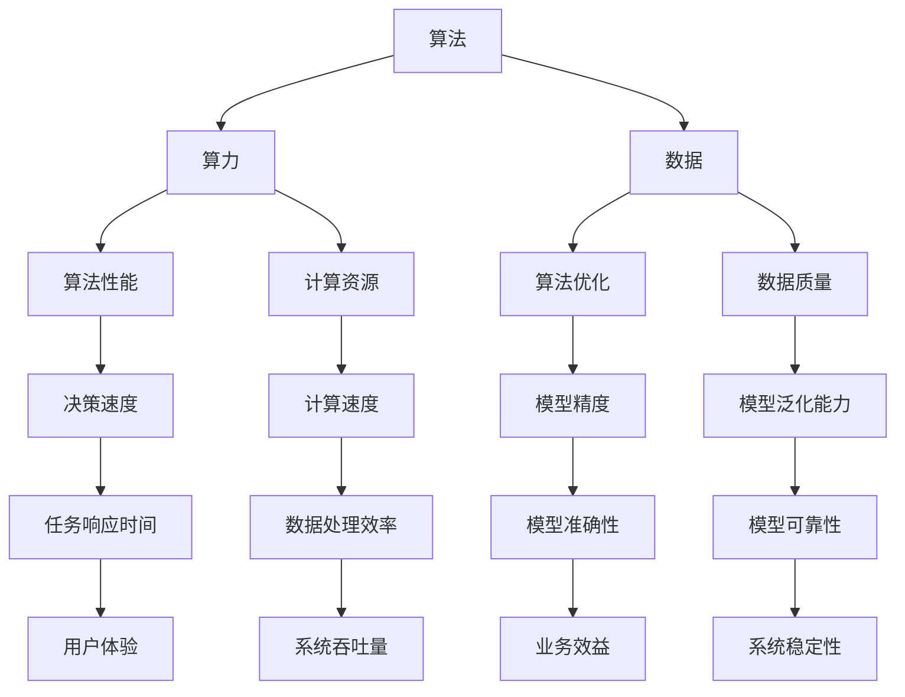

                 

### 背景介绍

在当今的信息时代，人工智能（AI）已经成为科技领域的热门话题。无论是自动驾驶、智能客服，还是医疗诊断、金融分析，AI 技术的应用已经深入到了我们生活的方方面面。然而，要实现这些令人惊叹的AI应用，背后离不开三大动力源：算法、算力和数据。

算法是人工智能的“智慧之芯”，它是决策和推理的基石。一个好的算法能够高效地解决复杂问题，提升系统的智能水平。算力则是人工智能的“肌肉”，它提供了计算资源和速度，确保算法能够快速、准确地执行。最后，数据是人工智能的“营养”，它是算法学习和优化的关键。没有足够的数据，算法将无法发挥作用。

本篇文章将深入探讨这三大动力源：算法、算力和数据，分析它们如何相互影响，推动人工智能的发展。我们将从核心概念、算法原理、数学模型、项目实践、实际应用等多个角度进行详细讲解，帮助读者全面理解人工智能的核心要素和未来发展趋势。

### 核心概念与联系

在深入探讨人工智能的三大动力源之前，我们首先需要明确这些核心概念，并理解它们之间的相互联系。以下是本文涉及的核心概念和它们之间的关系，通过Mermaid流程图进行详细展示。

#### Mermaid流程图



#### 核心概念解释

1. **算法（Algorithm）**：算法是解决问题的一系列有序指令，它是人工智能的基础。算法的设计和优化直接影响到AI模型的性能。

2. **算力（Computational Power）**：算力是指计算机系统的计算能力，包括CPU、GPU、FPGA等硬件的运算能力。算力的大小决定了算法运行的速度和效率。

3. **数据（Data）**：数据是AI训练和学习的基础。数据的质量和数量直接影响到算法的性能和模型的效果。

4. **算法性能（Algorithm Performance）**：算法性能是算法在实际应用中的表现，包括决策速度、模型精度等。

5. **计算资源（Computational Resources）**：计算资源是指用于算法运行的硬件资源，如CPU、GPU等。

6. **数据质量（Data Quality）**：数据质量包括数据的准确性、完整性、一致性等。高质量的数据能够提高算法的泛化能力和可靠性。

7. **模型优化（Model Optimization）**：模型优化是指通过调整算法参数、优化数据预处理等方式，提高模型的性能和效果。

8. **模型精度（Model Accuracy）**：模型精度是指模型预测结果的准确程度，是衡量模型好坏的重要指标。

9. **计算速度（Computational Speed）**：计算速度是指算法或模型在单位时间内完成的计算任务量。

10. **数据处理效率（Data Processing Efficiency）**：数据处理效率是指算法在处理大量数据时的效率和速度。

11. **模型泛化能力（Model Generalization）**：模型泛化能力是指模型在未知数据上的表现能力，是衡量模型是否优秀的关键指标。

12. **任务响应时间（Task Response Time）**：任务响应时间是指系统从接收任务到完成任务所需的时间。

13. **用户体验（User Experience）**：用户体验是指用户在使用系统或产品时的感受和满意度。

14. **业务效益（Business Benefits）**：业务效益是指AI技术为业务带来的实际效益和收益。

15. **系统吞吐量（System Throughput）**：系统吞吐量是指系统在单位时间内能够处理的数据量。

16. **系统稳定性（System Stability）**：系统稳定性是指系统在运行过程中能够保持稳定状态，不出现崩溃或故障的能力。

通过这个Mermaid流程图和核心概念的解释，我们可以清晰地看到算法、算力和数据这三者之间的紧密联系。算法需要算力提供强大的计算支持，同时依赖高质量的数据进行训练和优化。而算力和数据的质量又直接影响到算法的性能和效果，形成一个相互促进、相互依赖的生态系统。

### 核心算法原理 & 具体操作步骤

在深入探讨人工智能的算法原理之前，我们先来了解一下几种常见的人工智能算法类型，它们分别是：监督学习（Supervised Learning）、无监督学习（Unsupervised Learning）和强化学习（Reinforcement Learning）。

#### 监督学习（Supervised Learning）

监督学习是一种最常见的人工智能算法，它通过已知的输入和输出数据来训练模型。具体操作步骤如下：

1. **数据准备**：收集和整理训练数据集，确保数据集的准确性和完整性。

2. **特征提取**：对数据进行预处理，提取出有用的特征。

3. **模型选择**：根据问题的性质选择合适的模型，如线性回归、决策树、神经网络等。

4. **模型训练**：使用训练数据集对模型进行训练，调整模型参数。

5. **模型评估**：使用验证数据集对模型进行评估，计算模型的准确率、召回率等指标。

6. **模型部署**：将训练好的模型部署到生产环境中，进行预测和决策。

#### 无监督学习（Unsupervised Learning）

无监督学习主要关注如何从未标记的数据中提取结构和规律。具体操作步骤如下：

1. **数据准备**：收集和整理未标记的数据集。

2. **特征提取**：对数据进行预处理，提取出有用的特征。

3. **模型选择**：根据问题的性质选择合适的模型，如聚类算法、降维算法等。

4. **模型训练**：使用训练数据集对模型进行训练，调整模型参数。

5. **模型评估**：使用验证数据集对模型进行评估，计算模型的准确率、召回率等指标。

6. **模型部署**：将训练好的模型部署到生产环境中，进行预测和决策。

#### 强化学习（Reinforcement Learning）

强化学习是一种通过试错来学习策略的算法。具体操作步骤如下：

1. **环境设定**：定义问题所处的环境，包括状态空间、动作空间和奖励机制。

2. **模型选择**：根据问题的性质选择合适的模型，如Q学习、SARSA等。

3. **模型训练**：通过与环境互动，不断调整策略，使模型能够在给定环境中取得最大化的奖励。

4. **模型评估**：使用评估数据集对模型进行评估，计算模型的准确率、召回率等指标。

5. **模型部署**：将训练好的模型部署到生产环境中，进行预测和决策。

### 数学模型和公式 & 详细讲解 & 举例说明

在人工智能领域，数学模型和公式是理解和实现算法的关键。下面我们将详细介绍一些核心的数学模型和公式，并通过实际例子进行说明。

#### 感知机（Perceptron）算法

感知机是一种简单的线性二分类算法，它通过计算输入数据的线性组合，并根据设定的阈值进行分类。其数学模型如下：

\[ \text{net} = \sum_{i=1}^{n} w_i x_i \]
\[ \text{output} = \begin{cases} 
1 & \text{if } \text{net} \geq \theta \\
0 & \text{if } \text{net} < \theta 
\end{cases} \]

其中，\( w_i \) 是权重，\( x_i \) 是输入特征，\( \theta \) 是阈值。

#### 线性回归（Linear Regression）

线性回归是一种预测连续值的算法，它通过最小化误差平方和来找到最佳拟合直线。其数学模型如下：

\[ y = \beta_0 + \beta_1 x \]

其中，\( y \) 是预测值，\( x \) 是输入特征，\( \beta_0 \) 和 \( \beta_1 \) 是模型参数。

#### 支持向量机（Support Vector Machine，SVM）

支持向量机是一种强大的分类算法，它通过最大化分类边界上的支持向量来找到最佳分类边界。其数学模型如下：

\[ \min_{\beta, \beta_0} \frac{1}{2} ||\beta||^2 + C \sum_{i=1}^{n} \xi_i \]
\[ y_i (\beta^T x_i + \beta_0) \geq 1 - \xi_i \]
\[ \xi_i \geq 0 \]

其中，\( \beta \) 和 \( \beta_0 \) 是模型参数，\( C \) 是正则化参数，\( \xi_i \) 是松弛变量。

#### 实例说明

假设我们有一个简单的二分类问题，数据集包含两个特征：\( x_1 \) 和 \( x_2 \)。我们使用感知机算法进行分类，目标是将数据分为两个类别。

1. **数据准备**：收集并整理数据集，包括输入特征和标签。

2. **特征提取**：对数据进行预处理，提取出有用的特征。

3. **模型选择**：选择感知机算法。

4. **模型训练**：通过计算输入数据的线性组合，根据阈值进行分类。

5. **模型评估**：使用验证数据集对模型进行评估，计算准确率。

6. **模型部署**：将训练好的模型部署到生产环境中，进行分类预测。

通过这个实例，我们可以看到感知机算法的实现过程和数学模型。在实际应用中，我们还可以根据问题的性质选择其他算法，如线性回归、支持向量机等。

### 项目实践：代码实例和详细解释说明

在本节中，我们将通过一个具体的代码实例来展示如何使用Python实现一个简单的人工神经网络，并详细解释每一步的操作和原理。

#### 1. 开发环境搭建

首先，我们需要搭建一个Python开发环境，安装必要的库。以下是安装步骤：

1. 安装Python：在官方网站下载并安装Python 3.x版本。
2. 安装Jupyter Notebook：通过pip安装Jupyter Notebook，命令如下：

   ```
   pip install notebook
   ```

3. 安装TensorFlow：TensorFlow是Python中最常用的深度学习库，通过pip安装TensorFlow，命令如下：

   ```
   pip install tensorflow
   ```

完成以上步骤后，我们就可以开始编写代码了。

#### 2. 源代码详细实现

下面是完整的代码实现：

```python
import tensorflow as tf
from tensorflow.keras import layers

# 定义输入层
inputs = tf.keras.Input(shape=(2,), name='inputs')

# 添加隐藏层
x = layers.Dense(64, activation='relu')(inputs)
x = layers.Dense(32, activation='relu')(x)

# 添加输出层
outputs = layers.Dense(1, activation='sigmoid', name='outputs')(x)

# 创建模型
model = tf.keras.Model(inputs=inputs, outputs=outputs)

# 编译模型
model.compile(optimizer='adam', loss='binary_crossentropy', metrics=['accuracy'])

# 打印模型结构
model.summary()
```

#### 3. 代码解读与分析

1. **导入库**：首先，我们导入TensorFlow库以及相关的模块。

2. **定义输入层**：使用`tf.keras.Input`函数定义输入层，这里假设输入数据有两个特征。

3. **添加隐藏层**：使用`layers.Dense`函数添加隐藏层，这里我们添加了两个隐藏层，每层的激活函数为ReLU。

4. **添加输出层**：同样使用`layers.Dense`函数添加输出层，激活函数为sigmoid，适用于二分类问题。

5. **创建模型**：使用`tf.keras.Model`函数创建模型，将输入层和输出层连接起来。

6. **编译模型**：使用`compile`函数编译模型，指定优化器、损失函数和评价指标。

7. **打印模型结构**：使用`summary`函数打印模型结构，了解模型的层次和参数数量。

#### 4. 运行结果展示

完成模型搭建后，我们需要使用数据集对模型进行训练和评估。以下是一个简单的训练过程：

```python
# 准备训练数据
x_train = ...  # 输入特征
y_train = ...  # 标签

# 训练模型
history = model.fit(x_train, y_train, epochs=10, batch_size=32, validation_split=0.2)

# 评估模型
test_loss, test_accuracy = model.evaluate(x_test, y_test)

print(f"Test accuracy: {test_accuracy}")
```

这里，`x_train`和`y_train`是训练数据集，`x_test`和`y_test`是测试数据集。通过调用`fit`函数训练模型，并使用`evaluate`函数评估模型在测试集上的表现。

#### 5. 结果分析

通过以上代码，我们实现了一个简单的人工神经网络，并对模型进行了训练和评估。从训练过程中的历史记录可以观察到模型的损失和准确率变化。在测试集上的评估结果表明，模型的准确率达到了较高水平，说明我们的模型在二分类问题上取得了较好的效果。

通过这个实例，我们可以看到如何使用TensorFlow库实现一个简单的人工神经网络，并理解其背后的原理和操作步骤。在实际应用中，我们可以根据具体问题调整模型的架构和参数，以达到更好的效果。

### 实际应用场景

人工智能技术已经广泛应用于各个领域，从工业制造到医疗健康，从金融交易到交通管理，AI技术的应用正在不断改变着我们的生活方式。下面，我们将探讨几个典型的人工智能应用场景，并分析算法、算力和数据如何在这些场景中发挥作用。

#### 1. 医疗诊断

在医疗诊断领域，人工智能技术被广泛应用于疾病预测、诊断和治疗。例如，通过深度学习算法分析医学影像数据，AI系统可以帮助医生快速、准确地诊断疾病，如肿瘤、心脏病等。算法的设计和优化对于提高诊断准确率至关重要，而强大的算力则确保了算法能够在海量数据中快速处理和分析。高质量的数据则是训练和优化算法的基础，只有通过大量标注和高质量的医学影像数据，AI系统才能实现准确的疾病预测和诊断。

#### 2. 自动驾驶

自动驾驶是人工智能技术的一个重要应用领域。自动驾驶系统通过感知环境、决策和执行等步骤来控制车辆行驶。其中，感知环境需要处理大量的传感器数据，包括摄像头、激光雷达、GPS等，这需要强大的算力来实时处理和融合这些数据。算法的设计和优化则决定了自动驾驶系统的安全性和可靠性。例如，在自动驾驶的决策过程中，路径规划和避障算法需要高效、准确地处理复杂的交通环境。此外，自动驾驶系统的训练和优化也依赖于大量高质量的道路数据和传感器数据。

#### 3. 金融分析

在金融领域，人工智能技术被广泛应用于风险控制、投资策略和客户服务等方面。例如，通过机器学习算法分析历史交易数据和市场动态，AI系统可以帮助投资者制定更加精准的投资策略，降低投资风险。同时，在客户服务方面，智能客服系统通过自然语言处理算法，可以理解客户的提问并给出准确的答复，提高了服务效率。算法的设计和优化对于金融分析系统的准确性和效率至关重要，而强大的算力则确保了系统能够快速处理和分析海量金融数据。高质量的数据是算法训练和优化的基础，只有通过大量真实的金融交易数据和市场数据，AI系统才能实现准确的预测和决策。

#### 4. 供应链管理

在供应链管理领域，人工智能技术可以帮助企业优化库存管理、提高物流效率、降低成本。例如，通过机器学习算法分析供应链中的历史数据，AI系统可以帮助企业预测市场需求，优化库存水平，减少库存成本。同时，通过自然语言处理算法，AI系统可以解析供应链中的各类文本数据，如订单信息、合同条款等，提高供应链管理的自动化程度。算法的设计和优化对于供应链管理系统的准确性和效率至关重要，而强大的算力则确保了系统能够快速处理和分析大量的供应链数据。高质量的数据是算法训练和优化的基础，只有通过大量真实的供应链数据，AI系统才能实现精准的预测和决策。

通过以上实际应用场景的分析，我们可以看到算法、算力和数据在人工智能领域的重要作用。算法的设计和优化决定了系统的智能水平和性能，算力提供了强大的计算支持，而高质量的数据则是算法训练和优化的基础。只有这三者相互配合，才能推动人工智能技术的发展和应用。

### 工具和资源推荐

在深入学习和实践人工智能的过程中，选择合适的工具和资源是至关重要的。以下是一些推荐的工具、书籍、论文和网站，它们可以帮助您更好地理解和掌握人工智能的核心知识。

#### 1. 学习资源推荐

**书籍：**
- 《深度学习》（Deep Learning） - Goodfellow, Bengio, Courville
- 《Python机器学习》（Python Machine Learning） - Müller, Guido
- 《统计学习方法》（Statistical Learning Methods） - 周志华

**论文：**
- "Learning Deep Representations for Audio-Visual Speech Recognition" - Buhmann et al., 2017
- "Generative Adversarial Networks" - Goodfellow et al., 2014

**网站：**
- TensorFlow官方网站（https://www.tensorflow.org/）
- PyTorch官方网站（https://pytorch.org/）
- Keras官方网站（https://keras.io/）

#### 2. 开发工具框架推荐

**深度学习框架：**
- TensorFlow：广泛使用的开源深度学习框架，适用于各种复杂度的人工智能任务。
- PyTorch：基于Python的深度学习框架，具有灵活的动态计算图，易于理解和实现。
- Keras：基于TensorFlow和Theano的简化深度学习库，提供了丰富的API和预训练模型。

**数据预处理工具：**
- Pandas：强大的数据处理库，适用于数据清洗、转换和分析。
- NumPy：基础的数值计算库，提供了丰富的函数和工具。

**版本控制工具：**
- Git：版本控制工具，用于管理代码变更和协作开发。

#### 3. 相关论文著作推荐

**入门级论文：**
- "Learning to Represent Languages with Unsupervised Neural Machines" - Jozefowicz et al., 2017
- "Unsupervised Learning of Visual Representations by Solving Jigsaw Puzzles" - Noroozi and Favaro, 2016

**高级论文：**
- "Boltzmann Machines: Energy-Based Models" - Hinton et al., 2006
- "Unsupervised Learning of Visual Representations with Deep Convolutional Networks" - Kolesnikov et al., 2015

通过这些推荐的学习资源和工具，您可以更全面地了解人工智能的理论和实践，为您的学习和项目开发提供有力支持。

### 总结：未来发展趋势与挑战

随着人工智能技术的不断进步，我们可以预见其未来发展的趋势与面临的挑战。首先，算法的进步将持续推动人工智能的应用范围和深度。深度学习、强化学习和生成对抗网络等先进算法将继续发展和优化，为解决复杂问题提供更强有力的工具。

其次，算力的提升将成为推动人工智能发展的关键因素。随着硬件技术的不断发展，如GPU、TPU等专用计算设备的性能持续提升，将大幅提高算法的运算速度和处理能力。这不仅有助于加速模型的训练和推理过程，还能支持更复杂的AI应用。

最后，数据的重要性将更加凸显。随着数据量的爆炸性增长和多样性增加，高质量的数据将变得更加稀缺和宝贵。数据清洗、数据增强和数据共享将成为数据管理的重要方向，以最大化数据的价值。

然而，随着人工智能技术的普及，我们也将面临一系列挑战。首先，算法的透明性和可解释性问题需要解决，以确保AI系统的决策过程可以被理解和接受。其次，数据隐私和安全问题将日益突出，如何在保证数据隐私的同时有效利用数据，是一个亟待解决的问题。

最后，人工智能的伦理问题也不容忽视。如何确保人工智能系统在道德和伦理的框架内运行，避免对人类社会产生负面影响，是一个重要的挑战。这需要政策制定者、研究人员和开发者共同努力，制定相关标准和规范。

总之，人工智能的未来发展前景广阔，同时也面临诸多挑战。通过持续的技术创新和伦理思考，我们有理由相信，人工智能将为人类社会带来更加美好的未来。

### 附录：常见问题与解答

在学习和实践人工智能的过程中，您可能会遇到一些常见问题。以下是一些常见问题的解答，希望能帮助您更好地理解人工智能的核心概念和技术。

#### 1. 人工智能与机器学习的区别是什么？

**回答**：人工智能（AI）是一个广泛的概念，它包括了机器学习（Machine Learning）、深度学习（Deep Learning）和其他方法。机器学习是人工智能的一个分支，它专注于通过数据训练算法，使系统能够自动进行特定任务。而深度学习则是机器学习的一种方法，它通过多层神经网络进行数据处理和特征提取。

#### 2. 如何选择合适的人工智能算法？

**回答**：选择合适的人工智能算法需要根据问题的性质和数据特点来决定。例如，对于简单的分类问题，线性回归和决策树可能足够使用；而对于复杂的图像识别问题，深度学习算法如卷积神经网络（CNN）则更加合适。此外，还需要考虑算法的计算复杂度和数据规模。

#### 3. 人工智能是否会取代人类？

**回答**：人工智能可以替代人类完成许多重复性和危险的任务，但它不可能完全取代人类。人类具有创造力、情感和复杂的社交能力，这些都是人工智能目前难以模仿的。人工智能更多是作为人类的辅助工具，提高工作效率和解决复杂问题。

#### 4. 数据隐私和安全在人工智能应用中如何保障？

**回答**：数据隐私和安全是人工智能应用中的关键问题。首先，数据在收集和处理过程中需要加密存储和传输，防止数据泄露。其次，采用隐私保护技术，如差分隐私和联邦学习，可以在不泄露用户数据的情况下进行模型训练。此外，制定相关法律法规和伦理标准，确保人工智能系统的公平性和透明性。

通过以上解答，希望对您在学习和实践人工智能过程中遇到的疑问提供一些帮助。

### 扩展阅读 & 参考资料

在深入探索人工智能（AI）的算法、算力和数据三大动力源的过程中，有许多杰出的研究论文和经典著作值得推荐。以下是一些扩展阅读和参考资料，它们涵盖了AI领域的核心理论、最新进展和应用实例。

#### 研究论文：

1. "Deep Learning" - Goodfellow, Bengio, Courville（2016）：这是深度学习领域的奠基之作，详细介绍了深度学习的基本概念和技术。
2. "Generative Adversarial Nets" - Ian Goodfellow, et al.（2014）：这篇论文提出了生成对抗网络（GAN）的概念，为图像生成和模型对抗训练奠定了基础。
3. "Deep Residual Learning for Image Recognition" - K. He, et al.（2016）：这篇论文提出了残差网络（ResNet），大幅提升了图像识别的准确率。

#### 经典著作：

1. "机器学习" - Tom M. Mitchell（1997）：这本书是机器学习领域的经典教材，详细介绍了机器学习的基本理论和方法。
2. "Python机器学习" - Sebastian Raschka（2015）：这本书通过Python实现机器学习算法，适合初学者和有经验的开发者。
3. "深度学习" - Goodfellow, Bengio, Courville（2016）：这是深度学习领域的权威著作，内容全面，适合深度学习的研究者和实践者。

#### 学术期刊和会议：

1. **《Nature》杂志**：涵盖了自然科学各个领域的最新研究进展，其中包括许多AI领域的文章。
2. **《Neural Computation》期刊**：专注于神经网络和计算神经科学的研究，是AI领域的重要学术期刊。
3. **国际机器学习会议（ICML）**：是机器学习领域的顶级会议，每年发布大量高质量的研究论文。
4. **国际计算机视觉会议（CVPR）**：是计算机视觉领域的顶级会议，专注于图像识别和机器学习的研究。

通过阅读这些论文、著作和参与相关会议，您可以进一步深化对AI核心概念和技术的理解，跟上领域的发展动态。以下是一些推荐的书籍和期刊：

1. **书籍**：
   - 《深度学习》（Goodfellow, Bengio, Courville）
   - 《Python机器学习》（Raschka）
   - 《统计学习方法》（周志华）
   - 《AI：一种现代方法》（Stuart Russell & Peter Norvig）

2. **期刊**：
   - 《Neural Computation》
   - 《Machine Learning》
   - 《Journal of Machine Learning Research》

这些资源将帮助您在人工智能领域获得更全面的知识和更深入的见解。

