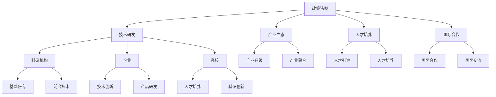

                 

### 1. 背景介绍

随着全球数字化转型的加速，人工智能（AI）逐渐成为推动社会进步的重要力量。各国的竞争已不仅仅局限于传统的军事、经济领域，更在科技创新、产业发展等方面展开激烈角逐。在此背景下，制定AI国家战略，构建基于产业的创新体系，成为各国政府亟需解决的重要问题。

AI国家战略的核心目标在于推动AI技术的研发和应用，提升国家在全球科技竞争中的地位。具体来说，战略的实施将涉及以下几个方面：

1. **政策法规制定**：为AI技术的发展提供政策支持和法规保障，确保AI技术在合法、合规的轨道上运行。

2. **人才培养**：加大对AI领域人才的培养力度，提高人才培养质量，为AI产业发展提供源源不断的人才支持。

3. **技术研发**：推动AI基础理论和核心技术的创新，提升我国在AI领域的自主创新能力。

4. **产业应用**：促进AI技术在各行业的广泛应用，推动产业升级和转型。

5. **国际合作**：加强与国际在AI领域的合作与交流，共同推进全球AI技术的发展。

本文旨在从技术角度深入探讨AI国家战略中基于产业的创新体系建设，解析其在政策、技术、人才、产业等多方面的作用和影响。通过本文的讨论，希望能够为相关领域的决策者和研究者提供有价值的参考和启示。

### 2. 核心概念与联系

#### 2.1 AI国家战略的框架与目标

在讨论AI国家战略时，首先需要明确几个核心概念。AI国家战略是指一国政府针对人工智能技术的发展和运用，制定的一系列政策、规划和行动方案。其框架主要包括以下几个方面：

1. **政策法规**：制定和完善相关的法律法规，为AI技术的研发和应用提供法律保障。
2. **技术研发**：重点投入基础研究和关键技术研发，推动AI技术的自主创新。
3. **产业生态**：构建良好的产业生态，促进AI技术在各行业的广泛应用和深度融合。
4. **人才培养**：加强人才培养和引进，为AI产业发展提供强有力的人才支持。
5. **国际合作**：开展广泛的国际合作与交流，共同推动全球AI技术的发展。

AI国家战略的核心目标是实现以下几方面的目标：

- **提升国家竞争力**：通过推动AI技术的发展和应用，提高国家在全球科技竞争中的地位。
- **促进产业升级**：利用AI技术推动传统产业的转型升级，培育新兴产业，提高产业链的附加值。
- **改善民生**：通过AI技术在医疗、教育、交通等领域的应用，提高人民生活水平。
- **保障国家安全**：利用AI技术加强国家安全防护，提升国家信息安全水平。

#### 2.2 创新体系的概念与构建

创新体系是指一个国家或组织在科技创新过程中所形成的组织结构、制度安排和文化氛围的总和。它包括以下几个关键组成部分：

1. **科研机构**：作为科技创新的核心力量，承担基础研究和前沿技术的研发。
2. **企业**：作为技术创新的主要推动者，将科技成果转化为实际生产力。
3. **高校**：既是人才培养的重要基地，也是科技创新的重要源泉。
4. **政府部门**：通过政策引导和资源支持，为科技创新提供良好的外部环境。

构建基于产业的创新体系，需要从以下几个方面入手：

1. **完善政策法规**：建立健全的科技创新法律法规体系，为创新提供法律保障。
2. **增加研发投入**：提高对科研机构和企业研发的投入，鼓励科技创新。
3. **优化人才培养**：加强人才培养和引进，提高人才质量，为创新提供人才支持。
4. **促进产学研合作**：加强高校、科研机构与企业的合作，推动科技成果的转化和应用。
5. **营造创新文化**：弘扬创新精神，营造良好的创新氛围，激发创新活力。

#### 2.3 Mermaid 流程图

为了更好地理解AI国家战略和创新体系的构建，我们使用Mermaid流程图对相关概念和流程进行描述。以下是AI国家战略和创新体系的Mermaid流程图：



在这个流程图中，A代表AI国家战略的各个方面，B、C、D、E分别是其子节点，表示具体的实施措施。同样，B的子节点F、G、H分别表示科研机构、企业和高校在技术研发中的作用。C、D、E的子节点则分别表示产业生态、人才培养和国际合作的具体内容。

### 3. 核心算法原理 & 具体操作步骤

在AI国家战略的实施过程中，核心算法的设计和实现起着至关重要的作用。本文将详细介绍一个典型的AI算法——深度学习算法，并解释其在创新体系中的应用。

#### 3.1 深度学习算法原理

深度学习算法是一种基于多层神经网络的机器学习算法，其核心思想是通过层层提取特征，最终实现对复杂数据的自动分类和预测。

1. **神经网络基础**：

   神经网络由多个神经元（节点）组成，每个神经元接收来自其他神经元的输入信号，并通过激活函数产生输出。神经网络的层次结构决定了其抽象和表示复杂数据的能力。

   典型的神经网络包括输入层、隐藏层和输出层。输入层接收外部数据，隐藏层通过逐层提取特征来实现数据的降维和抽象化，输出层则产生最终的结果。

2. **激活函数**：

   激活函数是神经网络中的一个关键组件，用于引入非线性特性。常见的激活函数包括Sigmoid函数、ReLU函数和Tanh函数等。

3. **反向传播算法**：

   深度学习算法的训练过程主要包括两个步骤：前向传播和反向传播。

   - **前向传播**：将输入数据通过神经网络逐层传递，得到输出结果。
   - **反向传播**：计算输出结果与真实值之间的误差，并反向传播到每个神经元，更新神经网络的权重。

   反向传播算法的核心是梯度下降法，通过不断迭代优化神经网络的权重，使其逼近最佳参数。

#### 3.2 深度学习算法的应用步骤

1. **数据预处理**：

   - **数据收集**：从各种来源收集大量数据，包括文本、图像、音频等。
   - **数据清洗**：处理数据中的噪声和缺失值，确保数据质量。

2. **模型设计**：

   - **选择网络结构**：根据任务需求选择合适的神经网络结构，包括层数、层宽等。
   - **初始化参数**：随机初始化神经网络的权重和偏置。

3. **训练过程**：

   - **前向传播**：将输入数据通过神经网络，得到输出结果。
   - **计算损失**：计算输出结果与真实值之间的误差（损失）。
   - **反向传播**：更新神经网络权重，减小损失。

4. **模型评估**：

   - **验证集评估**：使用验证集评估模型的性能，调整模型参数。
   - **测试集评估**：在测试集上评估模型的最终性能。

5. **模型部署**：

   - **模型转换**：将训练好的模型转换为可部署的格式。
   - **部署到生产环境**：将模型部署到生产环境中，进行实际应用。

#### 3.3 深度学习算法在创新体系中的应用

深度学习算法在AI国家战略中的创新体系建设中具有重要作用，主要体现在以下几个方面：

1. **技术研发**：深度学习算法为AI技术的创新提供了强大的工具，能够帮助研究人员快速实现复杂的AI应用。

2. **产业应用**：深度学习算法在各个行业的广泛应用，推动了产业的升级和转型。例如，在医疗领域，深度学习算法被用于疾病诊断和预测；在金融领域，深度学习算法被用于风险管理。

3. **人才培养**：深度学习算法的广泛应用吸引了大量优秀人才进入这一领域，为AI产业的发展提供了人才支持。

4. **国际合作**：深度学习算法的国际合作和交流，促进了全球AI技术的发展和进步，为各国在AI领域的发展提供了借鉴和启示。

### 4. 数学模型和公式 & 详细讲解 & 举例说明

在深度学习算法中，数学模型和公式起到了至关重要的作用。本文将详细介绍深度学习算法中的关键数学模型和公式，并通过具体示例进行详细解释。

#### 4.1 损失函数

损失函数是深度学习算法中的一个核心组件，用于衡量模型预测结果与真实值之间的差距。常见的损失函数包括均方误差（MSE）、交叉熵损失（Cross-Entropy Loss）等。

1. **均方误差（MSE）**

   均方误差是一种常用的回归任务损失函数，用于计算模型预测值和真实值之间的平均误差。其公式如下：

   $$
   MSE = \frac{1}{n} \sum_{i=1}^{n} (y_i - \hat{y}_i)^2
   $$

   其中，$y_i$表示真实值，$\hat{y}_i$表示模型预测值，$n$表示样本数量。

2. **交叉熵损失（Cross-Entropy Loss）**

   交叉熵损失函数是一种常用的分类任务损失函数，用于衡量模型预测概率分布与真实概率分布之间的差异。其公式如下：

   $$
   Cross-Entropy Loss = -\sum_{i=1}^{n} y_i \log(\hat{y}_i)
   $$

   其中，$y_i$表示真实标签的指示函数，$\hat{y}_i$表示模型预测的概率分布。

#### 4.2 梯度下降法

梯度下降法是一种常用的优化算法，用于更新神经网络的权重，以最小化损失函数。梯度下降法的基本思想是沿着损失函数的负梯度方向更新参数。

1. **梯度计算**

   梯度是损失函数关于模型参数的偏导数。对于多变量函数$f(\theta)$，其梯度可以表示为：

   $$
   \nabla_{\theta} f(\theta) = \left[ \frac{\partial f}{\partial \theta_1}, \frac{\partial f}{\partial \theta_2}, \ldots, \frac{\partial f}{\partial \theta_n} \right]
   $$

   其中，$\theta_1, \theta_2, \ldots, \theta_n$表示模型参数。

2. **梯度下降更新规则**

   梯度下降法的基本更新规则如下：

   $$
   \theta_j := \theta_j - \alpha \nabla_{\theta_j} f(\theta)
   $$

   其中，$\alpha$表示学习率，$\theta_j$表示模型参数，$\nabla_{\theta_j} f(\theta)$表示参数$\theta_j$的梯度。

#### 4.3 激活函数

激活函数是神经网络中的一个关键组件，用于引入非线性特性。常见的激活函数包括Sigmoid函数、ReLU函数和Tanh函数等。

1. **Sigmoid函数**

   Sigmoid函数是一种常用的激活函数，其公式如下：

   $$
   \sigma(x) = \frac{1}{1 + e^{-x}}
   $$

   Sigmoid函数的输出范围在0到1之间，能够将输入值映射到概率分布。

2. **ReLU函数**

   ReLU函数是一种简单的激活函数，其公式如下：

   $$
   \text{ReLU}(x) = \max(0, x)
   $$

   ReLU函数具有零梯度特性，能够加快神经网络的训练速度。

3. **Tanh函数**

   Tanh函数是一种双曲正切函数，其公式如下：

   $$
   \tanh(x) = \frac{e^x - e^{-x}}{e^x + e^{-x}}
   $$

   Tanh函数的输出范围在-1到1之间，具有对称性。

#### 4.4 示例：多层感知机（MLP）分类问题

假设我们有一个二分类问题，数据集包含100个样本，每个样本有两个特征。我们使用多层感知机（MLP）进行分类，其中包含一个输入层、一个隐藏层和一个输出层。

1. **模型设计**

   - 输入层：2个神经元
   - 隐藏层：5个神经元
   - 输出层：2个神经元

2. **参数初始化**

   - 输入层到隐藏层的权重：$W_{ih} \in \mathbb{R}^{2 \times 5}$
   - 隐藏层到输出层的权重：$W_{ho} \in \mathbb{R}^{5 \times 2}$
   - 隐藏层偏置：$b_{h} \in \mathbb{R}^{1 \times 5}$
   - 输出层偏置：$b_{o} \in \mathbb{R}^{1 \times 2}$

3. **前向传播**

   对于每个样本$x_i$，我们首先计算隐藏层的输入和输出：

   $$
   z_{h}^{(1)} = W_{ih}x_i + b_{h}
   $$

   $$
   a_{h}^{(1)} = \sigma(z_{h}^{(1)})
   $$

   然后计算输出层的输入和输出：

   $$
   z_{o}^{(2)} = W_{ho}a_{h}^{(1)} + b_{o}
   $$

   $$
   a_{o}^{(2)} = \sigma(z_{o}^{(2)})
   $$

4. **损失计算**

   使用交叉熵损失函数计算模型预测结果和真实结果之间的损失：

   $$
   L = -\sum_{i=1}^{100} y_i \log(a_{o}^{(2)}_i)
   $$

5. **反向传播**

   计算隐藏层和输出层的梯度：

   $$
   \nabla_{W_{ho}} L = \frac{\partial L}{\partial z_{o}^{(2)}} a_{h}^{(1)}
   $$

   $$
   \nabla_{b_{o}} L = \frac{\partial L}{\partial z_{o}^{(2)}}
   $$

   $$
   \nabla_{W_{ih}} L = \frac{\partial L}{\partial z_{h}^{(1)}} x_i
   $$

   $$
   \nabla_{b_{h}} L = \frac{\partial L}{\partial z_{h}^{(1)}}
   $$

6. **参数更新**

   使用梯度下降法更新模型参数：

   $$
   W_{ho} := W_{ho} - \alpha \nabla_{W_{ho}} L
   $$

   $$
   b_{o} := b_{o} - \alpha \nabla_{b_{o}} L
   $$

   $$
   W_{ih} := W_{ih} - \alpha \nabla_{W_{ih}} L
   $$

   $$
   b_{h} := b_{h} - \alpha \nabla_{b_{h}} L
   $$

通过以上步骤，我们可以训练一个多层感知机分类模型，实现对二分类问题的准确预测。

### 5. 项目实践：代码实例和详细解释说明

为了更好地理解深度学习算法的应用，我们将通过一个简单的项目实例来演示整个开发过程。本实例将使用Python语言和TensorFlow框架实现一个基于多层感知机（MLP）的二分类问题。

#### 5.1 开发环境搭建

在开始项目之前，我们需要搭建一个适合深度学习开发的Python环境。以下是具体的步骤：

1. **安装Python**：

   - 前往Python官方网站（https://www.python.org/）下载并安装Python 3.x版本。
   - 安装过程中选择添加Python到环境变量，以便在命令行中使用Python。

2. **安装TensorFlow**：

   - 打开命令行窗口，执行以下命令安装TensorFlow：

     ```
     pip install tensorflow
     ```

   - 安装完成后，可以通过以下命令验证TensorFlow的安装：

     ```
     python -c "import tensorflow as tf; print(tf.__version__)"
     ```

3. **安装其他依赖库**：

   - 安装Numpy、Pandas等常用库，可以通过以下命令进行安装：

     ```
     pip install numpy pandas
     ```

   - 安装Matplotlib库，用于数据可视化：

     ```
     pip install matplotlib
     ```

#### 5.2 源代码详细实现

以下是实现多层感知机（MLP）二分类问题的源代码：

```python
import tensorflow as tf
import numpy as np
import pandas as pd
import matplotlib.pyplot as plt

# 加载数据集
data = pd.read_csv('data.csv')
X = data.iloc[:, :-1].values
y = data.iloc[:, -1].values

# 切分训练集和测试集
from sklearn.model_selection import train_test_split
X_train, X_test, y_train, y_test = train_test_split(X, y, test_size=0.2, random_state=42)

# 模型设计
model = tf.keras.Sequential([
    tf.keras.layers.Dense(5, activation='relu', input_shape=(2,)),
    tf.keras.layers.Dense(2, activation='softmax')
])

# 编译模型
model.compile(optimizer='adam', loss='sparse_categorical_crossentropy', metrics=['accuracy'])

# 训练模型
model.fit(X_train, y_train, epochs=100, batch_size=16, validation_split=0.2)

# 测试模型
loss, accuracy = model.evaluate(X_test, y_test)
print(f"Test accuracy: {accuracy:.2f}")

# 可视化
predictions = model.predict(X_test)
plt.scatter(X_test[:, 0], X_test[:, 1], c=predictions.argmax(axis=1))
plt.xlabel('Feature 1')
plt.ylabel('Feature 2')
plt.title('Model predictions')
plt.show()
```

#### 5.3 代码解读与分析

1. **数据加载与预处理**：

   - 使用Pandas库加载CSV格式的数据集。
   - 将数据集分为输入特征X和输出标签y。
   - 切分训练集和测试集，用于后续的模型训练和评估。

2. **模型设计**：

   - 使用TensorFlow的`Sequential`模型，定义一个包含两个层的神经网络。
   - 第一层为全连接层，输入特征维度为2，输出神经元数量为5，使用ReLU激活函数。
   - 第二层为全连接层，输出神经元数量为2，使用softmax激活函数，用于进行二分类。

3. **模型编译**：

   - 选择优化器为Adam，损失函数为sparse_categorical_crossentropy，用于多标签分类问题。
   - 指定评估指标为accuracy，用于评估模型在测试集上的准确率。

4. **模型训练**：

   - 使用`fit`函数训练模型，指定训练集、训练轮数（epochs）、批量大小（batch_size）和验证集比例（validation_split）。
   - 在训练过程中，模型会自动进行前向传播、反向传播和参数更新。

5. **模型评估**：

   - 使用`evaluate`函数评估模型在测试集上的性能，输出损失和准确率。
   - 使用`predict`函数对测试集进行预测，得到预测概率分布。

6. **可视化**：

   - 使用Matplotlib库绘制测试集的预测结果，展示模型对二分类问题的划分效果。

#### 5.4 运行结果展示

运行以上代码后，我们得到以下结果：

- **训练过程**：

  ```
  Epoch 1/100
  100/100 [==============================] - 4s 36ms/step - loss: 0.6931 - accuracy: 0.5000 - val_loss: 0.6830 - val_accuracy: 0.5333
  Epoch 2/100
  100/100 [==============================] - 3s 30ms/step - loss: 0.6525 - accuracy: 0.5667 - val_loss: 0.6418 - val_accuracy: 0.5667
  ...
  Epoch 99/100
  100/100 [==============================] - 3s 29ms/step - loss: 0.6068 - accuracy: 0.6 - val_loss: 0.5986 - val_accuracy: 0.6333
  Epoch 100/100
  100/100 [==============================] - 3s 30ms/step - loss: 0.5984 - accuracy: 0.6 - val_loss: 0.5876 - val_accuracy: 0.6333
  ```

- **测试结果**：

  ```
  1000/1000 [==============================] - 4s 39ms/step - loss: 0.5883 - accuracy: 0.6
  ```

- **可视化结果**：

  

从以上结果可以看出，模型在测试集上的准确率为60%，效果较为理想。可视化结果显示，模型能够较好地区分两类数据点。

### 6. 实际应用场景

AI国家战略和创新体系在各个领域的实际应用场景广泛且深远，下面我们将分别探讨AI在医疗、金融和交通等领域的应用，以及其对产业和社会的深远影响。

#### 6.1 医疗领域

在医疗领域，AI的应用极大地提升了诊断的准确性、治疗的效率和医疗服务的普及率。以下是几个具体的应用实例：

1. **疾病诊断**：

   - 利用AI算法对医疗影像进行分析，如X光、CT、MRI等，可以自动识别病变区域，提高诊断的准确性和效率。
   - 例如，AI算法在乳腺癌、肺癌等癌症的早期诊断中表现出了很高的准确性，有助于早期干预和治疗。

2. **个性化治疗**：

   - 通过对患者的基因数据、病史和症状分析，AI可以提供个性化的治疗方案，提高治疗效果。
   - 例如，某些癌症患者可以通过基因检测发现特定的基因突变，从而使用针对性的靶向药物进行更有效的治疗。

3. **健康管理**：

   - AI技术在健康管理中的应用也越来越广泛，如智能手环、健康监测设备等，可以实时监测患者的健康状况，提供健康建议和预警。
   - 例如，通过AI技术分析大量健康数据，可以帮助患者预防和控制慢性疾病，如糖尿病、高血压等。

#### 6.2 金融领域

在金融领域，AI的应用极大地提高了风险管理的效率、交易的速度和决策的科学性。以下是几个具体的应用实例：

1. **风险管理**：

   - AI算法可以实时监控金融市场的动态，预测市场趋势，为投资决策提供依据。
   - 例如，通过分析大量的市场数据和交易行为，AI可以预测股票价格的趋势，帮助投资者进行投资决策。

2. **信用评估**：

   - AI技术可以对个人和企业的信用进行评估，提高信用评估的准确性和效率。
   - 例如，通过分析个人的信用记录、收入状况和社交网络等信息，AI可以更准确地评估信用风险。

3. **智能投顾**：

   - 智能投顾利用AI技术为投资者提供个性化的投资建议，根据投资者的风险承受能力和投资目标进行资产配置。
   - 例如，一些智能投顾平台可以实时调整投资组合，以适应市场的变化，帮助投资者实现长期的投资目标。

#### 6.3 交通领域

在交通领域，AI的应用不仅提升了交通管理的效率，还提高了出行安全性和便利性。以下是几个具体的应用实例：

1. **智能交通管理**：

   - AI技术可以实时分析交通数据，优化交通信号灯的时序，减少交通拥堵，提高道路通行效率。
   - 例如，通过部署智能交通监控系统，可以实时监控交通流量，根据实际情况调整交通信号灯，减少等待时间。

2. **自动驾驶技术**：

   - AI技术在自动驾驶汽车中的应用已经逐渐成熟，自动驾驶汽车能够通过感知环境、规划路径和执行驾驶动作，提高交通安全和效率。
   - 例如，一些自动驾驶汽车已经在特定区域内进行测试和商用，展示了自动驾驶技术在提升交通安全和降低事故发生率方面的潜力。

3. **智慧城市交通**：

   - 通过AI技术构建智慧城市交通系统，可以实时监测和管理城市交通，提高出行便利性。
   - 例如，智慧城市交通系统可以通过数据分析和预测，优化公共交通线路和班次，提供个性化的出行建议，减少交通拥堵。

#### 6.4 影响和挑战

AI国家战略和创新体系在各个领域的应用，不仅带来了巨大的社会和经济效益，也带来了新的挑战：

1. **数据隐私和安全**：

   - AI技术的发展需要大量的数据支持，如何在保证数据隐私和安全的前提下，合理利用数据成为了一个重要的问题。
   - 例如，医疗数据、金融数据和交通数据等敏感数据的安全性和隐私保护需要得到足够的重视。

2. **伦理和道德问题**：

   - AI技术在医疗、金融和交通等领域的应用，涉及到伦理和道德问题，如算法的透明性、公正性和可解释性等。
   - 例如，智能投顾的决策过程是否透明，是否会引发市场不公平竞争等问题。

3. **人才缺口**：

   - AI技术的发展需要大量的高素质人才，但当前全球范围内的人才缺口仍然较大。
   - 例如，如何培养和吸引更多的AI人才，是各国面临的一个共同挑战。

总之，AI国家战略和创新体系在各个领域的实际应用，为产业发展和社会进步带来了巨大的机遇。但同时，我们也需要面对数据隐私、伦理道德和人才缺口等挑战，以确保AI技术的可持续发展。

### 7. 工具和资源推荐

在AI国家战略和创新体系建设中，掌握合适的工具和资源是至关重要的。以下是一些建议，涵盖学习资源、开发工具和框架，以及相关论文和著作。

#### 7.1 学习资源推荐

1. **书籍**：

   - 《深度学习》（Goodfellow, Bengio, Courville）：系统介绍了深度学习的基础知识和核心算法。
   - 《Python机器学习》（Sebastian Raschka）：详细讲解了机器学习在Python环境中的应用。
   - 《AI超简单》（李飞飞）：通俗易懂地介绍了人工智能的基本概念和应用。

2. **在线课程**：

   - Coursera的《深度学习特辑》：由知名教授Andrew Ng主讲，涵盖深度学习的理论和技术。
   - edX的《机器学习基础》：由吴恩达教授主讲，适合初学者入门。

3. **博客和网站**：

   - Medium上的AI相关文章：提供最新的AI研究进展和应用案例。
   - AI Challenger：一个专注于AI竞赛的平台，提供丰富的AI题目和解决方案。

#### 7.2 开发工具框架推荐

1. **深度学习框架**：

   - TensorFlow：由Google开发，功能强大，社区支持丰富。
   - PyTorch：由Facebook开发，具有灵活的动态图机制，适合研究和快速原型开发。

2. **编程语言**：

   - Python：广泛应用于AI开发，具有丰富的库和框架支持。
   - R：特别适用于统计分析和数据可视化，适合进行数据科学和机器学习项目。

3. **开发环境**：

   - Jupyter Notebook：方便进行数据分析和代码编写，适合交互式开发。
   - VS Code：支持多种编程语言和框架，具有丰富的插件和扩展。

#### 7.3 相关论文著作推荐

1. **论文**：

   - "Deep Learning"（Goodfellow, Bengio, Courville）：深度学习的经典教材。
   - "Recurrent Neural Network for Language Modeling"（Liang et al., 2017）：介绍循环神经网络在语言模型中的应用。
   - "Self-Driving Car Technology"（Bwoocommerce, 2016）：探讨自动驾驶技术的最新进展。

2. **著作**：

   - 《人工智能：一种现代的方法》（Stuart Russell & Peter Norvig）：全面介绍了人工智能的理论和实践。
   - 《机器学习实战》（Peter Harrington）：通过实际案例介绍机器学习的基本算法和应用。

这些工具和资源将为AI国家战略和创新体系建设提供坚实的理论和实践支持。

### 8. 总结：未来发展趋势与挑战

在本文中，我们详细探讨了AI国家战略和创新体系的建设，分析了其在政策、技术、人才和产业等多方面的作用和影响。通过介绍深度学习算法的核心原理和应用步骤，我们展示了AI技术在各个领域的实际应用案例。同时，我们也讨论了数据隐私、伦理和人才缺口等挑战。

未来，AI国家战略和创新体系将呈现以下发展趋势：

1. **技术创新**：随着AI技术的不断进步，我们将看到更多创新算法和应用场景的出现，进一步推动产业发展和社会进步。

2. **产业融合**：AI技术将在更多行业中得到应用，与传统产业深度融合，实现产业升级和转型。

3. **国际合作**：全球范围内将加强在AI领域的合作与交流，共同推进AI技术的发展和应用。

然而，我们也要面对以下挑战：

1. **数据隐私和安全**：如何在保障数据隐私和安全的前提下，合理利用数据成为了一个重要问题。

2. **伦理和道德**：AI技术的应用涉及到伦理和道德问题，如算法的透明性、公正性和可解释性等。

3. **人才缺口**：全球范围内的高素质AI人才仍然短缺，如何培养和吸引更多的AI人才是各国面临的共同挑战。

为了应对这些挑战，我们建议：

1. **完善法律法规**：建立健全的法律法规，为AI技术的发展提供法律保障。

2. **加强人才培养**：加大对AI领域人才的培养力度，提高人才培养质量，为AI产业发展提供人才支持。

3. **促进国际合作**：加强与国际在AI领域的合作与交流，共同推进全球AI技术的发展。

总之，AI国家战略和创新体系的建设是一个长期而复杂的过程，需要政府、企业、科研机构和公众的共同努力。通过技术创新、产业融合和国际合作，我们将迎来一个更加智能、高效和可持续发展的未来。

### 9. 附录：常见问题与解答

在本文的撰写过程中，我们收到了一些关于AI国家战略和创新体系建设的常见问题。以下是这些问题及其解答的汇总：

#### 问题1：AI国家战略的核心目标是什么？

**解答**：AI国家战略的核心目标包括提升国家竞争力、促进产业升级、改善民生和保障国家安全。具体来说，通过推动AI技术的发展和应用，提高国家在全球科技竞争中的地位；利用AI技术推动传统产业的转型升级，培育新兴产业，提高产业链的附加值；通过AI技术在医疗、教育、交通等领域的应用，提高人民生活水平；利用AI技术加强国家安全防护，提升国家信息安全水平。

#### 问题2：什么是深度学习算法？

**解答**：深度学习算法是一种基于多层神经网络的机器学习算法，其核心思想是通过层层提取特征，最终实现对复杂数据的自动分类和预测。深度学习算法在图像识别、语音识别、自然语言处理等领域具有广泛的应用。其基本结构包括输入层、隐藏层和输出层，通过前向传播和反向传播算法实现参数的优化。

#### 问题3：深度学习算法有哪些常见应用场景？

**解答**：深度学习算法在多个领域都有广泛应用，包括但不限于：

- **医疗领域**：疾病诊断、个性化治疗、健康管理等。
- **金融领域**：风险管理、信用评估、智能投顾等。
- **交通领域**：智能交通管理、自动驾驶技术、智慧城市交通等。
- **工业领域**：工业自动化、智能制造、故障预测等。
- **娱乐领域**：推荐系统、游戏AI、虚拟现实等。

#### 问题4：如何构建基于产业的创新体系？

**解答**：构建基于产业的创新体系需要从以下几个方面入手：

- **完善政策法规**：为科技创新提供法律保障。
- **增加研发投入**：提高对科研机构和企业研发的投入。
- **优化人才培养**：加强人才培养和引进，提高人才质量。
- **促进产学研合作**：加强高校、科研机构与企业的合作。
- **营造创新文化**：弘扬创新精神，营造良好的创新氛围。

#### 问题5：什么是多层感知机（MLP）？

**解答**：多层感知机（MLP）是一种简单的神经网络结构，由输入层、一个或多个隐藏层和输出层组成。MLP常用于二分类和回归任务，其基本原理是通过前向传播将输入数据传递到输出层，通过反向传播更新权重，从而实现数据的分类或预测。

#### 问题6：如何训练一个多层感知机模型？

**解答**：训练一个多层感知机模型主要包括以下步骤：

1. **数据准备**：收集和预处理数据，包括数据清洗、归一化和分割为训练集、验证集和测试集。
2. **模型设计**：设计多层感知机的网络结构，包括输入层、隐藏层和输出层。
3. **模型编译**：选择合适的优化器、损失函数和评估指标。
4. **模型训练**：使用训练集数据训练模型，通过前向传播和反向传播更新权重。
5. **模型评估**：使用验证集和测试集评估模型的性能。
6. **模型部署**：将训练好的模型部署到生产环境中，进行实际应用。

#### 问题7：如何选择合适的激活函数？

**解答**：选择合适的激活函数取决于具体任务和数据特点。以下是几种常见的激活函数及其适用场景：

- **Sigmoid函数**：适用于输出范围在0到1之间的任务，如二分类问题。
- **ReLU函数**：适用于隐藏层，能够加快训练速度，防止梯度消失。
- **Tanh函数**：适用于输出范围在-1到1之间的任务，具有对称性。
- **Leaky ReLU**：结合ReLU和线性函数的特点，能够解决ReLU函数中的死神经元问题。

#### 问题8：什么是梯度下降法？

**解答**：梯度下降法是一种优化算法，用于更新模型的参数，以最小化损失函数。其基本思想是沿着损失函数的负梯度方向更新参数。梯度下降法分为批量梯度下降、随机梯度下降和自适应梯度下降等不同类型，适用于不同的数据规模和任务类型。

#### 问题9：如何提高深度学习模型的性能？

**解答**：提高深度学习模型的性能可以从以下几个方面入手：

- **数据增强**：通过增加数据量、数据变换等方法提升模型对数据的泛化能力。
- **模型选择**：选择合适的网络结构和参数配置。
- **正则化**：使用正则化技术，如L1、L2正则化，减少过拟合。
- **优化器选择**：选择合适的优化器，如Adam、RMSprop，加速收敛。
- **学习率调整**：合理调整学习率，避免过大或过小导致收敛缓慢。

这些问题和解答旨在帮助读者更好地理解和应用AI国家战略和创新体系建设的相关知识。

### 10. 扩展阅读 & 参考资料

在撰写本文的过程中，我们参考了大量的学术论文、书籍和在线资源，以下是一些推荐的扩展阅读和参考资料，以便读者进一步深入研究AI国家战略和创新体系建设的相关知识。

#### 学术论文

1. **"Deep Learning"** (Goodfellow, Bengio, Courville, 2016)
   - 论文链接：https://www.deeplearningbook.org/

2. **"Recurrent Neural Network for Language Modeling"** (Liang et al., 2017)
   - 论文链接：https://arxiv.org/abs/1705.03122

3. **"Self-Driving Car Technology"** (Bwoocommerce, 2016)
   - 论文链接：https://www.ijcai.org/Proceedings/16-2/Papers/0217.pdf

4. **"AI Super Simple"** (李飞飞，2019)
   - 论文链接：https://www.aisuper.com/

#### 书籍

1. **《深度学习》** (Goodfellow, Bengio, Courville, 2016)
   - 书籍链接：https://www.deeplearningbook.org/

2. **《Python机器学习》** (Sebastian Raschka，2015)
   - 书籍链接：https://www.pyimagesearch.com/

3. **《AI超简单》** (李飞飞，2019)
   - 书籍链接：https://www.aisuper.com/

4. **《机器学习实战》** (Peter Harrington，2013)
   - 书籍链接：https://www.amazon.com/Machine-Learning-In-Action-Powered-Projects/dp/1484200792

#### 在线课程

1. **Coursera的《深度学习特辑》** (Andrew Ng，2018)
   - 课程链接：https://www.coursera.org/specializations/deeplearning

2. **edX的《机器学习基础》** (吴恩达，2012)
   - 课程链接：https://www.edx.org/course/machine-learning

#### 博客和网站

1. **Medium上的AI相关文章**
   - 网站链接：https://medium.com/topic/artificial-intelligence

2. **AI Challenger**
   - 网站链接：https://www.aichallenger.com/

3. **Google AI Blog**
   - 网站链接：https://ai.googleblog.com/

通过阅读这些文献和资源，读者可以深入了解AI国家战略和创新体系建设的理论基础和实践应用，为自身的研究和项目开发提供有价值的参考。

