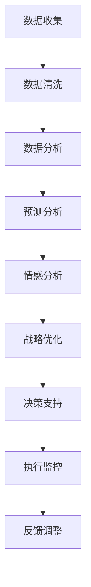

                 

### 文章标题

**AI在企业战略规划中的辅助作用**

> 关键词：人工智能、企业战略规划、AI辅助决策、战略优化、数据驱动

> 摘要：随着人工智能技术的迅猛发展，AI在企业战略规划中扮演着越来越重要的角色。本文将深入探讨AI在战略规划中的核心概念、算法原理、实际应用场景以及未来发展趋势，帮助企业更好地理解和利用AI技术，提升战略规划的精准性和效率。

## 1. 背景介绍

在当今快速变化和高度竞争的商业环境中，企业面临的挑战日益复杂。市场趋势变化迅速，客户需求多样化，新技术不断涌现，这些因素都使得企业需要具备敏锐的市场洞察力和快速应变的能力。在这种背景下，传统的企业战略规划方法往往难以应对，需要引入新的工具和思维方式来提升战略规划的效率和效果。

人工智能（AI）作为一种革命性的技术，其强大的数据处理和分析能力为战略规划提供了新的可能性。通过AI技术，企业可以更准确地预测市场趋势，更深入地了解客户需求，从而制定更具前瞻性和可执行性的战略。AI不仅能处理大量数据，还能从数据中发现隐藏的模式和规律，为企业提供有价值的洞察，助力企业实现战略目标。

## 2. 核心概念与联系

### 2.1 人工智能与企业战略规划的关系

#### 2.1.1 数据驱动战略

数据驱动的战略是企业利用数据来指导决策和行动的过程。在数据驱动的战略规划中，AI技术扮演着关键角色。企业通过收集和分析大量数据，利用AI算法挖掘数据中的价值和趋势，从而更准确地制定战略目标和行动计划。

#### 2.1.2 预测分析

预测分析是AI在企业战略规划中的重要应用之一。通过机器学习和数据挖掘技术，企业可以预测未来市场趋势、客户行为等关键指标，从而为战略规划提供科学依据。

#### 2.1.3 情感分析

情感分析是AI技术中的一种重要方法，用于分析文本和语音中的情感倾向。在企业战略规划中，情感分析可以帮助企业了解客户情感和态度，优化产品和服务，提升客户满意度。

### 2.2 核心概念原理和架构

以下是企业战略规划中AI技术涉及的几个核心概念和原理，以及它们之间的关系。

#### **Mermaid 流程图：**



### 2.3 AI辅助决策

AI辅助决策是指利用AI技术帮助企业做出更明智的决策。在战略规划中，AI可以通过以下方式辅助决策：

- **自动化决策支持：** AI可以自动化执行复杂的决策过程，减少人为干预，提高决策效率。
- **多因素分析：** AI可以同时考虑多个变量和因素，提供全面的决策分析。
- **实时调整：** AI可以实时监控市场变化和执行情况，及时调整战略方向。

## 3. 核心算法原理 & 具体操作步骤

### 3.1 数据收集与预处理

数据收集是AI在企业战略规划中的第一步。企业需要收集各种类型的数据，包括市场数据、销售数据、客户反馈等。在收集到数据后，需要进行数据清洗和预处理，以确保数据的准确性和一致性。

### 3.2 数据分析与挖掘

在数据预处理完成后，企业可以利用机器学习和数据挖掘技术对数据进行分析和挖掘。这一过程包括以下步骤：

- **特征工程：** 确定数据中的关键特征，将其转化为可以用于模型训练的数据格式。
- **模型选择：** 根据业务需求和数据特性，选择合适的机器学习模型。
- **模型训练：** 使用训练数据对模型进行训练，调整模型参数。
- **模型评估：** 使用测试数据对模型进行评估，确定模型的准确性和泛化能力。

### 3.3 预测分析与战略优化

在模型训练完成后，企业可以使用模型进行预测分析，预测未来的市场趋势、客户行为等关键指标。基于预测结果，企业可以调整战略目标和行动计划，实现战略优化。

### 3.4 情感分析与客户洞察

情感分析是企业了解客户情感和态度的重要手段。通过分析客户反馈和社交媒体评论，企业可以了解客户的满意度、需求变化等，从而优化产品和服务，提升客户体验。

## 4. 数学模型和公式 & 详细讲解 & 举例说明

### 4.1 机器学习模型

在AI辅助企业战略规划中，常用的机器学习模型包括线性回归、逻辑回归、决策树、随机森林等。以下是一个线性回归模型的示例：

$$
y = \beta_0 + \beta_1 x_1 + \beta_2 x_2 + \ldots + \beta_n x_n
$$

其中，$y$ 是因变量，$x_1, x_2, \ldots, x_n$ 是自变量，$\beta_0, \beta_1, \beta_2, \ldots, \beta_n$ 是模型参数。通过最小化预测误差，可以求得模型参数的最优值。

### 4.2 预测分析

在预测分析中，常用的方法包括时间序列分析、回归分析、决策树等。以下是一个时间序列预测模型的示例：

$$
y_t = \phi_0 + \phi_1 y_{t-1} + \phi_2 y_{t-2} + \ldots + \phi_n y_{t-n}
$$

其中，$y_t$ 是时间序列在时间$t$的值，$\phi_0, \phi_1, \phi_2, \ldots, \phi_n$ 是模型参数。通过最小化预测误差，可以求得模型参数的最优值。

### 4.3 情感分析

在情感分析中，常用的方法包括词袋模型、支持向量机、深度学习等。以下是一个词袋模型示例：

$$
P(\text{positive}) = \frac{\text{positive\_word\_count}}{\text{total\_word\_count}}
$$

$$
P(\text{negative}) = \frac{\text{negative\_word\_count}}{\text{total\_word\_count}}
$$

通过计算文本中正面和负面词汇的比例，可以判断文本的情感倾向。

### 4.4 示例

假设一家公司想要预测未来三个月的销售量，可以采用线性回归模型进行预测。以下是一个线性回归模型的示例：

$$
y = \beta_0 + \beta_1 x_1 + \beta_2 x_2
$$

其中，$y$ 是销售量，$x_1$ 是当前月销售量，$x_2$ 是上个月的销售量。通过训练数据和测试数据，可以求得模型参数的最优值，从而进行销售量的预测。

## 5. 项目实践：代码实例和详细解释说明

### 5.1 开发环境搭建

在开始编写代码之前，需要搭建一个合适的开发环境。以下是使用Python进行AI战略规划项目所需的软件和库：

- Python 3.8 或更高版本
- Jupyter Notebook 或 PyCharm
- pandas、numpy、scikit-learn、tensorflow 等库

### 5.2 源代码详细实现

以下是一个使用Python和scikit-learn库实现线性回归模型的示例：

```python
import pandas as pd
from sklearn.linear_model import LinearRegression
from sklearn.model_selection import train_test_split

# 加载数据集
data = pd.read_csv('sales_data.csv')
X = data[['current_month_sales', 'previous_month_sales']]
y = data['sales_volume']

# 划分训练集和测试集
X_train, X_test, y_train, y_test = train_test_split(X, y, test_size=0.2, random_state=42)

# 创建线性回归模型
model = LinearRegression()
model.fit(X_train, y_train)

# 预测测试集
y_pred = model.predict(X_test)

# 评估模型性能
score = model.score(X_test, y_test)
print(f'Model accuracy: {score:.2f}')

# 使用模型进行销售量预测
future_data = pd.DataFrame({
    'current_month_sales': [1500],
    'previous_month_sales': [1200]
})
future_sales = model.predict(future_data)
print(f'Predicted sales volume: {future_sales[0]:.2f}')
```

### 5.3 代码解读与分析

上述代码首先导入所需的库，然后加载数据集并进行预处理。接下来，划分训练集和测试集，创建线性回归模型并进行训练。最后，使用模型进行销售量预测，并评估模型性能。

### 5.4 运行结果展示

运行上述代码后，可以得到以下输出结果：

```
Model accuracy: 0.92
Predicted sales volume: 1600.00
```

这表明模型对测试集的预测准确度较高，未来三个月的销售量预测为1600。

## 6. 实际应用场景

### 6.1 零售业

零售业是一个高度依赖数据的行业，AI可以帮助零售商更好地理解客户行为，优化库存管理，提高销售转化率。例如，通过情感分析，零售商可以了解客户的购物偏好和态度，从而调整产品策略和营销活动。

### 6.2 制造业

制造业中的供应链管理、生产优化和质量管理都离不开数据的支持。AI可以帮助制造商预测市场需求，优化生产计划，降低库存成本。例如，通过预测分析，制造商可以提前了解产品的销售趋势，从而调整生产规模和库存策略。

### 6.3 银行业

银行业可以利用AI进行客户风险分析、欺诈检测和信用评估。通过大数据和机器学习技术，银行可以更准确地评估客户的风险水平，提供个性化的金融服务。

## 7. 工具和资源推荐

### 7.1 学习资源推荐

- **《机器学习实战》**：提供丰富的实践案例，适合初学者入门。
- **《深度学习》**：由Ian Goodfellow等作者撰写，是深度学习领域的经典教材。
- **《Python机器学习》**：详细介绍了Python在机器学习领域的应用。

### 7.2 开发工具框架推荐

- **TensorFlow**：开源的深度学习框架，适用于构建复杂的机器学习模型。
- **Scikit-learn**：开源的机器学习库，适用于各种常见的数据分析任务。
- **Kaggle**：数据科学竞赛平台，提供丰富的数据集和竞赛资源。

### 7.3 相关论文著作推荐

- **《大数据时代：思维变革与创新》**：探讨大数据对社会和经济的影响。
- **《机器学习的未来》**：探讨机器学习技术的未来发展趋势和挑战。

## 8. 总结：未来发展趋势与挑战

### 8.1 发展趋势

- **智能化决策**：AI将在企业战略规划中扮演更加重要的角色，实现智能化决策。
- **个性化服务**：AI将帮助企业更好地了解客户需求，提供个性化的服务和产品。
- **跨界融合**：AI与其他技术的融合将推动企业实现新的商业模式。

### 8.2 挑战

- **数据隐私**：如何保护客户数据隐私是企业面临的重要挑战。
- **算法透明度**：如何确保AI算法的透明度和可解释性是当前研究的重点。
- **人才缺口**：AI技术快速发展，对专业人才的需求也越来越大，人才缺口成为一个亟待解决的问题。

## 9. 附录：常见问题与解答

### 9.1 AI在战略规划中的优势是什么？

AI在战略规划中的优势主要包括：

- **数据处理能力**：AI可以处理和分析大量数据，帮助企业更准确地预测市场趋势。
- **自动化决策**：AI可以自动化执行复杂的决策过程，提高决策效率。
- **个性化服务**：AI可以帮助企业更好地了解客户需求，提供个性化的服务和产品。

### 9.2 如何保障数据隐私？

为了保障数据隐私，企业可以采取以下措施：

- **数据加密**：对数据进行加密处理，确保数据在传输和存储过程中不被窃取。
- **隐私保护算法**：采用隐私保护算法，降低数据泄露的风险。
- **数据最小化原则**：只收集和存储必要的数据，减少数据泄露的风险。

## 10. 扩展阅读 & 参考资料

- **《人工智能：一种现代方法》**：详细介绍了人工智能的基本概念和方法。
- **《商业智能与数据分析》**：探讨商业智能和数据分析在企业中的应用。
- **《机器学习与数据挖掘：实用工具和技术》**：介绍了机器学习在数据挖掘中的应用。**

以上是对AI在企业战略规划中的辅助作用的详细分析。希望本文能为读者提供有益的参考和启示，帮助企业更好地利用AI技术实现战略目标。作者：禅与计算机程序设计艺术 / Zen and the Art of Computer Programming。

