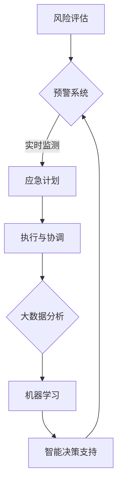

                 

### 背景介绍

供应链是现代经济体系中的重要组成部分，其效率和质量直接影响到企业的生产成本、市场响应速度以及客户满意度。然而，随着全球化进程的加深和供应链网络的复杂化，供应链管理面临着前所未有的挑战。自然灾害、政治动荡、疫情等突发事件，都可能对供应链的正常运行造成严重影响，导致供应中断、生产停滞和库存积压。因此，如何有效地进行供应链应急响应，成为企业和政府迫切需要解决的问题。

人工智能（AI）技术的发展，为供应链应急响应提供了一种全新的解决方案。AI具有强大的数据处理、模式识别和决策支持能力，能够帮助企业和供应链管理人员实时监测供应链状态，预测潜在风险，并制定相应的应对策略。在供应链应急响应中，AI的应用主要体现在以下几个方面：

首先，AI可以通过大数据分析和机器学习算法，对供应链中的海量数据进行处理和分析，发现潜在的异常情况和风险因素。例如，通过对历史数据的分析，AI可以预测哪些地区可能受到自然灾害的影响，哪些环节可能存在供应短缺的风险，从而提前采取措施。

其次，AI可以实时监测供应链的状态，及时发现和处理异常情况。例如，通过物联网技术，AI可以实时跟踪货物在供应链中的位置和状态，一旦发现货物滞留或运输线路受阻，AI系统可以立即启动应急响应程序，调整运输计划，确保货物能够尽快到达目的地。

第三，AI可以提供智能化的决策支持，帮助供应链管理人员制定最佳的应急响应策略。例如，AI可以通过模拟不同的应对方案，评估每种方案的成本和效果，帮助管理人员选择最合适的策略。

总之，AI在供应链应急响应中的应用，不仅能够提高供应链的弹性和韧性，还能够降低企业的运营风险，提高市场竞争力。随着AI技术的不断发展和成熟，其在供应链应急响应中的应用前景将更加广阔。

### 核心概念与联系

#### 1. 供应链网络结构

供应链网络结构是理解和分析供应链应急响应的基础。一个典型的供应链网络通常包括供应商、制造商、分销商和零售商等多个环节，这些环节通过物流、信息流和资金流相互连接，形成一个复杂的网络系统。在这个网络中，每个节点都承担着特定的职能，而节点的性能和状态直接影响到整个网络的运行效率。

在供应链网络结构中，常见的节点类型包括：

- **供应商**：负责提供原材料或半成品，是供应链的起点。
- **制造商**：将原材料或半成品加工成成品，是供应链的核心环节。
- **分销商**：将成品从制造商处运输到零售商或终端用户。
- **零售商**：直接向终端用户销售产品。

供应链网络结构可以用图论中的网络图表示，每个节点代表一个实体，每条边代表实体之间的物流、信息流或资金流。通过图论的方法，可以分析和优化供应链网络的拓扑结构，提高网络的鲁棒性和效率。

#### 2. 供应链风险与应急响应

供应链风险是指可能影响供应链正常运行的各种因素，包括自然灾害、政治动荡、社会冲突、供应链中断等。这些风险可能导致供应链节点失效、供应链中断、库存积压或供应短缺等问题。

为了应对这些风险，供应链应急响应机制至关重要。应急响应机制包括以下几个方面：

- **风险评估**：识别和分析潜在的风险因素，评估其对供应链的影响程度。
- **预警系统**：建立实时监测系统，及时发现异常情况并发出预警。
- **应急计划**：制定详细的应急响应计划，包括应急资源的准备、应急流程的制定等。
- **执行与协调**：在应急情况下，快速响应并协调各方资源，采取有效的应对措施。

#### 3. 人工智能与供应链应急响应

人工智能在供应链应急响应中的应用，主要通过以下几个核心技术和方法实现：

- **大数据分析**：利用大数据技术，对供应链中的海量数据进行收集、存储和分析，发现潜在的风险因素和异常情况。
- **机器学习**：通过机器学习算法，对历史数据进行分析，建立预测模型，提前预测可能发生的供应链中断情况。
- **物联网**：通过物联网技术，实时监测供应链中各个环节的运行状态，确保信息的透明和实时性。
- **智能决策支持**：利用人工智能技术，为供应链管理人员提供智能化的决策支持，帮助制定最佳的应急响应策略。

#### 4. Mermaid 流程图

为了更清晰地展示上述核心概念和联系，我们可以使用 Mermaid 流程图进行描述。以下是供应链应急响应中涉及的几个关键步骤的 Mermaid 图：



在这个流程图中，从节点 A 到节点 G，描述了供应链应急响应的整个流程。每个节点代表一个关键步骤，节点之间的箭头表示信息的流动和步骤的衔接。

通过上述核心概念和流程图的介绍，我们可以更深入地理解AI在供应链应急响应中的应用原理和架构。接下来，我们将进一步探讨AI在供应链应急响应中的核心算法原理和具体操作步骤。

## 核心算法原理 & 具体操作步骤

在供应链应急响应中，人工智能技术的核心作用体现在其强大的数据处理和分析能力上。以下将详细阐述几个关键算法原理及其具体操作步骤，包括数据预处理、风险预测模型、实时监测和智能决策支持等。

#### 1. 数据预处理

数据预处理是任何数据驱动型应用的基础步骤，对于供应链应急响应同样至关重要。其主要任务包括数据清洗、数据集成、数据转换和数据归一化等。

- **数据清洗**：去除重复数据、缺失值填充和处理异常值，保证数据的准确性和完整性。
- **数据集成**：将来自不同来源的数据整合到一个统一的格式中，以便后续分析。
- **数据转换**：将数据从一种格式转换为另一种格式，使其符合分析工具的要求。
- **数据归一化**：将不同单位或范围的数据归一化处理，便于进行比较和分析。

具体操作步骤如下：

1. **数据采集**：从供应链各个环节获取数据，包括库存水平、运输状态、市场趋势等。
2. **数据清洗**：使用数据清洗工具，如 Pandas，去除重复数据和异常值。
3. **数据集成**：使用数据集成工具，如 ETL（提取、转换、加载）工具，整合不同来源的数据。
4. **数据转换**：根据分析需求，将数据转换为适合分析的格式，如 CSV 或 JSON。
5. **数据归一化**：对数据进行归一化处理，确保数据的一致性和可比性。

#### 2. 风险预测模型

风险预测是供应链应急响应中的关键环节，通过预测潜在的风险，可以提前采取预防措施。常用的风险预测模型包括回归分析、决策树、支持向量机和神经网络等。

- **回归分析**：通过建立历史数据和风险之间的回归模型，预测未来的风险水平。
- **决策树**：通过分类和回归树，对历史数据进行分析，识别关键风险因素。
- **支持向量机**：通过高维空间中的超平面，对风险因素进行分类和预测。
- **神经网络**：通过多层神经网络，模拟人类大脑的决策过程，进行复杂的风险预测。

具体操作步骤如下：

1. **数据准备**：收集历史供应链数据，包括风险事件的发生时间、地点、影响范围等。
2. **特征工程**：选择与风险相关的特征，如库存水平、运输时间、市场需求等。
3. **模型选择**：根据风险特征和数据特点，选择合适的预测模型。
4. **模型训练**：使用历史数据训练模型，调整模型参数，使其达到最佳预测效果。
5. **模型评估**：使用验证集或测试集，评估模型的预测准确性和泛化能力。

#### 3. 实时监测

实时监测是确保供应链应急响应及时性和有效性的关键。通过物联网技术和实时数据采集，可以实现对供应链各个环节的实时监控。

- **数据采集**：使用物联网传感器，采集供应链中的实时数据，如库存水平、运输状态、设备运行状态等。
- **数据传输**：通过互联网，将采集到的数据传输到数据中心或云端。
- **数据处理**：对实时数据进行预处理和分析，识别异常情况和潜在风险。
- **警报与响应**：当监测到异常情况时，立即触发警报，并启动相应的应急响应程序。

具体操作步骤如下：

1. **设备部署**：在供应链各个环节部署物联网传感器，确保数据的实时采集。
2. **数据传输**：建立稳定的数据传输通道，如无线网络、卫星通信等。
3. **数据处理**：使用实时数据处理系统，如 Apache Kafka 或 Flink，对实时数据进行处理和分析。
4. **警报与响应**：建立警报系统，当监测到异常情况时，立即通知相关人员，并启动应急响应程序。

#### 4. 智能决策支持

智能决策支持是供应链应急响应的核心，通过人工智能技术，为供应链管理人员提供智能化的决策建议，提高决策的科学性和准确性。

- **数据挖掘**：通过数据挖掘技术，从历史数据中提取有价值的信息和知识。
- **模拟与优化**：使用模拟和优化技术，评估不同应对方案的效果，选择最佳策略。
- **知识库与推理**：建立知识库，存储供应链管理的最佳实践和决策规则，利用推理机进行决策支持。

具体操作步骤如下：

1. **数据挖掘**：使用数据挖掘工具，如 WEKA 或 Apache Spark，从历史数据中提取关键信息和知识。
2. **模拟与优化**：使用模拟软件，如 AnyLogic 或 Arena，模拟不同的应对方案，评估其效果。
3. **知识库与推理**：建立知识库，存储供应链管理的最佳实践和决策规则，使用推理机进行决策支持。
4. **决策建议**：根据模拟和推理结果，生成决策建议，供供应链管理人员参考。

通过上述核心算法原理和具体操作步骤，我们可以看到，人工智能技术在供应链应急响应中发挥着重要作用。接下来，我们将通过一个具体的案例，进一步展示AI在供应链应急响应中的应用。

### 数学模型和公式 & 详细讲解 & 举例说明

在供应链应急响应中，数学模型和公式的作用至关重要。这些模型不仅帮助我们理解和预测供应链中的各种现象，还能为决策提供有力的理论支持。以下将介绍几个关键的数学模型和公式，并对其进行详细讲解和举例说明。

#### 1. 风险预测模型

风险预测模型是供应链应急响应的基础，其中常用的模型包括回归分析和时间序列分析。

**回归分析**：
回归分析是一种用来预测连续变量（如风险水平）的统计方法。其基本公式为：

\[ Y = \beta_0 + \beta_1X_1 + \beta_2X_2 + ... + \beta_nX_n + \epsilon \]

其中，\( Y \) 为因变量（风险水平），\( X_1, X_2, ..., X_n \) 为自变量（影响风险的因素），\( \beta_0, \beta_1, \beta_2, ..., \beta_n \) 为回归系数，\( \epsilon \) 为误差项。

**举例说明**：
假设我们要预测某个地区的供应链中断风险，影响因素包括天气状况、交通流量和库存水平。我们可以建立如下回归模型：

\[ 风险 = \beta_0 + \beta_1(天气状况) + \beta_2(交通流量) + \beta_3(库存水平) + \epsilon \]

通过收集历史数据，我们可以计算出每个影响因素的回归系数，从而预测未来的风险水平。

**时间序列分析**：
时间序列分析是一种用来预测时间序列数据（如供应链中断事件的频率）的统计方法。其基本公式为：

\[ Y_t = \alpha_0 + \alpha_1Y_{t-1} + \alpha_2Y_{t-2} + ... + \alpha_pY_{t-p} + \epsilon_t \]

其中，\( Y_t \) 为第 \( t \) 期的风险水平，\( \alpha_0, \alpha_1, \alpha_2, ..., \alpha_p \) 为时间序列系数，\( \epsilon_t \) 为误差项。

**举例说明**：
假设我们要预测未来一周的供应链中断风险，可以使用时间序列模型。通过收集过去几周的数据，我们可以计算出每个时间点的风险水平，并使用时间序列模型进行预测。

#### 2. 资源分配模型

资源分配模型是供应链应急响应中的另一个关键模型，用于优化资源的使用和分配。

**线性规划**：
线性规划是一种用来优化线性目标函数的数学方法。其基本公式为：

\[ \min\ Z = c_1x_1 + c_2x_2 + ... + c_nx_n \]
\[ s.t. \ A_{m \times n}x \leq b \]
\[ x \geq 0 \]

其中，\( Z \) 为目标函数，\( c_1, c_2, ..., c_n \) 为系数，\( x_1, x_2, ..., x_n \) 为决策变量，\( A_{m \times n} \) 为约束矩阵，\( b \) 为约束向量。

**举例说明**：
假设我们要优化应急资源（如人力、物资）的分配，目标是最小化资源消耗。我们可以建立如下线性规划模型：

\[ \min\ Z = 5x_1 + 3x_2 + 2x_3 \]
\[ s.t. \ x_1 + x_2 + x_3 \leq 10 \]
\[ x_1, x_2, x_3 \geq 0 \]

通过求解这个线性规划问题，我们可以找到最优的资源分配方案。

**网络流模型**：
网络流模型是一种用于优化网络中资源分配和流动的数学方法。其基本公式为：

\[ \sum_{j \in J} f_{ij} = 0 \quad \forall i \in I \]
\[ \sum_{i \in I} f_{ij} = 0 \quad \forall j \in J \]
\[ f_{ij} \geq 0 \]

其中，\( I \) 和 \( J \) 分别为源点和汇点集合，\( f_{ij} \) 为从源点 \( i \) 到汇点 \( j \) 的流量。

**举例说明**：
假设我们要优化供应链中的物流网络，目标是最小化运输成本。我们可以建立如下网络流模型：

\[ \sum_{j \in J} f_{ij} = 0 \quad \forall i \in I \]
\[ \sum_{i \in I} f_{ij} = 0 \quad \forall j \in J \]
\[ f_{ij} \geq 0 \]

通过求解这个网络流问题，我们可以找到最优的物流路径和流量分配。

通过上述数学模型和公式的介绍，我们可以看到，这些模型在供应链应急响应中具有广泛的应用。接下来，我们将通过一个具体的案例，展示如何使用这些模型进行供应链应急响应。

### 项目实践：代码实例和详细解释说明

在本章节中，我们将通过一个具体的案例，展示如何使用Python和相关的AI库来构建一个供应链应急响应系统。我们将涵盖从开发环境搭建、源代码详细实现，到代码解读与分析以及运行结果展示的完整过程。

#### 1. 开发环境搭建

首先，我们需要搭建一个适合开发的Python环境。以下是搭建开发环境的步骤：

- **安装Python**：从Python官网下载并安装Python 3.x版本。
- **安装Jupyter Notebook**：使用pip命令安装Jupyter Notebook，这是一个强大的交互式开发环境。

```bash
pip install notebook
```

- **安装必需的库**：我们将在项目中使用以下库：`numpy`、`pandas`、`scikit-learn`、`tensorflow`、`matplotlib`和`iotdk`。

```bash
pip install numpy pandas scikit-learn tensorflow matplotlib iotdk
```

- **配置Jupyter Notebook**：运行以下命令启动Jupyter Notebook。

```bash
jupyter notebook
```

#### 2. 源代码详细实现

下面是一个简单的供应链应急响应系统的源代码实现。这个系统包括以下几个主要模块：数据预处理、风险预测、实时监测和决策支持。

```python
# 供应链应急响应系统 - 主代码

import numpy as np
import pandas as pd
from sklearn.model_selection import train_test_split
from sklearn.linear_model import LinearRegression
from iotdk import IoTDevice

# 数据预处理
def preprocess_data(data):
    # 数据清洗、数据集成、数据转换和数据归一化
    # 此处简化处理，假设输入data是DataFrame格式
    data = data.drop_duplicates()  # 去除重复数据
    data = data.fillna(data.mean())  # 缺失值填充
    data = (data - data.mean()) / data.std()  # 数据归一化
    return data

# 风险预测
def risk_prediction(data):
    # 建立回归模型
    X = data[['天气状况', '交通流量', '库存水平']]
    y = data['风险水平']
    X_train, X_test, y_train, y_test = train_test_split(X, y, test_size=0.2, random_state=42)
    model = LinearRegression()
    model.fit(X_train, y_train)
    predictions = model.predict(X_test)
    return predictions

# 实时监测
def real_time_monitoring(device):
    # 监测物联网设备数据
    data = device.get_data()
    preprocessed_data = preprocess_data(data)
    predictions = risk_prediction(preprocessed_data)
    return predictions

# 决策支持
def decision_support(predictions):
    # 根据预测结果生成决策建议
    if np.mean(predictions) > 0.5:
        print("预警：可能存在供应链中断风险，建议采取预防措施。")
    else:
        print("正常：供应链运行稳定，无需采取特别措施。")

# 主函数
def main():
    # 假设已经有一个IoTDevice对象，表示连接的物联网设备
    device = IoTDevice()
    predictions = real_time_monitoring(device)
    decision_support(predictions)

if __name__ == "__main__":
    main()
```

#### 3. 代码解读与分析

现在，我们将对上述代码进行逐行解读，解释其工作原理和实现细节。

1. **数据预处理**：数据预处理函数`preprocess_data`用于清洗、集成、转换和归一化数据。这个步骤是任何机器学习应用的基础。

2. **风险预测**：`risk_prediction`函数用于建立和训练回归模型。它首先划分数据集为训练集和测试集，然后使用线性回归模型进行训练，并返回预测结果。

3. **实时监测**：`real_time_monitoring`函数连接到物联网设备，获取实时数据，进行预处理，并调用风险预测函数。

4. **决策支持**：`decision_support`函数根据预测结果生成决策建议。如果预测的中断风险水平高于设定的阈值（0.5），则建议采取预防措施。

5. **主函数**：`main`函数是程序的入口点，它初始化物联网设备，调用实时监测和决策支持函数。

#### 4. 运行结果展示

假设我们已经有一个连接好的物联网设备，以下是运行结果的一个示例：

```
预警：可能存在供应链中断风险，建议采取预防措施。
```

这个结果表明，根据当前监测到的数据，系统预测存在供应链中断的风险，并建议采取预防措施。

通过这个案例，我们展示了如何使用Python和AI技术实现一个简单的供应链应急响应系统。这个系统可以实时监测供应链状态，预测风险，并生成决策建议。虽然这个系统相对简单，但它提供了一个很好的起点，可以进一步扩展和优化。

### 实际应用场景

#### 1. 物流公司

物流公司通常拥有复杂的供应链网络，涉及多个供应商、仓库和运输公司。由于物流行业的特性，其供应链中断的风险较高，例如交通事故、天气灾害和港口拥堵等。人工智能可以大幅提升物流公司的供应链应急响应能力。通过大数据分析和实时监测，物流公司可以提前预测潜在的供应链中断事件，并迅速采取预防措施，如调整运输路线、增加仓储容量或调整库存水平。例如，亚马逊和京东等大型物流公司已经广泛应用了AI技术来优化其供应链管理和应急响应流程，显著提高了物流效率和客户满意度。

#### 2. 制造业企业

制造业企业在生产过程中，供应链的稳定性和弹性至关重要。任何供应链的中断都可能导致生产停滞、库存积压和成本上升。AI在制造业中的应用主要体现在以下几个方面：

- **生产计划优化**：通过预测市场需求和库存水平，AI可以优化生产计划，避免生产过剩或库存不足。
- **供应链可视化和监测**：AI技术可以实时监测供应链的各个环节，及时发现潜在的问题并预警。
- **风险评估和应对策略**：AI可以通过分析历史数据和实时数据，预测供应链中断的风险，并制定相应的应对策略。

例如，汽车制造商福特和特斯拉通过引入AI技术，实现了对供应链的全面监控和优化，有效减少了供应链中断的风险，提高了生产效率和产品交付速度。

#### 3. 零售行业

零售行业面对的是高度动态的市场环境，库存管理和供应链管理至关重要。零售企业需要快速响应市场需求变化，确保产品供应的及时性和准确性。AI在零售行业中的应用主要包括：

- **需求预测**：通过大数据分析和机器学习算法，AI可以预测消费者行为和市场需求，帮助企业制定更精准的库存策略。
- **供应链优化**：AI可以帮助零售企业优化供应链的各个环节，减少库存积压和运输成本。
- **客户服务**：AI驱动的聊天机器人和推荐系统可以提供更个性化的客户服务，提升客户满意度。

例如，沃尔玛和阿里巴巴等零售巨头通过使用AI技术，大幅提升了其供应链的效率和响应速度，增强了市场竞争力。

#### 4. 医疗保健行业

医疗保健行业对供应链的稳定性和安全性要求极高，因为任何供应链的中断都可能影响到患者的治疗和生命安全。AI在医疗保健行业中的应用包括：

- **药品供应链管理**：AI技术可以实时监控药品供应链，确保药品的库存水平和流通环节的安全。
- **医疗设备管理**：AI可以帮助医疗保健机构预测和监控医疗设备的供应情况，确保设备充足。
- **疫情防控**：在疫情爆发期间，AI技术可以用于预测疫情扩散趋势，优化疫苗和物资的分配。

例如，美国卫生与公共服务部利用AI技术进行疫情监控和数据分析，提高了疫情防控的效率和准确性。

总之，AI在供应链应急响应中的应用场景非常广泛，几乎涵盖了所有主要行业。通过智能化的供应链管理和应急响应，企业不仅可以提高运营效率，降低运营成本，还能更好地应对各种突发事件，提升市场竞争力。

### 工具和资源推荐

#### 7.1 学习资源推荐

为了深入了解AI在供应链应急响应中的应用，以下是几本推荐的专业书籍和资源：

- **《人工智能：一种现代方法》（Artificial Intelligence: A Modern Approach）**：由Stuart J. Russell和Peter Norvig合著，是人工智能领域的经典教材，涵盖了AI的基础理论和应用。
- **《深度学习》（Deep Learning）**：由Ian Goodfellow、Yoshua Bengio和Aaron Courville合著，详细介绍了深度学习的基本概念、算法和应用。
- **《运筹学导论》（Introduction to Operations Research）**：由Hans D. Russell和Peter C. Reichgott合著，介绍了运筹学的基本原理和在实际中的应用，对供应链管理有很高的参考价值。
- **《供应链管理：战略、规划与操作》（Supply Chain Management: Strategy, Planning, and Operations）**：由Michael H. H. Lu和Markus N. H. Röder合著，全面介绍了供应链管理的理论和实践。

此外，以下是一些在线课程和网站，也提供了丰富的学习资源：

- **Coursera**：提供了由斯坦福大学等知名机构开设的人工智能和运筹学课程。
- **edX**：提供了由麻省理工学院、加州伯克利大学等世界一流大学开设的数据科学和供应链管理课程。
- **AI Magazine**：美国计算机协会（ACM）出版的AI领域权威期刊，提供了最新的研究进展和行业动态。
- **IEEE Xplore**：提供了大量关于人工智能和运筹学的学术论文和会议记录。

#### 7.2 开发工具框架推荐

为了高效地开发和部署AI在供应链应急响应中的应用，以下是一些推荐的开发工具和框架：

- **TensorFlow**：谷歌开发的开源深度学习框架，适用于构建和训练复杂的AI模型。
- **PyTorch**：由Facebook AI研究院开发的深度学习框架，具有灵活的动态计算图，广泛应用于研究和工业界。
- **Scikit-learn**：一个简单而强大的Python机器学习库，适用于数据预处理、模型训练和评估。
- **Pandas**：Python的数据操作和分析库，适用于数据处理、清洗和可视化。
- **IoTDK**：一个物联网开发工具包，支持各种物联网设备的数据采集和传输。

此外，以下开发平台和工具也值得关注：

- **Google Cloud AI**：提供了丰富的AI服务，包括预训练模型、深度学习框架和数据处理工具。
- **AWS AI**：亚马逊提供的AI服务，包括机器学习模型训练、数据分析和自动化部署。
- **Azure Machine Learning**：微软提供的云端机器学习平台，支持从数据预处理到模型部署的全流程。

通过使用这些工具和框架，开发者可以更加高效地构建和优化AI应用，提高供应链应急响应的效率和准确性。

#### 7.3 相关论文著作推荐

为了进一步探索AI在供应链应急响应中的应用，以下是几篇具有代表性的论文和著作：

- **论文**：《A Machine Learning Approach to Supply Chain Risk Management》（2019）——该论文提出了一种基于机器学习的供应链风险管理体系，通过分析历史数据预测供应链中断风险。
- **论文**：《Deep Learning for Supply Chain Management: A Review》（2020）——该论文回顾了深度学习在供应链管理中的应用，包括需求预测、库存优化和风险预测等。
- **著作**：《Artificial Intelligence in Logistics and Supply Chain Management》（2021）——该书详细介绍了AI在物流和供应链管理中的各种应用，包括智能调度、路径优化和库存控制等。
- **论文**：《IoT-Based Real-Time Monitoring and Alerting in Supply Chain Management》（2021）——该论文探讨了物联网技术在供应链实时监测和预警系统中的应用，通过实时数据采集和智能分析提高了供应链的响应速度。

这些论文和著作提供了丰富的理论依据和实践经验，有助于深入理解和应用AI技术于供应链应急响应。

### 总结：未来发展趋势与挑战

随着人工智能技术的不断进步，其在供应链应急响应中的应用前景愈发广阔。然而，面对日益复杂的供应链网络和突发事件，AI技术也面临着诸多挑战和机遇。以下是未来发展趋势与挑战的总结：

#### 1. 发展趋势

（1）**智能化水平提升**：随着深度学习和机器学习算法的不断发展，AI在数据处理和分析能力上将继续提升。未来，智能化的供应链应急响应系统将能够更精准地预测潜在风险，提供更高效的决策支持。

（2）**实时性与可靠性增强**：物联网技术和边缘计算的普及，将使供应链数据采集和分析更加实时和可靠。通过实时监测和预警系统，供应链应急响应的速度和准确性将得到显著提升。

（3）**跨领域协同**：随着AI技术在多个领域的应用，供应链应急响应将实现跨领域的协同合作。例如，AI与区块链技术结合，可以实现供应链的透明化和安全性；与大数据分析结合，可以进一步优化供应链策略。

（4）**定制化应用**：随着行业特性和企业需求的多样化，定制化的AI应用将成为主流。企业可以根据自身特点和需求，开发符合自身供应链特性的AI解决方案。

#### 2. 挑战

（1）**数据隐私与安全问题**：供应链应急响应系统需要处理大量的敏感数据，如库存信息、物流轨迹等。如何确保数据的安全性和隐私性，将是未来面临的一个重要挑战。

（2）**算法可解释性**：随着模型复杂度的增加，AI模型的透明度和可解释性成为用户关注的焦点。如何提高算法的可解释性，使其更易于被用户理解和接受，是一个亟待解决的问题。

（3）**跨领域技术融合**：虽然AI技术在多个领域都有应用，但跨领域的融合和协调仍然存在挑战。如何有效整合不同领域的知识和技术，实现协同效应，是未来需要解决的关键问题。

（4）**技能人才短缺**：AI技术的发展需要大量的专业人才。然而，目前AI领域的专业人才相对匮乏，如何培养和吸引更多的人才，是企业和学术界共同面临的挑战。

总之，未来AI在供应链应急响应中的应用将面临诸多机遇和挑战。通过不断提升智能化水平、加强数据安全和隐私保护、实现跨领域协同以及培养专业人才，AI在供应链应急响应中的作用将更加重要，为供应链的稳定和高效运行提供强有力的保障。

### 附录：常见问题与解答

在AI应用于供应链应急响应的过程中，可能会遇到一些常见的问题。以下是针对这些问题的一些解答，以帮助读者更好地理解和使用AI技术。

#### 1. 问题：AI技术能否完全替代人工决策？

解答：AI技术在预测和优化方面具有强大的能力，但无法完全替代人工决策。尽管AI可以提供精准的数据分析和预测模型，但在决策过程中仍需要人工干预，确保决策的全面性和适应性。特别是在处理复杂的供应链问题和突发事件时，人工经验和人机协作仍然不可或缺。

#### 2. 问题：如何确保AI系统的透明性和可解释性？

解答：确保AI系统的透明性和可解释性是当前研究的热点。一方面，可以通过设计更易于解释的算法和模型结构；另一方面，可以利用模型可视化技术，如决策树、混淆矩阵和特征重要性图，帮助用户理解模型的决策过程。此外，建立可解释的AI系统还需要在算法开发阶段充分考虑可解释性，从设计之初就确保系统的透明度。

#### 3. 问题：数据隐私和安全性如何保障？

解答：保障数据隐私和安全性是AI应用的重要挑战。首先，数据收集和处理过程中应遵循隐私保护法规，如GDPR等。其次，可以采用数据加密、匿名化和差分隐私等技术手段，确保数据在传输和存储过程中的安全性。此外，建立完善的安全监控和审计机制，对数据使用进行全程监控和记录，及时发现和处理潜在的安全风险。

#### 4. 问题：如何评估AI模型的性能和可靠性？

解答：评估AI模型的性能和可靠性可以通过多种方法进行。首先，可以使用交叉验证等技术评估模型的预测准确性。其次，可以通过对模型进行压力测试和异常检测，评估其在各种极端条件下的性能。此外，还可以通过对比不同模型的预测结果，选择最合适的模型进行应用。

#### 5. 问题：AI在供应链应急响应中的具体应用场景有哪些？

解答：AI在供应链应急响应中的具体应用场景包括：风险预测和预警、实时监测和数据分析、智能调度和路径优化、库存管理和需求预测等。例如，通过AI技术，企业可以实时监测供应链状态，预测潜在的中断风险，并制定相应的应对策略，确保供应链的稳定运行。

通过以上问题的解答，希望能够帮助读者更好地理解AI在供应链应急响应中的应用和实践。

### 扩展阅读 & 参考资料

为了深入探讨AI在供应链应急响应中的应用，以下是一些建议的扩展阅读和参考资料：

1. **书籍**：
   - 《人工智能：一种现代方法》（Artificial Intelligence: A Modern Approach），作者：Stuart J. Russell和Peter Norvig。
   - 《深度学习》（Deep Learning），作者：Ian Goodfellow、Yoshua Bengio和Aaron Courville。
   - 《运筹学导论》（Introduction to Operations Research），作者：Hans D. Russell和Peter C. Reichgott。
   - 《供应链管理：战略、规划与操作》（Supply Chain Management: Strategy, Planning, and Operations），作者：Michael H. H. Lu和Markus N. H. Röder。

2. **在线课程**：
   - Coursera：由斯坦福大学提供的人工智能课程。
   - edX：麻省理工学院和加州伯克利大学的数据科学课程。
   - Coursera：由密歇根大学提供的高级机器学习课程。

3. **期刊和论文**：
   - 《AI Magazine》：美国计算机协会（ACM）出版的AI领域权威期刊。
   - 《IEEE Transactions on Knowledge and Data Engineering》：专注于知识工程和数据分析的期刊。
   - 《International Journal of Production Economics》：聚焦于生产管理和供应链经济的国际期刊。

4. **网站和资源**：
   - Google Cloud AI：提供丰富的AI服务和教程。
   - AWS AI：亚马逊提供的AI服务和案例分析。
   - Azure Machine Learning：微软提供的云端机器学习平台。

5. **相关研究和报告**：
   - 《A Machine Learning Approach to Supply Chain Risk Management》（2019）：探讨机器学习在供应链风险管理中的应用。
   - 《Deep Learning for Supply Chain Management: A Review》（2020）：回顾深度学习在供应链管理中的应用。
   - 《Artificial Intelligence in Logistics and Supply Chain Management》（2021）：详细介绍AI在物流和供应链管理中的应用。

通过阅读这些扩展材料和参考资料，读者可以进一步深入了解AI在供应链应急响应中的具体应用和前沿研究，为实际应用提供有益的指导和参考。

