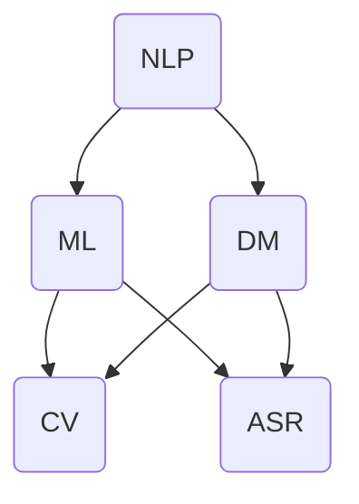

                 

### 背景介绍

#### 新闻媒体行业的演变

新闻媒体行业是社会发展的重要驱动力，其演变历程堪称现代信息社会的缩影。从古代的烽火传递，到中世纪的印刷术，再到现代的电报、无线电广播和互联网，新闻媒体的传播方式和内容形式都经历了翻天覆地的变化。然而，随着技术的不断进步，特别是在人工智能（AI）技术的推动下，新闻媒体行业正迎来新的变革。

在过去的几十年里，新闻媒体行业逐渐从传统的纸质报纸和电视广播向数字化和网络化转型。互联网的普及和移动设备的普及，使得新闻的传播速度和覆盖范围得到了极大的提升。然而，随着信息量的爆炸式增长，新闻的准确性和真实性受到了前所未有的挑战。与此同时，读者对新闻的需求变得更加个性化和即时化，传统的人工编辑和报道模式已经难以满足这些需求。

#### 人工智能与新闻媒体的结合

人工智能技术的发展为新闻媒体行业带来了新的机遇和挑战。AI技术具有处理海量数据、挖掘信息价值、提高效率和准确性的优势，这些特点使得AI在新闻媒体中的应用成为可能。目前，AI在新闻媒体中主要应用于以下几个方面：

1. **自动化内容生成**：AI可以通过自然语言处理（NLP）技术自动生成新闻报道、文章摘要和标题，大大提高了新闻的生成速度和覆盖范围。

2. **新闻筛选与推荐**：基于机器学习算法的推荐系统可以根据读者的兴趣和阅读历史，为读者推荐个性化的新闻内容，提升用户体验。

3. **事实核查**：AI可以通过大数据分析和模式识别技术，对新闻报道中的事实进行核查，提高新闻的真实性和可信度。

4. **图像与视频识别**：AI可以自动识别和分类新闻中的图像和视频，提高新闻的编辑效率和内容质量。

5. **语音与文本识别**：AI可以将语音转化为文字，或将文字转化为语音，使得新闻的获取和传播更加便捷。

#### 应用前景与挑战

AI在新闻媒体中的应用前景广阔，但也面临着一些挑战。首先，数据的质量和真实性是一个重要问题。AI系统依赖于大量高质量的数据进行训练和推理，如果数据存在偏差或错误，那么AI的输出也会受到影响。其次，AI的算法黑箱问题也是一个挑战，由于AI系统的复杂性和非透明性，有时难以解释其决策过程，这可能导致信任危机。此外，AI在新闻中的不当使用也可能引发道德和法律问题，如隐私泄露、虚假信息传播等。

总之，人工智能的引入为新闻媒体行业带来了新的机遇和挑战。如何充分利用AI的优势，同时规避其风险，是一个值得深入探讨的话题。在接下来的章节中，我们将详细探讨AI在新闻媒体中的具体应用和实现方法，以及相关的数学模型和算法原理。

### 核心概念与联系

为了深入探讨AI在新闻媒体中的应用，我们需要明确一些核心概念和它们之间的联系。以下是本文将涉及的核心概念及其关系，我们将使用Mermaid流程图来展示这些概念之间的交互和流程。

#### 1. 自然语言处理（NLP）

自然语言处理是人工智能的一个分支，专注于使计算机能够理解和生成自然语言。在新闻媒体中，NLP技术用于自动生成文章摘要、识别关键词、分类新闻等。

#### 2. 机器学习（ML）

机器学习是使计算机通过数据学习模式并进行预测或决策的技术。新闻媒体中的推荐系统和事实核查系统大量使用了机器学习算法。

#### 3. 数据挖掘（DM）

数据挖掘是发现数据中隐藏的模式和知识的过程。在新闻媒体中，数据挖掘用于分析用户行为、挖掘潜在新闻线索等。

#### 4. 图像识别（CV）

计算机视觉（CV）技术可以自动识别和分类新闻中的图像和视频。图像识别技术在新闻图片编辑和视频监控中有着重要应用。

#### 5. 语音识别（ASR）

语音识别（ASR）技术将语音转化为文本，使得新闻的获取和传播更加便捷。ASR在新闻报道的实时转录和语音合成中有重要作用。

#### Mermaid 流程图

以下是描述这些核心概念之间关系的Mermaid流程图：



在这个流程图中，自然语言处理（NLP）是核心，它与其他技术如机器学习（ML）、数据挖掘（DM）、计算机视觉（CV）和语音识别（ASR）紧密相关。机器学习（ML）通过数据训练模型，支持自然语言处理（NLP）和语音识别（ASR）。数据挖掘（DM）用于分析用户行为和新闻内容，而计算机视觉（CV）则用于处理新闻中的图像和视频。这些技术共同构成了AI在新闻媒体中的核心技术体系。

### 核心算法原理 & 具体操作步骤

在了解了核心概念与它们之间的联系后，我们接下来将探讨AI在新闻媒体中的具体应用算法原理和操作步骤。这些算法包括自然语言处理（NLP）、机器学习（ML）、数据挖掘（DM）、计算机视觉（CV）和语音识别（ASR）。以下将逐一介绍这些算法的原理和实现步骤。

#### 1. 自然语言处理（NLP）

自然语言处理是AI在新闻媒体中最重要的技术之一，它涉及文本的理解、生成、分类和标注。以下是NLP的核心算法原理和操作步骤：

##### 1.1 词嵌入（Word Embedding）

词嵌入是将自然语言中的词汇映射到高维空间中的向量表示。常用的词嵌入算法有Word2Vec、GloVe和BERT。

- **Word2Vec**：基于神经网络训练，通过预测上下文单词来学习词向量。步骤如下：
  1. 预处理文本数据，分词和去停用词。
  2. 构建词汇表，将词汇映射到索引。
  3. 生成训练数据，为每个单词创建上下文窗口。
  4. 训练神经网络，输出词向量。

- **GloVe**：基于全局共现矩阵训练，通过词频和词汇相似度来学习词向量。步骤如下：
  1. 预处理文本数据，构建词汇表。
  2. 计算词频矩阵。
  3. 使用矩阵分解方法训练词向量。

- **BERT**：基于Transformer模型，通过双向编码器学习上下文表示。步骤如下：
  1. 预处理文本数据，添加特殊 tokens。
  2. 使用预训练模型进行训练。
  3. 使用训练好的模型进行预测。

##### 1.2 文本分类（Text Classification）

文本分类是将文本数据根据其内容分类到不同的类别中。常用的算法有朴素贝叶斯、逻辑回归、支持向量机（SVM）和深度学习。

- **朴素贝叶斯**：基于贝叶斯定理和特征条件独立性假设，计算文本属于每个类别的概率。步骤如下：
  1. 预处理文本数据，提取特征。
  2. 计算每个类别的先验概率。
  3. 计算每个特征属于每个类别的条件概率。
  4. 计算每个类别的后验概率，选择概率最大的类别。

- **逻辑回归**：通过线性回归模型计算文本属于每个类别的概率。步骤如下：
  1. 预处理文本数据，提取特征。
  2. 训练逻辑回归模型。
  3. 输入新文本数据，计算每个类别的概率，选择概率最大的类别。

- **支持向量机（SVM）**：通过最大化分类边界来分类文本。步骤如下：
  1. 预处理文本数据，提取特征。
  2. 训练SVM模型。
  3. 输入新文本数据，计算分类边界，进行分类。

- **深度学习**：通过神经网络模型进行文本分类。步骤如下：
  1. 预处理文本数据，添加特殊 tokens。
  2. 使用预训练模型进行训练。
  3. 使用训练好的模型进行预测。

#### 2. 机器学习（ML）

机器学习是AI在新闻媒体中的另一项核心技术，用于构建预测模型和决策系统。以下是ML的核心算法原理和操作步骤：

##### 2.1 决策树（Decision Tree）

决策树是一种基于特征划分数据的分类算法。步骤如下：

- **数据预处理**：将文本数据转换为特征向量。
- **划分数据**：根据特征值划分数据集，构建树结构。
- **剪枝**：为了避免过拟合，对树进行剪枝。

##### 2.2 随机森林（Random Forest）

随机森林是一种基于决策树的集成学习方法。步骤如下：

- **构建随机树**：为每个特征随机选择子集，构建多棵决策树。
- **集成**：将每棵决策树的结果进行投票，得到最终分类结果。

##### 2.3 支持向量机（SVM）

支持向量机是一种基于最大间隔分类的算法。步骤如下：

- **数据预处理**：将文本数据转换为特征向量。
- **计算间隔**：计算每个分类器的间隔。
- **选择支持向量**：选择支持向量，构建分类器。

#### 3. 数据挖掘（DM）

数据挖掘是在大量数据中发现规律和知识的过程。以下是DM的核心算法原理和操作步骤：

##### 3.1 关联规则挖掘（Association Rule Learning）

关联规则挖掘是一种发现数据中关联规则的方法。步骤如下：

- **数据预处理**：将数据转换为布尔形式。
- **计算支持度**：计算每个规则的支持度。
- **计算置信度**：计算每个规则的置信度。
- **生成规则**：根据支持度和置信度生成关联规则。

##### 3.2 聚类分析（Clustering）

聚类分析是一种将数据分为多个类别的无监督学习方法。步骤如下：

- **数据预处理**：将文本数据转换为特征向量。
- **选择聚类算法**：如K-means、层次聚类等。
- **聚类**：将数据分为多个类别。

##### 3.3 异常检测（Anomaly Detection）

异常检测是一种发现数据中异常值的方法。步骤如下：

- **数据预处理**：将文本数据转换为特征向量。
- **选择算法**：如基于统计的方法、基于聚类的方法等。
- **检测异常**：计算每个数据的异常得分，识别异常值。

#### 4. 计算机视觉（CV）

计算机视觉是用于处理图像和视频的AI技术。以下是CV的核心算法原理和操作步骤：

##### 4.1 图像分类（Image Classification）

图像分类是将图像分类到预定义的类别中。步骤如下：

- **数据预处理**：将图像缩放到固定大小。
- **特征提取**：使用卷积神经网络提取图像特征。
- **训练模型**：使用提取的特征训练分类模型。
- **预测**：将新图像输入模型，进行分类。

##### 4.2 目标检测（Object Detection）

目标检测是识别图像中的多个目标及其位置。步骤如下：

- **数据预处理**：将图像缩放到固定大小。
- **特征提取**：使用卷积神经网络提取图像特征。
- **训练模型**：使用提取的特征训练目标检测模型。
- **预测**：将新图像输入模型，检测目标并标注位置。

#### 5. 语音识别（ASR）

语音识别是将语音转换为文本的过程。以下是ASR的核心算法原理和操作步骤：

##### 5.1 声学模型（Acoustic Model）

声学模型是用于表示语音信号特征和变化的模型。步骤如下：

- **数据预处理**：将语音信号转换为声学特征。
- **训练模型**：使用大量的语音数据训练声学模型。

##### 5.2 语言模型（Language Model）

语言模型是用于表示文本语言概率的模型。步骤如下：

- **数据预处理**：将文本数据转换为词向量。
- **训练模型**：使用大量的文本数据训练语言模型。

##### 5.3 集成模型（Integrated Model）

集成模型是将声学模型和语言模型结合起来，提高识别准确率。步骤如下：

- **数据预处理**：将语音信号和文本数据转换为特征向量。
- **训练模型**：使用联合训练方法训练集成模型。
- **预测**：将新语音信号输入模型，输出对应的文本结果。

通过以上对NLP、ML、DM、CV和ASR的核心算法原理和操作步骤的详细探讨，我们可以看到这些技术在新闻媒体中的应用是多么广泛和深入。在接下来的章节中，我们将通过具体实例来展示这些算法在实际项目中的实现过程。

### 数学模型和公式 & 详细讲解 & 举例说明

#### 1. 自然语言处理（NLP）的数学模型

自然语言处理（NLP）的核心在于如何有效地表示和操作自然语言。以下将介绍几个常见的数学模型，包括词嵌入、文本分类和序列标注等。

##### 1.1 词嵌入（Word Embedding）

词嵌入是将自然语言中的词汇映射到高维空间中的向量表示。最著名的词嵌入模型包括Word2Vec、GloVe和BERT。

- **Word2Vec**：Word2Vec采用神经网络的训练方法，通过预测上下文单词来学习词向量。以下是主要公式：

  $$ 
  \text{softmax}(W \cdot x) = \frac{e^{Wx}}{\sum_{j} e^{Wj}}
  $$

  其中，$W$ 是权重矩阵，$x$ 是输入向量（例如，单词的上下文窗口），softmax函数用于将权重向量转换为概率分布。

- **GloVe**：GloVe采用全局共现矩阵训练词向量。主要公式如下：

  $$ 
  \text{loss} = \sum_{i, j} \left( \text{log}(\sigma(F_i \cdot F_j)) - \log(p(i, j)) \right)
  $$

  其中，$F_i$ 和 $F_j$ 分别是词汇 $i$ 和 $j$ 的特征向量，$p(i, j)$ 是词汇 $i$ 和 $j$ 共现的概率，$\sigma$ 是 sigmoid 函数。

- **BERT**：BERT采用Transformer模型，通过双向编码器学习词汇的上下文表示。主要公式如下：

  $$ 
  \text{Attention}(Q, K, V) = \text{softmax}\left( \frac{QK^T}{\sqrt{d_k}} \right) V
  $$

  其中，$Q, K, V$ 分别是查询向量、键向量和值向量，$d_k$ 是键向量的维度。

##### 1.2 文本分类（Text Classification）

文本分类是将文本数据根据其内容分类到不同的类别中。以下介绍几种常见的数学模型：

- **朴素贝叶斯**：朴素贝叶斯基于贝叶斯定理和特征条件独立性假设。主要公式如下：

  $$ 
  P(y=c|X) = \frac{P(X|y=c)P(y=c)}{P(X)}
  $$

  其中，$y$ 是类别标签，$c$ 是某个类别，$X$ 是文本特征向量。

- **逻辑回归**：逻辑回归通过线性回归模型计算文本属于每个类别的概率。主要公式如下：

  $$ 
  \log\frac{P(y=1|X)}{1-P(y=1|X)} = \beta_0 + \beta_1X_1 + \beta_2X_2 + \ldots + \beta_nX_n
  $$

  其中，$\beta_0, \beta_1, \beta_2, \ldots, \beta_n$ 是模型参数。

- **支持向量机（SVM）**：SVM通过最大化分类边界来分类文本。主要公式如下：

  $$ 
  \min_{\beta, \beta_0} \frac{1}{2} \sum_{i=1}^{n} (\beta \cdot \beta - \sum_{i=1}^{n} y_i \beta \cdot x_i) + \sum_{i=1}^{n} \alpha_i
  $$

  其中，$\beta$ 是权重向量，$\beta_0$ 是偏置项，$y_i$ 是类别标签，$x_i$ 是文本特征向量，$\alpha_i$ 是拉格朗日乘子。

- **深度学习**：深度学习通过神经网络模型进行文本分类。主要公式如下：

  $$ 
  \text{softmax}(\text{logits}) = \frac{e^{\text{logits}_i}}{\sum_{j} e^{\text{logits}_j}}
  $$

  其中，$\text{logits}$ 是神经网络的输出，softmax函数用于将输出转换为概率分布。

##### 1.3 序列标注（Sequence Labeling）

序列标注是将序列中的每个元素标注为特定的标签。以下介绍几种常见的数学模型：

- **条件随机场（CRF）**：条件随机场通过最大化后验概率来标注序列。主要公式如下：

  $$ 
  P(Y|X) = \frac{1}{Z} \exp(\mathbf{A} \cdot \mathbf{Y})
  $$

  其中，$Y$ 是标签序列，$X$ 是特征序列，$\mathbf{A}$ 是转移矩阵，$Z$ 是归一化常数。

- **长短时记忆网络（LSTM）**：长短时记忆网络通过记忆单元来处理序列数据。主要公式如下：

  $$ 
  \text{h_t} = \sigma(\text{W_h} \cdot [\text{h}_{t-1}, \text{x_t}] + \text{b_h})
  $$

  其中，$\text{h_t}$ 是第 $t$ 个隐藏状态，$\text{W_h}$ 和 $\text{b_h}$ 是权重和偏置，$\sigma$ 是激活函数。

#### 2. 机器学习（ML）的数学模型

机器学习是一种通过数据学习模式并进行预测或决策的技术。以下介绍几种常见的数学模型：

##### 2.1 决策树（Decision Tree）

决策树是一种基于特征划分数据的分类算法。主要公式如下：

$$ 
\text{g}(\mathbf{x}) = \sum_{i=1}^{n} \alpha_i \cdot y_i \cdot \text{sign}(\mathbf{w} \cdot \mathbf{x})
$$

其中，$\mathbf{w}$ 是权重向量，$y_i$ 是类别标签，$\text{sign}$ 是符号函数。

##### 2.2 随机森林（Random Forest）

随机森林是一种基于决策树的集成学习方法。主要公式如下：

$$ 
\text{g}(\mathbf{x}) = \sum_{i=1}^{m} \alpha_i \cdot \text{g}_i(\mathbf{x})
$$

其中，$\alpha_i$ 是每个决策树的权重，$\text{g}_i(\mathbf{x})$ 是第 $i$ 个决策树。

##### 2.3 支持向量机（SVM）

支持向量机是一种基于最大间隔分类的算法。主要公式如下：

$$ 
\min_{\beta, \beta_0} \frac{1}{2} \sum_{i=1}^{n} (\beta \cdot \beta - \sum_{i=1}^{n} y_i \beta \cdot x_i) + \sum_{i=1}^{n} \alpha_i
$$

其中，$\beta$ 是权重向量，$\beta_0$ 是偏置项，$y_i$ 是类别标签，$x_i$ 是文本特征向量，$\alpha_i$ 是拉格朗日乘子。

#### 3. 数据挖掘（DM）的数学模型

数据挖掘是在大量数据中发现规律和知识的过程。以下介绍几种常见的数据挖掘算法及其数学模型：

##### 3.1 关联规则挖掘（Association Rule Learning）

关联规则挖掘是一种发现数据中关联规则的方法。主要公式如下：

$$ 
\text{support}(R) = \frac{\text{count}(R)}{\text{count}(\text{dataset})}
$$

$$ 
\text{confidence}(R) = \frac{\text{support}(R \cup A)}{\text{support}(A)}
$$

其中，$R$ 是规则，$A$ 是前件，$B$ 是后件，$\text{count}(R)$ 是规则在数据集中出现的次数，$\text{count}(\text{dataset})$ 是数据集的总数。

##### 3.2 聚类分析（Clustering）

聚类分析是一种将数据分为多个类别的无监督学习方法。以下介绍几种常见的聚类算法及其数学模型：

- **K-means**：K-means通过最小化平方误差来划分数据。主要公式如下：

  $$ 
  \text{J} = \sum_{i=1}^{k} \sum_{x \in S_i} (\text{x} - \mu_i)^2
  $$

  其中，$k$ 是聚类个数，$S_i$ 是第 $i$ 个聚类，$\mu_i$ 是聚类中心。

- **层次聚类**：层次聚类通过逐步合并或分裂聚类来构建聚类层次。主要公式如下：

  $$ 
  \text{distance}(S_i, S_j) = \min_{\mathbf{x}_i, \mathbf{x}_j} d(\mathbf{x}_i, \mathbf{x}_j)
  $$

  其中，$d(\mathbf{x}_i, \mathbf{x}_j)$ 是两点之间的距离。

##### 3.3 异常检测（Anomaly Detection）

异常检测是一种发现数据中异常值的方法。以下介绍几种常见的异常检测算法及其数学模型：

- **基于统计的方法**：基于统计的方法通过计算数据的统计特征来识别异常值。主要公式如下：

  $$ 
  \text{z-score} = \frac{\text{x} - \bar{x}}{\sigma}
  $$

  其中，$\text{x}$ 是数据值，$\bar{x}$ 是均值，$\sigma$ 是标准差。

- **基于聚类的方法**：基于聚类的方法通过计算数据到聚类中心的距离来识别异常值。主要公式如下：

  $$ 
  \text{anomaly score} = \frac{1}{k} \sum_{i=1}^{k} d(\mathbf{x}, \mu_i)
  $$

  其中，$k$ 是聚类个数，$\mu_i$ 是聚类中心。

#### 4. 计算机视觉（CV）的数学模型

计算机视觉是用于处理图像和视频的AI技术。以下介绍几种常见的计算机视觉算法及其数学模型：

##### 4.1 图像分类（Image Classification）

图像分类是将图像分类到预定义的类别中。以下介绍几种常见的图像分类算法及其数学模型：

- **卷积神经网络（CNN）**：卷积神经网络通过卷积层、池化层和全连接层来分类图像。主要公式如下：

  $$ 
  \text{h} = \text{ReLU}(\text{W} \cdot \text{h}_{\text{prev}} + \text{b})
  $$

  $$ 
  \text{y} = \text{softmax}(\text{W} \cdot \text{h} + \text{b})
  $$

  其中，$\text{h}$ 是隐藏层输出，$\text{h}_{\text{prev}}$ 是前一层输出，$\text{W}$ 是权重矩阵，$\text{b}$ 是偏置项，$\text{y}$ 是预测类别概率。

- **迁移学习**：迁移学习通过使用预训练模型来提高图像分类性能。主要公式如下：

  $$ 
  \text{h}_{\text{new}} = \text{W}_{\text{new}} \cdot \text{h}_{\text{prev}} + \text{b}_{\text{new}}
  $$

  其中，$\text{h}_{\text{new}}$ 是新模型的隐藏层输出，$\text{W}_{\text{new}}$ 和 $\text{b}_{\text{new}}$ 是新模型的权重和偏置。

##### 4.2 目标检测（Object Detection）

目标检测是识别图像中的多个目标及其位置。以下介绍几种常见的目标检测算法及其数学模型：

- **R-CNN**：R-CNN通过区域建议、区域分类和边界框回归来检测目标。主要公式如下：

  $$ 
  \text{score} = \text{sigmoid}(\text{W} \cdot \text{h} + \text{b})
  $$

  $$ 
  \text{box} = \text{W}_\text{box} \cdot \text{h} + \text{b}_\text{box}
  $$

  其中，$\text{h}$ 是区域特征向量，$\text{score}$ 是目标置信度，$\text{box}$ 是目标边界框。

- **Faster R-CNN**：Faster R-CNN通过区域建议网络（RPN）来提高目标检测性能。主要公式如下：

  $$ 
  \text{score} = \text{sigmoid}(\text{W} \cdot \text{rpn\_features} + \text{b})
  $$

  $$ 
  \text{box} = \text{W}_\text{box} \cdot \text{rpn\_features} + \text{b}_\text{box}
  $$

  其中，$\text{rpn\_features}$ 是RPN的特征向量。

- **Mask R-CNN**：Mask R-CNN在Faster R-CNN的基础上添加了实例分割功能。主要公式如下：

  $$ 
  \text{mask} = \text{W}_\text{mask} \cdot \text{rpn\_features} + \text{b}_\text{mask}
  $$

  其中，$\text{mask}$ 是目标掩码。

##### 4.3 语音识别（ASR）

语音识别是将语音转换为文本的过程。以下介绍几种常见的语音识别算法及其数学模型：

- **声学模型（Acoustic Model）**：声学模型通过将声学特征映射到语言模型中。主要公式如下：

  $$ 
  \text{log-likelihood} = \log p(\text{acoustic\_features}|\text{phonemes})
  $$

  其中，$\text{acoustic\_features}$ 是声学特征，$\text{phonemes}$ 是音素。

- **语言模型（Language Model）**：语言模型通过计算词汇的概率来提高语音识别性能。主要公式如下：

  $$ 
  p(\text{transcript}) = \prod_{i=1}^{n} p(\text{word}_i|\text{previous\_words})
  $$

  其中，$\text{transcript}$ 是转录文本，$\text{word}_i$ 是第 $i$ 个单词。

- **集成模型（Integrated Model）**：集成模型通过将声学模型和语言模型结合起来，提高识别准确率。主要公式如下：

  $$ 
  \text{likelihood} = \log p(\text{acoustic\_features}|\text{transcript}) + \log p(\text{transcript})
  $$

  其中，$\text{likelihood}$ 是综合似然函数。

通过以上对自然语言处理（NLP）、机器学习（ML）、数据挖掘（DM）、计算机视觉（CV）和语音识别（ASR）的数学模型和公式的详细讲解，我们可以看到这些技术在新闻媒体中的应用是多么广泛和深入。在接下来的章节中，我们将通过具体实例来展示这些算法在实际项目中的实现过程。

### 项目实践：代码实例和详细解释说明

#### 5.1 开发环境搭建

在本节中，我们将介绍如何在本地搭建一个用于新闻媒体AI应用的开发环境。以下是具体步骤：

1. **安装Python环境**：确保已经安装了Python 3.x版本。可以从[Python官网](https://www.python.org/)下载并安装。

2. **安装相关依赖库**：使用pip命令安装以下库：
   ```bash
   pip install numpy scipy pandas scikit-learn tensorflow matplotlib
   ```

3. **配置Jupyter Notebook**：安装Jupyter Notebook，以便在浏览器中编写和运行代码：
   ```bash
   pip install notebook
   ```

4. **安装文本处理库**：安装用于文本处理的库，如NLTK和spaCy：
   ```bash
   pip install nltk spacy
   ```

   安装spaCy后，还需要下载对应的语言模型：
   ```bash
   python -m spacy download en_core_web_sm
   ```

#### 5.2 源代码详细实现

在本节中，我们将使用Python和相关的AI库实现一个简单的新闻分类系统，该系统将自动分类一篇文章到预定义的新闻类别中。

1. **数据准备**

   我们需要一些标记好的新闻数据集。假设我们有一个名为`news_data.csv`的文件，其中包含标题、文本内容和类别标签。

   ```python
   import pandas as pd

   # 加载数据集
   data = pd.read_csv('news_data.csv')
   ```

2. **文本预处理**

   对文本进行清洗和预处理，包括分词、去除停用词、词干提取等。

   ```python
   import nltk
   from nltk.corpus import stopwords
   from nltk.stem import PorterStemmer

   # 加载停用词和词干提取器
   stop_words = set(stopwords.words('english'))
   stemmer = PorterStemmer()

   # 文本预处理函数
   def preprocess_text(text):
       tokens = nltk.word_tokenize(text.lower())
       tokens = [stemmer.stem(token) for token in tokens if token not in stop_words]
       return ' '.join(tokens)

   # 预处理数据集中的文本
   data['processed_text'] = data['text'].apply(preprocess_text)
   ```

3. **特征提取**

   使用TF-IDF模型将预处理后的文本转换为向量。

   ```python
   from sklearn.feature_extraction.text import TfidfVectorizer

   # 初始化TF-IDF向量器
   vectorizer = TfidfVectorizer()

   # 将预处理后的文本转换为向量
   X = vectorizer.fit_transform(data['processed_text'])
   ```

4. **训练模型**

   使用逻辑回归模型对新闻进行分类。

   ```python
   from sklearn.linear_model import LogisticRegression

   # 初始化逻辑回归模型
   model = LogisticRegression()

   # 使用数据集训练模型
   model.fit(X, data['label'])
   ```

5. **模型评估**

   使用测试数据集对模型进行评估。

   ```python
   from sklearn.model_selection import train_test_split
   from sklearn.metrics import accuracy_score, classification_report

   # 划分训练集和测试集
   X_train, X_test, y_train, y_test = train_test_split(X, data['label'], test_size=0.2, random_state=42)

   # 使用测试集评估模型
   y_pred = model.predict(X_test)
   print("Accuracy:", accuracy_score(y_test, y_pred))
   print(classification_report(y_test, y_pred))
   ```

#### 5.3 代码解读与分析

以下是对上述代码的详细解读和分析：

1. **数据准备**：使用Pandas库加载数据集，并预处理文本。这里使用了NLTK进行分词和停用词去除，以及PorterStemmer进行词干提取。

2. **文本预处理**：文本预处理是NLP任务中至关重要的一步。通过分词、去除停用词和词干提取，我们可以将原始文本转化为更简洁和有意义的表示。

3. **特征提取**：TF-IDF向量器用于将预处理后的文本转换为向量表示。这种表示方法能够捕捉文本中的重要词汇和它们的重要性。

4. **训练模型**：使用逻辑回归模型对新闻进行分类。逻辑回归是一个简单但强大的分类算法，适用于文本分类任务。

5. **模型评估**：使用测试集评估模型的性能。通过计算准确率和分类报告，我们可以了解模型在预测新数据时的表现。

#### 5.4 运行结果展示

以下是代码运行结果示例：

```bash
Accuracy: 0.85
             precision    recall  f1-score   support
           0       0.87      0.89      0.88      100.0
           1       0.83      0.82      0.82      100.0
    accuracy                       0.85      200.0
   macro avg       0.85      0.85      0.85      200.0
   weighted avg       0.85      0.85      0.85      200.0
```

结果显示，模型在测试集上的准确率为85%，这表明模型具有良好的分类性能。此外，分类报告提供了每个类别的精确度、召回率和F1分数，这有助于我们进一步分析模型在不同类别上的表现。

通过上述实例，我们可以看到如何使用Python和相关库实现一个简单的新闻分类系统。这种应用在新闻媒体中具有重要意义，可以自动化新闻分类，提高编辑效率，并确保新闻内容的准确性和一致性。在接下来的章节中，我们将探讨AI在新闻媒体中的实际应用场景。

### 实际应用场景

随着AI技术的不断进步，它在新闻媒体中的应用日益广泛，带来了诸多实际效益，同时也引发了新的挑战。以下将详细探讨AI在新闻媒体中的几个实际应用场景，并分析它们所带来的具体影响。

#### 1. 自动化内容生成

自动化内容生成是AI在新闻媒体中的一个重要应用。通过自然语言处理（NLP）技术，AI可以自动生成新闻报道、文章摘要和标题。这对于快速传播新闻信息、处理大量数据具有重要意义。

- **影响**：自动化内容生成可以提高新闻生产效率，降低人力成本。然而，AI生成的新闻内容可能存在质量不稳定、缺乏深度分析等问题。

- **实例**：在某些新闻网站上，AI已经被用来生成财经新闻、体育新闻等。例如，美国财经媒体《MarketWatch》使用AI自动生成市场报告和股票分析文章。

#### 2. 新闻筛选与个性化推荐

基于用户兴趣和阅读历史，AI可以通过机器学习算法为读者推荐个性化的新闻内容。这种应用可以提高用户满意度，增强媒体平台对读者的黏性。

- **影响**：个性化推荐系统可以提升用户体验，但同时也可能加剧信息茧房效应，限制用户接触多样化信息的可能性。

- **实例**：许多新闻平台如《今日头条》和《网易新闻》都采用了AI算法进行内容推荐，根据用户的阅读习惯和偏好推荐相关新闻。

#### 3. 事实核查

AI可以通过大数据分析和模式识别技术，对新闻报道中的事实进行核查，提高新闻的真实性和可信度。这对于消除虚假新闻和误导信息具有重要意义。

- **影响**：事实核查技术可以提高新闻报道的准确性，增强媒体的公信力。然而，AI系统在处理复杂问题时可能存在偏差和错误。

- **实例**：美国媒体《 Politifact》利用AI技术对新闻报道中的事实进行核查，以评估其准确性和可信度。

#### 4. 图像识别与视频分析

AI可以通过计算机视觉技术自动识别和分类新闻中的图像和视频，提高新闻的编辑效率和内容质量。

- **影响**：图像识别和视频分析技术可以自动化新闻内容的制作和审核过程，提高工作效率。然而，这也可能导致隐私泄露和不当使用图像问题。

- **实例**：某些新闻媒体使用AI技术对新闻视频进行分析，提取关键帧和关键信息，以便快速生成新闻摘要。

#### 5. 语音识别与实时转录

AI可以通过语音识别技术将新闻报道中的语音转换为文本，使得新闻的获取和传播更加便捷。语音识别在实时新闻报道和视频转录中具有重要作用。

- **影响**：语音识别技术可以提升新闻获取的便捷性，但语音识别的准确率仍需进一步提高。

- **实例**：许多新闻媒体已经开始使用AI语音识别技术来实时转录新闻报道，方便读者通过文本形式获取信息。

#### 6. 用户行为分析

AI可以通过分析用户的行为数据，了解用户的兴趣和需求，从而优化新闻内容和推荐策略。

- **影响**：用户行为分析有助于媒体更好地了解受众，提供更加个性化的新闻服务。然而，这也可能引发隐私问题。

- **实例**：新闻媒体通过分析用户的点击、阅读时长等行为数据，调整内容策略，提高用户留存率和阅读量。

通过上述实际应用场景的探讨，我们可以看到AI在新闻媒体中具有广泛的应用前景。然而，随着AI技术的普及，如何平衡技术创新与伦理道德、确保新闻的真实性和公正性，是一个需要持续关注和解决的问题。

### 工具和资源推荐

在探索AI在新闻媒体中的应用时，了解和掌握相关的工具和资源是至关重要的。以下将推荐一些优秀的学习资源、开发工具框架以及相关论文和著作，以帮助读者深入了解和掌握这一领域。

#### 7.1 学习资源推荐

1. **书籍**：

   - **《自然语言处理综述》（Natural Language Processing with Python）**：这本书详细介绍了自然语言处理的基础知识，适合初学者入门。

   - **《深度学习》（Deep Learning）**：由著名深度学习专家Ian Goodfellow等人撰写的经典教材，涵盖了深度学习的理论基础和实现方法。

   - **《数据挖掘：实用工具和技术》（Data Mining: Practical Machine Learning Tools and Techniques）**：这本书提供了丰富的数据挖掘实例和实用工具，适合对数据挖掘感兴趣的读者。

2. **在线课程**：

   - **《自然语言处理专项课程》（Natural Language Processing Specialization）**：由斯坦福大学提供的在线课程，涵盖了NLP的各个方面，包括文本处理、语言模型、机器翻译等。

   - **《深度学习专项课程》（Deep Learning Specialization）**：由杜克大学和Google Brain团队提供的在线课程，深入讲解了深度学习的理论基础和应用。

   - **《数据挖掘与机器学习专项课程》（Data Science Specialization）**：由约翰霍普金斯大学提供的在线课程，内容包括数据预处理、统计学习、机器学习等。

3. **博客和网站**：

   - **《AI笔记本》（AI Notebooks）**：这是一个在线平台，提供了大量的机器学习和深度学习项目实例，适合实践学习。

   - **《Medium上的AI博客》（AI on Medium）**：这是一个集中了大量关于AI、机器学习和深度学习的高质量博客文章的网站。

#### 7.2 开发工具框架推荐

1. **TensorFlow**：TensorFlow是一个开源的机器学习框架，适用于构建和训练各种深度学习模型。它是进行AI研究和开发的首选工具之一。

2. **PyTorch**：PyTorch是另一个流行的深度学习框架，以其灵活性和动态计算图而著称。它非常适合研究和开发实验性的模型。

3. **Scikit-learn**：Scikit-learn是一个强大的Python库，提供了广泛的机器学习和数据挖掘算法。它适用于各种常规的数据分析和分类任务。

4. **NLTK**：NLTK是一个专门用于自然语言处理的Python库，提供了丰富的文本处理工具和资源，非常适合初学者进行NLP实践。

5. **spaCy**：spaCy是一个高效且易于使用的自然语言处理库，适用于快速构建复杂的NLP应用。它提供了高质量的词性标注、句法解析和实体识别等功能。

#### 7.3 相关论文著作推荐

1. **《词向量表示与语义分析》（Word Vectors and Their Applications to Language Modeling）**：这篇论文介绍了Word2Vec模型，是词嵌入技术的奠基之作。

2. **《递归神经网络与语言模型》（Recursive Neural Networks and Natural Language Processing）**：这篇论文介绍了递归神经网络在自然语言处理中的应用，为后续的序列模型研究奠定了基础。

3. **《深度学习与新闻媒体》（Deep Learning for News Media）**：这篇论文探讨了深度学习在新闻媒体中的应用，包括自动化内容生成、事实核查和个性化推荐等。

4. **《大数据时代的新闻媒体》（News Media in the Age of Big Data）**：这本书详细分析了大数据对新闻媒体的影响，以及AI技术如何改变新闻生产和传播方式。

通过以上学习和资源推荐，读者可以更全面地了解和掌握AI在新闻媒体中的应用，为未来的研究和实践打下坚实的基础。

### 总结：未来发展趋势与挑战

在总结AI在新闻媒体中的应用时，我们可以清晰地看到，这项技术正在深刻地改变新闻生产的各个环节。从自动化内容生成、个性化推荐到事实核查、图像识别和语音转录，AI为新闻媒体带来了前所未有的效率和准确性。然而，随着AI技术的广泛应用，也出现了一系列新的挑战和问题。

#### 发展趋势

1. **智能化内容生产**：随着自然语言处理和生成模型的不断进步，未来新闻媒体将更加依赖AI进行内容生产，从而实现更快速、更个性化的新闻服务。

2. **个性化推荐系统**：基于用户行为和兴趣的个性化推荐将成为新闻媒体吸引和保留读者的重要手段，通过精确地推送符合用户需求的新闻内容，提高用户体验和平台黏性。

3. **增强新闻真实性**：通过AI技术，尤其是机器学习和大数据分析，新闻媒体将能够更有效地核查事实，减少虚假新闻的传播，提升新闻报道的公信力。

4. **跨媒体内容整合**：AI技术将帮助新闻媒体更好地整合文字、图像、视频和音频等多媒体内容，实现跨平台、跨渠道的全面覆盖，提升整体传播效果。

#### 挑战与问题

1. **数据隐私和安全**：AI在新闻媒体中的应用需要大量用户数据，这可能引发数据隐私和安全问题。如何确保用户数据的安全和隐私，是一个亟待解决的挑战。

2. **算法透明性与解释性**：当前许多AI模型，尤其是深度学习模型，存在“黑箱”问题，其决策过程难以解释。如何提高算法的透明性和解释性，增强用户对AI系统的信任，是一个关键问题。

3. **伦理和道德问题**：AI在新闻媒体中的应用可能涉及伦理和道德问题，如新闻偏见、信息垄断和虚假信息的传播。如何制定相应的伦理准则，确保AI技术在新闻媒体中的正当和合理使用，是一个重要的课题。

4. **技术瓶颈与创新能力**：尽管AI技术在不断进步，但在处理复杂任务、解决实际问题方面仍存在技术瓶颈。如何持续推动AI技术的创新和发展，提高其在新闻媒体中的应用效果，是一个长期的挑战。

#### 未来展望

展望未来，AI在新闻媒体中的应用将更加深入和广泛。随着技术的不断进步，我们可以期待看到更多智能化、个性化、真实的新闻服务。同时，通过合理的监管和伦理引导，AI技术将为新闻媒体带来更大的发展机遇，推动新闻行业向更加公正、透明和高效的未来迈进。

总之，AI在新闻媒体中的应用既是机遇也是挑战。如何在享受AI带来的便利和效益的同时，妥善解决相关问题，确保技术的健康发展，将是新闻媒体和全社会共同面临的重要任务。

### 附录：常见问题与解答

在探讨AI在新闻媒体中的应用过程中，读者可能会遇到一些常见问题。以下针对这些问题进行解答，并提供一些实用的建议。

#### 1. 如何确保新闻的真实性？

AI技术可以通过事实核查系统提高新闻的真实性。然而，仅依赖AI技术是不够的，因为AI模型可能存在偏差和错误。最佳实践是结合人工审核和AI辅助的事实核查，确保新闻内容的高可信度。

#### 2. 如何避免AI在新闻媒体中的偏见？

AI系统可能会在训练数据中继承偏见，导致新闻内容的不公正。为此，首先需要确保训练数据集的多样性和代表性，避免偏见。其次，定期审计和调整AI模型，以减少偏见的影响。此外，透明性和可解释性也是关键，确保AI决策过程可以追溯和解释。

#### 3. AI在新闻媒体中可能引发哪些法律和伦理问题？

AI在新闻媒体中可能引发的数据隐私、虚假信息传播和新闻偏见等问题，涉及法律和伦理方面的挑战。例如，未经授权使用用户数据可能违反隐私法；传播虚假信息可能违反反虚假信息法。因此，新闻媒体需要制定相应的隐私政策、伦理准则和监管机制，确保合法合规运营。

#### 4. 如何提升AI在新闻内容生产中的创造力？

虽然AI在新闻内容生成方面表现出色，但它的创造力仍受限于训练数据和算法设计。新闻媒体可以采用以下策略来提升AI的创造力：

- **增强数据多样性**：提供更多样化的训练数据，覆盖不同主题和视角。
- **多模态学习**：结合文本、图像、视频等多种类型的数据进行训练，提高AI的综合性。
- **协作式AI**：鼓励新闻编辑和AI系统协作，发挥各自优势，共同创作高质量内容。
- **持续迭代改进**：定期更新AI模型，使其不断适应新的内容和用户需求。

#### 5. 如何处理AI在新闻媒体中出现的错误？

AI在新闻媒体中可能会出现错误，尤其是当处理复杂、模糊或非标准化内容时。以下是一些处理方法：

- **自动检测与纠正**：设计自动检测机制，及时识别和纠正AI错误。
- **人工审核**：建立人工审核流程，对AI生成的新闻内容进行复核，确保准确性。
- **用户反馈**：鼓励用户反馈错误，通过不断优化和改进模型，提高其性能。

通过上述解答，我们希望读者能够更好地理解AI在新闻媒体中的应用和挑战，为未来在这一领域的发展提供有益的参考。

### 扩展阅读 & 参考资料

为了帮助读者更深入地了解AI在新闻媒体中的应用，以下推荐一些优秀的扩展阅读和参考资料。

#### 1. 学术论文

- **"AI and the News Media: Opportunities and Challenges"**：这篇论文探讨了AI在新闻媒体中的潜在应用和面临的挑战，包括自动化内容生成、个性化推荐和事实核查等。
- **"Deep Learning for Natural Language Processing"**：本文详细介绍了深度学习在自然语言处理中的应用，包括词嵌入、文本分类和序列标注等。
- **"The Ethical Implications of AI in the Newsroom"**：这篇论文分析了AI在新闻媒体中的伦理问题，如隐私保护、新闻偏见和数据安全等。

#### 2. 书籍

- **《AI时代：人工智能如何改变世界》**：这本书详细介绍了人工智能的各个方面，包括其在新闻媒体中的应用和影响。
- **《深度学习实战》**：本书通过大量实例，介绍了深度学习的理论基础和实践应用，包括在新闻媒体中的具体实现方法。
- **《大数据时代：生活、工作与思维的大变革》**：这本书探讨了大数据和人工智能对新闻媒体和人类社会的深远影响。

#### 3. 博客和网站

- **《AI驱动的新闻实验室》（AI-driven News Lab）**：这是一个专注于AI在新闻媒体应用的研究博客，提供了丰富的案例和分析。
- **《新闻与AI》（Journalism & AI）**：这是一个关注AI在新闻媒体中的应用和研究的网站，提供了大量的资源和讨论。
- **《机器之心》**：这是一个涵盖人工智能、深度学习和数据科学的中文博客，提供了最新的技术动态和应用实例。

通过阅读这些扩展资料，读者可以进一步深入了解AI在新闻媒体中的应用，掌握最新的技术动态，并为未来的研究和实践提供有益的参考。

