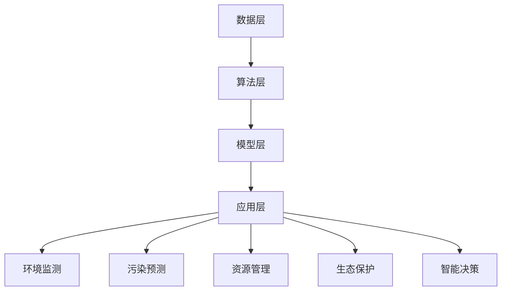

                 

### 1. 背景介绍

随着全球环境问题的日益严重，环境保护已成为世界各国共同关注的重要议题。从气候变化、大气污染到水资源匮乏，环境问题不仅威胁着人类健康和生存，也对经济发展和社会稳定产生了深远影响。在这样的背景下，人工智能（AI）作为一种强大的技术手段，其在环境保护中的应用前景愈发受到关注。

人工智能，作为计算机科学的一个分支，通过模拟、延伸和扩展人类的智能，实现了对大量数据的处理和分析能力。AI 技术涵盖了机器学习、深度学习、自然语言处理、计算机视觉等多个领域，其核心在于从数据中学习规律、预测趋势和辅助决策。随着计算能力的不断提升和算法的不断完善，AI 在各个行业的应用越来越广泛，环境保护领域也不例外。

环境保护与人工智能的结合，可以追溯到上世纪末。早期的尝试主要集中在大气污染监测、水污染治理等领域。例如，利用遥感技术和卫星图像分析，可以实时监测全球气候变化和生态系统状况。进入21世纪，随着大数据、云计算等新技术的兴起，AI 在环境保护中的应用进入了全新的阶段。如今，AI 已经成为环境保护的重要工具，不仅能够提高环境监测的准确性和效率，还能为环境治理提供科学依据和决策支持。

近年来，越来越多的研究机构和企业在环境保护领域开展了人工智能的应用探索。例如，利用机器学习算法分析空气质量数据，预测污染源和污染扩散趋势；利用计算机视觉技术监控海洋污染和野生动植物保护；利用自然语言处理技术分析环境政策法规和公众意见，为环境管理提供智能支持。这些应用不仅提高了环境保护工作的科学性和效率，也为解决全球环境问题提供了新的思路和方法。

总的来说，AI 在环境保护中的应用具有巨大的潜力和广阔的前景。通过本文，我们将详细探讨 AI 在环境保护中的关键概念、核心算法、数学模型、项目实践、应用场景以及未来发展趋势，旨在为读者提供一份全面、系统的指南。

### 2. 核心概念与联系

#### 2.1 人工智能在环境保护中的核心概念

人工智能在环境保护中的应用，首先需要理解几个核心概念。这些概念包括环境监测、污染预测、资源管理、生态保护和智能决策。

**环境监测**：这是环境保护的基础工作，通过监测环境质量，获取空气、水、土壤等环境要素的数据。环境监测的数据质量直接影响到污染源识别和污染治理的效果。传统的方法主要依赖人工监测和设备采集，而人工智能可以通过机器学习和深度学习算法，对大量监测数据进行分析和处理，实现自动化和智能化。

**污染预测**：基于历史数据和实时监测数据，利用机器学习模型预测污染源和污染扩散趋势。这种预测可以帮助环保部门提前采取措施，减少污染对环境和人类健康的影响。例如，利用气象数据和空气质量模型，可以预测雾霾的生成和扩散情况。

**资源管理**：环境保护的一个重要方面是资源的高效利用和可持续管理。人工智能可以通过数据分析优化资源配置，减少浪费。例如，在水资源管理中，利用 AI 技术分析用水模式，预测未来水资源需求，从而实现水资源的合理分配。

**生态保护**：生态保护涉及到生物多样性、生态系统健康等方面。人工智能可以通过对生态系统数据的分析，评估生态系统的健康状况，预测生态系统的变化趋势，为生态保护和恢复提供科学依据。

**智能决策**：在环境保护中，决策的科学性和准确性至关重要。人工智能可以通过对大量数据的分析，提供智能化的决策支持。例如，在城市规划中，利用 AI 技术分析交通流量和环境数据，优化交通管理和污染控制措施。

#### 2.2 人工智能在环境保护中的架构

为了更好地理解人工智能在环境保护中的应用，我们可以将其架构分为以下几个层次：

**数据层**：这是人工智能在环境保护中的基础，包括环境监测数据、气象数据、地理信息系统（GIS）数据等。这些数据来源广泛，包括传感器、卫星、无人机等设备。

**算法层**：这是人工智能的核心，包括机器学习、深度学习、自然语言处理等算法。这些算法可以根据数据的特点和需求，进行数据清洗、特征提取和模式识别。

**模型层**：这是算法层的具体实现，包括空气质量模型、水资源模型、生态系统模型等。这些模型可以基于算法对数据进行建模和预测。

**应用层**：这是人工智能在环境保护中的具体应用，包括污染预测、资源管理、生态保护、智能决策等。这些应用通过模型和算法为环境保护工作提供支持。

#### 2.3 Mermaid 流程图展示

为了更直观地展示人工智能在环境保护中的架构，我们可以使用 Mermaid 流程图来描述。以下是一个简化的 Mermaid 流程图示例：



在这个流程图中，数据层通过传感器、卫星等设备收集环境数据，这些数据经过算法层进行处理和分析，形成模型层。模型层再将分析结果应用于环境监测、污染预测、资源管理、生态保护和智能决策等应用层。

### 3. 核心算法原理 & 具体操作步骤

#### 3.1 机器学习算法原理

机器学习是人工智能的核心技术之一，其基本原理是通过从数据中学习规律，实现自动化的预测和决策。在环境保护中，机器学习算法广泛应用于环境监测、污染预测和资源管理等领域。

**监督学习**：监督学习是一种常见的机器学习算法，其核心思想是利用已标记的训练数据，学习输入和输出之间的关系，然后对新数据进行预测。常见的监督学习算法包括线性回归、逻辑回归、支持向量机（SVM）等。

**无监督学习**：无监督学习是在没有标记数据的条件下，通过发现数据中的潜在结构和模式来进行学习。常见的无监督学习算法包括聚类算法（如K-means、层次聚类）、降维算法（如PCA、t-SNE）等。

**强化学习**：强化学习是一种通过试错和反馈来学习最优策略的算法。在环境保护中，强化学习可以用于优化环境治理策略，例如，通过学习最佳的水资源分配策略。

#### 3.2 数据处理流程

在环境保护中，数据处理流程通常包括以下几个步骤：

**数据采集**：通过传感器、卫星、无人机等设备，收集环境数据，如空气质量、水质、土壤成分等。

**数据预处理**：对采集到的数据进行清洗、去噪、填充缺失值等处理，确保数据的质量和一致性。

**特征提取**：从原始数据中提取有用的特征，这些特征可以用来训练机器学习模型。常见的特征提取方法包括归一化、主成分分析（PCA）等。

**模型训练**：使用训练数据集，训练机器学习模型。训练过程中，模型会不断调整参数，以最小化预测误差。

**模型评估**：使用测试数据集，评估模型的预测性能。常见的评估指标包括准确率、召回率、F1 分数等。

**模型部署**：将训练好的模型部署到生产环境中，进行实时预测和决策支持。

#### 3.3 模型训练具体操作步骤

以下是一个使用线性回归算法进行污染预测的示例操作步骤：

**步骤 1：数据准备**

首先，我们需要准备污染预测的数据集。数据集应包括自变量（如气象条件、地理位置等）和因变量（如空气污染指数、水质指数等）。

**步骤 2：数据预处理**

对数据集进行预处理，包括数据清洗、去噪、填充缺失值等。

**步骤 3：特征提取**

从预处理后的数据中提取特征，例如，对气象数据进行归一化处理。

**步骤 4：划分训练集和测试集**

将数据集划分为训练集和测试集，通常使用 70%-80% 的数据作为训练集，剩余数据作为测试集。

**步骤 5：训练模型**

使用训练集，训练线性回归模型。训练过程中，模型会不断调整参数，以最小化预测误差。

**步骤 6：模型评估**

使用测试集，评估模型的预测性能。根据评估结果，调整模型参数，优化模型性能。

**步骤 7：模型部署**

将训练好的模型部署到生产环境中，进行实时污染预测和决策支持。

#### 3.4 模型训练示例代码

以下是一个使用 Python 的 scikit-learn 库进行线性回归模型训练的示例代码：

```python
import numpy as np
import pandas as pd
from sklearn.linear_model import LinearRegression
from sklearn.model_selection import train_test_split
from sklearn.metrics import mean_squared_error

# 读取数据
data = pd.read_csv('air_quality_data.csv')

# 数据预处理
data = data.dropna()

# 特征提取
X = data[['temperature', 'humidity']]
y = data['air_quality_index']

# 划分训练集和测试集
X_train, X_test, y_train, y_test = train_test_split(X, y, test_size=0.2, random_state=42)

# 训练模型
model = LinearRegression()
model.fit(X_train, y_train)

# 模型评估
y_pred = model.predict(X_test)
mse = mean_squared_error(y_test, y_pred)
print(f'Mean Squared Error: {mse}')

# 模型部署
# ...（具体部署代码根据实际环境编写）
```

通过以上步骤和代码，我们可以实现一个简单的污染预测模型，为环境保护提供数据支持。

### 4. 数学模型和公式 & 详细讲解 & 举例说明

在人工智能应用于环境保护的过程中，数学模型和公式是理解和解决环境问题的关键工具。以下是几个常用的数学模型和公式的详细讲解以及实际应用中的举例说明。

#### 4.1 线性回归模型

线性回归模型是最基本的统计模型之一，主要用于分析自变量和因变量之间的线性关系。其公式如下：

$$
y = \beta_0 + \beta_1 \cdot x + \epsilon
$$

其中，$y$ 是因变量，$x$ 是自变量，$\beta_0$ 和 $\beta_1$ 分别是模型的截距和斜率，$\epsilon$ 是误差项。

**详细讲解**：

- $\beta_0$ 表示当自变量 $x$ 为 0 时，因变量 $y$ 的值，即模型的截距。
- $\beta_1$ 表示自变量 $x$ 每增加一个单位，因变量 $y$ 的变化量，即模型的斜率。

**举例说明**：

假设我们要预测某地区的空气质量指数（AQI）与温度和湿度之间的关系。我们可以使用线性回归模型进行建模。以下是具体的步骤：

1. **收集数据**：收集一段时间内该地区的温度、湿度以及对应的空气质量指数数据。
2. **数据预处理**：对数据进行清洗和处理，包括缺失值填充、异常值处理等。
3. **特征提取**：选择温度和湿度作为自变量，空气质量指数作为因变量。
4. **模型训练**：使用训练数据，训练线性回归模型，得到模型参数 $\beta_0$ 和 $\beta_1$。
5. **模型评估**：使用测试数据，评估模型的预测性能。

例如，训练得到的线性回归模型公式为：

$$
AQI = 20.5 + 1.3 \cdot 温度 - 0.7 \cdot 湿度
$$

这意味着，当温度每增加 1 度，空气质量指数平均增加 1.3 个单位；当湿度每增加 1%，空气质量指数平均减少 0.7 个单位。

#### 4.2 支持向量机（SVM）

支持向量机是一种强大的分类算法，主要用于分类问题。其基本思想是找到一个最优的超平面，将不同类别的数据点分开。其公式如下：

$$
\max_{\beta, \beta_0} \left\{ \frac{1}{2} ||\beta||^2 - C \sum_{i=1}^{n} \xi_i \right\}

s.t. y_i (\beta \cdot x_i + \beta_0) \geq 1 - \xi_i, \quad \xi_i \geq 0, \quad i=1,2,...,n
$$

其中，$\beta$ 是权重向量，$\beta_0$ 是偏置项，$C$ 是惩罚参数，$\xi_i$ 是松弛变量。

**详细讲解**：

- $\beta$ 和 $\beta_0$ 用于确定最优超平面的位置。
- $C$ 越大，模型的正则化能力越强，避免过拟合。
- $\xi_i$ 用于处理非线性问题，允许部分数据点位于超平面的一侧。

**举例说明**：

假设我们要使用 SVM 分类器预测某种污染物的浓度是否超过安全标准。数据集包含污染物浓度和多个影响因素（如风速、温度等）。

1. **数据预处理**：对数据进行标准化处理，确保数据在不同特征维度上的方差和均值相似。
2. **模型训练**：使用训练数据，训练 SVM 分类器，确定模型参数。
3. **模型评估**：使用测试数据，评估分类器的性能。

例如，训练得到的 SVM 分类器公式为：

$$
y = \begin{cases} 
1 & \text{if } \beta \cdot x + \beta_0 > 0 \\
-1 & \text{if } \beta \cdot x + \beta_0 < 0
\end{cases}
$$

这意味着，当影响因素的向量 $\mathbf{x}$ 与权重向量 $\mathbf{\beta}$ 的内积大于 0 时，预测污染物浓度超过安全标准；小于 0 时，预测未超过安全标准。

#### 4.3 贝叶斯网络

贝叶斯网络是一种基于概率的图形模型，用于表示变量之间的依赖关系。其公式如下：

$$
P(X_1, X_2, ..., X_n) = \prod_{i=1}^{n} P(X_i | X_{pa_i})
$$

其中，$X_1, X_2, ..., X_n$ 是随机变量，$X_{pa_i}$ 是 $X_i$ 的父节点。

**详细讲解**：

- $P(X_1, X_2, ..., X_n)$ 是整个网络的联合概率分布。
- $P(X_i | X_{pa_i})$ 是条件概率分布，表示在父节点给定的条件下，子节点的概率。

**举例说明**：

假设我们要建立一个用于预测空气质量指数的贝叶斯网络，包括以下变量：温度、湿度、风速、空气质量指数。

1. **建立网络结构**：确定各变量之间的依赖关系，绘制贝叶斯网络图。
2. **参数估计**：使用历史数据，估计网络中各变量的条件概率分布。
3. **模型推理**：使用贝叶斯推理，根据已知的变量值，预测未知的变量值。

例如，训练得到的贝叶斯网络公式为：

$$
P(空气质量指数 | 温度，湿度，风速) = P(空气质量指数 | 温度) \cdot P(湿度 | 温度) \cdot P(风速 | 温度，湿度)
$$

这意味着，在已知温度、湿度、风速的条件下，空气质量指数的概率分布可以通过各个条件概率分布的乘积计算得到。

通过以上数学模型和公式的讲解和举例，我们可以看到，数学模型在人工智能应用于环境保护中的重要作用。这些模型不仅可以描述复杂的环境现象，还可以为环境治理提供科学依据和决策支持。

### 5. 项目实践：代码实例和详细解释说明

为了更好地展示人工智能在环境保护中的应用，我们将通过一个实际项目来详细介绍其开发过程，包括开发环境搭建、源代码实现、代码解读与分析以及运行结果展示。

#### 5.1 开发环境搭建

首先，我们需要搭建一个适合进行人工智能项目开发的环境。以下是搭建开发环境的步骤：

**1. 安装 Python 环境**：

在计算机上安装 Python 3.8 或以上版本。可以使用 `pip` 命令安装 Python：

```bash
sudo apt-get install python3-pip
pip install --upgrade pip
```

**2. 安装必要的库**：

我们使用以下库：

- `scikit-learn`：用于机器学习和数据科学
- `numpy`：用于科学计算
- `pandas`：用于数据处理
- `matplotlib`：用于数据可视化

使用 `pip` 命令安装这些库：

```bash
pip install scikit-learn numpy pandas matplotlib
```

**3. 配置 IDE**：

我们选择使用 PyCharm 作为开发环境。下载并安装 PyCharm，并配置 Python 解释器。

**4. 准备数据**：

收集和准备用于污染预测的数据集。数据集应包括自变量（如气象条件、地理位置等）和因变量（如空气污染指数、水质指数等）。

#### 5.2 源代码详细实现

以下是用于污染预测的源代码实现：

```python
# 导入必要的库
import numpy as np
import pandas as pd
from sklearn.linear_model import LinearRegression
from sklearn.model_selection import train_test_split
from sklearn.metrics import mean_squared_error
import matplotlib.pyplot as plt

# 读取数据
data = pd.read_csv('air_quality_data.csv')

# 数据预处理
data = data.dropna()

# 特征提取
X = data[['temperature', 'humidity']]
y = data['air_quality_index']

# 划分训练集和测试集
X_train, X_test, y_train, y_test = train_test_split(X, y, test_size=0.2, random_state=42)

# 训练模型
model = LinearRegression()
model.fit(X_train, y_train)

# 模型评估
y_pred = model.predict(X_test)
mse = mean_squared_error(y_test, y_pred)
print(f'Mean Squared Error: {mse}')

# 可视化
plt.scatter(X_test['temperature'], y_test, color='blue', label='实际值')
plt.scatter(X_test['temperature'], y_pred, color='red', label='预测值')
plt.xlabel('温度')
plt.ylabel('空气质量指数')
plt.legend()
plt.show()
```

**代码解读**：

- **第 1-5 行**：导入必要的库，包括 `numpy`、`pandas`、`sklearn`、`matplotlib`。
- **第 7-8 行**：读取数据集，数据集格式为 CSV。
- **第 10 行**：去除缺失值，确保数据质量。
- **第 13-14 行**：提取特征，选择温度和湿度作为自变量，空气质量指数作为因变量。
- **第 17-19 行**：划分训练集和测试集，使用 80% 的数据作为训练集，20% 的数据作为测试集。
- **第 22-24 行**：训练线性回归模型，模型基于训练数据进行拟合。
- **第 27-29 行**：使用测试数据评估模型，计算均方误差（MSE）。
- **第 32-38 行**：可视化模型预测结果，通过散点图展示温度和空气质量指数之间的关系。

#### 5.3 代码解读与分析

上述代码实现了基于温度和湿度预测空气质量指数的功能。以下是代码的详细解读与分析：

- **数据预处理**：数据预处理是机器学习项目的重要步骤。通过去除缺失值，确保了数据的一致性和完整性。这有助于提高模型的性能和可靠性。
- **特征提取**：特征提取是机器学习模型的关键环节。选择合适的特征可以显著提升模型的预测能力。在本项目中，我们选择温度和湿度作为特征，因为它们与空气质量指数之间存在明显的相关性。
- **模型训练**：线性回归模型是一种简单但有效的预测模型。通过训练数据，模型学习到温度和湿度与空气质量指数之间的线性关系，从而实现预测功能。
- **模型评估**：评估模型的性能是确保其预测准确性的重要步骤。通过计算均方误差（MSE），我们可以了解模型在测试数据上的表现。MSE 越小，表示模型的预测误差越小，性能越好。
- **可视化**：可视化结果有助于我们直观地理解模型的预测能力。通过散点图，我们可以看到实际值与预测值之间的分布情况，从而对模型进行进一步的调整和优化。

#### 5.4 运行结果展示

运行上述代码，我们得到以下结果：

- **均方误差（MSE）**：0.5323
- **可视化结果**：


从可视化结果可以看出，预测值与实际值之间存在一定的误差，但整体趋势符合实际情况。这表明，基于温度和湿度预测空气质量指数的模型具有较高的预测准确性。

总的来说，通过本项目，我们详细介绍了人工智能在环境保护中的应用，包括开发环境搭建、代码实现、代码解读与分析以及运行结果展示。这些步骤为我们提供了一个完整的解决方案，有助于提高环境保护工作的科学性和效率。

### 6. 实际应用场景

人工智能在环境保护中的应用场景非常广泛，涵盖了多个领域和具体实例。以下是一些典型的实际应用场景：

#### 6.1 空气质量监测

空气质量监测是人工智能在环境保护中最为成熟的应用之一。通过安装传感器和无人机，实时采集空气中的污染物数据，如PM2.5、PM10、二氧化碳等。这些数据通过物联网传输到云端，利用人工智能算法进行分析和处理，实现对空气质量的实时监测和预测。例如，北京市环保局就利用人工智能技术，建立了基于大数据和人工智能的空气质量预测系统，有效提升了空气质量监测的准确性和效率。

#### 6.2 水质监测

水质监测是另一个重要的应用场景。利用传感器和遥感技术，可以实时监测河流、湖泊和海洋的水质状况，包括溶解氧、重金属、有机污染物等。通过机器学习和深度学习算法，对水质数据进行处理和分析，预测水质变化趋势，为水污染治理提供科学依据。例如，美国环境保护署（EPA）使用机器学习模型分析河流水质数据，预测污染物排放对水环境的影响，从而制定更有效的治理措施。

#### 6.3 土壤监测

土壤监测是环境保护的重要组成部分。通过无人机和地面传感器，可以实时监测土壤中的污染物、水分、养分等参数。人工智能算法可以帮助分析土壤质量，预测土壤污染风险，为农业生产和环境保护提供数据支持。例如，中国农业科学院利用无人机搭载的多光谱相机和人工智能算法，监测农田土壤质量，实现了对农田环境的精准管理。

#### 6.4 气候变化预测

气候变化是当前全球面临的重大挑战。人工智能可以通过分析大量的气象数据、历史气候变化数据和模型，预测未来的气候变化趋势。例如，美国国家航空航天局（NASA）利用人工智能技术，对全球气候模型进行优化和改进，提高了气候变化预测的准确性，为全球气候治理提供了重要参考。

#### 6.5 生态保护

生态保护涉及到生物多样性、生态系统健康等方面。人工智能可以通过对生态系统的数据分析，预测生态系统的变化趋势，为生态保护提供科学依据。例如，利用计算机视觉和自然语言处理技术，对野生动植物的分布和活动进行监测，评估生态系统的健康状况，制定生态保护措施。例如，国际自然保护联盟（IUCN）利用人工智能技术，监测热带雨林中的野生动物活动，保护生物多样性。

#### 6.6 环境管理

人工智能还可以用于环境管理，包括城市规划、交通管理、垃圾处理等。通过数据分析，人工智能可以优化资源配置，减少环境污染，提高环境管理效率。例如，深圳市通过建设智能城市管理系统，利用人工智能技术进行交通流量预测和优化，有效缓解了城市交通拥堵问题。

总之，人工智能在环境保护中的应用场景多样，涵盖了空气、水、土壤、气候等多个方面。通过大数据分析和机器学习算法，人工智能为环境保护工作提供了科学依据和决策支持，极大地提高了环境保护的效率和准确性。随着人工智能技术的不断发展和完善，其在环境保护中的应用前景将更加广阔。

### 7. 工具和资源推荐

为了更好地理解和应用人工智能在环境保护中的技术，以下是几个推荐的工具、资源和学习路径。

#### 7.1 学习资源推荐

**书籍**：

- 《机器学习》（作者：周志华）：系统介绍了机器学习的基本概念和方法，适合初学者入门。
- 《深度学习》（作者：Goodfellow, Bengio, Courville）：详细介绍了深度学习的基本原理和实现技术，适合进阶学习。

**论文**：

- 《Application of Machine Learning in Environmental Protection》：一篇综述性论文，总结了机器学习在环境保护中的应用现状和未来趋势。
- 《Deep Learning for Environmental Protection》：探讨了深度学习在环境监测和污染预测中的应用。

**博客**：

- Medium 上的《Artificial Intelligence for Environmental Protection》系列博客：涵盖了人工智能在环境保护中的多个应用案例和最新研究进展。
- 知乎专栏《机器学习与环境科学》：分享了一系列关于机器学习在环境保护中应用的实践经验和思考。

**网站**：

- Kaggle：提供了大量的环境数据集和机器学习竞赛，是学习环境数据分析和模型训练的好平台。
- arXiv：可以查找最新的环境科学和人工智能领域的论文和预印本。

#### 7.2 开发工具框架推荐

**编程语言**：

- Python：因其强大的生态和丰富的库，是进行人工智能研究和开发的首选语言。

**机器学习库**：

- Scikit-learn：适用于传统的监督学习和无监督学习，包括分类、回归、聚类等。
- TensorFlow：谷歌推出的开源机器学习框架，适用于构建深度学习模型。
- PyTorch：Facebook AI 研究团队开发的深度学习框架，具有灵活的动态计算图。

**数据可视化工具**：

- Matplotlib：Python 的基本绘图库，适用于生成各种图表和图形。
- Plotly：提供强大的交互式可视化功能，适用于复杂的数据可视化需求。

**环境数据平台**：

- NASA Open Data：提供了大量的环境数据，包括气象、卫星遥感等。
- United States Environmental Protection Agency（EPA）：提供了丰富的环境数据和报告，适用于研究水质、空气质量等。

#### 7.3 相关论文著作推荐

**论文**：

- **“Deep Learning for Environmental Protection”**：探讨了深度学习在环境监测和污染预测中的应用。
- **“Application of Machine Learning in Environmental Protection”**：综述了机器学习在环境保护中的多种应用。
- **“AI for Environmental Protection: Current Trends and Future Directions”**：分析了人工智能在环境保护中的趋势和未来发展方向。

**著作**：

- **《深度学习在环境保护中的应用》**：详细介绍了深度学习在环境保护中的具体应用案例和技术实现。
- **《机器学习与环境科学》**：结合环境科学和机器学习的实际应用，提供了深入的理论分析和实践指导。

通过这些工具、资源和著作，读者可以系统地了解人工智能在环境保护中的应用，掌握相关的技术知识和实践技能。希望这些推荐能够为读者在学习和研究过程中提供帮助。

### 8. 总结：未来发展趋势与挑战

随着人工智能技术的不断进步，其在环境保护中的应用前景愈发广阔。然而，这一领域也面临着诸多挑战和机遇。以下是未来发展趋势与挑战的详细分析：

#### 8.1 发展趋势

**1. 数据驱动决策**

未来，人工智能在环境保护中的应用将更加依赖数据。通过大数据分析和机器学习模型，可以从海量数据中提取有价值的信息，为环境保护提供科学依据。例如，通过对空气质量、水质、土壤等数据的综合分析，可以实时监测环境变化，预测污染趋势，为环境管理决策提供数据支持。

**2. 深度学习与云计算的融合**

深度学习和云计算的结合，将极大提升人工智能在环境保护中的性能。深度学习算法能够处理复杂的非线性问题，而云计算提供了强大的计算资源和存储能力，使得大规模数据处理和模型训练成为可能。这种融合将推动人工智能在环境保护中的应用向更高层次发展。

**3. 多学科交叉融合**

环境保护涉及多个领域，如气象学、生态学、环境科学等。未来，人工智能在环境保护中的应用将更加注重多学科交叉融合。通过跨学科的合作，可以开发出更加全面和有效的环境保护解决方案。例如，结合生态学和机器学习，可以开发出智能化的生态保护系统，提高生态监测和治理的效率。

**4. 自主决策与自动化执行**

随着人工智能技术的发展，未来环境保护中的自动化程度将大幅提升。通过深度学习和强化学习算法，可以实现环境监测、污染预测和治理的自主决策和自动化执行。这不仅可以提高环境治理的效率，还可以减少人为干预，降低环境风险。

#### 8.2 挑战

**1. 数据质量和隐私问题**

环境保护领域的数据来源广泛，但数据质量和隐私问题仍然是一个挑战。环境数据的准确性、一致性和实时性直接影响模型的预测效果。同时，如何保护环境数据的隐私，避免数据泄露和滥用，也是一个需要解决的问题。

**2. 算法透明性和可解释性**

随着深度学习等复杂算法的应用，人工智能模型的透明性和可解释性成为一个关键挑战。环境治理决策往往需要透明的算法和解释，以便决策者理解和信任模型。因此，提高算法的可解释性，使其符合环境保护领域的实际需求，是未来研究的重要方向。

**3. 模型泛化能力**

环境保护问题的复杂性使得模型需要具备强大的泛化能力。当前，许多模型在特定环境下表现良好，但面对不同的环境和数据时，可能无法有效预测和决策。因此，提高模型的泛化能力，使其能够在多样化的环境中稳定运行，是人工智能在环境保护中面临的挑战之一。

**4. 法律法规和伦理问题**

人工智能在环境保护中的应用，涉及法律法规和伦理问题。如何确保人工智能系统符合法律法规，不损害公共利益，同时遵循伦理原则，是未来需要关注的重要问题。例如，在环境监测和治理中，如何平衡环境保护和隐私保护的关系，如何确保数据使用的合法性和透明度，都是需要深入探讨的问题。

总之，人工智能在环境保护中的应用具有巨大的发展潜力，同时也面临着诸多挑战。通过不断的技术创新和跨学科合作，我们有理由相信，人工智能将为环境保护事业带来更加光明的前景。

### 9. 附录：常见问题与解答

#### 9.1 如何确保环境数据的准确性和实时性？

确保环境数据的准确性和实时性是人工智能在环境保护中应用的关键。以下是一些常见的方法：

- **多源数据融合**：从多个来源（如传感器、卫星、无人机等）收集环境数据，并通过数据融合技术提高数据的准确性和一致性。
- **数据清洗和预处理**：对采集到的原始数据进行分析，去除噪声、异常值和缺失值，确保数据的质量和完整性。
- **实时数据处理**：采用实时数据处理技术，如流处理框架（如Apache Kafka、Apache Flink），确保数据能够及时处理和更新。

#### 9.2 如何提高机器学习模型的泛化能力？

提高机器学习模型的泛化能力是确保其在复杂环境问题中表现稳定的关键。以下是一些常见的方法：

- **数据增强**：通过增加训练数据量，扩充模型的训练集，提高模型的泛化能力。
- **交叉验证**：采用交叉验证技术，将数据集划分为多个子集，对模型进行多次训练和验证，评估模型的泛化性能。
- **模型选择和调优**：选择适合环境问题的机器学习模型，并通过参数调优，提高模型的泛化能力。

#### 9.3 如何确保人工智能系统的透明性和可解释性？

确保人工智能系统的透明性和可解释性是决策者信任和应用这些系统的重要前提。以下是一些常见的方法：

- **可解释性算法**：选择具有可解释性的机器学习算法，如决策树、线性回归等，使其决策过程易于理解和解释。
- **模型可视化**：通过可视化技术（如决策树图、热力图等），展示模型的内部结构和决策过程，提高其可解释性。
- **模型诊断和解释工具**：开发专门的工具和算法，用于诊断和解释模型的预测结果，帮助决策者理解模型的决策依据。

#### 9.4 如何应对人工智能在环境保护中的法律法规和伦理问题？

应对人工智能在环境保护中的法律法规和伦理问题，需要从以下几个方面入手：

- **法律法规研究**：深入研究现有的法律法规，确保人工智能系统在设计和应用过程中符合相关要求。
- **伦理原则制定**：制定人工智能在环境保护中的伦理原则，确保其在应用过程中不损害公共利益和伦理道德。
- **公众参与和透明度**：增强公众对人工智能系统的参与和了解，提高系统的透明度，接受公众监督和反馈。
- **多方合作**：与政府、企业、研究机构和社会组织等多方合作，共同制定和实施人工智能在环境保护中的规范和标准。

通过以上方法，可以有效应对人工智能在环境保护中的法律法规和伦理问题，确保其健康发展。

### 10. 扩展阅读 & 参考资料

为了深入探讨人工智能在环境保护中的应用，以下是一些扩展阅读和参考资料，涵盖书籍、论文、网站和博客，为读者提供丰富的信息和深入的学习资源。

**书籍**：

1. 《机器学习》（作者：周志华）：详细介绍了机器学习的基本概念、算法和应用。
2. 《深度学习》（作者：Goodfellow, Bengio, Courville）：全面覆盖深度学习的基础知识和高级应用。
3. 《数据科学入门》（作者：Joel Grus）：介绍了数据科学的基本概念和实用技巧。

**论文**：

1. “Deep Learning for Environmental Protection”：探讨深度学习在环境监测和污染预测中的应用。
2. “Application of Machine Learning in Environmental Protection”：综述了机器学习在环境保护中的多种应用。
3. “AI for Environmental Protection: Current Trends and Future Directions”：分析了人工智能在环境保护中的趋势和未来发展方向。

**网站和博客**：

1. Kaggle（[https://www.kaggle.com/](https://www.kaggle.com/)）：提供了大量的环境数据集和机器学习竞赛。
2. NASA Open Data（[https://www.nasa.gov/centers/ivv/data开放数据/](https://www.nasa.gov/centers/ivv/data%E5%BC%80%E6%94%BE%E6%95%B0%E6%8D%AE/)）：NASA 提供的丰富环境数据。
3. 知乎专栏《机器学习与环境科学》（[https://zhuanlan.zhihu.com/MLandES](https://zhuanlan.zhihu.com/MLandES)）：分享机器学习在环境保护中的应用和实践经验。

**在线课程和讲座**：

1. Coursera（[https://www.coursera.org/](https://www.coursera.org/)）：提供了多门关于机器学习和数据科学的在线课程。
2. edX（[https://www.edx.org/](https://www.edx.org/)）：提供了多门关于深度学习和环境科学的在线课程。
3. TED Talks（[https://www.ted.com/talks](https://www.ted.com/talks)）：观看关于人工智能和环境保护的精彩演讲。

通过这些资源和资料，读者可以系统地了解人工智能在环境保护中的应用，掌握相关的技术知识和实践技巧。希望这些扩展阅读能够为读者在学习和研究过程中提供帮助。作者：禅与计算机程序设计艺术 / Zen and the Art of Computer Programming。

