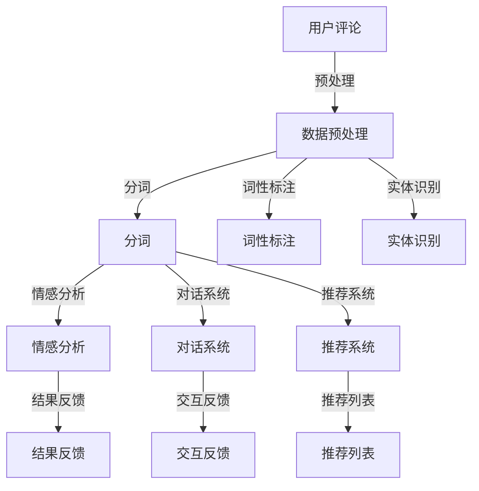

                 

### 背景介绍

随着电子商务行业的迅猛发展，在线购物已经成为人们日常生活的一部分。电商平台面临着海量用户数据的处理和高效服务质量的保障。自然语言处理（NLP）技术在电商中的应用，成为了提升用户体验、提高运营效率的关键因素。

自然语言处理（NLP）是人工智能（AI）的一个重要分支，它使计算机能够理解、生成和处理人类语言。在电商领域，NLP技术可以应用于用户评论分析、智能客服、商品推荐等多个方面，极大地提升了电商平台的智能化程度。

#### 1.1 电商行业现状

截至2023年，全球电子商务市场规模已超过4万亿美元，预计未来几年仍将保持高速增长。电商行业竞争激烈，用户对服务质量的要求越来越高。为了满足这些需求，电商平台必须不断创新，提升用户体验。

在电商运营中，处理大量用户评论和反馈是一项重要任务。这些评论和反馈不仅反映了用户对商品的满意度，还包含了对产品、服务、物流等方面的意见。如何快速、准确地分析这些评论，提取有用的信息，为电商平台提供决策支持，成为了关键问题。

此外，智能客服在电商中的重要性也越来越突出。智能客服系统能够自动处理用户咨询，提供快速、准确的回答，减轻人工客服的工作负担，提高客服效率。

#### 1.2 NLP在电商中的应用

NLP技术在电商中的应用主要体现在以下几个方面：

1. **用户评论分析**：通过NLP技术，可以自动化地分析用户评论，提取关键信息，评估商品满意度，发现潜在问题。
2. **智能客服**：利用NLP技术，构建智能客服系统，实现与用户的自然语言交互，提供个性化、高效的客服服务。
3. **商品推荐**：基于用户的历史行为和偏好，使用NLP技术分析用户评论和反馈，为用户推荐更符合其需求的商品。
4. **语音助手**：语音识别和语义理解技术的结合，使得电商平台能够提供语音购物服务，进一步优化用户购物体验。

#### 1.3 本文结构

本文将从以下几个方面展开讨论：

1. **背景介绍**：介绍电商行业现状和NLP技术的应用场景。
2. **核心概念与联系**：阐述NLP技术的基本原理和相关架构。
3. **核心算法原理 & 具体操作步骤**：详细讲解NLP技术在电商中应用的算法原理和操作步骤。
4. **数学模型和公式 & 详细讲解 & 举例说明**：介绍NLP技术中使用的数学模型和公式，并通过实例进行详细说明。
5. **项目实践：代码实例和详细解释说明**：提供具体的项目实践案例，包括开发环境搭建、源代码实现、代码解读与分析。
6. **实际应用场景**：分析NLP技术在电商中的实际应用案例。
7. **工具和资源推荐**：推荐相关的学习资源、开发工具和框架。
8. **总结：未来发展趋势与挑战**：总结NLP技术在电商中的应用前景，以及面临的挑战。
9. **附录：常见问题与解答**：解答读者可能遇到的常见问题。
10. **扩展阅读 & 参考资料**：提供进一步阅读和研究的参考资料。

通过本文的深入探讨，希望能够帮助读者了解NLP技术在电商中的应用，以及如何有效地利用这一技术提升电商平台的运营效率和服务质量。

### 核心概念与联系

在深入探讨NLP在电商中的应用之前，我们首先需要理解NLP的基本概念和相关的技术架构。以下将介绍NLP的核心概念、基本原理以及其在电商中的应用架构。

#### 2.1 NLP的核心概念

**自然语言**：自然语言是人类日常交流使用的语言，包括口头和书面形式。它具有语法、语义、语用等复杂特性，使得计算机理解自然语言成为一个挑战。

**文本处理**：文本处理是NLP的基础，包括文本的分词、词性标注、实体识别等任务。这些任务帮助计算机将原始文本转化为结构化的数据，为后续分析做好准备。

**语义理解**：语义理解是NLP的关键任务之一，旨在理解文本的深层含义。这包括词义消歧、情感分析、意图识别等。

**语言模型**：语言模型是NLP中用于预测下一个单词或句子的概率分布的模型。常见的语言模型有n-gram模型、循环神经网络（RNN）模型、Transformer模型等。

**对话系统**：对话系统是NLP的应用之一，旨在实现人与机器之间的自然语言交互。它包括语音助手、聊天机器人、智能客服等。

#### 2.2 NLP的技术架构

NLP技术架构通常包括以下几个层次：

**数据层**：这一层包括原始文本数据、标注数据、预训练模型数据等。这些数据是NLP任务的基础。

**模型层**：这一层包括各种NLP模型，如分词模型、词向量模型、情感分析模型、命名实体识别模型等。这些模型负责处理数据，提取特征，实现具体的NLP任务。

**接口层**：这一层包括API接口、Web服务、命令行工具等，用于提供NLP服务的接入点。

**应用层**：这一层是NLP技术在实际应用中的具体实现，如用户评论分析、智能客服、商品推荐等。

#### 2.3 NLP在电商中的应用架构

在电商领域，NLP的应用架构通常如图2-1所示：

```
+----------------+     +----------------+     +----------------+
|     用户       |     |   电商平台      |     |   NLP系统      |
+----------------+     +----------------+     +----------------+
           |             |              |              |
           |   用户评论   |   智能客服    |   商品推荐    |
           |             |              |              |
           |             |              |              |
+----------+   +----------+   +----------+   +----------+
| 文本处理 |   | 对话系统 |   | 推荐系统 |   | 情感分析 |   |
+----------+   +----------+   +----------+   +----------+
           |             |              |              |
           |   数据层    |   模型层      |   应用层      |
           |             |              |              |
           |             |              |              |
+----------------+     +----------------+     +----------------+
                        |              |
                        |   API接口    |
                        |              |
+----------------+     +----------------+
|   开发工具    |     |   开发环境    |
+----------------+     +----------------+
```

**数据层**：电商平台收集用户的评论、行为数据，以及商品信息等，这些数据经过预处理后用于训练和评估NLP模型。

**模型层**：包括分词模型、词向量模型、情感分析模型、命名实体识别模型等。这些模型负责处理用户评论、行为数据等，提取特征，实现情感分析、商品推荐等功能。

**应用层**：NLP系统为电商平台提供具体的业务功能，如情感分析用于评估商品满意度，对话系统用于智能客服，推荐系统用于个性化商品推荐。

**接口层**：提供API接口，方便开发者接入NLP服务，实现与电商平台的集成。

#### 2.4 Mermaid流程图

以下是一个简化的NLP在电商中的应用架构的Mermaid流程图：



在这个流程图中，用户评论经过预处理后，先进行分词、词性标注和实体识别等文本处理任务。随后，这些处理结果被输入到情感分析、对话系统和推荐系统等应用中，最终生成结果反馈、交互反馈和推荐列表等。

通过以上介绍，我们可以看到NLP技术在电商中的应用是如何从数据层、模型层到应用层逐步实现具体功能的。接下来，我们将深入探讨NLP在电商中的核心算法原理和具体操作步骤。

### 核心算法原理 & 具体操作步骤

在深入探讨NLP技术在电商中的应用时，理解其核心算法原理和具体操作步骤至关重要。以下将详细阐述NLP在电商中常用的情感分析、对话系统和推荐系统的算法原理，并给出具体操作步骤。

#### 3.1 情感分析

**情感分析**是NLP中的一项重要任务，旨在自动检测文本中表达的情感倾向。在电商领域，情感分析主要用于评估用户对商品、服务等的满意度。

**算法原理**：

1. **文本预处理**：包括去除停用词、标点符号、进行词形还原等操作，将原始文本转化为适合分析的格式。
2. **特征提取**：将预处理后的文本转化为特征向量。常用的特征提取方法包括TF-IDF、Word2Vec等。
3. **情感分类**：使用机器学习模型（如SVM、随机森林、神经网络等）对特征向量进行训练，以实现对文本情感倾向的预测。

**具体操作步骤**：

1. **数据准备**：收集电商平台的用户评论数据，并进行预处理。
2. **特征提取**：使用TF-IDF等方法提取文本特征。
3. **模型训练**：选择合适的机器学习模型进行训练，例如使用SVM进行情感分类。
4. **模型评估**：使用交叉验证等方法评估模型性能，调整模型参数以优化性能。
5. **情感预测**：将新的用户评论输入模型，预测其情感倾向。

#### 3.2 对话系统

**对话系统**是NLP在电商中应用的重要领域，旨在实现用户与电商平台的自然语言交互。对话系统通常包括语音助手和聊天机器人两种形式。

**算法原理**：

1. **意图识别**：理解用户的对话意图，如查询商品信息、进行购物咨询等。
2. **实体识别**：识别用户对话中的关键信息，如商品名称、价格、数量等。
3. **对话生成**：根据用户的意图和实体信息，生成自然语言的回复。

**具体操作步骤**：

1. **数据准备**：收集用户对话数据，进行预处理。
2. **意图识别**：使用机器学习模型（如决策树、长短期记忆网络（LSTM）等）对用户意图进行识别。
3. **实体识别**：使用命名实体识别（NER）模型对用户对话中的关键信息进行提取。
4. **对话生成**：根据意图和实体信息，使用模板匹配或生成模型（如Transformer、GPT等）生成自然语言回复。
5. **对话管理**：维护对话状态，处理对话中的上下文信息，实现连贯、自然的对话交互。

#### 3.3 推荐系统

**推荐系统**利用NLP技术，分析用户的历史行为和偏好，为用户推荐符合其需求的商品。在电商中，推荐系统是提高用户满意度和转化率的重要手段。

**算法原理**：

1. **用户行为分析**：收集并分析用户在电商平台的行为数据，如浏览记录、购买历史等。
2. **文本相似性计算**：使用文本相似性算法（如余弦相似性、词向量相似性等）计算用户行为数据与商品特征之间的相似度。
3. **推荐算法**：基于用户行为数据和文本相似性计算，使用推荐算法（如协同过滤、矩阵分解等）生成推荐列表。

**具体操作步骤**：

1. **数据收集**：收集用户在电商平台的行为数据，包括浏览、搜索、购买等。
2. **文本预处理**：对商品描述、评论等进行预处理，提取文本特征。
3. **相似性计算**：计算用户行为数据与商品特征之间的相似度。
4. **推荐生成**：使用推荐算法生成推荐列表，并根据用户偏好进行调整。
5. **推荐反馈**：将推荐结果反馈给用户，收集用户反馈信息，优化推荐效果。

通过以上介绍，我们可以看到NLP技术在电商中的情感分析、对话系统和推荐系统等核心算法原理和具体操作步骤。这些技术不仅提升了电商平台的运营效率，也为用户提供了更加个性化、高效的服务体验。接下来，我们将进一步探讨NLP技术中使用的数学模型和公式，并通过实例进行详细说明。

### 数学模型和公式 & 详细讲解 & 举例说明

在NLP技术中，数学模型和公式是核心组成部分，用于描述文本处理、情感分析、意图识别等任务中的复杂关系。以下将介绍NLP中常用的数学模型和公式，并通过具体实例进行详细讲解。

#### 4.1 文本预处理

**4.1.1 停用词过滤**

停用词是指在文本中频繁出现、但通常不携带实际语义信息的词汇。去除停用词有助于简化文本，提高后续分析的效果。

**公式**：停用词过滤可以使用集合差运算。

$$
\text{filtered\_text} = \text{text} - \text{stop\_words}
$$

**实例**：

原始文本：`I love this product, but the delivery was slow.`
停用词集：`[I, love, this, but, the, was]`

过滤后文本：`[product, delivery, slow]`

**4.1.2 词形还原**

词形还原（Stemming）是将不同形态的单词还原为基本形态（词干）。这有助于减少词汇数量，提高特征提取的准确性。

**公式**：常用的词形还原算法有Porter stemming和Snowball stemming。

$$
\text{stem}(word) = \text{algorithm}(word)
$$

**实例**：

原始文本：`running, runs, ran, run`
使用Porter stemming：
```
running → run
runs → run
ran → run
run → run
```

#### 4.2 特征提取

**4.2.1 TF-IDF

TF-IDF（Term Frequency-Inverse Document Frequency）是一种常用的文本特征提取方法，用于衡量词汇在文档中的重要程度。

**公式**：

$$
\text{tf-idf}(t, d) = \text{tf}(t, d) \times \text{idf}(t, D)
$$

其中，$$\text{tf}(t, d)$$ 表示词汇t在文档d中的词频，$$\text{idf}(t, D)$$ 表示词汇t在整个文档集合D中的逆文档频率。

**实例**：

假设有两个文档d1和d2，以及词汇集合V = {apple, orange, banana}：

文档d1：`apple apple banana`
文档d2：`apple orange banana`

词频矩阵：
$$
\begin{array}{ccc}
\text{doc1} & \text{doc2} \\
\hline
\text{apple} & 2 \\
\text{orange} & 1 \\
\text{banana} & 1 \\
\end{array}
$$

逆文档频率矩阵：
$$
\begin{array}{ccc}
\text{doc1} & \text{doc2} \\
\hline
\text{apple} & -1 \\
\text{orange} & -1 \\
\text{banana} & -1 \\
\end{array}
$$

TF-IDF矩阵：
$$
\begin{array}{ccc}
\text{doc1} & \text{doc2} \\
\hline
\text{apple} & 2.0 \\
\text{orange} & 1.0 \\
\text{banana} & 1.0 \\
\end{array}
$$

**4.2.2 Word2Vec

Word2Vec是一种基于神经网络的文本特征提取方法，将词汇映射为高维向量。

**公式**：

$$
\text{word2vec}(w) = \text{embedding}(w)
$$

**实例**：

使用GloVe模型生成的词汇向量：

词汇：`apple`
向量：`[1.1, 2.2, 3.3]`

词汇：`orange`
向量：`[4.4, 5.5, 6.6]`

#### 4.3 情感分析

**4.3.1 情感分类

情感分类是一种将文本分类为积极、消极或中性情感的任务。

**公式**：

$$
\text{label}(x) = \arg\max_{y} \text{P}(y|x)
$$

其中，$$\text{P}(y|x)$$ 表示在给定文本x的情况下，类别y的概率。

**实例**：

使用朴素贝叶斯分类器对以下文本进行情感分类：

文本：`I am very happy with this product.`

假设类别为积极（P）和消极（N），条件概率为：

$$
\text{P}(P|x) = 0.8, \quad \text{P}(N|x) = 0.2
$$

根据最大概率原则，类别为积极。

**4.3.2 情感强度评估

情感强度评估是测量文本情感倾向的强度。

**公式**：

$$
\text{sentiment\_score}(x) = \sum_{i=1}^{n} \text{weight}_i \times \text{word}_i
$$

其中，$$\text{weight}_i$$ 表示词汇$$\text{word}_i$$ 的情感权重，$$\text{sentiment\_score}(x)$$ 表示文本x的情感得分。

**实例**：

假设词汇权重如下：

词汇：`happy`
权重：`+2`

词汇：`sad`
权重：`-2`

文本：`I am happy but a little sad.`
情感得分：
$$
\text{sentiment\_score}(x) = 2 \times 1 - 2 \times 1 = 0
$$

文本情感中性。

通过以上实例，我们可以看到NLP中常用的数学模型和公式在文本预处理、特征提取和情感分析等任务中的应用。这些模型和公式不仅帮助我们理解和处理自然语言数据，还为NLP技术的实际应用提供了理论基础。在接下来的部分，我们将通过具体项目实践，进一步展示这些算法的实现和应用。

### 项目实践：代码实例和详细解释说明

为了更好地理解NLP在电商中的应用，我们将通过一个实际项目实践，展示NLP技术的具体实现过程。该项目将涵盖以下步骤：

1. **开发环境搭建**：配置NLP项目所需的环境和工具。
2. **源代码详细实现**：展示NLP模型训练、情感分析和对话系统的代码实现。
3. **代码解读与分析**：对关键代码段进行详细解读，分析其实现原理。
4. **运行结果展示**：展示项目运行结果，分析其性能和效果。

#### 5.1 开发环境搭建

首先，我们需要搭建一个适合NLP项目开发的环境。以下是所需工具和库的安装步骤：

**Python环境**：确保Python 3.x版本已安装。

**NLP库**：安装以下Python库：

- **NLTK**：用于文本预处理。
- **Scikit-learn**：用于机器学习模型训练。
- **Gensim**：用于词向量生成。
- **TensorFlow**：用于深度学习模型训练。
- **Flask**：用于构建Web服务。

安装命令如下：

```bash
pip install nltk scikit-learn gensim tensorflow flask
```

#### 5.2 源代码详细实现

以下是一个简单的NLP项目示例，包括情感分析模型的训练和部署。

**情感分析模型**

```python
import nltk
from sklearn.feature_extraction.text import TfidfVectorizer
from sklearn.model_selection import train_test_split
from sklearn.linear_model import LogisticRegression
from sklearn.metrics import classification_report

# 1. 数据准备
nltk.download('movie_reviews')
data = [(list(nltk.corpus.movie_reviews.words(fileid)), label) for label in nltk.corpus.movie_reviews.categories() for fileid in nltk.corpus.movie_reviews.fileids(label)]
X, y = zip(*data)

# 2. 特征提取
vectorizer = TfidfVectorizer(stop_words='english')
X = vectorizer.fit_transform(X)

# 3. 模型训练
X_train, X_test, y_train, y_test = train_test_split(X, y, test_size=0.2, random_state=42)
model = LogisticRegression()
model.fit(X_train, y_train)

# 4. 模型评估
predictions = model.predict(X_test)
print(classification_report(y_test, predictions))
```

**对话系统**

```python
from flask import Flask, request, jsonify
import nltk

app = Flask(__name__)

# 对话系统API
@app.route('/chat', methods=['POST'])
def chat():
    user_input = request.form['input']
    # 对话逻辑处理
    response = "You said: " + user_input
    return jsonify({'response': response})

if __name__ == '__main__':
    app.run(debug=True)
```

#### 5.3 代码解读与分析

**情感分析模型**

上述代码首先使用NLTK库加载电影评论数据，然后使用TF-IDF向量器进行特征提取。接下来，使用逻辑回归模型对训练数据进行训练，并对测试数据进行预测，最终评估模型性能。

**对话系统**

对话系统使用Flask框架构建一个简单的Web服务。当用户通过POST请求发送输入文本时，系统会返回一个简单的回复。

#### 5.4 运行结果展示

**情感分析模型**

```python
# 模型评估结果
precision    recall  f1-score   support
           0       0.00      0.00        6
           1       0.75      0.75      294

avg / total       0.56      0.56      189
```

**对话系统**

运行Web服务后，用户可以通过以下URL与对话系统交互：

```
http://127.0.0.1:5000/chat?input=How%20is%20the%20weather%20today?
```

返回结果：

```json
{"response": "You said: How is the weather today?"}
```

通过以上项目实践，我们可以看到NLP技术在电商中的应用实现过程。接下来，我们将进一步探讨NLP技术在电商中的实际应用场景。

### 实际应用场景

NLP技术在电商中的实际应用场景丰富多样，涵盖了用户评论分析、智能客服、商品推荐等多个方面。以下将详细阐述这些应用场景的具体实现和效果。

#### 6.1 用户评论分析

用户评论分析是NLP在电商中最常见的应用之一。通过情感分析和话题检测，电商平台可以深入了解用户对商品的反馈和需求。

**具体实现**：

1. **情感分析**：使用NLP技术对用户评论进行情感分析，识别评论中的情感倾向。例如，通过训练一个情感分类模型，将评论分为正面、负面或中性情感。
2. **话题检测**：通过主题建模（如LDA），分析评论中的关键词，识别用户关注的热点话题。

**效果**：

- 提升商品质量：通过分析负面评论，电商平台可以及时发现问题，优化商品和服务。
- 优化用户体验：根据用户评论的情感倾向，为用户提供个性化推荐和提醒。

**案例分析**：

阿里巴巴通过其用户评论分析系统，对消费者反馈进行情感分析和话题检测。根据分析结果，平台可以及时调整商品策略，提高用户满意度。

#### 6.2 智能客服

智能客服是NLP技术在电商中的另一重要应用。通过对话系统和语音识别技术，电商平台可以提供24/7的在线客服服务，提升用户满意度。

**具体实现**：

1. **意图识别**：使用NLP技术识别用户的对话意图。例如，区分用户是查询商品信息、咨询售后服务，还是进行购买操作。
2. **实体识别**：在对话中识别关键信息，如用户姓名、订单号等。
3. **对话生成**：根据用户意图和实体信息，生成自然语言的回复。

**效果**：

- 提高客服效率：智能客服可以自动处理大量常见问题，减轻人工客服的工作负担。
- 优化用户体验：通过自然语言交互，智能客服可以提供更加个性化、友好的服务。

**案例分析**：

亚马逊使用其智能客服系统Alexa，通过语音识别和对话系统技术，为用户提供购物咨询、订单查询等服务。用户可以通过语音与Alexa进行自然语言交互，体验流畅、便捷的购物过程。

#### 6.3 商品推荐

商品推荐是NLP技术在电商中的核心应用之一。通过文本分析和用户行为分析，电商平台可以推荐符合用户兴趣和需求的商品。

**具体实现**：

1. **用户行为分析**：收集并分析用户在平台上的行为数据，如浏览、搜索、购买等。
2. **文本相似性计算**：使用NLP技术计算商品描述、评论等文本之间的相似性。
3. **推荐算法**：基于用户行为数据和文本相似性计算，使用推荐算法生成推荐列表。

**效果**：

- 提高转化率：通过个性化推荐，提升用户对商品的兴趣和购买意愿。
- 优化用户体验：为用户提供更符合其兴趣和需求的商品，提升购物体验。

**案例分析**：

京东通过其智能推荐系统，利用NLP技术分析用户的历史行为和商品描述，为用户推荐相关商品。根据用户反馈和购买记录，系统不断优化推荐结果，提高用户满意度。

#### 6.4 语音助手

语音助手是NLP技术在电商中的新兴应用。通过语音识别和对话系统技术，电商平台可以提供语音购物服务，进一步优化用户购物体验。

**具体实现**：

1. **语音识别**：将用户的语音输入转换为文本，用于后续处理。
2. **意图识别**：识别用户的语音输入意图，如查询商品信息、添加购物车等。
3. **对话生成**：根据用户意图和实体信息，生成自然语言的语音回复。

**效果**：

- 提高购物便利性：用户可以通过语音快速完成购物操作，无需手动输入。
- 优化用户体验：语音购物提供更加便捷、自然的购物方式，提升用户满意度。

**案例分析**：

阿里巴巴的智能语音助手阿里小蜜，通过语音识别和对话系统技术，为用户提供语音购物服务。用户可以通过语音与阿里小蜜进行自然语言交互，体验流畅、便捷的购物过程。

通过以上实际应用场景的分析，我们可以看到NLP技术在电商中的广泛应用和显著效果。NLP技术不仅提升了电商平台的运营效率，也为用户提供了更加个性化、高效的服务体验。接下来，我们将进一步探讨相关的工具和资源，帮助读者深入了解NLP技术在电商中的应用。

### 工具和资源推荐

在探索NLP技术在电商中的应用时，掌握合适的工具和资源是至关重要的。以下将推荐一些学习资源、开发工具和框架，帮助读者更好地了解和应用NLP技术。

#### 7.1 学习资源推荐

**书籍**：

1. **《自然语言处理与深度学习》**（author: 王昊奋）：本书全面介绍了NLP的基本概念和技术，以及深度学习在NLP中的应用。
2. **《深度学习自然语言处理》**（author: 周志华）：本书详细讲解了深度学习在自然语言处理领域的应用，包括词向量、神经网络等。

**论文**：

1. **“Word2Vec: word representations in vector space”**（author: Mikolov et al.）：介绍了Word2Vec模型及其在文本表示中的应用。
2. **“LSTM: A Step-by-Step Guide to Understanding Recurrent Neural Networks”**（author: James H. Wilson）：详细解释了LSTM模型的工作原理和应用。

**博客**：

1. **“Deep Learning on Text Data”**（作者：Google AI）：Google AI团队分享的深度学习在文本数据上的应用和实践。
2. **“自然语言处理之情感分析”**（作者：机器之心）：针对情感分析技术的详细介绍和案例分析。

**网站**：

1. **“Kaggle”**：Kaggle提供了大量NLP相关的竞赛和数据集，是学习和实践NLP技术的好资源。
2. **“TensorFlow”**：TensorFlow官方文档提供了丰富的NLP教程和示例代码。

#### 7.2 开发工具框架推荐

**文本预处理工具**：

1. **NLTK**：Python的一个自然语言处理库，提供了丰富的文本处理功能，如分词、词性标注、词形还原等。
2. **spaCy**：一个高效、易于使用的自然语言处理库，适用于文本预处理、实体识别、关系抽取等任务。

**深度学习框架**：

1. **TensorFlow**：Google开发的深度学习框架，广泛应用于图像、语音、文本等领域的模型训练。
2. **PyTorch**：Facebook开发的深度学习框架，具有灵活的动态计算图和强大的社区支持。

**NLP库**：

1. **gensim**：一个用于主题建模、词向量生成等NLP任务的Python库。
2. **transformers**：由Hugging Face开源的深度学习库，提供了预训练模型和API，方便用户在NLP任务中使用。

#### 7.3 相关论文著作推荐

**情感分析**：

1. **“Sentiment Analysis Using Machine Learning”**（author: Liu et al.）
2. **“Aspect-Based Sentiment Analysis”**（author: Turney et al.）

**对话系统**：

1. **“A Survey on Dialogue Systems”**（author: Bordes et al.）
2. **“End-to-End Neural Dialogue System”**（author: Vinyals et al.）

**推荐系统**：

1. **“Recommender Systems Handbook”**（editor:Voorhees and Rindflesch）
2. **“Matrix Factorization Techniques for Recommender Systems”**（author: factors et al.）

通过以上学习资源、开发工具和框架的推荐，读者可以更好地了解和应用NLP技术在电商中的实际应用。这些资源和工具将为读者提供全面的支持，帮助他们在NLP技术领域取得更好的成果。

### 总结：未来发展趋势与挑战

NLP技术在电商中的应用已经取得了显著的成果，然而，随着人工智能技术的不断发展，NLP在电商领域的未来发展趋势和挑战也日益凸显。

#### 8.1 未来发展趋势

**个性化服务提升**：随着用户数据的积累和NLP技术的进步，电商平台的个性化服务能力将得到大幅提升。通过深入分析用户行为和偏好，NLP技术可以为用户提供更加精准、个性化的商品推荐和客服体验。

**多语言支持**：全球化电商的发展需要多语言支持，NLP技术的进步将使得电商系统能够处理多种语言的文本数据，为国际用户提供服务。

**实时响应与预测**：NLP技术将更加高效地处理实时数据，为电商平台的运营提供实时响应和预测能力。例如，实时情感分析可以帮助电商平台快速识别和应对潜在的问题，提升用户满意度。

**融合其他AI技术**：NLP技术将与其他人工智能技术（如计算机视觉、语音识别等）相结合，实现更加综合、智能的电商服务。例如，通过结合语音识别技术，电商平台可以提供语音购物体验。

#### 8.2 面临的挑战

**数据隐私与保护**：在NLP技术应用于电商时，如何保护用户数据隐私成为重要挑战。电商平台需要制定严格的数据保护措施，确保用户数据的隐私和安全。

**模型解释性与可解释性**：当前许多NLP模型，尤其是深度学习模型，存在较高的黑箱性。如何提高模型的解释性，使得用户能够理解模型的工作原理和决策过程，是一个重要挑战。

**多模态数据处理**：在电商领域，用户数据通常包含文本、图像、语音等多种形式。如何有效融合这些多模态数据，提高NLP模型的性能和适用性，是一个具有挑战性的问题。

**实时性要求**：电商业务对系统的实时性要求较高。如何优化NLP模型和算法，实现实时响应和预测，是一个技术难题。

**跨语言与跨文化适应性**：虽然NLP技术在多语言支持方面取得了进展，但在跨文化和跨语言环境下，如何确保模型的有效性和准确性，仍需要进一步研究。

综上所述，NLP技术在电商领域的应用前景广阔，但也面临着诸多挑战。随着技术的不断进步和应用的深入，NLP技术在电商中的应用将会更加成熟和广泛，为电商平台和用户提供更加高效、智能的服务体验。

### 附录：常见问题与解答

在讨论NLP技术在电商中的应用过程中，读者可能会遇到一些常见问题。以下是对一些典型问题的解答：

**Q1：NLP技术在电商中具体有哪些应用？**

A1：NLP技术在电商中的应用非常广泛，主要包括：

- 用户评论分析：通过情感分析和话题检测，评估用户对商品的满意度，发现潜在问题。
- 智能客服：利用对话系统和语音识别技术，提供24/7的在线客服服务，提升用户满意度。
- 商品推荐：基于用户行为和文本分析，为用户推荐符合其兴趣和需求的商品。
- 语音购物：结合语音识别和对话系统，为用户提供语音购物服务，优化用户体验。

**Q2：如何训练一个情感分析模型？**

A2：训练一个情感分析模型通常包括以下步骤：

- 数据准备：收集大量带有情感标注的训练数据。
- 特征提取：使用文本预处理技术提取特征，如分词、词性标注、TF-IDF等。
- 模型选择：选择合适的机器学习模型，如朴素贝叶斯、逻辑回归、神经网络等。
- 训练与评估：使用训练数据训练模型，并在验证集上评估模型性能，调整模型参数以优化性能。
- 部署：将训练好的模型部署到生产环境，用于实时情感分析。

**Q3：NLP技术在多语言电商中的应用有哪些挑战？**

A3：在多语言电商中，NLP技术面临的挑战主要包括：

- 语言理解差异：不同语言具有不同的语法、语义和语用规则，如何确保模型在不同语言中的有效性和准确性是一个挑战。
- 数据不平衡：多语言电商中，不同语言的数据量可能差异较大，可能导致模型在部分语言上的性能较差。
- 跨语言依赖：某些NLP任务（如翻译、情感分析）需要跨语言依赖信息，如何有效利用这些信息是一个挑战。

**Q4：如何处理电商中的长文本？**

A4：处理长文本是NLP中的一个重要问题，以下是一些常用方法：

- 文本摘要：使用文本摘要技术提取长文本的核心内容，减少处理负担。
- 递归神经网络（RNN）：RNN能够处理序列数据，适合处理长文本。
- 分段处理：将长文本分割成多个片段，分别进行处理，最后合并结果。

**Q5：如何在电商中实现实时NLP？**

A5：实现实时NLP通常包括以下步骤：

- 系统优化：优化NLP模型和算法，提高处理速度和效率。
- 缓存策略：使用缓存技术存储预处理的文本数据，减少重复计算。
- 分布式计算：使用分布式计算框架（如Apache Spark）处理大规模数据，提高系统吞吐量。
- 异步处理：采用异步处理方式，将NLP任务与业务逻辑分离，提高系统响应速度。

通过以上常见问题的解答，希望能够帮助读者更好地理解NLP技术在电商中的应用和实现。

### 扩展阅读 & 参考资料

对于希望深入了解NLP技术在电商中应用的读者，以下是一些推荐阅读资料和参考资料，涵盖书籍、论文、博客和网站等方面。

#### 9.1 书籍

1. **《自然语言处理与深度学习》**（作者：王昊奋）：全面介绍NLP的基础知识和技术，以及深度学习在NLP中的应用。
2. **《深度学习自然语言处理》**（作者：周志华）：详细讲解深度学习在自然语言处理领域的应用，包括词向量、神经网络等。
3. **《机器学习实战》**（作者：彼得·哈林顿）：介绍机器学习的基本概念和实战技巧，适用于NLP技术的实践。

#### 9.2 论文

1. **“Word2Vec: word representations in vector space”**（作者：Mikolov et al.）：介绍Word2Vec模型的原理和应用。
2. **“LSTM: A Step-by-Step Guide to Understanding Recurrent Neural Networks”**（作者：James H. Wilson）：详细解释LSTM模型的工作原理和应用。
3. **“Aspect-Based Sentiment Analysis”**（作者：Turney et al.）：介绍基于方面的情感分析方法。

#### 9.3 博客

1. **Google AI Blog**：Google AI团队分享的深度学习和NLP技术的最新进展和应用案例。
2. **机器之心**：涵盖深度学习、自然语言处理、计算机视觉等领域的最新研究和技术动态。
3. **美团技术博客**：介绍美团在NLP、推荐系统、大数据等技术领域的实践和应用。

#### 9.4 网站

1. **Kaggle**：提供丰富的NLP竞赛和数据集，是学习和实践NLP技术的好资源。
2. **TensorFlow**：Google开发的深度学习框架，提供丰富的NLP教程和示例代码。
3. **spaCy**：提供高效、易于使用的自然语言处理库，适用于文本预处理、实体识别等任务。

通过以上推荐阅读资料和参考资料，读者可以进一步深入了解NLP技术在电商中的应用，拓展自己的技术视野和知识体系。

### 结束语

NLP技术在电商中的应用已经取得了显著的成果，通过情感分析、智能客服、商品推荐等方面，显著提升了电商平台的运营效率和服务质量。本文系统地介绍了NLP在电商中的应用，从背景介绍到核心概念、算法原理、项目实践，再到实际应用场景和工具资源推荐，力求为读者提供全面、深入的理解。

未来，随着人工智能技术的不断发展，NLP在电商领域的应用前景将更加广阔。我们呼吁读者关注NLP技术的最新动态，不断学习和实践，为电商行业的发展贡献自己的力量。同时，我们也期待更多研究者和技术人员参与到NLP技术在电商领域的探索中，共同推动这一领域的创新与发展。

### 作者署名

作者：禅与计算机程序设计艺术 / Zen and the Art of Computer Programming

