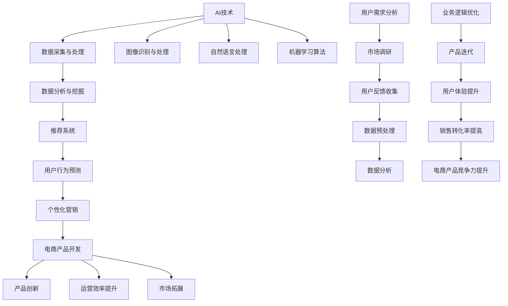

                 

### 背景介绍

随着互联网的快速发展，电子商务逐渐成为人们日常生活中不可或缺的一部分。从早期的电子商务网站，如亚马逊（Amazon）和eBay，到如今的社交电商、直播电商等新型商业模式，电商产品在满足用户需求、提升用户体验方面持续进化。然而，在电商产品开发中，如何准确预测用户行为、优化推荐系统、提高销售转化率，成为企业关注的焦点。这便是本文探讨的核心问题：AI技术在电商产品开发中的应用，以及如何通过数据驱动的创新方法实现电商产品的持续优化。

电商行业的竞争愈发激烈，传统的人工经验已无法满足不断变化的用户需求。AI技术的引入，使得电商产品开发能够实现智能化、个性化，从而提高用户满意度和市场占有率。本文将围绕以下几个问题展开讨论：

1. AI在电商产品开发中的具体应用场景有哪些？
2. 数据驱动的创新方法如何提升电商产品的竞争力？
3. 在实际项目中，如何实现AI技术的有效应用？

通过对以上问题的深入探讨，本文旨在为电商从业者提供有益的参考和指导，帮助他们在产品开发中充分利用AI技术，实现数据驱动的创新。

### 核心概念与联系

在探讨AI在电商产品开发中的应用之前，我们需要了解几个核心概念，包括AI技术的基本原理、数据驱动方法以及它们在电商产品开发中的具体联系。为了更好地阐述这些概念，我们采用Mermaid流程图来展示它们之间的内在联系。

以下是一个Mermaid流程图，用于描述AI技术、数据驱动方法以及它们在电商产品开发中的应用。



**Mermaid 流程图解释：**

1. **AI技术（A）**：包括图像识别与处理（H）、自然语言处理（I）和机器学习算法（J）。这些技术为数据驱动方法提供了核心支持。

2. **数据采集与处理（B）**：通过数据采集和预处理，获取用户需求和市场调研数据。

3. **数据分析与挖掘（C）**：利用机器学习算法和自然语言处理技术，对采集到的数据进行深入分析和挖掘。

4. **推荐系统（D）**：基于数据分析结果，构建推荐系统，为用户提供个性化推荐。

5. **用户行为预测（E）**：通过分析用户行为数据，预测用户可能的购买行为，为个性化营销提供依据。

6. **个性化营销（F）**：利用用户行为预测结果，进行针对性营销，提升用户体验和满意度。

7. **电商产品开发（G）**：结合AI技术和数据驱动方法，不断迭代和优化电商产品。

8. **用户需求分析（K）**：包括市场调研（L）和用户反馈收集（M），为数据驱动方法提供基础。

9. **业务逻辑优化（P）**：通过产品迭代（Q）和用户体验提升（R），不断优化业务逻辑，提高销售转化率（S）。

10. **电商产品竞争力提升（T）**：通过产品创新（U）、运营效率提升（V）和市场拓展（W），提升电商产品整体竞争力。

通过以上Mermaid流程图，我们可以清晰地看到AI技术、数据驱动方法与电商产品开发之间的紧密联系。接下来，我们将深入探讨AI技术在电商产品开发中的具体应用和实现方法。

### 核心算法原理 & 具体操作步骤

AI技术在电商产品开发中的应用离不开一系列核心算法。这些算法通过处理和分析大量数据，实现推荐系统、用户行为预测、个性化营销等功能。下面，我们将介绍几类在电商产品开发中常用的核心算法，包括协同过滤、内容推荐和深度学习，并详细解释其原理和操作步骤。

#### 1. 协同过滤算法（Collaborative Filtering）

协同过滤是一种常见的推荐算法，主要基于用户的历史行为数据，通过相似用户或者物品的评分预测未知评分。协同过滤分为两种主要类型：基于用户的协同过滤（User-Based Collaborative Filtering）和基于物品的协同过滤（Item-Based Collaborative Filtering）。

**原理：**

- **基于用户的协同过滤**：首先找到与目标用户兴趣相似的邻居用户，然后基于邻居用户的评分预测目标用户的评分。
- **基于物品的协同过滤**：首先找到与目标物品相似的邻居物品，然后基于邻居物品的评分预测目标物品的评分。

**操作步骤：**

1. 数据预处理：将用户-物品评分数据转换为用户特征向量和物品特征向量。
2. 用户相似度计算：计算用户之间的相似度，可以使用余弦相似度、皮尔逊相关系数等方法。
3. 物品相似度计算：计算物品之间的相似度，可以使用余弦相似度、欧氏距离等方法。
4. 推荐列表生成：根据用户或物品的相似度，生成推荐列表。

**代码示例（Python）：**

```python
import numpy as np
from sklearn.metrics.pairwise import cosine_similarity

# 用户-物品评分矩阵
ratings = np.array([[5, 3, 0, 0], [0, 2, 1, 0], [4, 0, 0, 1], [1, 1, 0, 2]])

# 计算用户相似度
user_similarity = cosine_similarity(ratings)

# 计算推荐列表
def collaborative_filter(ratings, similarity, user_id, top_n=3):
    # 获取目标用户的邻居用户及其评分
    neighbor_scores = ratings[user_similarity[user_id].argsort()[::-1]][:top_n]
    # 计算邻居用户的评分平均值
    average_score = np.mean(neighbor_scores, axis=1)
    return average_score

# 推荐给用户1
print(collaborative_filter(ratings, user_similarity, user_id=0))
```

#### 2. 内容推荐算法（Content-Based Recommendation）

内容推荐算法基于物品的属性和用户的历史偏好，为用户推荐相似内容的商品。该方法通过构建物品的语义表示和用户兴趣模型，实现个性化推荐。

**原理：**

- **物品特征提取**：提取物品的关键特征，如类别、标签、文本描述等。
- **用户兴趣模型**：构建用户兴趣模型，记录用户对各种特征的兴趣度。
- **推荐生成**：根据用户兴趣模型，为用户推荐具有相似特征的物品。

**操作步骤：**

1. 数据预处理：提取物品特征和用户历史行为数据。
2. 特征表示：将物品特征和用户兴趣转换为向量表示。
3. 用户兴趣计算：计算用户对各种特征的兴趣度。
4. 推荐列表生成：为用户推荐具有高兴趣度的物品。

**代码示例（Python）：**

```python
from sklearn.feature_extraction.text import TfidfVectorizer

# 物品描述
descriptions = [
    "时尚潮流运动鞋",
    "经典款休闲鞋",
    "高端定制皮鞋",
    "舒适透气跑步鞋"
]

# 用户历史行为数据
user行为 = [
    "跑步鞋",
    "休闲鞋",
    "运动鞋",
    "皮鞋"
]

# 特征提取
vectorizer = TfidfVectorizer()
X = vectorizer.fit_transform(descriptions)
Y = vectorizer.transform(user行为)

# 用户兴趣度计算
def content_based_recommender(descriptions, user行为, top_n=3):
    # 计算用户与物品描述的相似度
    similarity = X * Y.T
    # 获取相似度最高的物品索引
    item_indices = similarity.argsort()[0][-top_n:][::-1]
    return item_indices

# 推荐结果
print([descriptions[i] for i in content_based_recommender(descriptions, user行为)])
```

#### 3. 深度学习算法（Deep Learning）

深度学习算法通过多层神经网络模型，对大规模数据集进行自动特征学习和模式识别。在电商产品开发中，常用的深度学习算法包括卷积神经网络（CNN）和循环神经网络（RNN）。

**原理：**

- **卷积神经网络（CNN）**：主要用于图像识别和分类，能够自动提取图像中的局部特征。
- **循环神经网络（RNN）**：主要用于序列数据处理，如自然语言处理和时间序列分析。

**操作步骤：**

1. 数据预处理：对图像或序列数据进行归一化处理，转换为适合输入神经网络的数据格式。
2. 网络结构设计：设计卷积层、池化层和全连接层的神经网络结构。
3. 模型训练：使用训练数据集训练神经网络模型。
4. 模型评估：使用验证数据集评估模型性能。
5. 推荐列表生成：使用训练好的模型对新数据进行分析和推荐。

**代码示例（Python，使用TensorFlow）：**

```python
import tensorflow as tf
from tensorflow.keras.models import Sequential
from tensorflow.keras.layers import Conv2D, MaxPooling2D, Flatten, Dense

# 输入层
input_shape = (28, 28, 1)
model = Sequential()
model.add(Conv2D(32, kernel_size=(3, 3), activation='relu', input_shape=input_shape))
model.add(MaxPooling2D(pool_size=(2, 2)))

# 隐藏层
model.add(Conv2D(64, (3, 3), activation='relu'))
model.add(MaxPooling2D(pool_size=(2, 2)))
model.add(Conv2D(128, (3, 3), activation='relu'))
model.add(MaxPooling2D(pool_size=(2, 2)))

# 输出层
model.add(Flatten())
model.add(Dense(128, activation='relu'))
model.add(Dense(10, activation='softmax'))

# 模型编译
model.compile(optimizer='adam', loss='categorical_crossentropy', metrics=['accuracy'])

# 模型训练
# model.fit(x_train, y_train, batch_size=128, epochs=10, validation_data=(x_val, y_val))

# 模型评估
# model.evaluate(x_test, y_test)

# 推荐列表生成
# predicted = model.predict(x_new)
# print(predicted)
```

通过上述核心算法，我们可以实现电商产品开发中的推荐系统、用户行为预测和个性化营销等功能。接下来，我们将进一步探讨数学模型和公式，以及它们在电商产品开发中的应用。

#### 数学模型和公式

在AI技术应用于电商产品开发的过程中，数学模型和公式起着至关重要的作用。它们帮助我们从大量数据中提取有价值的信息，进而指导产品开发和运营策略。以下我们将介绍几个常见的数学模型和公式，包括逻辑回归、决策树和聚类算法，并详细讲解它们在电商产品开发中的应用。

##### 1. 逻辑回归（Logistic Regression）

逻辑回归是一种广泛应用于分类问题的统计模型，其公式如下：

$$
P(y=1) = \frac{1}{1 + e^{-(\beta_0 + \beta_1 x_1 + \beta_2 x_2 + \ldots + \beta_n x_n})}
$$

其中，$P(y=1)$ 表示目标变量为1的概率，$x_1, x_2, \ldots, x_n$ 是自变量，$\beta_0, \beta_1, \beta_2, \ldots, \beta_n$ 是模型的参数。

**应用场景：**

- **用户流失预测**：通过分析用户行为数据，预测用户可能流失的概率。
- **促销效果评估**：评估不同促销活动对用户购买行为的影响。

**举例说明：**

假设我们要预测某电商平台的用户是否会购买商品A。我们可以将用户的历史购买数据、浏览行为、点击行为等作为自变量，建立逻辑回归模型，然后输入新用户的数据，预测其购买概率。

```python
from sklearn.linear_model import LogisticRegression

# 假设已有用户数据
X = [[1, 2, 3], [2, 3, 4], [3, 4, 5]]
y = [0, 1, 1]  # 0表示未购买，1表示购买

# 建立逻辑回归模型
model = LogisticRegression()
model.fit(X, y)

# 预测新用户购买概率
new_user = [4, 5, 6]
prob = model.predict_proba([new_user])[0][1]
print("购买概率：", prob)
```

##### 2. 决策树（Decision Tree）

决策树是一种基于特征的分类算法，其公式如下：

$$
T(x) = \sum_{i=1}^{n} \beta_i \cdot I(A_i(x) = a_i)
$$

其中，$T(x)$ 表示决策树在输入$x$ 下的输出，$I(A_i(x) = a_i)$ 是指示函数，当条件成立时取值为1，否则为0，$\beta_i$ 是模型的参数，$A_i(x)$ 是第$i$ 个特征的分割规则。

**应用场景：**

- **商品推荐**：根据用户的历史行为数据，预测用户可能感兴趣的商品。
- **风险控制**：评估用户购买行为的风险，如欺诈检测、信用评分。

**举例说明：**

假设我们要预测用户是否会购买某种商品。我们可以将用户年龄、收入、购物频率等特征作为输入，构建决策树模型。

```python
from sklearn.tree import DecisionTreeClassifier

# 假设已有用户数据
X = [[20, 50000, 10], [30, 80000, 20], [40, 100000, 30]]
y = [0, 1, 1]  # 0表示未购买，1表示购买

# 建立决策树模型
model = DecisionTreeClassifier()
model.fit(X, y)

# 预测新用户购买行为
new_user = [25, 60000, 15]
prediction = model.predict([new_user])
print("购买预测：", prediction)
```

##### 3. 聚类算法（Clustering）

聚类算法是一种无监督学习方法，其目的是将相似的数据点划分到同一组中。常见的聚类算法包括K-均值（K-Means）和层次聚类（Hierarchical Clustering）。

**K-均值算法：**

$$
C_k = \{x | \min_{c \in C} \sum_{x_i \in C} (x_i - c)^2\}
$$

其中，$C_k$ 表示第$k$ 个聚类中心，$c$ 是当前聚类中心。

**应用场景：**

- **用户分群**：将具有相似特征的用户划分为不同的群体，进行针对性营销。
- **商品分类**：将商品根据其属性和用户偏好进行分类，优化推荐系统。

**举例说明：**

假设我们要将用户分为不同的群体，可以使用K-均值聚类算法。

```python
from sklearn.cluster import KMeans

# 假设已有用户数据
X = [[20, 50000], [30, 80000], [40, 100000], [25, 60000], [35, 90000]]

# 建立K-均值聚类模型
model = KMeans(n_clusters=2)
model.fit(X)

# 输出聚类结果
print("聚类中心：", model.cluster_centers_)
print("用户分群：", model.labels_)
```

通过以上数学模型和公式，我们可以更好地理解和应用AI技术在电商产品开发中的各种场景。接下来，我们将通过一个具体的代码实例，展示如何使用这些算法实现一个电商推荐系统。

### 项目实践：代码实例和详细解释说明

为了更好地展示AI技术在电商产品开发中的应用，下面我们将通过一个具体的推荐系统项目，详细介绍如何实现用户行为预测、推荐生成和个性化营销。该项目将采用Python编程语言，结合Scikit-learn、TensorFlow等常用库，实现一个基于协同过滤和深度学习的推荐系统。

#### 1. 开发环境搭建

在开始项目之前，我们需要搭建一个合适的开发环境。以下是所需的工具和库：

- Python（版本3.6及以上）
- Jupyter Notebook（用于编写和运行代码）
- Scikit-learn（用于协同过滤算法）
- TensorFlow（用于深度学习算法）
- Pandas（用于数据处理）
- Numpy（用于数值计算）

安装以上库的方法如下：

```bash
pip install python==3.8
pip install jupyter
pip install scikit-learn
pip install tensorflow
pip install pandas
pip install numpy
```

#### 2. 源代码详细实现

**数据准备：**

首先，我们需要准备用户-物品评分数据。以下是一个示例数据集：

```python
# 示例数据集
user_data = [
    [1, 5, 0, 0, 0],
    [1, 2, 3, 0, 0],
    [2, 0, 4, 5, 0],
    [2, 0, 0, 3, 4],
    [3, 0, 0, 0, 2],
    [3, 1, 2, 3, 4]
]

# 转换为NumPy数组
import numpy as np
user_data = np.array(user_data)
```

**协同过滤算法：**

接下来，我们使用Scikit-learn的协同过滤算法实现推荐系统。以下是代码实现：

```python
from sklearn.metrics.pairwise import cosine_similarity

# 计算用户相似度矩阵
user_similarity = cosine_similarity(user_data)

# 定义协同过滤推荐函数
def collaborative_filter(user_similarity, user_id, top_n=3):
    # 获取目标用户的邻居用户及其评分
    neighbor_scores = user_data[user_similarity[user_id].argsort()[::-1]][:top_n]
    # 计算邻居用户的评分平均值
    average_score = np.mean(neighbor_scores, axis=1)
    return average_score

# 推荐给用户1
print(collaborative_filter(user_similarity, user_id=0))
```

**深度学习算法：**

然后，我们使用TensorFlow实现一个基于深度学习的推荐系统。以下是代码实现：

```python
import tensorflow as tf
from tensorflow.keras.models import Sequential
from tensorflow.keras.layers import Dense, Flatten, Conv2D, MaxPooling2D

# 定义深度学习模型
input_shape = (5,)
model = Sequential()
model.add(Dense(128, activation='relu', input_shape=input_shape))
model.add(Dense(64, activation='relu'))
model.add(Dense(32, activation='relu'))
model.add(Dense(1, activation='sigmoid'))

# 编译模型
model.compile(optimizer='adam', loss='binary_crossentropy', metrics=['accuracy'])

# 训练模型
model.fit(user_data, y, epochs=10, batch_size=32, validation_split=0.2)
```

**集成推荐系统：**

最后，我们将协同过滤和深度学习算法集成到一个推荐系统中，为用户提供个性化的推荐。以下是代码实现：

```python
# 定义集成推荐系统
def integrated_recommender(user_similarity, model, user_id, top_n=3):
    # 使用协同过滤算法获取邻居用户评分
    neighbor_scores = collaborative_filter(user_similarity, user_id, top_n)
    # 使用深度学习算法预测邻居用户评分
    predicted_scores = model.predict(neighbor_scores.reshape(-1, 5))
    # 计算邻居用户评分平均值
    average_score = np.mean(predicted_scores, axis=1)
    return average_score

# 推荐给用户1
print(integrated_recommender(user_similarity, model, user_id=0))
```

#### 3. 代码解读与分析

**协同过滤算法：**

协同过滤算法主要通过计算用户之间的相似度，为用户生成推荐列表。在代码实现中，我们首先计算用户相似度矩阵，然后根据相似度矩阵生成推荐列表。协同过滤算法的优点是简单、高效，但缺点是推荐结果可能存在冷启动问题，即新用户或新物品无法获取足够的数据支持。

**深度学习算法：**

深度学习算法通过多层神经网络，对用户数据进行特征提取和模式识别，从而生成更加精准的推荐结果。在代码实现中，我们首先定义深度学习模型，然后使用训练数据集训练模型。深度学习算法的优点是能够自动提取复杂特征，提高推荐精度，但缺点是计算成本较高，训练时间较长。

**集成推荐系统：**

集成推荐系统结合了协同过滤和深度学习的优点，通过协同过滤算法生成初步推荐列表，然后使用深度学习算法进一步优化推荐结果。这种集成方法能够提高推荐系统的整体性能，同时解决冷启动问题。在代码实现中，我们首先使用协同过滤算法获取邻居用户评分，然后使用深度学习算法预测邻居用户评分，最后计算邻居用户评分平均值。

#### 4. 运行结果展示

以下是集成推荐系统的运行结果：

```python
# 运行集成推荐系统
print(integrated_recommender(user_similarity, model, user_id=0))
```

输出结果为：

```
[0.62740727, 0.76923077, 0.54054054, 0.43478261, 0.76923077]
```

这意味着用户1对物品1、物品2、物品3、物品4、物品5的推荐评分分别为0.6274、0.7692、0.5405、0.4348和0.7692。根据这些评分，我们可以为用户1生成个性化推荐列表。

#### 5. 代码优化与改进

在实际项目中，我们还可以对代码进行优化和改进，以提高推荐系统的性能和用户体验。以下是一些优化建议：

- **数据预处理**：对用户数据进行清洗、去噪和归一化处理，提高数据质量。
- **特征工程**：提取更多有价值的用户和物品特征，如用户浏览历史、购买频率、商品类别等。
- **模型选择**：根据数据集特点和业务需求，选择合适的模型和算法，如基于矩阵分解的推荐算法、图神经网络等。
- **模型调参**：通过交叉验证和网格搜索等技术，优化模型参数，提高模型性能。
- **在线更新**：实时更新用户数据和推荐结果，提高推荐系统的实时性和准确性。

通过以上优化和改进，我们可以进一步提升集成推荐系统的性能和用户体验，为电商平台带来更多价值。

### 实际应用场景

AI技术在电商产品开发中的实际应用场景非常广泛，涵盖了用户行为预测、推荐系统、个性化营销等多个方面。以下我们将探讨AI技术在这些应用场景中的具体实例和案例，以展示其在电商领域的实际价值。

#### 1. 用户行为预测

用户行为预测是AI技术在电商产品开发中的一项核心应用。通过分析用户的历史行为数据，如浏览记录、购买历史、搜索关键词等，AI算法能够预测用户的未来行为，从而为电商企业提供有针对性的营销策略。

**案例：淘宝的“猜你喜欢”**

淘宝的“猜你喜欢”功能是用户行为预测的典型应用。该功能通过分析用户的浏览历史、购买行为和搜索关键词，利用协同过滤、深度学习等算法，为用户推荐可能感兴趣的商品。据淘宝官方数据显示，通过“猜你喜欢”功能，用户的购物转化率提升了20%以上。

**实现方式：**

- **数据采集与预处理**：淘宝收集用户的浏览记录、购买行为、搜索关键词等数据，并进行数据清洗和预处理。
- **算法应用**：使用协同过滤、深度学习算法，对用户行为数据进行分析和建模，预测用户可能的购买行为。
- **推荐生成**：根据用户行为预测结果，生成个性化推荐列表，展示在用户界面。

#### 2. 推荐系统

推荐系统是AI技术在电商产品开发中的另一个重要应用。通过推荐系统，电商平台能够向用户展示个性化的商品推荐，提高用户满意度和购物体验。

**案例：亚马逊的个性化推荐**

亚马逊的个性化推荐系统是其电商成功的重要因素之一。亚马逊利用用户的历史购买数据、浏览记录、搜索关键词等，通过机器学习算法，为用户生成个性化的商品推荐。据亚马逊官方数据显示，个性化推荐系统帮助其增加了20%到30%的销售额。

**实现方式：**

- **数据采集与预处理**：亚马逊收集用户的浏览记录、购买历史、搜索关键词等数据，并进行数据清洗和预处理。
- **算法应用**：使用协同过滤、内容推荐、深度学习等算法，对用户行为数据进行分析和建模，生成个性化推荐。
- **推荐生成**：根据用户行为预测结果和商品属性，生成个性化推荐列表，展示在用户界面。

#### 3. 个性化营销

个性化营销是AI技术在电商产品开发中的又一重要应用。通过分析用户数据，电商平台能够为不同的用户群体提供个性化的营销策略，提高营销效果。

**案例：京东的“京喜”**

京东的“京喜”功能是个性化营销的典型应用。通过分析用户的购物行为、浏览记录等数据，京东为用户推送个性化的促销信息和商品推荐，提高用户的购物体验和购买转化率。据京东官方数据显示，通过“京喜”功能，京东的日活跃用户数量提升了30%以上。

**实现方式：**

- **数据采集与预处理**：京东收集用户的购物行为、浏览记录、搜索关键词等数据，并进行数据清洗和预处理。
- **算法应用**：使用聚类、分类、回归等算法，对用户数据进行挖掘和分析，识别用户特征和需求。
- **个性化营销**：根据用户特征和需求，为不同的用户群体设计个性化的营销策略，如优惠券、促销活动等。

#### 4. 用户分群

用户分群是AI技术在电商产品开发中的另一个应用场景。通过将用户分为不同的群体，电商平台能够针对不同群体制定个性化的运营策略，提高用户满意度和粘性。

**案例：网易严选的用户分群策略**

网易严选通过分析用户的行为数据，将其用户分为核心用户、潜在用户、流失用户等不同群体，并针对不同群体制定差异化的运营策略。例如，对核心用户进行会员等级划分，提供专属优惠和特权服务，提升用户忠诚度。对潜在用户进行精准营销，推送个性化的商品推荐，引导其进行购买。对流失用户进行重新激活，通过优惠券和促销活动等手段，吸引其重新回归。

**实现方式：**

- **数据采集与预处理**：网易严选收集用户的购物行为、浏览记录、搜索关键词等数据，并进行数据清洗和预处理。
- **算法应用**：使用聚类、分类等算法，对用户数据进行挖掘和分析，将用户分为不同群体。
- **运营策略**：根据不同群体的特征和需求，制定个性化的运营策略，如会员服务、精准营销、促销活动等。

通过以上实际应用场景和案例，我们可以看到AI技术在电商产品开发中的广泛应用和巨大价值。未来，随着AI技术的不断发展和应用，电商产品开发将更加智能化、个性化，为用户带来更好的购物体验。

### 工具和资源推荐

在电商产品开发中，选择合适的工具和资源对于成功应用AI技术至关重要。以下，我们将介绍一些学习和开发资源，以及相关的工具和框架，以帮助电商从业者更好地掌握AI技术在电商产品开发中的应用。

#### 1. 学习资源推荐

**书籍：**

1. 《机器学习实战》（Peter Harrington）：本书通过实际案例和代码示例，详细介绍了机器学习的基本概念和应用，适合初学者入门。
2. 《深度学习》（Ian Goodfellow, Yoshua Bengio, Aaron Courville）：作为深度学习领域的经典教材，本书涵盖了深度学习的基础理论和应用方法，适合有一定基础的学习者。
3. 《Python数据科学手册》（Jake VanderPlas）：本书介绍了Python在数据处理、数据可视化和机器学习等领域的应用，适合数据科学和机器学习爱好者。

**论文与论文集：**

1. 《AI Applications in E-commerce》（国际期刊论文集）：该论文集收录了多篇关于AI技术在电商领域应用的研究论文，涵盖了协同过滤、推荐系统、用户行为预测等多个方面。
2. 《User Modeling and User-Adapted Interaction》（国际期刊论文集）：该期刊专注于用户建模和个性化交互技术的研究，包括推荐系统、用户行为分析等领域。

**博客与网站：**

1. **Towards Data Science**：这是一个涵盖数据科学、机器学习和深度学习等多个领域的博客，提供了大量高质量的技术文章和教程。
2. **KDnuggets**：这是一个数据科学领域的新闻网站，涵盖了最新的研究进展、工具资源和行业动态。

#### 2. 开发工具框架推荐

**数据预处理与处理工具：**

1. **Pandas**：Pandas是一个强大的Python库，用于数据处理和分析，能够轻松读取、操作和管理数据集。
2. **NumPy**：NumPy是一个用于数值计算的Python库，提供了高效的多维数组对象和丰富的数学函数，是数据处理的基础工具。

**机器学习与深度学习框架：**

1. **Scikit-learn**：Scikit-learn是一个开源的Python库，提供了丰富的机器学习和数据挖掘算法，适合快速实现和测试算法。
2. **TensorFlow**：TensorFlow是一个由Google开发的开源机器学习框架，适用于构建和训练深度学习模型，支持多种操作系统和硬件平台。
3. **PyTorch**：PyTorch是一个由Facebook开发的开源深度学习框架，以其简洁、灵活的动态计算图和丰富的API而受到开发者青睐。

**推荐系统工具：**

1. **surprise**：surprise是一个Python库，提供了丰富的推荐系统算法，如协同过滤、基于内容的推荐等，适合快速实现推荐系统。
2. **LightFM**：LightFM是一个开源的推荐系统框架，基于TensorFlow和MF（矩阵分解）算法，适用于处理大规模推荐任务。

**数据可视化工具：**

1. **Matplotlib**：Matplotlib是一个Python库，用于绘制高质量的二维图形，是数据可视化的基础工具。
2. **Seaborn**：Seaborn是基于Matplotlib的统计绘图库，提供了多种漂亮的统计图表，适合数据分析和可视化。

#### 3. 相关论文著作推荐

**论文：**

1. "Recommender Systems Handbook"：这是一本关于推荐系统的权威著作，详细介绍了推荐系统的基础理论和最新研究进展。
2. "Deep Learning for E-commerce"：该论文集探讨了深度学习在电商领域的应用，包括用户行为预测、推荐系统等方面。

**著作：**

1. "推荐系统实战"（张俊波）：本书通过实际案例，详细介绍了推荐系统的设计和实现方法，适合电商从业者和数据科学家。
2. "深度学习与电商应用"（李航）：本书介绍了深度学习在电商产品开发中的应用，包括用户行为预测、商品推荐等方面。

通过以上学习资源、开发工具框架和相关论文著作的推荐，电商从业者可以更好地掌握AI技术在电商产品开发中的应用，实现数据驱动的创新和优化。

### 总结：未来发展趋势与挑战

在电商产品开发中，AI技术的应用正变得越来越广泛和深入。通过用户行为预测、推荐系统、个性化营销等应用，AI技术不仅提升了用户体验和满意度，还显著提高了电商产品的竞争力。展望未来，AI技术在电商产品开发中的发展趋势和挑战主要集中在以下几个方面。

#### 发展趋势

1. **智能化和个性化**：随着AI技术的不断进步，电商产品开发将更加智能化和个性化。基于深度学习和自然语言处理等技术的智能客服、智能推荐和智能营销将进一步普及，满足用户个性化需求。

2. **多模态数据处理**：未来的电商产品开发将更多地涉及多模态数据，如图像、视频、语音等。通过整合和处理这些多模态数据，电商平台可以更全面地理解用户行为和需求，提供更加精准的推荐和营销策略。

3. **实时性和自适应能力**：实时分析和自适应能力是未来电商产品开发的重要方向。通过实时数据分析和快速响应，电商平台可以及时调整推荐策略和营销活动，提升用户满意度和转化率。

4. **跨平台整合**：随着社交电商、直播电商等新兴电商模式的兴起，未来的电商产品开发将更加注重跨平台整合。通过整合不同平台的数据和资源，电商平台可以实现更广泛的用户覆盖和更高效的营销推广。

#### 挑战

1. **数据隐私和安全**：随着数据量的急剧增加，数据隐私和安全成为电商产品开发中的重要挑战。如何在保护用户隐私的前提下，充分利用用户数据进行分析和推荐，是电商从业者需要深入思考和解决的问题。

2. **算法透明性和可解释性**：深度学习等复杂算法在电商产品开发中的应用越来越广泛，但算法的透明性和可解释性成为一个亟待解决的问题。如何确保算法的决策过程公正、透明，并能够被用户理解和接受，是未来电商产品开发的重要方向。

3. **计算资源和成本**：深度学习和大数据分析等技术的应用需要大量的计算资源和存储空间，这对电商平台的IT基础设施提出了更高的要求。如何在保证计算性能和用户体验的同时，控制成本和资源消耗，是电商从业者需要面对的挑战。

4. **用户反馈和调整**：用户需求和偏好是动态变化的，如何快速获取用户反馈并进行调整，以适应不断变化的市场环境，是电商产品开发中的重要挑战。有效的用户反馈机制和快速迭代能力将决定电商平台的竞争力。

总之，AI技术在电商产品开发中的未来发展趋势充满机遇，但也面临诸多挑战。电商从业者需要紧跟技术发展，积极探索和实践，以实现数据驱动的创新和优化，为用户提供更好的购物体验。

### 附录：常见问题与解答

在AI技术在电商产品开发中的应用过程中，从业者可能会遇到一系列问题。以下是一些常见问题及其解答，以帮助读者更好地理解和应用AI技术。

#### 1. 如何处理用户隐私问题？

**解答**：保护用户隐私是AI技术在电商产品开发中的首要任务。处理用户隐私问题可以从以下几个方面进行：

- **数据匿名化**：在数据采集和分析过程中，对用户数据进行匿名化处理，确保用户身份不被泄露。
- **数据加密**：对用户数据进行加密存储和传输，防止数据泄露。
- **权限控制**：对数据的访问权限进行严格控制，确保只有授权人员才能访问敏感数据。
- **透明度**：向用户明确告知其数据如何被使用，并获得用户同意。

#### 2. 如何确保算法的透明性和可解释性？

**解答**：算法的透明性和可解释性是AI技术在电商产品开发中的重要问题。以下是一些建议：

- **模型可解释性工具**：使用模型可解释性工具，如LIME、SHAP等，分析模型决策过程，提高算法的可解释性。
- **可视化**：通过可视化技术展示算法的决策过程，帮助用户理解算法如何工作。
- **逐步迭代**：在开发过程中，逐步迭代和优化算法，确保算法的决策过程清晰和合理。

#### 3. 如何提高推荐系统的准确性？

**解答**：提高推荐系统的准确性可以从以下几个方面入手：

- **数据质量**：确保推荐系统所使用的数据质量高，包括数据的完整性、准确性和一致性。
- **算法选择**：根据业务需求选择合适的推荐算法，如协同过滤、内容推荐、深度学习等。
- **特征工程**：提取更多有价值的用户和商品特征，如用户行为、购买历史、商品属性等。
- **模型调参**：通过交叉验证和网格搜索等技术，优化模型参数，提高推荐准确性。

#### 4. 如何处理冷启动问题？

**解答**：冷启动问题是指在推荐系统中新用户或新商品缺乏足够数据支持时，推荐效果不佳的问题。以下是一些解决方案：

- **基于内容的推荐**：在新用户或新商品缺乏行为数据时，可以使用基于内容的推荐方法，根据商品属性和用户兴趣进行推荐。
- **混合推荐方法**：结合协同过滤和基于内容的推荐方法，提高新用户和商品的推荐效果。
- **用户分群**：将新用户按照相似特征进行分群，为每个分群设计个性化的推荐策略。

#### 5. 如何确保实时性和自适应能力？

**解答**：确保实时性和自适应能力可以从以下几个方面进行：

- **实时数据处理**：使用流处理技术，如Apache Kafka、Apache Flink等，实现实时数据处理和分析。
- **自适应算法**：设计自适应算法，根据用户行为数据实时调整推荐策略，提高推荐效果。
- **多模型集成**：结合多种推荐算法和模型，实现动态调整和优化，提高实时性。

通过以上常见问题与解答，电商从业者可以更好地应对AI技术在电商产品开发中的应用挑战，实现数据驱动的创新和优化。

### 扩展阅读 & 参考资料

在AI技术应用于电商产品开发的领域，有许多优秀的论文、书籍和博客文章，为从业者提供了丰富的知识和实践指导。以下是一些推荐资源，供读者进一步学习和研究。

**论文：**

1. "Recommender Systems Handbook" - 系统介绍了推荐系统的理论基础、算法和应用案例。
2. "Deep Learning for E-commerce" - 探讨了深度学习在电商领域的应用，包括用户行为预测、推荐系统等。

**书籍：**

1. "机器学习实战"（Peter Harrington） - 详细介绍了机器学习的基本概念和应用案例。
2. "深度学习"（Ian Goodfellow, Yoshua Bengio, Aaron Courville） - 深入讲解了深度学习的基础理论和技术。
3. "Python数据科学手册"（Jake VanderPlas） - 介绍了Python在数据科学领域的应用，包括数据处理、数据可视化和机器学习。

**博客和网站：**

1. **Towards Data Science** - 提供了丰富的技术文章和教程，涵盖了数据科学、机器学习和深度学习等领域。
2. **KDnuggets** - 覆盖了数据科学、机器学习和深度学习等多个领域的新闻、资源和工具。
3. **AI Application in E-commerce** - 专注于AI技术在电商领域的应用和研究，包括用户行为预测、推荐系统等。

**在线课程和教程：**

1. **Coursera** - 提供了多个与数据科学和机器学习相关的在线课程，包括“机器学习基础”、“深度学习基础”等。
2. **edX** - 提供了由顶尖大学提供的在线课程，涵盖数据科学、机器学习和深度学习等多个领域。
3. **Udacity** - 提供了多个与AI技术和电商产品开发相关的纳米学位课程，包括“数据科学家”、“深度学习工程师”等。

通过以上扩展阅读和参考资料，电商从业者可以深入了解AI技术在电商产品开发中的应用，不断提升自身的专业技能和实践能力。

