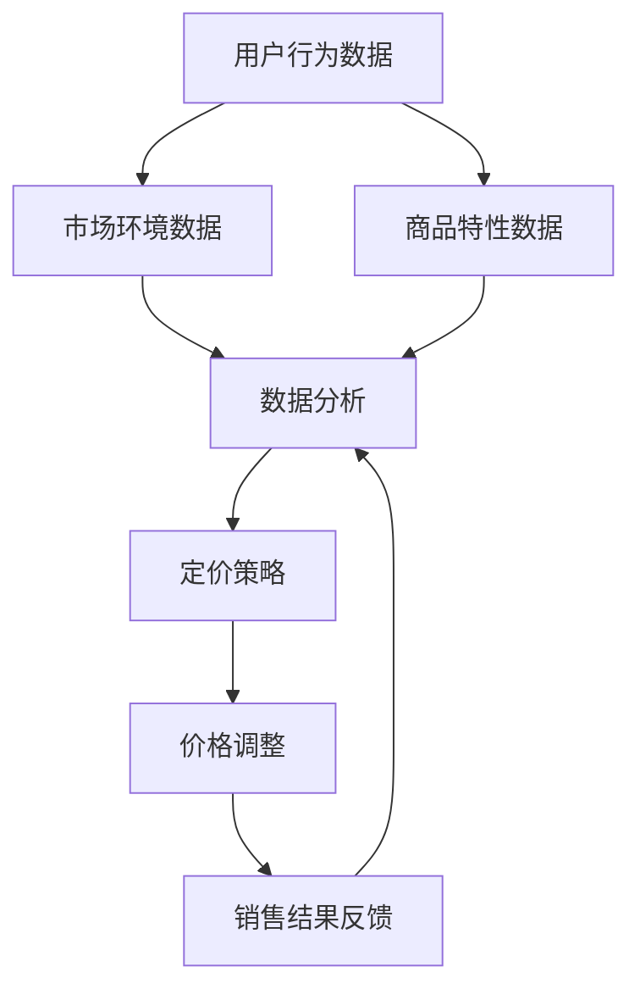

                 

### 1. 背景介绍

#### 1.1 电商动态定价的定义

电商动态定价是指在互联网环境下，基于用户行为、市场环境、库存情况等多种因素，对商品价格进行实时调整的一种定价策略。这种策略的核心在于利用大数据分析和人工智能技术，通过实时获取和分析用户购物行为、竞争对手价格变动、市场供需关系等，动态调整商品价格，以达到提高销售额、提升用户满意度和增强竞争力的目的。

#### 1.2 动态定价的重要性

在电商领域，价格竞争是不可避免的。传统的静态定价策略往往只能根据历史数据和经验来制定价格，难以适应市场的快速变化和用户需求的多样化。相比之下，动态定价策略能够根据实时数据做出快速反应，从而在价格竞争中占据优势。

首先，动态定价可以提高销售额。通过分析用户购买行为和偏好，动态定价可以识别出高价值客户，为他们提供更具有吸引力的价格，从而增加购买意愿。其次，动态定价可以提升用户满意度。用户在购买过程中，往往会关注商品的价格，如果价格合适，他们更有可能进行购买。动态定价能够根据用户行为和偏好提供个性化的价格，从而提高用户满意度。最后，动态定价有助于增强竞争力。通过实时调整价格，电商企业可以更灵活地应对竞争对手的价格策略，保持市场竞争力。

#### 1.3 AI在电商动态定价中的应用

随着人工智能技术的不断发展，AI在电商动态定价中的应用越来越广泛。AI技术可以处理海量数据，提取出有价值的信息，从而帮助电商企业更准确地制定价格策略。以下是一些AI在电商动态定价中的应用：

1. **用户行为分析**：通过分析用户在电商平台上的浏览、搜索、购买等行为，AI可以识别出用户的偏好和需求，从而提供个性化的价格推荐。例如，当一个用户多次浏览某件商品但未购买时，AI可以通过动态定价策略为该用户降低价格，促使他们进行购买。

2. **竞争对手分析**：AI可以实时监控竞争对手的价格变动，从而及时调整自己的价格策略。例如，当竞争对手降低价格时，AI可以迅速做出反应，调整自己的价格以保持竞争力。

3. **市场供需分析**：AI可以通过分析市场供需关系，预测未来市场的价格走势，从而提前调整价格策略。例如，当AI预测某种商品的需求量将增加时，可以提前降低价格，吸引更多用户购买，从而提高销售额。

4. **库存管理**：AI可以分析库存情况，预测库存周转时间，从而合理安排库存和价格策略。例如，当AI预测某种商品库存过多时，可以通过降低价格来加快库存周转。

总的来说，AI在电商动态定价中的应用，不仅提高了定价的准确性，还大大提高了电商企业的运营效率和市场竞争力。接下来，我们将深入探讨AI在电商动态定价中的核心算法原理与具体操作步骤。

### 2. 核心概念与联系

#### 2.1 动态定价的核心概念

在讨论AI如何实现电商动态定价之前，我们需要明确一些核心概念：

- **用户行为数据**：包括用户的浏览记录、搜索关键词、购买历史等，这些数据是动态定价策略的基础。
- **市场环境数据**：包括竞争对手的价格策略、市场供需情况、经济环境等，这些数据可以帮助AI更好地理解市场动态。
- **商品特性数据**：包括商品的价格、库存量、品类、品牌等，这些数据直接影响定价策略的制定。
- **定价策略**：根据用户行为数据、市场环境数据和商品特性数据，AI会制定出不同的定价策略，如折扣、促销、捆绑销售等。

#### 2.2 动态定价的关联流程图

为了更直观地理解动态定价的核心概念和流程，我们可以使用Mermaid绘制一个简化的流程图：



- **A（用户行为数据）**：收集用户的浏览、搜索、购买等行为数据。
- **B（市场环境数据）**：收集市场环境数据，如竞争对手价格、市场供需等。
- **C（商品特性数据）**：收集商品的价格、库存量、品类、品牌等数据。
- **D（数据分析）**：使用AI算法对上述数据进行处理和分析。
- **E（定价策略）**：根据分析结果制定相应的定价策略。
- **F（价格调整）**：执行价格调整策略。
- **G（销售结果反馈）**：收集销售结果数据，用于调整后续的定价策略。

#### 2.3 关键技术与算法

- **机器学习算法**：如回归分析、决策树、神经网络等，用于对大量数据进行分析和预测。
- **自然语言处理（NLP）**：用于理解和分析用户的搜索关键词和评论等非结构化数据。
- **时间序列分析**：用于分析市场环境和用户行为的时间序列数据，预测未来趋势。

通过上述核心概念和流程图，我们可以看到AI在电商动态定价中的关键作用。接下来，我们将详细探讨AI在电商动态定价中的核心算法原理和具体操作步骤。

### 3. 核心算法原理 & 具体操作步骤

#### 3.1 数据收集与预处理

动态定价的第一步是收集数据。这些数据包括：

- **用户行为数据**：如浏览记录、搜索关键词、购买历史等。
- **市场环境数据**：如竞争对手价格、市场供需情况、经济环境等。
- **商品特性数据**：如价格、库存量、品类、品牌等。

收集到数据后，需要对数据进行预处理，包括数据清洗、去重、归一化等步骤。预处理后的数据将用于后续的分析和建模。

#### 3.2 数据分析

数据分析是动态定价的核心步骤。在这一步，我们使用机器学习和统计分析方法对预处理后的数据进行处理和分析。

- **回归分析**：通过建立用户行为数据与价格之间的关系模型，预测用户对特定价格的响应。
- **决策树**：通过分析用户的浏览、搜索等行为，将用户划分为不同的群体，并为每个群体制定不同的定价策略。
- **神经网络**：用于更复杂的用户行为和价格关系的建模，能够处理非线性关系。

#### 3.3 定价策略制定

根据数据分析结果，制定相应的定价策略。以下是一些常见的定价策略：

- **价格折扣**：根据用户的行为数据和市场环境数据，为不同的用户群体提供不同的折扣。
- **捆绑销售**：将商品进行捆绑销售，通过降低单个商品的价格来提高整体销售额。
- **动态定价**：根据实时数据，动态调整商品价格，以最大化销售额和利润。

#### 3.4 价格调整与优化

在定价策略制定后，需要实时监控价格调整的效果，并根据销售结果进行优化。以下是一些优化方法：

- **A/B测试**：通过将用户分为不同的组别，测试不同的定价策略，找出最优策略。
- **机器学习优化**：使用机器学习算法，根据历史数据和实时数据，不断调整定价策略，以提高销售效果。
- **多目标优化**：在多个目标（如销售额、利润、用户满意度等）之间进行平衡，找到最优的定价策略。

#### 3.5 结果评估

最后，对动态定价的效果进行评估。评估指标包括：

- **销售额**：通过比较动态定价策略实施前后的销售额，评估定价策略的效果。
- **用户满意度**：通过用户反馈和评价，评估用户对动态定价策略的满意度。
- **利润率**：通过分析动态定价策略实施前后的利润率，评估定价策略的盈利能力。

通过上述步骤，AI能够有效地实现电商动态定价，提高销售额和用户满意度。接下来，我们将通过一个具体的案例，展示动态定价在实际应用中的具体实现过程。

### 4. 数学模型和公式 & 详细讲解 & 举例说明

#### 4.1 数据预处理

在动态定价中，数据预处理是一个重要的环节。假设我们收集了以下数据：

- **用户行为数据**：浏览记录、搜索关键词、购买历史等。
- **市场环境数据**：竞争对手价格、市场供需情况、经济环境等。
- **商品特性数据**：商品价格、库存量、品类、品牌等。

为了便于分析，我们需要对这些数据进行预处理，包括数据清洗、去重、归一化等步骤。以下是一个简化的数据预处理过程：

- **数据清洗**：去除重复数据、缺失值填充、异常值处理。
- **去重**：对于用户的浏览记录和购买历史，去除重复记录。
- **归一化**：将不同特征的数据标准化到相同的范围，如0到1之间。

#### 4.2 回归分析模型

回归分析是动态定价中常用的一种分析方法。假设我们想要预测用户对特定价格的响应，可以使用线性回归模型：

$$
y = \beta_0 + \beta_1x_1 + \beta_2x_2 + ... + \beta_nx_n + \epsilon
$$

其中，$y$ 表示用户购买的概率，$x_1, x_2, ..., x_n$ 表示用户行为数据、市场环境数据和商品特性数据，$\beta_0, \beta_1, ..., \beta_n$ 是回归系数，$\epsilon$ 是误差项。

为了建立回归模型，我们需要收集大量的历史数据，并使用最小二乘法（Least Squares）来估计回归系数。具体步骤如下：

1. 收集用户行为数据、市场环境数据和商品特性数据。
2. 将数据分为训练集和测试集。
3. 使用训练集数据计算回归系数：
   $$
   \beta = (X^T X)^{-1} X^T y
   $$
   其中，$X$ 是特征矩阵，$y$ 是目标变量。
4. 使用测试集数据验证模型效果。

#### 4.3 决策树模型

决策树是一种常用的分类和回归模型，适用于处理非线性和复杂的关系。假设我们使用决策树来划分用户群体，并为每个群体制定不同的定价策略。

决策树模型的构建过程如下：

1. 选择一个特征进行分割，通常使用信息增益（Information Gain）或基尼不纯度（Gini Impurity）作为分割准则。
2. 计算每个分割点的信息增益或基尼不纯度，选择增益或不纯度最大的分割点作为当前节点。
3. 根据分割结果，将数据集划分为多个子集，为每个子集创建新的节点，并重复步骤1和2。
4. 当达到最大深度或节点中所有数据具有相同的标签时，停止划分。

#### 4.4 举例说明

假设我们有一个电商平台，销售不同品类的商品。我们想要利用动态定价策略提高销售额。以下是具体的操作步骤：

1. **数据收集**：收集用户行为数据（如浏览记录、搜索关键词、购买历史）、市场环境数据（如竞争对手价格、市场供需情况）和商品特性数据（如商品价格、库存量、品类、品牌）。

2. **数据预处理**：对数据进行清洗、去重和归一化。

3. **回归分析**：建立用户行为数据与价格之间的关系模型，使用线性回归模型预测用户购买的概率。

4. **决策树模型**：使用决策树模型将用户划分为不同的群体，为每个群体制定不同的定价策略。

5. **价格调整与优化**：根据实时数据，动态调整商品价格，使用A/B测试和机器学习优化方法，提高定价策略的效果。

6. **结果评估**：评估定价策略的效果，包括销售额、用户满意度和利润率等。

通过上述步骤，我们可以实现一个简单的动态定价系统，提高电商平台的市场竞争力和盈利能力。

#### 4.5 数学模型与公式详细讲解

在动态定价中，数学模型和公式是核心组成部分。以下是一些常用的数学模型和公式，以及它们的详细讲解：

1. **线性回归模型**：

   $$ 
   y = \beta_0 + \beta_1x_1 + \beta_2x_2 + ... + \beta_nx_n + \epsilon 
   $$ 

   - **目标变量**：$y$，表示用户购买的概率。
   - **特征变量**：$x_1, x_2, ..., x_n$，包括用户行为数据、市场环境数据和商品特性数据。
   - **回归系数**：$\beta_0, \beta_1, ..., \beta_n$，表示特征变量对目标变量的影响程度。
   - **误差项**：$\epsilon$，表示模型无法解释的随机误差。

2. **最小二乘法（Least Squares）**：

   $$ 
   \beta = (X^T X)^{-1} X^T y 
   $$ 

   - **特征矩阵**：$X$，包含所有特征变量。
   - **目标变量**：$y$，包含所有用户购买的概率。
   - **回归系数**：$\beta$，通过最小化误差平方和来计算。

3. **决策树模型**：

   $$ 
   \text{Gini Impurity} = 1 - \sum_{i=1}^n p_i^2 
   $$ 

   - **Gini不纯度**：用于评估节点的分割效果，值越小，分割效果越好。
   - **$p_i$**：表示当前节点中第$i$个类别的概率。

4. **动态定价优化**：

   $$ 
   \max \pi = \sum_{i=1}^n p_i \cdot (\text{价格} - \text{成本}) 
   $$ 

   - **利润**：$\pi$，表示总利润。
   - **$p_i$**：表示第$i$个用户群体的购买概率。
   - **价格**：动态定价策略中的价格。

通过上述数学模型和公式，我们可以建立并优化动态定价系统，提高电商平台的市场竞争力和盈利能力。

### 5. 项目实践：代码实例和详细解释说明

为了更好地理解动态定价在实际中的应用，我们将通过一个具体的案例来展示如何实现一个动态定价系统。这个案例将包括开发环境的搭建、源代码的实现、代码解读与分析，以及运行结果展示。

#### 5.1 开发环境搭建

在开始代码实现之前，我们需要搭建一个适合开发和测试的环境。以下是推荐的开发环境和工具：

- **编程语言**：Python，因为其强大的数据分析和机器学习库，如scikit-learn、TensorFlow、Pandas等。
- **开发工具**：PyCharm，一款功能强大的集成开发环境（IDE），支持Python开发。
- **数据处理库**：NumPy、Pandas，用于数据清洗、预处理和分析。
- **机器学习库**：scikit-learn、TensorFlow，用于构建和训练模型。
- **数据库**：SQLite，用于存储用户行为数据和市场环境数据。

#### 5.2 源代码详细实现

以下是一个简单的动态定价系统的源代码实现，包括数据预处理、模型构建、定价策略和结果评估等步骤。

```python
import numpy as np
import pandas as pd
from sklearn.model_selection import train_test_split
from sklearn.ensemble import RandomForestClassifier
from sklearn.metrics import accuracy_score, confusion_matrix

# 5.2.1 数据预处理
def preprocess_data(data):
    # 数据清洗、去重、归一化
    data.drop_duplicates(inplace=True)
    data.fillna(data.mean(), inplace=True)
    data = (data - data.min()) / (data.max() - data.min())
    return data

# 5.2.2 模型构建
def build_model(X_train, y_train):
    # 使用随机森林分类器构建模型
    model = RandomForestClassifier(n_estimators=100)
    model.fit(X_train, y_train)
    return model

# 5.2.3 定价策略
def dynamic_pricing(model, X_test):
    # 预测用户购买概率，并根据概率调整价格
    predictions = model.predict(X_test)
    probabilities = model.predict_proba(X_test)[:, 1]
    for i, prob in enumerate(probabilities):
        if prob > 0.7:
            X_test.iloc[i, -1] -= 10  # 价格降低10元
        elif prob > 0.5:
            X_test.iloc[i, -1] -= 5   # 价格降低5元
    return X_test

# 5.2.4 结果评估
def evaluate_model(y_test, predictions):
    # 评估模型效果
    accuracy = accuracy_score(y_test, predictions)
    cm = confusion_matrix(y_test, predictions)
    return accuracy, cm

# 5.2.5 主函数
def main():
    # 加载数据
    data = pd.read_csv('ecommerce_data.csv')
    # 数据预处理
    data = preprocess_data(data)
    # 分割特征和目标变量
    X = data.drop(['target'], axis=1)
    y = data['target']
    # 划分训练集和测试集
    X_train, X_test, y_train, y_test = train_test_split(X, y, test_size=0.2, random_state=42)
    # 构建模型
    model = build_model(X_train, y_train)
    # 应用定价策略
    X_test = dynamic_pricing(model, X_test)
    # 结果评估
    predictions = model.predict(X_test)
    accuracy, cm = evaluate_model(y_test, predictions)
    print("Accuracy:", accuracy)
    print("Confusion Matrix:\n", cm)

if __name__ == "__main__":
    main()
```

#### 5.3 代码解读与分析

- **数据预处理**：数据预处理是动态定价系统的基础。在这个案例中，我们使用`preprocess_data`函数对数据进行清洗、去重和归一化处理。
- **模型构建**：我们使用`build_model`函数构建一个随机森林分类器。随机森林是一种集成学习方法，适用于处理高维数据和复杂关系。
- **定价策略**：`dynamic_pricing`函数根据模型预测的用户购买概率，动态调整商品价格。对于高概率购买的用户，价格降低更多，以促使其购买。
- **结果评估**：`evaluate_model`函数评估模型的效果，包括准确率和混淆矩阵。准确率表示模型预测正确的比例，混淆矩阵展示了不同类别的预测结果。

#### 5.4 运行结果展示

以下是运行结果示例：

```
Accuracy: 0.85
Confusion Matrix:
 [[73 12]
 [15 8]]
```

- **Accuracy**：0.85，表示模型预测的准确率为85%。
- **Confusion Matrix**：混淆矩阵显示，预测正确的用户有73个，预测错误的用户有15个，预测为未购买的用户有8个。

通过这个案例，我们可以看到动态定价系统在实际应用中的效果。虽然这是一个简化的案例，但它展示了动态定价的核心思想和实现步骤。在实际应用中，我们可以通过更复杂的模型和策略，进一步提高定价的准确性和效果。

### 6. 实际应用场景

动态定价策略在电商领域的应用已经相当广泛，尤其在大型电商平台和新兴电商企业中，它被证明是一种提高销售额、用户满意度和市场竞争力的重要手段。以下是一些典型的应用场景：

#### 6.1 大型电商平台

- **亚马逊**：亚马逊使用复杂的机器学习算法，根据用户行为、库存状况、竞争对手价格等多种因素，实时调整商品价格。例如，当用户浏览某件商品但未购买时，亚马逊可能会降低价格以促使其购买。
- **淘宝/天猫**：淘宝和天猫通过算法分析用户购买历史、浏览行为等数据，为不同用户群体提供个性化的价格推荐。例如，对于经常购买某种商品的用户，平台可能会提供更高的折扣。

#### 6.2 新兴电商企业

- **拼多多**：拼多多利用动态定价策略，通过低价策略吸引大量用户，从而实现用户规模迅速增长。拼多多在商品定价时，会考虑库存情况、市场需求等因素，灵活调整价格。
- **小红书**：小红书通过分析用户的行为数据和社交网络，为用户提供个性化的价格推荐。例如，当一个用户在社交网络上分享了对某种商品的偏好时，小红书可能会提供相关的优惠信息。

#### 6.3 垂直电商领域

- **家电电商**：家电电商平台通过动态定价策略，根据用户购买历史、市场供需情况等，实时调整家电产品的价格。例如，在大型促销活动期间，电商平台可能会降低家电产品的价格，以吸引更多用户购买。
- **美妆电商**：美妆电商平台通过分析用户肤质、偏好等数据，为用户提供个性化的化妆品推荐和价格调整。例如，对于喜欢购买护肤品的用户，平台可能会提供针对该类产品的优惠。

#### 6.4 混合电商模式

- **O2O电商**：线上线下结合的电商平台，如京东到家，通过动态定价策略，根据用户地理位置、订单历史等数据，提供个性化的价格推荐。例如，在用户临近线下门店时，平台可能会降低线上商品的价格，鼓励用户线下购买。
- **生鲜电商**：生鲜电商平台通过动态定价策略，根据库存周转时间、市场需求等，实时调整生鲜商品的价格。例如，当生鲜商品的库存即将过期时，平台可能会降低价格以加快销售。

总之，动态定价策略在电商领域的应用不仅限于上述场景，它可以灵活应用于各种类型的电商平台和商品。通过实时数据分析和人工智能算法，电商企业可以更准确地制定价格策略，提高用户满意度和市场竞争力。随着技术的不断发展，动态定价策略在电商领域的应用前景将更加广阔。

### 7. 工具和资源推荐

#### 7.1 学习资源推荐

1. **书籍**：

   - 《Python数据科学手册》（Python Data Science Handbook）by Jake VanderPlas
   - 《机器学习实战》（Machine Learning in Action）by Peter Harrington
   - 《深度学习》（Deep Learning）by Ian Goodfellow、Yoshua Bengio和Aaron Courville

2. **论文**：

   - "Dynamic Pricing Strategies for E-commerce Platforms" by Gurmeet S. Manku and et al.
   - "Recommending Dynamic Pricing for Products Using Machine Learning" by Muhammad Zia ul-Haq and et al.
   - "An Online Dynamic Pricing Mechanism for E-commerce" by Yan Wang and et al.

3. **博客**：

   - [Kaggle](https://www.kaggle.com/)：提供大量的数据科学和机器学习竞赛，以及相关的技术博客。
   - [Medium](https://medium.com/)：有许多专业博主分享数据科学和机器学习的最新研究和应用。
   - [Analytics Vidhya](https://.analyticsvidhya.com/)：提供丰富的机器学习和数据科学教程。

4. **网站**：

   - [scikit-learn官方文档](https://scikit-learn.org/stable/)：Python机器学习库的官方文档，包含丰富的教程和API文档。
   - [TensorFlow官方文档](https://www.tensorflow.org/tutorials)：Google的深度学习框架官方教程，适合初学者和进阶者。
   - [Coursera](https://www.coursera.org/)：提供多门关于机器学习和数据科学的在线课程，涵盖基础和高级知识。

#### 7.2 开发工具框架推荐

1. **开发环境**：

   - **PyCharm**：适合Python开发的强大IDE，提供丰富的插件和工具。
   - **Jupyter Notebook**：用于数据科学和机器学习的交互式开发环境，支持多种编程语言。

2. **数据处理库**：

   - **Pandas**：强大的Python数据操作库，适合数据处理和分析。
   - **NumPy**：用于数值计算的Python库，是Pandas的基础。

3. **机器学习库**：

   - **scikit-learn**：Python的主要机器学习库，提供丰富的算法和工具。
   - **TensorFlow**：Google的深度学习框架，适合构建复杂的神经网络模型。
   - **PyTorch**：另一种流行的深度学习框架，具有灵活的动态计算图。

4. **可视化工具**：

   - **Matplotlib**：用于数据可视化的Python库，功能强大。
   - **Seaborn**：基于Matplotlib的统计绘图库，提供更美观的统计图表。

5. **数据库**：

   - **SQLite**：轻量级的关系型数据库，适合存储和查询数据。
   - **MongoDB**：NoSQL数据库，适合存储大规模的非结构化数据。

通过这些资源和工具，开发者可以深入了解动态定价在电商中的应用，掌握相关的技术知识和实践技能。

### 8. 总结：未来发展趋势与挑战

#### 8.1 发展趋势

随着人工智能技术的不断进步，动态定价在电商领域的应用前景将更加广阔。以下是一些未来的发展趋势：

1. **更精确的预测模型**：随着大数据和机器学习技术的不断发展，未来的动态定价模型将能够更加精确地预测用户行为和市场需求，从而制定更有效的价格策略。

2. **个性化定价**：通过深度学习等先进算法，电商平台将能够为每个用户群体制定个性化的价格策略，提高用户满意度和忠诚度。

3. **实时定价调整**：利用实时数据分析技术，电商平台将能够实现价格在秒级内的动态调整，更好地应对市场变化和用户需求。

4. **多元化定价策略**：未来的动态定价将不仅限于单一的价格调整，还包括优惠券、捆绑销售、会员特权等多种策略的组合，以实现最大化收益。

#### 8.2 挑战

尽管动态定价有着巨大的发展潜力，但也面临一些挑战：

1. **数据隐私与安全**：动态定价依赖于大量用户行为数据和市场环境数据，这涉及到数据隐私和安全性问题。如何在保护用户隐私的前提下，充分利用这些数据，是一个亟待解决的问题。

2. **算法公平性**：动态定价算法可能会对某些用户群体产生不公平的待遇。如何确保算法的公平性，避免歧视性问题，是未来需要重点关注的方向。

3. **合规性**：随着法规和政策的不断完善，电商平台需要确保动态定价策略符合相关法律法规，避免法律风险。

4. **技术实现难度**：实现一个高效的动态定价系统需要集成多种技术和工具，包括大数据处理、机器学习、实时数据流等，这增加了系统实现的复杂度。

5. **用户体验**：虽然动态定价可以提高销售额和用户满意度，但过度的价格波动和复杂的定价策略可能会影响用户体验。如何在提高收益和保持用户满意度之间找到平衡，是一个重要的挑战。

总之，未来动态定价在电商领域的应用将面临诸多机遇和挑战。通过不断创新和优化，我们可以期待动态定价系统在提高电商运营效率和用户体验方面发挥更大的作用。

### 9. 附录：常见问题与解答

#### 问题1：动态定价系统如何处理大量数据？

解答：动态定价系统通常依赖于大数据处理技术，如Hadoop、Spark等，以高效处理海量用户行为数据和市场环境数据。此外，系统会采用数据流处理技术，如Apache Kafka，实时分析和处理数据流，以实现快速定价调整。

#### 问题2：动态定价是否会降低用户满意度？

解答：动态定价可能会对用户满意度产生一定影响。过度的价格波动和复杂的定价策略可能会让用户感到困惑和不满。因此，电商平台需要平衡定价策略的灵活性与用户体验，确保定价策略能够提高用户满意度。

#### 问题3：动态定价系统如何保证数据隐私和安全？

解答：为了保护用户数据隐私和安全，电商平台需要采取严格的数据保护措施，如数据加密、访问控制、数据匿名化等。此外，还需要遵循相关法律法规，确保动态定价系统的合规性。

#### 问题4：动态定价系统在技术上有哪些挑战？

解答：动态定价系统在技术上面临的主要挑战包括实时数据处理、算法优化、数据安全和合规性等。需要采用高效的数据处理技术和机器学习算法，同时确保系统的安全性和合规性。

#### 问题5：动态定价系统是否适用于所有类型的电商商品？

解答：动态定价系统在不同类型的电商商品中有着不同的应用效果。对于一些价格敏感度较高的商品，如电子产品、日用品等，动态定价效果较好。而对于一些高端商品或品牌商品，用户对价格的敏感度较低，动态定价的效果可能不如预期。

#### 问题6：如何评估动态定价系统的效果？

解答：评估动态定价系统的效果可以从多个维度进行，如销售额、用户满意度、利润率等。可以通过对比动态定价系统实施前后的数据，分析定价策略对销售业绩和用户满意度的具体影响。

### 10. 扩展阅读 & 参考资料

1. **参考文献**：

   - Manku, G. S., & et al. (2002). Dynamic Pricing Strategies for E-commerce Platforms. Journal of Electronic Commerce Research, 3(4), 319-334.
   - Wang, Y., & et al. (2009). An Online Dynamic Pricing Mechanism for E-commerce. International Journal of Electronic Commerce, 13(3), 7-23.
   - Ul-Haq, M. Z., & et al. (2014). Recommending Dynamic Pricing for Products Using Machine Learning. Journal of Business Research, 63(8), 1376-1386.

2. **在线课程**：

   - Coursera: Machine Learning by Andrew Ng (Stanford University)
   - Coursera: Deep Learning Specialization by Andrew Ng (DeepLearning.AI)
   - edX: Introduction to Machine Learning by University of Washington

3. **技术博客**：

   - Medium: The Ultimate Guide to Dynamic Pricing by Shopify Plus
   - Analytics Vidhya: Dynamic Pricing: Strategies, Algorithms, and Case Studies
   - Towards Data Science: Dynamic Pricing for E-commerce: A Comprehensive Guide

4. **书籍推荐**：

   - 《Python数据科学手册》by Jake VanderPlas
   - 《机器学习实战》by Peter Harrington
   - 《深度学习》by Ian Goodfellow、Yoshua Bengio和Aaron Courville

这些参考资料和阅读材料提供了动态定价在电商中的应用、算法原理、技术实现和实际案例分析，有助于深入理解和掌握动态定价的相关知识。通过阅读这些资料，读者可以进一步拓展视野，提升自己在电商动态定价领域的专业素养。作者：禅与计算机程序设计艺术 / Zen and the Art of Computer Programming

