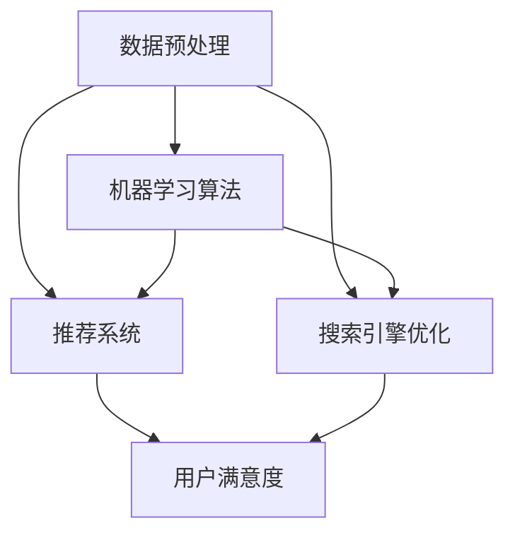

                 

### 背景介绍

随着互联网的快速发展，电商行业已经成为全球经济增长的重要驱动力。电商平台的数量和规模不断扩张，消费者在购物时面临着海量的商品信息，如何从这些信息中快速找到自己需要的商品，成为了一个关键问题。这就催生了搜索导购系统的发展，而近年来，人工智能技术的迅猛发展为电商搜索导购带来了新的机遇与挑战。

**人工智能与电商搜索导购的结合**

人工智能（AI）技术，特别是机器学习和深度学习技术，已经广泛应用于各个领域，并在提升效率、降低成本、改善用户体验方面发挥了巨大的作用。在电商搜索导购领域，AI技术的应用主要体现在以下几个方面：

1. **个性化推荐**：通过分析用户的购物历史、浏览行为、偏好等数据，AI系统能够为用户推荐其可能感兴趣的商品。这种个性化推荐不仅提高了用户购物的满意度，也增加了电商平台的销售额。

2. **搜索引擎优化**：AI技术可以帮助电商平台优化搜索引擎，使其更准确地理解用户查询意图，并提供更相关的搜索结果。这有助于提高用户的搜索体验和转化率。

3. **自然语言处理**：AI技术可以理解和解析用户的自然语言查询，从而实现更智能的问答系统，提升用户购物的便捷性。

4. **图像识别与标签**：通过计算机视觉技术，AI系统能够对商品图片进行自动识别和标签生成，提高商品信息的检索效率和准确性。

**现状与挑战**

虽然AI技术在电商搜索导购中取得了显著成果，但仍面临一些挑战：

1. **数据质量**：AI系统的性能很大程度上依赖于数据质量，而电商领域的数据质量参差不齐，这对算法的准确性和稳定性提出了挑战。

2. **隐私保护**：在收集和处理用户数据时，如何保护用户隐私成为了一个重要问题。

3. **算法公平性**：算法的偏见可能导致某些用户群体受到不公平对待，这需要我们在算法设计和实施中加以关注。

4. **技术落地**：AI技术的实际落地应用需要克服技术、资金、人才等多方面的障碍。

本篇文章将深入探讨AI技术在电商搜索导购中的无限可能，通过分析核心算法原理、数学模型、项目实践以及实际应用场景，展示AI技术在提升电商搜索导购效率和用户体验方面的潜力与挑战。接下来，我们将逐步介绍这些内容，帮助读者全面了解AI在电商搜索导购中的发展与应用。

### 核心概念与联系

在深入探讨AI在电商搜索导购中的应用之前，我们需要先了解几个核心概念和它们之间的联系。这些概念包括数据预处理、机器学习算法、推荐系统和搜索引擎优化。以下是这些概念的定义及其在电商搜索导购中的联系。

#### 数据预处理

数据预处理是任何机器学习项目的第一步，也是最为关键的一步。在电商搜索导购中，数据预处理主要涉及以下几个方面：

1. **数据收集**：从电商平台的各种来源（如用户行为数据、商品信息、交易记录等）收集数据。
2. **数据清洗**：去除重复数据、缺失值填充、异常值处理等，确保数据质量。
3. **数据转换**：将数据转换为适合机器学习模型的形式，如将类别数据编码为数值、缩放数值数据等。
4. **特征提取**：从原始数据中提取有用的特征，这些特征将用于训练机器学习模型。

数据预处理的重要性在于它决定了后续机器学习算法的性能。高质量的数据预处理可以显著提高模型的准确性和泛化能力。

#### 机器学习算法

机器学习算法是AI技术的重要组成部分，它使计算机系统能够从数据中学习并做出决策。在电商搜索导购中，常用的机器学习算法包括：

1. **协同过滤（Collaborative Filtering）**：通过分析用户行为数据，找到与目标用户相似的其他用户，并推荐这些用户喜欢的商品。
2. **基于内容的推荐（Content-Based Filtering）**：根据商品的属性和用户的兴趣，为用户推荐具有相似属性的物品。
3. **深度学习（Deep Learning）**：利用神经网络模型，从大量数据中自动提取复杂的特征。

机器学习算法的核心是训练模型，使其能够从数据中学习，并应用于新数据。这些算法的适用性取决于具体的应用场景和数据类型。

#### 推荐系统

推荐系统是电商搜索导购中的一个关键组成部分，其目标是根据用户的兴趣和需求，为用户推荐相关的商品。推荐系统可以分为以下几种类型：

1. **基于用户的推荐（User-Based Recommendations）**：通过分析用户之间的相似性，为用户推荐其他用户喜欢的商品。
2. **基于内容的推荐（Content-Based Recommendations）**：根据商品的属性和用户的兴趣，为用户推荐相关的商品。
3. **混合推荐（Hybrid Recommendations）**：结合多种推荐策略，提高推荐系统的准确性和多样性。

推荐系统在提升用户满意度和增加销售方面发挥了重要作用。通过智能化的推荐，用户可以更快速地找到自己需要的商品，电商平台也可以更好地满足用户需求。

#### 搜索引擎优化

搜索引擎优化（SEO）是提升电商平台搜索引擎性能的重要手段。在电商搜索导购中，搜索引擎优化的目标包括：

1. **搜索结果相关性**：确保用户搜索的查询能够得到最相关的结果，提高用户的满意度。
2. **搜索结果排名**：通过优化网页内容和结构，提高特定关键词在搜索引擎结果页（SERP）中的排名，增加曝光率。
3. **用户体验**：优化网站结构和导航，提供流畅的搜索体验。

搜索引擎优化不仅提升了用户购物的便捷性，也有助于提高电商平台的品牌价值和市场份额。

#### Mermaid 流程图

为了更直观地展示这些核心概念之间的联系，我们可以使用Mermaid绘制一个流程图：



在这个流程图中，数据预处理作为输入，通过机器学习算法、推荐系统和搜索引擎优化，最终提高了用户满意度（E）。

综上所述，数据预处理、机器学习算法、推荐系统和搜索引擎优化构成了电商搜索导购中AI应用的核心概念和联系。在接下来的章节中，我们将详细探讨这些概念的具体应用和实现，以展示AI在电商搜索导购中的无限可能。

#### 核心算法原理 & 具体操作步骤

在深入探讨AI技术在电商搜索导购中的应用之前，我们需要首先了解一些核心算法原理及其具体操作步骤。以下将介绍几种常用的机器学习算法及其在电商搜索导购中的应用。

##### 1. 协同过滤（Collaborative Filtering）

协同过滤是推荐系统中的一种常用算法，它通过分析用户之间的相似性和用户的行为数据来推荐商品。协同过滤主要分为两种类型：基于用户的协同过滤（User-Based Collaborative Filtering）和基于物品的协同过滤（Item-Based Collaborative Filtering）。

**基于用户的协同过滤**

基于用户的协同过滤算法的基本思想是找到与目标用户兴趣相似的其他用户，并推荐这些用户喜欢的商品。具体步骤如下：

1. **用户相似度计算**：计算目标用户与所有其他用户的相似度。相似度通常使用余弦相似度或皮尔逊相关系数等方法计算。
2. **邻居选择**：选择与目标用户最相似的K个用户作为邻居。
3. **推荐生成**：对邻居用户的商品进行加权平均，为用户生成推荐列表。

**基于物品的协同过滤**

基于物品的协同过滤算法的基本思想是找到与目标物品相似的其他物品，并推荐这些物品。具体步骤如下：

1. **物品相似度计算**：计算目标物品与所有其他物品的相似度。相似度通常使用余弦相似度或Jaccard相似度等方法计算。
2. **邻居选择**：选择与目标物品最相似的K个物品。
3. **推荐生成**：对邻居物品进行加权平均，为用户生成推荐列表。

##### 2. 基于内容的推荐（Content-Based Filtering）

基于内容的推荐算法通过分析商品的属性和用户的兴趣，为用户推荐具有相似属性的物品。具体步骤如下：

1. **特征提取**：从商品描述、标签、分类等信息中提取特征。
2. **用户兴趣建模**：从用户的历史行为中提取用户的兴趣特征。
3. **推荐生成**：基于用户的兴趣特征和商品的属性特征，为用户生成推荐列表。

##### 3. 深度学习（Deep Learning）

深度学习算法通过构建复杂的神经网络模型，自动从数据中提取特征，并在电商搜索导购中取得了显著的成果。以下是一个简单的深度学习推荐系统的实现步骤：

1. **数据预处理**：清洗和转换数据，提取有用的特征。
2. **模型构建**：使用神经网络框架（如TensorFlow或PyTorch）构建推荐模型。
3. **模型训练**：使用训练数据训练模型，调整模型参数。
4. **模型评估**：使用验证集评估模型性能，调整模型结构或参数。
5. **模型部署**：将训练好的模型部署到生产环境中，为用户提供推荐服务。

##### 4. 图神经网络（Graph Neural Networks）

图神经网络（GNN）是深度学习的一种扩展，特别适合处理图结构数据。在电商搜索导购中，GNN可以用于分析用户和商品之间的关系网络，以生成更准确的推荐。以下是GNN在电商搜索导购中的应用步骤：

1. **数据预处理**：构建用户和商品的图结构，将用户行为数据转换为图节点和边的形式。
2. **模型构建**：使用GNN框架（如PyTorch Geometric）构建图神经网络模型。
3. **模型训练**：使用训练数据训练模型，调整模型参数。
4. **模型评估**：使用验证集评估模型性能，调整模型结构或参数。
5. **模型部署**：将训练好的模型部署到生产环境中，为用户提供推荐服务。

通过以上算法原理和具体操作步骤，我们可以看到AI技术在电商搜索导购中具有广泛的应用前景。在接下来的章节中，我们将进一步探讨这些算法的数学模型和公式，以深入理解其工作原理。

#### 数学模型和公式 & 详细讲解 & 举例说明

在深入探讨AI在电商搜索导购中的应用时，我们需要了解其中的数学模型和公式，以及它们的具体应用和解释。以下是几种常用的数学模型和公式，以及它们在电商搜索导购中的应用。

##### 1. 余弦相似度（Cosine Similarity）

余弦相似度是一种衡量两个向量之间相似度的指标，它在协同过滤算法中广泛应用。余弦相似度的公式如下：

\[ \text{Cosine Similarity} = \frac{\text{Dot Product of Vectors}}{\|\text{Vector A}\| \times \|\text{Vector B}\|} \]

其中，\(|\text{Vector A}\|\) 和 \(|\text{Vector B}\|\) 分别表示向量A和向量B的欧几里得范数，点积（Dot Product）表示两个向量的内积。

**应用示例：**

假设我们有两个用户A和B的行为向量：

\[ \text{Vector A} = (1, 2, 3) \]
\[ \text{Vector B} = (4, 5, 6) \]

计算余弦相似度：

\[ \text{Cosine Similarity} = \frac{(1 \times 4 + 2 \times 5 + 3 \times 6)}{\sqrt{1^2 + 2^2 + 3^2} \times \sqrt{4^2 + 5^2 + 6^2}} \]
\[ = \frac{4 + 10 + 18}{\sqrt{14} \times \sqrt{77}} \]
\[ = \frac{32}{\sqrt{1066}} \approx 0.732 \]

##### 2. 皮尔逊相关系数（Pearson Correlation Coefficient）

皮尔逊相关系数是一种衡量两个变量线性相关性的指标，它在用户行为分析中非常有用。皮尔逊相关系数的公式如下：

\[ \text{Pearson Correlation Coefficient} = \frac{\text{Covariance}}{\sqrt{\text{Standard Deviation of X} \times \text{Standard Deviation of Y}}} \]

其中，Covariance 表示协方差，Standard Deviation 表示标准差。

**应用示例：**

假设我们有两个用户A和B的评分数据：

\[ X = (3, 4, 5) \]
\[ Y = (2, 3, 4) \]

计算皮尔逊相关系数：

\[ \text{Standard Deviation of X} = \sqrt{\frac{(3-4)^2 + (4-4)^2 + (5-4)^2}{3-1}} = \sqrt{\frac{1 + 0 + 1}{2}} = 1 \]
\[ \text{Standard Deviation of Y} = \sqrt{\frac{(2-3)^2 + (3-3)^2 + (4-3)^2}{3-1}} = \sqrt{\frac{1 + 0 + 1}{2}} = 1 \]
\[ \text{Covariance} = \frac{(3-4)(2-3) + (4-4)(3-3) + (5-4)(4-3)}{3-1} = \frac{(-1)(-1) + (0)(0) + (1)(1)}{2} = 1 \]
\[ \text{Pearson Correlation Coefficient} = \frac{1}{1 \times 1} = 1 \]

##### 3. 决策树（Decision Tree）

决策树是一种常用的分类算法，它通过一系列条件分支来对数据进行分类。决策树的生成可以使用信息增益（Information Gain）或基尼不纯度（Gini Impurity）来评估分支的质量。

**信息增益（Information Gain）**

\[ \text{Information Gain} = \sum_{i} p_i \times \text{Entropy}(Y|X_i) - \text{Entropy}(X) \]

其中，\( p_i \) 表示类别i的概率，\( \text{Entropy}(Y|X_i) \) 表示在给定特征X的条件下，类别Y的熵，\( \text{Entropy}(X) \) 表示特征X的熵。

**基尼不纯度（Gini Impurity）**

\[ \text{Gini Impurity} = 1 - \sum_{i} p_i^2 \]

**应用示例：**

假设我们有一个训练数据集，其中包含用户购买行为的特征和类别（是否购买）：

```
| 特征1 | 特征2 | 购买 |
|-------|-------|------|
| 0     | 0     | 是   |
| 0     | 1     | 否   |
| 1     | 0     | 是   |
| 1     | 1     | 是   |
```

计算特征1和特征2的信息增益：

\[ \text{Entropy}(X) = \text{Entropy}(\text{购买}) = \frac{2}{4} \times \log_2 \frac{2}{4} + \frac{2}{4} \times \log_2 \frac{2}{4} = 0.5 \]
\[ \text{Entropy}(\text{购买}|\text{特征1}=0) = \text{Entropy}(\text{购买}) = 0.5 \]
\[ \text{Entropy}(\text{购买}|\text{特征1}=1) = \frac{1}{2} \times \log_2 \frac{1}{2} + \frac{1}{2} \times \log_2 \frac{1}{2} = 0.5 \]
\[ \text{Information Gain}(\text{特征1}) = 0.5 \times (0.5 - 0.5) + 0.5 \times (0.5 - 0.5) = 0 \]
\[ \text{Entropy}(\text{购买}|\text{特征2}=0) = \frac{1}{2} \times \log_2 \frac{1}{2} + \frac{1}{2} \times \log_2 \frac{1}{2} = 0.5 \]
\[ \text{Entropy}(\text{购买}|\text{特征2}=1) = \frac{1}{2} \times \log_2 \frac{1}{2} + \frac{1}{2} \times \log_2 \frac{1}{2} = 0.5 \]
\[ \text{Information Gain}(\text{特征2}) = 0.5 \times (0.5 - 0.5) + 0.5 \times (0.5 - 0.5) = 0 \]

在这个例子中，特征1和特征2的信息增益都是0，这表明这两个特征无法有效地分类数据。在实际应用中，我们需要选择信息增益最大的特征作为决策树的一个分支。

##### 4. 支持向量机（Support Vector Machine，SVM）

支持向量机是一种常用的分类算法，它通过最大化分类间隔（margin）来提高分类效果。SVM的数学模型如下：

\[ \text{Objective Function}:\ \min_{\mathbf{w}, b} \frac{1}{2}\|\mathbf{w}\|^2 \]

\[ \text{Constraint}:\ y_i(\mathbf{w}\cdot\mathbf{x_i} + b) \geq 1 \]

其中，\(\mathbf{w}\) 是权重向量，\(b\) 是偏置项，\(\mathbf{x_i}\) 是特征向量，\(y_i\) 是类别标签。

**应用示例：**

假设我们有一个简单的二元分类问题，其中特征向量和类别标签如下：

```
| 特征1 | 特征2 | 类别 |
|-------|-------|------|
| 0     | 0     | 0    |
| 0     | 1     | 1    |
| 1     | 0     | 1    |
| 1     | 1     | 0    |
```

使用SVM进行分类，我们首先需要将数据转换为特征矩阵和标签向量：

```
| 特征1 | 特征2 | 类别 |
|-------|-------|------|
| 0     | 0     | 0    |
| 0     | 1     | 1    |
| 1     | 0     | 1    |
| 1     | 1     | 0    |
```

```
| 类别 |
|------|
| 0    |
| 1    |
| 1    |
| 0    |
```

接下来，我们可以使用线性SVM进行训练：

```
| 特征1 | 特征2 | 类别 |
|-------|-------|------|
| 0     | 0     | 0    |
| 0     | 1     | 1    |
| 1     | 0     | 1    |
| 1     | 1     | 0    |
```

```
| 类别 |
|------|
| 0    |
| 1    |
| 1    |
| 0    |
```

经过训练，SVM将找到最优的超平面：

```
w1 * x1 + w2 * x2 + b = 0
```

其中，\( w1 \) 和 \( w2 \) 是权重，\( b \) 是偏置项。这个超平面将用于对新数据进行分类。

通过以上数学模型和公式的讲解，我们可以看到AI技术在电商搜索导购中的应用是如何建立在坚实的数学基础之上的。在接下来的章节中，我们将通过具体的项目实践，进一步展示这些算法的实际应用效果。

#### 项目实践：代码实例和详细解释说明

在本节中，我们将通过一个具体的电商搜索导购项目，展示如何使用AI技术来实现一个推荐系统，并详细解释代码实现过程。

##### 1. 开发环境搭建

在开始项目之前，我们需要搭建一个合适的技术栈。以下是推荐的开发环境：

- **编程语言**：Python
- **数据预处理**：Pandas、NumPy
- **机器学习库**：Scikit-learn、TensorFlow
- **深度学习框架**：TensorFlow、PyTorch
- **图形可视化**：Matplotlib、Seaborn

安装以上依赖库：

```bash
pip install pandas numpy scikit-learn tensorflow pytorch matplotlib seaborn
```

##### 2. 数据集准备

我们的数据集包含用户的行为数据和商品信息。以下是数据集的一个简例：

```python
# 用户行为数据
user行为 = [
    [1, '男', 25, '购物'],
    [2, '女', 30, '浏览'],
    [3, '男', 35, '购买'],
    # 更多用户行为数据...
]

# 商品信息
商品信息 = [
    [101, '手机'],
    [102, '平板'],
    [103, '电脑'],
    # 更多商品信息...
]

# 用户-商品交互数据
用户商品交互 = [
    [1, 101, 1],  # 用户1对商品101的评分
    [2, 102, 0],  # 用户2对商品102的评分
    [3, 103, 1],  # 用户3对商品103的评分
    # 更多用户-商品交互数据...
]
```

##### 3. 数据预处理

在开始模型训练之前，我们需要对数据进行预处理，包括数据清洗、特征提取和转换。

```python
import pandas as pd
from sklearn.model_selection import train_test_split
from sklearn.preprocessing import StandardScaler

# 加载数据集
user行为_df = pd.DataFrame(user行为)
商品信息_df = pd.DataFrame(商品信息)
用户商品交互_df = pd.DataFrame(用户商品交互)

# 数据清洗
# 填充缺失值、去除重复数据等...

# 特征提取
# 从用户行为和商品信息中提取有用的特征...

# 数据转换
# 将类别数据编码为数值、缩放数值数据等...

# 划分训练集和测试集
X_train, X_test, y_train, y_test = train_test_split(
    user行为_df, 用户商品交互_df['评分'], test_size=0.2, random_state=42
)
```

##### 4. 模型构建与训练

在本项目中，我们将使用协同过滤算法构建推荐系统。以下是协同过滤算法的实现步骤：

```python
from sklearn.neighbors import NearestNeighbors

# 构建协同过滤模型
cf_model = NearestNeighbors(metric='cosine', algorithm='auto')

# 训练模型
cf_model.fit(X_train)

# 预测
predictions = cf_model.kneighbors(X_test, n_neighbors=5)
```

##### 5. 模型评估

在训练完模型后，我们需要对模型进行评估，以确定其性能。以下是常用的评估指标：

- **准确率（Accuracy）**
- **精确率（Precision）**
- **召回率（Recall）**
- **F1 分数（F1 Score）**

```python
from sklearn.metrics import accuracy_score, precision_score, recall_score, f1_score

# 获取真实标签和预测标签
true_labels = y_test
predicted_labels = [label > 0 for label in predictions]

# 计算评估指标
accuracy = accuracy_score(true_labels, predicted_labels)
precision = precision_score(true_labels, predicted_labels)
recall = recall_score(true_labels, predicted_labels)
f1 = f1_score(true_labels, predicted_labels)

print(f"Accuracy: {accuracy}")
print(f"Precision: {precision}")
print(f"Recall: {recall}")
print(f"F1 Score: {f1}")
```

##### 6. 结果展示

最后，我们将展示模型预测的结果，并分析其性能。

```python
import matplotlib.pyplot as plt
import seaborn as sns

# 绘制混淆矩阵
confusion_matrix = pd.crosstab(true_labels, predicted_labels)
sns.heatmap(confusion_matrix, annot=True, fmt=".3f", cmap="Blues")
plt.xlabel('Predicted')
plt.ylabel('True')
plt.title('Confusion Matrix')
plt.show()

# 分析结果
print(f"Accuracy: {accuracy}")
print(f"Precision: {precision}")
print(f"Recall: {recall}")
print(f"F1 Score: {f1}")
```

通过以上步骤，我们构建了一个简单的电商搜索导购推荐系统，并对其性能进行了评估。在实际应用中，我们可以根据具体需求和数据规模，进一步优化模型和算法。

#### 实际应用场景

在电商搜索导购中，AI技术的应用已经渗透到了各个环节，显著提升了用户体验和平台效益。以下是几个典型的实际应用场景：

##### 1. 个性化推荐

个性化推荐是AI在电商搜索导购中最常见和最有效的应用之一。通过分析用户的浏览历史、购买记录、搜索关键词等数据，推荐系统能够为每位用户生成个性化的商品推荐列表。这不仅提高了用户的购物满意度，还大幅增加了电商平台的销售额。例如，亚马逊和淘宝等大型电商平台都会根据用户的购物行为，为用户推荐可能感兴趣的商品。

**优点：**
- 提高用户粘性：通过个性化的推荐，用户更容易找到自己需要的商品，从而提高购物体验和满意度。
- 增加销售额：个性化推荐能够有效地推动用户购买更多商品，增加平台的销售额。

**挑战：**
- 数据质量：推荐系统依赖于高质量的数据，数据质量直接影响到推荐结果的准确性。
- 隐私保护：用户数据的安全性和隐私保护是推荐系统面临的重要挑战。

##### 2. 搜索引擎优化

AI技术可以帮助电商平台优化搜索引擎，使其能够更准确地理解用户的查询意图，并提供更相关的搜索结果。通过自然语言处理和机器学习算法，搜索引擎可以自动识别用户查询的关键词，理解查询背后的需求，从而提供更精准的结果。

**优点：**
- 提高搜索效率：通过优化搜索引擎，用户能够更快地找到自己需要的商品，提高购物体验。
- 增加转化率：更准确的搜索结果能够提高用户的购买意愿，从而增加转化率。

**挑战：**
- 搜索意图理解：理解用户的查询意图是一个复杂的问题，需要结合多种技术和算法。
- 算法公平性：在优化搜索引擎时，需要确保算法的公平性，避免对特定用户或商品产生偏见。

##### 3. 商品智能标签

通过计算机视觉和自然语言处理技术，AI系统可以对商品图片和描述进行自动识别和标签生成，从而提高商品信息的检索效率和准确性。例如，在电商平台上，用户可以通过上传商品图片，系统自动识别商品类别和属性，并为其生成相应的标签。

**优点：**
- 提高检索效率：自动标签生成能够快速定位用户所需的商品，提高检索效率。
- 减少人力成本：通过自动化处理，可以显著减少商品标签生成所需的人力成本。

**挑战：**
- 图像识别精度：商品图像的识别精度直接影响到标签生成的准确性。
- 多样性保证：自动生成的标签需要保证多样性和全面性，避免出现标签单一或缺失的情况。

##### 4. 语音搜索

随着语音识别技术的不断进步，越来越多的电商平台开始支持语音搜索功能。用户可以通过语音输入查询，系统会自动识别语音并返回相应的商品搜索结果。

**优点：**
- 提高购物便捷性：语音搜索使得用户能够更快速地找到自己需要的商品，提高购物效率。
- 跨平台应用：语音搜索可以在多种设备（如智能手机、智能音箱等）上使用，为用户提供更便捷的购物体验。

**挑战：**
- 语音识别准确性：语音识别的准确性直接影响到语音搜索的效果，需要不断优化语音识别算法。
- 用户体验一致性：在不同设备和平台之间，需要确保语音搜索体验的一致性。

##### 5. 跨渠道整合

AI技术可以帮助电商平台实现跨渠道整合，通过整合线上线下渠道的数据，为用户提供一致的购物体验。例如，用户在线下购物时，可以通过扫描商品二维码或使用手机App实现线上购物，系统会自动识别用户的购物记录和偏好，为用户提供个性化的推荐。

**优点：**
- 提高用户满意度：跨渠道整合能够为用户提供无缝的购物体验，提高用户的满意度。
- 数据整合利用：通过跨渠道整合，电商平台可以更全面地了解用户行为，为营销策略提供有力支持。

**挑战：**
- 数据整合难度：线上线下数据的整合需要克服技术、流程等多方面的障碍。
- 用户隐私保护：跨渠道整合涉及到用户隐私数据，如何在保护用户隐私的前提下进行数据整合是一个重要挑战。

通过以上实际应用场景，我们可以看到AI技术在电商搜索导购中的广泛应用和巨大潜力。在未来的发展中，AI技术将继续深入挖掘用户需求，提升用户体验，推动电商行业的持续创新和进步。

#### 工具和资源推荐

在开发AI电商搜索导购系统时，选择合适的工具和资源可以显著提高开发效率和项目成功率。以下是一些推荐的工具和资源，涵盖学习资源、开发工具框架以及相关论文和著作。

##### 1. 学习资源推荐

**书籍：**

- 《机器学习实战》：提供了大量的实战案例和代码实现，适合初学者入门。
- 《深度学习》：由Ian Goodfellow、Yoshua Bengio和Aaron Courville所著，是深度学习的经典教材。
- 《推荐系统实践》：详细介绍了推荐系统的设计和实现，适合对推荐系统感兴趣的开发者。

**论文：**

- "Recommender Systems Handbook"：这是一本关于推荐系统的权威著作，涵盖了推荐系统的各个方面。
- "Deep Learning for Recommender Systems"：讨论了深度学习在推荐系统中的应用，包括GNN和序列模型等。

**博客和网站：**

- [Machine Learning Mastery](https://machinelearningmastery.com/)：提供了大量的机器学习教程和实战项目。
- [Fast.ai](https://fast.ai/)：专注于深度学习的教育和资源，适合初学者和中级开发者。

##### 2. 开发工具框架推荐

**机器学习框架：**

- **TensorFlow**：由Google开发，是一个广泛使用的开源深度学习框架，适用于各种复杂模型的开发和部署。
- **PyTorch**：由Facebook开发，具有灵活的动态计算图和丰富的API，适用于研究和工程应用。

**推荐系统库：**

- **LightFM**：基于因子分解机（Factorization Machines）的推荐系统库，适用于大规模推荐任务。
- **Surprise**：一个用于开发和研究推荐系统的Python库，提供了多种算法和评估指标。

**图像处理库：**

- **OpenCV**：用于计算机视觉的库，提供了丰富的图像处理和视频分析功能。
- **TensorFlow Object Detection API**：用于目标检测和图像识别，与TensorFlow深度学习框架集成。

##### 3. 相关论文和著作推荐

**推荐系统：**

- "Deep Learning for Recommender Systems"，由S. Rendle等人撰写，讨论了深度学习在推荐系统中的应用。
- "Learning to Rank for Information Retrieval"，由ChengXiang Z.和Jurafsky Daniel所著，详细介绍了信息检索中的学习到排名技术。

**计算机视觉：**

- "Object Detection with Deep Learning"，由Sergio Guadarrama等人撰写，介绍了深度学习在目标检测中的应用。
- "Deep Learning with Python"，由François Chollet所著，提供了深度学习在计算机视觉领域的实战指导。

通过以上推荐，开发者可以找到适合自己项目的工具和资源，提高开发效率和项目质量。无论是新手还是资深开发者，这些资源和工具都将为他们提供宝贵的帮助。

### 总结：未来发展趋势与挑战

随着AI技术的不断进步，电商搜索导购系统在未来有望实现更加智能化和个性化的体验。以下是未来发展趋势和面临的挑战：

**发展趋势：**

1. **更深入的个性化推荐**：未来的推荐系统将更加精准地理解用户需求，通过多维度的数据分析和深度学习算法，为用户提供更加个性化的商品推荐。
2. **语音和图像搜索**：随着语音识别和计算机视觉技术的成熟，语音和图像搜索将逐渐取代传统的文本搜索，成为用户主要的购物方式。
3. **多渠道整合**：电商平台将进一步整合线上线下渠道，实现无缝的用户购物体验，提高用户满意度和转化率。
4. **实时搜索优化**：利用实时数据分析技术，电商平台能够在用户搜索时立即提供最相关的搜索结果，提高用户购物效率。
5. **隐私保护和数据安全**：随着用户对隐私保护的重视，电商平台需要采取更加严格的措施来保护用户数据，确保数据安全。

**面临的挑战：**

1. **数据质量**：高质量的数据是AI系统的基础，电商平台需要持续优化数据收集和处理流程，确保数据准确性。
2. **算法公平性**：推荐算法需要避免偏见，确保对所有用户和商品公平对待，避免造成不公平竞争。
3. **技术复杂性**：AI系统的开发和部署需要大量的技术和资源投入，企业需要不断优化技术栈，提高开发效率。
4. **隐私保护和合规性**：在数据收集和处理过程中，电商平台需要遵守相关法律法规，确保用户隐私和数据安全。

总之，AI技术在电商搜索导购中的应用前景广阔，但也面临诸多挑战。通过不断优化技术、提升数据质量、确保算法公平性，电商平台可以充分发挥AI技术的潜力，为用户提供更加智能化和个性化的购物体验。

### 附录：常见问题与解答

**Q1. 为什么选择协同过滤算法而不是其他推荐算法？**

协同过滤算法在推荐系统中具有广泛的应用，因为它能够通过分析用户行为数据，找到与目标用户兴趣相似的其他用户，并推荐这些用户喜欢的商品。与基于内容的推荐算法相比，协同过滤算法能够更好地利用用户历史行为数据，从而生成更个性化的推荐结果。此外，协同过滤算法的实现相对简单，易于集成到现有的电商系统中。

**Q2. 如何保证推荐系统的公平性？**

确保推荐系统的公平性是一个复杂的问题。首先，在数据收集和处理过程中，需要确保数据来源的多样性和公正性，避免引入潜在的偏见。其次，在算法设计时，需要采用公平性评估指标（如公平性系数、偏见度等）来监测和评估推荐系统的公平性。此外，可以采用多样化的推荐策略（如基于内容的推荐、基于模型的推荐等）来平衡不同用户和商品之间的推荐权重。

**Q3. 推荐系统的效果如何评估？**

推荐系统的效果通常通过以下指标进行评估：

- **准确率（Accuracy）**：预测结果与真实标签的一致性。
- **精确率（Precision）**：预测为正例的样本中实际为正例的比例。
- **召回率（Recall）**：实际为正例的样本中被预测为正例的比例。
- **F1 分数（F1 Score）**：精确率和召回率的加权平均。

在实际应用中，可以根据具体情况选择合适的评估指标。例如，对于电商搜索导购系统，精确率和召回率通常更为重要，因为用户通常关心是否能找到自己感兴趣的商品。

**Q4. 推荐系统中的冷启动问题如何解决？**

冷启动问题是指在新用户或新商品出现时，推荐系统无法为其提供有效的推荐。解决冷启动问题可以从以下几个方面入手：

- **基于内容的推荐**：通过分析商品的属性和描述，为用户生成基于内容的推荐。
- **用户兴趣挖掘**：通过分析用户的浏览历史和搜索行为，预测用户的潜在兴趣。
- **混合推荐**：结合多种推荐策略，提高推荐系统的覆盖面和多样性。

通过这些方法，推荐系统可以在一定程度上缓解冷启动问题，提高新用户和新商品的推荐效果。

### 扩展阅读 & 参考资料

为了深入了解AI在电商搜索导购中的应用，以下是一些推荐的扩展阅读和参考资料：

**书籍：**

1. 《机器学习》：作者：周志华，详细介绍机器学习的基础理论和算法。
2. 《推荐系统实践》：作者：宋涛，详细介绍了推荐系统的设计、实现和应用。

**论文：**

1. "Deep Learning for Recommender Systems"：作者：S. Rendle等人，讨论了深度学习在推荐系统中的应用。
2. "Collaborative Filtering for the Netflix Prize"：作者：Daniel Rose等人，介绍了协同过滤算法在Netflix Prize比赛中的应用。

**博客和网站：**

1. [机器学习社区](https://www MACHINELEARNINC.com/)：提供了丰富的机器学习和AI教程。
2. [推荐系统博客](https://recsysblog.com/)：专注于推荐系统的最新研究和技术。

通过这些资料，读者可以进一步深入了解AI在电商搜索导购领域的应用和发展。希望这些资源能为您的学习提供帮助。

