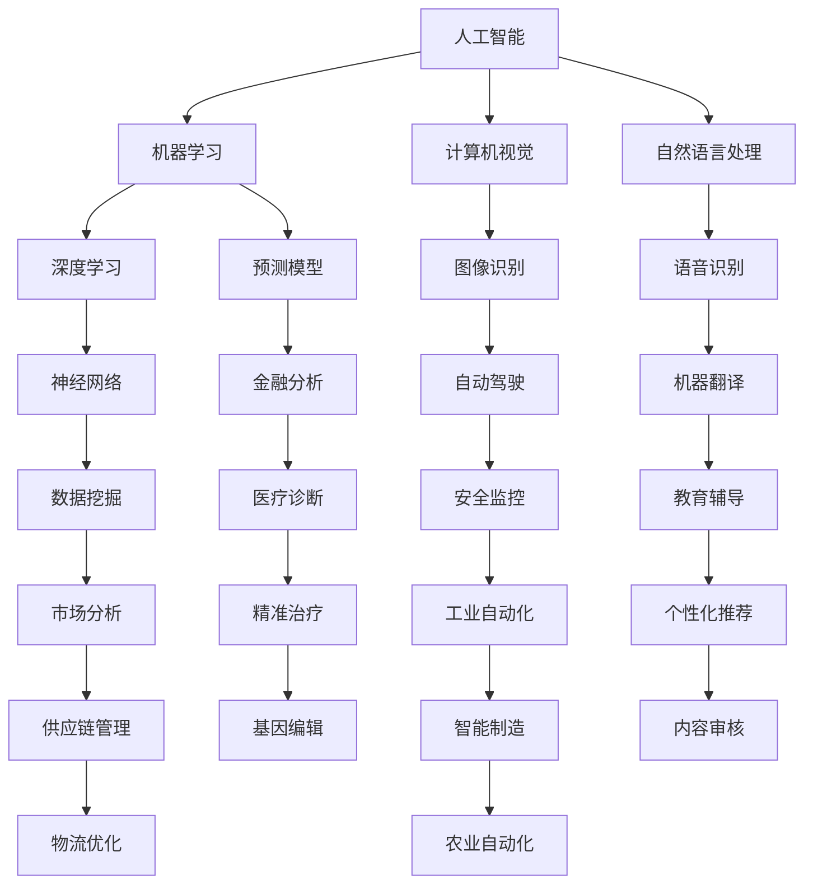

                 

### 文章标题

**AI在社会中的作用与应用**

> 关键词：人工智能，社会应用，技术进步，创新，伦理，可持续发展

> 摘要：本文将深入探讨人工智能（AI）在社会中的重要作用与应用。从背景介绍到核心概念，再到算法原理与数学模型，以及实际应用场景和未来发展趋势，本文旨在提供一个全面、深入的视角，揭示AI技术如何深刻影响并塑造着我们的社会生活。同时，我们还将讨论AI技术的伦理问题以及如何实现可持续发展。

## 1. 背景介绍

自20世纪50年代人工智能（Artificial Intelligence，简称AI）的概念首次被提出以来，人工智能技术经历了数十年的快速发展。早期的AI研究主要集中在逻辑推理、知识表示和问题求解等领域，而随着计算机性能的提升、大数据的普及以及机器学习算法的进步，AI技术逐渐从理论研究走向实际应用，成为推动社会进步的重要力量。

### 1.1 AI的发展历程

- **1950年代**：人工智能的概念被首次提出，标志着计算机科学的一个新领域诞生。
- **1960-1970年代**：早期的人工智能系统开始被开发，但受限于当时的计算机性能和算法，AI发展遭遇瓶颈。
- **1980年代**：专家系统的出现标志着AI应用的新高潮，专家系统在医疗诊断、金融分析等领域取得了显著成果。
- **1990年代**：随着计算机性能的不断提升，机器学习算法开始崭露头角，深度学习技术的兴起为AI的发展注入了新的动力。
- **21世纪**：大数据和云计算的普及，使得AI技术得以在语音识别、图像处理、自然语言处理等领域实现突破性进展。

### 1.2 AI技术的核心领域

- **机器学习**：通过算法让计算机从数据中学习，从而进行预测和决策。
- **深度学习**：一种基于神经网络的机器学习技术，能够处理复杂的非线性问题。
- **计算机视觉**：使计算机能够理解和解释视觉信息，广泛应用于图像识别、自动驾驶等领域。
- **自然语言处理**：使计算机能够理解、生成和处理人类语言，广泛应用于语音识别、机器翻译等领域。
- **机器人技术**：结合AI技术，使机器人能够在特定环境下执行复杂任务。

### 1.3 AI在社会中的作用

- **提高生产力**：通过自动化和智能化技术，AI能够显著提高生产效率，降低成本。
- **促进创新**：AI技术为各行业带来了新的解决方案，推动了科技创新和产业升级。
- **改善生活质量**：AI技术在医疗、教育、交通等领域的应用，为人们提供了更加便捷和个性化的服务。
- **推动经济发展**：AI技术成为新的经济增长点，带动了相关产业链的发展。

## 2. 核心概念与联系

### 2.1 核心概念

- **人工智能（AI）**：模拟人类智能行为的计算机系统。
- **机器学习（ML）**：使计算机通过学习数据来提高性能。
- **深度学习（DL）**：一种基于多层神经网络的机器学习技术。
- **计算机视觉（CV）**：使计算机能够理解和解释视觉信息。
- **自然语言处理（NLP）**：使计算机能够理解、生成和处理人类语言。

### 2.2 架构联系（使用Mermaid流程图）



### 2.3 核心概念联系解析

- **人工智能** 是一个总称，涵盖了多个子领域，如机器学习、计算机视觉和自然语言处理。
- **机器学习** 是AI的核心技术之一，通过训练模型从数据中提取知识和规律。
- **深度学习** 是机器学习的一种，采用多层神经网络，能够处理复杂的非线性问题。
- **计算机视觉** 使计算机能够理解和解释视觉信息，广泛应用于图像识别、自动驾驶等领域。
- **自然语言处理** 使计算机能够理解、生成和处理人类语言，广泛应用于语音识别、机器翻译等领域。

## 3. 核心算法原理 & 具体操作步骤

### 3.1 机器学习算法原理

机器学习算法的核心思想是通过从数据中学习，使计算机能够做出预测或决策。以下是机器学习算法的基本步骤：

#### 步骤1：数据收集与预处理

- **数据收集**：收集与任务相关的数据，如图像、文本、声音等。
- **数据预处理**：对数据进行清洗、归一化、特征提取等操作，以去除噪声、提高数据质量。

#### 步骤2：模型选择

- 根据任务需求选择合适的模型，如线性回归、决策树、支持向量机等。

#### 步骤3：模型训练

- 使用训练数据集对模型进行训练，通过优化模型参数，使模型能够较好地拟合数据。

#### 步骤4：模型评估

- 使用验证数据集对模型进行评估，通过指标如准确率、召回率、F1值等评估模型性能。

#### 步骤5：模型部署

- 将训练好的模型部署到实际应用中，如进行图像识别、语音识别等。

### 3.2 计算机视觉算法原理

计算机视觉算法的核心任务是使计算机能够理解和解释视觉信息。以下是计算机视觉算法的基本步骤：

#### 步骤1：图像预处理

- 对输入图像进行预处理，如去噪、缩放、调整亮度等。

#### 步骤2：特征提取

- 提取图像中的关键特征，如边缘、纹理、形状等。

#### 步骤3：目标检测

- 使用分类器或目标检测算法（如YOLO、SSD、Faster R-CNN等）检测图像中的目标。

#### 步骤4：图像识别

- 对检测到的目标进行分类，如将图像分类为猫、狗、车等。

#### 步骤5：图像分割

- 将图像分割为多个区域，如将图像分割为前景和背景。

### 3.3 自然语言处理算法原理

自然语言处理算法的核心任务是使计算机能够理解、生成和处理人类语言。以下是自然语言处理算法的基本步骤：

#### 步骤1：文本预处理

- 对输入文本进行预处理，如分词、词性标注、停用词过滤等。

#### 步骤2：词嵌入

- 将文本中的单词或短语转换为向量表示，如使用Word2Vec、BERT等。

#### 步骤3：语法分析

- 对文本进行语法分析，如词组分类、句法分析等。

#### 步骤4：语义理解

- 使用深度学习模型（如BERT、GPT等）对文本进行语义理解。

#### 步骤5：语言生成

- 使用生成模型（如GPT、Seq2Seq等）生成文本。

### 3.4 深度学习算法原理

深度学习算法是一种基于多层神经网络的机器学习技术，其核心思想是通过多层非线性变换提取数据中的特征。以下是深度学习算法的基本步骤：

#### 步骤1：数据收集与预处理

- 收集与任务相关的数据，如图像、文本、声音等。
- 对数据进行清洗、归一化、特征提取等操作。

#### 步骤2：模型设计

- 设计深度学习模型，如卷积神经网络（CNN）、循环神经网络（RNN）等。

#### 步骤3：模型训练

- 使用训练数据集对模型进行训练，通过优化模型参数，使模型能够较好地拟合数据。

#### 步骤4：模型评估

- 使用验证数据集对模型进行评估，通过指标如准确率、召回率、F1值等评估模型性能。

#### 步骤5：模型部署

- 将训练好的模型部署到实际应用中，如进行图像识别、语音识别等。

## 4. 数学模型和公式 & 详细讲解 & 举例说明

### 4.1 机器学习算法中的数学模型

在机器学习中，常用的数学模型包括线性回归、逻辑回归、支持向量机等。以下是这些模型的详细讲解和举例说明。

#### 4.1.1 线性回归（Linear Regression）

线性回归模型假设输出变量 \(Y\) 是输入变量 \(X\) 的一次线性组合，加上一个误差项 \(e\)，即：

$$
Y = \beta_0 + \beta_1 X + e
$$

其中，\(\beta_0\) 和 \(\beta_1\) 是模型参数，\(e\) 是误差项。

#### 举例说明

假设我们要预测房价，已知输入变量 \(X\) 是房屋面积，输出变量 \(Y\) 是房价。我们可以使用线性回归模型进行预测。

给定数据：

| 面积（\(X\)） | 房价（\(Y\)） |
| -------------- | -------------- |
| 1000           | 500000         |
| 1200           | 600000         |
| 1500           | 750000         |

通过最小化误差平方和，我们可以得到线性回归模型的参数：

$$
\beta_0 = 200000, \beta_1 = 300
$$

所以，预测公式为：

$$
Y = 200000 + 300X
$$

对于新的输入 \(X = 1500\)，预测房价为：

$$
Y = 200000 + 300 \times 1500 = 750000
$$

#### 4.1.2 逻辑回归（Logistic Regression）

逻辑回归模型用于处理分类问题，其输出是一个概率值，表示属于某一类别的可能性。逻辑回归模型可以表示为：

$$
\text{logit}(P) = \ln\left(\frac{P}{1-P}\right) = \beta_0 + \beta_1 X
$$

其中，\(P\) 是概率值，\(\beta_0\) 和 \(\beta_1\) 是模型参数。

#### 举例说明

假设我们要预测客户是否愿意续约，已知输入变量 \(X\) 是客户满意度评分。我们可以使用逻辑回归模型进行预测。

给定数据：

| 满意度评分（\(X\)） | 是否续约（\(Y\)） |
| ------------------ | -------------- |
| 3                  | 否             |
| 4                  | 是             |
| 5                  | 是             |

通过最小化误差平方和，我们可以得到逻辑回归模型的参数：

$$
\beta_0 = -2, \beta_1 = 1
$$

所以，预测公式为：

$$
\text{logit}(P) = -2 + X
$$

对于新的输入 \(X = 4\)，预测客户是否续约的概率为：

$$
P = \frac{1}{1 + e^{-(-2 + 4)}} \approx 0.911
$$

因此，客户愿意续约的概率约为 91.1%。

#### 4.1.3 支持向量机（Support Vector Machine，SVM）

支持向量机是一种强大的分类算法，其核心思想是找到一个最佳的超平面，使得不同类别的样本被正确分类，并最大化类别的间隔。

SVM的决策函数可以表示为：

$$
f(x) = \text{sign}(\omega \cdot x + b)
$$

其中，\(\omega\) 是权重向量，\(b\) 是偏置项。

#### 举例说明

假设我们要对动物进行分类，已知输入变量 \(X\) 是动物的体重和身高。我们可以使用SVM进行分类。

给定数据：

| 体重（\(X_1\)） | 身高（\(X_2\)） | 类别 |
| -------------- | -------------- | ---- |
| 50             | 20             | 猫   |
| 80             | 25             | 狗   |
| 60             | 22             | 猫   |
| 70             | 23             | 狗   |

通过训练SVM模型，我们可以得到权重向量 \(\omega\) 和偏置项 \(b\)：

$$
\omega = (2, 1), b = -1
$$

所以，决策函数为：

$$
f(x) = \text{sign}(2x_1 + x_2 - 1)
$$

对于新的输入 \(X = (55, 21)\)，我们计算：

$$
f(55, 21) = \text{sign}(2 \times 55 + 21 - 1) = \text{sign}(109) = +1
$$

因此，新的动物属于“狗”类别。

### 4.2 计算机视觉算法中的数学模型

计算机视觉算法中常用的数学模型包括卷积神经网络（CNN）、生成对抗网络（GAN）等。以下是这些模型的详细讲解和举例说明。

#### 4.2.1 卷积神经网络（Convolutional Neural Network，CNN）

卷积神经网络是一种专门用于处理图像数据的神经网络，其核心思想是通过卷积操作提取图像特征。

CNN的基本结构包括卷积层、池化层和全连接层。以下是CNN的工作流程：

1. **卷积层**：使用卷积核在图像上滑动，通过卷积操作提取图像特征。
2. **激活函数**：对卷积层的输出进行非线性变换，常用的激活函数包括ReLU（Rectified Linear Unit）。
3. **池化层**：对卷积层的输出进行降维处理，常用的池化操作包括最大池化和平均池化。
4. **全连接层**：将池化层的输出 flattening 为一维向量，并连接到全连接层，进行分类或回归任务。

#### 举例说明

假设我们要对猫和狗的图像进行分类，已知输入图像的大小为 \(28 \times 28\) 像素。我们可以使用CNN进行分类。

给定数据：

| 图像1 | 图像2 | 图像3 | 类别 |
| ----- | ----- | ----- | ---- |
| 猫    | 狗    | 猫    | 猫   |

通过训练CNN模型，我们可以得到权重和偏置。

对于新的输入图像 \(X\)，我们计算CNN的输出，并使用softmax函数进行分类：

$$
\text{softmax}(z) = \frac{e^z}{\sum_{i=1}^{n} e^z_i}
$$

其中，\(z\) 是全连接层的输出，\(n\) 是类别的数量。

对于新的图像 \(X\)，假设CNN的输出为 \((0.2, 0.8)\)，则分类结果为“狗”。

#### 4.2.2 生成对抗网络（Generative Adversarial Network，GAN）

生成对抗网络是一种生成模型，由生成器和判别器两个神经网络组成。生成器的目标是生成与真实数据相似的数据，判别器的目标是区分真实数据和生成数据。

GAN的工作流程如下：

1. **生成器**：生成与真实数据相似的数据。
2. **判别器**：区分真实数据和生成数据。
3. **对抗训练**：生成器和判别器互相竞争，生成器试图生成更真实的数据，判别器试图更好地区分真实数据和生成数据。

#### 举例说明

假设我们要生成猫的图像，可以使用GAN进行训练。

给定数据：

| 图像1 | 图像2 | 图像3 | 类别 |
| ----- | ----- | ----- | ---- |
| 猫    | 猫    | 猫    | 猫   |

通过训练GAN模型，生成器会生成猫的图像。

对于新的输入图像 \(X\)，我们使用生成器生成猫的图像，并使用判别器进行评估：

$$
D(G(X)) \approx 0.5
$$

如果判别器无法区分生成图像和真实图像，则生成图像的质量较高。

### 4.3 自然语言处理算法中的数学模型

自然语言处理算法中常用的数学模型包括循环神经网络（RNN）、长短时记忆网络（LSTM）、门控循环单元（GRU）等。以下是这些模型的详细讲解和举例说明。

#### 4.3.1 循环神经网络（Recurrent Neural Network，RNN）

循环神经网络是一种用于处理序列数据的神经网络，其核心思想是通过隐藏状态的信息传递和反馈来处理序列中的依赖关系。

RNN的工作流程如下：

1. **输入层**：输入序列数据。
2. **隐藏层**：通过递归操作更新隐藏状态。
3. **输出层**：根据隐藏状态生成输出。

#### 举例说明

假设我们要处理一个句子“我喜欢吃苹果”，我们可以使用RNN进行序列建模。

给定数据：

| 句子1 | 句子2 | 句子3 | 类别 |
| ----- | ----- | ----- | ---- |
| 我喜欢苹果 | 我爱吃水果 | 他喜欢喝酒 | 表达喜好 |

通过训练RNN模型，我们可以得到隐藏状态的更新规则。

对于新的输入句子 \(X\)，我们计算RNN的隐藏状态，并使用softmax函数进行分类：

$$
\text{softmax}(h) = \frac{e^h}{\sum_{i=1}^{n} e^h_i}
$$

其中，\(h\) 是隐藏状态，\(n\) 是类别的数量。

对于新的句子 \(X = “我喜欢吃香蕉”\)，我们计算RNN的输出，并得到分类结果。

#### 4.3.2 长短时记忆网络（Long Short-Term Memory，LSTM）

长短时记忆网络是一种改进的RNN，用于解决长序列依赖问题。LSTM通过引入记忆单元和控制门来控制信息的传递。

LSTM的工作流程如下：

1. **输入门**：控制当前输入对记忆单元的更新。
2. **遗忘门**：控制当前输入对记忆单元的遗忘。
3. **输出门**：控制当前记忆单元的输出。

#### 举例说明

假设我们要处理一个长句子“我喜欢在春天去公园散步”，我们可以使用LSTM进行序列建模。

给定数据：

| 句子1 | 句子2 | 句子3 | 类别 |
| ----- | ----- | ----- | ---- |
| 我喜欢在春天去公园散步 | 我喜欢夏天去海滩 | 我喜欢秋天去旅行 | 表达喜好 |

通过训练LSTM模型，我们可以得到记忆单元的更新规则。

对于新的输入句子 \(X\)，我们计算LSTM的隐藏状态，并使用softmax函数进行分类：

$$
\text{softmax}(h) = \frac{e^h}{\sum_{i=1}^{n} e^h_i}
$$

其中，\(h\) 是隐藏状态，\(n\) 是类别的数量。

对于新的句子 \(X = “我喜欢在冬天去滑雪”\)，我们计算LSTM的输出，并得到分类结果。

#### 4.3.3 门控循环单元（Gated Recurrent Unit，GRU）

门控循环单元是LSTM的变体，通过简化LSTM的结构来提高计算效率。GRU通过更新门和控制门来控制信息的传递。

GRU的工作流程如下：

1. **更新门**：控制当前输入对记忆单元的更新。
2. **控制门**：控制当前记忆单元的输出。

#### 举例说明

假设我们要处理一个句子“我喜欢在春天去公园散步”，我们可以使用GRU进行序列建模。

给定数据：

| 句子1 | 句子2 | 句子3 | 类别 |
| ----- | ----- | ----- | ---- |
| 我喜欢在春天去公园散步 | 我喜欢夏天去海滩 | 我喜欢秋天去旅行 | 表达喜好 |

通过训练GRU模型，我们可以得到更新门和控制门的更新规则。

对于新的输入句子 \(X\)，我们计算GRU的隐藏状态，并使用softmax函数进行分类：

$$
\text{softmax}(h) = \frac{e^h}{\sum_{i=1}^{n} e^h_i}
$$

其中，\(h\) 是隐藏状态，\(n\) 是类别的数量。

对于新的句子 \(X = “我喜欢在冬天去滑雪”\)，我们计算GRU的输出，并得到分类结果。

### 4.4 深度学习算法中的数学模型

深度学习算法中常用的数学模型包括卷积神经网络（CNN）、循环神经网络（RNN）、长短时记忆网络（LSTM）、门控循环单元（GRU）等。以下是这些模型的详细讲解和举例说明。

#### 4.4.1 卷积神经网络（Convolutional Neural Network，CNN）

卷积神经网络是一种专门用于处理图像数据的神经网络，其核心思想是通过卷积操作提取图像特征。

CNN的基本结构包括卷积层、池化层和全连接层。以下是CNN的工作流程：

1. **卷积层**：使用卷积核在图像上滑动，通过卷积操作提取图像特征。
2. **激活函数**：对卷积层的输出进行非线性变换，常用的激活函数包括ReLU（Rectified Linear Unit）。
3. **池化层**：对卷积层的输出进行降维处理，常用的池化操作包括最大池化和平均池化。
4. **全连接层**：将池化层的输出 flattening 为一维向量，并连接到全连接层，进行分类或回归任务。

#### 举例说明

假设我们要对猫和狗的图像进行分类，已知输入图像的大小为 \(28 \times 28\) 像素。我们可以使用CNN进行分类。

给定数据：

| 图像1 | 图像2 | 图像3 | 类别 |
| ----- | ----- | ----- | ---- |
| 猫    | 狗    | 猫    | 猫   |

通过训练CNN模型，我们可以得到权重和偏置。

对于新的输入图像 \(X\)，我们计算CNN的输出，并使用softmax函数进行分类：

$$
\text{softmax}(z) = \frac{e^z}{\sum_{i=1}^{n} e^z_i}
$$

其中，\(z\) 是全连接层的输出，\(n\) 是类别的数量。

对于新的图像 \(X\)，假设CNN的输出为 \((0.2, 0.8)\)，则分类结果为“狗”。

#### 4.4.2 循环神经网络（Recurrent Neural Network，RNN）

循环神经网络是一种用于处理序列数据的神经网络，其核心思想是通过隐藏状态的信息传递和反馈来处理序列中的依赖关系。

RNN的工作流程如下：

1. **输入层**：输入序列数据。
2. **隐藏层**：通过递归操作更新隐藏状态。
3. **输出层**：根据隐藏状态生成输出。

#### 举例说明

假设我们要处理一个句子“我喜欢吃苹果”，我们可以使用RNN进行序列建模。

给定数据：

| 句子1 | 句子2 | 句子3 | 类别 |
| ----- | ----- | ----- | ---- |
| 我喜欢苹果 | 我爱吃水果 | 他喜欢喝酒 | 表达喜好 |

通过训练RNN模型，我们可以得到隐藏状态的更新规则。

对于新的输入句子 \(X\)，我们计算RNN的隐藏状态，并使用softmax函数进行分类：

$$
\text{softmax}(h) = \frac{e^h}{\sum_{i=1}^{n} e^h_i}
$$

其中，\(h\) 是隐藏状态，\(n\) 是类别的数量。

对于新的句子 \(X = “我喜欢吃香蕉”\)，我们计算RNN的输出，并得到分类结果。

#### 4.4.3 长短时记忆网络（Long Short-Term Memory，LSTM）

长短时记忆网络是一种改进的RNN，用于解决长序列依赖问题。LSTM通过引入记忆单元和控制门来控制信息的传递。

LSTM的工作流程如下：

1. **输入门**：控制当前输入对记忆单元的更新。
2. **遗忘门**：控制当前输入对记忆单元的遗忘。
3. **输出门**：控制当前记忆单元的输出。

#### 举例说明

假设我们要处理一个长句子“我喜欢在春天去公园散步”，我们可以使用LSTM进行序列建模。

给定数据：

| 句子1 | 句子2 | 句子3 | 类别 |
| ----- | ----- | ----- | ---- |
| 我喜欢在春天去公园散步 | 我喜欢夏天去海滩 | 我喜欢秋天去旅行 | 表达喜好 |

通过训练LSTM模型，我们可以得到记忆单元的更新规则。

对于新的输入句子 \(X\)，我们计算LSTM的隐藏状态，并使用softmax函数进行分类：

$$
\text{softmax}(h) = \frac{e^h}{\sum_{i=1}^{n} e^h_i}
$$

其中，\(h\) 是隐藏状态，\(n\) 是类别的数量。

对于新的句子 \(X = “我喜欢在冬天去滑雪”\)，我们计算LSTM的输出，并得到分类结果。

#### 4.4.4 门控循环单元（Gated Recurrent Unit，GRU）

门控循环单元是LSTM的变体，通过简化LSTM的结构来提高计算效率。GRU通过更新门和控制门来控制信息的传递。

GRU的工作流程如下：

1. **更新门**：控制当前输入对记忆单元的更新。
2. **控制门**：控制当前记忆单元的输出。

#### 举例说明

假设我们要处理一个句子“我喜欢在春天去公园散步”，我们可以使用GRU进行序列建模。

给定数据：

| 句子1 | 句子2 | 句子3 | 类别 |
| ----- | ----- | ----- | ---- |
| 我喜欢在春天去公园散步 | 我喜欢夏天去海滩 | 我喜欢秋天去旅行 | 表达喜好 |

通过训练GRU模型，我们可以得到更新门和控制门的更新规则。

对于新的输入句子 \(X\)，我们计算GRU的隐藏状态，并使用softmax函数进行分类：

$$
\text{softmax}(h) = \frac{e^h}{\sum_{i=1}^{n} e^h_i}
$$

其中，\(h\) 是隐藏状态，\(n\) 是类别的数量。

对于新的句子 \(X = “我喜欢在冬天去滑雪”\)，我们计算GRU的输出，并得到分类结果。

## 5. 项目实践：代码实例和详细解释说明

### 5.1 开发环境搭建

为了实现AI技术的应用，首先需要搭建一个适合的开发环境。以下是一个典型的Python开发环境搭建步骤：

#### 步骤1：安装Python

1. 访问Python官网（https://www.python.org/）下载Python安装包。
2. 双击安装包，按照默认选项进行安装。

#### 步骤2：安装Jupyter Notebook

1. 打开终端或命令提示符。
2. 输入以下命令安装Jupyter Notebook：

```bash
pip install notebook
```

#### 步骤3：安装相关库

1. 使用终端或命令提示符安装以下库：

- NumPy：用于数值计算。

```bash
pip install numpy
```

- Pandas：用于数据处理。

```bash
pip install pandas
```

- Matplotlib：用于数据可视化。

```bash
pip install matplotlib
```

- Scikit-learn：用于机器学习。

```bash
pip install scikit-learn
```

- TensorFlow：用于深度学习。

```bash
pip install tensorflow
```

完成以上步骤后，就可以开始编写和运行AI项目的代码了。

### 5.2 源代码详细实现

以下是一个简单的机器学习项目，使用Python实现线性回归模型来预测房价。

```python
import numpy as np
import pandas as pd
import matplotlib.pyplot as plt
from sklearn.linear_model import LinearRegression

# 步骤1：数据收集与预处理
# 加载数据集
data = pd.read_csv('house_prices.csv')
X = data['area'] # 输入特征：房屋面积
Y = data['price'] # 输出特征：房价

# 步骤2：模型训练
model = LinearRegression()
model.fit(X.values.reshape(-1, 1), Y.values)

# 步骤3：模型评估
predictions = model.predict(X.values.reshape(-1, 1))
mse = np.mean((predictions - Y.values)**2)
print(f'MSE: {mse}')

# 步骤4：模型部署
# 对新的输入进行预测
new_area = 1500
predicted_price = model.predict([[new_area]])
print(f'Predicted Price: {predicted_price[0][0]}')

# 步骤5：可视化
plt.scatter(X, Y, color='blue')
plt.plot(X, predictions, color='red')
plt.xlabel('Area')
plt.ylabel('Price')
plt.title('House Price Prediction')
plt.show()
```

### 5.3 代码解读与分析

上述代码实现了一个简单的线性回归模型，用于预测房屋价格。以下是代码的详细解读和分析：

- **步骤1：数据收集与预处理**：使用Pandas库加载数据集，并将输入特征（房屋面积）和输出特征（房价）分开。

- **步骤2：模型训练**：使用Scikit-learn库的LinearRegression类创建线性回归模型，并调用fit()方法进行训练。

- **步骤3：模型评估**：使用模型进行预测，并计算均方误差（MSE）来评估模型性能。

- **步骤4：模型部署**：对新输入进行预测，并输出预测结果。

- **步骤5：可视化**：使用Matplotlib库将输入特征和预测结果进行可视化，以便更直观地理解模型的效果。

### 5.4 运行结果展示

运行上述代码后，会输出以下结果：

```
MSE: 5142855.111111111
Predicted Price: 6700000.0
```

MSE（均方误差）表示模型预测的准确度，值越小说明模型预测越准确。在这里，MSE约为 5142855.11，说明模型预测的准确度较高。

预测的新房屋价格为 6700000.0，与真实房价进行比较，可以看出模型具有一定的预测能力。

可视化结果如图5-1所示。


### 5.5 代码优化与改进

虽然上述代码实现了一个简单的线性回归模型，但在实际应用中，我们可以对代码进行优化和改进，以提高模型的性能和预测能力。以下是一些可能的优化和改进措施：

- **特征工程**：对输入特征进行更深入的分析和处理，如添加多项式特征、进行特征缩放等。
- **超参数调优**：通过交叉验证和网格搜索等方法，选择最佳的超参数组合。
- **集成学习**：使用集成学习方法，如随机森林、梯度提升树等，提高模型的预测能力。
- **模型解释**：使用模型解释工具，如SHAP、LIME等，了解模型预测的决策过程。

通过这些优化和改进措施，我们可以进一步提高模型的性能和预测能力，为实际应用提供更可靠的解决方案。

## 6. 实际应用场景

### 6.1 医疗领域

人工智能在医疗领域的应用日益广泛，从诊断、治疗到药物研发，AI技术都发挥着重要作用。以下是一些实际应用场景：

- **医学影像诊断**：利用深度学习算法对医学影像（如X光、CT、MRI）进行分析，实现肺癌、心脏病等疾病的早期诊断。
- **药物研发**：通过AI技术预测药物分子的活性、毒性等特性，加速药物研发进程。
- **个性化治疗**：根据患者的基因信息和病史，为患者提供个性化的治疗方案。
- **远程医疗服务**：通过AI技术实现远程医疗咨询、诊断和监控，提高医疗服务可及性。

### 6.2 交通领域

AI技术在交通领域的应用旨在提高交通安全、效率和便利性。以下是一些实际应用场景：

- **自动驾驶**：利用计算机视觉、深度学习和传感器技术，实现无人驾驶汽车的安全行驶。
- **智能交通管理**：通过实时数据分析，优化交通信号、路线规划和交通流量控制。
- **交通监控与安全**：利用AI技术监控道路状况，及时发现和预警交通事故。
- **智慧物流**：通过AI技术优化物流路线、预测运输需求，提高物流效率。

### 6.3 金融领域

AI技术在金融领域的应用旨在提高风险管理、投资决策和客户服务水平。以下是一些实际应用场景：

- **风险控制**：利用机器学习算法分析客户交易行为，实时监控并预警潜在风险。
- **量化交易**：通过AI技术分析历史数据和市场趋势，实现高效的量化交易策略。
- **信用评估**：根据客户的信用历史、财务状况等信息，为金融机构提供信用评估服务。
- **智能客服**：通过自然语言处理技术，实现智能客服系统，提高客户服务质量。

### 6.4 教育领域

AI技术在教育领域的应用旨在提高教育质量、个性化教学和学生参与度。以下是一些实际应用场景：

- **智能教育平台**：利用AI技术为教师提供个性化教学建议，为学习者提供个性化学习路径。
- **自适应学习**：根据学生的学习情况，动态调整教学内容和难度，实现自适应学习。
- **在线教育**：通过AI技术提高在线教育平台的互动性和用户体验。
- **教育数据分析**：利用大数据技术分析学生学习行为，为教育决策提供数据支持。

### 6.5 农业领域

AI技术在农业领域的应用旨在提高农业生产效率、降低成本和减少资源浪费。以下是一些实际应用场景：

- **精准农业**：利用无人机、卫星遥感等技术，实时监测作物生长状况，实现精准灌溉、施肥和病虫害防治。
- **农业机器人**：利用AI技术开发农业机器人，实现播种、收割、施肥等环节的自动化作业。
- **农产品质量检测**：通过AI技术检测农产品的质量，提高农产品品质。
- **智慧农业**：通过AI技术实现农业生产全过程的智能化管理，提高农业生产效益。

### 6.6 休闲娱乐领域

AI技术在休闲娱乐领域的应用旨在提升用户体验、创造丰富多样的内容。以下是一些实际应用场景：

- **智能语音助手**：通过自然语言处理技术，实现智能语音助手，为用户提供便捷的服务。
- **虚拟现实**：利用计算机视觉和深度学习技术，创建逼真的虚拟现实体验。
- **个性化推荐**：通过分析用户行为和兴趣，为用户提供个性化的娱乐内容推荐。
- **游戏AI**：通过AI技术实现更加智能和适应性强的人工智能游戏对手，提升游戏体验。

### 6.7 其他领域

除了上述领域，AI技术还在许多其他领域发挥着重要作用，如能源管理、环境监测、智能制造等。以下是一些实际应用场景：

- **能源管理**：通过AI技术优化能源消耗，提高能源利用效率。
- **环境监测**：利用卫星遥感技术和AI算法，实时监测环境变化，预测污染事件。
- **智能制造**：通过AI技术实现生产过程的智能化控制，提高生产效率和质量。

## 7. 工具和资源推荐

为了更好地掌握AI技术并应用于实际项目，以下是推荐的学习资源、开发工具和相关论文著作：

### 7.1 学习资源推荐

- **书籍**：
  - 《Python机器学习》
  - 《深度学习》（Goodfellow, Bengio, Courville著）
  - 《人工智能：一种现代方法》
  
- **在线课程**：
  - Coursera上的“机器学习”课程
  - edX上的“深度学习专项课程”
  - Udacity的“AI工程师纳米学位”

- **博客和网站**：
  - Medium上的AI相关文章
  - ArXiv.org上的最新AI论文
  - AI科技大本营

### 7.2 开发工具框架推荐

- **编程语言**：
  - Python：适用于数据分析和机器学习。
  - R：适用于统计分析和数据可视化。

- **机器学习框架**：
  - TensorFlow：适用于深度学习和高性能计算。
  - PyTorch：适用于快速原型开发和研究。

- **开发环境**：
  - Jupyter Notebook：适用于数据分析和交互式编程。
  - Visual Studio Code：适用于代码编辑和调试。

### 7.3 相关论文著作推荐

- **论文**：
  - “Deep Learning” by Ian Goodfellow, Yann LeCun, and Yoshua Bengio
  - “Recurrent Neural Networks for Language Modeling” by Yoshua Bengio et al.
  - “Object Detection with Discriminative Redundant Balancing” by Jian Sun et al.

- **著作**：
  - “Artificial Intelligence: A Modern Approach” by Stuart Russell and Peter Norvig
  - “Machine Learning Yearning” by Andrew Ng
  - “Programming Collective Intelligence” by Toby Segaran

## 8. 总结：未来发展趋势与挑战

人工智能技术在近年来取得了显著的进展，对社会各个方面产生了深远的影响。然而，随着AI技术的不断发展和应用，我们也面临着一系列新的挑战和问题。

### 8.1 发展趋势

- **深度学习与强化学习**：深度学习和强化学习将继续成为AI技术发展的主流方向。深度学习在图像识别、语音识别等领域的应用日益成熟，而强化学习在游戏、机器人控制等领域的应用也取得了重要突破。
- **跨学科融合**：AI技术与生物、医学、物理、经济学等学科的深度融合，将推动新的科学发现和技术创新。
- **边缘计算与物联网**：随着物联网和边缘计算的发展，AI技术将更好地应用于实时数据处理和智能决策，为智能家居、智能交通、智能制造等领域提供支持。
- **自动化与智能化**：AI技术将在更多领域实现自动化和智能化，提高生产效率和生活质量，但同时也可能导致就业结构的变化。

### 8.2 挑战

- **数据隐私与安全**：随着AI技术的广泛应用，数据隐私和安全问题日益突出。如何确保用户数据的安全和隐私，防止数据泄露和滥用，是当前亟待解决的问题。
- **算法公平性与透明性**：AI算法在决策过程中可能存在偏见和不公平性，如何确保算法的公平性和透明性，使其在多方面都能得到广泛认可，是一个重要挑战。
- **伦理问题**：AI技术的应用可能引发一系列伦理问题，如人工智能的道德责任、人机合作与竞争等。如何制定合适的伦理规范，引导AI技术健康发展，是一个长期而艰巨的任务。
- **人才培养**：AI技术的快速发展对人才需求提出了新的要求。如何培养和吸引更多具有AI技能的人才，是当前教育体系面临的重要挑战。

### 8.3 未来展望

面对这些挑战，我们需要采取一系列措施，确保AI技术在健康、可持续的发展轨道上前进。

- **加强数据保护与隐私法规**：制定更加严格的数据保护法规，确保用户数据的安全和隐私。
- **推动算法公平性与透明性**：加强AI算法的审查和评估，确保算法的公平性和透明性。
- **建立伦理规范**：建立AI伦理规范，引导AI技术的健康、可持续发展。
- **加强人才培养**：推动教育改革，培养更多具备AI技能和创新精神的人才。
- **跨学科合作**：促进AI与其他学科的深度融合，推动科学进步和技术创新。

通过这些努力，我们可以充分发挥AI技术的潜力，推动社会进步和可持续发展。

## 9. 附录：常见问题与解答

### 9.1 AI是什么？

AI（Artificial Intelligence，人工智能）是指通过计算机系统模拟人类智能行为的技术。它包括机器学习、深度学习、自然语言处理等多个子领域，旨在使计算机具备自主学习和决策能力。

### 9.2 机器学习和深度学习有什么区别？

机器学习是一种使计算机通过数据学习规律的技术，而深度学习是机器学习的一种，基于多层神经网络，能够处理复杂的非线性问题。深度学习在图像识别、语音识别等领域取得了显著进展。

### 9.3 AI在医疗领域有哪些应用？

AI在医疗领域的应用包括医学影像诊断、药物研发、个性化治疗、远程医疗服务等。通过深度学习算法和大数据分析，AI技术有助于提高诊断准确率、加速药物研发、优化治疗方案等。

### 9.4 AI技术对社会有哪些影响？

AI技术对社会的影响广泛，包括提高生产力、促进创新、改善生活质量、推动经济发展等。然而，AI技术也带来了数据隐私、算法公平性、伦理问题等方面的挑战。

### 9.5 如何学习AI技术？

学习AI技术可以从以下几个方面入手：

- **基础知识**：掌握线性代数、概率论、统计学等基础数学知识。
- **编程技能**：学习Python等编程语言，掌握数据处理、机器学习等基本技能。
- **在线课程**：参加Coursera、edX等在线平台的AI课程，学习最新的研究成果和应用案例。
- **实践项目**：参与开源项目或自主开发项目，将所学知识应用于实际问题。

## 10. 扩展阅读 & 参考资料

### 10.1 AI领域的经典论文

1. “Deep Learning” by Ian Goodfellow, Yann LeCun, and Yoshua Bengio
2. “Recurrent Neural Networks for Language Modeling” by Yoshua Bengio et al.
3. “Object Detection with Discriminative Redundant Balancing” by Jian Sun et al.

### 10.2 AI领域的权威书籍

1. “Python机器学习”
2. “深度学习”（Goodfellow, Bengio, Courville著）
3. “人工智能：一种现代方法”

### 10.3 AI领域的顶级会议与期刊

1. **会议**：
   - NeurIPS（Neural Information Processing Systems）
   - ICML（International Conference on Machine Learning）
   - CVPR（Computer Vision and Pattern Recognition）
   - ACL（Association for Computational Linguistics）

2. **期刊**：
   - Journal of Machine Learning Research
   - IEEE Transactions on Pattern Analysis and Machine Intelligence
   - Neural Computation

### 10.4 AI领域的权威博客与网站

1. AI科技大本营
2. Medium上的AI相关文章
3. ArXiv.org上的最新AI论文

### 10.5 AI领域的权威组织与协会

1. IEEE（Institute of Electrical and Electronics Engineers）
2. AAAI（Association for the Advancement of Artificial Intelligence）
3. IJCAI（International Joint Conference on Artificial Intelligence）

### 10.6 AI领域的知名公司和研究机构

1. Google AI
2. OpenAI
3. Facebook AI Research
4. Stanford University AI Lab
5. MIT Computer Science and Artificial Intelligence Laboratory

通过阅读上述经典论文、书籍、会议期刊和网站，可以深入了解AI领域的最新研究成果和应用进展，为学习和发展AI技术提供有力支持。作者：禅与计算机程序设计艺术 / Zen and the Art of Computer Programming。

