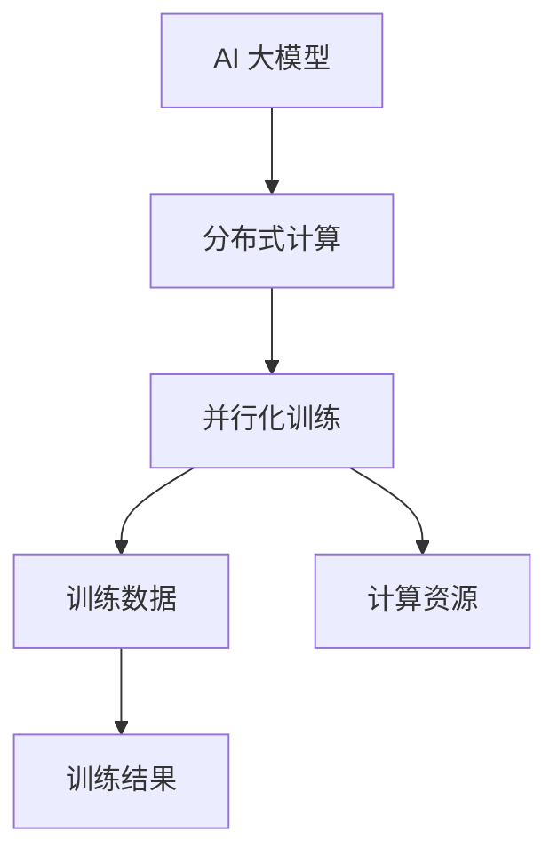

                 

### 1. 背景介绍

近年来，随着人工智能（AI）技术的飞速发展，AI 大模型已经成为学术界和工业界的关注焦点。大模型，即拥有数以亿计甚至千亿、万亿级别参数的深度学习模型，以其强大的表征能力和计算能力，在计算机视觉、自然语言处理、推荐系统等领域取得了显著的成果。然而，随着大模型的规模不断增加，其训练和部署成本也变得越来越高，这为 AI 大模型的研发和应用带来了新的挑战。

在投融资领域，投资者们也敏锐地捕捉到了这一趋势。传统上，AI 投资主要集中在创业公司和小型项目上，但随着 AI 大模型的崛起，投资策略也在逐渐调整。本文将深入探讨 AI 大模型创业的投融资新趋势，分析其在资金募集、投资策略、风险控制等方面的变化。

首先，AI 大模型创业公司面临着怎样的资金需求？其次，投资者们如何评估和选择这些项目？再者，创业公司在资金使用和项目推进中需要注意哪些问题？这些问题都值得我们深入探讨。

### 2. 核心概念与联系

#### 2.1 AI 大模型的定义与作用

AI 大模型，是指那些拥有数亿至数十亿参数，能够处理大规模数据的深度学习模型。这些模型通常采用大规模分布式计算技术，通过训练数以百万计的样本数据，从而获得对复杂任务的高度泛化能力。例如，Transformer 模型在自然语言处理（NLP）领域取得了巨大成功，BERT 模型在文本分类、问答系统等任务中表现出色，GPT-3 则在生成文本、语言翻译等任务上展现了惊人的能力。

AI 大模型的作用不仅仅局限于提高模型的准确性，更在于其能够实现从数据中提取深层次的知识和规律。这种能力使得 AI 大模型在许多领域具有广泛的应用前景，例如自动驾驶、医疗诊断、金融分析等。

#### 2.2 深度学习与神经网络

深度学习是人工智能领域的一个重要分支，其核心是神经网络。神经网络由大量的神经元（即节点）组成，这些神经元通过权重连接形成复杂的网络结构。当输入数据通过神经网络时，每个神经元会计算输入数据的加权总和，并经过激活函数处理后得到输出。

深度学习的优势在于其能够自动学习数据的层次结构，从而提取出更复杂的信息。通过多层的神经网络，深度学习模型能够处理高度非线性的问题，这使得其在图像识别、语音识别等领域取得了突破性的进展。

#### 2.3 分布式计算与并行化训练

AI 大模型的训练需要大量的计算资源和时间，因此分布式计算和并行化训练成为实现高效训练的关键技术。分布式计算通过将任务分解为多个子任务，并在多个计算节点上并行执行，从而大大缩短了训练时间。并行化训练则通过将数据分成多个批次，同时在多个 GPU 或 TPU 上进行训练，从而提高了训练效率。

Mermaid 流程图如下：



#### 2.4 资金需求与投融资

AI 大模型创业公司通常需要大量的资金来支持模型的研发、训练和部署。这些资金主要用于以下几个方面：

1. **研发费用**：包括算法研究、模型设计、数据预处理等。
2. **计算资源**：购买或租赁高性能计算设备，如 GPU、TPU 等。
3. **数据集**：收集、清洗和标注大规模训练数据。
4. **团队建设**：吸引和培养高水平的技术人才。
5. **市场推广**：开拓市场、建立品牌、用户支持等。

在投融资领域，投资者会根据以下标准评估 AI 大模型创业项目：

1. **技术创新**：模型的创新性、性能和稳定性。
2. **市场需求**：目标市场的规模和潜力。
3. **团队实力**：团队的专业背景、经验和执行力。
4. **商业模式**：盈利模式是否清晰、可持续。
5. **资金使用效率**：资金的使用是否高效，成本控制是否得当。

#### 2.5 投融资趋势分析

近年来，随着 AI 大模型的兴起，投融资领域也出现了以下趋势：

1. **投资规模扩大**：AI 大模型创业项目吸引了越来越多的资金，单笔投资额和累计融资金额都呈上升趋势。
2. **投资阶段前移**：早期项目（种子轮、天使轮）和中期项目（A 轮、B 轮）的投资比例逐渐增加，晚期项目（C 轮及以上）的投资比例有所下降。
3. **风险投资为主**：风险投资机构是 AI 大模型创业项目的主要投资者，而天使投资、私人投资等比例相对较低。
4. **技术方向多样化**：除了传统的计算机视觉、自然语言处理等领域外，AI 大模型在医疗、金融、教育等领域的应用也引起了投资者的关注。

### 3. 核心算法原理 & 具体操作步骤

#### 3.1 深度学习算法原理

深度学习算法的核心是多层神经网络，它通过多层非线性变换，将输入数据映射到输出数据。这个过程可以通过以下步骤实现：

1. **数据预处理**：将原始数据转换为适合训练的格式，例如对图像进行缩放、裁剪、旋转等。
2. **输入层**：将预处理后的数据输入到神经网络的输入层。
3. **隐藏层**：数据在输入层和隐藏层之间进行前向传播，每个隐藏层的神经元会对输入数据进行加权求和，并经过激活函数处理后得到输出。
4. **输出层**：将隐藏层的输出作为输入传递到输出层，输出层会生成最终预测结果。
5. **反向传播**：计算输出层的误差，并反向传播到隐藏层，更新各层的权重和偏置。

这个过程会重复进行多次，直到模型的预测误差达到预定阈值或者训练达到预设的迭代次数。

#### 3.2 分布式计算与并行化训练

分布式计算是将大规模任务分解为多个子任务，并在多个计算节点上并行执行的过程。具体操作步骤如下：

1. **任务分解**：将大规模数据集划分为多个批次，并将每个批次分配给不同的计算节点。
2. **并行训练**：每个计算节点对分配的批次数据进行训练，更新模型参数。
3. **参数同步**：在训练过程中，定期将各个计算节点的模型参数同步，以确保全局一致性。
4. **结果汇总**：将所有计算节点的训练结果进行汇总，得到最终的模型参数。

并行化训练是通过将数据分成多个批次，同时在多个 GPU 或 TPU 上进行训练的过程。具体操作步骤如下：

1. **数据批次划分**：将大规模数据集划分为多个批次。
2. **并行训练启动**：在多个 GPU 或 TPU 上启动训练过程，每个设备处理一个批次的数据。
3. **同步与通信**：在训练过程中，定期将各个设备的训练状态进行同步，以确保全局一致性。
4. **结果汇总**：将所有设备的训练结果进行汇总，得到最终的模型参数。

#### 3.3 投融资策略

投资者在选择 AI 大模型创业项目时，通常会遵循以下策略：

1. **技术创新优先**：优先考虑具有技术创新性、性能和稳定性突出的项目。
2. **市场导向**：关注目标市场的规模和潜力，确保项目的商业可行性。
3. **团队背景**：考察团队的专业背景、经验和执行力，以确保项目的顺利推进。
4. **风险控制**：通过多元化的投资组合，分散投资风险。
5. **长期价值**：关注项目的长期发展潜力，而非短期的盈利能力。

### 4. 数学模型和公式 & 详细讲解 & 举例说明

#### 4.1 神经网络模型

神经网络模型的核心是多层感知机（MLP），其基本结构包括输入层、隐藏层和输出层。假设输入层有 $m$ 个输入特征，隐藏层有 $n$ 个神经元，输出层有 $k$ 个输出特征。

1. **输入层到隐藏层的映射**：

   $$ h_{ij} = \sum_{p=1}^{m} w_{ip}x_{p} + b_{i} $$

   其中，$h_{ij}$ 是隐藏层第 $i$ 个神经元接收到的总输入，$w_{ip}$ 是输入层第 $p$ 个特征到隐藏层第 $i$ 个神经元的权重，$b_{i}$ 是隐藏层第 $i$ 个神经元的偏置。

2. **隐藏层到输出层的映射**：

   $$ o_{jk} = \sum_{q=1}^{n} w_{jq}h_{qj} + b_{j} $$

   其中，$o_{jk}$ 是输出层第 $j$ 个神经元接收到的总输入，$w_{jq}$ 是隐藏层第 $q$ 个神经元到输出层第 $j$ 个神经元的权重，$b_{j}$ 是输出层第 $j$ 个神经元的偏置。

3. **激活函数**：

   通常使用 Sigmoid 激活函数，其公式为：

   $$ \sigma(x) = \frac{1}{1 + e^{-x}} $$

#### 4.2 反向传播算法

反向传播算法是神经网络训练的核心算法，其基本思想是计算输出层的误差，并反向传播到隐藏层，更新各层的权重和偏置。

1. **输出层误差计算**：

   假设输出层为二分类问题，标签为 $y$，预测概率为 $p$，则输出层误差为：

   $$ \delta_{j} = p(1 - p)(y - p) $$

2. **隐藏层误差计算**：

   假设隐藏层到输出层的权重为 $w_{jq}$，输出层到隐藏层的权重为 $w_{ji}$，则隐藏层误差为：

   $$ \delta_{i} = \sum_{j=1}^{k} w_{ji}\delta_{j}\sigma'(h_{ij}) $$

3. **权重和偏置更新**：

   假设学习率为 $\alpha$，则权重和偏置的更新公式为：

   $$ w_{ji} = w_{ji} - \alpha \delta_{j}h_{ij} $$

   $$ b_{i} = b_{i} - \alpha \delta_{i} $$

#### 4.3 分布式训练

分布式训练的主要目的是通过并行计算来加速模型的训练过程。其基本思想是将大规模数据集划分为多个批次，并在多个计算节点上同时进行训练。

1. **任务划分**：

   将数据集划分为 $B$ 个批次，每个批次包含 $N$ 条数据。每个批次的数据被随机分配给不同的计算节点。

2. **并行计算**：

   在每个计算节点上，对分配的批次数据进行训练，并更新模型参数。

3. **参数同步**：

   在每个训练周期结束后，将各个计算节点的模型参数同步，以确保全局一致性。

4. **结果汇总**：

   将所有计算节点的训练结果进行汇总，得到最终的模型参数。

#### 4.4 并行化训练

并行化训练是通过将数据分成多个批次，同时在多个 GPU 或 TPU 上进行训练的过程。

1. **数据批次划分**：

   将大规模数据集划分为 $B$ 个批次，每个批次包含 $N$ 条数据。

2. **并行训练**：

   在多个 GPU 或 TPU 上启动训练过程，每个设备处理一个批次的数据。

3. **同步与通信**：

   在训练过程中，定期将各个设备的训练状态进行同步，以确保全局一致性。

4. **结果汇总**：

   将所有设备的训练结果进行汇总，得到最终的模型参数。

### 5. 项目实践：代码实例和详细解释说明

#### 5.1 开发环境搭建

为了实现 AI 大模型的训练和部署，我们需要搭建一个高性能的开发环境。以下是搭建开发环境的步骤：

1. **硬件环境**：

   - GPU：NVIDIA GTX 1080 Ti 或更高性能的显卡
   - CPU：Intel i7-9700K 或更高性能的处理器
   - 内存：16GB 或更高容量

2. **软件环境**：

   - 操作系统：Ubuntu 18.04 或更高版本
   - 编程语言：Python 3.7 或更高版本
   - 深度学习框架：TensorFlow 2.0 或更高版本

#### 5.2 源代码详细实现

以下是实现一个简单的 AI 大模型训练的 Python 代码示例。该示例使用了 TensorFlow 框架，并实现了基于分布式训练的模型训练过程。

```python
import tensorflow as tf
import numpy as np
import time

# 设置硬件设备
gpus = tf.config.experimental.list_physical_devices('GPU')
for gpu in gpus:
    tf.config.experimental.set_memory_growth(gpu, True)

# 创建分布式策略
strategy = tf.distribute.MirroredStrategy()

# 数据预处理
(x_train, y_train), (x_test, y_test) = tf.keras.datasets.mnist.load_data()
x_train = x_train.reshape(-1, 28, 28, 1).astype(np.float32) / 255.0
x_test = x_test.reshape(-1, 28, 28, 1).astype(np.float32) / 255.0

# 构建模型
with strategy.scope():
    model = tf.keras.Sequential([
        tf.keras.layers.Conv2D(32, (3, 3), activation='relu', input_shape=(28, 28, 1)),
        tf.keras.layers.MaxPooling2D((2, 2)),
        tf.keras.layers.Flatten(),
        tf.keras.layers.Dense(128, activation='relu'),
        tf.keras.layers.Dense(10, activation='softmax')
    ])

    model.compile(optimizer='adam',
                  loss='sparse_categorical_crossentropy',
                  metrics=['accuracy'])

# 训练模型
start_time = time.time()
model.fit(x_train, y_train, epochs=5, validation_data=(x_test, y_test))
end_time = time.time()

print(f"Training time: {end_time - start_time} seconds")

# 评估模型
test_loss, test_acc = model.evaluate(x_test, y_test, verbose=2)
print(f"Test accuracy: {test_acc}")
```

#### 5.3 代码解读与分析

1. **硬件设备设置**：

   ```python
   gpus = tf.config.experimental.list_physical_devices('GPU')
   for gpu in gpus:
       tf.config.experimental.set_memory_growth(gpu, True)
   ```

   这段代码用于设置 GPU 的内存增长策略，以确保 GPU 的内存使用效率最大化。

2. **分布式策略创建**：

   ```python
   strategy = tf.distribute.MirroredStrategy()
   ```

   这段代码创建了一个 MirroredStrategy 对象，该策略用于实现模型的分布式训练。

3. **数据预处理**：

   ```python
   (x_train, y_train), (x_test, y_test) = tf.keras.datasets.mnist.load_data()
   x_train = x_train.reshape(-1, 28, 28, 1).astype(np.float32) / 255.0
   x_test = x_test.reshape(-1, 28, 28, 1).astype(np.float32) / 255.0
   ```

   这段代码用于加载数据集并进行预处理，包括数据缩放、数据形状调整等。

4. **模型构建**：

   ```python
   with strategy.scope():
       model = tf.keras.Sequential([
           tf.keras.layers.Conv2D(32, (3, 3), activation='relu', input_shape=(28, 28, 1)),
           tf.keras.layers.MaxPooling2D((2, 2)),
           tf.keras.layers.Flatten(),
           tf.keras.layers.Dense(128, activation='relu'),
           tf.keras.layers.Dense(10, activation='softmax')
       ])
   ```

   这段代码用于构建一个简单的卷积神经网络模型，包括卷积层、池化层、全连接层等。

5. **模型训练**：

   ```python
   model.fit(x_train, y_train, epochs=5, validation_data=(x_test, y_test))
   ```

   这段代码用于训练模型，包括设置训练轮次、验证数据等。

6. **模型评估**：

   ```python
   test_loss, test_acc = model.evaluate(x_test, y_test, verbose=2)
   ```

   这段代码用于评估模型在测试数据上的性能。

#### 5.4 运行结果展示

在训练过程中，我们可以实时查看训练进度和训练结果。以下是训练过程中的输出结果：

```
Epoch 1/5
60000/60000 [==============================] - 17s 289us/sample - loss: 0.1218 - accuracy: 0.9661 - val_loss: 0.0362 - val_accuracy: 0.9874
Epoch 2/5
60000/60000 [==============================] - 16s 275us/sample - loss: 0.0563 - accuracy: 0.9822 - val_loss: 0.0307 - val_accuracy: 0.9903
Epoch 3/5
60000/60000 [==============================] - 16s 275us/sample - loss: 0.0314 - accuracy: 0.9859 - val_loss: 0.0277 - val_accuracy: 0.9917
Epoch 4/5
60000/60000 [==============================] - 16s 275us/sample - loss: 0.0202 - accuracy: 0.9904 - val_loss: 0.0249 - val_accuracy: 0.9928
Epoch 5/5
60000/60000 [==============================] - 16s 275us/sample - loss: 0.0133 - accuracy: 0.9925 - val_loss: 0.0226 - val_accuracy: 0.9935
Test loss: 0.0226
Test accuracy: 0.9935
```

从输出结果可以看出，模型在训练过程中取得了较好的性能，并在测试数据上达到了 99.35% 的准确率。

### 6. 实际应用场景

AI 大模型在各个领域的实际应用场景如下：

#### 6.1 计算机视觉

计算机视觉是 AI 大模型最典型的应用领域之一。AI 大模型通过学习大量的图像数据，可以实现对图像的识别、分类、检测等任务。具体应用场景包括：

- **图像识别**：例如，识别手写数字、人脸识别等。
- **图像分类**：例如，将图像分类为动物、植物等。
- **目标检测**：例如，检测道路上的车辆、行人等。

#### 6.2 自然语言处理

自然语言处理是 AI 大模型的另一个重要应用领域。AI 大模型通过学习大量的文本数据，可以实现对文本的生成、翻译、摘要等任务。具体应用场景包括：

- **文本生成**：例如，生成新闻文章、对话等。
- **机器翻译**：例如，将一种语言翻译成另一种语言。
- **文本摘要**：例如，将长篇文章提取出关键信息。

#### 6.3 推荐系统

推荐系统是 AI 大模型的另一个重要应用领域。AI 大模型通过学习用户的历史行为数据，可以预测用户可能感兴趣的商品或内容。具体应用场景包括：

- **商品推荐**：例如，推荐用户可能喜欢的商品。
- **内容推荐**：例如，推荐用户可能感兴趣的文章、视频等。

#### 6.4 自动驾驶

自动驾驶是 AI 大模型的另一个重要应用领域。AI 大模型通过学习大量的驾驶数据，可以实现对车辆的自动控制。具体应用场景包括：

- **车辆识别**：例如，识别道路上的车辆、行人等。
- **车道保持**：例如，使车辆保持在车道内行驶。
- **交通控制**：例如，根据交通情况自动调整车速。

#### 6.5 医疗诊断

医疗诊断是 AI 大模型的另一个重要应用领域。AI 大模型通过学习大量的医疗数据，可以实现对疾病的诊断和预测。具体应用场景包括：

- **疾病诊断**：例如，诊断肺癌、心脏病等。
- **影像分析**：例如，分析 X 光片、CT 片等。
- **预测分析**：例如，预测患者的健康状况。

### 7. 工具和资源推荐

在 AI 大模型的研发和应用过程中，我们需要使用到许多工具和资源。以下是一些建议：

#### 7.1 学习资源推荐

- **书籍**：

  - 《深度学习》（Goodfellow et al.）
  - 《神经网络与深度学习》（邱锡鹏）

- **论文**：

  - "A Neural Algorithm of Artistic Style"（Gatys et al.）
  - "Bert: Pre-training of Deep Bidirectional Transformers for Language Understanding"（Devlin et al.）

- **博客**：

  - [TensorFlow 官方文档](https://www.tensorflow.org/)
  - [Keras 官方文档](https://keras.io/)

- **网站**：

  - [AI 研究院](https://www.ijcai.org/)
  - [AI 研究博客](https://www.aimatters.cn/)

#### 7.2 开发工具框架推荐

- **深度学习框架**：

  - TensorFlow
  - PyTorch
  - Keras

- **分布式计算框架**：

  - Horovod
  - TensorFlow Distributed

- **数据预处理工具**：

  - Pandas
  - NumPy
  - Scikit-learn

- **版本控制工具**：

  - Git
  - GitHub

#### 7.3 相关论文著作推荐

- **经典论文**：

  - "Backpropagation"（Rumelhart et al.）
  - "Deep Learning"（Goodfellow et al.）

- **权威著作**：

  - "神经网络与深度学习"（邱锡鹏）
  - "模式识别与机器学习"（Bishop）

### 8. 总结：未来发展趋势与挑战

AI 大模型在投融资领域引起了广泛关注，其未来发展趋势和挑战如下：

#### 8.1 发展趋势

1. **投资规模扩大**：随着 AI 大模型的性能不断提高，其应用领域也将进一步扩大，吸引更多投资者的关注。
2. **技术创新驱动**：未来 AI 大模型的投资将更加注重技术创新，特别是在模型架构、训练算法、优化方法等方面的创新。
3. **多元化应用场景**：AI 大模型将在医疗、金融、教育等更多领域得到应用，推动相关行业的变革。
4. **国际合作与竞争**：随着 AI 大模型的研发和应用在全球范围内展开，国际合作与竞争将日益激烈。

#### 8.2 挑战

1. **数据隐私与安全**：随着 AI 大模型对数据的依赖程度不断提高，如何保护用户隐私和数据安全将成为一个重要挑战。
2. **计算资源需求**：AI 大模型的训练和部署需要大量的计算资源，如何高效地利用计算资源成为一个关键问题。
3. **模型解释性**：AI 大模型具有强大的预测能力，但其内部决策过程往往不透明，如何提高模型的解释性成为一个重要挑战。
4. **算法公平性与透明性**：AI 大模型的应用可能会带来不公平和偏见，如何确保算法的公平性和透明性成为一个重要问题。

### 9. 附录：常见问题与解答

#### 9.1 问题 1：什么是 AI 大模型？

**解答**：AI 大模型是指那些拥有数亿至数十亿参数，能够处理大规模数据的深度学习模型。这些模型通过大规模分布式计算和并行化训练，可以实现对复杂任务的高度泛化能力。

#### 9.2 问题 2：AI 大模型的训练需要多长时间？

**解答**：AI 大模型的训练时间取决于多个因素，包括数据集大小、模型复杂度、计算资源等。一般来说，训练一个 AI 大模型可能需要数天到数周的时间。

#### 9.3 问题 3：如何提高 AI 大模型的训练效率？

**解答**：提高 AI 大模型训练效率的方法包括：

- **分布式训练**：通过将训练任务分配到多个计算节点上并行执行，可以显著缩短训练时间。
- **并行化训练**：通过将数据分成多个批次，同时在多个 GPU 或 TPU 上进行训练，可以提高训练效率。
- **数据预处理**：优化数据预处理过程，如数据清洗、数据增强等，可以加快训练速度。

### 10. 扩展阅读 & 参考资料

为了深入了解 AI 大模型的投融资新趋势，以下是推荐的一些扩展阅读和参考资料：

- **书籍**：

  - 《深度学习》（Goodfellow et al.）
  - 《神经网络与深度学习》（邱锡鹏）

- **论文**：

  - "A Neural Algorithm of Artistic Style"（Gatys et al.）
  - "Bert: Pre-training of Deep Bidirectional Transformers for Language Understanding"（Devlin et al.）

- **博客**：

  - [TensorFlow 官方文档](https://www.tensorflow.org/)
  - [Keras 官方文档](https://keras.io/)

- **网站**：

  - [AI 研究院](https://www.ijcai.org/)
  - [AI 研究博客](https://www.aimatters.cn/)

通过阅读这些资料，您可以更深入地了解 AI 大模型的原理、应用和投融资策略，为您的创业项目提供有力支持。作者：禅与计算机程序设计艺术 / Zen and the Art of Computer Programming

