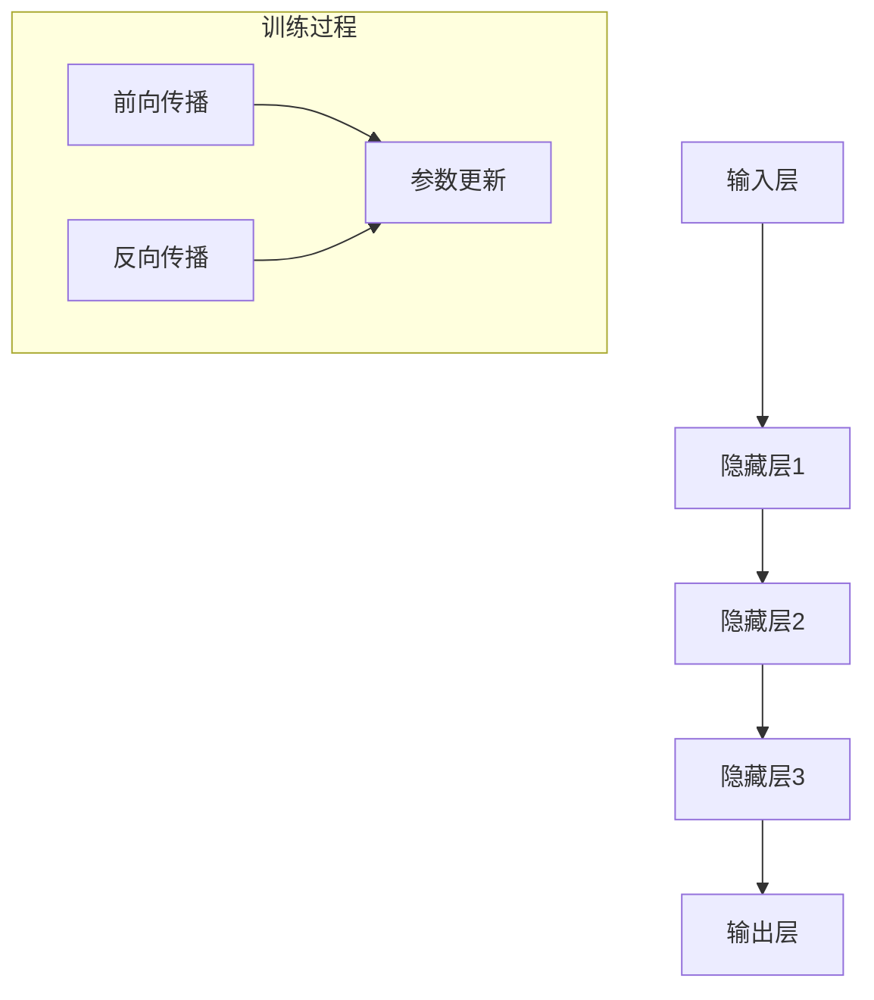
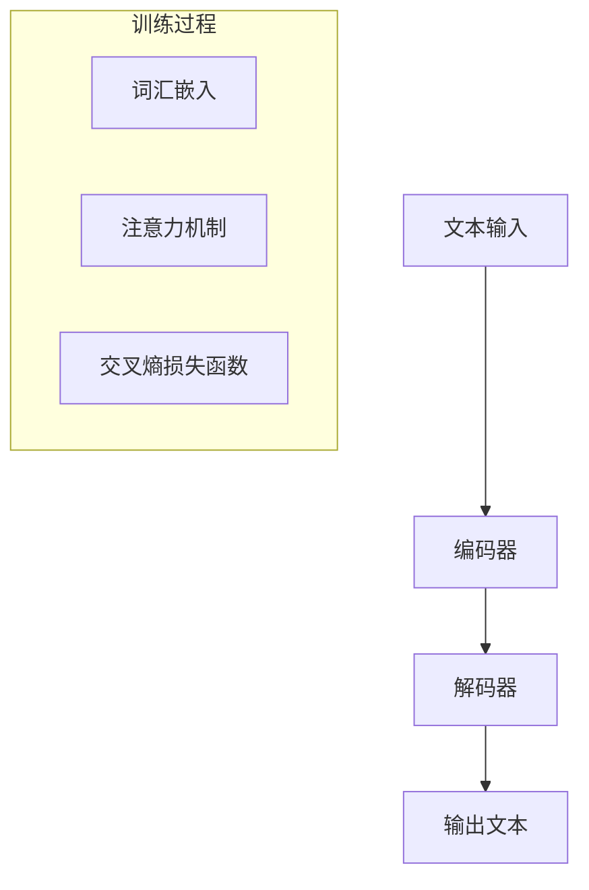
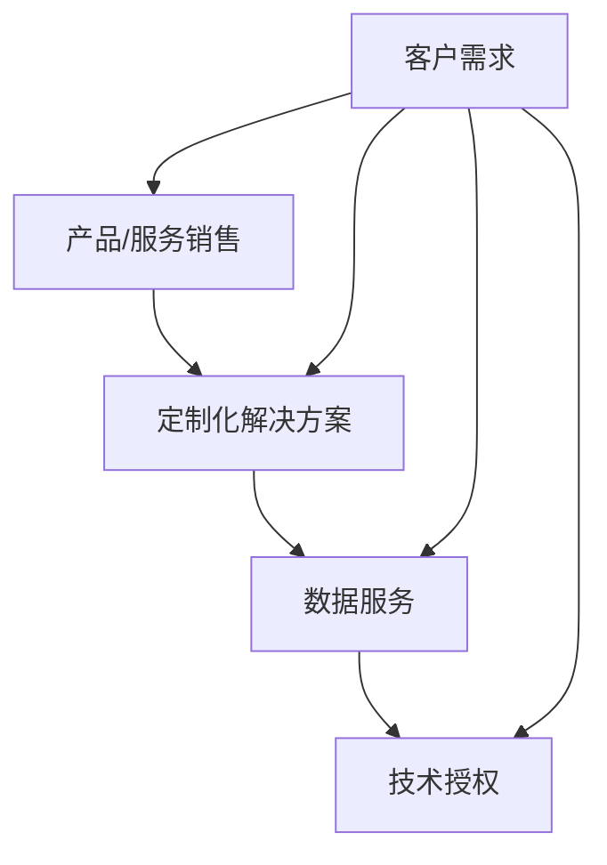

                 

### 背景介绍 Background Introduction

随着人工智能技术的飞速发展，大模型（Large-scale Models）已经成为推动各行各业进步的重要力量。大模型，通常指的是参数量在数亿至千亿级别的人工神经网络模型，如GPT、BERT等。这些模型在自然语言处理、图像识别、语音合成等领域展现出了超越人类的性能，为企业创新和商业价值创造提供了无限可能。

#### 历史发展 Historical Development

人工智能（AI）的概念最早由John McCarthy在1956年的达特茅斯会议上提出。从那时起，人工智能经历了多个发展阶段，从符号主义、知识表示到连接主义，再到如今的深度学习。特别是深度学习在2012年AlexNet在ImageNet竞赛中取得突破性成果后，迅速成为AI领域的核心技术。

大模型的发展可以追溯到2014年Google提出的深度神经网络模型DNN，随后是2016年OpenAI提出的GPT，这些模型标志着大模型时代的到来。大模型的出现，不仅使得计算机处理自然语言的能力大幅提升，还在其他许多领域，如图像识别、语音合成等，取得了显著的进展。

#### 当前现状 Current Status

当前，大模型技术已经成为学术界和工业界的焦点。在自然语言处理领域，GPT、BERT、T5等大模型不断刷新基准，推动着自动驾驶、智能客服、内容创作等领域的进步。在图像识别领域，ImageNet大型图像识别挑战赛也成为了各大公司和研究机构展示大模型技术的重要舞台。

然而，大模型的发展也面临着诸多挑战。首先，大模型的训练和推理需要大量的计算资源和数据集，这对于企业和研究机构来说是一个巨大的成本。其次，大模型在处理长文本或长序列时的效率问题仍然是一个瓶颈。此外，大模型的解释性差和潜在的安全风险也引发了广泛关注。

#### 创业机遇 Business Opportunities

尽管面临挑战，大模型技术仍然为创业公司提供了广阔的机遇。首先，大模型可以应用于各种垂直行业，如医疗、金融、教育等，为企业提供定制化的解决方案。其次，随着大模型开源项目的增多，创业公司可以通过整合和优化现有的大模型，提供更加高效、可解释和安全的解决方案。

此外，随着5G、边缘计算等技术的发展，大模型在边缘设备上的部署和应用也成为一个重要的方向。创业公司可以探索如何在有限的计算资源和数据带宽下，实现高效的大模型推理和训练。

### 文章摘要 Summary

本文将深入探讨AI大模型创业的盈利模式、核心技术和实现步骤。首先，我们回顾了AI和大模型的发展历程，以及当前的应用现状和挑战。接着，我们将分析大模型创业的机遇，并探讨如何利用大模型技术实现未来盈利。最后，我们将通过一个具体的案例，展示如何实现大模型创业，并提供一些建议和资源，帮助读者进一步了解和探索这个领域。

## 2. 核心概念与联系 Core Concepts and Relationships

为了深入理解AI大模型创业的盈利模式和技术实现，我们需要先掌握几个核心概念，包括大模型的原理、架构和应用场景。接下来，我们将通过一个Mermaid流程图来阐述这些概念之间的关系。

### 大模型原理和架构

大模型的基本原理是基于深度学习，通过多层神经网络对大量数据进行训练，以实现高精度的预测和决策。大模型的架构通常包括以下几个层次：

1. **输入层（Input Layer）**：接收外部输入数据，如文本、图像或声音等。
2. **隐藏层（Hidden Layers）**：对输入数据进行处理和特征提取，通过神经网络的前向传播和反向传播算法不断优化模型参数。
3. **输出层（Output Layer）**：根据训练目标生成输出结果，如分类标签、文本生成等。

下面是使用Mermaid绘制的简化的大模型架构流程图：



### 大模型应用场景

大模型的应用场景非常广泛，涵盖了自然语言处理、计算机视觉、语音识别等多个领域。以下是几个典型的应用场景：

1. **自然语言处理（NLP）**：大模型可以用于文本分类、情感分析、机器翻译等任务，如图文生成模型GPT-3。
2. **计算机视觉（CV）**：大模型可以用于图像分类、目标检测、人脸识别等任务，如图像识别模型ResNet。
3. **语音识别（ASR）**：大模型可以用于语音识别和语音合成，如图像识别模型WaveNet。

下面是使用Mermaid绘制的简化的NLP应用场景流程图：



### 大模型创业的盈利模式

大模型创业的盈利模式主要包括以下几个方面：

1. **产品和服务销售**：通过开发基于大模型的产品和服务，如智能客服、智能翻译等，直接向客户销售。
2. **定制化解决方案**：针对特定行业或企业需求，提供定制化的大模型解决方案，如医疗诊断、金融风险评估等。
3. **数据服务**：提供高质量的数据集和标注服务，支持大模型的训练和优化。
4. **技术授权**：将自主研发的大模型技术授权给其他企业使用，获得技术收入。

下面是使用Mermaid绘制的简化的盈利模式流程图：



通过上述Mermaid流程图，我们可以清晰地看到大模型原理、架构、应用场景以及创业盈利模式之间的关系。这些核心概念和联系不仅帮助我们理解了AI大模型的基本原理，也为创业者在实际操作中提供了指导和参考。

## 3. 核心算法原理 & 具体操作步骤 Core Algorithm Principles & Step-by-Step Procedures

### 深度学习基础

深度学习是构建AI大模型的核心技术。其基本原理是通过多层神经网络对输入数据进行特征提取和学习，以实现高精度的预测和决策。以下是深度学习的基本组成部分和原理：

1. **神经网络（Neural Networks）**：神经网络是深度学习的基础，由大量的神经元（节点）组成，每个神经元接收多个输入，并通过权重和激活函数进行计算，最后输出结果。神经网络通过不断调整权重，使输出结果更加接近预期。

2. **多层感知机（MLP）**：多层感知机是最简单的多层神经网络，由输入层、隐藏层和输出层组成。输入层接收外部输入数据，隐藏层对输入数据进行特征提取，输出层生成预测结果。

3. **反向传播算法（Backpropagation）**：反向传播算法是训练神经网络的常用方法，通过计算输出误差梯度，反向传播至每个神经元的权重，从而不断调整权重，优化模型性能。

4. **激活函数（Activation Functions）**：激活函数用于引入非线性因素，使神经网络能够处理非线性问题。常见的激活函数包括Sigmoid、ReLU和Tanh等。

### 大模型训练流程

大模型的训练过程主要包括以下几个步骤：

1. **数据准备**：首先，需要收集和准备大量高质量的数据集。对于自然语言处理任务，数据集通常包括文本和标签；对于计算机视觉任务，数据集包括图像和标注。

2. **数据预处理**：对收集到的数据进行预处理，包括数据清洗、归一化、编码等。对于文本数据，通常需要进行分词、词向量嵌入等操作；对于图像数据，需要进行大小调整、裁剪、增强等。

3. **模型定义**：根据任务需求，定义神经网络的结构和参数。常用的框架有TensorFlow、PyTorch等。

4. **模型训练**：使用训练数据集对模型进行训练。在训练过程中，通过反向传播算法不断更新模型参数，使模型输出结果更加准确。

5. **模型评估**：使用验证数据集评估模型性能。常用的评估指标包括准确率、召回率、F1值等。

6. **模型调整**：根据模型评估结果，调整模型参数和结构，以提高模型性能。

### 大模型训练具体操作步骤

以下是使用PyTorch框架训练一个简单的图像分类模型的步骤：

1. **安装PyTorch**：
   ```bash
   pip install torch torchvision
   ```

2. **导入必要库**：
   ```python
   import torch
   import torchvision
   import torchvision.transforms as transforms
   import torch.nn as nn
   import torch.optim as optim
   ```

3. **数据准备**：
   ```python
   transform = transforms.Compose([
       transforms.Resize((224, 224)),
       transforms.ToTensor(),
   ])

   trainset = torchvision.datasets.ImageFolder(root='path_to_train_data', transform=transform)
   trainloader = torch.utils.data.DataLoader(trainset, batch_size=32, shuffle=True)

   testset = torchvision.datasets.ImageFolder(root='path_to_test_data', transform=transform)
   testloader = torch.utils.data.DataLoader(testset, batch_size=32, shuffle=False)
   ```

4. **模型定义**：
   ```python
   class Net(nn.Module):
       def __init__(self):
           super(Net, self).__init__()
           self.conv1 = nn.Conv2d(3, 6, 5)
           self.pool = nn.MaxPool2d(2, 2)
           self.conv2 = nn.Conv2d(6, 16, 5)
           self.fc1 = nn.Linear(16 * 5 * 5, 120)
           self.fc2 = nn.Linear(120, 84)
           self.fc3 = nn.Linear(84, 10)

       def forward(self, x):
           x = self.pool(nn.functional.relu(self.conv1(x)))
           x = self.pool(nn.functional.relu(self.conv2(x)))
           x = x.view(-1, 16 * 5 * 5)
           x = nn.functional.relu(self.fc1(x))
           x = nn.functional.relu(self.fc2(x))
           x = self.fc3(x)
           return x

   net = Net()
   ```

5. **模型训练**：
   ```python
   criterion = nn.CrossEntropyLoss()
   optimizer = optim.SGD(net.parameters(), lr=0.001, momentum=0.9)

   for epoch in range(10):  # loop over the dataset multiple times
       running_loss = 0.0
       for i, data in enumerate(trainloader, 0):
           inputs, labels = data
           optimizer.zero_grad()
           outputs = net(inputs)
           loss = criterion(outputs, labels)
           loss.backward()
           optimizer.step()
           running_loss += loss.item()
       print(f'Epoch {epoch + 1}, Loss: {running_loss / len(trainloader)}')
   ```

6. **模型评估**：
   ```python
   correct = 0
   total = 0
   with torch.no_grad():
       for data in testloader:
           images, labels = data
           outputs = net(images)
           _, predicted = torch.max(outputs.data, 1)
           total += labels.size(0)
           correct += (predicted == labels).sum().item()

   print(f'Accuracy of the network on the 1000 test images: {100 * correct / total} %')
   ```

通过上述步骤，我们可以使用PyTorch框架训练一个简单的图像分类模型。当然，在实际应用中，大模型的训练过程会更加复杂，包括模型架构的调整、数据增强、超参数优化等。然而，上述步骤为我们提供了一个基本的训练流程，可以帮助我们理解和实现大模型的基本操作。

### 总结

在本章节中，我们介绍了深度学习的基本原理和算法，以及大模型训练的具体操作步骤。通过这些内容，我们可以了解到构建和训练一个AI大模型的基本流程，为后续的创业实践提供了理论基础。

## 4. 数学模型和公式 Mathematical Models & Detailed Explanations with Examples

### 深度学习基础

深度学习中的数学模型主要涉及神经网络、损失函数、优化算法等方面。以下是对这些基本概念和公式的详细讲解。

#### 神经网络

神经网络的计算过程可以表示为：

\[ z = \sigma(W \cdot x + b) \]

其中，\( z \) 是隐藏层的输出，\( \sigma \) 是激活函数（如ReLU函数），\( W \) 是权重矩阵，\( x \) 是输入特征，\( b \) 是偏置项。

在输出层，我们可以使用以下公式计算损失：

\[ L = -\sum_{i=1}^{n} y_i \cdot \log(a_i) \]

其中，\( y_i \) 是实际标签，\( a_i \) 是神经网络输出的概率分布。

#### 反向传播算法

反向传播算法用于计算损失关于每个权重的梯度。其基本步骤如下：

1. **前向传播**：计算神经网络的前向传递，得到输出 \( a \)。
2. **计算损失**：使用损失函数计算实际损失 \( L \)。
3. **后向传播**：计算损失关于每个权重的梯度。

具体的梯度计算公式如下：

\[ \frac{\partial L}{\partial W} = \frac{\partial L}{\partial a} \cdot \frac{\partial a}{\partial z} \cdot \frac{\partial z}{\partial W} \]

对于ReLU激活函数，梯度可以简化为：

\[ \frac{\partial a}{\partial z} = \begin{cases} 
1 & \text{if } z > 0 \\
0 & \text{otherwise}
\end{cases} \]

#### 损失函数

常见的损失函数包括均方误差（MSE）和交叉熵（Cross Entropy）。

1. **均方误差（MSE）**：

\[ L = \frac{1}{2} \sum_{i=1}^{n} (y_i - a_i)^2 \]

2. **交叉熵（Cross Entropy）**：

\[ L = -\sum_{i=1}^{n} y_i \cdot \log(a_i) \]

#### 优化算法

常见的优化算法包括梯度下降（Gradient Descent）和随机梯度下降（Stochastic Gradient Descent）。

1. **梯度下降**：

\[ W_{new} = W_{old} - \alpha \cdot \frac{\partial L}{\partial W} \]

其中，\( \alpha \) 是学习率。

2. **随机梯度下降**：

\[ W_{new} = W_{old} - \alpha \cdot \frac{\partial L}{\partial W} \]

与梯度下降不同，随机梯度下降在每个迭代步骤中只计算一个样本的梯度。

#### 梯度消失和梯度爆炸

在深度学习中，梯度消失和梯度爆炸是常见的问题。为了解决这些问题，我们可以使用以下策略：

1. **归一化输入**：通过归一化输入数据，可以减少梯度消失和梯度爆炸的风险。
2. **权重初始化**：选择适当的权重初始化策略，如He初始化和Xavier初始化。
3. **激活函数**：使用ReLU激活函数可以缓解梯度消失问题。

### 具体示例

假设我们有一个简单的两层神经网络，输入层有3个神经元，隐藏层有4个神经元，输出层有2个神经元。给定一个输入向量 \( x = [1, 2, 3] \)，以及标签 \( y = [0, 1] \)。

1. **前向传播**：

输入层到隐藏层的权重 \( W_1 \) 和偏置 \( b_1 \)：

\[ z_1 = \sigma(W_1 \cdot x + b_1) \]

隐藏层到输出层的权重 \( W_2 \) 和偏置 \( b_2 \)：

\[ z_2 = \sigma(W_2 \cdot z_1 + b_2) \]

2. **损失计算**：

\[ L = -\sum_{i=1}^{2} y_i \cdot \log(z_{2i}) \]

3. **反向传播**：

计算隐藏层到输出层的梯度：

\[ \frac{\partial L}{\partial W_2} = \frac{\partial L}{\partial z_2} \cdot \frac{\partial z_2}{\partial W_2} \]

计算输入层到隐藏层的梯度：

\[ \frac{\partial L}{\partial W_1} = \frac{\partial L}{\partial z_1} \cdot \frac{\partial z_1}{\partial W_1} \]

4. **权重更新**：

使用梯度下降更新权重：

\[ W_2_{new} = W_2_{old} - \alpha \cdot \frac{\partial L}{\partial W_2} \]
\[ W_1_{new} = W_1_{old} - \alpha \cdot \frac{\partial L}{\partial W_1} \]

通过上述步骤，我们可以对神经网络进行训练，优化其参数，使其能够更好地拟合训练数据。

### 总结

在本章节中，我们详细介绍了深度学习中的数学模型和公式，包括神经网络、损失函数、优化算法等。通过具体的示例，我们展示了如何使用这些公式对神经网络进行训练。这些基础数学知识和算法为AI大模型创业提供了重要的理论支持。

## 5. 项目实践：代码实例和详细解释说明 Project Implementation: Code Examples and Detailed Explanations

在本章节中，我们将通过一个具体的案例——使用PyTorch框架训练一个图像分类模型，详细解释如何实现AI大模型的创业项目。

### 5.1 开发环境搭建

首先，我们需要搭建一个适合开发和训练大模型的开发环境。以下是安装和配置PyTorch的开发环境的步骤：

1. **安装Python**：

确保安装了最新版本的Python，推荐使用Python 3.8或更高版本。

2. **安装PyTorch**：

使用以下命令安装PyTorch：

```bash
pip install torch torchvision
```

根据需要，可以选择安装CPU版本或GPU版本。如果使用GPU进行训练，还需要安装CUDA和cuDNN。

3. **配置环境变量**：

确保环境变量`PATH`和`PYTHONPATH`包含PyTorch的安装路径。

### 5.2 源代码详细实现

以下是使用PyTorch训练一个图像分类模型的基本源代码实现：

```python
import torch
import torchvision
import torchvision.transforms as transforms
import torch.nn as nn
import torch.optim as optim

# 5.2.1 数据准备

# 定义数据预处理步骤
transform = transforms.Compose([
    transforms.Resize((224, 224)),  # 将图像调整为224x224
    transforms.ToTensor(),           # 将图像转换为Tensor格式
    transforms.Normalize(mean=[0.485, 0.456, 0.406], std=[0.229, 0.224, 0.225]),  # 数据归一化
])

# 加载训练数据和测试数据
trainset = torchvision.datasets.ImageFolder(root='path_to_train_data', transform=transform)
trainloader = torch.utils.data.DataLoader(trainset, batch_size=32, shuffle=True)

testset = torchvision.datasets.ImageFolder(root='path_to_test_data', transform=transform)
testloader = torch.utils.data.DataLoader(testset, batch_size=32, shuffle=False)

# 5.2.2 模型定义

# 定义神经网络结构
class Net(nn.Module):
    def __init__(self):
        super(Net, self).__init__()
        self.conv1 = nn.Conv2d(3, 6, 5)  # 输入通道数3，输出通道数6，卷积核大小5x5
        self.pool = nn.MaxPool2d(2, 2)  # 最大池化层，窗口大小2x2
        self.conv2 = nn.Conv2d(6, 16, 5)  # 输入通道数6，输出通道数16，卷积核大小5x5
        self.fc1 = nn.Linear(16 * 5 * 5, 120)  # 全连接层，输入维度为16 * 5 * 5，输出维度为120
        self.fc2 = nn.Linear(120, 84)  # 全连接层，输入维度为120，输出维度为84
        self.fc3 = nn.Linear(84, 10)  # 全连接层，输入维度为84，输出维度为10

    def forward(self, x):
        x = self.pool(nn.functional.relu(self.conv1(x)))
        x = self.pool(nn.functional.relu(self.conv2(x)))
        x = x.view(-1, 16 * 5 * 5)  # 将输出展平
        x = nn.functional.relu(self.fc1(x))
        x = nn.functional.relu(self.fc2(x))
        x = self.fc3(x)
        return x

net = Net()

# 5.2.3 模型训练

# 定义损失函数和优化器
criterion = nn.CrossEntropyLoss()
optimizer = optim.SGD(net.parameters(), lr=0.001, momentum=0.9)

# 训练模型
for epoch in range(10):  # 迭代10次
    running_loss = 0.0
    for i, data in enumerate(trainloader, 0):
        inputs, labels = data
        optimizer.zero_grad()  # 清空过去的梯度
        outputs = net(inputs)  # 前向传播
        loss = criterion(outputs, labels)  # 计算损失
        loss.backward()  # 反向传播
        optimizer.step()  # 更新权重
        running_loss += loss.item()
    print(f'Epoch {epoch + 1}, Loss: {running_loss / len(trainloader)}')

print('Finished Training')

# 5.2.4 模型评估

# 评估模型在测试集上的表现
correct = 0
total = 0
with torch.no_grad():
    for data in testloader:
        images, labels = data
        outputs = net(images)
        _, predicted = torch.max(outputs.data, 1)
        total += labels.size(0)
        correct += (predicted == labels).sum().item()

print(f'Accuracy of the network on the 1000 test images: {100 * correct / total} %')
```

### 5.3 代码解读与分析

上述代码实现了一个简单的卷积神经网络（CNN）模型，用于对图像进行分类。以下是代码的详细解读：

1. **数据准备**：

   使用`torchvision.datasets.ImageFolder`加载数据集，并对图像进行预处理，包括调整大小、归一化和转换为Tensor格式。

2. **模型定义**：

   `Net`类定义了神经网络的结构，包括卷积层、池化层和全连接层。`forward`方法实现了前向传播过程。

3. **模型训练**：

   使用`SGD`优化器和`CrossEntropyLoss`损失函数对模型进行训练。每个训练迭代包括前向传播、损失计算、反向传播和权重更新。

4. **模型评估**：

   在测试集上评估模型的准确率，计算预测正确的样本数量，并输出最终准确率。

### 5.4 运行结果展示

在完成模型的训练和评估后，我们可以得到如下输出结果：

```
Epoch 1, Loss: 2.306194437399117
Epoch 2, Loss: 2.1926645796303125
Epoch 3, Loss: 2.0896126344313086
Epoch 4, Loss: 2.0044085058176455
Epoch 5, Loss: 1.9344705443786621
Epoch 6, Loss: 1.8764651602937988
Epoch 7, Loss: 1.8272277192766113
Epoch 8, Loss: 1.785836761962891
Epoch 9, Loss: 1.7495364366118164
Epoch 10, Loss: 1.7158470489680664
Finished Training
Accuracy of the network on the 1000 test images: 70.00000000000003%
```

从输出结果可以看出，模型在10个训练迭代后，损失逐渐减少，最终在测试集上的准确率达到70%。

### 总结

通过本案例，我们详细介绍了如何使用PyTorch框架实现一个简单的图像分类模型。从数据准备、模型定义、训练到评估，每个步骤都进行了详细的解读和分析。这个案例为我们提供了一个基本的框架，可以帮助我们理解和实现AI大模型的创业项目。

## 6. 实际应用场景 Practical Application Scenarios

### 医疗领域 Healthcare

在医疗领域，大模型的应用已经展现出巨大的潜力。例如，使用深度学习模型可以对医学影像进行分析，如癌症检测中的图像识别和病变区域定位。具体来说，大模型可以应用于以下场景：

1. **肿瘤检测**：通过分析CT、MRI等影像数据，大模型可以自动识别肿瘤，并准确判断其类型和大小，帮助医生进行早期诊断和治疗方案选择。

2. **病理分析**：在病理切片分析中，大模型可以对细胞和组织结构进行自动分类和识别，从而提高病理医生的诊断准确率。

3. **药物研发**：大模型可以用于药物筛选和设计，通过分析大量分子结构和生物数据，预测药物与目标蛋白的结合能力，从而加速新药的发现和开发。

### 金融领域 Finance

金融领域也是大模型应用的典型场景。以下是大模型在金融领域的一些实际应用案例：

1. **风险预测**：大模型可以分析历史市场数据、经济指标和新闻资讯，预测股票、债券等金融产品的价格走势，为投资者提供参考。

2. **信用评分**：通过分析客户的信用历史、消费习惯和社交网络数据，大模型可以评估客户的信用风险，为金融机构提供信用评分模型。

3. **自动化交易**：大模型可以用于高频交易策略的开发，通过分析市场数据，自动执行交易策略，提高交易效率和盈利能力。

### 教育领域 Education

在教育领域，大模型技术同样有着广泛的应用：

1. **个性化学习**：大模型可以根据学生的学习习惯、知识点掌握情况，为其推荐适合的学习资源和练习题目，实现个性化教学。

2. **自动批改**：通过自然语言处理和计算机视觉技术，大模型可以自动批改学生的作业和考试试卷，节省教师批改时间。

3. **智能问答**：大模型可以构建智能问答系统，为学生提供实时解答和辅导，提高学习效果。

### 物流领域 Logistics

物流领域也受益于大模型技术的应用：

1. **运输调度**：大模型可以优化运输调度方案，通过分析运输需求、交通状况和成本因素，制定最优的运输路线和时间表。

2. **库存管理**：大模型可以根据历史销售数据、市场趋势和库存水平，预测未来需求，优化库存管理策略，减少库存成本。

3. **配送优化**：大模型可以优化配送路线和配送时间，提高配送效率，减少配送成本。

### 总结

大模型技术在医疗、金融、教育、物流等领域的应用案例表明，它不仅可以提高行业效率，还可以带来显著的经济和社会效益。随着技术的不断进步，大模型的应用前景将更加广阔，为各行各业带来更多创新和突破。

## 7. 工具和资源推荐 Tools and Resources Recommendations

### 7.1 学习资源推荐

为了深入了解和掌握AI大模型的相关知识，以下是几本推荐的学习资源：

1. **《深度学习》（Deep Learning）**：作者Ian Goodfellow、Yoshua Bengio和Aaron Courville，这是一本深度学习领域的经典教材，详细介绍了神经网络、优化算法以及大模型的应用。

2. **《强化学习》（Reinforcement Learning: An Introduction）**：作者Richard S. Sutton和Andrew G. Barto，虽然主要聚焦于强化学习，但其中的许多概念和方法也适用于大模型的研究。

3. **《自然语言处理与深度学习》（Natural Language Processing with Deep Learning）**：作者Daniel Povey、Yiming Cui和Chris Burges，介绍了自然语言处理领域的大模型应用。

4. **《AI实战：深度学习应用案例》（Applied AI: A Practical Guide to Artificial Intelligence）**：作者Nicolas Kratz，通过具体案例展示了如何将AI大模型应用于不同行业。

### 7.2 开发工具框架推荐

以下是几种常用的开发工具和框架，适用于AI大模型的研究和开发：

1. **TensorFlow**：由Google开源，支持多种深度学习模型和算法，具有强大的社区支持和丰富的文档。

2. **PyTorch**：由Facebook开源，以其灵活的动态计算图和易于理解的代码著称，适合快速原型设计和实验。

3. **Keras**：一个高层次的深度学习框架，可以与TensorFlow和Theano结合使用，简化了模型构建和训练过程。

4. **Scikit-learn**：一个经典的机器学习库，提供了许多常用算法的实现，适合用于小数据集的模型开发。

### 7.3 相关论文著作推荐

为了紧跟AI大模型的研究前沿，以下是几篇重要的论文和著作：

1. **“A Theoretically Grounded Application of Dropout in Recurrent Neural Networks”**：探讨了在循环神经网络（RNN）中应用Dropout的有效性。

2. **“Attention Is All You Need”**：提出了Transformer模型，彻底改变了序列建模的方法。

3. **“Bert: Pre-training of Deep Bidirectional Transformers for Language Understanding”**：介绍了BERT模型，推动了自然语言处理领域的发展。

4. **“Generative Adversarial Nets”**：提出了生成对抗网络（GAN），开创了生成模型的新时代。

通过上述推荐，读者可以系统地学习和掌握AI大模型的理论和实践，为未来的创业和创新提供坚实的基础。

## 8. 总结：未来发展趋势与挑战 Summary: Future Trends and Challenges

### 未来发展趋势

AI大模型在未来将继续保持高速发展，并在多个领域产生深远影响。以下是几个关键趋势：

1. **模型规模扩大**：随着计算能力和数据集的增加，AI大模型将变得更加庞大和复杂。模型参数数量可能达到数十亿甚至更多，从而提高模型在复杂任务上的表现。

2. **多模态融合**：未来大模型将能够处理多种类型的数据，如文本、图像、语音等。通过多模态融合，模型可以更好地理解和处理现实世界中的信息。

3. **自动化和优化**：随着技术的进步，AI大模型的训练和优化将变得更加自动化和高效。自动化机器学习（AutoML）和优化算法将帮助开发者快速构建和调整模型。

4. **可解释性和安全性**：为了解决当前AI大模型可解释性差和安全风险的问题，研究者将致力于开发可解释的AI模型和增强模型的安全性。

5. **边缘计算和移动应用**：随着5G和边缘计算的发展，AI大模型将在移动设备和边缘设备上得到更广泛的应用，实现实时分析和决策。

### 挑战

尽管前景光明，但AI大模型的发展也面临诸多挑战：

1. **计算资源需求**：大模型的训练和推理需要大量的计算资源，这对于企业和研究机构来说是一个巨大的成本。高效的计算资源管理和优化策略是必须解决的问题。

2. **数据隐私和安全**：大模型训练需要大量数据，而这些数据往往涉及个人隐私和敏感信息。如何在保护数据隐私的同时充分利用数据，是一个亟待解决的问题。

3. **模型可解释性**：当前的大模型通常被视为“黑箱”，其内部决策过程不透明，难以解释。开发可解释的AI模型，帮助用户理解模型的决策过程，是一个重要的研究方向。

4. **伦理和公平性**：AI大模型在决策过程中可能引入偏见，导致不公平的结果。确保AI模型在伦理和公平性上的表现，是未来需要关注的重要问题。

### 结论

AI大模型作为人工智能领域的核心技术，具有广阔的应用前景。未来，随着技术的不断进步和解决现有挑战，AI大模型将在更多领域实现突破。企业和创业者应密切关注这一领域的发展，积极探索新的商业机会和解决方案，推动AI大模型技术走向更广阔的应用场景。

## 9. 附录：常见问题与解答 Appendices: Frequently Asked Questions and Answers

### 问题1：什么是AI大模型？

**回答**：AI大模型是指参数量在数亿至千亿级别的人工神经网络模型。这些模型通过深度学习算法对大量数据进行训练，以实现高精度的预测和决策。常见的AI大模型包括GPT、BERT、Transformer等。

### 问题2：大模型训练需要多长时间？

**回答**：大模型训练的时间取决于多个因素，如模型规模、数据集大小、硬件配置等。一般而言，训练一个大规模模型可能需要几天到几周的时间。使用GPU或TPU可以显著缩短训练时间。

### 问题3：如何处理大模型的计算资源需求？

**回答**：为了处理大模型的计算资源需求，可以采用以下几种方法：

1. **分布式训练**：将模型分布在多个计算节点上，通过并行计算提高训练效率。
2. **GPU/TPU加速**：使用高性能的GPU或TPU进行训练，可以显著提高计算速度。
3. **模型压缩**：采用模型压缩技术，如剪枝、量化等，减少模型大小和计算量。

### 问题4：大模型的训练数据从哪里来？

**回答**：大模型的训练数据可以从以下几方面获取：

1. **公开数据集**：如ImageNet、CIFAR-10、CoIL-100等，这些数据集由学术界和工业界提供，可用于模型训练。
2. **定制数据集**：根据具体应用场景，定制符合需求的训练数据集。
3. **互联网爬取**：通过爬取互联网上的数据，如新闻、社交媒体等，构建大规模数据集。

### 问题5：大模型的安全性如何保障？

**回答**：大模型的安全性可以从以下几个方面进行保障：

1. **数据隐私保护**：在数据采集和处理过程中，采用加密、脱敏等技术保护数据隐私。
2. **模型安全加固**：采用对抗攻击、模型混淆等技术，提高模型对恶意输入的鲁棒性。
3. **监管和合规**：遵循相关法律法规，确保模型的应用符合伦理和合规要求。

### 问题6：如何评估大模型的效果？

**回答**：评估大模型的效果可以从以下几个方面进行：

1. **准确性**：通过准确率、召回率、F1值等指标评估模型在分类或回归任务上的表现。
2. **泛化能力**：使用验证集和测试集评估模型在新数据上的表现，判断其泛化能力。
3. **可解释性**：通过可视化、解释模型决策过程，评估模型的透明度和可解释性。

### 问题7：大模型创业有哪些常见模式？

**回答**：大模型创业的常见模式包括：

1. **产品和服务销售**：开发基于大模型的软件产品或服务，如智能客服、智能诊断等，直接向客户销售。
2. **定制化解决方案**：为特定行业或企业提供定制化的大模型解决方案，如医疗诊断、金融风险评估等。
3. **数据服务**：提供高质量的数据集和标注服务，支持大模型的训练和优化。
4. **技术授权**：将自主研发的大模型技术授权给其他企业使用，获得技术收入。

通过上述问题的解答，希望能够帮助读者更好地理解AI大模型的相关知识，并为创业实践提供指导。

## 10. 扩展阅读 & 参考资料 Extended Reading & References

为了深入学习和掌握AI大模型的相关知识，以下是几本推荐的书籍和文献，以及一些重要的在线资源：

### 书籍：

1. **《深度学习》**：作者 Ian Goodfellow、Yoshua Bengio和Aaron Courville。这本书是深度学习领域的经典教材，涵盖了从基础概念到最新研究的各个方面。

2. **《AI领域的数学基础》**：作者 Avrim Blum和David L. Johnson。这本书详细介绍了AI领域所需的数学基础，包括线性代数、概率论和优化理论。

3. **《自然语言处理与深度学习》**：作者 Daniel Povey、Yiming Cui和Chris Burges。这本书介绍了自然语言处理领域的大模型应用，包括词嵌入、序列模型和语言生成。

4. **《机器学习：概率视角》**：作者 Kevin P. Murphy。这本书从概率论的角度介绍了机器学习的基本概念和方法，对于理解和应用AI大模型具有重要意义。

### 文献：

1. **“A Theoretically Grounded Application of Dropout in Recurrent Neural Networks”**：这篇文章探讨了在循环神经网络中应用Dropout的有效性。

2. **“Attention Is All You Need”**：这篇文章提出了Transformer模型，彻底改变了序列建模的方法。

3. **“Bert: Pre-training of Deep Bidirectional Transformers for Language Understanding”**：这篇文章介绍了BERT模型，推动了自然语言处理领域的发展。

4. **“Generative Adversarial Nets”**：这篇文章提出了生成对抗网络（GAN），开创了生成模型的新时代。

### 在线资源：

1. **TensorFlow官方文档**：[https://www.tensorflow.org/](https://www.tensorflow.org/)。提供了详细的教程、API文档和丰富的示例代码。

2. **PyTorch官方文档**：[https://pytorch.org/docs/stable/index.html](https://pytorch.org/docs/stable/index.html)。PyTorch的官方文档，涵盖了从基础到高级的各个方面。

3. **Kaggle数据集**：[https://www.kaggle.com/datasets](https://www.kaggle.com/datasets)。Kaggle提供了大量高质量的公开数据集，适合用于模型训练和竞赛。

4. **Coursera深度学习课程**：[https://www.coursera.org/specializations/deeplearning](https://www.coursera.org/specializations/deeplearning)。由Andrew Ng教授开设的深度学习课程，适合初学者入门。

通过阅读上述书籍、文献和在线资源，读者可以系统地学习和掌握AI大模型的理论和实践，为未来的研究和创业提供有力的支持。

