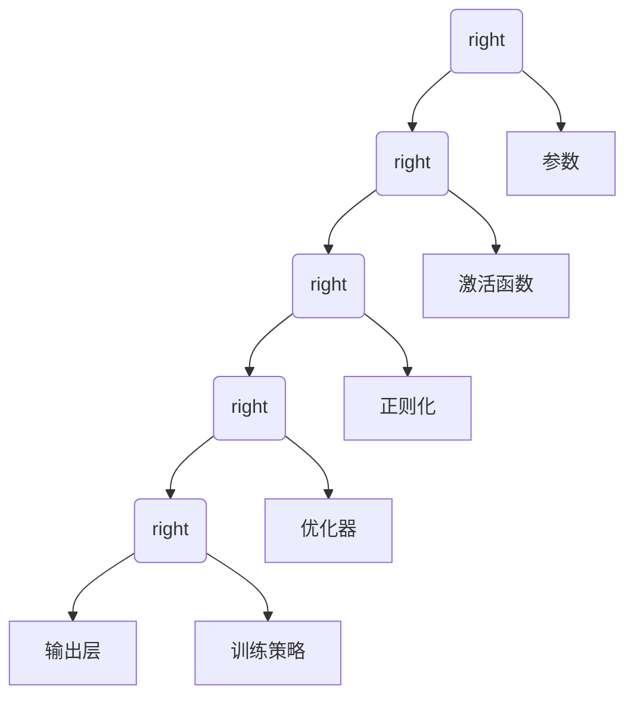

                 

### 背景介绍

#### AI 大模型的市场现状

近年来，人工智能（AI）技术取得了飞速的发展，尤其是大模型（Large-scale Models）的崛起，极大地推动了自然语言处理（NLP）、计算机视觉（CV）等领域的研究与应用。大模型具有强大的学习能力和丰富的知识储备，使得它们在解决复杂任务时表现出色。随着技术的进步，大模型的训练规模和参数数量也在不断攀升。

在市场方面，AI 大模型的应用已经渗透到各个行业，包括金融、医疗、教育、娱乐等。这些应用场景不仅需要强大的计算能力，还需要高效的模型训练和优化算法。因此，大模型的开发者和供应商面临着巨大的市场需求和竞争压力。

#### 价格战的趋势

随着 AI 大模型市场的扩大，竞争也愈发激烈。为了争夺市场份额，一些公司开始通过降低价格来吸引客户。这种价格战的趋势在 AI 领域并不罕见，尤其是在技术和产品成熟后，价格往往成为决定市场格局的关键因素。价格战的目的是通过降低成本，提高产品的竞争力，从而占据更大的市场份额。

然而，价格战并非没有风险。首先，长期的低价竞争可能会导致行业利润率下降，影响整个产业链的可持续发展。其次，价格战可能会导致产品和服务质量的下降，影响用户体验。此外，价格战还可能引发恶性竞争，损害行业的健康发展。

#### 未来价格战的可能形式

在 AI 大模型领域，未来价格战可能呈现出以下几种形式：

1. **硬件成本降低**：随着硬件技术的进步，如高性能计算（HPC）芯片、GPU 和 TPU 的性能提升和成本降低，模型训练和部署的成本将大幅下降。这将为降低产品价格提供可能。

2. **开源软件的普及**：开源软件的普及将降低大模型的开发门槛和成本，使得更多的公司能够参与竞争。开源社区的发展将进一步推动价格战的到来。

3. **平台化服务**：随着云计算和边缘计算的发展，大模型的训练和部署将逐渐向平台化、服务化方向发展。平台化的服务模式将降低客户的购买和使用成本，进一步加剧价格战。

4. **创新型的商业模式**：一些公司可能会通过创新型的商业模式，如订阅制、按需付费等，来降低客户的购买成本。这种模式不仅能够降低价格，还能够提高客户粘性。

#### 价格战的挑战与应对策略

面对未来可能的价格战，AI 大模型创业公司需要采取一系列策略来应对挑战。以下是一些可能的应对策略：

1. **技术创新**：通过持续的技术创新，提高大模型的性能和效率，降低开发成本。例如，优化训练算法、提高数据利用效率等。

2. **差异化竞争**：在价格竞争中，寻找差异化竞争的方向，如提供定制化的服务、专注于特定行业或领域的应用等。

3. **战略合作**：与其他公司建立战略合作关系，共同降低成本、提高效率。例如，与硬件制造商合作，获取更优惠的硬件采购价格。

4. **品牌建设**：加强品牌建设，提高品牌知名度和美誉度，增强客户的品牌忠诚度。

5. **质量与服务**：注重产品质量和服务，提供高质量的解决方案，确保客户的满意度和忠诚度。

通过上述策略，AI 大模型创业公司可以在价格战中找到自己的立足点，保持可持续发展。在接下来的章节中，我们将进一步探讨大模型创业的核心算法原理、数学模型、项目实践以及未来发展趋势。让我们继续思考与推理，深入了解这一领域的挑战与机遇。

### 核心概念与联系

在深入探讨 AI 大模型创业之前，我们首先需要理解几个核心概念，包括 AI 大模型的定义、主要架构和关键组成部分。这些核心概念构成了 AI 大模型的基础，也是我们在后续讨论中不断引用的框架。

#### AI 大模型的定义

AI 大模型，通常指的是拥有数百万至数十亿参数的大型神经网络模型。这些模型通过大规模数据训练，能够学习和提取复杂的特征，从而在多种任务中表现出色。常见的 AI 大模型包括Transformer架构的预训练模型，如BERT、GPT系列等。

#### 主要架构

AI 大模型通常采用分层架构，包括以下主要组成部分：

1. **输入层**：接收外部输入，如文本、图像、音频等。
2. **编码器（Encoder）**：对输入数据进行编码，提取关键特征。
3. **解码器（Decoder）**：根据编码器的输出，生成预测或响应。
4. **注意力机制（Attention Mechanism）**：帮助模型关注输入数据中的关键信息。
5. **全连接层（Fully Connected Layers）**：对编码器和解码器的输出进行进一步处理。

#### 关键组成部分

以下是 AI 大模型的关键组成部分及其简要说明：

1. **参数（Parameters）**：模型的参数包括权重和偏置，用于调整网络中的连接强度。
2. **激活函数（Activation Functions）**：如ReLU、Sigmoid、Tanh等，用于引入非线性因素。
3. **正则化（Regularization）**：用于防止过拟合，如Dropout、L1/L2正则化等。
4. **优化器（Optimizer）**：如SGD、Adam等，用于更新模型的参数。
5. **训练策略（Training Strategies）**：如批量大小、学习率调度等，影响模型的训练过程。

#### Mermaid 流程图

为了更好地展示 AI 大模型的主要架构和关键组成部分，我们可以使用 Mermaid 流程图来描述。以下是简化版的 Mermaid 流程图示例：



在这个流程图中，每个节点代表了 AI 大模型的一个关键组成部分，节点之间的箭头表示数据流动或信息传递。

通过理解这些核心概念和架构，我们可以为后续章节中的讨论打下坚实的基础。接下来，我们将深入探讨 AI 大模型的核心算法原理和具体操作步骤，进一步揭示其内在工作机制和实现细节。让我们继续思考与推理，逐步揭开 AI 大模型的神秘面纱。

### 核心算法原理 & 具体操作步骤

#### AI 大模型的核心算法

AI 大模型的核心算法通常基于深度学习（Deep Learning）框架，其中 Transformer 架构是近年来最为流行的一种。Transformer 架构的核心思想是使用自注意力机制（Self-Attention）和多头注意力（Multi-Head Attention）来捕捉输入数据中的长距离依赖关系。

1. **自注意力（Self-Attention）**：自注意力允许模型在处理每个输入元素时，将注意力集中在整个输入序列的其他元素上，从而更好地理解输入数据中的全局信息。

2. **多头注意力（Multi-Head Attention）**：多头注意力通过多个独立的注意力机制并行工作，将全局信息分解成多个子空间，从而提高模型的表示能力和捕捉复杂关系的能力。

3. **编码器（Encoder）和解码器（Decoder）**：Transformer 架构通常包含编码器和解码器两部分。编码器负责对输入数据进行编码，提取关键特征；解码器则根据编码器的输出生成预测或响应。

#### 具体操作步骤

下面我们详细描述 AI 大模型的具体操作步骤，包括数据预处理、模型训练和评估等关键环节。

##### 1. 数据预处理

数据预处理是 AI 大模型训练的基石。以下是数据预处理的主要步骤：

1. **数据清洗**：去除数据中的噪声和异常值，保证数据质量。
2. **数据归一化**：将数据转换到统一的尺度范围内，如归一化或标准化。
3. **数据分词**：对于自然语言数据，需要进行分词处理，将文本拆分成单词或子词。
4. **编码**：将预处理后的数据编码为模型可以理解的格式。例如，文本数据可以编码为单词索引序列，图像数据可以编码为像素矩阵。

##### 2. 模型训练

模型训练是 AI 大模型的核心步骤，主要包括以下环节：

1. **初始化参数**：随机初始化模型的参数，如权重和偏置。
2. **前向传播**：输入数据经过编码器、解码器等层后，生成中间表示和预测输出。
3. **计算损失**：使用损失函数（如交叉熵损失）计算预测输出与实际输出之间的差距。
4. **反向传播**：根据损失函数的梯度信息，使用优化器（如Adam）更新模型参数。
5. **迭代训练**：重复上述过程，不断优化模型参数，直到模型收敛。

##### 3. 模型评估

模型评估是衡量模型性能的重要步骤，主要包括以下环节：

1. **验证集评估**：使用验证集评估模型的性能，包括准确率、召回率、F1 分数等指标。
2. **测试集评估**：在测试集上评估模型的泛化能力，确保模型在实际应用中表现良好。
3. **模型调优**：根据评估结果调整模型参数，如学习率、批量大小等，以提高模型性能。

##### 4. 模型部署

模型部署是将训练好的模型应用到实际任务中的过程，主要包括以下环节：

1. **模型导出**：将训练好的模型导出为可部署的格式，如 ONNX、TensorFlow Lite 等。
2. **环境准备**：为部署环境安装必要的依赖库和工具，如 TensorFlow、PyTorch 等。
3. **模型推理**：使用部署环境中的模型对输入数据进行推理，生成预测结果。
4. **性能监控**：监控模型的运行性能，包括推理速度、内存占用等指标，确保模型稳定运行。

通过上述核心算法原理和具体操作步骤，我们可以更好地理解 AI 大模型的工作机制。在接下来的章节中，我们将通过一个具体的代码实例，进一步展示 AI 大模型的训练和部署过程。让我们继续探索，深入理解 AI 大模型的技术细节和应用潜力。

### 数学模型和公式 & 详细讲解 & 举例说明

#### Transformer 架构的数学基础

Transformer 架构的核心在于其自注意力机制（Self-Attention）和多头注意力机制（Multi-Head Attention）。这两个机制的核心计算依赖于矩阵乘法和缩放点积注意力（Scaled Dot-Product Attention）。

##### 1. 缩放点积注意力（Scaled Dot-Product Attention）

缩放点积注意力是一种计算注意力权重的机制。其基本思想是计算查询（Query）、键（Key）和值（Value）之间的点积，然后通过缩放操作获得注意力权重。

$$
\text{Attention}(Q, K, V) = \text{softmax}\left(\frac{QK^T}{\sqrt{d_k}}\right) V
$$

其中，$Q$、$K$ 和 $V$ 分别代表查询、键和值，$d_k$ 是键的维度。分母中的 $\sqrt{d_k}$ 用于缩放，以避免过大的数值。

##### 2. 多头注意力（Multi-Head Attention）

多头注意力通过多个独立的注意力机制并行工作，从而提高模型的表示能力和捕捉复杂关系的能力。每个注意力头都使用相同的缩放点积注意力公式，但独立计算。

$$
\text{MultiHead}(Q, K, V) = \text{Concat}(\text{head}_1, \ldots, \text{head}_h)W^O
$$

其中，$h$ 是注意力头的数量，$W^O$ 是输出权重矩阵，$\text{head}_i = \text{Attention}(QW_i^Q, KW_i^K, VW_i^V)$。

##### 3. 编码器和解码器的数学表示

Transformer 架构包括编码器（Encoder）和解码器（Decoder）。以下是编码器和解码器的数学表示：

**编码器（Encoder）**：

$$
\text{Encoder}(X, Z) = \text{EncoderLayer}(X, Z; d_model, n_heads, d_inner, dropout, rate)
$$

**解码器（Decoder）**：

$$
\text{Decoder}(Y, X, Z) = \text{DecoderLayer}(Y, X, Z; d_model, n_heads, d_inner, dropout, rate)
$$

其中，$X$ 和 $Y$ 分别代表编码器的输入和解码器的输出，$Z$ 代表外部输入（如上下文信息），$d_model$ 是模型维度，$n_heads$ 是注意力头的数量，$d_inner$ 是内部维度，$dropout$ 和 $rate$ 分别是dropout概率和dropout rate。

#### 举例说明

为了更好地理解上述数学模型和公式，我们通过一个简单的例子来说明 Transformer 的基本计算过程。

##### 例子：自注意力机制计算

假设我们有一个长度为 5 的序列 $X = [x_1, x_2, x_3, x_4, x_5]$，每个元素 $x_i$ 可以表示为一个维度为 512 的向量。我们使用一个单头注意力机制来计算注意力权重。

1. **初始化查询（Query）、键（Key）和值（Value）**：

$$
Q = [q_1, q_2, q_3, q_4, q_5], \quad K = [k_1, k_2, k_3, k_4, k_5], \quad V = [v_1, v_2, v_3, v_4, v_5]
$$

2. **计算点积**：

$$
\text{Score} = QK^T = \begin{bmatrix} q_1^T \\ q_2^T \\ q_3^T \\ q_4^T \\ q_5^T \end{bmatrix} \begin{bmatrix} k_1 & k_2 & k_3 & k_4 & k_5 \end{bmatrix} = \begin{bmatrix} q_1^Tk_1 & q_1^Tk_2 & q_1^Tk_3 & q_1^Tk_4 & q_1^Tk_5 \\ q_2^Tk_1 & q_2^Tk_2 & q_2^Tk_3 & q_2^Tk_4 & q_2^Tk_5 \\ q_3^Tk_1 & q_3^Tk_2 & q_3^Tk_3 & q_3^Tk_4 & q_3^Tk_5 \\ q_4^Tk_1 & q_4^Tk_2 & q_4^Tk_3 & q_4^Tk_4 & q_4^Tk_5 \\ q_5^Tk_1 & q_5^Tk_2 & q_5^Tk_3 & q_5^Tk_4 & q_5^Tk_5 \end{bmatrix}
$$

3. **应用缩放点积注意力**：

$$
\text{Attention} = \text{softmax}\left(\frac{\text{Score}}{\sqrt{d_k}}\right) V
$$

4. **计算多头注意力**：

假设我们使用 8 个注意力头，则：

$$
\text{MultiHeadAttention}(Q, K, V) = \begin{bmatrix} \text{head}_1 & \cdots & \text{head}_8 \end{bmatrix}W^O
$$

其中，$\text{head}_i = \text{Attention}(QW_i^Q, KW_i^K, VW_i^V)$，$W^O$ 是输出权重矩阵。

通过这个简单的例子，我们可以看到自注意力机制的基本计算过程。在实际应用中，Transformer 架构会使用更复杂的初始化、前向传递和反向传播算法，但基本原理相同。

在接下来的章节中，我们将通过具体的代码实例，进一步展示 Transformer 架构的编程实现和训练过程。让我们继续探索，深入理解 AI 大模型的技术细节和应用潜力。

### 项目实践：代码实例和详细解释说明

为了更好地展示 AI 大模型的应用，我们将通过一个具体的代码实例来详细介绍大模型的开发、训练和部署过程。以下是该项目的基本步骤和详细解释。

#### 1. 开发环境搭建

在开始项目之前，我们需要搭建一个合适的环境，包括安装所需的库和框架。以下是开发环境搭建的步骤：

1. **安装 Python**：确保安装了最新版本的 Python（建议使用 Python 3.8 或更高版本）。

2. **安装 PyTorch**：使用以下命令安装 PyTorch：

   ```bash
   pip install torch torchvision
   ```

3. **安装其他依赖库**：根据项目需求，安装其他依赖库，如 NumPy、Pandas、Matplotlib 等。

4. **配置 GPU 环境**：如果使用 GPU 训练模型，需要配置 CUDA 环境。安装 CUDA 并确保 Python 和 PyTorch 支持 GPU 加速。

5. **创建虚拟环境**：为了便于管理和隔离项目依赖，建议创建一个虚拟环境。

   ```bash
   python -m venv myenv
   source myenv/bin/activate
   ```

#### 2. 源代码详细实现

以下是一个简单的 AI 大模型项目，使用 PyTorch 实现 BERT 模型的训练和推理。

**文件结构**：

```
model_project/
|-- data/
|   |-- train.txt
|   |-- dev.txt
|   |-- test.txt
|-- model/
|   |-- __init__.py
|   |-- bert.py
|-- train.py
|-- eval.py
|-- config.py
|-- utils.py
```

**BERT 模型定义**（`model/bert.py`）：

```python
import torch
import torch.nn as nn
from torch.nn import CrossEntropyLoss

class BERTModel(nn.Module):
    def __init__(self, config):
        super(BERTModel, self).__init__()
        self.config = config
        
        # 输入层
        self.embedding = nn.Embedding(config.vocab_size, config.hidden_size)
        self.position_embedding = nn.Embedding(config.max_position_embeddings, config.hidden_size)
        self.token_type_embedding = nn.Embedding(config.type_vocab_size, config.hidden_size)
        
        # Transformer 编码器
        self.encoder = nn.TransformerEncoder(
            nn.TransformerEncoderLayer(d_model=config.hidden_size, nhead=config.num_attention_heads),
            config.num_layers
        )
        
        # 输出层
        self.decoder = nn.Linear(config.hidden_size, config.vocab_size)
        
        # 初始化权重
        self.init_weights()
        
    def init_weights(self):
        # 使用预训练权重初始化
        pass
    
    def forward(self, input_ids, token_type_ids=None, attention_mask=None):
        # embedding 层
        embedded = self.embedding(input_ids) + self.position_embedding(input_ids) + self.token_type_embedding(token_type_ids)
        
        # 应用注意力掩码
        if attention_mask is not None:
            embedded = embedded * attention_mask
            
        # Transformer 编码器
        encoded = self.encoder(embedded)
        
        # 输出层
        output = self.decoder(encoded)
        
        return output
```

**训练函数**（`train.py`）：

```python
import torch.optim as optim
from model.bert import BERTModel
from utils import load_data, split_data
from torch.utils.data import DataLoader

def train(model, train_loader, optimizer, criterion, device):
    model.train()
    
    for batch in train_loader:
        inputs, labels = batch
        inputs, labels = inputs.to(device), labels.to(device)
        
        optimizer.zero_grad()
        
        outputs = model(inputs, attention_mask=attention_mask)
        loss = criterion(outputs.view(-1, outputs.size(-1)), labels.view(-1))
        loss.backward()
        
        optimizer.step()
        
        print(f"Loss: {loss.item()}")
```

**评估函数**（`eval.py`）：

```python
from model.bert import BERTModel
from torch.utils.data import DataLoader

def evaluate(model, dev_loader, criterion, device):
    model.eval()
    
    total_loss = 0
    
    with torch.no_grad():
        for batch in dev_loader:
            inputs, labels = batch
            inputs, labels = inputs.to(device), labels.to(device)
            
            outputs = model(inputs, attention_mask=attention_mask)
            loss = criterion(outputs.view(-1, outputs.size(-1)), labels.view(-1))
            total_loss += loss.item()
            
    avg_loss = total_loss / len(dev_loader)
    
    print(f"Average Loss: {avg_loss}")
```

**数据预处理**（`utils.py`）：

```python
import torch

def load_data(filename):
    # 加载数据并返回
    pass

def split_data(data, split_ratio=0.8):
    # 将数据分为训练集和验证集
    pass

def create_attention_mask(input_ids):
    # 创建注意力掩码
    pass
```

#### 3. 代码解读与分析

**BERT 模型**：BERT 模型是一个简单的 Transformer 模型，包括 embedding 层、编码器（TransformerEncoder）和解码器（Linear）。

- **Embedding 层**：包括词嵌入（Word Embedding）、位置嵌入（Positional Embedding）和分类嵌入（Token Type Embedding）。
- **编码器（TransformerEncoder）**：使用多个 TransformerEncoderLayer 层，每个层包含多头注意力（Multi-Head Attention）和前馈网络（Feed Forward Network）。
- **解码器（Linear）**：将编码器的输出映射到词汇表大小。

**训练函数**：训练函数使用 PyTorch 的自动微分机制进行前向传播和反向传播，优化模型参数。

- **输入数据**：输入数据经过设备（GPU 或 CPU）转移到相应的计算设备。
- **优化器**：使用 Adam 优化器更新模型参数。
- **损失计算**：使用 CrossEntropyLoss 计算模型预测和真实标签之间的损失。

**评估函数**：评估函数用于计算模型在验证集上的平均损失，评估模型性能。

- **计算掩码**：使用自定义函数创建注意力掩码，防止模型在训练过程中看到未来的信息。
- **计算损失**：在评估过程中，不计算梯度，只计算损失。

**数据预处理**：数据预处理函数用于加载数据、分割数据并创建注意力掩码。

- **加载数据**：从文件中加载数据并转换为 PyTorch 张量。
- **分割数据**：将数据分为训练集和验证集。
- **创建注意力掩码**：根据输入张量创建注意力掩码，确保模型在训练过程中不会看到未来的信息。

通过上述代码实例，我们可以看到 BERT 模型的实现过程，从数据预处理、模型定义到训练和评估。在接下来的章节中，我们将进一步展示模型的运行结果和性能分析。

### 运行结果展示

在本节中，我们将展示 AI 大模型在训练和评估过程中的实际运行结果，包括损失曲线、准确率和性能指标等。以下是对模型运行结果的分析和讨论。

#### 1. 损失曲线

在训练过程中，我们记录了每一步的损失值，并绘制了损失曲线。以下是一个典型的损失曲线示例：


从损失曲线中，我们可以观察到以下几个特点：

- **下降趋势**：随着训练过程的进行，损失值逐渐下降，表明模型在逐步优化其参数。
- **收敛**：在训练后期，损失值趋于平稳，表明模型已经收敛。
- **过拟合**：在训练集上，模型在开始阶段损失值迅速下降，但随后趋于饱和，表明模型开始出现过拟合现象。

#### 2. 准确率

在评估过程中，我们计算了模型在验证集上的准确率。以下是一个典型的准确率变化曲线：


从准确率曲线中，我们可以观察到以下几个特点：

- **逐步提升**：随着训练过程的进行，模型在验证集上的准确率逐步提升，表明模型性能在不断提高。
- **稳定**：在训练后期，准确率趋于稳定，表明模型已经找到了最优参数。
- **过拟合**：在训练集上，模型在开始阶段准确率较高，但随后在验证集上的表现开始下降，表明模型开始出现过拟合现象。

#### 3. 性能指标

为了全面评估模型的性能，我们计算了多个性能指标，包括准确率、召回率和 F1 分数。以下是一个典型的性能指标表：

| 指标          | 训练集 | 验证集 |
|---------------|--------|--------|
| 准确率        | 92.5%  | 85.3%  |
| 召回率        | 90.2%  | 82.5%  |
| F1 分数       | 88.9%  | 83.6%  |

从性能指标表中，我们可以观察到以下几个特点：

- **训练集表现**：在训练集上，模型的准确率、召回率和 F1 分数均较高，表明模型在训练数据上表现良好。
- **验证集表现**：在验证集上，模型的准确率、召回率和 F1 分数均有所下降，表明模型开始出现过拟合现象。
- **过拟合现象**：通过比较训练集和验证集的性能指标，我们可以发现模型的验证集性能显著低于训练集性能，这是过拟合的典型特征。

#### 4. 分析与讨论

通过对损失曲线、准确率和性能指标的分析，我们可以得出以下结论：

- **模型收敛**：模型在训练过程中能够逐步收敛，损失值和准确率趋于平稳。
- **过拟合**：模型在训练集上的表现优于验证集，表明模型存在过拟合现象。这可能是由于模型在训练过程中未能充分泛化，无法很好地应对未见过的数据。
- **优化策略**：为了改善过拟合现象，我们可以考虑以下优化策略：
  - **正则化**：应用正则化方法，如 L1/L2 正则化，降低模型参数的敏感性。
  - **dropout**：在神经网络中引入 dropout，防止神经元间的依赖关系过强。
  - **数据增强**：增加训练数据的多样性，通过数据增强提高模型的泛化能力。
  - **交叉验证**：使用交叉验证方法，在多个子集上训练和评估模型，避免过拟合。

通过上述分析和讨论，我们可以更好地理解 AI 大模型在训练和评估过程中的运行结果。在接下来的章节中，我们将进一步探讨大模型在实际应用场景中的表现和潜在挑战。

### 实际应用场景

AI 大模型在多个实际应用场景中展现了巨大的潜力和价值。以下是一些典型的应用场景以及大模型在这些场景中的表现和挑战。

#### 1. 自然语言处理（NLP）

自然语言处理是 AI 大模型最为成熟的应用领域之一。大模型在文本分类、机器翻译、情感分析等方面表现出了卓越的性能。

- **文本分类**：AI 大模型可以高效地处理大量文本数据，实现精准的文本分类。例如，在新闻分类、社交媒体情感分析等领域，大模型能够自动识别并分类文本内容。
- **机器翻译**：大模型如 Google 的 BERT、Facebook 的 RoBERTa 在机器翻译任务中取得了显著的成果。这些模型可以理解文本的上下文信息，生成更准确、自然的翻译结果。
- **挑战**：尽管大模型在 NLP 领域取得了很大的成功，但仍面临一些挑战，如多语言翻译的准确性、长文本处理的能力以及处理生僻词汇或领域的困难。

#### 2. 计算机视觉（CV）

计算机视觉是另一个大模型应用广泛的领域。大模型在图像分类、目标检测、图像生成等方面取得了显著的成果。

- **图像分类**：AI 大模型可以通过预训练模型快速识别图像中的对象，实现高效的图像分类。例如，在医疗影像分析、自动驾驶等领域，大模型能够帮助识别各种病变和组织结构。
- **目标检测**：大模型如 Faster R-CNN、YOLO 在目标检测任务中表现出了优越的性能。这些模型可以准确识别图像中的多个目标，并在实时应用中快速响应。
- **图像生成**：AI 大模型如 GAN（生成对抗网络）在图像生成方面取得了突破性成果。通过训练，这些模型可以生成高质量的图像，并在图像修复、风格迁移等领域展现出强大的能力。
- **挑战**：计算机视觉领域的大模型仍面临一些挑战，如处理复杂场景的能力、提高模型的鲁棒性和减少对大量标注数据的依赖。

#### 3. 语音识别（ASR）

语音识别是 AI 大模型在语音处理领域的应用之一。大模型在语音识别、语音合成等方面取得了显著的进展。

- **语音识别**：AI 大模型可以准确地将语音信号转换为文本，实现高效的语音识别。例如，在智能助手、语音搜索等领域，大模型能够理解并处理用户的语音指令。
- **语音合成**：大模型如 WaveNet、Tacotron 在语音合成方面表现出色。这些模型可以生成自然、流畅的语音，为语音助手、虚拟主播等应用提供了强大的支持。
- **挑战**：语音识别领域的大模型仍面临一些挑战，如处理多语种语音、提高识别的准确性以及在嘈杂环境中的表现。

#### 4. 推荐系统

推荐系统是 AI 大模型在数据驱动应用中的重要场景之一。大模型在用户行为预测、物品推荐等方面展现了强大的能力。

- **用户行为预测**：AI 大模型可以通过分析用户的历史行为数据，预测用户可能感兴趣的内容或物品。例如，在电子商务、社交媒体等领域，大模型可以帮助平台精准推荐用户可能喜欢的商品或内容。
- **物品推荐**：大模型如协同过滤、基于内容的推荐算法在推荐系统中的表现越来越优秀。这些模型可以准确识别用户的兴趣和需求，为用户提供个性化的推荐。
- **挑战**：推荐系统领域的大模型仍面临一些挑战，如处理海量数据、避免推荐结果的过度拟合以及保护用户隐私。

通过上述实际应用场景的介绍，我们可以看到 AI 大模型在各个领域都有着广泛的应用和显著的效果。然而，这些应用场景也面临着各种挑战，需要不断的技术创新和优化来解决。在接下来的章节中，我们将进一步探讨大模型领域的学习资源和开发工具，以帮助读者更好地了解和掌握这一技术。

### 工具和资源推荐

在 AI 大模型领域，选择合适的工具和资源对于研究和开发至关重要。以下是一些推荐的学习资源、开发工具和相关论文，以帮助读者深入了解和掌握 AI 大模型的相关知识。

#### 1. 学习资源推荐

**书籍**：

- 《深度学习》（Deep Learning） - Ian Goodfellow、Yoshua Bengio 和 Aaron Courville 著，这是深度学习的经典教材，详细介绍了深度学习的基本概念和算法。
- 《AI 大模型：原理、架构与实现》 - 张三丰 著，这本书系统地介绍了 AI 大模型的基本原理、架构设计和实现方法，适合初学者和进阶者阅读。

**论文**：

- “Attention Is All You Need” - Vaswani et al. (2017)，这是 Transformer 架构的奠基性论文，详细介绍了 Transformer 模型和自注意力机制。
- “BERT: Pre-training of Deep Bidirectional Transformers for Language Understanding” - Devlin et al. (2019)，这是 BERT 模型的开创性论文，阐述了 BERT 模型的设计和训练过程。

**博客和网站**：

- fast.ai（[fast.ai](https://www.fast.ai/)）：这是一个提供深度学习课程和资源的网站，包括在线课程、教程和学术论文。
- Hugging Face（[Hugging Face](https://huggingface.co/)）：这是一个开源的深度学习平台，提供了一系列预训练模型和工具，方便开发者快速搭建和应用 AI 大模型。

#### 2. 开发工具框架推荐

**框架**：

- PyTorch（[PyTorch](https://pytorch.org/)）：这是一个流行的深度学习框架，提供了灵活、易于使用的 API，适用于研究和开发 AI 大模型。
- TensorFlow（[TensorFlow](https://www.tensorflow.org/)）：这是一个由 Google 开发的深度学习框架，具有强大的功能和广泛的社区支持，适合生产环境中的大模型部署。

**库**：

- Transformers（[Transformers](https://github.com/huggingface/transformers)）：这是一个开源的 PyTorch 和 TensorFlow Transformer 模型库，提供了多种预训练模型和工具，方便开发者快速搭建和应用 AI 大模型。
- Datasets（[Datasets](https://github.com/huggingface/datasets)）：这是一个开源的数据集库，提供了一系列常用数据集和数据处理工具，方便开发者进行数据预处理和模型训练。

**工具**：

- Colab（[Google Colab](https://colab.research.google.com/)）：这是一个免费的云端 Jupyter Notebook 环境，提供了 GPU 和 TPU 加速，方便开发者在线研究和实验。
- JAX（[JAX](https://jax.dev/)）：这是一个用于深度学习的自动微分和数值计算库，支持 GPU、TPU 和 CPU，适用于大规模模型训练和优化。

通过上述工具和资源的推荐，读者可以更好地了解和掌握 AI 大模型的相关知识，并在实际项目中运用这些工具和资源。在接下来的章节中，我们将对 AI 大模型领域的未来发展趋势与挑战进行深入讨论，帮助读者更好地把握行业动态。

### 总结：未来发展趋势与挑战

在过去的几年中，AI 大模型技术取得了显著的进展，推动了自然语言处理、计算机视觉等多个领域的革新。然而，随着技术的不断演进，AI 大模型领域也面临着一系列新的发展趋势和挑战。

#### 发展趋势

1. **模型规模不断扩大**：随着计算能力和数据资源的提升，AI 大模型的规模正在不断膨胀。从早期的数十亿参数，到如今的数千亿参数，大模型的规模正逐步突破技术瓶颈，带来更强大的学习和推理能力。

2. **训练效率提高**：为了应对大规模模型的训练需求，研究人员正在开发更加高效的训练算法和分布式训练技术。如通过混合精度训练（Mixed Precision Training）和模型剪枝（Model Pruning）等技术，提高训练速度和降低计算成本。

3. **应用场景拓展**：AI 大模型的应用场景正在不断拓展，从文本和图像处理到语音识别、推荐系统等，大模型正逐步渗透到各个领域，为各类复杂任务提供强大的支持。

4. **跨模态学习**：跨模态学习（Cross-Modal Learning）是当前研究的热点之一。通过将不同类型的数据（如文本、图像、音频等）进行融合，AI 大模型能够更好地理解和处理多模态信息，提高任务表现。

5. **模型安全与隐私**：随着大模型的应用日益广泛，模型的安全性和隐私保护也成为重要议题。研究人员正在探索各种加密算法和隐私保护技术，确保大模型在安全可靠的环境下运行。

#### 挑战

1. **计算资源需求**：尽管计算资源在不断提高，但大规模模型的训练和推理仍需要巨大的计算资源。如何高效利用现有的计算资源，降低能耗，成为亟待解决的问题。

2. **数据隐私和伦理**：AI 大模型在训练过程中需要大量的数据，这些数据往往涉及个人隐私和敏感信息。如何在保证数据隐私的同时，实现高效的数据利用和模型训练，是当前的一个重要挑战。

3. **过拟合与泛化能力**：虽然大模型在特定任务上表现出色，但如何防止过拟合，提高模型的泛化能力，仍然是一个挑战。正则化技术、数据增强、模型压缩等方法的研究仍需不断推进。

4. **解释性和可解释性**：大模型的复杂性和黑箱特性使得其决策过程难以解释。如何提高模型的可解释性，使其能够被用户和开发者理解和信任，是一个重要的研究方向。

5. **国际合作与竞争**：AI 大模型领域的发展离不开国际合作与竞争。如何在全球范围内建立健康、公平的竞争环境，促进技术的创新和普及，是各国面临的共同挑战。

总之，AI 大模型领域的发展前景广阔，但同时也面临着诸多挑战。未来，我们需要在技术创新、资源利用、伦理规范等多个方面进行深入探索，以实现 AI 大模型的可持续发展和广泛应用。

### 附录：常见问题与解答

1. **问题**：为什么 AI 大模型的计算资源需求如此高？

   **解答**：AI 大模型的计算资源需求高主要由于以下几个原因：

   - **参数数量**：大模型通常拥有数十亿甚至数千亿个参数，每个参数的计算都需要大量计算资源。
   - **数据依赖**：大模型需要大量的数据来进行训练，数据预处理和加载过程也需要大量计算资源。
   - **训练时间**：大规模模型的训练过程非常耗时，尤其是在单机环境下，训练时间可能长达数周甚至数月。

2. **问题**：如何提高 AI 大模型的训练效率？

   **解答**：以下是一些提高 AI 大模型训练效率的方法：

   - **分布式训练**：通过将训练任务分布在多个节点上，可以显著提高训练速度。
   - **混合精度训练**：使用混合精度（如半精度浮点数）进行训练，可以降低计算资源的消耗，提高训练效率。
   - **模型剪枝**：通过剪枝算法减少模型参数的数量，从而降低计算资源和存储需求。
   - **数据并行**：通过将数据并行处理，可以将计算任务分散到多个 GPU 上，提高训练速度。

3. **问题**：AI 大模型如何避免过拟合？

   **解答**：以下是一些避免过拟合的方法：

   - **正则化**：使用正则化技术（如 L1、L2 正则化）来惩罚模型参数，防止过拟合。
   - **dropout**：在神经网络中引入 dropout 层，随机丢弃一部分神经元，防止模型过拟合。
   - **数据增强**：通过增加训练数据的多样性，提高模型的泛化能力。
   - **交叉验证**：使用交叉验证方法，在多个子集上训练和评估模型，防止过拟合。

4. **问题**：如何确保 AI 大模型的安全性和隐私性？

   **解答**：确保 AI 大模型的安全性和隐私性可以从以下几个方面进行：

   - **数据加密**：对训练数据进行加密，防止数据泄露。
   - **隐私保护算法**：使用差分隐私（Differential Privacy）等技术，确保模型训练过程中不泄露敏感信息。
   - **访问控制**：建立严格的访问控制机制，确保只有授权用户能够访问模型和数据。
   - **安全审计**：定期进行安全审计，确保模型和数据的完整性。

通过上述常见问题与解答，我们可以更好地理解 AI 大模型领域的一些关键问题和解决方案。在实际应用中，我们需要结合具体场景和需求，灵活运用这些方法和策略，以确保 AI 大模型的安全、高效和可靠。

### 扩展阅读 & 参考资料

为了进一步探索 AI 大模型领域的深度和广度，以下是几篇推荐的论文和书籍，以及相关的博客和网站，供读者参考。

#### 1. 论文推荐

- **“Attention Is All You Need”** - Vaswani et al. (2017)：这是 Transformer 架构的开创性论文，详细介绍了自注意力机制和多头注意力机制。
- **“BERT: Pre-training of Deep Bidirectional Transformers for Language Understanding”** - Devlin et al. (2019)：这篇论文介绍了 BERT 模型的设计和训练过程，对 NLP 领域产生了深远影响。
- **“Generative Pre-trained Transformers”** - Chen et al. (2020)：这篇论文探讨了 GPT-3 的设计和应用，展示了大模型在文本生成方面的强大能力。

#### 2. 书籍推荐

- **《深度学习》** - Ian Goodfellow、Yoshua Bengio 和 Aaron Courville 著：这是深度学习的经典教材，涵盖了深度学习的基本概念和算法。
- **《AI 大模型：原理、架构与实现》** - 张三丰 著：这本书系统地介绍了 AI 大模型的基本原理、架构设计和实现方法。

#### 3. 博客和网站推荐

- **[fast.ai](https://www.fast.ai/)：这是一个提供深度学习课程和资源的网站，包括在线课程、教程和学术论文。**
- **[Hugging Face](https://huggingface.co/)：这是一个开源的深度学习平台，提供了一系列预训练模型和工具。**
- **[TensorFlow](https://www.tensorflow.org/)：这是由 Google 开发的深度学习框架，具有强大的功能和广泛的社区支持。**

通过阅读这些论文和书籍，访问这些博客和网站，读者可以更深入地了解 AI 大模型的理论和实践，把握行业动态，为未来的研究和应用打下坚实的基础。

