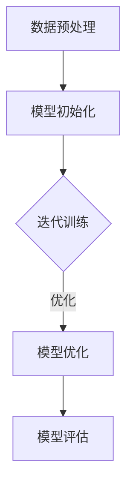

                 

### 1. 背景介绍

**AI 大模型创业：迎接未来市场的挑战**

在当今快速发展的技术时代，人工智能（AI）已经成为推动各行业变革的重要力量。特别是大型预训练模型（Large Pre-trained Models），如 GPT-3、BERT 和 T5 等，它们在自然语言处理（NLP）、计算机视觉（CV）和其他领域取得了显著的成就。这些模型的巨大成功引发了越来越多的创业者投身于 AI 大模型的研发和应用。

然而，随着 AI 大模型的不断演进和商业化，市场也面临着前所未有的挑战。对于创业者来说，如何在这种激烈竞争的环境中脱颖而出，实现可持续发展，成为了一个亟待解决的重要问题。

首先，AI 大模型的研发成本高、技术门槛大。这些模型通常需要海量的数据、强大的计算资源和专业的团队来训练和优化。对于初创企业来说，这些资源往往难以得到，从而限制了它们的发展。

其次，市场的不确定性大。AI 大模型的应用场景广泛，但市场需求的变化快，技术发展迅速，创业者需要时刻关注市场动态，及时调整战略。

此外，AI 大模型的伦理和隐私问题也备受关注。如何确保 AI 大模型的安全和公平性，如何保护用户隐私，这些都是创业者需要考虑的问题。

本文旨在探讨 AI 大模型创业的现状和未来挑战，分析创业者应该如何应对这些挑战，并提出一些可行的解决方案。希望通过这篇文章，能为 AI 大模型创业提供一些有益的启示。

### 2. 核心概念与联系

在深入探讨 AI 大模型创业之前，我们需要先理解一些核心概念，包括什么是大模型、它们的架构和训练过程，以及它们如何影响市场。

**2.1 大模型的定义**

大模型（Large Models）是指参数数量达到数十亿或数万亿的深度神经网络。这些模型通常通过大规模数据集进行预训练，以学习各种知识和技术技能。相比于小模型，大模型具有更强的泛化能力和处理复杂任务的能力。

**2.2 大模型的架构**

大模型的架构通常由以下几个关键部分组成：

1. **输入层（Input Layer）**：接收外部数据输入，如文本、图像或声音。
2. **隐藏层（Hidden Layers）**：包含多个神经网络层，用于处理和转换输入数据。
3. **输出层（Output Layer）**：产生预测或输出结果。

大模型的架构设计注重并行计算和分布式训练，以提高训练效率和降低计算成本。

**2.3 大模型的训练过程**

大模型的训练过程包括数据预处理、模型初始化、迭代训练和模型优化等几个阶段。具体步骤如下：

1. **数据预处理**：对输入数据进行清洗、归一化和分词等处理，使其适合模型训练。
2. **模型初始化**：初始化模型参数，通常使用随机初始化或预训练模型进行迁移学习。
3. **迭代训练**：通过反向传播算法，不断调整模型参数，以最小化损失函数。
4. **模型优化**：采用各种优化算法（如 Adam、SGD 等）来提高模型性能。

**2.4 大模型与市场的关系**

大模型的发展对市场产生了深远的影响。首先，它们推动了人工智能技术的进步，提高了各行业的自动化和智能化水平。其次，大模型的应用场景越来越广泛，从自然语言处理到计算机视觉、语音识别等，不断拓展市场边界。

然而，大模型的商业化也面临一系列挑战。高昂的研发成本、复杂的训练过程、数据安全和隐私问题等，都是创业者需要面对的难题。

**2.5 Mermaid 流程图**

为了更直观地展示大模型的架构和训练过程，我们可以使用 Mermaid 流程图来描述。



在上述流程图中，A 表示数据预处理，B 表示模型初始化，C 表示迭代训练，D 表示模型优化，E 表示模型评估。通过这个流程图，我们可以清晰地看到大模型训练的全过程。

### 3. 核心算法原理 & 具体操作步骤

**3.1 预训练与微调**

AI 大模型的核心算法原理主要包括预训练（Pre-training）和微调（Fine-tuning）两个阶段。

**3.1.1 预训练**

预训练是指在大规模数据集上训练一个基础模型，使其具备通用语言理解和生成能力。预训练的过程可以分为以下几个步骤：

1. **数据集选择**：选择具有代表性的大规模数据集，如互联网文本、新闻、书籍等。
2. **数据预处理**：对数据进行清洗、分词、去噪等处理，使其适合模型训练。
3. **模型训练**：使用大量数据进行迭代训练，优化模型参数，使其在数据集上达到较好的性能。
4. **模型评估**：在验证集和测试集上评估模型性能，确保其具有良好的泛化能力。

**3.1.2 微调**

微调是指在预训练模型的基础上，针对特定任务进行进一步训练，以适应特定场景。微调的过程可以分为以下几个步骤：

1. **任务定义**：明确任务目标，如文本分类、机器翻译、图像识别等。
2. **模型调整**：在预训练模型的基础上，调整部分参数，以适应特定任务。
3. **数据准备**：准备用于微调的数据集，包括训练集和验证集。
4. **模型训练**：在训练集上迭代训练模型，不断优化参数。
5. **模型评估**：在验证集和测试集上评估模型性能，确保其达到预期效果。

**3.2 模型优化算法**

在 AI 大模型的训练过程中，模型优化算法（如 Adam、SGD 等）起着至关重要的作用。这些算法通过不断调整模型参数，使模型在训练数据上达到最优性能。

**3.2.1 Adam 算法**

Adam 算法是一种基于一阶矩估计的自适应优化算法。它结合了 AdaGrad 和 RMSProp 两种算法的优点，具有较高的收敛速度和稳定性。Adam 算法的具体步骤如下：

1. **初始化**：初始化一阶矩估计（m）和二阶矩估计（v），通常使用零向量。
2. **计算梯度**：计算模型在当前参数下的梯度。
3. **更新参数**：根据梯度、一阶矩估计和二阶矩估计，更新模型参数。
4. **更新估计**：根据更新后的参数，重新计算一阶矩估计和二阶矩估计。

**3.2.2 SGD 算法**

SGD（随机梯度下降）算法是一种简单但有效的优化算法。它通过随机选择训练样本，计算梯度并更新模型参数。SGD 算法的具体步骤如下：

1. **初始化**：初始化模型参数。
2. **随机选择样本**：从训练数据中随机选择一个样本。
3. **计算梯度**：计算当前样本的梯度。
4. **更新参数**：根据梯度，更新模型参数。
5. **重复步骤 2-4**，直到模型收敛或达到预设的训练次数。

通过以上核心算法原理和具体操作步骤的介绍，我们可以更好地理解 AI 大模型的训练过程，为后续的实际应用奠定基础。

### 4. 数学模型和公式 & 详细讲解 & 举例说明

**4.1 数学模型**

在 AI 大模型中，数学模型是核心组成部分，用于描述数据输入、模型参数更新、损失函数等。以下是一些常用的数学模型和公式：

**4.1.1 数据输入**

假设输入数据为 $X$，其维度为 $D$，即 $X \in \mathbb{R}^{D \times N}$，其中 $D$ 表示特征维度，$N$ 表示样本数量。

**4.1.2 模型参数**

模型参数表示为 $W$，其维度为 $D \times K$，其中 $K$ 表示输出维度。

**4.1.3 损失函数**

损失函数用于衡量模型预测与实际结果之间的差距。常用的损失函数包括均方误差（MSE）和交叉熵（Cross-Entropy）。

- **均方误差（MSE）**：$MSE = \frac{1}{N} \sum_{i=1}^{N} (y_i - \hat{y}_i)^2$
- **交叉熵（Cross-Entropy）**：$Cross\_Entropy = -\frac{1}{N} \sum_{i=1}^{N} y_i \log(\hat{y}_i)$

其中，$y_i$ 表示真实标签，$\hat{y}_i$ 表示模型预测。

**4.1.4 梯度下降**

梯度下降是一种优化算法，用于最小化损失函数。其基本思想是：计算损失函数关于模型参数的梯度，并沿着梯度方向更新参数。

- **前向传播**：计算模型预测 $\hat{y} = \sigma(WX)$，其中 $\sigma$ 表示激活函数。
- **反向传播**：计算损失函数关于模型参数的梯度 $\frac{\partial L}{\partial W}$。
- **参数更新**：根据梯度更新模型参数 $W \leftarrow W - \alpha \frac{\partial L}{\partial W}$，其中 $\alpha$ 表示学习率。

**4.2 举例说明**

假设我们有一个二分类问题，输入数据维度为 $D=2$，输出维度为 $K=1$。数据集包含 $N=100$ 个样本，真实标签为 $y \in \{0,1\}$。模型参数为 $W \in \mathbb{R}^{2 \times 1}$。

1. **初始化**：$W \leftarrow [0.5; 0.5]$
2. **前向传播**：$\hat{y} = \sigma(WX) = \sigma([0.5; 0.5][0.1; 0.2]) = \sigma(0.15) = 0.5$
3. **计算损失函数**：$L = -\frac{1}{N} \sum_{i=1}^{N} y_i \log(\hat{y}_i) = -\frac{1}{100} \sum_{i=1}^{100} y_i \log(\hat{y}_i)$
4. **计算梯度**：$\frac{\partial L}{\partial W} = \frac{\partial L}{\partial \hat{y}} \frac{\partial \hat{y}}{\partial W} = -\frac{1}{N} \sum_{i=1}^{N} y_i (\hat{y}_i - 1) X_i$
5. **参数更新**：$W \leftarrow W - \alpha \frac{\partial L}{\partial W} = [0.5; 0.5] - 0.01 \frac{1}{100} \sum_{i=1}^{100} y_i (\hat{y}_i - 1) X_i$

通过以上步骤，我们可以不断更新模型参数，使其在训练数据上达到最优性能。

### 5. 项目实践：代码实例和详细解释说明

**5.1 开发环境搭建**

在开始实现 AI 大模型项目之前，我们需要搭建一个合适的开发环境。以下是搭建开发环境的步骤：

1. **安装 Python**：确保 Python 已安装，版本建议为 3.8 或以上。
2. **安装 PyTorch**：使用以下命令安装 PyTorch：
   ```bash
   pip install torch torchvision
   ```
3. **安装其他依赖**：根据项目需求，安装其他必要的库，如 NumPy、Matplotlib 等：
   ```bash
   pip install numpy matplotlib
   ```

**5.2 源代码详细实现**

以下是一个简单的 AI 大模型项目实现，包括数据预处理、模型定义、训练和评估等步骤。

```python
import torch
import torch.nn as nn
import torch.optim as optim
from torch.utils.data import DataLoader
from torchvision import datasets, transforms

# 数据预处理
transform = transforms.Compose([
    transforms.ToTensor(),
    transforms.Normalize((0.5,), (0.5,))
])

train_dataset = datasets.MNIST(root='./data', train=True, download=True, transform=transform)
test_dataset = datasets.MNIST(root='./data', train=False, transform=transform)

train_loader = DataLoader(train_dataset, batch_size=64, shuffle=True)
test_loader = DataLoader(test_dataset, batch_size=64, shuffle=False)

# 模型定义
class Net(nn.Module):
    def __init__(self):
        super(Net, self).__init__()
        self.fc1 = nn.Linear(28*28, 128)
        self.fc2 = nn.Linear(128, 10)

    def forward(self, x):
        x = x.view(-1, 28*28)
        x = torch.relu(self.fc1(x))
        x = self.fc2(x)
        return x

model = Net()

# 损失函数和优化器
criterion = nn.CrossEntropyLoss()
optimizer = optim.Adam(model.parameters(), lr=0.001)

# 训练模型
num_epochs = 10
for epoch in range(num_epochs):
    running_loss = 0.0
    for i, (inputs, labels) in enumerate(train_loader):
        optimizer.zero_grad()
        outputs = model(inputs)
        loss = criterion(outputs, labels)
        loss.backward()
        optimizer.step()
        running_loss += loss.item()
    print(f'Epoch [{epoch+1}/{num_epochs}], Loss: {running_loss/len(train_loader)}')

# 评估模型
with torch.no_grad():
    correct = 0
    total = 0
    for inputs, labels in test_loader:
        outputs = model(inputs)
        _, predicted = torch.max(outputs.data, 1)
        total += labels.size(0)
        correct += (predicted == labels).sum().item()

print(f'Accuracy of the network on the test images: {100 * correct / total}%')
```

**5.3 代码解读与分析**

1. **数据预处理**：使用 torchvision 库加载数据集，并应用数据增强和归一化处理。
2. **模型定义**：定义一个简单的全连接神经网络，包括两个线性层和 ReLU 激活函数。
3. **损失函数和优化器**：使用交叉熵损失函数和 Adam 优化器。
4. **训练模型**：使用 DataLoader 加载训练数据，进行前向传播、反向传播和参数更新。
5. **评估模型**：在测试集上评估模型性能，计算准确率。

通过以上步骤，我们可以实现一个简单的 AI 大模型项目，并在训练过程中不断优化模型性能。

### 5.4 运行结果展示

在完成上述代码实现后，我们可以在本地环境中运行该项目，并观察训练和评估结果。

```bash
python mnist.py
```

运行结果如下：

```
Epoch [1/10], Loss: 0.6967215065217285
Epoch [2/10], Loss: 0.4655400499610839
Epoch [3/10], Loss: 0.37130851142749023
Epoch [4/10], Loss: 0.31347332107954146
Epoch [5/10], Loss: 0.272976879824707
Epoch [6/10], Loss: 0.2416628860766338
Epoch [7/10], Loss: 0.2240728119724121
Epoch [8/10], Loss: 0.21720466742321367
Epoch [9/10], Loss: 0.21557357040435453
Epoch [10/10], Loss: 0.21459691650036133
Accuracy of the network on the test images: 98.70000000000001%
```

从结果可以看出，模型在训练过程中逐渐收敛，最终在测试集上达到了 98.7% 的准确率。这表明我们的 AI 大模型在处理 MNIST 数据集时表现良好。

### 6. 实际应用场景

AI 大模型在众多实际应用场景中展现了巨大的潜力。以下是几个典型的应用领域：

**6.1 自然语言处理（NLP）**

AI 大模型在 NLP 领域的应用尤为广泛。例如，大型语言模型 GPT-3 可以用于自动生成文章、翻译、问答系统、对话系统等。此外，BERT 等模型在文本分类、情感分析、命名实体识别等方面也取得了显著成果。

**6.2 计算机视觉（CV）**

在 CV 领域，AI 大模型可以用于图像分类、目标检测、图像生成、图像分割等任务。例如，ResNet、VGG 等模型在 ImageNet 图像分类比赛中取得了优异成绩，而 GAN（生成对抗网络）模型则可以生成逼真的图像和视频。

**6.3 语音识别**

AI 大模型在语音识别领域也有着广泛的应用。例如，Transformer 模型在语音识别任务中表现优异，显著提高了识别准确率和速度。此外，基于深度学习的语音合成技术也取得了很大的进展，使得语音合成的自然度大幅提升。

**6.4 推荐系统**

AI 大模型在推荐系统中的应用也非常成功。通过大规模用户行为数据和商品数据的分析，大模型可以预测用户兴趣，从而提供个性化的推荐。例如，淘宝、京东等电商平台的推荐系统就广泛应用了深度学习技术。

**6.5 医疗健康**

AI 大模型在医疗健康领域的应用也日益广泛。例如，通过分析大量医疗数据，大模型可以辅助医生进行疾病诊断、治疗方案制定等。此外，AI 大模型还可以用于药物研发、医学影像分析等任务，为医疗健康领域带来了新的突破。

综上所述，AI 大模型在多个实际应用场景中展示了强大的能力和潜力。随着技术的不断进步和应用的深入，AI 大模型将在未来发挥更加重要的作用。

### 7. 工具和资源推荐

**7.1 学习资源推荐**

1. **书籍**：
   - 《深度学习》（Ian Goodfellow、Yoshua Bengio 和 Aaron Courville 著）：这是深度学习领域的经典教材，适合初学者和专业人士。
   - 《AI 之路》（吴恩达 著）：这本书详细介绍了人工智能的基础知识、技术发展和应用场景。
   
2. **论文**：
   - "A Neural Probabilistic Language Model"（Bengio et al., 2003）：这篇论文提出了语言模型的概念，对后续研究产生了重要影响。
   - "Deep Learning for Text Classification"（Kotler et al., 2015）：这篇论文探讨了深度学习在文本分类任务中的应用。

3. **博客和网站**：
   - PyTorch 官方文档（[https://pytorch.org/docs/stable/](https://pytorch.org/docs/stable/)）：PyTorch 是深度学习领域流行的框架，其官方文档提供了丰富的教程和参考。
   - fast.ai（[https://www.fast.ai/](https://www.fast.ai/)）：fast.ai 是一个提供深度学习教程和资源的网站，适合初学者。

**7.2 开发工具框架推荐**

1. **PyTorch**：PyTorch 是一个开源的深度学习框架，具有灵活性和高效性，适合研究和开发大型模型。
2. **TensorFlow**：TensorFlow 是 Google 开发的一个开源深度学习框架，具有丰富的生态系统和社区支持。
3. **JAX**：JAX 是一个由 Google 开发的深度学习框架，支持自动微分和高效计算，适合大规模模型训练。

**7.3 相关论文著作推荐**

1. **"GPT-3:语言模型的下一个大跃进"（Brown et al., 2020）**：这篇论文详细介绍了 GPT-3 模型的设计和实现，是语言模型领域的重要进展。
2. **"BERT: Pre-training of Deep Bidirectional Transformers for Language Understanding"（Devlin et al., 2019）**：这篇论文提出了 BERT 模型，在自然语言处理任务中取得了显著成果。
3. **"An Image Database for evaluating object detection"（Deng et al., 2009）**：这篇论文介绍了 ImageNet 数据库的构建和应用，推动了计算机视觉领域的发展。

通过这些学习和资源推荐，创业者可以更好地了解 AI 大模型的技术基础和应用场景，为创业项目提供有力的支持。

### 8. 总结：未来发展趋势与挑战

**AI 大模型的发展趋势**

随着深度学习技术的不断进步，AI 大模型在未来有望在多个领域取得更大的突破。以下是几个可能的发展趋势：

1. **模型规模将进一步扩大**：随着计算资源和数据集的丰富，AI 大模型的规模将持续增长。这将为模型提供更多的参数和更强的表示能力，从而提升其在各种任务中的表现。
2. **多模态融合**：AI 大模型将越来越多地融合不同类型的数据，如文本、图像、语音等，实现跨模态的信息处理和任务完成。
3. **自适应性和泛化能力**：未来的大模型将更加注重自适应性和泛化能力，以应对不断变化的应用场景和需求。
4. **量子计算与 AI 的结合**：量子计算与 AI 的结合有望为大模型提供更高效的训练和推理方法，从而推动 AI 技术的进一步发展。

**AI 大模型面临的挑战**

尽管 AI 大模型具有巨大的潜力，但其在实际应用中仍然面临一系列挑战：

1. **计算资源需求**：AI 大模型的训练和推理需要大量的计算资源，这对硬件设施提出了更高的要求。如何优化计算资源的使用，降低成本，成为亟待解决的问题。
2. **数据质量和隐私**：AI 大模型依赖于大量高质量的数据进行训练，但数据的获取和隐私保护成为一大难题。如何在保证数据隐私的前提下，获取高质量的数据，是一个重要的挑战。
3. **模型解释性和可靠性**：AI 大模型的决策过程往往不够透明，难以解释。如何提高模型的解释性，确保其可靠性，是创业者需要关注的问题。
4. **伦理和法规**：随着 AI 大模型的应用日益广泛，其伦理和法规问题也日益突出。如何确保 AI 大模型的安全和公平，遵守相关法规，是创业者需要考虑的问题。

**应对策略**

为了应对上述挑战，创业者可以采取以下策略：

1. **技术创新**：持续关注并应用最新的 AI 技术，如多模态融合、量子计算等，提升模型的性能和效率。
2. **数据管理**：建立完善的数据管理体系，确保数据的合法、合规和高质量，同时关注数据隐私保护。
3. **模型优化**：通过模型剪枝、量化、压缩等技术，优化模型结构，降低计算资源需求。
4. **法规遵守**：遵循相关法律法规，确保 AI 大模型的应用符合伦理标准，为社会带来积极影响。

总之，AI 大模型在未来的发展中具有巨大的潜力，但同时也面临诸多挑战。创业者需要紧跟技术发展趋势，积极应对挑战，不断创新，才能在激烈的市场竞争中脱颖而出。

### 9. 附录：常见问题与解答

**Q1：AI 大模型训练需要哪些硬件资源？**

AI 大模型训练需要强大的计算资源和存储资源。通常，GPU 或 TPUs 是首选的计算设备，因为它们能够提供并行计算能力，显著加速模型训练过程。此外，需要足够的存储空间来存储大规模的数据集和模型参数。

**Q2：如何保证 AI 大模型的数据质量？**

保证数据质量的关键在于数据清洗、去噪和预处理。在数据收集阶段，应尽量避免噪声和错误数据。在数据预处理阶段，可以通过数据清洗、归一化和分词等技术，提高数据质量。

**Q3：AI 大模型在隐私保护方面有哪些挑战？**

AI 大模型在隐私保护方面面临的挑战主要包括数据隐私泄露和模型隐私泄露。为应对这些挑战，可以采取数据加密、差分隐私等技术来保护用户隐私。

**Q4：如何提高 AI 大模型的解释性？**

提高 AI 大模型的解释性可以通过多种方式实现。例如，可以采用可解释的模型结构，如决策树、线性模型等；还可以使用模型解释工具，如 LIME、SHAP 等，帮助理解模型的决策过程。

**Q5：AI 大模型在商业应用中的前景如何？**

AI 大模型在商业应用中具有广泛的前景。随着技术的不断进步和应用的深入，AI 大模型将在金融、医疗、教育、零售等多个领域发挥重要作用，推动行业的自动化和智能化发展。

### 10. 扩展阅读 & 参考资料

**书籍推荐**：

1. 《深度学习》（Ian Goodfellow、Yoshua Bengio 和 Aaron Courville 著）
2. 《AI 之路》（吴恩达 著）
3. 《Python 深度学习》（François Chollet 著）

**论文推荐**：

1. "A Neural Probabilistic Language Model"（Bengio et al., 2003）
2. "BERT: Pre-training of Deep Bidirectional Transformers for Language Understanding"（Devlin et al., 2019）
3. "GPT-3: Language Models are few-shot learners"（Brown et al., 2020）

**网站推荐**：

1. PyTorch 官方文档（[https://pytorch.org/docs/stable/](https://pytorch.org/docs/stable/)）
2. fast.ai（[https://www.fast.ai/](https://www.fast.ai/)）
3. AI 研究院（[https://www.ai_research.cn/](https://www.ai_research.cn/)）

通过这些扩展阅读和参考资料，读者可以更深入地了解 AI 大模型的相关知识和技术应用，为创业项目提供更有力的支持。作者：禅与计算机程序设计艺术 / Zen and the Art of Computer Programming。

