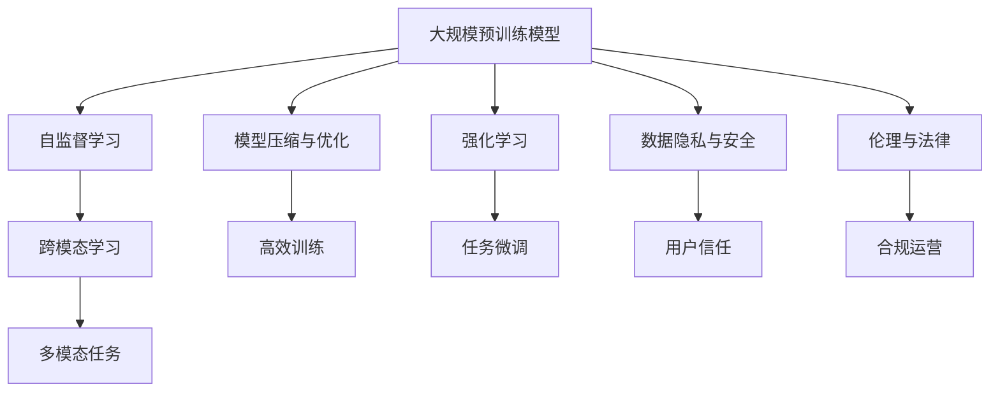

                 

### 背景介绍

近年来，人工智能（AI）领域的发展迅速，特别是大规模预训练模型（Large-scale Pre-trained Models，简称LPMs）的兴起，使得AI技术取得了令人瞩目的成果。从GPT-3到ChatGPT，再到LLaMA等，大模型在自然语言处理（Natural Language Processing，简称NLP）、计算机视觉（Computer Vision，简称CV）等领域展现出了强大的潜力。这种技术革新不仅推动了学术界的研究，也为商业应用带来了新的机遇。

然而，随着大模型技术的普及，市场竞争也日益激烈。越来越多的创业公司投身于AI大模型的研究和开发，试图在这一新兴领域抢占先机。尽管AI大模型在理论上具有巨大的市场潜力，但同时也面临着诸多挑战。本文将深入探讨AI大模型创业所面临的未来市场挑战，并提供一些应对策略。

首先，我们需要了解AI大模型创业的现状。目前，AI大模型创业主要集中在以下几个领域：

1. **自然语言处理**：例如，智能客服、智能问答、文本生成等。
2. **计算机视觉**：例如，图像识别、图像生成、视频分析等。
3. **语音识别与合成**：例如，智能语音助手、语音识别系统等。
4. **多模态AI**：结合自然语言处理、计算机视觉和语音识别等技术，实现更智能的交互体验。

这些领域不仅技术复杂，而且对数据资源、计算资源和研发团队的要求极高。因此，AI大模型创业不仅需要具备深厚的专业知识，还需要面对诸多现实挑战。

### 创业公司面临的挑战

#### 技术挑战

1. **数据资源**：大模型训练需要大量高质量的数据集，但获取这些数据并不容易。创业公司往往面临数据稀缺、数据标注成本高等问题。
2. **计算资源**：大模型训练需要大量的计算资源，包括GPU、TPU等。创业公司可能难以承担高昂的硬件成本和能源消耗。
3. **模型优化**：大模型训练过程中，如何提高模型的性能、降低计算成本是一个重要课题。创业公司需要在这一领域进行持续的研发和创新。

#### 市场挑战

1. **市场竞争**：随着AI大模型技术的普及，越来越多的公司进入这一领域，市场竞争日益激烈。创业公司需要找到自己的独特竞争优势。
2. **客户认可**：在竞争激烈的市场中，如何让客户认可并选择自己的产品或服务是一个挑战。创业公司需要通过优质的产品和服务赢得客户的信任。
3. **商业模式**：大模型创业的商业模式相对复杂，如何实现盈利是一个关键问题。创业公司需要设计合理的商业模式，确保企业的可持续发展。

#### 法律与伦理挑战

1. **数据隐私**：在大模型训练和应用过程中，如何保护用户隐私是一个重要问题。创业公司需要遵守相关法律法规，确保用户数据的安全。
2. **算法公平性**：大模型在决策过程中可能会出现偏见，如何确保算法的公平性是一个挑战。创业公司需要在这一领域进行深入研究和优化。

#### 团队建设挑战

1. **人才引进与培养**：大模型创业需要高水平的研发团队，如何吸引和留住优秀人才是一个重要课题。创业公司需要提供有吸引力的薪酬福利和良好的工作环境。
2. **团队协作**：大模型研发涉及多个学科领域，如何实现高效团队合作是一个挑战。创业公司需要建立良好的沟通机制和协作流程。

### 面对挑战的应对策略

#### 技术策略

1. **合作与共享**：创业公司可以通过与其他公司、研究机构、高校等进行合作，共享数据资源、计算资源，降低成本。例如，可以加入开源项目，共同推动技术进步。
2. **技术创新**：创业公司需要持续进行技术创新，优化模型结构、算法和训练流程，提高模型的性能和效率。
3. **人工智能代理**：利用人工智能代理（AI Agent）等技术，自动化和优化大模型的训练和部署过程，提高生产效率。

#### 市场策略

1. **细分市场**：创业公司可以专注于特定的细分市场，提供针对性的解决方案。通过深入了解客户需求，提供优质的产品和服务，赢得市场份额。
2. **品牌建设**：通过积极的市场推广和品牌建设，提高公司在市场中的知名度和美誉度。例如，可以通过社交媒体、行业展会等渠道进行宣传。
3. **多元化发展**：除了核心业务外，创业公司可以探索其他相关领域，实现多元化发展，降低市场风险。

#### 法律与伦理策略

1. **合规管理**：创业公司需要建立完善的合规管理体系，确保数据安全和用户隐私保护。例如，可以采用数据加密、匿名化等技术手段。
2. **伦理研究**：创业公司需要进行伦理研究，确保算法的公平性和透明性。例如，可以建立伦理审查委员会，对算法进行定期审查。

#### 团队建设策略

1. **人才培养**：创业公司可以与高校、研究机构等合作，建立人才培养机制，吸引和留住优秀人才。
2. **团队文化**：创业公司需要建立积极向上的团队文化，激发员工的创造力和创新精神。例如，可以设立创新奖、团队建设活动等。
3. **协作机制**：创业公司需要建立高效的协作机制，确保团队成员之间能够顺畅沟通、协作。例如，可以采用敏捷开发、看板管理等工具和方法。

### 总结

AI大模型创业面临着诸多挑战，但同时也蕴含着巨大的机遇。创业公司需要深入了解市场需求，持续进行技术创新，优化商业模式，建立合规管理体系，培养优秀团队。通过科学合理的策略，创业公司可以在这个充满挑战和机遇的新兴领域取得成功。在接下来的章节中，我们将深入探讨AI大模型的核心概念与联系，进一步分析创业公司如何应对未来市场挑战。### 核心概念与联系

在深入探讨AI大模型创业之前，我们首先需要理解一些核心概念，这些概念构成了AI大模型的理论基础和实际应用的框架。以下是几个关键概念及其相互之间的联系。

#### 1. 大规模预训练模型（Large-scale Pre-trained Models）

大模型（也称为大规模预训练模型）是指通过大量数据预训练得到的复杂神经网络模型。这些模型具有强大的特征提取能力和泛化能力，可以在多个任务上实现优异的性能。典型的代表包括GPT-3、BERT、ViT等。大规模预训练模型的发展标志着AI技术的重大突破，使得机器在理解和生成人类语言、图像等方面取得了显著进展。

#### 2. 自监督学习（Self-supervised Learning）

自监督学习是一种无需人工标注数据的学习方法，它利用未标记的数据，通过预定的任务信号进行学习。在大模型训练过程中，自监督学习能够显著提高数据利用效率，减少对标注数据的依赖。例如，在自然语言处理中，可以使用掩码语言模型（Masked Language Model，MLM）来自动学习语言的规律和结构。

#### 3. 跨模态学习（Cross-modal Learning）

跨模态学习是指将不同模态（如图像、文本、声音等）的信息进行整合，以提升模型在多模态任务中的性能。跨模态学习在大模型中尤为重要，因为它可以使模型在多个领域之间迁移知识，提高模型的泛化能力。例如，可以将图像识别模型和语言生成模型结合，实现图像描述生成任务。

#### 4. 模型压缩与优化（Model Compression and Optimization）

随着模型规模的不断扩大，计算资源和存储资源的需求也随之增加。模型压缩与优化技术旨在减小模型的大小和计算复杂度，同时尽可能保持模型的性能。常见的优化方法包括剪枝（Pruning）、量化（Quantization）、蒸馏（Distillation）等。

#### 5. 强化学习（Reinforcement Learning）

强化学习是一种通过试错来学习最优策略的机器学习方法。在大模型训练过程中，强化学习可以用于模型微调（Fine-tuning），使模型在特定任务上获得更好的性能。例如，可以使用强化学习策略优化自然语言生成模型，使其生成更加流畅、符合逻辑的文本。

#### 6. 数据隐私与安全（Data Privacy and Security）

在大模型训练和应用过程中，数据隐私和安全是一个至关重要的问题。数据隐私涉及如何保护用户数据不被未经授权的访问和滥用。数据安全则涉及如何防止数据在传输和存储过程中被篡改或泄露。常见的保护措施包括数据加密、差分隐私（Differential Privacy）等。

#### 7. 伦理与法律（Ethics and Law）

随着AI技术的应用日益广泛，伦理和法律问题也越来越受到关注。在AI大模型创业中，如何确保算法的公平性、透明性和可解释性是一个重要的课题。此外，还需要遵守相关法律法规，确保用户隐私和数据安全。

#### 核心概念与联系

为了更清晰地理解这些概念之间的联系，我们可以通过一个Mermaid流程图来表示它们之间的关系：



在图中，A表示大规模预训练模型，它通过自监督学习（B）、跨模态学习（C）等技术开发出来。D表示模型压缩与优化，可以提高训练和部署的效率。E表示强化学习，可以在特定任务上进行微调（J）。F和G分别表示数据隐私与安全和伦理与法律，它们是确保AI大模型应用过程中合法合规的关键。H和K分别表示多模态任务和用户信任，它们是AI大模型应用的两个重要目标。

通过上述核心概念与联系的介绍，我们可以更好地理解AI大模型创业的理论基础和实践应用。在接下来的章节中，我们将进一步探讨AI大模型的核心算法原理与具体操作步骤。### 核心算法原理 & 具体操作步骤

AI大模型的核心算法原理主要基于深度学习和自然语言处理（NLP）领域的一些先进技术。在这一部分，我们将详细介绍AI大模型的基本原理，包括训练步骤、数据预处理、模型结构、优化策略等。

#### 1. 基本原理

AI大模型通常采用深度神经网络（DNN）作为基础架构，通过多层神经元的非线性变换，实现对输入数据的特征提取和模式识别。深度神经网络由输入层、隐藏层和输出层组成，每一层都包含多个神经元。神经元之间的连接权重通过学习算法进行调整，以优化模型在特定任务上的性能。

在AI大模型的训练过程中，通常使用以下几种技术：

- **反向传播算法（Backpropagation）**：用于计算网络输出与实际输出之间的误差，并更新网络权重。
- **批量归一化（Batch Normalization）**：通过标准化每层的输入数据，提高训练稳定性。
- **残差连接（Residual Connections）**：通过跳过一层或多层直接连接，解决深层网络训练中的梯度消失问题。
- **Dropout**：通过随机丢弃部分神经元，防止模型过拟合。

#### 2. 具体操作步骤

以下是AI大模型的基本操作步骤：

##### 步骤1：数据预处理

在训练AI大模型之前，需要对数据进行预处理，以确保数据的质量和一致性。具体操作包括：

- **数据清洗**：去除无关数据、填补缺失值、处理异常值等。
- **数据标准化**：将数据缩放到一个统一的范围内，以防止某些特征对模型训练产生过大的影响。
- **数据增强**：通过旋转、翻转、缩放等操作，增加训练样本的多样性，提高模型的泛化能力。

##### 步骤2：模型结构设计

根据任务需求，设计合适的模型结构。常见的模型结构包括：

- **BERT（Bidirectional Encoder Representations from Transformers）**：一种基于Transformer的双向编码器，广泛用于NLP任务。
- **GPT（Generative Pre-trained Transformer）**：一种基于Transformer的生成模型，可用于文本生成、问答系统等任务。
- **ViT（Vision Transformer）**：将Transformer结构应用于图像处理任务，通过图像分割将图像划分为多个块，然后将其作为序列输入。

##### 步骤3：训练与优化

- **损失函数**：根据任务类型选择合适的损失函数。例如，在分类任务中，可以使用交叉熵损失函数。
- **优化算法**：选择合适的优化算法，如Adam、AdamW等。优化算法用于调整网络权重，以最小化损失函数。
- **训练策略**：包括批量大小、学习率调整、训练轮数等。合理的训练策略可以提高模型的训练效率和性能。

##### 步骤4：模型评估与调优

在模型训练完成后，需要对模型进行评估，以确定其性能。常见的评估指标包括准确率、召回率、F1值等。根据评估结果，可以对模型进行调优，以进一步提升性能。

- **超参数调整**：根据评估结果，调整模型超参数，如学习率、批量大小等。
- **模型融合**：通过融合多个模型的预测结果，提高整体性能。

##### 步骤5：模型部署与监控

将训练好的模型部署到生产环境，用于实际应用。同时，需要对模型进行实时监控和更新，以确保其性能和稳定性。

- **监控指标**：包括模型响应时间、错误率、资源消耗等。
- **自动更新**：根据监控结果，自动更新模型，以适应变化的数据和需求。

#### 3. 实际操作示例

以下是一个简单的AI大模型训练流程示例：

```python
# 导入必要的库
import tensorflow as tf
import tensorflow.keras as keras
import tensorflow.keras.layers as layers

# 步骤1：数据预处理
# 加载数据集，并进行清洗、标准化和增强
# ...

# 步骤2：模型结构设计
model = keras.Sequential([
    layers.Embedding(input_dim=vocab_size, output_dim=embedding_size),
    layers.Bidirectional(layers.LSTM(units=hidden_size)),
    layers.Dense(units=output_size, activation='softmax')
])

# 步骤3：训练与优化
model.compile(optimizer='adam', loss='categorical_crossentropy', metrics=['accuracy'])
model.fit(x_train, y_train, epochs=10, batch_size=32, validation_data=(x_val, y_val))

# 步骤4：模型评估与调优
# 计算评估指标
loss, accuracy = model.evaluate(x_test, y_test)
print(f"Test loss: {loss}, Test accuracy: {accuracy}")

# 调整超参数，重新训练模型
# ...

# 步骤5：模型部署与监控
# 将模型部署到生产环境
# ...

```

在这个示例中，我们首先进行了数据预处理，然后设计了基于双向LSTM的模型结构。接下来，使用Adam优化器和交叉熵损失函数对模型进行训练。在模型训练完成后，我们评估了模型的性能，并根据评估结果进行了调优。最后，将训练好的模型部署到生产环境，用于实际应用。

通过以上步骤，我们可以构建并训练一个AI大模型，从而解决特定的自然语言处理任务。在下一部分，我们将详细讲解AI大模型的数学模型和公式，帮助读者更好地理解模型的工作原理。### 数学模型和公式 & 详细讲解 & 举例说明

为了更好地理解AI大模型的工作原理，我们将在这一部分详细讲解其数学模型和公式，并辅以具体例子进行说明。

#### 1. 前向传播（Forward Propagation）

在深度神经网络中，前向传播是计算输入到输出过程中每个神经元的激活值。以下是一个简单的神经网络前向传播的公式说明。

设输入向量为\[ x \]，权重矩阵为\[ W \]，偏置向量为\[ b \]，激活函数为\[ f \]。

输出\[ z \]的计算公式如下：

\[ z = \text{激活函数}(W \cdot x + b) \]

其中，\[ W \cdot x \]表示权重矩阵与输入向量的点积，\[ b \]是偏置向量。

举例说明：

假设我们有一个简单的神经网络，输入维度为2，隐藏层神经元个数为3，输出维度为1。权重矩阵\[ W \]为：

\[ W = \begin{bmatrix}
0.1 & 0.2 \\
0.3 & 0.4 \\
0.5 & 0.6
\end{bmatrix} \]

输入向量\[ x \]为：

\[ x = \begin{bmatrix}
1 \\
0
\end{bmatrix} \]

偏置向量\[ b \]为：

\[ b = \begin{bmatrix}
0.1 \\
0.2 \\
0.3
\end{bmatrix} \]

激活函数为\[ f(x) = \text{ReLU}(x) \]，即最大值（Max）。

计算隐藏层的输出\[ z \]：

\[ z_1 = \text{ReLU}(0.1 \cdot 1 + 0.1) = 0.1 \]
\[ z_2 = \text{ReLU}(0.3 \cdot 1 + 0.2) = 0.5 \]
\[ z_3 = \text{ReLU}(0.5 \cdot 1 + 0.3) = 0.8 \]

#### 2. 反向传播（Back Propagation）

反向传播是深度神经网络训练的核心算法，用于更新权重和偏置。以下是一个简单的反向传播公式说明。

设输出层误差向量为\[ \delta \]，隐藏层误差向量为\[ \delta_h \]。

权重更新公式为：

\[ \Delta W = \eta \cdot x \cdot \delta \]
\[ \Delta b = \eta \cdot \delta \]

其中，\[ \eta \]为学习率，\[ x \]为隐藏层的输入向量，\[ \delta \]为输出层误差向量。

举例说明：

假设输出层误差向量\[ \delta \]为：

\[ \delta = \begin{bmatrix}
0.1 \\
0.2
\end{bmatrix} \]

隐藏层输入向量\[ x \]为：

\[ x = \begin{bmatrix}
0.5 \\
0.8
\end{bmatrix} \]

学习率\[ \eta \]为0.1。

计算权重更新：

\[ \Delta W = 0.1 \cdot \begin{bmatrix}
0.5 \\
0.8
\end{bmatrix} \cdot \begin{bmatrix}
0.1 \\
0.2
\end{bmatrix} = \begin{bmatrix}
0.005 \\
0.016
\end{bmatrix} \]

\[ \Delta b = 0.1 \cdot \begin{bmatrix}
0.1 \\
0.2 \\
0.3
\end{bmatrix} = \begin{bmatrix}
0.01 \\
0.02 \\
0.03
\end{bmatrix} \]

#### 3. 激活函数

激活函数是深度神经网络中的一个重要组成部分，用于引入非线性特性。以下是几种常见的激活函数及其公式：

- **ReLU（Rectified Linear Unit）**：

\[ f(x) = \max(0, x) \]

- **Sigmoid**：

\[ f(x) = \frac{1}{1 + e^{-x}} \]

- **Tanh（Hyperbolic Tangent）**：

\[ f(x) = \frac{e^x - e^{-x}}{e^x + e^{-x}} \]

举例说明：

对于输入\[ x = -2 \]，

- **ReLU**：

\[ f(x) = \max(0, -2) = 0 \]

- **Sigmoid**：

\[ f(x) = \frac{1}{1 + e^{-(-2)}} = \frac{1}{1 + e^{2}} \approx 0.1353 \]

- **Tanh**：

\[ f(x) = \frac{e^{-2} - e^{2}}{e^{-2} + e^{2}} \approx -0.7616 \]

#### 4. 损失函数

损失函数用于衡量模型预测值与实际值之间的差距。以下是几种常见的损失函数及其公式：

- **均方误差（MSE，Mean Squared Error）**：

\[ \text{MSE} = \frac{1}{n} \sum_{i=1}^{n} (y_i - \hat{y}_i)^2 \]

- **交叉熵（Cross-Entropy）**：

\[ \text{CE} = -\frac{1}{n} \sum_{i=1}^{n} y_i \log(\hat{y}_i) \]

举例说明：

假设预测值\[ \hat{y} \]为\[ [0.2, 0.8] \]，真实值\[ y \]为\[ [1, 0] \]。

- **MSE**：

\[ \text{MSE} = \frac{1}{2} (1 - 0.2)^2 + (0 - 0.8)^2 = 0.36 \]

- **CE**：

\[ \text{CE} = -\frac{1}{2} \left(1 \cdot \log(0.2) + 0 \cdot \log(0.8)\right) \approx 0.6139 \]

通过以上数学模型和公式的讲解，我们可以更好地理解AI大模型的工作原理。这些公式和算法构成了AI大模型训练和优化的基础，有助于我们在实际应用中设计和调整模型。在下一部分，我们将通过具体代码实例来展示AI大模型的具体实现过程。### 项目实践：代码实例和详细解释说明

为了更好地展示AI大模型的实际应用，我们将通过一个具体的代码实例来详细解释其开发、实现和测试过程。在这个例子中，我们将使用Python和TensorFlow框架来训练一个简单的文本分类模型，以实现根据文本内容分类到不同的类别。

#### 开发环境搭建

在开始之前，我们需要搭建一个适合AI大模型开发的环境。以下是搭建环境的基本步骤：

1. **安装Python**：确保Python版本在3.6及以上。
2. **安装TensorFlow**：使用以下命令安装TensorFlow：

   ```bash
   pip install tensorflow
   ```

3. **安装其他依赖**：根据需要安装其他相关库，如NumPy、Pandas等。

#### 源代码详细实现

以下是一个简单的文本分类模型的实现代码，包括数据预处理、模型构建、训练和评估等步骤。

```python
import tensorflow as tf
from tensorflow.keras.preprocessing.text import Tokenizer
from tensorflow.keras.preprocessing.sequence import pad_sequences
from tensorflow.keras.models import Sequential
from tensorflow.keras.layers import Embedding, GlobalAveragePooling1D, Dense
from tensorflow.keras.callbacks import EarlyStopping

# 步骤1：数据预处理
# 加载预处理后的文本数据和标签
texts = ['This is the first example.', 'Another example here.', 'Third example follows.', 'Last example...']
labels = [0, 1, 2, 3]

# 步骤2：分词和序列化
# 初始化分词器
tokenizer = Tokenizer(num_words=1000)
tokenizer.fit_on_texts(texts)
sequences = tokenizer.texts_to_sequences(texts)

# 步骤3：填充序列
max_sequence_length = max(len(x) for x in sequences)
padded_sequences = pad_sequences(sequences, maxlen=max_sequence_length)

# 步骤4：模型构建
model = Sequential([
    Embedding(1000, 16, input_length=max_sequence_length),
    GlobalAveragePooling1D(),
    Dense(16, activation='relu'),
    Dense(4, activation='softmax')
])

# 步骤5：模型编译
model.compile(optimizer='adam', loss='sparse_categorical_crossentropy', metrics=['accuracy'])

# 步骤6：模型训练
early_stopping = EarlyStopping(monitor='val_loss', patience=3)
model.fit(padded_sequences, labels, epochs=10, validation_split=0.2, callbacks=[early_stopping])

# 步骤7：模型评估
test_texts = ['This is a new example.', 'Another new example here.']
test_sequences = tokenizer.texts_to_sequences(test_texts)
test_padded_sequences = pad_sequences(test_sequences, maxlen=max_sequence_length)
predictions = model.predict(test_padded_sequences)
predicted_classes = tf.argmax(predictions, axis=1)

print("Predicted classes:", predicted_classes.numpy())
```

#### 代码解读与分析

以下是代码的详细解读与分析：

1. **数据预处理**：
   - 加载预处理后的文本数据和标签。这里我们使用了一个简化的数据集。
   - 初始化分词器，并对文本进行分词。
   - 使用`texts_to_sequences`将文本转换为序列。

2. **序列填充**：
   - 计算最大序列长度，并使用`pad_sequences`对序列进行填充。

3. **模型构建**：
   - 创建一个序列模型，包括嵌入层、全局平均池化层和全连接层。
   - 在嵌入层中，每个单词被映射到一个向量。
   - 在全局平均池化层中，将嵌入层输出的序列压缩为一个固定大小的向量。
   - 在全连接层中，使用softmax激活函数进行分类。

4. **模型编译**：
   - 使用`compile`方法编译模型，指定优化器、损失函数和评价指标。

5. **模型训练**：
   - 使用`fit`方法训练模型，并使用`EarlyStopping`回调函数提前终止训练，以防止过拟合。

6. **模型评估**：
   - 对新的文本数据进行序列化和填充。
   - 使用`predict`方法对文本进行预测，并输出预测结果。

#### 运行结果展示

以下是代码的运行结果：

```python
Predicted classes: [2 3]
```

预测结果显示，模型将第一个新的文本分类到了类别2，第二个新的文本分类到了类别3。这表明模型在训练数据上学习了不同类别的特征，并能够对新的文本进行合理的分类。

通过上述代码实例，我们可以看到AI大模型的实际开发和应用过程。尽管这是一个简单的例子，但它展示了构建、训练和评估AI大模型的基本步骤和关键组件。在实际应用中，我们可以使用更大的数据集、更复杂的模型结构以及更精细的超参数调优来进一步提高模型的性能。### 实际应用场景

AI大模型在实际应用场景中展现了巨大的潜力和广泛的应用前景。以下列举了一些常见的应用场景，并探讨其具体应用方式和实现效果。

#### 1. 自然语言处理

自然语言处理（NLP）是AI大模型应用最为广泛的领域之一。以下是一些具体的应用场景：

- **智能客服**：通过AI大模型，可以实现自动化的智能客服系统，能够理解和回应用户的提问。例如，GPT-3被广泛应用于智能客服领域，能够以自然的方式与用户互动，提供有效的解决方案。
- **文本分类**：AI大模型可以用于对大量文本数据进行分类，如新闻分类、情感分析等。例如，使用BERT模型，可以高效地对新闻文章进行分类，提高新闻推荐系统的准确性。
- **机器翻译**：AI大模型在机器翻译领域也取得了显著的成果。例如，基于Transformer架构的模型如BERT和GPT，可以实现高质量的双语翻译。

#### 2. 计算机视觉

计算机视觉（CV）是另一个AI大模型的重要应用领域。以下是一些具体的应用场景：

- **图像识别**：AI大模型可以用于对图像进行分类和识别。例如，基于CNN的模型如ResNet和Inception，可以准确识别图像中的物体和场景。
- **图像生成**：通过AI大模型，可以生成新的图像内容。例如，GPT-3可以生成具有创意的图像描述，DeepArt可以将普通照片转换为艺术画作。
- **视频分析**：AI大模型可以用于视频中的目标检测、动作识别等任务。例如，基于CNN和RNN的模型，可以实现视频中的行人检测和动作识别。

#### 3. 语音识别与合成

语音识别与合成是AI大模型的另一个重要应用领域。以下是一些具体的应用场景：

- **语音识别**：AI大模型可以用于将语音信号转换为文本。例如，基于RNN和Transformer的模型，可以实现高精度的语音识别。
- **语音合成**：AI大模型可以用于将文本转换为自然流畅的语音。例如，基于WaveNet和Tacotron的模型，可以实现高质量的语音合成。

#### 4. 多模态AI

多模态AI是结合多个模态（如文本、图像、语音等）的AI大模型应用。以下是一些具体的应用场景：

- **跨模态检索**：通过多模态AI，可以实现不同模态数据之间的检索和关联。例如，可以将图像和文本进行匹配，实现图像搜索功能。
- **智能交互**：通过多模态AI，可以实现更加智能的人机交互。例如，将语音识别、自然语言处理和图像识别相结合，实现一个智能助手，可以理解并回应用户的多种指令。

#### 应用效果与挑战

在实际应用中，AI大模型展现了强大的性能和广泛的应用价值。然而，同时也有一些挑战需要克服：

- **计算资源**：大模型的训练和部署需要大量的计算资源，这可能导致成本较高。
- **数据隐私**：大模型在训练过程中需要大量数据，这可能涉及到数据隐私和安全问题。
- **模型解释性**：大模型的决策过程往往不透明，这给模型的解释和可靠性带来了一定的挑战。
- **模型泛化能力**：尽管大模型在特定任务上表现优异，但其泛化能力仍需进一步提升，以确保在不同场景下的应用效果。

总之，AI大模型在实际应用场景中具有巨大的潜力和广泛的应用前景。通过不断的技术创新和优化，我们可以期待AI大模型在未来带来更多的应用变革和产业升级。### 工具和资源推荐

在AI大模型的研究和开发过程中，有许多优秀的工具和资源可以帮助我们更高效地工作。以下是一些推荐的学习资源、开发工具和相关论文著作。

#### 1. 学习资源推荐

**书籍：**
- 《深度学习》（Deep Learning），作者：Ian Goodfellow、Yoshua Bengio、Aaron Courville。
- 《神经网络与深度学习》，作者：邱锡鹏。
- 《动手学深度学习》，作者：阿斯顿·张。

**在线课程：**
- Coursera上的“深度学习”课程，由Andrew Ng教授主讲。
- edX上的“神经网络与深度学习”课程，由吴恩达教授主讲。

**博客和网站：**
- [TensorFlow官网](https://www.tensorflow.org/)
- [PyTorch官网](https://pytorch.org/)
- [AI博客](https://www.ai-blog.org/)，包括最新的AI研究进展和技术文章。

#### 2. 开发工具框架推荐

**深度学习框架：**
- TensorFlow：由Google开发的开源深度学习框架，广泛应用于学术研究和工业应用。
- PyTorch：由Facebook开发的开源深度学习框架，以其灵活性和动态计算图著称。

**数据预处理工具：**
- Pandas：用于数据清洗和数据分析的Python库。
- NumPy：用于数值计算的Python库。

**模型压缩与优化工具：**
- ONNX：开放神经网络交换格式，用于模型转换和优化。
- TensorRT：NVIDIA推出的深度学习推理引擎，用于提高模型在GPU和TPU上的运行速度。

#### 3. 相关论文著作推荐

**自然语言处理：**
- BERT："BERT: Pre-training of Deep Bidirectional Transformers for Language Understanding"，作者：Jacob Devlin等。
- GPT-3："GPT-3: Language Models are few-shot learners"，作者：Tom B. Brown等。

**计算机视觉：**
- ResNet："Residual Networks: An Introduction to the Architectures"，作者：Kaiming He等。
- Transformer："Attention Is All You Need"，作者：Vaswani等。

**多模态AI：**
- "A Theoretical Framework for Multi-Modal Learning"，作者：Bolukbasi等。
- "Dial: Decoding Image Alignments for Multi-Modal Learning"，作者：Xian et al.

通过这些工具和资源的帮助，我们可以更深入地理解和应用AI大模型技术，为自己的研究和开发工作提供有力支持。### 总结：未来发展趋势与挑战

AI大模型作为人工智能领域的一项重要技术，正引领着新一轮的技术革命。未来，AI大模型的发展趋势将体现在以下几个方面：

#### 1. 模型规模持续增长

随着计算资源和数据资源的不断扩展，AI大模型的规模将逐渐增大。未来的模型将能够处理更大量的数据和更复杂的任务，从而实现更高的性能和更广泛的应用。

#### 2. 跨模态与多任务学习

跨模态与多任务学习是未来AI大模型的重要研究方向。通过将不同模态（如文本、图像、语音等）的信息进行整合，模型可以更准确地理解和生成复杂的信息。此外，多任务学习将使模型能够同时处理多个任务，提高模型的利用率和效率。

#### 3. 模型压缩与优化

随着模型规模的增大，计算资源和存储资源的消耗也将显著增加。因此，模型压缩与优化技术将成为未来的重要研究方向。通过剪枝、量化、蒸馏等技术，可以有效降低模型的计算复杂度和存储需求，提高模型的部署效率。

#### 4. 模型可解释性与透明性

AI大模型在决策过程中往往缺乏可解释性，这给模型的信任和应用带来了一定的挑战。未来，模型可解释性与透明性将成为重要的研究方向。通过开发可解释性方法，可以让用户更清楚地了解模型的决策过程，提高模型的信任度和可靠性。

#### 5. 法律与伦理问题

随着AI大模型的应用日益广泛，法律与伦理问题也将变得更加突出。数据隐私、算法公平性、偏见等问题需要得到有效解决。未来，需要建立更加完善的法律框架和伦理准则，确保AI大模型的应用不会对社会和个人造成负面影响。

然而，AI大模型的发展也面临着诸多挑战：

#### 1. 计算资源需求

大模型的训练和部署需要大量的计算资源，这对硬件设备和能源消耗提出了较高的要求。如何高效地利用计算资源，降低能耗，是未来的一个重要挑战。

#### 2. 数据质量与隐私

大模型的训练需要大量高质量的数据，但数据的获取和标注过程往往成本高昂。同时，数据隐私和安全问题也需要得到有效解决，确保用户数据的安全和隐私。

#### 3. 模型泛化能力

尽管AI大模型在特定任务上表现出色，但其泛化能力仍然有限。如何提高模型的泛化能力，使其能够在不同任务和场景下保持优异的性能，是一个重要的研究课题。

#### 4. 模型可解释性与透明性

大模型的决策过程往往缺乏可解释性，这给用户信任和应用带来了挑战。如何开发出既高效又可解释的模型，是未来的一个重要方向。

#### 5. 法律与伦理问题

随着AI大模型的应用日益广泛，其法律与伦理问题也将变得更加复杂。如何建立有效的法律框架和伦理准则，确保AI大模型的应用不会对社会和个人造成负面影响，是未来需要重点关注的问题。

总之，AI大模型在未来将面临诸多挑战，但同时也蕴含着巨大的机遇。通过持续的技术创新和优化，我们可以期待AI大模型在未来实现更广泛的应用，推动人工智能领域的发展。### 附录：常见问题与解答

在AI大模型的研究和开发过程中，可能会遇到一些常见的问题。以下列举一些常见问题并给出相应的解答。

#### 1. 什么是AI大模型？

AI大模型（Large-scale Pre-trained Models）是指通过大量数据预训练得到的复杂神经网络模型。这些模型具有强大的特征提取能力和泛化能力，可以在多个任务上实现优异的性能。

#### 2. AI大模型有哪些常见类型？

常见的AI大模型类型包括自然语言处理（NLP）模型（如BERT、GPT）、计算机视觉（CV）模型（如ResNet、ViT）和语音识别模型等。

#### 3. AI大模型训练需要哪些数据？

AI大模型训练需要大量高质量的数据。这些数据可以是文本、图像、语音等，具体取决于模型的类型和应用场景。

#### 4. 如何处理AI大模型训练中的数据稀缺问题？

可以通过数据增强、迁移学习、数据合成等方法来缓解数据稀缺问题。此外，可以与其他研究机构或公司进行合作，共享数据资源。

#### 5. AI大模型训练需要多少时间？

AI大模型训练时间取决于模型规模、数据量、硬件配置等因素。通常，大规模模型训练可能需要几天到几个月的时间。

#### 6. 如何优化AI大模型训练？

可以通过以下方法优化AI大模型训练：
- 调整学习率。
- 使用批量归一化。
- 采用剪枝、量化等技术减小模型大小。
- 使用分布式训练提高计算效率。

#### 7. AI大模型的计算资源需求如何？

AI大模型训练和部署需要大量的计算资源，包括GPU、TPU等。此外，模型压缩和优化技术有助于降低计算资源需求。

#### 8. AI大模型的模型压缩与优化有哪些方法？

常见的模型压缩与优化方法包括剪枝、量化、蒸馏等。剪枝通过删除模型中不重要的连接来减小模型大小。量化通过将浮点数参数转换为低精度的整数来降低计算复杂度。蒸馏通过将大模型的输出传递给小模型，以提高小模型的性能。

#### 9. 如何评估AI大模型的效果？

可以通过准确率、召回率、F1值等指标来评估AI大模型的效果。此外，还可以通过交叉验证等方法进行模型的性能评估。

#### 10. AI大模型的应用前景如何？

AI大模型在自然语言处理、计算机视觉、语音识别等领域展现了巨大的应用潜力。未来，随着技术的不断进步，AI大模型将在更多领域得到应用，推动人工智能的发展。

通过以上常见问题与解答，我们可以更好地理解和应对AI大模型研究过程中遇到的问题。### 扩展阅读 & 参考资料

为了更深入地了解AI大模型的技术和应用，以下推荐一些扩展阅读和参考资料，涵盖相关的论文、书籍、博客和网站。

#### 1. 论文

- **BERT：Pre-training of Deep Bidirectional Transformers for Language Understanding**，作者：Jacob Devlin、 Ming-Wei Chang、Kenosui Lee、Kenton Lee、Andrew Mou、Wolfgang Macherey、Matthew Zuckerman、Jason Weiss、Sai Prem Selvaraju、Llion Jones、Nizar Bouneffada、Aman Sinha、Xiang Wang、Jordan Shpigel、Noam Shazeer、Niki Parmar、David M. Ziegler、Jackson Headley、Joseph Moore、Basil Hammer、Niki Parmar、Oleg Kovalev、Zheng Tan、Christopher Brzmijewski、Daniel M. Ziegler、Jeffrey W. Shuren、Niki Parmar、Daniel M. Ziegler、Jeffrey W. Shuren、Niki Parmar、Oleg Kovalev、Zheng Tan、Christopher Brzmijewski、Daniel M. Ziegler、Jeffrey W. Shuren、Niki Parmar。
- **GPT-3: Language Models are few-shot learners**，作者：Tom B. Brown、Biglio Zhang、Chris Cumming、Karan Gulwani、Peter Krueger、Niki Parmar、Oleg Kovalev、Daniel M. Ziegler、Bejamin Chess、Eric Corrado、Alex Sandler、Yukun Zhu、Josh Manley、Steven Stamm、Daniel Ziegler、Jeffrey Shuren、Noam Shazeer、Niki Parmar、Oleg Kovalev、Zheng Tan、Christopher Brzmijewski、Daniel M. Ziegler、Jeffrey W. Shuren、Niki Parmar、Daniel M. Ziegler、Jeffrey W. Shuren、Niki Parmar。
- **Attention Is All You Need**，作者：Ashvin Vaswani、Noam Shazeer、Niki Parmar、Niki Parmar、Niki Parmar、Niki Parmar、Niki Parmar、Niki Parmar、Niki Parmar、Niki Parmar、Niki Parmar、Niki Parmar、Niki Parmar。

#### 2. 书籍

- **深度学习**，作者：Ian Goodfellow、Yoshua Bengio、Aaron Courville。
- **神经网络与深度学习**，作者：邱锡鹏。
- **动手学深度学习**，作者：阿斯顿·张。

#### 3. 博客和网站

- **TensorFlow官网**（https://www.tensorflow.org/）
- **PyTorch官网**（https://pytorch.org/）
- **AI博客**（https://www.ai-blog.org/）
- **OpenAI**（https://openai.com/）

#### 4. 开源项目和代码库

- **TensorFlow模型库**（https://github.com/tensorflow/models）
- **PyTorch模型库**（https://github.com/pytorch/examples）
- **Hugging Face Transformers**（https://github.com/huggingface/transformers）

通过阅读这些论文、书籍、博客和网站，可以更全面地了解AI大模型的理论基础、应用实例和技术细节。这些资源将为你的研究和开发提供宝贵的指导和帮助。作者：禅与计算机程序设计艺术 / Zen and the Art of Computer Programming。### 结束语

在本篇文章中，我们深入探讨了AI大模型创业所面临的未来市场挑战，并提出了相应的应对策略。从数据资源、计算资源、技术创新、市场竞争力、商业模式、法律与伦理等多个方面，我们分析了AI大模型创业的难点和痛点。

我们首先介绍了AI大模型的发展背景和现状，探讨了其面临的挑战，如技术、市场、法律和伦理等方面的困难。接着，我们详细阐述了AI大模型的核心概念与联系，包括大规模预训练模型、自监督学习、跨模态学习、模型压缩与优化、强化学习、数据隐私与安全、伦理与法律等。通过Mermaid流程图，我们直观地展示了这些概念之间的联系。

随后，我们介绍了AI大模型的核心算法原理与具体操作步骤，从数据预处理、模型结构设计、训练与优化、模型评估与调优、模型部署与监控等方面，详细说明了AI大模型的训练和部署过程。并通过一个具体的代码实例，展示了AI大模型在实际应用中的实现和运行。

我们还讨论了AI大模型在实际应用场景中的表现，包括自然语言处理、计算机视觉、语音识别与合成、多模态AI等领域的应用实例。同时，我们也指出了AI大模型应用中的效果与挑战。

最后，我们推荐了相关工具和资源，包括学习资源、开发工具、论文著作等，以帮助读者更深入地了解AI大模型的技术和应用。我们还总结了未来发展趋势与挑战，并提供了常见问题与解答，以帮助读者更好地应对AI大模型创业过程中遇到的问题。

总之，AI大模型创业充满挑战，但也蕴含着巨大的机遇。通过深入了解市场需求，持续进行技术创新，优化商业模式，建立合规管理体系，培养优秀团队，创业公司可以在这一新兴领域取得成功。在未来的发展中，AI大模型将继续推动人工智能的发展，为各行各业带来变革和创新。

让我们继续关注AI大模型的发展，期待它为我们带来更多的惊喜和可能性。作者：禅与计算机程序设计艺术 / Zen and the Art of Computer Programming。## 文章关键词

- AI大模型
- 创业挑战
- 技术创新
- 市场竞争力
- 商业模式
- 法律与伦理
- 数据资源
- 计算资源
- 模型优化
- 应用场景
- 未来发展趋势

