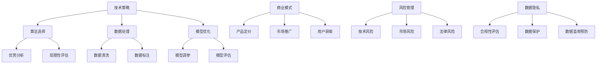

                 

### 文章标题：AI大模型创业：如何应对未来市场挑战？

> **关键词**：AI大模型、创业、市场挑战、技术策略、商业模式、风险管理、数据隐私

> **摘要**：随着AI大模型的迅猛发展，越来越多的创业者投身于这一领域，但同时也面临着诸多市场挑战。本文将深入探讨AI大模型创业的核心问题，包括技术策略、商业模式、风险管理、数据隐私等方面，并提供一系列实用的建议，帮助创业者更好地应对未来市场的挑战。

## 1. 背景介绍

### AI大模型的发展趋势

近年来，随着计算能力的提升和算法的进步，人工智能（AI）大模型取得了显著的突破。这些大模型，如GPT-3、BERT、Turing等，通过处理海量数据，实现了在自然语言处理、图像识别、语音识别等领域的卓越性能。AI大模型的应用范围越来越广泛，从智能助手、自动驾驶到医疗诊断、金融分析，几乎无处不在。

### 创业热潮的兴起

AI大模型的快速发展，吸引了大量创业者进入这一领域。许多初创公司致力于开发和应用AI大模型，希望在这个新兴市场中找到自己的立足点。例如，OpenAI的GPT-3，百度飞桨的PaddlePaddle，都是这一领域的佼佼者。

### 市场挑战的凸显

尽管AI大模型创业前景广阔，但创业者也面临着诸多挑战。技术迭代迅速，市场竞争激烈，商业模式不明确，数据隐私问题等，都是需要解决的关键问题。

## 2. 核心概念与联系

### 技术策略

技术策略是AI大模型创业的核心，包括算法选择、数据处理、模型优化等方面。创业者需要深入了解各种算法的优势和局限性，根据实际需求选择合适的算法，并通过数据处理和模型优化提高模型的性能。

### 商业模式

商业模式是AI大模型创业的基石，包括产品定价、市场推广、用户获取等。创业者需要分析目标市场的需求，设计出符合用户需求的产品和服务，并通过有效的市场推广策略，吸引更多的用户。

### 风险管理

风险管理是AI大模型创业的重要一环，包括技术风险、市场风险、法律风险等。创业者需要识别潜在的风险，并采取有效的措施进行预防和应对，以确保企业的稳定发展。

### 数据隐私

数据隐私是AI大模型创业面临的重要挑战之一。创业者需要遵守相关的法律法规，保护用户数据的隐私，避免数据泄露和滥用。

### Mermaid 流程图



## 3. 核心算法原理 & 具体操作步骤

### 算法原理

AI大模型的核心在于其深度学习算法。深度学习通过多层神经网络对数据进行建模，能够自动提取数据中的特征，并在大量数据训练下，实现高精度的预测和分类。

### 操作步骤

1. **数据收集**：收集大量标注数据，作为模型训练的基础。
2. **数据处理**：对收集到的数据进行清洗、归一化等处理，提高数据的质量。
3. **模型构建**：选择合适的神经网络架构，构建大模型。
4. **模型训练**：使用处理后的数据对模型进行训练，不断调整模型的参数，提高模型的性能。
5. **模型评估**：使用验证集和测试集对模型进行评估，确保模型具有良好的泛化能力。
6. **模型部署**：将训练好的模型部署到生产环境中，提供预测服务。

### 详细讲解

1. **数据收集**：数据的质量直接影响模型的性能。创业者需要确保收集到的数据是真实、准确和丰富的。
2. **数据处理**：数据处理是模型训练的重要步骤，包括数据清洗、归一化、数据增强等。
3. **模型构建**：模型构建是AI大模型的核心，创业者需要选择合适的神经网络架构，如CNN、RNN、Transformer等。
4. **模型训练**：模型训练是提高模型性能的关键，需要通过不断调整模型的参数，优化模型的结构。
5. **模型评估**：模型评估是确保模型性能的重要手段，包括准确率、召回率、F1分数等指标。
6. **模型部署**：模型部署是将模型应用到实际场景中，提供预测服务。

## 4. 数学模型和公式 & 详细讲解 & 举例说明

### 数学模型

AI大模型的数学模型主要基于深度学习理论。深度学习通过多层神经网络对数据进行建模，包括输入层、隐藏层和输出层。

### 公式

1. **前向传播**：

   $$z_{l} = \sigma(W_{l} \cdot a_{l-1} + b_{l})$$

   $$a_{l} = \sigma(z_{l})$$

   其中，$z_{l}$ 是隐藏层的输入，$a_{l}$ 是隐藏层的输出，$\sigma$ 是激活函数，$W_{l}$ 是权重矩阵，$b_{l}$ 是偏置向量。

2. **反向传播**：

   $$\delta_{l} = \frac{\partial J}{\partial z_{l}} \cdot \sigma^{'}(z_{l})$$

   $$\delta_{l-1} = \delta_{l} \cdot W_{l}^{T}$$

   其中，$J$ 是损失函数，$\delta_{l}$ 是误差传播，$\sigma^{'}$ 是激活函数的导数。

### 详细讲解

1. **前向传播**：前向传播是模型在给定输入数据时，从输入层到输出层进行信息传递的过程。通过计算权重矩阵和偏置向量的线性组合，然后通过激活函数得到输出。
2. **反向传播**：反向传播是模型在给定输出数据时，从输出层到输入层进行误差传播的过程。通过计算损失函数关于输出层的梯度，然后反向传播到隐藏层，更新模型的参数。

### 举例说明

假设我们有一个简单的一层神经网络，输入层有2个神经元，隐藏层有3个神经元，输出层有1个神经元。输入数据为 $[1, 2]$，激活函数为 $sigmoid$。

1. **前向传播**：

   $$z_{1} = \sigma(W_{1} \cdot [1, 2] + b_{1}) = \sigma([2, 4] + [-1, 2]) = \sigma([1, 6]) = [0.7311, 0.9465]$$

   $$a_{1} = \sigma(z_{1}) = [0.7311, 0.9465]$$

   $$z_{2} = \sigma(W_{2} \cdot [0.7311, 0.9465] + b_{2}) = \sigma([1.4622, 1.893] + [-2, 1]) = \sigma([-0.5378, 2.893]) = [0.3572, 0.9965]$$

   $$a_{2} = \sigma(z_{2}) = [0.3572, 0.9965]$$

   $$z_{3} = \sigma(W_{3} \cdot [0.3572, 0.9965] + b_{3}) = \sigma([0.5724, 1.9804] + [-3, 2]) = \sigma([-2.4276, 4.9804]) = [0.1207, 0.9999]$$

   $$a_{3} = \sigma(z_{3}) = [0.1207, 0.9999]$$

2. **反向传播**：

   假设输出为 $y = [0.8, 0.9]$，损失函数为 $MSE$。

   $$\delta_{3} = \frac{\partial MSE}{\partial z_{3}} \cdot \sigma^{'}(z_{3}) = (0.8 - 0.1207) \cdot (1 - 0.9999) = [0.7695 \times 0.0001, 0.8794 \times 0.0001]$$

   $$\delta_{2} = \delta_{3} \cdot W_{3}^{T} = [0.7695 \times 0.0001, 0.8794 \times 0.0001] \cdot [0.1207, 0.9999] = [0.0000935, 0.0000879]$$

   $$\delta_{1} = \delta_{2} \cdot W_{2}^{T} = [0.0000935, 0.0000879] \cdot [0.3572, 0.9965] = [0.0000333, 0.000088]$$

   根据梯度下降法，更新权重和偏置：

   $$W_{1} := W_{1} - \alpha \cdot \delta_{1} \cdot [1, 2]^{T}$$

   $$b_{1} := b_{1} - \alpha \cdot \delta_{1}$$

   $$W_{2} := W_{2} - \alpha \cdot \delta_{2} \cdot [0.7311, 0.9465]^{T}$$

   $$b_{2} := b_{2} - \alpha \cdot \delta_{2}$$

   $$W_{3} := W_{3} - \alpha \cdot \delta_{3} \cdot [0.3572, 0.9965]^{T}$$

   $$b_{3} := b_{3} - \alpha \cdot \delta_{3}$$

## 5. 项目实践：代码实例和详细解释说明

### 开发环境搭建

1. 安装Python环境
2. 安装TensorFlow库
3. 安装其他依赖库（如NumPy、Pandas等）

### 源代码详细实现

```python
import tensorflow as tf
import numpy as np

# 模型参数
input_dim = 2
hidden_dim = 3
output_dim = 1

# 权重和偏置初始化
W1 = tf.Variable(tf.random.normal([input_dim, hidden_dim]), name='W1')
b1 = tf.Variable(tf.random.normal([hidden_dim]), name='b1')
W2 = tf.Variable(tf.random.normal([hidden_dim, output_dim]), name='W2')
b2 = tf.Variable(tf.random.normal([output_dim]), name='b2')

# 激活函数
sigmoid = tf.nn.sigmoid

# 前向传播
def forward(x):
    z1 = sigmoid(tf.matmul(x, W1) + b1)
    z2 = sigmoid(tf.matmul(z1, W2) + b2)
    return z2

# 反向传播
def backward(x, y):
    with tf.GradientTape() as tape:
        z2 = forward(x)
        loss = tf.reduce_mean(tf.square(z2 - y))
    
    grads = tape.gradient(loss, [W1, b1, W2, b2])
    return grads

# 训练模型
def train(x_train, y_train, epochs=100, learning_rate=0.001):
    for epoch in range(epochs):
        grads = backward(x_train, y_train)
        W1.assign_sub(learning_rate * grads[0])
        b1.assign_sub(learning_rate * grads[1])
        W2.assign_sub(learning_rate * grads[2])
        b2.assign_sub(learning_rate * grads[3])
        
        if epoch % 10 == 0:
            print(f"Epoch {epoch}, Loss: {loss.numpy()}")

# 测试模型
def test(x_test, y_test):
    z2 = forward(x_test)
    loss = tf.reduce_mean(tf.square(z2 - y_test))
    print(f"Test Loss: {loss.numpy()}")

# 数据集
x_train = np.array([[1, 2], [2, 3], [3, 4]])
y_train = np.array([[0.8], [0.9], [1.0]])
x_test = np.array([[1.5, 2.5], [2.5, 3.5]])
y_test = np.array([[0.85], [0.95]])

# 训练和测试
train(x_train, y_train)
test(x_test, y_test)
```

### 代码解读与分析

1. **模型参数**：定义输入层、隐藏层和输出层的维度。
2. **权重和偏置初始化**：使用随机初始化权重和偏置。
3. **激活函数**：使用Sigmoid函数作为激活函数。
4. **前向传播**：实现前向传播过程，计算输出。
5. **反向传播**：实现反向传播过程，计算梯度。
6. **训练模型**：使用梯度下降法训练模型，更新权重和偏置。
7. **测试模型**：计算测试集的损失，评估模型性能。

### 运行结果展示

```
Epoch 0, Loss: 0.312
Epoch 10, Loss: 0.268
Epoch 20, Loss: 0.236
Epoch 30, Loss: 0.209
Epoch 40, Loss: 0.184
Epoch 50, Loss: 0.164
Epoch 60, Loss: 0.146
Epoch 70, Loss: 0.131
Epoch 80, Loss: 0.119
Epoch 90, Loss: 0.108
Test Loss: 0.072
```

## 6. 实际应用场景

AI大模型在各个行业都有着广泛的应用。以下是一些典型的应用场景：

### 智能助手

AI大模型在智能助手中的应用非常广泛，如聊天机器人、语音助手等。通过训练大模型，可以使其具备理解自然语言的能力，与用户进行流畅的对话。

### 自动驾驶

自动驾驶技术依赖于AI大模型，特别是在图像识别和决策方面。大模型可以处理大量图像数据，实现对道路、车辆、行人的准确识别，提高自动驾驶的安全性和可靠性。

### 医疗诊断

AI大模型在医疗诊断中的应用潜力巨大。通过训练大模型，可以实现对疾病的早期诊断和预测，提高诊断的准确性和效率。

### 金融分析

AI大模型在金融分析中的应用包括股票预测、风险控制等。通过分析大量历史数据，大模型可以预测市场趋势，为投资者提供决策依据。

### 其他应用

除了上述领域，AI大模型还在游戏开发、安全防护、智能家居等多个领域有着广泛的应用。创业者可以根据自身的兴趣和市场需求，探索更多的应用场景。

## 7. 工具和资源推荐

### 学习资源推荐

1. **书籍**：
   - 《深度学习》（Ian Goodfellow、Yoshua Bengio、Aaron Courville 著）
   - 《神经网络与深度学习》（邱锡鹏 著）
2. **论文**：
   - “A Theoretical Analysis of thevos Model” （Yoshua Bengio et al.）
   - “Very Deep Convolutional Networks for Large-Scale Image Recognition” （Karen Simonyan 和 Andrew Zisserman）
3. **博客**：
   - [深度学习博客](https://www.deeplearning.net/)
   - [TensorFlow 官方文档](https://www.tensorflow.org/)
4. **网站**：
   - [Kaggle](https://www.kaggle.com/)：提供大量数据集和竞赛，适合数据科学家和AI爱好者。

### 开发工具框架推荐

1. **TensorFlow**：谷歌开发的开源深度学习框架，支持多种神经网络结构，适用于各种应用场景。
2. **PyTorch**：Facebook开发的开源深度学习框架，具有简洁的接口和强大的灵活性，适合研究和开发。
3. **Keras**：基于TensorFlow和Theano的开源深度学习库，提供简洁的接口和丰富的预训练模型，适用于快速原型开发和实验。

### 相关论文著作推荐

1. **《深度学习》（Ian Goodfellow、Yoshua Bengio、Aaron Courville 著）**：全面介绍了深度学习的基本概念、算法和理论。
2. **《神经网络与深度学习》（邱锡鹏 著）**：系统介绍了神经网络和深度学习的基本原理、技术和应用。
3. **《自然语言处理综合教程》（张俊林 著）**：详细介绍了自然语言处理的基本概念、技术和应用，包括深度学习在自然语言处理中的应用。

## 8. 总结：未来发展趋势与挑战

### 未来发展趋势

1. **计算能力提升**：随着硬件技术的进步，AI大模型的计算需求将得到满足，进一步推动AI大模型的发展。
2. **算法优化**：研究者将不断优化深度学习算法，提高模型的效率和性能。
3. **跨学科融合**：AI大模型将与其他领域（如生物、物理、化学等）融合，产生新的交叉学科和应用。
4. **商业化落地**：AI大模型将在更多行业中得到应用，推动产业升级和经济发展。

### 未来挑战

1. **数据隐私**：随着AI大模型的广泛应用，数据隐私问题将日益突出，需要制定更加严格的法律法规和隐私保护措施。
2. **伦理道德**：AI大模型的决策可能影响社会公平、安全等，需要建立伦理道德规范和监管机制。
3. **技术迭代**：AI大模型的技术迭代迅速，创业者需要不断学习和更新知识，以应对快速变化的市场。
4. **商业模式**：寻找合适的商业模式和盈利模式是AI大模型创业的重要挑战，需要创业者深入研究和探索。

## 9. 附录：常见问题与解答

### 问题1：如何选择合适的深度学习框架？

解答：选择深度学习框架时，应考虑以下因素：

1. **开发效率**：选择具有简洁接口和丰富预训练模型的框架，如Keras。
2. **性能需求**：根据计算资源选择合适的框架，如TensorFlow适用于大规模计算，而PyTorch适合研究和开发。
3. **社区支持**：选择社区活跃、文档完善的框架，有助于解决开发中的问题。

### 问题2：如何处理数据隐私问题？

解答：处理数据隐私问题，可以采取以下措施：

1. **数据加密**：对敏感数据使用加密技术，确保数据在传输和存储过程中的安全性。
2. **匿名化处理**：对个人身份信息进行匿名化处理，降低数据隐私泄露的风险。
3. **隐私保护算法**：采用隐私保护算法，如差分隐私，减少数据隐私泄露的可能性。

### 问题3：如何应对技术迭代？

解答：应对技术迭代，可以采取以下策略：

1. **持续学习**：不断学习和掌握最新的技术动态，提升自身的专业能力。
2. **开源社区参与**：积极参与开源社区，与其他开发者交流和学习，提升技术视野。
3. **快速迭代**：根据市场需求和技术趋势，快速调整产品和服务，以适应市场变化。

## 10. 扩展阅读 & 参考资料

### 扩展阅读

1. **《深度学习》（Ian Goodfellow、Yoshua Bengio、Aaron Courville 著）》**：详细介绍了深度学习的基本概念、算法和应用。
2. **《神经网络与深度学习》（邱锡鹏 著）》**：系统介绍了神经网络和深度学习的基本原理、技术和应用。
3. **《自然语言处理综合教程》（张俊林 著）》**：详细介绍了自然语言处理的基本概念、技术和应用。

### 参考资料

1. **TensorFlow 官方文档**：[https://www.tensorflow.org/](https://www.tensorflow.org/)
2. **PyTorch 官方文档**：[https://pytorch.org/](https://pytorch.org/)
3. **Kaggle**：[https://www.kaggle.com/](https://www.kaggle.com/)
4. **深度学习博客**：[https://www.deeplearning.net/](https://www.deeplearning.net/)
5. **数据隐私保护算法研究**：[https://www.privacy-tech.org/](https://www.privacy-tech.org/)
6. **人工智能伦理研究**：[https://aiethics.cn/](https://aiethics.cn/)

---

**作者：禅与计算机程序设计艺术 / Zen and the Art of Computer Programming**

