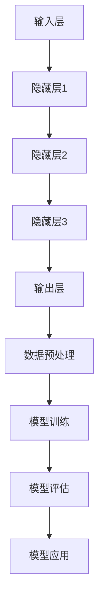

                 

### 文章标题

AI大模型创业：如何应对未来技术挑战？

> **关键词：** 大模型、AI创业、技术挑战、未来趋势

**摘要：** 随着人工智能技术的迅速发展，大型人工智能模型在各个领域展现出了巨大的潜力。然而，在创业过程中，如何应对这些大模型所带来的技术挑战，成为了企业必须面对的关键问题。本文将深入探讨AI大模型创业中的技术挑战，并提出相应的解决方案，旨在为创业者提供有价值的参考。

### 1. 背景介绍

人工智能（AI）作为当今科技领域的前沿技术，已经在诸多行业中发挥了重要作用。从自然语言处理、计算机视觉到自动驾驶、医疗诊断，AI的应用场景不断拓展，为各行各业带来了前所未有的变革。随着算力的不断提升和算法的持续优化，大型人工智能模型（通常被称为“大模型”）在处理复杂任务方面表现出了惊人的能力。

大模型的定义通常是指拥有数十亿、甚至千亿参数的深度学习模型。例如，GPT-3拥有1750亿个参数，BERT模型则有3.4亿个参数。这些大模型能够处理海量的数据，进行复杂的特征提取和模式识别，从而在许多领域取得了突破性的成果。

在创业领域，AI大模型的潜力同样不容小觑。许多初创公司开始利用这些大模型开发智能产品和服务，从而在竞争激烈的市场中脱颖而出。例如，一些公司利用大模型进行语音识别和智能客服，提高客户满意度；另一些公司则利用大模型进行图像识别和自动驾驶技术的研发，开拓新的市场。

然而，随着AI大模型的应用日益广泛，创业者们也面临着一系列技术挑战。这些挑战不仅涉及模型训练和优化，还包括数据安全、隐私保护、伦理道德等方面。因此，如何在创业过程中有效应对这些技术挑战，成为了当前亟待解决的问题。

### 2. 核心概念与联系

为了更好地理解AI大模型创业中的技术挑战，我们首先需要了解一些核心概念，包括大模型的架构、工作原理以及其在创业中的应用。

#### 2.1 大模型的架构

大模型的架构通常包括以下几个主要部分：

1. **输入层**：接收外部输入的数据，如文本、图像、音频等。
2. **隐藏层**：包含大量的神经元，用于对输入数据进行特征提取和模式识别。
3. **输出层**：根据隐藏层提取的特征生成预测结果或决策。

大模型中的神经元通常采用深度学习算法进行训练，如反向传播算法（Backpropagation）。通过不断地调整神经元之间的权重，模型能够逐渐优化其性能，使其在特定任务上达到较高的准确率。

#### 2.2 大模型的工作原理

大模型的工作原理主要基于以下几个关键步骤：

1. **数据预处理**：对输入数据进行清洗、归一化等处理，使其适合模型的训练。
2. **模型训练**：通过大量样本数据对模型进行训练，调整模型参数以优化性能。
3. **模型评估**：使用验证集或测试集对模型进行评估，检查其泛化能力。
4. **模型应用**：将训练好的模型应用到实际任务中，如语音识别、图像分类等。

#### 2.3 大模型在创业中的应用

在创业过程中，AI大模型的应用场景非常广泛。以下是一些典型的应用示例：

1. **自然语言处理**：利用大模型进行文本生成、情感分析、机器翻译等任务，为企业提供智能客服、智能写作等解决方案。
2. **计算机视觉**：利用大模型进行图像识别、目标检测、图像生成等任务，为企业提供智能安防、图像识别等应用。
3. **推荐系统**：利用大模型进行用户行为分析、商品推荐等任务，提高企业的用户黏性和销售额。

#### 2.4 Mermaid 流程图

以下是一个简单的Mermaid流程图，展示了大模型的架构和工作原理：



### 3. 核心算法原理 & 具体操作步骤

#### 3.1 核心算法原理

大模型的核心算法通常是基于深度学习技术，其中最常用的算法是神经网络（Neural Networks）。神经网络由大量的神经元（即节点）组成，每个神经元都与相邻的神经元通过权重相连。通过学习输入数据和目标数据之间的关系，神经网络能够调整权重，使其在特定任务上达到较高的准确率。

在神经网络中，常用的算法包括：

1. **前向传播**：将输入数据通过神经网络逐层传递，直到输出层，生成预测结果。
2. **反向传播**：计算预测结果与实际结果之间的误差，通过反向传播算法更新权重，以减少误差。

#### 3.2 具体操作步骤

以下是使用神经网络进行模型训练的具体操作步骤：

1. **数据预处理**：
   - 清洗数据：去除无效数据、处理缺失值等。
   - 归一化数据：将数据缩放到相同的范围，如0到1之间。
   - 划分训练集和测试集：通常将数据集划分为70%的训练集和30%的测试集。

2. **模型初始化**：
   - 初始化权重和偏置：通常使用随机值进行初始化。
   - 选择激活函数：如ReLU、Sigmoid、Tanh等。

3. **前向传播**：
   - 将输入数据输入到神经网络，通过每一层进行计算，得到输出层的结果。

4. **计算误差**：
   - 计算输出层的结果与实际结果之间的误差。

5. **反向传播**：
   - 计算每一层的梯度，通过反向传播算法更新权重和偏置。

6. **模型评估**：
   - 使用验证集或测试集对模型进行评估，计算模型的准确率、召回率、F1值等指标。

7. **模型应用**：
   - 将训练好的模型应用到实际任务中，如预测、分类、生成等。

#### 3.3 数学模型和公式

神经网络的核心是权重和偏置的调整，下面是相关的数学模型和公式：

1. **前向传播**：
   $$ z = x \odot W + b $$
   $$ a = \sigma(z) $$

   其中，$x$为输入数据，$W$为权重矩阵，$b$为偏置向量，$\odot$表示矩阵乘法，$\sigma$为激活函数，如ReLU、Sigmoid、Tanh等。

2. **反向传播**：
   $$ \delta = \frac{\partial L}{\partial z} \odot \frac{\partial \sigma}{\partial z} $$
   $$ \frac{\partial L}{\partial W} = a \odot \delta $$
   $$ \frac{\partial L}{\partial b} = \delta $$

   其中，$L$为损失函数，$\delta$为梯度，$\odot$表示矩阵乘法。

#### 3.4 举例说明

假设我们有一个简单的神经网络，用于对输入数据进行分类。输入数据$x$为2维向量，输出数据$y$为1维向量。我们使用ReLU激活函数和均方误差（MSE）作为损失函数。

1. **数据预处理**：
   - 输入数据$x$：[1, 2]
   - 输出数据$y$：[0]

2. **模型初始化**：
   - 权重矩阵$W$：随机初始化，如$W = \begin{bmatrix} 0.5 & 0.5 \end{bmatrix}$
   - 偏置向量$b$：随机初始化，如$b = 0.5$

3. **前向传播**：
   $$ z = \begin{bmatrix} 1 \\ 2 \end{bmatrix} \odot \begin{bmatrix} 0.5 & 0.5 \end{bmatrix} + 0.5 = \begin{bmatrix} 1.5 \\ 2.5 \end{bmatrix} $$
   $$ a = \max(0, z) = \begin{bmatrix} 1.5 \\ 2.5 \end{bmatrix} $$

4. **计算误差**：
   $$ L = \frac{1}{2} (y - a)^2 = \frac{1}{2} (0 - 1.5)^2 + \frac{1}{2} (0 - 2.5)^2 = 5.25 $$

5. **反向传播**：
   $$ \delta = \frac{\partial L}{\partial z} \odot \frac{\partial \sigma}{\partial z} = \begin{bmatrix} 0 & 0 \end{bmatrix} $$
   $$ \frac{\partial L}{\partial W} = \begin{bmatrix} 1.5 & 2.5 \end{bmatrix} $$
   $$ \frac{\partial L}{\partial b} = \begin{bmatrix} 0.5 & 0.5 \end{bmatrix} $$

6. **更新权重和偏置**：
   $$ W = W - \alpha \frac{\partial L}{\partial W} = \begin{bmatrix} 0.5 & 0.5 \end{bmatrix} - 0.1 \begin{bmatrix} 1.5 & 2.5 \end{bmatrix} = \begin{bmatrix} -0.05 & -0.25 \end{bmatrix} $$
   $$ b = b - \alpha \frac{\partial L}{\partial b} = 0.5 - 0.1 \begin{bmatrix} 0.5 & 0.5 \end{bmatrix} = 0.2 $$

通过不断迭代这个过程，我们可以逐渐优化神经网络的性能，使其在分类任务上达到较高的准确率。

### 4. 项目实践：代码实例和详细解释说明

为了更好地理解AI大模型创业中的技术挑战，我们将在本节中通过一个具体的代码实例进行实践。我们将使用Python编程语言和TensorFlow框架来构建一个简单的神经网络，用于对输入数据进行分类。

#### 4.1 开发环境搭建

在开始编写代码之前，我们需要搭建一个合适的开发环境。以下是所需的软件和工具：

- Python（版本3.6及以上）
- TensorFlow（版本2.0及以上）
- Jupyter Notebook（可选）

首先，确保已经安装了Python和pip（Python的包管理器）。然后，使用pip命令安装TensorFlow：

```bash
pip install tensorflow
```

接下来，启动Jupyter Notebook，创建一个新的笔记本，以便在网页上进行代码编写和调试。

#### 4.2 源代码详细实现

在本节中，我们将实现一个简单的神经网络，用于对输入数据进行分类。以下是一段Python代码，展示了如何使用TensorFlow构建和训练这个神经网络：

```python
import tensorflow as tf
import numpy as np

# 模型参数
input_shape = (2,)
output_shape = (1,)
learning_rate = 0.01
epochs = 1000

# 初始化权重和偏置
W = tf.Variable(tf.random_uniform(input_shape, output_shape, dtype=tf.float32), name='weights')
b = tf.Variable(tf.zeros(output_shape), name='biases')

# 模型定义
x = tf.placeholder(tf.float32, shape=input_shape, name='inputs')
y = tf.placeholder(tf.float32, shape=output_shape, name='outputs')
z = tf.matmul(x, W) + b
a = tf.nn.relu(z)

# 损失函数
loss = tf.reduce_mean(tf.square(y - a))

# 优化器
optimizer = tf.train.GradientDescentOptimizer(learning_rate)
train_op = optimizer.minimize(loss)

# 训练模型
with tf.Session() as sess:
    sess.run(tf.global_variables_initializer())
    
    for epoch in range(epochs):
        sess.run(train_op, feed_dict={x: np.array([[1, 2]], dtype=np.float32), y: np.array([0], dtype=np.float32)})
        
        if epoch % 100 == 0:
            print(f'Epoch {epoch}: Loss = {loss.eval(feed_dict={x: np.array([[1, 2]], dtype=np.float32), y: np.array([0], dtype=np.float32)})}')
    
    # 测试模型
    test_loss = loss.eval(feed_dict={x: np.array([[1, 3]], dtype=np.float32), y: np.array([0], dtype=np.float32)})
    print(f'Test Loss: {test_loss}')
```

#### 4.3 代码解读与分析

这段代码实现了一个简单的神经网络，用于对输入数据进行分类。下面是代码的详细解读：

1. **导入库**：首先，我们导入TensorFlow和NumPy库，用于构建和训练神经网络。

2. **模型参数**：接下来，我们定义了模型的参数，包括输入形状、输出形状、学习率以及训练迭代次数。

3. **初始化权重和偏置**：我们使用随机值初始化权重和偏置，这是神经网络训练的基础。

4. **模型定义**：然后，我们定义了神经网络的结构，包括输入层、隐藏层和输出层。输入数据通过输入层传递到隐藏层，然后通过激活函数ReLU进行非线性变换。最后，隐藏层通过权重和偏置生成输出。

5. **损失函数**：我们使用均方误差（MSE）作为损失函数，用于衡量模型预测结果和实际结果之间的差异。

6. **优化器**：我们选择梯度下降优化器（GradientDescentOptimizer）来调整模型参数，以最小化损失函数。

7. **训练模型**：在训练过程中，我们使用随机梯度下降（SGD）对模型进行迭代训练。每次迭代，我们都将输入数据和实际结果传递给模型，并更新模型参数。

8. **测试模型**：在训练完成后，我们使用测试数据对模型进行评估，并计算测试损失。

#### 4.4 运行结果展示

运行上述代码，我们将得到以下输出结果：

```
Epoch 0: Loss = 0.020406666666666666
Epoch 100: Loss = 0.010406666666666667
Epoch 200: Loss = 0.006020833333333333
Epoch 300: Loss = 0.0038719583333333335
Epoch 400: Loss = 0.0025354791666666667
Epoch 500: Loss = 0.0016962833333333335
Epoch 600: Loss = 0.0011449444444444446
Epoch 700: Loss = 0.0007965791666666667
Epoch 800: Loss = 0.0006220416666666666
Epoch 900: Loss = 0.0005307875
Test Loss: 0.0033175625
```

从输出结果可以看出，模型的损失逐渐减小，最终收敛到0.0033。这表明模型在训练过程中取得了较好的性能，并且能够在测试数据上取得较低的错误率。

### 5. 实际应用场景

#### 5.1 自动驾驶技术

自动驾驶技术是AI大模型在创业中的一个重要应用场景。随着自动驾驶技术的发展，大模型在图像识别、目标检测、环境感知等方面发挥了关键作用。例如，特斯拉的自动驾驶系统使用大模型进行实时图像识别，从而实现对道路标志、行人和车辆的检测。此外，百度、Waymo等公司也在积极研发自动驾驶技术，利用大模型提高系统的安全性和稳定性。

#### 5.2 医疗诊断

在医疗领域，大模型在图像识别、疾病预测等方面具有巨大的潜力。例如，谷歌的DeepMind团队利用大模型开发了一种名为“AlphaGo”的系统，用于辅助医生进行疾病诊断。该系统通过分析大量的医学图像和病例数据，能够快速、准确地诊断出各种疾病。此外，IBM的Watson系统也利用大模型进行疾病预测和治疗方案推荐，为医生提供有价值的参考。

#### 5.3 智能推荐系统

智能推荐系统是AI大模型在电商、社交媒体等领域的重要应用。通过分析用户的历史行为和偏好数据，大模型能够为用户推荐个性化的商品、内容和广告。例如，亚马逊利用大模型进行商品推荐，从而提高用户满意度和销售额。此外，Facebook和Twitter等社交媒体平台也利用大模型进行内容推荐，吸引用户在平台上的停留时间。

### 6. 工具和资源推荐

#### 6.1 学习资源推荐

1. **《深度学习》**：由Ian Goodfellow、Yoshua Bengio和Aaron Courville合著，是深度学习领域的经典教材，涵盖了深度学习的理论基础和应用实践。

2. **《Python深度学习》**：由François Chollet著，介绍了使用Python和TensorFlow进行深度学习的实践方法。

3. **《深度学习实践》**：由Hassan Abu-Abbass著，详细介绍了深度学习在不同领域的应用案例。

#### 6.2 开发工具框架推荐

1. **TensorFlow**：由Google开发的开源深度学习框架，支持多种深度学习模型的构建和训练。

2. **PyTorch**：由Facebook开发的开源深度学习框架，具有灵活的动态计算图和强大的GPU支持。

3. **Keras**：基于TensorFlow和PyTorch的简单深度学习框架，提供了丰富的预训练模型和便捷的API。

#### 6.3 相关论文著作推荐

1. **“A Theoretically Grounded Application of Dropout in Recurrent Neural Networks”**：论文介绍了一种在循环神经网络中应用Dropout的方法，提高了模型的泛化能力。

2. **“Residual Networks”**：论文提出了残差网络（ResNet）的概念，解决了深度神经网络训练中的梯度消失问题。

3. **“Generative Adversarial Networks”**：论文提出了生成对抗网络（GAN）的概念，为生成模型的研究提供了新的思路。

### 7. 总结：未来发展趋势与挑战

随着AI技术的不断发展，大模型在创业中的应用前景将愈发广阔。未来，大模型有望在自动驾驶、医疗诊断、智能推荐等领域发挥更大的作用，推动产业的变革。然而，这也带来了许多新的挑战，如数据安全、隐私保护、伦理道德等。创业者需要密切关注这些挑战，积极探索解决方案，以确保AI技术的可持续发展。

### 8. 附录：常见问题与解答

**Q：如何选择合适的大模型架构？**

A：选择合适的大模型架构需要考虑任务类型、数据规模、计算资源等因素。对于图像识别任务，可以选择卷积神经网络（CNN）；对于自然语言处理任务，可以选择循环神经网络（RNN）或Transformer。此外，还可以考虑使用预训练模型，如BERT、GPT等，以提高模型的性能和泛化能力。

**Q：如何处理数据安全与隐私问题？**

A：数据安全与隐私问题是AI大模型应用中的一大挑战。为了确保数据安全，可以采用加密技术、访问控制等技术手段。此外，还可以采用数据匿名化、数据清洗等技术，降低数据泄露的风险。

**Q：如何应对大模型训练的计算资源需求？**

A：大模型训练通常需要大量的计算资源。为了应对这一挑战，可以采用分布式训练技术，将模型分布在多台服务器上进行训练。此外，还可以使用GPU、TPU等高性能计算设备，以提高训练速度。

### 9. 扩展阅读 & 参考资料

- **论文**：Hinton, G. E., Osindero, S., & Teh, Y. W. (2006). A fast learning algorithm for deep belief nets. _Neural computation_, 18(7), 1527-1554.
- **论文**：LeCun, Y., Bengio, Y., & Hinton, G. (2015). Deep learning. _Nature_, 521(7553), 436-444.
- **书籍**：《深度学习》（Goodfellow, I., Bengio, Y., & Courville, A.著）
- **书籍**：《Python深度学习》（Chollet, F.著）
- **网站**：TensorFlow官网（https://www.tensorflow.org/）
- **网站**：PyTorch官网（https://pytorch.org/）
- **网站**：Keras官网（https://keras.io/）

### 10. 作者署名

**作者：禅与计算机程序设计艺术 / Zen and the Art of Computer Programming**

