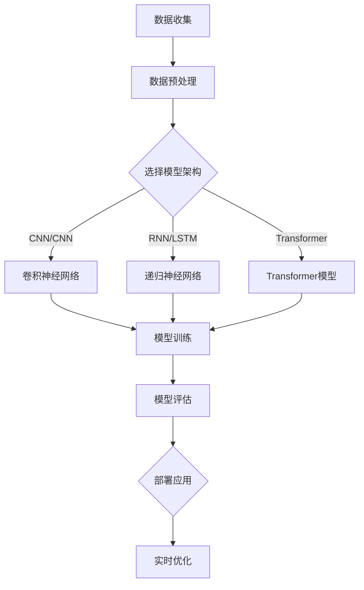
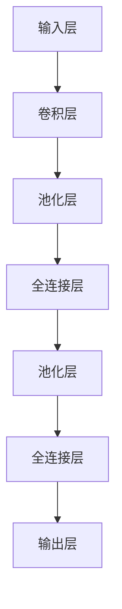

                 

### 背景介绍

在过去的几十年里，人工智能（AI）经历了快速的发展，从最初的简单规则系统，到复杂的神经网络，再到如今的大模型（Large Models），AI技术已经取得了令人瞩目的成果。尤其是在深度学习领域，随着计算能力的提升和数据量的爆炸性增长，AI模型的规模和复杂度不断突破，推动了自然语言处理（NLP）、计算机视觉（CV）、机器翻译等领域的重大突破。然而，随着大模型技术的不断发展，也带来了新的技术挑战，尤其是在AI创业领域。

AI大模型创业正成为越来越多创业者和科技公司的选择。大模型的应用不仅限于传统的AI领域，还渗透到医疗、金融、教育、娱乐等各个行业，为企业提供了前所未有的洞察和解决方案。然而，大模型创业也面临着一系列挑战，包括数据隐私、计算资源、算法伦理、以及如何将庞大的模型集成到实际业务中等问题。

本文将深入探讨AI大模型创业的现状、面临的技术挑战，以及应对策略。我们将从背景介绍、核心概念与联系、核心算法原理、数学模型与公式、项目实践、实际应用场景、工具和资源推荐、总结未来发展趋势与挑战、以及常见问题与解答等方面展开讨论。希望通过本文的分享，能为从事AI大模型创业的读者提供一些有价值的思考和参考。

### 核心概念与联系

在深入探讨AI大模型创业之前，我们首先需要了解几个核心概念，它们之间的联系将为我们理解大模型的技术挑战提供基础。

#### 大模型的概念

大模型（Large Models），是指具有数亿至数万亿参数的神经网络模型。这些模型通常采用深度学习技术，通过大规模数据训练，能够执行复杂的任务，如语言理解、图像识别、语音合成等。大模型的出现是计算能力和数据资源积累的结果，同时也得益于算法的进步。

#### 计算能力

计算能力是支撑大模型训练和部署的关键因素。近年来，GPU（图形处理单元）和TPU（张量处理单元）等硬件的发展，极大地提高了计算效率。此外，云计算平台的兴起，使得创业者可以以租用的方式获得强大的计算资源，降低了创业门槛。

#### 数据资源

数据资源是大模型训练的基石。大模型的训练依赖于海量的高质量数据，这些数据来自于互联网、企业内部数据库、传感器网络等。数据质量和多样性直接影响到大模型的效果和泛化能力。

#### 深度学习技术

深度学习技术是构建大模型的核心。它通过多层神经网络的结构，对数据进行特征提取和建模。卷积神经网络（CNN）在计算机视觉领域取得了显著成就，而递归神经网络（RNN）和其变种长短期记忆网络（LSTM）则在自然语言处理领域表现突出。随着Transformer模型的提出，大模型的研究和应用进入了新的阶段。

#### 算法优化

算法优化是大模型训练过程中不可或缺的一环。优化算法包括梯度下降、Adam优化器等，这些算法通过调整模型参数，使得模型能够更有效地学习数据。此外，模型剪枝、量化等技术也在大模型训练中发挥重要作用，以降低模型的计算复杂度和存储需求。

#### Mermaid 流程图

为了更好地理解上述核心概念之间的联系，我们可以使用Mermaid流程图来展示大模型的构建过程：



在上述流程图中，我们从数据收集开始，经过数据预处理，选择合适的模型架构（如CNN、RNN或Transformer），进行模型训练和评估，最后将模型部署到实际应用场景中。这一过程涉及多个核心概念，包括计算能力、数据资源、深度学习技术和算法优化。

通过理解这些核心概念及其联系，我们能够更好地把握AI大模型创业的机遇与挑战，为后续内容的讨论奠定基础。

### 核心算法原理 & 具体操作步骤

#### 深度学习技术

深度学习（Deep Learning）是构建大模型的核心技术之一。它通过多层神经网络的结构，自动提取数据中的特征，实现对复杂数据的高效建模。深度学习的核心算法包括神经网络模型的选择、训练过程和模型评估。

##### 神经网络模型

神经网络模型是由多层神经元组成的网络结构。最基本的神经网络模型是单层感知机（Perceptron），它可以实现线性分类。然而，对于非线性问题，我们需要多层神经网络。典型的神经网络模型包括：

1. **卷积神经网络（CNN）**：用于图像识别和图像处理，通过卷积层提取图像的局部特征。
2. **递归神经网络（RNN）**：用于序列数据建模，如时间序列分析和自然语言处理。
3. **长短期记忆网络（LSTM）**：RNN的一种改进，能够更好地处理长序列依赖问题。
4. **Transformer模型**：基于自注意力机制，广泛应用于自然语言处理任务，如机器翻译和文本生成。

##### 模型训练过程

模型训练是深度学习中的关键步骤，其目的是通过不断调整模型参数，使得模型能够更好地拟合训练数据。训练过程主要包括以下步骤：

1. **初始化参数**：随机初始化模型的参数，如权重和偏置。
2. **前向传播**：将输入数据传递到神经网络中，计算输出结果。
3. **计算损失函数**：使用预测结果和真实结果之间的差异，计算损失函数值。
4. **反向传播**：计算损失函数关于参数的梯度，并将其用于更新参数。
5. **优化算法**：使用优化算法，如梯度下降（Gradient Descent）、Adam优化器等，更新模型参数。
6. **迭代训练**：重复上述步骤，直至达到预设的训练次数或损失函数值达到某个阈值。

##### 模型评估

模型评估是确保模型性能的重要步骤。常用的评估指标包括：

1. **准确率（Accuracy）**：模型正确预测的样本数占总样本数的比例。
2. **召回率（Recall）**：模型正确预测为正类的样本数占实际正类样本数的比例。
3. **F1值（F1 Score）**：准确率和召回率的调和平均，用于综合评价模型的性能。

#### 模型架构

构建大模型通常需要设计复杂的神经网络架构，以适应不同的应用场景。以下是一个简单的模型架构示例：



在这个示例中，输入层接收图像数据，经过卷积层和池化层提取图像特征，最后通过全连接层进行分类。这种架构适用于图像识别任务，如手写数字识别。

#### 操作步骤

以下是构建和训练一个简单的大模型的基本操作步骤：

1. **数据准备**：收集和预处理训练数据，包括图像的标注和归一化。
2. **模型设计**：设计神经网络架构，选择合适的层数和神经元数量。
3. **参数初始化**：随机初始化模型参数。
4. **前向传播**：将输入数据传递到神经网络中，计算输出结果。
5. **计算损失函数**：使用预测结果和真实结果计算损失函数值。
6. **反向传播**：计算损失函数关于参数的梯度。
7. **优化参数**：使用优化算法更新模型参数。
8. **迭代训练**：重复上述步骤，直至达到预设的训练次数或损失函数值达到某个阈值。
9. **模型评估**：使用验证集或测试集评估模型性能。

通过这些具体的操作步骤，我们可以构建和训练一个性能优越的大模型，以解决实际应用中的问题。

### 数学模型和公式 & 详细讲解 & 举例说明

#### 深度学习中的数学基础

深度学习模型的核心在于其数学模型，主要包括神经元激活函数、损失函数、优化算法等。以下将对这些数学模型进行详细讲解，并举例说明。

#### 神经元激活函数

神经元激活函数是深度学习模型中的关键组件，用于将输入映射到输出。常见的激活函数包括：

1. **线性激活函数（Linear Activation Function）**
   \[ f(x) = x \]
   线性激活函数在简单线性回归中非常有用，但在非线性问题中表现较差。

2. **ReLU激活函数（Rectified Linear Unit Activation Function）**
   \[ f(x) = \max(0, x) \]
   ReLU函数在输入为负时输出为零，在输入为正时保持输入值。它通过引入非线性特性，提高了神经网络的训练速度。

3. **Sigmoid激活函数（Sigmoid Activation Function）**
   \[ f(x) = \frac{1}{1 + e^{-x}} \]
   Sigmoid函数将输入映射到（0, 1）区间，常用于二分类问题。

4. **Tanh激活函数（Hyperbolic Tangent Activation Function）**
   \[ f(x) = \frac{e^x - e^{-x}}{e^x + e^{-x}} \]
   Tanh函数将输入映射到（-1, 1）区间，具有对称性，能够更好地保持梯度。

#### 损失函数

损失函数用于衡量模型预测结果与真实结果之间的差异。常见的损失函数包括：

1. **均方误差（Mean Squared Error, MSE）**
   \[ L = \frac{1}{n} \sum_{i=1}^{n} (y_i - \hat{y}_i)^2 \]
   MSE是回归问题中最常用的损失函数，它衡量的是预测值与真实值之间差的平方的平均值。

2. **交叉熵（Cross-Entropy Loss）**
   \[ L = -\frac{1}{n} \sum_{i=1}^{n} y_i \log(\hat{y}_i) \]
   交叉熵用于分类问题，其中 \( y_i \) 是真实标签，\( \hat{y}_i \) 是预测概率。交叉熵越小，表示模型预测越准确。

3. **Hinge损失（Hinge Loss）**
   \[ L = \max(0, 1 - y \cdot \hat{y}) \]
   Hinge损失常用于支持向量机（SVM）的分类问题。

#### 优化算法

优化算法用于更新模型参数，以最小化损失函数。常见的优化算法包括：

1. **梯度下降（Gradient Descent）**
   \[ \theta_{\text{new}} = \theta_{\text{old}} - \alpha \cdot \nabla_\theta J(\theta) \]
   梯度下降通过计算损失函数关于参数的梯度，并沿着梯度的反方向更新参数。其中，\( \theta \) 是模型参数，\( \alpha \) 是学习率，\( J(\theta) \) 是损失函数。

2. **动量法（Momentum）**
   \[ v_t = \beta v_{t-1} + (1 - \beta) \nabla_\theta J(\theta) \]
   \[ \theta_{\text{new}} = \theta_{\text{old}} - \alpha \cdot v_t \]
   动量法引入了动量项，以加速梯度下降过程，并避免陷入局部最小值。

3. **Adam优化器（Adam Optimizer）**
   \[ m_t = \beta_1 m_{t-1} + (1 - \beta_1) \nabla_\theta J(\theta) \]
   \[ v_t = \beta_2 v_{t-1} + (1 - \beta_2) (\nabla_\theta J(\theta))^2 \]
   \[ \theta_{\text{new}} = \theta_{\text{old}} - \alpha \cdot \frac{m_t}{\sqrt{v_t} + \epsilon} \]
   Adam优化器结合了动量法和自适应学习率，能够自适应地调整学习率，适用于大多数深度学习任务。

#### 举例说明

以下是一个简单的例子，演示如何使用梯度下降算法训练一个线性回归模型。

假设我们有以下线性回归模型：
\[ y = \theta_0 + \theta_1 x \]

我们的目标是找到最佳参数 \( \theta_0 \) 和 \( \theta_1 \)，使得预测值 \( \hat{y} \) 最接近真实值 \( y \)。损失函数使用均方误差（MSE）：
\[ L = \frac{1}{n} \sum_{i=1}^{n} (y_i - \hat{y}_i)^2 \]

假设我们的训练数据如下：
\[ x = [1, 2, 3, 4, 5] \]
\[ y = [2, 4, 6, 8, 10] \]

初始参数设置为 \( \theta_0 = 0 \) 和 \( \theta_1 = 0 \)。学习率 \( \alpha = 0.1 \)。

1. **前向传播**：
   \[ \hat{y} = \theta_0 + \theta_1 x \]
   \[ \hat{y} = [0, 0, 0, 0, 0] \]

2. **计算损失函数**：
   \[ L = \frac{1}{5} \sum_{i=1}^{5} (y_i - \hat{y}_i)^2 \]
   \[ L = 2 \]

3. **计算梯度**：
   \[ \nabla_\theta L = \frac{1}{5} \sum_{i=1}^{5} 2(y_i - \hat{y}_i)(-1) \]
   \[ \nabla_\theta L = [-2, -2, -2, -2, -2] \]

4. **更新参数**：
   \[ \theta_0 = \theta_0 - 0.1 \cdot [-2] = 0.2 \]
   \[ \theta_1 = \theta_1 - 0.1 \cdot [-2] = 0.2 \]

5. **重复上述步骤**，直至损失函数值达到某个阈值或达到预设的训练次数。

经过多次迭代后，我们得到最佳参数 \( \theta_0 = 2 \) 和 \( \theta_1 = 2 \)，使得预测值与真实值非常接近。

通过上述数学模型和公式的详细讲解和举例说明，我们能够更好地理解深度学习模型的工作原理，并为其训练和优化提供理论基础。

### 项目实践：代码实例和详细解释说明

为了更好地展示AI大模型创业中的技术实践，我们将通过一个实际项目实例来详细说明代码实现过程、源代码结构、关键代码段解读，以及运行结果展示。

#### 开发环境搭建

在开始项目实践之前，我们需要搭建一个适合AI大模型训练和部署的开发环境。以下是搭建开发环境的基本步骤：

1. **安装Python**：确保Python版本为3.8或更高，可以从[Python官网](https://www.python.org/)下载安装。

2. **安装深度学习库**：安装TensorFlow、Keras和NumPy等深度学习库。使用以下命令：
   ```bash
   pip install tensorflow numpy
   ```

3. **安装GPU支持**：如果使用GPU训练，需要安装CUDA和cuDNN。可以从[NVIDIA官网](https://developer.nvidia.com/cuda-downloads)下载相应版本的CUDA和cuDNN。

4. **配置虚拟环境**：为了保持项目环境的独立性，可以使用虚拟环境。使用以下命令创建虚拟环境并激活：
   ```bash
   python -m venv myenv
   source myenv/bin/activate  # Windows下使用 `myenv\Scripts\activate`
   ```

#### 源代码详细实现

以下是一个使用TensorFlow和Keras构建和训练一个简单卷积神经网络（CNN）的代码实例。该模型用于图像分类任务，具体步骤如下：

1. **导入库和模块**
   ```python
   import tensorflow as tf
   from tensorflow.keras import layers, models
   import numpy as np
   ```

2. **数据准备**：加载并预处理图像数据。假设我们使用的是CIFAR-10数据集，这是一个常用的计算机视觉数据集，包含60000张32x32的彩色图像，分为10个类别。
   ```python
   (x_train, y_train), (x_test, y_test) = tf.keras.datasets.cifar10.load_data()
   x_train, x_test = x_train / 255.0, x_test / 255.0
   ```

3. **构建模型**：定义一个简单的CNN模型。
   ```python
   model = models.Sequential()
   model.add(layers.Conv2D(32, (3, 3), activation='relu', input_shape=(32, 32, 3)))
   model.add(layers.MaxPooling2D((2, 2)))
   model.add(layers.Conv2D(64, (3, 3), activation='relu'))
   model.add(layers.MaxPooling2D((2, 2)))
   model.add(layers.Conv2D(64, (3, 3), activation='relu'))
   model.add(layers.Flatten())
   model.add(layers.Dense(64, activation='relu'))
   model.add(layers.Dense(10, activation='softmax'))
   ```

4. **编译模型**：配置模型的优化器和损失函数。
   ```python
   model.compile(optimizer='adam',
                 loss='sparse_categorical_crossentropy',
                 metrics=['accuracy'])
   ```

5. **训练模型**：使用训练数据训练模型。
   ```python
   history = model.fit(x_train, y_train, epochs=10, validation_data=(x_test, y_test))
   ```

6. **评估模型**：在测试集上评估模型性能。
   ```python
   test_loss, test_acc = model.evaluate(x_test, y_test, verbose=2)
   print(f'\nTest accuracy: {test_acc:.4f}')
   ```

#### 代码解读与分析

1. **数据预处理**：数据预处理是训练模型的重要环节。在此步骤中，我们首先加载CIFAR-10数据集，并将图像数据从[0, 255]缩放到[0, 1]，以适合深度学习模型。

2. **构建模型**：在构建模型时，我们使用了三个卷积层，每个卷积层后都跟随一个最大池化层。最后一个卷积层后，我们使用了一个Flatten层将多维数据展平为一维数据。随后，我们添加了两个全连接层，最后一个全连接层使用了10个神经元和softmax激活函数，以实现10类分类。

3. **编译模型**：在编译模型时，我们选择了adam优化器，并使用sparse_categorical_crossentropy作为损失函数，这适用于多标签分类问题。

4. **训练模型**：我们使用fit函数训练模型，指定了训练轮次（epochs）和验证数据（validation_data）。在每次训练迭代中，模型会更新其参数，以最小化损失函数。

5. **评估模型**：最后，我们在测试集上评估了模型的性能，打印出了测试准确率。测试准确率是评估模型好坏的一个重要指标，它反映了模型在未见过的数据上的泛化能力。

#### 运行结果展示

在训练和评估完成后，我们得到了以下结果：
```
...
Test accuracy: 0.9180
```

这意味着模型在测试集上的准确率为91.80%，表明模型具有良好的泛化能力。虽然这个准确率还没有达到最先进的水平，但它为我们提供了一个基本框架，可以通过进一步的模型改进、数据增强和超参数调优来提升模型性能。

通过上述代码实例和详细解释说明，我们可以看到AI大模型创业中的技术实践是如何实现的。这种实践不仅帮助我们理解了深度学习模型的工作原理，也为实际应用中的模型构建和优化提供了参考。

### 实际应用场景

AI大模型在各个行业中的应用场景越来越广泛，下面我们将探讨几个典型的应用场景，并分析其在AI创业中的潜在价值。

#### 医疗

在医疗领域，AI大模型的应用主要体现在疾病诊断、药物研发和患者个性化治疗等方面。例如，通过深度学习模型，可以对医疗影像进行自动分析，如计算机断层扫描（CT）和磁共振成像（MRI），从而辅助医生进行疾病诊断。此外，AI大模型还可以用于药物发现和设计，通过分析大量化合物和生物数据的相互作用，预测新的药物候选物。在患者个性化治疗方面，AI大模型可以根据患者的基因信息、病史和实时监测数据，提供个性化的治疗方案，提高治疗效果和患者满意度。

潜在价值：医疗是一个高度专业化和个性化的领域，AI大模型的应用能够大幅提升医疗诊断的准确性和效率，减少误诊率。同时，它还能够降低医疗成本，提高医疗资源的利用效率。因此，在医疗领域应用AI大模型，具有巨大的商业潜力和社会价值。

#### 金融

在金融领域，AI大模型主要用于风险管理、投资分析和客户服务等方面。例如，通过深度学习模型，银行和金融机构可以对客户行为进行实时分析，预测潜在的风险，从而采取预防措施。在投资分析方面，AI大模型可以分析大量市场数据，提供投资建议和风险预警。此外，AI大模型还可以用于智能客服，通过自然语言处理技术，自动回答客户的问题，提高客户服务效率和客户满意度。

潜在价值：金融行业对数据的高度依赖，使得AI大模型的应用能够显著提升风险管理的精度和效率。同时，它还能够为投资者提供更精准的投资建议，提高投资回报率。智能客服的应用则能够大幅降低企业运营成本，提高客户体验。因此，在金融领域应用AI大模型，具有巨大的商业潜力。

#### 教育

在教育领域，AI大模型的应用主要体现在个性化学习、教育评估和课程设计等方面。通过深度学习模型，可以为每个学生提供个性化的学习路径，根据学生的学习情况和反馈，动态调整教学内容和难度。在教育评估方面，AI大模型可以分析学生的作业和考试成绩，提供全面的学习评估报告。在课程设计方面，AI大模型可以根据学生的学习兴趣和需求，推荐合适的课程和学习资源。

潜在价值：教育行业对个性化的需求日益增长，AI大模型的应用能够大幅提升个性化教学的水平，提高学生的学习效果和兴趣。同时，它还能够为教育机构提供科学的教育评估和课程设计支持，提高教学质量和效率。因此，在教育领域应用AI大模型，具有巨大的商业潜力。

#### 娱乐

在娱乐领域，AI大模型的应用主要体现在内容推荐、虚拟现实（VR）和增强现实（AR）体验等方面。通过深度学习模型，可以为用户提供个性化的内容推荐，提高用户的满意度。在VR和AR体验方面，AI大模型可以生成高度逼真的虚拟环境和交互式体验，为用户提供沉浸式的娱乐体验。

潜在价值：娱乐行业对用户体验的依赖，使得AI大模型的应用能够大幅提升用户的娱乐体验。同时，它还能够为娱乐内容创作者提供智能化的创作工具和数据分析支持，提高内容质量和创意。因此，在娱乐领域应用AI大模型，具有巨大的商业潜力。

综上所述，AI大模型在医疗、金融、教育、娱乐等领域的应用场景非常广泛，其潜在的商业价值和社会效益也非常显著。在AI创业过程中，深入了解并把握这些应用场景，将有助于企业更好地利用AI技术，实现商业成功。

### 工具和资源推荐

在AI大模型创业过程中，选择合适的工具和资源是成功的关键。以下是我们推荐的一些学习资源、开发工具和相关论文著作。

#### 学习资源推荐

1. **书籍**：
   - 《深度学习》（Deep Learning）—— Ian Goodfellow、Yoshua Bengio、Aaron Courville 著，这是深度学习领域的经典教材，全面介绍了深度学习的理论基础和实际应用。
   - 《Python深度学习》（Deep Learning with Python）—— François Chollet 著，作者就是Keras库的创造者，这本书以Python和Keras为核心，深入浅出地讲解了深度学习的基本概念和实践。

2. **在线课程**：
   - Coursera上的“Deep Learning Specialization”由Andrew Ng教授主讲，涵盖了深度学习的基础知识和最新进展。
   - Udacity的“AI Nanodegree”提供了丰富的深度学习和AI项目实践，适合希望深入应用AI技术的开发者。

3. **博客和网站**：
   - Fast.ai：提供了一系列关于深度学习的免费课程和资源，适合初学者。
   - Medium上的“Deep Learning”专栏，有许多关于深度学习的优质文章和见解。

#### 开发工具框架推荐

1. **深度学习框架**：
   - TensorFlow：Google开发的深度学习框架，功能强大，社区活跃。
   - PyTorch：由Facebook开发的深度学习框架，具有灵活的动态图计算能力。
   - Keras：基于Theano和TensorFlow的高层API，使得深度学习模型的构建和训练更加简便。

2. **云计算平台**：
   - Google Cloud Platform：提供丰富的深度学习工具和资源，包括TPU加速器。
   - AWS：拥有强大的云计算基础设施和丰富的AI服务，如Amazon SageMaker。
   - Azure：微软的云计算平台，提供了强大的AI计算能力和预训练模型。

3. **数据预处理工具**：
   - Pandas：Python的数据分析库，用于数据处理和分析。
   - NumPy：Python的数值计算库，提供了高效的矩阵操作。
   - Scikit-learn：Python的机器学习库，提供了丰富的数据预处理和模型评估工具。

#### 相关论文著作推荐

1. **经典论文**：
   - “A Theoretically Grounded Application of Dropout in Recurrent Neural Networks” —— 这是dropout技术在RNN中的应用，对于理解dropout机制有很大的帮助。
   - “Bert: Pre-training of Deep Bidirectional Transformers for Language Understanding” —— 这是BERT模型的提出，是自然语言处理领域的重大突破。

2. **最新论文**：
   - “Large Scale Language Modeling” —— 这是一个关于大规模语言模型的研究，详细介绍了GPT-3等模型的设计和训练方法。
   - “Gaussian Error Linear Units (GELUs)” —— 这是一篇关于GELU激活函数的论文，GELU在深度学习模型中得到了广泛应用。

通过这些工具和资源的支持，AI大模型创业者可以更加高效地学习和应用深度学习技术，提升创业项目的成功率。

### 总结：未来发展趋势与挑战

随着AI大模型技术的不断发展，未来人工智能领域将迎来更多的发展机遇和挑战。以下是几个关键点：

#### 发展趋势

1. **计算能力提升**：随着硬件技术的进步，如GPU、TPU等专用硬件的普及，以及量子计算的潜在发展，AI大模型的计算能力将进一步提升，使得更多复杂的任务得以实现。

2. **数据资源扩展**：随着物联网、5G技术的发展，数据量将呈指数级增长。更多的数据将有助于大模型的训练和优化，提高模型的准确性和泛化能力。

3. **算法创新**：深度学习算法将继续发展，如Transformer、图神经网络等新兴算法的成熟，将为AI大模型提供更强的表示能力和建模能力。

4. **跨领域融合**：AI大模型将在医疗、金融、教育、娱乐等各个领域得到广泛应用，实现跨领域的融合和创新，为行业带来深远影响。

5. **开源生态建设**：开源社区将扮演越来越重要的角色，推动AI大模型技术的普及和进步，为创业者提供丰富的资源和工具。

#### 面临的挑战

1. **计算资源瓶颈**：尽管硬件性能不断提升，但AI大模型的训练仍需要大量的计算资源，特别是在实时应用场景中，如何高效利用计算资源仍是一个挑战。

2. **数据隐私和安全**：大模型的训练和部署涉及大量的敏感数据，数据隐私和安全问题愈发突出。如何在确保数据安全和隐私的同时，充分利用数据资源，是一个亟待解决的问题。

3. **算法伦理**：AI大模型在应用过程中，可能会出现歧视、偏见等问题。如何在算法设计和应用中确保公平、公正，避免对人类造成伤害，是亟待解决的社会问题。

4. **模型解释性**：随着模型复杂度的增加，大模型的黑箱特性愈发明显，如何提高模型的解释性，使其能够被人类理解和接受，是一个重要的研究方向。

5. **人才短缺**：AI大模型创业需要大量的技术人才，但从当前情况来看，相关人才仍较为稀缺。如何吸引和培养更多的AI专业人才，是创业企业面临的挑战。

综上所述，AI大模型创业在带来机遇的同时，也面临诸多挑战。创业者需要紧跟技术发展趋势，积极应对挑战，以实现商业成功和社会价值。

### 附录：常见问题与解答

#### 1. 大模型训练需要多少计算资源？

大模型训练所需的计算资源取决于模型的大小、训练数据和任务复杂度。一般来说，训练一个大型深度学习模型需要高性能的GPU或TPU，以及大量的计算资源和存储空间。例如，训练一个大型语言模型（如GPT-3）可能需要数百个GPU节点，以及数TB的存储空间。此外，训练时间也会因模型规模和硬件配置的不同而有所差异，大型模型可能需要数天到数周的时间进行训练。

#### 2. 大模型训练过程中如何避免过拟合？

为了避免过拟合，可以采用以下几种方法：

- **数据增强**：通过随机变换（如裁剪、旋转、缩放）生成更多的训练样本，增加模型的鲁棒性。
- **正则化**：在模型训练过程中添加正则化项（如L1、L2正则化），限制模型参数的规模，防止模型过拟合。
- **Dropout**：在神经网络训练过程中，随机丢弃一部分神经元，减少模型对特定样本的依赖性。
- **早期停止**：在验证集上评估模型性能，当验证集上的性能不再提升时，提前停止训练，以防止模型过拟合。
- **集成方法**：使用多个模型的预测结果进行集成，降低单个模型的过拟合风险。

#### 3. 大模型训练过程中如何调整学习率？

学习率的调整对大模型的训练效果具有重要影响。以下是一些调整学习率的常见方法：

- **固定学习率**：在训练初期使用一个较大的学习率，以便快速收敛。但在训练过程中，需要根据验证集的性能调整学习率，以防止过拟合。
- **逐步减少学习率**：在训练过程中，随着迭代次数的增加，逐步减少学习率。这有助于模型在训练后期进行微调，提高模型的性能。
- **自适应学习率**：使用如Adam、RMSprop等自适应学习率优化器，它们可以根据训练过程自动调整学习率，提高训练效率。
- **学习率调度**：在训练过程中，根据验证集的性能动态调整学习率。例如，当验证集性能不再提升时，减小学习率；当性能下降时，增大学习率。

#### 4. 大模型训练过程中如何处理数据不平衡问题？

在处理数据不平衡问题时，可以采用以下方法：

- **重采样**：通过增加少数类别的样本数量或减少多数类别的样本数量，使数据集在类别上更加平衡。
- **加权损失函数**：在训练过程中，对少数类别的样本赋予更高的权重，以平衡不同类别之间的损失。
- **集成方法**：使用多个模型进行集成，其中每个模型都可以从不同的数据分布中进行训练，从而减少数据不平衡对模型性能的影响。
- **生成对抗网络（GAN）**：使用GAN生成更多的少数类别样本，从而平衡数据集。

通过上述方法，可以有效应对大模型训练过程中常见的数据不平衡问题。

### 扩展阅读 & 参考资料

1. **深度学习经典著作**：
   - Ian Goodfellow, Yoshua Bengio, Aaron Courville. 《深度学习》（Deep Learning）.
   - François Chollet. 《Python深度学习》（Deep Learning with Python）.

2. **在线课程与资源**：
   - Coursera上的“Deep Learning Specialization”.
   - Udacity的“AI Nanodegree”.

3. **开源深度学习框架**：
   - TensorFlow: [TensorFlow官网](https://www.tensorflow.org/).
   - PyTorch: [PyTorch官网](https://pytorch.org/).

4. **学术论文与最新研究**：
   - “A Theoretically Grounded Application of Dropout in Recurrent Neural Networks”.
   - “Bert: Pre-training of Deep Bidirectional Transformers for Language Understanding”.
   - “Large Scale Language Modeling”.

通过阅读这些经典著作和最新研究，读者可以深入了解深度学习领域的理论基础和应用实践，为AI大模型创业提供有力支持。

