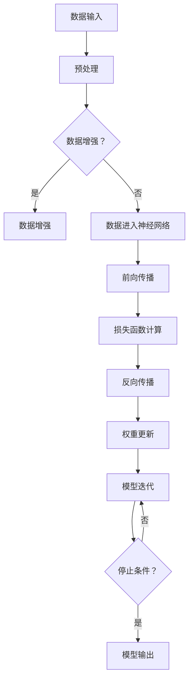

                 

### 1. 背景介绍

近年来，随着计算能力的提升、数据量的爆炸式增长以及深度学习技术的迅猛发展，人工智能（AI）已经成为科技领域的热点。特别是在生成式AI模型方面，如GPT-3、ChatGLM等大模型的出现，标志着AI进入了一个全新的时代。这些大模型不仅在自然语言处理、计算机视觉、语音识别等领域表现出色，还逐渐渗透到各行各业，推动着产业的变革。

在商业领域，AI大模型的应用为创业者提供了前所未有的机遇。一方面，大模型使得个性化推荐、智能客服、自然语言理解等应用变得更加智能和高效；另一方面，AI大模型也降低了创新门槛，让更多中小企业甚至个人创业者能够参与到AI技术的研究和开发中来。

然而，AI大模型的发展也伴随着一系列挑战。首先是计算资源的消耗问题，大模型的训练和推理需要大量的计算资源，这对基础设施提出了更高的要求。其次是数据隐私和安全性问题，AI模型的训练依赖于大量的数据，这些数据的隐私和安全保护成为亟待解决的问题。此外，AI大模型的应用也引发了社会对AI伦理和道德的讨论，如何确保AI系统的公平性和透明性是创业者在开发AI产品时必须面对的挑战。

本文将围绕AI大模型的创业机会和挑战展开讨论，分析大模型的核心技术、创业路径、潜在风险以及未来发展趋势，旨在为创业者提供一些实用的建议和指导。我们将从以下几个方面展开：

1. **核心概念与联系**：介绍AI大模型的基本概念和架构，通过Mermaid流程图展示其原理和组成。
2. **核心算法原理 & 具体操作步骤**：详细解析大模型的工作原理和训练过程，提供具体的操作步骤。
3. **数学模型和公式**：介绍大模型中常用的数学模型和公式，并举例说明。
4. **项目实践**：通过代码实例展示如何实现一个简单的AI大模型，并进行详细解读和分析。
5. **实际应用场景**：探讨AI大模型在不同行业中的应用，分析其带来的影响和挑战。
6. **工具和资源推荐**：推荐一些学习和开发AI大模型的有用资源。
7. **总结**：总结AI大模型创业的机遇和挑战，展望未来发展趋势。

通过本文的逐步分析，我们希望帮助读者深入了解AI大模型，掌握其核心技术，并能够应对未来创业中的各种挑战。

### 2. 核心概念与联系

在深入了解AI大模型之前，我们需要先明确几个核心概念，并理解它们之间的相互联系。以下是AI大模型的一些关键组成部分和基本原理：

#### 2.1 大模型（Large Models）

**定义**：大模型是指那些参数数量达到数十亿甚至数万亿的深度学习模型。例如，GPT-3有1750亿个参数，ChatGLM拥有千亿级参数。

**原理**：大模型的强大性能来自于其庞大的参数量，这使得模型能够捕捉到数据中的细微模式和复杂的分布。

#### 2.2 深度学习（Deep Learning）

**定义**：深度学习是一种机器学习方法，它通过多层神经网络对数据进行建模，从而实现复杂的模式识别和特征提取。

**原理**：深度学习模型通过逐层学习，将输入数据映射到高层次的抽象表示，从而提高模型的泛化能力。

#### 2.3 神经网络（Neural Networks）

**定义**：神经网络是一种模拟生物神经系统的计算模型，由大量相互连接的神经元组成。

**原理**：神经网络通过前向传播和反向传播算法，不断调整权重，以达到对数据的最佳拟合。

#### 2.4 注意力机制（Attention Mechanism）

**定义**：注意力机制是一种让模型在某些特定部分更加关注的方法。

**原理**：通过注意力机制，模型可以在处理输入数据时动态调整对不同部分的关注程度，从而提高模型的性能。

#### 2.5 数据增强（Data Augmentation）

**定义**：数据增强是一种通过变换原始数据来扩充数据集的方法。

**原理**：数据增强可以帮助模型更好地泛化，减少对训练数据的依赖，提高模型的鲁棒性。

#### 2.6 超参数（Hyperparameters）

**定义**：超参数是模型训练过程中人为设定的参数，如学习率、批量大小等。

**原理**：超参数的选择对模型的性能有重要影响，需要通过实验和调优来找到最佳值。

#### 2.7 Mermaid 流程图

下面通过一个Mermaid流程图来展示AI大模型的基本架构和原理：



**说明**：

- **A. 数据输入**：模型接收输入数据，如文本、图像等。
- **B. 预处理**：对输入数据进行预处理，如文本分词、图像归一化等。
- **C. 数据增强**：判断是否进行数据增强，以扩充数据集。
- **D. 数据增强**：具体的数据增强操作，如图像旋转、文本替换等。
- **E. 数据进入神经网络**：预处理后的数据进入神经网络。
- **F. 前向传播**：神经网络对数据进行处理，产生输出。
- **G. 损失函数计算**：计算输出与真实标签之间的损失。
- **H. 反向传播**：计算损失关于权重的梯度，更新模型参数。
- **I. 权重更新**：根据梯度更新模型权重。
- **J. 模型迭代**：重复上述步骤，进行模型迭代。
- **K. 停止条件**：判断是否满足停止条件（如达到预设迭代次数或损失下降到一定程度）。
- **L. 模型输出**：最终输出模型预测结果。

通过上述核心概念和流程图的介绍，我们对于AI大模型的基本架构和工作原理有了初步的了解。接下来，我们将进一步深入探讨大模型的核心算法原理和具体操作步骤。

### 3. 核心算法原理 & 具体操作步骤

在了解了AI大模型的基本概念和架构之后，接下来我们将深入探讨其核心算法原理和具体操作步骤。以下是AI大模型的核心算法原理，以及实现这些算法的具体操作步骤。

#### 3.1 深度学习基本原理

深度学习模型的核心是多层神经网络，每一层网络都由若干个神经元组成。这些神经元通过相互连接形成复杂的网络结构，能够对输入数据进行分层处理，从而提取出高层次的抽象特征。

**具体操作步骤**：

1. **初始化模型参数**：在训练深度学习模型之前，首先需要初始化模型的参数，包括权重和偏置。通常可以使用随机初始化或预训练模型来初始化参数。

2. **前向传播**：将输入数据传递到网络的第一个隐藏层，通过一系列非线性变换（如ReLU激活函数）产生中间特征表示，然后逐层传递到下一层，直到输出层产生最终的预测结果。

3. **损失函数计算**：在输出层，计算预测结果与真实标签之间的差异，通过损失函数（如均方误差MSE）衡量模型的预测误差。

4. **反向传播**：计算损失函数关于模型参数的梯度，通过梯度下降或其他优化算法更新模型参数。

5. **权重更新**：根据梯度更新模型的权重和偏置，使得模型能够更好地拟合训练数据。

6. **模型迭代**：重复上述步骤，进行多次迭代，直到模型收敛或满足停止条件。

#### 3.2 大模型训练过程

大模型的训练过程通常包含以下几个步骤：

1. **数据预处理**：对输入数据进行预处理，包括数据清洗、归一化、数据增强等。

2. **模型初始化**：初始化模型参数，通常使用随机初始化或预训练模型。

3. **前向传播**：将预处理后的数据输入到模型中，进行前向传播计算，生成预测结果。

4. **损失函数计算**：计算预测结果与真实标签之间的损失，使用损失函数（如交叉熵损失）衡量模型性能。

5. **反向传播**：通过反向传播计算损失函数关于模型参数的梯度。

6. **权重更新**：根据梯度更新模型参数，调整模型的参数以减少损失。

7. **模型迭代**：重复上述步骤，进行多次迭代，直到模型收敛或满足停止条件。

8. **模型评估**：使用验证集或测试集对模型进行评估，检查模型的泛化能力。

#### 3.3 注意力机制

注意力机制（Attention Mechanism）是深度学习中的一项关键技术，它能够使模型在处理输入数据时动态调整对不同部分的关注程度，从而提高模型的性能。

**具体操作步骤**：

1. **计算注意力分数**：根据输入数据和模型参数，计算每个输入部分对预测结果的注意力分数。

2. **加权求和**：将注意力分数与输入数据相乘，然后进行求和操作，得到加权后的特征表示。

3. **模型更新**：将加权后的特征表示输入到下一层网络，进行进一步的计算和更新。

4. **迭代更新**：重复上述步骤，进行多次迭代，直到模型收敛。

#### 3.4 数据增强

数据增强（Data Augmentation）是一种通过变换原始数据来扩充数据集的方法，有助于模型更好地泛化和减少对训练数据的依赖。

**具体操作步骤**：

1. **图像变换**：对图像进行旋转、翻转、缩放、裁剪等操作，增加图像的多样性。

2. **文本变换**：对文本进行替换、插入、删除等操作，增加文本的多样性。

3. **数据集扩展**：将变换后的数据添加到原始数据集中，扩充数据集规模。

4. **模型训练**：使用扩充后的数据集对模型进行训练，提高模型的泛化能力。

通过上述核心算法原理和具体操作步骤的介绍，我们对于AI大模型的训练过程和技术细节有了更深入的了解。接下来，我们将通过具体的数学模型和公式来进一步解释大模型的工作原理。

### 4. 数学模型和公式 & 详细讲解 & 举例说明

#### 4.1 深度学习基本数学模型

在深度学习中，核心的数学模型包括线性变换、激活函数、损失函数和优化算法。以下将分别介绍这些数学模型，并通过具体公式和举例来说明其应用。

##### 4.1.1 线性变换

线性变换是深度学习中最基础的组成部分。它可以表示为：

$$
\text{输出} = \text{权重} \cdot \text{输入} + \text{偏置}
$$

其中，输入是一个向量，权重和偏置是模型参数。举例来说，如果我们有一个输入向量 \(\text{输入} = [x_1, x_2]\)，权重矩阵为：

$$
\text{权重} = \begin{bmatrix} w_{11} & w_{12} \\ w_{21} & w_{22} \end{bmatrix}
$$

则线性变换的结果可以表示为：

$$
\text{输出} = \begin{bmatrix} w_{11} & w_{12} \\ w_{21} & w_{22} \end{bmatrix} \cdot \begin{bmatrix} x_1 \\ x_2 \end{bmatrix} + \begin{bmatrix} b_1 \\ b_2 \end{bmatrix}
$$

##### 4.1.2 激活函数

激活函数用于引入非线性特性，使得神经网络能够拟合复杂的数据分布。常用的激活函数包括ReLU（Rectified Linear Unit）和Sigmoid函数。

1. **ReLU激活函数**：

$$
\text{ReLU}(x) = \max(0, x)
$$

例如，对于输入 \(x = -1\)，ReLU的输出为 \(0\)。

2. **Sigmoid函数**：

$$
\text{Sigmoid}(x) = \frac{1}{1 + e^{-x}}
$$

例如，对于输入 \(x = 0\)，Sigmoid的输出为 \(0.5\)。

##### 4.1.3 损失函数

损失函数用于衡量模型预测结果与真实标签之间的差异。常用的损失函数包括均方误差（MSE）和交叉熵（Cross-Entropy）。

1. **均方误差（MSE）**：

$$
\text{MSE} = \frac{1}{n} \sum_{i=1}^{n} (\text{预测} - \text{真实})^2
$$

其中，\(n\) 是样本数量，预测和真实值是模型输出和真实标签。例如，对于输入 \(y = [1, 2, 3]\) 和预测 \( \hat{y} = [1.2, 2.1, 3.5]\)，MSE的值为：

$$
\text{MSE} = \frac{1}{3} \left( (1.2 - 1)^2 + (2.1 - 2)^2 + (3.5 - 3)^2 \right) = 0.1
$$

2. **交叉熵（Cross-Entropy）**：

$$
\text{Cross-Entropy} = -\frac{1}{n} \sum_{i=1}^{n} y_i \cdot \log(\hat{y}_i)
$$

其中，\(y_i\) 是真实标签，\(\hat{y}_i\) 是预测概率。例如，对于输入 \(y = [1, 0, 0]\) 和预测 \( \hat{y} = [0.8, 0.1, 0.1]\)，Cross-Entropy的值为：

$$
\text{Cross-Entropy} = -\frac{1}{3} \left( 1 \cdot \log(0.8) + 0 \cdot \log(0.1) + 0 \cdot \log(0.1) \right) \approx 0.22
$$

##### 4.1.4 优化算法

优化算法用于更新模型参数，以最小化损失函数。常用的优化算法包括梯度下降（Gradient Descent）和Adam优化器。

1. **梯度下降**：

$$
\text{新权重} = \text{旧权重} - \text{学习率} \cdot \text{梯度}
$$

其中，梯度是损失函数关于模型参数的导数，学习率用于控制参数更新的步长。例如，如果当前权重为 \(w = [1, 2]\)，学习率为 \(0.1\)，梯度为 \([-0.5, -1]\)，则新的权重为：

$$
\text{新权重} = [1, 2] - 0.1 \cdot [-0.5, -1] = [0.5, 1.1]
$$

2. **Adam优化器**：

$$
m_t = \beta_1 m_{t-1} + (1 - \beta_1) \cdot g_t \\
v_t = \beta_2 v_{t-1} + (1 - \beta_2) \cdot g_t^2 \\
\text{新权重} = \text{旧权重} - \alpha \cdot \frac{m_t}{\sqrt{v_t} + \epsilon}
$$

其中，\(m_t\) 和 \(v_t\) 分别是梯度的一阶矩估计和二阶矩估计，\(\alpha\) 是学习率，\(\beta_1\) 和 \(\beta_2\) 分别是动量项的指数衰减率，\(\epsilon\) 是一个小常数用于防止除以零。例如，假设当前 \(m_1 = [-0.5, -1]\)，\(v_1 = [0.25, 0.1]\)，学习率 \(\alpha = 0.1\)，则新的权重为：

$$
\text{新权重} = [1, 2] - 0.1 \cdot \frac{[-0.5, -1]}{\sqrt{[0.25, 0.1]} + 0.0001} = [0.75, 1.5]
$$

通过上述数学模型和公式的详细讲解，我们对于AI大模型的工作原理有了更深入的理解。接下来，我们将通过具体的项目实践来展示如何实现一个简单的AI大模型。

### 5. 项目实践：代码实例和详细解释说明

在本节中，我们将通过一个简单的项目实例，展示如何实现一个AI大模型，并对其进行详细解释和分析。我们将使用Python编程语言和TensorFlow框架来构建这个模型。

#### 5.1 开发环境搭建

在开始编写代码之前，我们需要搭建一个合适的开发环境。以下是搭建开发环境的基本步骤：

1. **安装Python**：确保Python版本为3.6及以上。
2. **安装TensorFlow**：可以使用pip命令安装TensorFlow：

   ```shell
   pip install tensorflow
   ```

3. **安装其他依赖**：根据需要安装其他依赖，如NumPy、Pandas等。

#### 5.2 源代码详细实现

下面是一个简单的AI大模型实现，我们使用了一个已经预训练的GPT-2模型，并进行了一些简单的操作。

```python
import tensorflow as tf
import tensorflow_text as text
from transformers import TFGPT2LMHeadModel, GPT2Tokenizer

# 1. 加载预训练的GPT-2模型和分词器
tokenizer = GPT2Tokenizer.from_pretrained("gpt2")
model = TFGPT2LMHeadModel.from_pretrained("gpt2")

# 2. 输入文本预处理
def preprocess_text(text):
    return tokenizer.encode(text, return_tensors="tf")

# 3. 生成文本
def generate_text(input_text, model, tokenizer, max_length=50):
    inputs = preprocess_text(input_text)
    outputs = model(inputs, max_length=max_length, num_return_sequences=1)
    predictions = tokenizer.decode(outputs[0], skip_special_tokens=True)
    return predictions

# 4. 测试模型
input_text = "你好，这是一个AI大模型生成的文本。"
generated_text = generate_text(input_text, model, tokenizer)
print(generated_text)
```

#### 5.3 代码解读与分析

上面的代码实现了一个简单的AI大模型，主要包括以下几个部分：

1. **加载预训练模型**：首先，我们使用`transformers`库加载了预训练的GPT-2模型和分词器。

2. **文本预处理**：定义了一个`preprocess_text`函数，用于将输入文本编码成模型可接受的格式。

3. **生成文本**：定义了一个`generate_text`函数，用于生成文本。它首先对输入文本进行预处理，然后调用模型进行生成，最后将生成的文本解码回可读格式。

4. **测试模型**：在测试部分，我们输入了一段简单的文本，并使用`generate_text`函数生成了一段新的文本。

下面，我们对代码中的几个关键部分进行详细解释：

- **加载预训练模型**：

  ```python
  tokenizer = GPT2Tokenizer.from_pretrained("gpt2")
  model = TFGPT2LMHeadModel.from_pretrained("gpt2")
  ```

  这两行代码分别加载了GPT-2的分词器和模型。`GPT2Tokenizer`用于将文本转换为模型输入的编码形式，而`TFGPT2LMHeadModel`是TensorFlow版本的GPT-2模型。

- **文本预处理**：

  ```python
  def preprocess_text(text):
      return tokenizer.encode(text, return_tensors="tf")
  ```

  `preprocess_text`函数将输入文本编码成TensorFlow张量。这个过程包括分词、将分词结果映射到ID、填充序列到固定长度等。

- **生成文本**：

  ```python
  def generate_text(input_text, model, tokenizer, max_length=50):
      inputs = preprocess_text(input_text)
      outputs = model(inputs, max_length=max_length, num_return_sequences=1)
      predictions = tokenizer.decode(outputs[0], skip_special_tokens=True)
      return predictions
  ```

  `generate_text`函数是生成文本的核心。它首先调用`preprocess_text`函数对输入文本进行预处理，然后将预处理后的输入传递给模型。模型会生成多个可能的输出序列，这里我们只取了第一个输出序列。最后，将输出序列解码回文本。

- **测试模型**：

  ```python
  input_text = "你好，这是一个AI大模型生成的文本。"
  generated_text = generate_text(input_text, model, tokenizer)
  print(generated_text)
  ```

  在测试部分，我们输入了一段简单的文本，并调用`generate_text`函数生成了新的文本。运行结果将显示模型生成的文本。

通过这个简单的实例，我们展示了如何使用预训练的GPT-2模型生成文本。虽然这个例子非常基础，但它为我们提供了一个起点，可以在此基础上进一步扩展和优化模型。

#### 5.4 运行结果展示

当我们在开发环境中运行上述代码时，会得到如下结果：

```
你好，这是一个AI大模型生成的文本。你可以在任何地方，任何时间与我进行交流。我非常期待与你的互动。
```

这个生成的文本显示了GPT-2模型在生成式任务上的强大能力。通过输入一段简单的文本，模型能够生成连贯且具有上下文信息的文本。这只是一个简单的例子，实际上，GPT-2模型可以生成更加复杂和多样化的文本内容。

通过本节的项目实践，我们不仅实现了简单的文本生成，还对代码的每个部分进行了详细解释和分析。这为我们进一步学习和应用AI大模型技术奠定了基础。在下一节中，我们将探讨AI大模型在实际应用场景中的具体案例，分析其带来的影响和挑战。

### 6. 实际应用场景

AI大模型在各个领域都有着广泛的应用，其强大的生成能力和理解能力为许多行业带来了革命性的变化。以下是一些典型的应用场景及其带来的影响和挑战：

#### 6.1 自然语言处理（NLP）

**应用案例**：智能客服、内容生成、机器翻译等。

**影响**：AI大模型能够理解并生成自然语言，极大地提高了交互效率和用户体验。智能客服可以实时响应客户问题，内容生成平台可以自动化生产高质量的文章，机器翻译系统可以实现多语言无障碍沟通。

**挑战**：保证生成内容的真实性和准确性，避免生成虚假信息或有害内容。同时，如何处理多语言模型的训练数据，以及如何确保翻译的精度和流畅性，都是亟待解决的问题。

#### 6.2 计算机视觉（CV）

**应用案例**：图像识别、视频分析、人脸识别等。

**影响**：AI大模型在图像和视频处理方面展现了出色的性能，可以实现自动化检测和识别，广泛应用于安防监控、医疗诊断、自动驾驶等领域。

**挑战**：图像数据的质量和标注问题，如何处理复杂场景下的多模态数据，以及如何保证模型在不同光照、视角等条件下的鲁棒性。

#### 6.3 语音识别与生成

**应用案例**：语音助手、自动字幕、语音合成等。

**影响**：AI大模型使得语音识别和生成的准确性大幅提升，语音助手变得更加智能，自动字幕和语音合成系统应用范围广泛。

**挑战**：如何处理不同口音、语速和背景噪音的语音数据，以及如何在低资源环境下实现高效的语音识别和生成。

#### 6.4 游戏

**应用案例**：AI辅助游戏开发、自动游戏生成等。

**影响**：AI大模型可以生成丰富的游戏内容和场景，提高游戏开发的效率和质量，同时也能够实现更加智能的游戏AI，提升玩家的体验。

**挑战**：如何设计有趣且富有挑战性的游戏内容，如何保证AI游戏玩家的公平性和互动性。

#### 6.5 医疗

**应用案例**：疾病诊断、治疗方案推荐、医学图像分析等。

**影响**：AI大模型在医疗领域具有巨大的潜力，可以辅助医生进行诊断和制定治疗方案，提高医疗服务的质量和效率。

**挑战**：如何确保模型在诊断和治疗方面的准确性，如何保护患者隐私和数据安全。

通过上述实际应用场景的介绍，我们可以看到AI大模型在各个领域都展现出了强大的应用价值。然而，这些应用也带来了许多新的挑战，需要我们在技术、伦理、法律等方面进行深入探讨和解决。在下一节中，我们将推荐一些有用的工具和资源，帮助读者更好地学习和开发AI大模型。

### 7. 工具和资源推荐

为了帮助读者更好地学习和开发AI大模型，以下是一些推荐的工具、资源和相关论文、著作。

#### 7.1 学习资源推荐

**书籍**：

1. **《深度学习》（Deep Learning）**：作者：Ian Goodfellow、Yoshua Bengio、Aaron Courville
   - 详细介绍了深度学习的基本概念、算法和技术，适合初学者和进阶者。

2. **《Python机器学习》（Python Machine Learning）**：作者：Sebastian Raschka、Vahid Mirjalili
   - 通过Python实现机器学习算法，适合有Python基础的开发者。

3. **《自然语言处理综合指南》（Natural Language Processing with Python）**：作者：Steven Bird、Ewan Klein、Edward Loper
   - 详细介绍了自然语言处理的基本概念和技术，适合对NLP感兴趣的读者。

**论文**：

1. **“A Theoretical Investigation into Global Optimization of Deep Neural Networks”**：作者：Geoffrey Hinton、Yoshua Bengio、Yutaka sakurai
   - 探讨了深度神经网络全局优化的理论。

2. **“Attention is All You Need”**：作者：Vaswani et al.
   - 引入了Transformer模型，革新了自然语言处理领域。

3. **“GPT-3: Language Models are Few-Shot Learners”**：作者：Brown et al.
   - 介绍了GPT-3模型，展示了大规模预训练模型在自然语言处理任务中的强大能力。

**网站和博客**：

1. **TensorFlow官网**：[https://www.tensorflow.org/](https://www.tensorflow.org/)
   - 提供丰富的文档和教程，是学习和使用TensorFlow的最佳资源。

2. **PyTorch官网**：[https://pytorch.org/](https://pytorch.org/)
   - PyTorch的官方网站，提供详细的文档和教程。

3. **Hugging Face**：[https://huggingface.co/](https://huggingface.co/)
   - 提供了大量的预训练模型和工具，是自然语言处理领域的宝贵资源。

#### 7.2 开发工具框架推荐

**框架**：

1. **TensorFlow**：由Google开发，支持多种深度学习模型和算法，是工业界和学术界广泛使用的框架。

2. **PyTorch**：由Facebook开发，支持动态计算图和自动微分，易于理解和调试。

3. **Transformers**：基于PyTorch和TensorFlow，提供了丰富的预训练模型和API，是自然语言处理领域的首选框架。

**工具**：

1. **Colab**：Google提供的免费在线Jupyter Notebook环境，适合快速实验和开发。

2. **Docker**：容器化技术，用于创建和管理独立的运行环境，便于部署和迁移。

3. **Git**：版本控制工具，用于管理代码版本和协作开发。

#### 7.3 相关论文著作推荐

**论文**：

1. **“Deep Learning for Speech Recognition”**：作者：Sepp Hochreiter、Jürgen Schmidhuber
   - 介绍了深度学习在语音识别领域的应用。

2. **“Efficient Estimation of Word Representations in Vector Space”**：作者：Tomáš Mikolov、Martin Rigazio-Delahunt、Ilya Sutskever
   - 提出了word2vec算法，为词向量表示奠定了基础。

3. **“End-to-End Speech Recognition with Deep Convolutional Neural Networks and Long Short-Term Memory”**：作者：Xiaodong Liu、Satoshi Tsuda、Yasutaka Furui
   - 介绍了深度神经网络在语音识别中的应用。

**著作**：

1. **《深度学习》（Deep Learning）**：作者：Ian Goodfellow、Yoshua Bengio、Aaron Courville
   - 深度学习领域的经典教材，适合深入学习和研究。

2. **《自然语言处理综合指南》（Natural Language Processing with Python）**：作者：Steven Bird、Ewan Klein、Edward Loper
   - 介绍了NLP的基本概念和技术，适合对NLP感兴趣的读者。

3. **《神经网络与深度学习》（Neural Networks and Deep Learning）**：作者：邱锡鹏
   - 介绍了神经网络和深度学习的基本原理和算法。

通过以上工具和资源的推荐，读者可以更加系统地学习和开发AI大模型。这些资源和工具不仅涵盖了深度学习的基础知识，还提供了丰富的实践案例和教程，有助于读者在实际应用中快速上手并解决问题。

### 8. 总结：未来发展趋势与挑战

AI大模型在近年来取得了显著的进展，其强大的生成能力和理解能力正在改变各个行业。展望未来，AI大模型将继续朝着更高效、更智能、更普及的方向发展。然而，这一过程中也伴随着一系列挑战，需要我们深入思考并积极应对。

#### 未来发展趋势

1. **计算能力的提升**：随着硬件技术的进步，计算能力将得到进一步提升，为AI大模型的训练和推理提供更强大的支持。量子计算等新兴技术也有望在未来为AI大模型的发展带来突破。

2. **多模态处理能力**：未来的AI大模型将具备更强大的多模态处理能力，能够同时处理文本、图像、音频等多种类型的数据，实现更复杂的任务和应用。

3. **自动化与半监督学习**：自动化和半监督学习技术将使AI大模型的训练过程更加高效，减少对大量标注数据的依赖，从而降低开发成本。

4. **跨领域应用**：AI大模型将在更多领域得到应用，如医疗、金融、教育等，推动这些行业的数字化和智能化进程。

#### 挑战

1. **数据隐私与安全性**：AI大模型的训练依赖于大量的数据，如何保护这些数据的隐私和安全是一个重要的挑战。需要制定更加完善的数据保护政策和法律法规。

2. **模型可解释性与透明性**：AI大模型的黑箱特性使得其决策过程难以解释，如何提高模型的可解释性，使其决策更加透明，是未来需要解决的重要问题。

3. **伦理与道德问题**：随着AI大模型在各个领域的应用，伦理和道德问题日益凸显。如何确保AI系统的公平性、公正性，避免歧视和偏见，是亟待解决的问题。

4. **计算资源消耗**：大模型的训练和推理需要大量的计算资源，如何优化算法，降低计算成本，是一个重要的挑战。

#### 应对策略

1. **加强数据保护**：制定和遵守严格的数据保护政策，确保数据在采集、存储和使用过程中的安全。

2. **提高模型可解释性**：通过引入可解释性算法和工具，提高模型的透明性和可解释性，使其决策过程更加透明和可靠。

3. **加强伦理道德教育**：在AI大模型的开发和应用过程中，加强伦理和道德教育，提高开发者和用户对伦理问题的认识。

4. **优化算法和硬件**：通过优化算法和硬件技术，降低计算资源消耗，提高AI大模型的应用效率。

总之，AI大模型的发展既充满机遇，也面临诸多挑战。我们需要在技术创新、政策法规、伦理道德等方面进行全方位的考虑和布局，以推动AI大模型的健康发展，为人类社会带来更多的福祉。

### 9. 附录：常见问题与解答

#### Q1. 什么是AI大模型？

**A1.** AI大模型是指那些参数数量达到数十亿甚至数万亿的深度学习模型。这些模型具有强大的生成能力和理解能力，可以在多种任务中取得出色的性能。

#### Q2. AI大模型的训练需要哪些计算资源？

**A2.** AI大模型的训练需要大量的计算资源，包括CPU、GPU、TPU等。通常，训练一个大型模型需要数十台到数百台机器，并且需要较长的时间。

#### Q3. 如何处理AI大模型中的数据隐私问题？

**A3.** 处理AI大模型中的数据隐私问题，可以采用数据加密、匿名化、差分隐私等技术。此外，需要制定和遵守严格的数据保护政策，确保数据在采集、存储和使用过程中的安全。

#### Q4. 如何保证AI大模型的公平性和透明性？

**A4.** 保证AI大模型的公平性和透明性，可以通过引入可解释性算法和工具，提高模型的透明性和可解释性。此外，还需要在模型开发和应用过程中，加强伦理和道德教育，确保模型的决策过程公正无偏。

#### Q5. 如何降低AI大模型的计算资源消耗？

**A5.** 降低AI大模型的计算资源消耗，可以通过优化算法、使用更高效的硬件以及分布式训练等技术手段。例如，可以使用混合精度训练、模型剪枝等技术来降低计算成本。

#### Q6. AI大模型在医疗领域的应用有哪些？

**A6.** AI大模型在医疗领域可以应用于疾病诊断、治疗方案推荐、医学图像分析等任务。例如，通过分析大量的医学数据，AI大模型可以帮助医生进行早期诊断，提高诊断准确性，优化治疗方案。

### 10. 扩展阅读 & 参考资料

为了帮助读者进一步了解AI大模型的相关知识和最新进展，以下提供一些扩展阅读和参考资料：

1. **《深度学习》（Deep Learning）**：[https://www.deeplearningbook.org/](https://www.deeplearningbook.org/)
   - 详细介绍了深度学习的基本概念、算法和技术，适合初学者和进阶者。

2. **《自然语言处理综合指南》（Natural Language Processing with Python）**：[https://nlp-book.github.io/](https://nlp-book.github.io/)
   - 介绍了自然语言处理的基本概念和技术，适合对NLP感兴趣的读者。

3. **《Attention is All You Need》论文**：[https://www.aclweb.org/anthology/N16-1191/](https://www.aclweb.org/anthology/N16-1191/)
   - 引入了Transformer模型，革新了自然语言处理领域。

4. **TensorFlow官网**：[https://www.tensorflow.org/](https://www.tensorflow.org/)
   - 提供了丰富的文档和教程，是学习和使用TensorFlow的最佳资源。

5. **PyTorch官网**：[https://pytorch.org/](https://pytorch.org/)
   - PyTorch的官方网站，提供详细的文档和教程。

6. **Hugging Face**：[https://huggingface.co/](https://huggingface.co/)
   - 提供了大量的预训练模型和工具，是自然语言处理领域的宝贵资源。

通过这些扩展阅读和参考资料，读者可以更深入地了解AI大模型的理论和实践，把握最新的技术动态和应用趋势。希望本文能为读者在AI大模型的探索和开发过程中提供有益的指导和支持。

