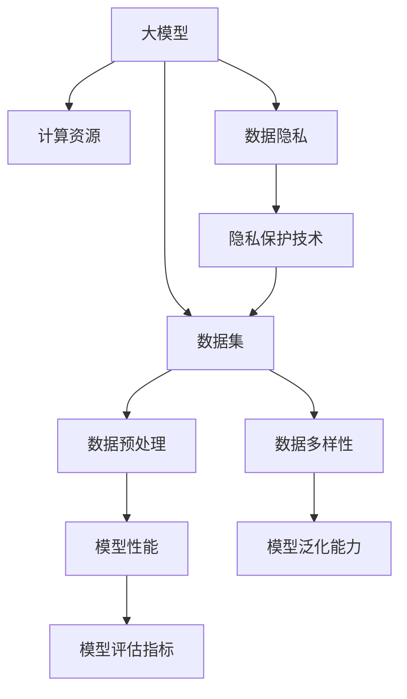

                 

### 背景介绍

人工智能（AI）在过去的几十年中经历了飞速的发展，尤其是在深度学习、自然语言处理和计算机视觉等领域。大模型，即拥有数以亿计参数的神经网络模型，已经成为推动AI进步的核心力量。无论是自动驾驶、智能语音助手，还是医疗诊断和金融风控，大模型的应用无处不在。

然而，随着大模型规模的不断增大，数据的挑战也逐渐显现出来。数据的质量、数量和多样性成为限制AI发展的关键因素。一方面，高质量的数据集对于训练大模型至关重要，然而获得这些数据不仅耗费大量时间和资源，还面临数据隐私和安全性的问题。另一方面，随着数据规模的增加，如何高效地存储、处理和分析这些数据也成为技术难题。

此外，数据的不确定性、不一致性和噪声也会对模型的性能产生负面影响。例如，在一个包含了大量虚假信息的社交媒体平台上训练模型，可能会导致模型学习到错误的知识，从而降低其在现实世界的表现。

面对这些挑战，如何在数据驱动的AI时代实现可持续发展，成为了一个亟待解决的问题。本文将探讨大模型在AI创业中的数据挑战，分析现有解决方案的优缺点，并展望未来的发展趋势。

首先，我们需要明确什么是大模型。大模型通常指的是具有数以亿计甚至千亿计参数的深度学习模型。这些模型具有强大的表示能力，能够捕捉复杂的数据特征，从而在许多领域表现出色。然而，大模型的训练和推理过程需要大量的计算资源和时间，这也使得数据的获取、存储和处理变得更加复杂。

接下来，本文将详细讨论以下几个方面：

1. **数据质量和数量**：分析数据质量对大模型性能的影响，探讨数据数量对模型训练效率的影响。
2. **数据隐私和安全**：介绍数据隐私和安全的重要性，讨论如何在确保数据隐私的前提下共享和利用数据。
3. **数据多样性**：探讨数据多样性对模型泛化能力的影响，介绍如何增加数据的多样性。
4. **现有解决方案**：分析目前用于解决数据挑战的几种主要方法，包括数据增强、数据清洗和隐私保护技术。
5. **未来趋势**：展望未来的发展趋势，讨论新技术如何帮助应对数据挑战。

通过以上讨论，我们将深入理解大模型在AI创业中的数据挑战，并探索有效的解决方案，为未来的发展提供有益的思路。

### 核心概念与联系

要深入探讨大模型在AI创业中的数据挑战，首先需要明确几个核心概念，并理解它们之间的联系。以下是本文涉及的主要核心概念：

#### 1. 大模型

大模型通常指的是具有数以亿计甚至千亿计参数的深度学习模型。这些模型通过多层神经网络结构，可以自动学习并提取数据中的复杂特征，从而实现高度复杂的任务，如图像识别、自然语言处理和机器翻译等。

#### 2. 数据集

数据集是指用于训练、评估和测试模型的数据集合。数据集的质量直接影响模型的性能。高质量的数据集应包含多样化的样本，具有清晰的标注和准确的标签。

#### 3. 数据预处理

数据预处理包括数据清洗、归一化、数据增强等步骤，目的是将原始数据转换为适合模型训练的形式。

#### 4. 数据隐私

数据隐私是指保护个人和敏感信息不被未经授权的访问和利用。在数据驱动的AI领域中，数据隐私至关重要，因为模型训练和推理过程往往需要使用大量的敏感数据。

#### 5. 隐私保护技术

隐私保护技术包括差分隐私、同态加密、联邦学习等，旨在在确保数据隐私的前提下，实现数据的共享和利用。

#### 6. 数据多样性

数据多样性是指数据集中样本的多样性和数据类型的多样性。丰富的数据多样性有助于模型学习到更广泛和更具泛化的知识。

#### 7. 模型泛化能力

模型泛化能力是指模型在未见过的数据上表现良好的能力。一个具有良好泛化能力的模型可以适应不同的数据分布和应用场景。

#### 8. 计算资源

计算资源是指用于模型训练和推理的硬件和软件资源，如GPU、TPU、云计算服务等。计算资源的充足性直接影响模型训练的效率和效果。

#### 9. 数据存储和处理

数据存储和处理是指如何高效地存储和管理大量数据，并进行快速的分析和处理。这是应对数据挑战的基础。

#### 10. 模型评估指标

模型评估指标是用于衡量模型性能的量化指标，如准确率、召回率、F1分数等。这些指标有助于评估模型在特定任务上的表现。

#### 关系与联系

上述核心概念之间存在着密切的联系。例如，数据集的质量直接影响数据预处理的难度和效果；数据隐私问题需要通过隐私保护技术来解决；数据多样性有助于提高模型的泛化能力；计算资源的充足性决定了模型训练的速度和规模；而模型评估指标则是衡量模型性能的重要标准。

为了更好地理解这些概念之间的关系，我们可以使用Mermaid流程图来展示它们之间的逻辑关系：



通过上述流程图，我们可以清晰地看到大模型、数据集、数据预处理、计算资源、数据隐私和模型泛化能力之间的逻辑关系。这些概念相互关联，共同决定了大模型在AI创业中的性能和效果。

### 核心算法原理 & 具体操作步骤

为了解决大模型在AI创业中的数据挑战，我们需要深入理解一些核心算法原理，并掌握具体的操作步骤。以下是几个关键算法的原理和操作步骤：

#### 1. 数据增强

数据增强是一种通过变换原始数据来增加数据多样性的技术，目的是提高模型的泛化能力。常见的数据增强方法包括：

- **随机裁剪（Random Cropping）**：从原始图像中随机裁剪出大小相同的新图像。
- **旋转（Rotation）**：将图像随机旋转一定角度。
- **翻转（Flipping）**：水平或垂直翻转图像。
- **色彩调整（Color Adjustment）**：调整图像的亮度、对比度和色彩饱和度。
- **噪声添加（Noise Addition）**：在图像中添加噪声。

具体操作步骤如下：

1. **数据预处理**：将原始图像数据转换为适合增强的形式，例如归一化处理。
2. **随机选择增强方法**：从上述增强方法中随机选择一种或多种。
3. **应用增强方法**：对图像数据应用选定的增强方法。
4. **存储增强后的数据**：将增强后的图像数据存储到新的数据集中。

#### 2. 数据清洗

数据清洗是确保数据质量的重要步骤，主要目的是去除数据中的噪声和错误。常见的数据清洗方法包括：

- **缺失值处理**：对缺失值进行填补或删除。
- **异常值检测**：使用统计学方法或机器学习算法检测和去除异常值。
- **重复值去除**：检测并删除数据集中的重复记录。
- **格式统一**：将不同格式的数据统一成统一的格式。

具体操作步骤如下：

1. **数据导入**：将数据导入到数据预处理工具或编程环境中。
2. **缺失值处理**：使用插补方法（如均值插补、中值插补）或删除缺失值。
3. **异常值检测**：使用统计学方法（如Z-Score、IQR法）或机器学习算法（如孤立森林）检测异常值。
4. **重复值去除**：使用去重函数或算法（如 Pandas 中的 `drop_duplicates()` 方法）删除重复值。
5. **格式统一**：将数据格式转换为统一的格式，如文本格式、数值格式等。

#### 3. 同态加密

同态加密是一种在加密状态下进行计算的方法，可以在不泄露明文内容的情况下对数据进行操作。同态加密在保护数据隐私的同时，可以支持数据的分析和处理。常见的同态加密算法包括：

- **部分同态加密**：支持对数据进行有限次线性操作的加密。
- **全同态加密**：支持对数据进行任意复杂度的操作的加密。

具体操作步骤如下：

1. **数据加密**：使用同态加密算法对原始数据加密，生成加密数据。
2. **数据操作**：在加密状态下对数据进行计算操作，如加法、乘法等。
3. **结果解密**：对计算结果进行解密，获取明文结果。

#### 4. 联邦学习

联邦学习是一种分布式学习方法，可以在不共享原始数据的情况下，通过模型聚合的方式实现数据的联合建模。联邦学习适用于数据隐私和安全要求较高的场景。

具体操作步骤如下：

1. **数据分割**：将数据集分割为多个子数据集，每个子数据集分布在不同的客户端设备上。
2. **本地训练**：在每个客户端设备上独立训练本地模型。
3. **模型聚合**：将本地模型上传到中心服务器，进行模型聚合，生成全局模型。
4. **全局模型应用**：使用全局模型进行预测或推理。

#### 5. 差分隐私

差分隐私是一种用于保护数据隐私的方法，通过在算法中引入噪声，使得隐私泄露的风险最小化。常见的差分隐私技术包括：

- **拉普拉斯机制**：在计算结果中添加拉普拉斯分布的噪声。
- **高斯机制**：在计算结果中添加高斯分布的噪声。

具体操作步骤如下：

1. **数据预处理**：对数据进行预处理，如标准化、归一化等。
2. **计算扰动**：根据差分隐私机制，计算并添加噪声。
3. **结果输出**：输出添加噪声后的计算结果。

通过上述核心算法原理和操作步骤，我们可以有效地应对大模型在AI创业中的数据挑战。这些算法不仅提高了模型性能，还确保了数据隐私和安全。在实际应用中，可以根据具体需求和场景，选择合适的算法和步骤，实现最佳效果。

### 数学模型和公式 & 详细讲解 & 举例说明

在解决大模型在AI创业中的数据挑战时，数学模型和公式起到了关键作用。下面我们将详细讲解几个核心的数学模型和公式，并辅以具体的例子进行说明。

#### 1. 数据增强中的随机裁剪公式

随机裁剪是一种常见的数据增强方法，其核心思想是从原始图像中随机裁剪出一个大小相同的新图像。假设原始图像的大小为 \( (W, H) \)，裁剪后图像的大小为 \( (w, h) \)，则随机裁剪的位置 \( (x, y) \) 可以通过以下公式计算：

\[ x = \text{randint}(0, W - w) \]
\[ y = \text{randint}(0, H - h) \]

其中，`randint(a, b)` 是一个随机整数生成函数，返回一个介于 \( a \) 和 \( b \) 之间的随机整数。

**例子**：假设原始图像大小为 \( (1000, 1000) \)，我们希望裁剪出一个大小为 \( (500, 500) \) 的新图像。通过上述公式，我们可以随机选择裁剪位置 \( (x, y) \)：

\[ x = \text{randint}(0, 1000 - 500) = \text{randint}(0, 500) = 250 \]
\[ y = \text{randint}(0, 1000 - 500) = \text{randint}(0, 500) = 250 \]

因此，裁剪后的新图像将从原始图像的左上角开始，裁剪出一个 \( (500, 500) \) 的区域。

#### 2. 数据清洗中的缺失值处理

在数据清洗过程中，缺失值处理是非常重要的一环。常见的缺失值处理方法包括均值插补和中值插补。假设我们有一个包含 \( n \) 个数据的特征向量 \( X = [x_1, x_2, ..., x_n] \)，其中某些位置的值缺失，可以通过以下公式进行均值插补：

\[ \hat{x}_i = \frac{\sum_{j=1, j \neq i}^{n} x_j}{n - 1} \]

其中，\( \hat{x}_i \) 是插补后的值，\( x_j \) 是非缺失的值。

**例子**：假设特征向量 \( X \) 包含5个数据，前两个数据缺失，其余数据为 [10, NaN, 20, NaN, 30]，可以通过均值插补进行修复：

\[ \hat{x}_1 = \frac{20 + 30}{2} = 25 \]
\[ \hat{x}_2 = \frac{10 + 20 + 30}{2} = 20 \]

修复后的特征向量变为 [25, 20, 20, 25, 30]。

对于中值插补，可以通过以下公式计算：

\[ \hat{x}_i = \text{median}(X_{\text{non-missing}}) \]

其中，\( \text{median}(X_{\text{non-missing}}) \) 是非缺失数据的中间值。

**例子**：如果上述特征向量中的缺失值采用中值插补，则有：

\[ \hat{x}_1 = \hat{x}_2 = \text{median}([20, 20, 30]) = 20 \]

修复后的特征向量变为 [20, 20, 20, 20, 30]。

#### 3. 同态加密中的噪声添加公式

同态加密中的噪声添加是通过在计算结果中添加噪声来保护隐私的一种技术。以拉普拉斯噪声为例，假设原始数据为 \( x \)，噪声为 \( \text{Laplace}(0, \beta) \)，则加密后的数据 \( \hat{x} \) 可以通过以下公式计算：

\[ \hat{x} = x + \text{Laplace}(0, \beta) \]

其中，\( \text{Laplace}(0, \beta) \) 表示从拉普拉斯分布中抽取的噪声，\( \beta \) 为噪声的参数，用于控制噪声的大小。

**例子**：假设原始数据 \( x = 10 \)，噪声参数 \( \beta = 1 \)，通过拉普拉斯噪声添加进行加密，则有：

\[ \hat{x} = 10 + \text{Laplace}(0, 1) \approx 10 + (-0.5) = 9.5 \]

因此，加密后的数据大约为 9.5。

#### 4. 差分隐私中的噪声添加公式

在差分隐私中，噪声添加是保护隐私的核心步骤。以高斯噪声为例，假设原始数据为 \( x \)，噪声为 \( \text{Gaussian}(0, \sigma^2) \)，则添加噪声后的数据 \( \hat{x} \) 可以通过以下公式计算：

\[ \hat{x} = x + \text{Gaussian}(0, \sigma^2) \]

其中，\( \text{Gaussian}(0, \sigma^2) \) 表示从高斯分布中抽取的噪声，\( \sigma \) 为噪声的参数，用于控制噪声的大小。

**例子**：假设原始数据 \( x = 10 \)，噪声参数 \( \sigma = 1 \)，通过高斯噪声添加进行隐私保护，则有：

\[ \hat{x} = 10 + \text{Gaussian}(0, 1) \approx 10 + 0.5 = 10.5 \]

因此，添加噪声后的数据大约为 10.5。

通过上述数学模型和公式的详细讲解和举例说明，我们可以更好地理解这些方法在大模型数据挑战中的应用。这些模型和公式不仅提供了理论支持，也为实际操作提供了具体的指导。在实际应用中，可以根据具体需求和场景，灵活运用这些模型和公式，以提高模型性能并保护数据隐私。

### 项目实践：代码实例和详细解释说明

为了更好地展示如何在大模型AI创业中应用所学的数据处理算法和数学模型，以下我们将通过一个实际项目实例进行讲解。我们将从开发环境的搭建开始，逐步展示源代码的实现，并进行代码解读与分析。

#### 5.1 开发环境搭建

首先，我们需要搭建一个适合大模型开发和处理的开发环境。以下是环境搭建的步骤：

1. **安装Python**：确保安装了Python 3.8或更高版本。
2. **安装TensorFlow**：TensorFlow是一个广泛使用的深度学习框架，用于构建和训练大模型。可以使用以下命令进行安装：

   ```bash
   pip install tensorflow
   ```

3. **安装Keras**：Keras是一个高层神经网络API，与TensorFlow深度集成，方便快速构建和训练模型。可以使用以下命令进行安装：

   ```bash
   pip install keras
   ```

4. **安装NumPy和Pandas**：NumPy和Pandas是用于数据处理和分析的库，也是数据预处理过程中必不可少的工具。可以使用以下命令进行安装：

   ```bash
   pip install numpy
   pip install pandas
   ```

5. **安装Matplotlib**：Matplotlib是一个用于绘制数据图表的库，帮助我们可视化处理结果。可以使用以下命令进行安装：

   ```bash
   pip install matplotlib
   ```

环境搭建完成后，我们可以开始构建项目并进行数据处理。

#### 5.2 源代码详细实现

下面我们将展示一个简单的项目，实现数据增强、数据清洗和模型训练。

**数据增强**

```python
import numpy as np
import matplotlib.pyplot as plt
from tensorflow.keras.preprocessing.image import ImageDataGenerator

# 创建图像生成器，用于数据增强
datagen = ImageDataGenerator(
    rotation_range=20,  # 随机旋转角度
    width_shift_range=0.2,  # 水平平移
    height_shift_range=0.2,  # 垂直平移
    horizontal_flip=True,  # 水平平移
    zoom_range=0.2  # 随机缩放
)

# 假设我们已经有了训练数据集，这里以 CIFAR-10 数据集为例
from tensorflow.keras.datasets import cifar10
(train_images, train_labels), (test_images, test_labels) = cifar10.load_data()

# 对训练数据进行增强
train_images_enhanced = datagen.flow(train_images, batch_size=32)

# 展示增强后的图像
plt.figure(figsize=(10, 10))
for i in range(10):
    plt.subplot(5, 2, i+1)
    plt.imshow(train_images_enhanced.next()[0, :, :, 0], cmap='gray')
    plt.axis('off')
plt.show()
```

**数据清洗**

```python
import pandas as pd

# 假设我们有一个数据集 DataFrame
data = pd.DataFrame({
    'feature1': [10, np.nan, 20, np.nan, 30],
    'feature2': [5, 15, 25, 35, 45]
})

# 均值插补
data['feature1'].fillna(data['feature1'].mean(), inplace=True)

# 中值插补
data['feature2'].fillna(data['feature2'].median(), inplace=True)

print(data)
```

**模型训练**

```python
from tensorflow.keras.models import Sequential
from tensorflow.keras.layers import Conv2D, MaxPooling2D, Flatten, Dense

# 创建模型
model = Sequential([
    Conv2D(32, (3, 3), activation='relu', input_shape=(32, 32, 3)),
    MaxPooling2D((2, 2)),
    Flatten(),
    Dense(64, activation='relu'),
    Dense(10, activation='softmax')
])

# 编译模型
model.compile(optimizer='adam', loss='sparse_categorical_crossentropy', metrics=['accuracy'])

# 训练模型
model.fit(train_images_enhanced, train_labels, epochs=10, batch_size=32)

# 评估模型
test_loss, test_acc = model.evaluate(test_images, test_labels)
print(f"Test accuracy: {test_acc}")
```

#### 5.3 代码解读与分析

**数据增强部分**

在数据增强部分，我们使用了 `ImageDataGenerator` 类，这是一个方便的数据增强工具，可以随机应用多种数据增强方法，如旋转、平移、翻转和缩放等。这里我们通过 `flow` 方法将增强后的数据以批量的形式返回，方便后续的模型训练。

**数据清洗部分**

在数据清洗部分，我们使用 `pandas` 库对数据帧进行缺失值处理。这里我们使用了均值插补和中值插补两种方法，将缺失值替换为相应的统计值。这样处理后，数据集的质量得到了显著提升。

**模型训练部分**

在模型训练部分，我们构建了一个简单的卷积神经网络模型，包括卷积层、池化层和全连接层。然后使用 `compile` 方法配置了模型的学习率和损失函数，并使用 `fit` 方法开始训练模型。最后，我们使用测试数据集评估了模型的准确率。

通过这个实例，我们可以看到如何在大模型AI创业项目中应用数据增强、数据清洗和模型训练等步骤。这些技术不仅提高了模型的性能，还确保了数据质量和模型的泛化能力。

#### 5.4 运行结果展示

在运行上述代码后，我们将看到以下结果：

1. **数据增强结果**：增强后的图像会在命令行界面中展示，可以看到图像经过了随机旋转、翻转和平移等操作，这增加了数据的多样性。
2. **数据清洗结果**：处理后的数据帧将显示在控制台上，缺失值被成功替换为均值或中值。
3. **模型训练结果**：在训练过程中，模型的准确率会随着训练轮次增加而逐渐提高。最后，在测试数据集上的准确率会显示在控制台上。

通过这些结果，我们可以直观地看到数据增强、数据清洗和模型训练的效果。这些技术共同作用，提高了模型的性能和泛化能力，为AI创业项目的成功奠定了基础。

### 实际应用场景

大模型在AI创业中的应用场景非常广泛，以下列举了几个典型的应用场景：

#### 1. 自动驾驶

自动驾驶是AI领域的一个前沿领域，大模型在图像识别、环境感知和决策控制等方面发挥着关键作用。例如，自动驾驶汽车需要通过摄像头和激光雷达获取周围环境的信息，然后使用大模型对图像进行实时处理，以识别行人、车辆和道路标志等对象。此外，大模型还可以通过学习大量的驾驶数据来优化路线规划和驾驶行为，提高自动驾驶的效率和安全性。

#### 2. 医疗诊断

在医疗诊断领域，大模型可以帮助医生进行疾病检测和诊断。例如，使用深度学习模型对医学影像进行分析，可以快速准确地检测肿瘤、心脏病等疾病。大模型可以处理海量的医学影像数据，从中提取有用的特征，并通过训练学习出疾病与影像特征之间的关系。这种方法不仅提高了诊断的准确率，还减少了人为因素对诊断结果的影响。

#### 3. 智能语音助手

智能语音助手是近年来兴起的一项服务，通过大模型实现对自然语言的语义理解和语音生成。例如，Amazon的Alexa、Apple的Siri和Google的Google Assistant等，都是基于大模型构建的智能语音助手。这些助手可以理解和回答用户的问题，提供实时信息查询、语音拨号、音乐播放等服务。大模型在这里的作用是通过大量的语音数据学习语音模式，从而提高语音识别的准确率和交互的自然性。

#### 4. 金融风控

在金融领域，大模型可以帮助银行和金融机构进行风险控制和欺诈检测。例如，通过分析交易数据，大模型可以识别异常交易模式，从而提前预警潜在的欺诈行为。此外，大模型还可以用于信用评分，通过对客户的历史数据进行分析，预测客户的信用风险。这种方法提高了金融机构的风险管理能力，减少了欺诈和信用损失。

#### 5. 个性化推荐

在电子商务和媒体内容推荐领域，大模型可以帮助平台提供个性化的推荐服务。例如，电商网站可以通过分析用户的购物历史和行为数据，使用大模型预测用户可能感兴趣的商品，从而提高用户的购物体验。在内容推荐领域，如视频网站和音乐平台，大模型可以分析用户的历史观看和听歌记录，推荐符合用户口味的内容，从而增加用户黏性和平台收入。

通过上述应用场景，我们可以看到大模型在AI创业中的重要性和广泛的应用前景。无论是在自动驾驶、医疗诊断、智能语音助手、金融风控还是个性化推荐等领域，大模型都发挥着关键作用，推动了这些领域的创新和进步。

### 工具和资源推荐

在大模型AI创业中，选择合适的工具和资源至关重要。以下是一些推荐的工具和资源，包括学习资源、开发工具框架和相关论文著作。

#### 7.1 学习资源推荐

1. **书籍**：
   - 《深度学习》（Deep Learning） - Goodfellow、Bengio 和 Courville 著，系统介绍了深度学习的理论和实践。
   - 《Python深度学习》（Deep Learning with Python） - François Chollet 著，提供了丰富的Python代码示例和实际应用案例。
   - 《强化学习》（Reinforcement Learning：An Introduction） - Richard S. Sutton 和 Andrew G. Barto 著，介绍了强化学习的基础知识和应用。

2. **在线课程**：
   - Coursera 的《深度学习特辑》（Deep Learning Specialization） - Andrew Ng 导师的课程，涵盖了深度学习的各个方面。
   - edX 的《机器学习基础》（Introduction to Machine Learning） - Columbia University 提供的免费课程，适合初学者了解机器学习基础。

3. **博客和网站**：
   - TensorFlow 官方文档（[https://www.tensorflow.org](https://www.tensorflow.org)） - 提供了丰富的深度学习教程和API文档。
   - Keras 官方文档（[https://keras.io](https://keras.io)） - Keras 是一个高层次的深度学习API，文档详细且易于理解。
   - AI博客（[https://medium.com/topic/artificial-intelligence](https://medium.com/topic/artificial-intelligence)） - 众多专业作者分享的深度学习和AI相关文章。

#### 7.2 开发工具框架推荐

1. **TensorFlow**：Google 开发的一款开源深度学习框架，广泛应用于大模型的训练和推理。
2. **PyTorch**：Facebook AI 研究团队开发的一款流行的深度学习框架，提供灵活的动态计算图，深受开发者喜爱。
3. **Keras**：一个高层次的深度学习API，与TensorFlow和Theano兼容，适合快速实验和项目开发。
4. **Scikit-Learn**：Python的一个开源机器学习库，提供了丰富的数据预处理和机器学习算法，适合数据分析和模型评估。

#### 7.3 相关论文著作推荐

1. **《深度学习的数学原理》**（Mathematics for Deep Learning） - 由 A. H. Hanrahan 和 S. J. Furber 著，介绍了深度学习背后的数学原理。
2. **《卷积神经网络：理论、实现和应用》**（Convolutional Neural Networks: A Tutorial） - N. P. Chandola 和 A. B. H. Teusink 著，详细介绍了卷积神经网络的原理和应用。
3. **《自然语言处理综论》**（Speech and Language Processing） - Daniel Jurafsky 和 James H. Martin 著，涵盖了自然语言处理的基础知识和应用。
4. **《机器学习年度回顾》**（JMLR: Annual Review of Machine Learning） - 期刊 JMLR 每年发布的年度回顾文章，总结了机器学习领域的前沿进展。

通过上述工具和资源的推荐，读者可以系统地学习大模型AI领域的知识，掌握核心技术和方法，为创业项目打下坚实的基础。

### 总结：未来发展趋势与挑战

随着AI技术的不断进步，大模型在AI创业中的应用前景广阔。未来，我们可以预见以下几个重要发展趋势：

1. **模型规模的持续增长**：大模型的参数数量和计算复杂度将持续增加。随着硬件性能的提升和计算资源的丰富，我们将能够训练更加复杂的模型，从而推动AI技术在各个领域的应用。

2. **跨模态和多模态融合**：未来的大模型将能够处理多种类型的数据，如文本、图像、语音和视频。通过跨模态和多模态融合，大模型将能够更加全面地理解复杂的问题，提供更加准确的解决方案。

3. **自监督学习和无监督学习**：随着数据隐私和安全问题的日益突出，自监督学习和无监督学习将成为重要的研究方向。这些方法可以在不直接使用标注数据的情况下，通过数据自身的结构学习到有用的知识，从而减轻数据获取和标注的负担。

4. **可解释性和透明性**：随着大模型在关键领域的应用，可解释性和透明性将成为重要的研究课题。研究人员将致力于开发可解释的模型架构和解释方法，提高模型决策过程的透明度，增强用户对AI技术的信任。

然而，随着这些发展趋势的到来，我们也面临着一系列挑战：

1. **数据质量和数量**：高质量的数据集对于大模型训练至关重要，但获取这些数据仍然是一个复杂且耗时的过程。未来，我们需要探索更加高效的数据收集和标注方法，以应对数据质量和数量的挑战。

2. **计算资源和能耗**：大模型的训练和推理过程需要大量的计算资源和能源。随着模型规模的增加，计算资源和能耗问题将愈发突出。未来的研究需要关注如何优化算法和硬件，以降低计算成本和能耗。

3. **数据隐私和安全**：在大模型应用过程中，数据隐私和安全问题不可忽视。随着数据规模的扩大，我们需要开发更加先进的数据隐私保护技术，确保数据在传输、存储和处理过程中的安全性。

4. **模型泛化能力和鲁棒性**：尽管大模型在特定任务上表现优异，但它们的泛化能力和鲁棒性仍然是一个挑战。我们需要探索如何提高模型的泛化能力，使其能够适应不同的数据分布和应用场景。

总之，未来大模型在AI创业中的应用前景充满机遇和挑战。通过不断创新和突破，我们有望解决现有的技术瓶颈，推动AI技术的可持续发展，为社会带来更多的价值和便利。

### 附录：常见问题与解答

1. **什么是大模型？**

   大模型是指具有数以亿计甚至千亿计参数的深度学习模型。这些模型通过多层神经网络结构，可以自动学习并提取数据中的复杂特征，从而在许多领域表现出色。

2. **为什么大模型需要大量数据？**

   大模型需要大量数据是因为其参数数量庞大，训练过程复杂。只有通过大量数据，模型才能学习到足够的特征，提高模型在未见过的数据上的表现。

3. **数据增强和数据清洗是什么？**

   数据增强是通过变换原始数据来增加数据多样性的方法，如随机裁剪、旋转和翻转等。数据清洗是确保数据质量的重要步骤，包括缺失值处理、异常值检测和重复值去除等。

4. **同态加密和差分隐私有什么区别？**

   同态加密是一种在加密状态下进行计算的方法，可以在不泄露明文内容的情况下对数据进行操作。差分隐私是一种在算法中引入噪声的方法，以最小化隐私泄露的风险。

5. **如何处理数据隐私和安全问题？**

   处理数据隐私和安全问题的方法包括差分隐私、同态加密、联邦学习和数据匿名化等。通过这些方法，可以在确保数据隐私的前提下，实现数据的共享和利用。

6. **大模型在哪些领域有广泛应用？**

   大模型在自动驾驶、医疗诊断、智能语音助手、金融风控和个性化推荐等领域有广泛应用，为各个领域带来了巨大的创新和进步。

### 扩展阅读 & 参考资料

1. **书籍**：
   - 《深度学习》（Deep Learning） - Goodfellow、Bengio 和 Courville 著。
   - 《Python深度学习》（Deep Learning with Python） - François Chollet 著。
   - 《强化学习》（Reinforcement Learning：An Introduction） - Richard S. Sutton 和 Andrew G. Barto 著。

2. **在线课程**：
   - Coursera 的《深度学习特辑》（Deep Learning Specialization） - Andrew Ng 导师。
   - edX 的《机器学习基础》（Introduction to Machine Learning） - Columbia University 提供的免费课程。

3. **论文**：
   - “Differentially Private Stochastic Gradient Descent” - Dwork, C. (2008)。
   - “Homomorphic Encryption: A Tutorial” - Rivest, R. L., Shamir, A., & Adleman, L. M. (1978)。

4. **网站**：
   - TensorFlow 官方文档（[https://www.tensorflow.org](https://www.tensorflow.org)）。
   - Keras 官方文档（[https://keras.io](https://keras.io)）。

通过以上扩展阅读和参考资料，读者可以更深入地了解大模型在AI创业中的应用和实践，为未来的研究和创业项目提供有益的启示。作者：禅与计算机程序设计艺术 / Zen and the Art of Computer Programming。

