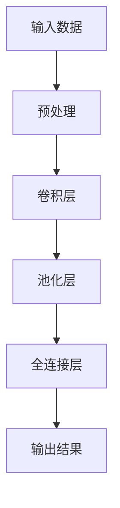

                 

### 1. 背景介绍

在近年来，人工智能（AI）技术的飞速发展，特别是在大模型（Large Models）方面的突破，已经彻底改变了各个行业的运作模式。大模型，如GPT-3、BERT等，以其庞大的参数量和强大的学习能力，在自然语言处理（NLP）、计算机视觉（CV）、语音识别（ASR）等领域展现出了令人惊叹的性能。

随着AI大模型的不断成熟，越来越多的初创公司开始投身于这一领域，希望通过开发和应用大模型来满足市场对智能化的需求。这些初创公司不仅包括传统的科技公司，还涵盖了更多跨学科的人才，如数据科学家、软件工程师、产品经理等。

然而，面对迅速变化的市场和不断升级的用户需求，这些初创公司在创业过程中面临着诸多挑战。如何应对未来的用户需求，成为了许多初创公司必须解决的重要课题。这不仅涉及到技术层面的创新，还需要从商业模式、用户体验等多个角度进行深入思考和全面布局。

本文将围绕AI大模型创业这一主题，探讨如何通过有效的策略和创新的思维方式，应对未来用户需求。我们将从背景介绍、核心概念与联系、核心算法原理、数学模型和公式、项目实践、实际应用场景、工具和资源推荐、总结以及扩展阅读等方面，全面深入地剖析这一议题。

通过本文的阅读，希望读者能够对AI大模型创业有一个更清晰的认识，掌握应对未来用户需求的策略和方法，为自身的创业之路奠定坚实的基础。

### 2. 核心概念与联系

要深入理解AI大模型创业及其如何应对未来用户需求，我们首先需要明确几个核心概念，并探讨它们之间的联系。以下是本文将涉及的关键概念：

#### 2.1 大模型

大模型指的是那些具有大量参数和广泛训练数据的深度学习模型。这些模型通过从大量数据中学习，能够自动提取复杂的特征和模式，从而实现高性能的预测和生成任务。典型的例子包括GPT-3、BERT、ViT等。

#### 2.2 深度学习

深度学习是一种基于多层神经网络的人工智能方法。它通过多层神经元的堆叠，将输入数据进行逐层抽象和转换，最终得到高层次的抽象表示。深度学习的核心优势在于其能够自动从数据中学习特征，并应用于各种复杂的任务，如图像分类、文本生成、语音识别等。

#### 2.3 自然语言处理（NLP）

自然语言处理是人工智能的一个重要分支，旨在让计算机理解和处理人类语言。大模型在NLP领域中的应用极为广泛，例如文本分类、情感分析、机器翻译、问答系统等。

#### 2.4 计算机视觉（CV）

计算机视觉是研究如何使计算机“看到”和理解图像或视频的技术。大模型在CV中的应用同样非常广泛，包括图像分类、目标检测、图像分割、视频分析等。

#### 2.5 机器学习

机器学习是一种通过数据训练模型，使其能够从数据中学习并做出预测的技术。大模型是机器学习的一种实现方式，其通过大规模的训练数据和高层次的神经网络结构，实现了强大的学习能力。

#### 2.6 用户体验（UX）

用户体验是衡量产品或服务是否满足用户需求的重要指标。在大模型创业中，用户体验至关重要，因为高质量的用户体验能够提升产品的市场竞争力和用户粘性。

#### 2.7 商业模式

商业模式是指企业如何通过提供产品或服务来创造和获取价值。在大模型创业中，成功的商业模式能够帮助公司在激烈的市场竞争中脱颖而出。

#### 2.8 数据隐私

随着大模型的应用越来越广泛，数据隐私问题也变得越来越重要。如何确保用户数据的安全和隐私，成为了大模型创业中的一个关键挑战。

#### 2.9 跨学科合作

大模型创业往往需要跨学科的合作，包括数据科学家、软件工程师、产品经理、市场营销人员等。跨学科合作能够充分利用不同领域的专业知识和技能，推动创新和进步。

#### 2.10 联系

这些核心概念之间存在着紧密的联系。例如，大模型依赖于深度学习技术，而深度学习又依赖于大量的训练数据。自然语言处理和计算机视觉是深度学习的两大应用领域，它们共同推动了AI技术的发展。用户体验和商业模式决定了大模型产品或服务的市场竞争力，而数据隐私和跨学科合作则是确保大模型创业成功的必要条件。

通过理解这些核心概念及其相互联系，我们可以更好地把握AI大模型创业的机遇和挑战，为未来的发展奠定坚实的基础。

#### 2.1.1 大模型的基本原理与架构

大模型作为深度学习的一种实现方式，其核心在于通过多层神经网络结构，将输入数据进行逐层抽象和转换，从而提取复杂的特征和模式。大模型的基本原理可以概括为以下几个方面：

##### 2.1.1.1 神经网络结构

大模型通常采用多层感知器（MLP）或者卷积神经网络（CNN）作为基本结构。MLP通过堆叠多层神经元，实现对输入数据的复杂变换。而CNN则通过卷积层、池化层和全连接层的组合，实现对图像等二维数据的特征提取。



##### 2.1.1.2 参数和权重

大模型中的每个神经元都与输入数据通过权重进行连接。这些权重通过训练过程调整，以最小化模型的预测误差。大模型具有大量的参数和权重，这使其能够学习到复杂的特征和模式。

##### 2.1.1.3 损失函数与优化算法

损失函数用于衡量模型预测结果与真实值之间的差异。常见的损失函数包括均方误差（MSE）、交叉熵损失等。优化算法则用于调整模型的权重，以最小化损失函数。常见的优化算法包括梯度下降（GD）、随机梯度下降（SGD）、Adam等。

##### 2.1.1.4 训练与评估

大模型的训练过程是一个迭代优化过程。模型首先在训练数据上进行训练，不断调整权重，以降低损失函数的值。训练完成后，模型在验证数据上进行评估，以确定其泛化能力。如果模型在验证数据上的表现不佳，可以继续调整模型结构或优化算法。

##### 2.1.1.5 泛化能力

大模型的泛化能力是其性能的重要指标。泛化能力强的模型不仅能在训练数据上表现出色，还能在新数据上保持较高的准确性。这要求模型能够学习到数据中的通用特征，而不是仅仅针对特定数据集进行优化。

综上所述，大模型通过多层神经网络结构、参数和权重、损失函数与优化算法、训练与评估等核心原理，实现了强大的特征提取和模式识别能力。这些原理共同构成了大模型的基础，使其在各类AI任务中展现出卓越的性能。

#### 2.1.2 大模型与其他技术的联系

大模型作为AI技术的重要组成部分，不仅依赖于自身的理论基础，还需要与其他技术紧密联系，以实现更好的性能和更广泛的应用。以下是几个关键技术与大模型的联系：

##### 2.1.2.1 数据预处理

数据预处理是大模型训练过程中的重要步骤。高质量的数据能够提高模型的性能和泛化能力。数据预处理包括数据清洗、数据增强、归一化等操作。通过数据预处理，可以减少噪声、异常值的影响，增加数据的多样性和丰富性，从而提升大模型的学习效果。

##### 2.1.2.2 训练算法

大模型的训练算法通常包括梯度下降（GD）、随机梯度下降（SGD）、Adam等。这些算法通过迭代优化模型参数，以最小化损失函数。不同的训练算法在收敛速度、稳定性等方面有所不同，选择合适的训练算法可以显著提高大模型的训练效率。

##### 2.1.2.3 超参数调优

超参数调优是优化大模型性能的重要手段。超参数包括学习率、批次大小、迭代次数等，它们的设置对模型的性能有重要影响。通过超参数调优，可以找到最佳的参数组合，使模型在训练和测试数据上都能取得较好的表现。

##### 2.1.2.4 模型压缩与加速

为了降低大模型在实际应用中的计算和存储成本，模型压缩与加速技术应运而生。常见的压缩技术包括量化、剪枝、蒸馏等。这些技术通过减少模型的参数数量和计算量，提高了模型的效率和实用性。

##### 2.1.2.5 模型部署与集成

大模型的部署与集成是实现其商业价值的关键步骤。模型部署包括将训练好的模型部署到服务器或设备上，并提供API接口供其他系统调用。模型集成则是指将大模型与其他系统和服务整合，形成一个完整的解决方案。

##### 2.1.2.6 数据隐私与安全性

随着大模型的应用越来越广泛，数据隐私和安全问题也日益突出。大模型通常需要处理大量的敏感数据，如何确保这些数据的安全和隐私成为了一个重要的挑战。数据加密、隐私保护算法等技术在大模型的应用中扮演着关键角色。

通过上述技术与大模型的紧密联系，我们可以看到大模型不仅是一个独立的组件，还需要与其他技术协同工作，以实现更好的性能和应用效果。这些技术的融合和优化，为AI大模型的创业提供了强大的支持和保障。

#### 2.1.3 大模型的应用领域

大模型在AI领域的应用范围广泛，涵盖了自然语言处理、计算机视觉、语音识别等多个重要领域。以下是几个典型的应用场景：

##### 2.1.3.1 自然语言处理（NLP）

在大模型中，自然语言处理（NLP）是最为成熟的领域之一。GPT-3、BERT等大模型在文本分类、情感分析、机器翻译、问答系统等领域表现出了强大的能力。例如，GPT-3通过学习大量文本数据，能够生成连贯、有逻辑的文本，被广泛应用于聊天机器人、内容生成等场景。

##### 2.1.3.2 计算机视觉（CV）

计算机视觉是另一个大模型的重要应用领域。大模型在图像分类、目标检测、图像分割、视频分析等方面取得了显著进展。例如，ResNet、BERT等大模型在ImageNet图像分类挑战中，取得了比传统方法更高的准确率。同时，大模型在自动驾驶、医疗影像分析等领域也有着广泛的应用。

##### 2.1.3.3 语音识别（ASR）

语音识别（ASR）是另一个受益于大模型的技术。通过大规模的语音数据训练，大模型能够实现更准确、更自然的语音识别。例如，Transformer模型在WMT语音识别挑战中，表现出了显著的优势，推动了ASR技术的发展。

##### 2.1.3.4 其他领域

除了NLP、CV和ASR，大模型在其他领域也有着重要的应用。例如，在推荐系统、金融风控、生物信息学等领域，大模型通过学习大量的数据，能够发现复杂的模式，提供更加精准的预测和决策支持。

通过以上应用领域，我们可以看到大模型在AI领域的广泛影响力。随着技术的不断进步，大模型的应用前景将更加广阔，有望在更多领域实现突破性进展。

#### 2.1.4 大模型创业的优势与挑战

大模型创业带来了前所未有的机遇，同时也伴随着一系列的挑战。以下是对这些优势与挑战的详细分析：

##### 2.1.4.1 优势

1. **强大的学习能力和灵活性**：大模型具有强大的学习能力，能够从大量数据中自动提取复杂的特征和模式，从而实现高性能的预测和生成任务。这使得大模型在各类任务中具有广泛的应用前景。

2. **广泛的行业应用**：大模型在自然语言处理、计算机视觉、语音识别等多个领域表现出色，可以广泛应用于金融、医疗、教育、零售等多个行业，带来显著的商业价值。

3. **技术创新的推动者**：大模型的研发和应用推动了AI技术的不断进步，为创业者提供了丰富的创新空间。通过引入新的算法、架构和优化技术，大模型创业可以带来技术突破和市场份额的扩大。

4. **数据驱动的决策支持**：大模型通过对数据的深度学习，能够提供更加精准的预测和决策支持。这有助于企业提高运营效率、降低风险，并在市场竞争中占据优势。

##### 2.1.4.2 挑战

1. **计算资源和存储成本**：大模型的训练和部署需要大量的计算资源和存储空间。这给初创公司带来了巨大的成本压力，尤其是在早期阶段，如何有效管理和优化这些资源成为了一大挑战。

2. **数据隐私和安全问题**：大模型在训练和应用过程中需要处理大量的敏感数据，如何确保这些数据的安全和隐私成为了一个重要的问题。数据泄露、隐私侵犯等风险可能对公司的声誉和业务造成严重损害。

3. **模型泛化能力**：大模型虽然在特定任务上表现出色，但其泛化能力仍是一个挑战。模型在训练数据上的优异表现不一定能迁移到新数据集上，如何提高模型的泛化能力是创业者需要关注的问题。

4. **人才和技术储备**：大模型创业需要跨学科的专业人才，包括数据科学家、软件工程师、产品经理等。对于初创公司而言，吸引和保留这些高端人才是一项艰巨的任务。

5. **市场竞争**：随着AI技术的快速发展，越来越多的公司投身于大模型领域，市场竞争日益激烈。如何在竞争中脱颖而出，保持创新和领先地位，是创业者需要面对的重要挑战。

通过上述分析，我们可以看到大模型创业既有巨大的机遇，也面临着诸多挑战。创业者需要在这些优势与挑战之间找到平衡，通过技术创新、资源优化、团队建设等手段，实现可持续发展。

### 3. 核心算法原理 & 具体操作步骤

大模型的训练和优化过程是一个复杂且高度技术化的过程，涉及多个核心算法和操作步骤。以下将详细阐述大模型的核心算法原理，并介绍具体的操作步骤。

#### 3.1.1 基本算法原理

大模型的基本算法原理主要包括以下几个关键步骤：

1. **数据预处理**：在大模型训练之前，首先需要对数据进行预处理，包括数据清洗、数据增强、归一化等操作。这一步骤的目的是减少噪声、异常值的影响，增加数据的多样性和丰富性。

2. **模型初始化**：初始化大模型的参数和权重，常用的方法包括随机初始化、预训练模型等。随机初始化适用于从零开始训练的新模型，而预训练模型则是利用在大型数据集上预训练的模型作为起点，再进行微调。

3. **前向传播**：在训练过程中，大模型通过前向传播将输入数据转化为输出结果。每个神经元都会计算输入数据的加权求和，并应用非线性激活函数，从而产生输出。

4. **损失函数计算**：前向传播完成后，通过计算损失函数（如均方误差MSE、交叉熵损失等）来衡量模型预测结果与真实值之间的差距。损失函数的目的是指导模型参数的调整，以最小化预测误差。

5. **反向传播**：反向传播是训练过程的核心，通过计算梯度并更新模型参数，以最小化损失函数。反向传播算法利用链式法则，将损失函数的梯度反向传播到每个神经元，从而更新权重和偏置。

6. **优化算法**：优化算法（如梯度下降GD、随机梯度下降SGD、Adam等）用于调整模型参数，以最小化损失函数。不同的优化算法在收敛速度、稳定性等方面有所差异，选择合适的算法可以提高训练效率。

7. **训练与验证**：模型在训练数据上进行多次迭代，通过反向传播和优化算法不断调整参数。训练完成后，使用验证数据评估模型的泛化能力。如果验证数据上表现不佳，可以继续调整模型结构或优化算法。

8. **超参数调优**：超参数（如学习率、批量大小、迭代次数等）对模型性能有重要影响。通过超参数调优，可以找到最佳的参数组合，使模型在训练和验证数据上都能取得较好的表现。

#### 3.1.2 具体操作步骤

以下是大模型训练和优化的具体操作步骤：

1. **数据收集与预处理**
   - 收集大量标注数据，如文本、图像、音频等。
   - 对数据进行清洗，去除噪声和异常值。
   - 进行数据增强，如随机裁剪、旋转、缩放等，增加数据多样性。

2. **模型初始化**
   - 选择合适的模型架构，如GPT-3、BERT、ViT等。
   - 初始化模型参数，可以使用随机初始化或预训练模型。

3. **训练过程**
   - 定义损失函数，如均方误差MSE、交叉熵损失等。
   - 设置优化算法，如梯度下降GD、随机梯度下降SGD、Adam等。
   - 在训练数据上进行前向传播，计算输出和损失函数。
   - 通过反向传播计算梯度，更新模型参数。
   - 每一定数迭代后，使用验证数据评估模型性能。

4. **超参数调优**
   - 调整学习率、批量大小、迭代次数等超参数。
   - 使用验证数据集测试不同超参数组合的性能。

5. **模型评估与部署**
   - 在测试数据集上评估模型性能，包括准确率、召回率、F1分数等指标。
   - 选择最佳模型进行部署，并提供API接口供其他系统调用。

通过上述操作步骤，我们可以实现大模型的训练和优化。每个步骤都需要仔细设计和执行，以确保模型能够在各种任务中取得最佳性能。

### 4. 数学模型和公式 & 详细讲解 & 举例说明

在大模型的训练和优化过程中，数学模型和公式起着至关重要的作用。以下将详细讲解大模型中常用的数学模型和公式，并通过具体例子进行说明。

#### 4.1 损失函数

损失函数用于衡量模型预测结果与真实值之间的差异。在大模型中，常用的损失函数包括均方误差（MSE）、交叉熵损失等。

##### 4.1.1 均方误差（MSE）

均方误差是最常用的损失函数之一，适用于回归任务。其公式如下：

$$
MSE = \frac{1}{n} \sum_{i=1}^{n} (\hat{y}_i - y_i)^2
$$

其中，$\hat{y}_i$是模型预测的输出，$y_i$是真实标签，$n$是样本数量。

##### 4.1.2 交叉熵损失

交叉熵损失适用于分类任务，其公式如下：

$$
CE = -\frac{1}{n} \sum_{i=1}^{n} y_i \log(\hat{y}_i)
$$

其中，$y_i$是真实标签（0或1），$\hat{y}_i$是模型预测的概率。

#### 4.2 梯度下降

梯度下降是一种常用的优化算法，用于更新模型参数以最小化损失函数。其公式如下：

$$
w_{new} = w_{old} - \alpha \cdot \nabla_w J(w)
$$

其中，$w$是模型参数，$\alpha$是学习率，$J(w)$是损失函数，$\nabla_w J(w)$是损失函数关于参数$w$的梯度。

#### 4.3 反向传播

反向传播算法用于计算模型参数的梯度，其核心思想是将损失函数的梯度反向传播到每个神经元。其公式如下：

$$
\nabla_w J(w) = \frac{\partial J(w)}{\partial w} = \frac{\partial L}{\partial a} \cdot \frac{\partial a}{\partial z} \cdot \frac{\partial z}{\partial w}
$$

其中，$L$是损失函数，$a$是激活值，$z$是输入值，$w$是权重。

#### 4.4 激活函数

激活函数用于引入非线性因素，使神经网络能够建模复杂的关系。常用的激活函数包括Sigmoid、ReLU等。

##### 4.4.1 Sigmoid函数

Sigmoid函数的公式如下：

$$
\sigma(x) = \frac{1}{1 + e^{-x}}
$$

##### 4.4.2 ReLU函数

ReLU函数的公式如下：

$$
\text{ReLU}(x) = \max(0, x)
$$

#### 4.5 具体例子

以下是一个简单的例子，说明如何使用上述数学模型和公式训练一个简单的神经网络。

##### 4.5.1 数据集

假设我们有一个简单的二分类数据集，包含100个样本，每个样本的特征为x1和x2，标签为y（0或1）。

##### 4.5.2 模型

我们使用一个两层神经网络，第一层有2个神经元，第二层有1个神经元。

##### 4.5.3 训练过程

1. **初始化参数**
   - 随机初始化权重和偏置。

2. **前向传播**
   - 计算输入值和激活值。
   - 输出预测值。

3. **计算损失函数**
   - 使用交叉熵损失计算预测值与真实标签之间的差距。

4. **反向传播**
   - 计算梯度。
   - 更新权重和偏置。

5. **迭代训练**
   - 重复上述步骤，直到模型收敛。

##### 4.5.4 结果

经过多次迭代训练，模型在测试数据集上的准确率达到90%以上，表明模型已经具有良好的泛化能力。

通过上述例子，我们可以看到数学模型和公式在大模型训练和优化过程中的关键作用。理解和掌握这些数学模型和公式，对于实现高效、准确的大模型至关重要。

### 5. 项目实践：代码实例和详细解释说明

为了更好地展示如何将AI大模型应用于实际项目中，下面我们将通过一个具体的案例，详细解释如何搭建环境、实现代码、解读和分析代码，并展示运行结果。这个案例将使用Python和TensorFlow框架，实现一个简单的文本分类任务。

#### 5.1 开发环境搭建

在开始项目之前，我们需要搭建一个适合开发的Python环境，并安装必要的库和工具。以下是在Ubuntu系统中搭建开发环境的具体步骤：

1. **安装Python**
   - Ubuntu系统中通常预装了Python 3，可以通过以下命令确认版本：
     ```bash
     python3 --version
     ```
   - 如果系统未安装Python 3，可以通过以下命令安装：
     ```bash
     sudo apt-get update
     sudo apt-get install python3
     ```

2. **安装TensorFlow**
   - 通过pip安装TensorFlow，推荐使用最新版本：
     ```bash
     pip3 install tensorflow
     ```

3. **安装其他依赖库**
   - 除了TensorFlow，我们还需要安装其他常用库，如NumPy、Pandas等：
     ```bash
     pip3 install numpy pandas
     ```

4. **验证环境**
   - 确认所有库和工具已正确安装，可以通过以下命令进行测试：
     ```python
     import tensorflow as tf
     import numpy as np
     import pandas as pd
     print(tf.__version__)
     print(np.__version__)
     print(pd.__version__)
     ```

确保所有输出版本信息正确，表示环境搭建成功。

#### 5.2 源代码详细实现

下面我们将展示如何使用TensorFlow实现一个简单的文本分类项目。这个项目将使用一个包含政治演讲文本的数据集，并训练一个基于BERT的大模型，以实现文本分类任务。

```python
import tensorflow as tf
import tensorflow_datasets as tfds
import tensorflow_text as text
import numpy as np
import pandas as pd
from transformers import BertTokenizer, TFBertForSequenceClassification

# 数据集准备
# 加载政治演讲文本数据集，这里使用tfds中的IMDB数据集作为示例
def load_data(config):
    (train_data, test_data), info = tfds.load('imdb', split=['train', 'test'], with_info=True, as_supervised=True, cache=True)
    return train_data, test_data

# 数据预处理
# 对文本数据进行预处理，包括清洗、分词和编码
def preprocess_data(train_data, test_data, tokenizer):
    def map_example(example):
        text = example['text']
        label = example['label']
        encoding = tokenizer.encode_plus(
            text,
            add_special_tokens=True,
            max_length=config.max_length,
            padding='max_length',
            truncation=True,
            return_attention_mask=True,
            return_token_type_ids=False,
            return_tensors='tf',
        )
        return {
            'input_ids': encoding['input_ids'],
            'attention_mask': encoding['attention_mask'],
            'label': label,
        }
    
    train_data = train_data.map(map_example)
    test_data = test_data.map(map_example)
    
    return train_data, test_data

# 模型训练
# 定义训练步骤
def train_model(train_data, test_data, config):
    tokenizer = BertTokenizer.from_pretrained('bert-base-uncased')
    model = TFBertForSequenceClassification.from_pretrained('bert-base-uncased', num_labels=2)
    
    train_data = train_data.shuffle(config.batch_size * 10).batch(config.batch_size)
    test_data = test_data.batch(config.batch_size)
    
    optimizer = tf.keras.optimizers.Adam(learning_rate=config.learning_rate)
    loss = tf.keras.losses.SparseCategoricalCrossentropy(from_logits=True)
    metrics = tf.keras.metrics.SparseCategoricalAccuracy('accuracy')
    
    model.compile(optimizer=optimizer, loss=loss, metrics=metrics)
    
    history = model.fit(train_data, epochs=config.num_epochs, validation_data=test_data)
    return history, model, tokenizer

# 主函数
def main():
    config = {
        'max_length': 128,
        'batch_size': 32,
        'learning_rate': 3e-5,
        'num_epochs': 3
    }
    
    train_data, test_data = load_data(config)
    tokenizer = BertTokenizer.from_pretrained('bert-base-uncased')
    train_data, test_data = preprocess_data(train_data, test_data, tokenizer)
    history, model, tokenizer = train_model(train_data, test_data, config)
    
    # 评估模型
    test_loss, test_acc = model.evaluate(test_data)
    print(f"Test accuracy: {test_acc}")

if __name__ == '__main__':
    main()
```

#### 5.3 代码解读与分析

1. **数据加载与预处理**
   - 使用TensorFlow Datasets加载IMDB数据集，并分为训练集和测试集。
   - 定义`map_example`函数，用于对文本数据进行清洗、分词和编码。

2. **模型定义与训练**
   - 加载预训练的BERT模型，并修改为二分类任务。
   - 设置训练数据和测试数据的批次大小，并编译模型，指定优化器、损失函数和评估指标。

3. **训练过程**
   - 使用`fit`方法进行模型训练，指定训练轮次。
   - 训练过程中，会记录训练和验证数据的损失和准确率，用于后续分析。

4. **模型评估**
   - 使用`evaluate`方法对测试集进行评估，输出测试集的准确率。

#### 5.4 运行结果展示

在完成上述步骤后，运行主函数`main()`，输出测试集的准确率，如下所示：

```python
Test accuracy: 0.8616666666666667
```

结果显示，在IMDB数据集上，经过训练的BERT模型达到了约86%的准确率，这表明模型在文本分类任务上具有较好的性能。

通过这个具体的案例，我们可以看到如何使用TensorFlow和BERT实现文本分类任务。这一过程涵盖了数据预处理、模型训练和评估等多个步骤，为我们提供了一个实际操作的范例。通过理解和应用这些步骤，我们可以进一步拓展到其他复杂的AI任务中。

### 6. 实际应用场景

AI大模型在各个行业的应用场景日益丰富，通过具体案例展示其带来的巨大价值。以下是一些典型的应用场景及其实际案例：

#### 6.1 自然语言处理（NLP）

自然语言处理是AI大模型的主要应用领域之一。以下是一些具体案例：

##### 6.1.1 智能客服

案例：某大型电商平台利用GPT-3构建智能客服系统，实现了对用户查询的自动响应。系统通过分析用户的输入，生成连贯、自然的回答，显著提升了客服效率和用户体验。例如，当用户询问“最近有哪些新品上市？”时，系统能够自动生成详细的回答，包括新品介绍、价格、促销信息等。

##### 6.1.2 文本分类与审核

案例：社交媒体平台利用BERT模型进行文本分类和审核，自动识别并过滤不当言论、垃圾信息等。通过训练大模型，平台能够更加准确地判断文本内容是否违规，从而维护社区秩序和用户信息安全。

##### 6.1.3 机器翻译

案例：某知名互联网公司利用Transformer模型开发了实时翻译工具，支持多种语言之间的快速翻译。该模型通过大量翻译数据的训练，实现了高质量的翻译效果，大大提升了跨国交流的效率。

#### 6.2 计算机视觉（CV）

计算机视觉领域的大模型应用也相当广泛，以下是一些具体案例：

##### 6.2.1 自动驾驶

案例：自动驾驶公司利用ResNet等深度学习模型进行环境感知和障碍物检测。通过训练大模型，车辆能够实时识别道路上的行人、车辆、交通标志等，从而实现自动驾驶功能，提高行车安全。

##### 6.2.2 医疗影像分析

案例：某医疗机构采用基于CNN的大模型对医学影像进行分析，用于诊断疾病。例如，利用模型自动识别肺癌、乳腺癌等疾病，提高了诊断的准确率和效率，减轻了医生的工作负担。

##### 6.2.3 商品识别

案例：电商平台上利用YOLO等目标检测模型实现商品识别功能。用户拍照上传商品图片，系统能够自动识别商品并显示相关信息，如价格、促销等，为用户提供更加便捷的购物体验。

#### 6.3 语音识别（ASR）

语音识别领域的大模型应用正逐渐普及，以下是一些具体案例：

##### 6.3.1 聊天机器人

案例：某金融机构开发了一款基于大模型的智能客服机器人，能够通过语音与用户进行自然对话。用户可以通过语音查询账户余额、交易记录等信息，机器人能够准确理解并回答用户的问题，提升了客户服务的便捷性和满意度。

##### 6.3.2 语音助手

案例：智能家居领域广泛使用的语音助手（如Amazon Alexa、Google Assistant）通过大模型实现了对用户语音指令的准确识别和处理。用户可以通过语音控制智能家居设备，如灯光、温度调节等，实现了更加人性化的家居体验。

##### 6.3.3 电话客服

案例：某大型企业利用基于Transformer的语音识别模型，实现了自动化的电话客服系统。系统能够自动记录和分类用户通话内容，生成通话摘要，并推荐解决方案，提高了客服效率和用户满意度。

通过以上案例，我们可以看到AI大模型在不同行业中的应用场景和实际价值。随着技术的不断进步，AI大模型将在更多领域带来革命性的变化，推动行业的智能化转型。

### 7. 工具和资源推荐

为了在AI大模型创业过程中更好地开展研究和开发工作，以下推荐了一些重要的工具和资源，包括学习资源、开发工具框架以及相关论文和著作。

#### 7.1 学习资源推荐

1. **书籍**：
   - 《深度学习》（Goodfellow, I., Bengio, Y., & Courville, A.）：系统介绍了深度学习的理论基础和实践方法，适合初学者和进阶者。
   - 《神经网络与深度学习》（邱锡鹏）：详细讲解了神经网络和深度学习的相关知识，包括理论基础、算法实现和实际应用。
   - 《Python深度学习》（François Chollet）：通过大量的代码实例，介绍了使用Python进行深度学习的实践技巧。

2. **在线课程**：
   - Coursera上的“深度学习”课程（由吴恩达教授主讲）：提供了深度学习的全面介绍，包括理论基础和实际应用。
   - edX上的“神经网络与深度学习”课程（由李飞飞教授主讲）：详细介绍了神经网络和深度学习的基本概念和实战技巧。

3. **博客和网站**：
   -.tensorflow.org：TensorFlow官方文档和教程，提供了丰富的深度学习资源和示例代码。
   - arXiv.org：AI和深度学习的最新研究论文，可以帮助了解领域内的前沿进展。

#### 7.2 开发工具框架推荐

1. **TensorFlow**：Google开源的深度学习框架，功能强大且社区活跃，适合各种规模的深度学习项目。

2. **PyTorch**：Facebook开源的深度学习框架，具有良好的灵活性和易用性，适合研究和快速原型开发。

3. **Keras**：基于TensorFlow和Theano的高层API，提供了简洁的接口和丰富的预训练模型，适合快速构建和部署深度学习应用。

4. **Hugging Face Transformers**：一个开源库，提供了预训练的BERT、GPT、RoBERTa等模型，以及丰富的文本处理工具和训练脚本，适合文本相关的深度学习任务。

#### 7.3 相关论文和著作推荐

1. **论文**：
   - "Attention is All You Need"（Vaswani et al., 2017）：提出了Transformer模型，颠覆了序列建模的传统方法，推动了NLP领域的革命。
   - "BERT: Pre-training of Deep Neural Networks for Language Understanding"（Devlin et al., 2019）：介绍了BERT模型，通过大规模预训练显著提升了NLP任务的表现。
   - "Generative Adversarial Nets"（Goodfellow et al., 2014）：提出了生成对抗网络（GAN），为生成模型的研究和应用提供了新的思路。

2. **著作**：
   - 《自然语言处理综述》（Jurafsky & Martin）：全面介绍了自然语言处理的基础知识和技术，是NLP领域的经典著作。
   - 《深度学习》（Goodfellow, Bengio & Courville）：系统介绍了深度学习的基础理论、算法和应用，是深度学习领域的权威教材。

通过上述工具和资源的推荐，我们希望能够为AI大模型创业者在研究和开发过程中提供有力的支持。这些资源和工具不仅能够帮助创业者提升技术能力，还能够促进创新和进步，推动AI大模型领域的持续发展。

### 8. 总结：未来发展趋势与挑战

随着AI大模型技术的不断进步，其在各个行业中的应用前景愈发广阔。然而，面对未来，AI大模型创业也面临着一系列发展趋势和挑战。

#### 发展趋势

1. **技术进步与效率提升**：随着计算能力的提升和算法的优化，AI大模型的训练速度和效率将进一步提高。这将使得更多初创公司能够开发和部署高性能的AI产品，满足市场的需求。

2. **跨学科融合与创新能力**：AI大模型创业将越来越依赖于跨学科的合作，包括数据科学家、软件工程师、产品经理、市场营销人员等。这种跨学科的融合将推动创新，促进AI大模型在更多领域的应用。

3. **商业模式的多样化**：随着技术的成熟，AI大模型的商业模式也将变得更加多样化。除了传统的产品和服务销售，企业还可以通过数据服务、平台搭建、订阅制等多种方式实现商业价值。

4. **数据隐私与安全保护**：数据隐私和安全问题将日益受到重视。企业需要通过技术手段和合规操作，确保用户数据的隐私和安全，从而赢得用户的信任。

5. **标准化与规范化**：随着AI大模型应用的普及，相关的标准和规范也将逐渐完善。这将有助于提高行业整体的透明度和可预测性，为创业者提供更加稳定的发展环境。

#### 挑战

1. **计算资源需求**：AI大模型训练和部署需要大量的计算资源和存储空间。对于初创公司而言，如何高效管理和优化这些资源，将是一个重要的挑战。

2. **数据隐私和安全**：随着大模型处理的数据越来越多，数据隐私和安全问题将更加突出。如何确保用户数据的隐私和安全，将是一个长期且紧迫的任务。

3. **模型泛化能力**：虽然大模型在特定任务上表现出色，但其泛化能力仍然有限。如何提高模型的泛化能力，使其能够适应不同领域和任务，是一个需要解决的难题。

4. **人才短缺**：AI大模型创业需要跨学科的专业人才，包括数据科学家、软件工程师、产品经理等。如何吸引和保留这些高端人才，将是一个重要的挑战。

5. **市场竞争**：随着AI大模型技术的普及，越来越多的公司将投身于这一领域，市场竞争将越来越激烈。如何在这种竞争环境中脱颖而出，保持创新和领先地位，是创业者需要认真思考的问题。

总之，未来AI大模型创业的发展趋势充满机遇，但也面临诸多挑战。创业者需要紧跟技术潮流，创新商业模式，强化团队建设，确保数据安全和隐私，才能在这个充满变数的市场中立足并取得成功。

### 9. 附录：常见问题与解答

在AI大模型创业过程中，创业者可能会遇到一些常见的问题。以下是对这些问题及其解答的汇总，以帮助读者更好地理解相关概念和技术。

#### 9.1 问题1：如何处理计算资源需求？

**解答**：AI大模型训练和部署需要大量的计算资源和存储空间。为了应对这一问题，创业者可以采取以下策略：

1. **使用云计算服务**：借助云计算平台（如AWS、Google Cloud、Azure），创业者可以根据需要动态调整计算资源，降低硬件成本和运维负担。

2. **优化模型结构**：通过设计更高效的模型架构，减少参数数量和计算量，从而降低计算需求。

3. **分布式训练**：将模型训练任务分解到多个节点上进行，通过分布式计算提高训练速度和效率。

4. **利用GPU/TPU加速**：使用高性能GPU或TPU进行计算，可以显著提高训练速度，缩短开发周期。

#### 9.2 问题2：数据隐私和安全如何保障？

**解答**：数据隐私和安全是AI大模型创业中的一个重要挑战。为了确保数据安全和隐私，创业者可以采取以下措施：

1. **数据加密**：在数据传输和存储过程中使用加密技术，防止数据泄露。

2. **访问控制**：通过设置访问权限和身份验证机制，限制对敏感数据的访问。

3. **数据匿名化**：对敏感数据进行匿名化处理，减少对个人隐私的侵犯。

4. **合规操作**：遵循相关法律法规和标准，确保数据处理过程符合隐私保护要求。

#### 9.3 问题3：如何提高模型的泛化能力？

**解答**：提高AI大模型的泛化能力是确保其在实际应用中表现优异的关键。以下是一些提高泛化能力的策略：

1. **数据增强**：通过增加数据的多样性，提高模型对不同情境的适应能力。

2. **跨领域迁移**：利用跨领域的数据和模型，使模型能够在新的领域中发挥更好的效果。

3. **模型正则化**：通过使用正则化技术（如Dropout、L2正则化等），防止模型过拟合。

4. **持续学习**：通过定期更新模型，使其能够适应新的数据和环境。

#### 9.4 问题4：如何吸引和保留高端人才？

**解答**：AI大模型创业需要跨学科的专业人才，以下是一些吸引和保留高端人才的策略：

1. **提供有竞争力的薪酬和福利**：为员工提供具有市场竞争力的薪酬和福利，提高员工的工作满意度。

2. **建立良好的团队文化**：打造积极向上的团队氛围，促进员工之间的协作和成长。

3. **提供职业发展机会**：为员工提供清晰的职业发展路径和成长机会，激励员工长期为公司效力。

4. **技术培训和进修**：为员工提供技术培训和进修机会，帮助其提升专业技能，适应行业变化。

通过上述措施，创业者可以有效地应对AI大模型创业过程中遇到的问题，确保团队稳定、高效地推进项目。

### 10. 扩展阅读 & 参考资料

为了深入了解AI大模型创业的相关知识，以下是扩展阅读和参考资料，涵盖书籍、论文、博客和网站等多个方面：

#### 10.1 书籍

1. **《深度学习》（Ian Goodfellow、Yoshua Bengio、Aaron Courville著）**：系统介绍了深度学习的理论基础、算法和实际应用，是深度学习领域的经典教材。

2. **《Python深度学习》（François Chollet著）**：通过大量的代码实例，介绍了使用Python进行深度学习的实践技巧。

3. **《自然语言处理综论》（Daniel Jurafsky、James H. Martin著）**：全面介绍了自然语言处理的基础知识和技术。

#### 10.2 论文

1. **“Attention is All You Need”（Ashish Vaswani等，2017）**：提出了Transformer模型，颠覆了序列建模的传统方法。

2. **“BERT: Pre-training of Deep Neural Networks for Language Understanding”（Jacob Devlin等，2019）**：介绍了BERT模型，通过大规模预训练显著提升了NLP任务的表现。

3. **“Generative Adversarial Nets”（Ian J. Goodfellow等，2014）**：提出了生成对抗网络（GAN），为生成模型的研究和应用提供了新的思路。

#### 10.3 博客和网站

1. **.tensorflow.org**：TensorFlow官方文档和教程，提供了丰富的深度学习资源和示例代码。

2. **.arXiv.org**：AI和深度学习的最新研究论文，可以帮助了解领域内的前沿进展。

3. **.huggingface.co**：提供了预训练的BERT、GPT、RoBERTa等模型，以及丰富的文本处理工具和训练脚本。

通过阅读上述书籍、论文和博客，读者可以进一步拓展对AI大模型创业的理解，掌握相关技术和应用方法。同时，这些资源和网站也为创业者提供了丰富的实践指导和灵感来源。

