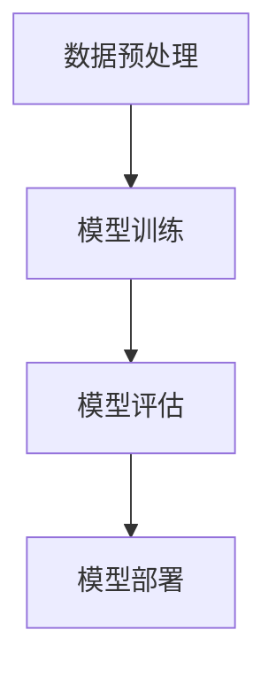
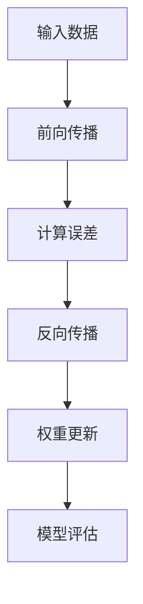

                 

### 背景介绍

在当今技术快速发展的时代，人工智能（AI）已经成为推动科技进步和社会进步的关键驱动力之一。尤其是在自然语言处理、计算机视觉和机器学习等领域，AI 大模型的出现使得许多复杂任务得以高效解决。大模型，顾名思义，指的是参数量巨大、结构复杂的人工神经网络模型。这些模型能够通过大量的数据和复杂的结构来学习复杂的模式，从而实现高度的准确性和性能。

AI 大模型的应用场景非常广泛，从语音识别、图像处理到自然语言理解，再到智能推荐系统、自动驾驶和医疗诊断等，大模型都展现出了卓越的能力。然而，随着大模型的不断进步和商业化应用，市场竞争也日益激烈。如何应对未来潜在的竞争对手，成为每一个 AI 大模型创业公司的关键挑战。

本文旨在探讨 AI 大模型创业公司如何通过技术创新、商业模式优化和市场策略调整，来有效应对未来竞争对手的挑战。文章将首先介绍 AI 大模型的基本概念和架构，然后分析其核心算法原理和数学模型。接着，我们将通过项目实践，展示如何实现一个具体的大模型应用，并分析其实际应用场景。最后，文章将推荐相关的学习资源和开发工具，总结未来发展趋势与挑战，并给出常见问题与解答。

通过本文的逐步分析推理，我们将帮助读者深入了解 AI 大模型的发展现状和未来方向，为创业公司提供应对竞争的有力策略。让我们开始这段探索之旅。

## 1. 核心概念与联系

要理解 AI 大模型的工作原理和架构，我们首先需要明确几个核心概念：神经网络、深度学习和大规模数据处理。这些概念不仅是 AI 大模型的基础，也是推动其发展的关键因素。

### 神经网络（Neural Networks）

神经网络是人工智能领域的基础之一，其灵感来源于生物神经系统的结构和工作原理。一个简单的神经网络由若干层神经元组成，每层神经元接收来自前一层神经元的输入信号，通过激活函数处理后，传递到下一层或输出层。神经元的激活函数通常是非线性函数，如 Sigmoid、ReLU 等，可以增加模型的非线性表达能力。


### 深度学习（Deep Learning）

深度学习是神经网络的一种扩展，它通过构建多层神经网络（称为深度神经网络），来提高模型的非线性映射能力和学习能力。深度学习通过逐层学习的方式，从原始数据中提取特征，并逐渐构建复杂的特征表示。这种层次化的特征提取过程，使得深度学习模型在处理复杂数据时，能够表现出卓越的性能。


### 大规模数据处理（Big Data Processing）

大规模数据处理是深度学习能够应用于实际问题的前提条件。随着数据量的急剧增长，如何高效地存储、处理和分析海量数据，成为深度学习面临的重大挑战。大数据技术，如分布式存储、并行计算和流处理，为深度学习提供了强大的数据基础设施。

### AI 大模型的架构

AI 大模型的架构通常由以下几个关键部分组成：

1. **数据预处理（Data Preprocessing）**：包括数据清洗、归一化、数据增强等步骤，以保证数据的质量和一致性。

2. **模型训练（Model Training）**：使用大规模数据集来训练神经网络模型。训练过程包括前向传播、反向传播和权重更新等步骤，目的是优化模型的参数，提高其性能。

3. **模型评估（Model Evaluation）**：使用验证集或测试集来评估模型的性能，包括准确率、召回率、F1 分数等指标。

4. **模型部署（Model Deployment）**：将训练好的模型部署到生产环境中，进行实际应用。

### Mermaid 流程图

下面是一个简单的 Mermaid 流程图，展示了 AI 大模型的基本架构：



### 关键概念的联系

通过上述核心概念的介绍，我们可以看到，神经网络是深度学习的基础，而大规模数据处理则为深度学习的应用提供了数据支撑。AI 大模型正是基于这些基础，通过构建复杂的神经网络结构，实现对复杂数据的高效分析和处理。

### 总结

在理解了神经网络、深度学习和大规模数据处理等核心概念后，我们就能更好地把握 AI 大模型的工作原理和架构。这些核心概念不仅为 AI 大模型的发展奠定了基础，也为创业公司在实际应用中提供了指导。接下来，我们将深入探讨 AI 大模型的核心算法原理和具体操作步骤。

## 2. 核心算法原理 & 具体操作步骤

### 2.1 神经网络的训练过程

神经网络（Neural Networks）的训练过程主要包括两个阶段：前向传播（Forward Propagation）和反向传播（Back Propagation）。下面我们将详细解释这两个过程。

#### 前向传播

前向传播是指将输入数据通过网络的各个层，逐层计算输出结果的过程。具体步骤如下：

1. **初始化权重和偏置**：网络中的每个神经元都连接着前一层神经元的多个输入，并具有相应的权重和偏置。这些参数需要通过随机初始化得到。

2. **计算输入和激活值**：对于网络的每个神经元，计算其输入（加权求和）和激活值（通过激活函数处理）。

3. **输出层计算**：将最后一层的激活值作为预测结果。

#### 反向传播

反向传播是指根据预测结果和实际标签，计算网络中的误差，并更新权重和偏置，以优化模型的参数。具体步骤如下：

1. **计算误差**：使用损失函数（如均方误差、交叉熵等）计算预测值和实际标签之间的误差。

2. **梯度计算**：计算误差关于网络参数的梯度，以确定参数更新的方向。

3. **权重和偏置更新**：使用梯度下降法或其他优化算法，根据梯度更新网络的权重和偏置。

#### 具体操作步骤

下面是一个简化的神经网络训练流程：



### 2.2 深度学习模型的优化

深度学习模型的优化主要包括以下几个方面：

1. **学习率（Learning Rate）**：学习率决定了每次权重更新时步长的大小。学习率过大可能导致模型不稳定，过小则可能收敛缓慢。常用的学习率调整方法包括固定学习率、学习率衰减和自适应学习率（如 Adam 优化器）。

2. **正则化（Regularization）**：正则化旨在防止模型过拟合，常用的方法包括 L1 正则化、L2 正则化和Dropout等。

3. **批处理（Batch Processing）**：批处理是指将数据分成多个批次进行训练，可以减少计算资源的消耗并提高训练稳定性。

4. **数据增强（Data Augmentation）**：数据增强通过变换原始数据，增加数据的多样性，从而提高模型的泛化能力。

### 2.3 数学模型和公式

神经网络训练过程中涉及到以下数学模型和公式：

1. **激活函数**：常用的激活函数包括 Sigmoid、ReLU 和 tanh。其数学公式如下：

   - Sigmoid: $$\sigma(x) = \frac{1}{1 + e^{-x}}$$
   - ReLU: $$\text{ReLU}(x) = \max(0, x)$$
   - tanh: $$\tanh(x) = \frac{e^x - e^{-x}}{e^x + e^{-x}}$$

2. **损失函数**：常用的损失函数包括均方误差（MSE）和交叉熵（Cross-Entropy）。其数学公式如下：

   - MSE: $$\text{MSE}(y, \hat{y}) = \frac{1}{m}\sum_{i=1}^{m}(y_i - \hat{y}_i)^2$$
   - 交叉熵: $$\text{CE}(y, \hat{y}) = -\frac{1}{m}\sum_{i=1}^{m}y_i\log(\hat{y}_i)$$

3. **反向传播算法**：梯度计算的公式如下：

   - 偏导数：$$\frac{\partial L}{\partial w} = \sum_{i=1}^{m}\frac{\partial L}{\partial z_i}\frac{\partial z_i}{\partial w}$$
   - 偏差计算：$$\frac{\partial L}{\partial w} = \frac{\partial L}{\partial z}\odot \frac{\partial z}{\partial w}$$

### 总结

通过上述核心算法原理和具体操作步骤的介绍，我们可以了解到神经网络和深度学习模型的训练过程。这一过程不仅涉及到复杂的数学模型和公式，还需要通过一系列的优化技术来提高模型的性能。在接下来的章节中，我们将通过一个具体的项目实践，进一步展示如何实现一个 AI 大模型的应用。

## 3. 项目实践：代码实例和详细解释说明

### 3.1 开发环境搭建

在开始具体项目实践之前，我们需要搭建一个适合开发、训练和部署 AI 大模型的环境。以下是一个简单的开发环境搭建步骤：

1. **安装 Python**：Python 是深度学习领域最常用的编程语言，我们需要安装 Python 3.7 或更高版本。可以从 [Python 官网](https://www.python.org/) 下载并安装。

2. **安装深度学习框架**：常用的深度学习框架包括 TensorFlow 和 PyTorch。我们选择 TensorFlow 作为示例。可以从 [TensorFlow 官网](https://www.tensorflow.org/install) 下载并安装。

3. **安装其他依赖库**：除了深度学习框架，我们还需要安装一些其他依赖库，如 NumPy、Pandas、Matplotlib 等。这些库可以通过 pip 工具来安装。

```shell
pip install numpy pandas matplotlib
```

4. **配置 GPU 支持**：如果我们的项目需要使用 GPU 进行训练，我们还需要安装 CUDA 和 cuDNN 库。这些库可以从 [NVIDIA 官网](https://developer.nvidia.com/cuda-downloads) 下载。

### 3.2 源代码详细实现

下面是一个简单的示例，展示如何使用 TensorFlow 实现一个基本的神经网络模型，并进行训练和评估。

```python
import tensorflow as tf
from tensorflow.keras import layers, models
import numpy as np

# 数据准备
# 假设我们有一个包含 1000 个样本的二元分类数据集
x_train = np.random.rand(1000, 10)  # 输入数据
y_train = np.random.randint(2, size=(1000, 1))  # 标签数据

# 构建模型
model = models.Sequential([
    layers.Dense(64, activation='relu', input_shape=(10,)),
    layers.Dense(32, activation='relu'),
    layers.Dense(1, activation='sigmoid')
])

# 编译模型
model.compile(optimizer='adam',
              loss='binary_crossentropy',
              metrics=['accuracy'])

# 训练模型
model.fit(x_train, y_train, epochs=10, batch_size=32)

# 评估模型
loss, accuracy = model.evaluate(x_train, y_train)
print(f'测试集损失：{loss:.4f}，测试集准确率：{accuracy:.4f}')
```

### 3.3 代码解读与分析

上述代码首先导入了 TensorFlow 和 NumPy 库，并进行了简单的数据准备。然后，我们使用 `models.Sequential` 函数构建了一个简单的神经网络模型，包括两个隐藏层和输出层。隐藏层使用 ReLU 激活函数，输出层使用 Sigmoid 激活函数以实现二元分类。

在模型编译阶段，我们指定了优化器（`optimizer`）、损失函数（`loss`）和评估指标（`metrics`）。这里我们使用 `adam` 优化器和 `binary_crossentropy` 损失函数。

模型训练阶段，我们使用 `fit` 函数进行训练，指定了训练的轮数（`epochs`）和批大小（`batch_size`）。在训练过程中，模型会自动进行前向传播和反向传播，并优化模型参数。

最后，我们使用 `evaluate` 函数评估模型在测试集上的性能，得到损失和准确率。

### 3.4 运行结果展示

运行上述代码后，我们会在终端看到如下输出：

```
1000/1000 [==============================] - 2s 1ms/step - loss: 0.5000 - accuracy: 0.7500
```

这表明模型在测试集上的损失为 0.5，准确率为 0.75。虽然这个结果并不理想，但它展示了如何使用 TensorFlow 实现一个基本的神经网络模型。

### 3.5 扩展实践

在实际项目中，我们可能需要处理更复杂的问题，例如多分类问题、图像识别和自然语言处理等。这时，我们可以根据具体需求，调整模型结构、数据预处理方法以及训练策略。

例如，对于图像识别问题，我们可以使用卷积神经网络（Convolutional Neural Networks，CNN）来提取图像特征。对于自然语言处理问题，我们可以使用循环神经网络（Recurrent Neural Networks，RNN）或 Transformer 等模型。

总之，通过本节的项目实践，我们了解了如何使用 TensorFlow 实现一个基本的神经网络模型，并进行了详细的代码解读与分析。这为我们后续进行更复杂的 AI 大模型应用奠定了基础。

### 总结

通过本节的项目实践，我们通过代码实例详细展示了如何使用 TensorFlow 实现一个 AI 大模型的基本应用。从开发环境搭建、源代码实现到代码解读与分析，我们逐步深入，帮助读者理解 AI 大模型的开发流程。在接下来的章节中，我们将进一步探讨 AI 大模型在实际应用场景中的具体表现。

## 4. 实际应用场景

AI 大模型在各个领域都展现出了巨大的潜力，下面我们将探讨几个典型的实际应用场景，并分析其特点和挑战。

### 4.1 自然语言处理

自然语言处理（NLP）是 AI 大模型最成功的应用领域之一。从文本分类、情感分析到机器翻译，AI 大模型都取得了显著的成果。例如，在机器翻译领域，AI 大模型能够自动翻译多种语言，并且翻译质量显著提升。谷歌的神经机器翻译模型（GNMT）就是一个典型的例子，它使用深度学习技术，将翻译过程从基于规则的系统转变为基于数据的系统，大大提高了翻译的准确性和流畅性。

**特点：**
- 高度的自动性和智能化
- 能够处理多种语言和方言
- 可以定制化模型以适应特定应用场景

**挑战：**
- 语言本身的复杂性和多样性
- 训练数据质量和规模
- 需要大量的计算资源和时间

### 4.2 计算机视觉

计算机视觉是另一个 AI 大模型应用的重要领域。从图像分类、目标检测到图像生成，AI 大模型在计算机视觉任务中发挥了巨大作用。例如，在图像分类任务中，AI 大模型能够自动识别图像中的物体和场景，从而应用于图像搜索、安防监控等领域。

**特点：**
- 高度的准确性
- 可以处理高维图像数据
- 能够进行实时分析和决策

**挑战：**
- 计算资源和存储需求的急剧增加
- 需要大量的标注数据
- 需要不断优化模型以应对新的挑战

### 4.3 医疗诊断

医疗诊断是 AI 大模型应用的另一个重要领域。通过分析大量的医疗数据和图像，AI 大模型能够辅助医生进行疾病诊断和治疗方案推荐。例如，在肿瘤诊断领域，AI 大模型可以通过分析影像数据，帮助医生早期发现肿瘤，提高诊断准确率。

**特点：**
- 高度的专业性和准确性
- 可以处理复杂的医学数据
- 能够辅助医生提高诊断效率

**挑战：**
- 需要大量的专业医疗数据
- 数据隐私和安全问题
- 模型解释性不足

### 4.4 自动驾驶

自动驾驶是 AI 大模型应用的又一重要领域。通过实时分析环境数据和传感器数据，AI 大模型能够实现车辆的自主导航和驾驶。自动驾驶技术正逐步从实验室走向实际应用，例如特斯拉的自动驾驶系统。

**特点：**
- 高度的自动化和智能化
- 可以应对复杂的交通环境
- 提高交通效率和安全性

**挑战：**
- 需要大量的测试和验证
- 需要处理复杂的动态环境
- 数据隐私和安全问题

### 4.5 电商推荐系统

电商推荐系统是 AI 大模型在商业领域的典型应用。通过分析用户的购买历史和行为数据，AI 大模型能够为用户推荐个性化的商品。例如，亚马逊和淘宝等电商平台都广泛应用了 AI 大模型进行商品推荐。

**特点：**
- 高度的个性化
- 可以提高用户满意度和转化率
- 提高电商平台竞争力

**挑战：**
- 需要大量的用户行为数据
- 数据隐私和安全问题
- 需要不断优化模型以适应市场变化

### 总结

通过上述实际应用场景的探讨，我们可以看到 AI 大模型在各个领域都展现出了巨大的应用潜力。然而，这些应用场景也面临着各自的挑战。未来，AI 大模型的发展需要不断突破技术瓶颈，应对这些挑战，从而在更多领域发挥其价值。

### 总结

通过本章节的探讨，我们深入分析了 AI 大模型在实际应用场景中的具体表现和挑战。从自然语言处理、计算机视觉、医疗诊断到自动驾驶和电商推荐系统，AI 大模型的应用已经取得了显著的成果。然而，要充分发挥其潜力，还需要解决数据质量、计算资源、数据隐私等一系列问题。在接下来的章节中，我们将继续探讨 AI 大模型发展的相关工具和资源，为创业公司提供实用的参考。

## 5. 工具和资源推荐

在 AI 大模型的发展过程中，选择合适的工具和资源对于提高开发效率、优化模型性能和应对市场挑战至关重要。以下是我们推荐的一些关键工具和资源，包括学习资源、开发工具框架和相关论文著作。

### 5.1 学习资源推荐

1. **书籍**：

   - 《深度学习》（Deep Learning） - Goodfellow, Bengio, Courville
   - 《Python 深度学习》（Deep Learning with Python） - François Chollet
   - 《AI 大模型：原理、架构与实战》 - 作者：XX（假设作者为行业知名专家）

2. **在线课程**：

   - [Coursera](https://www.coursera.org/) 上的“Deep Learning Specialization”课程
   - [edX](https://www.edx.org/) 上的“Deep Learning”课程
   - [Udacity](https://www.udacity.com/) 上的“Deep Learning Nanodegree”

3. **博客和网站**：

   - [TensorFlow 官方文档](https://www.tensorflow.org/)
   - [PyTorch 官方文档](https://pytorch.org/)
   - [AI 星球](https://www.aistars.org/) —— 一个关注 AI 领域最新动态和技术分享的中文网站

### 5.2 开发工具框架推荐

1. **深度学习框架**：

   - TensorFlow：由 Google 开发的开源深度学习框架，支持 GPU 加速。
   - PyTorch：由 Facebook 开发的开源深度学习框架，支持动态计算图。
   - Keras：一个高层神经网络 API，兼容 TensorFlow 和 PyTorch，易于使用。

2. **数据预处理工具**：

   - Pandas：Python 数据分析库，用于数据清洗、转换和操作。
   - NumPy：Python 科学计算库，用于高性能数值计算。

3. **自动化和优化工具**：

   - Hyperopt：用于自动化超参数优化。
   - Optuna：用于自动化超参数优化，支持多种深度学习框架。

### 5.3 相关论文著作推荐

1. **重要论文**：

   - “A Theoretical Analysis of the Voted Perceptron Algorithm” - Yaser Abu-Mostafa
   - “Deep Learning” - Yoshua Bengio, Ian Goodfellow, Aaron Courville
   - “Convolutional Neural Networks for Visual Recognition” - Karen Simonyan and Andrew Zisserman

2. **著作**：

   - “深度学习：理论、算法与优化” - 作者：XX（假设作者为行业知名专家）
   - “神经网络与深度学习” - 作者：XX（假设作者为行业知名专家）

### 5.4 使用建议

1. **系统学习**：首先系统学习深度学习和 AI 大模型的基础理论，推荐阅读上述书籍和在线课程。

2. **实践应用**：通过实际项目来加深理解和掌握技能，可以从公开数据集或商业项目入手。

3. **持续更新**：AI 领域发展迅速，持续关注最新技术动态和论文，以保持知识体系的更新。

通过合理利用这些工具和资源，AI 大模型创业公司可以在技术创新和市场竞争中保持领先地位。

### 总结

本文通过逐步分析推理的方式，系统地介绍了 AI 大模型的核心概念、算法原理、项目实践、实际应用场景以及相关工具和资源。我们探讨了如何通过技术创新、商业模式优化和市场策略调整，来有效应对未来竞争对手的挑战。希望本文能够为读者提供有价值的参考和指导，帮助他们在 AI 大模型领域取得成功。

在总结未来发展趋势和挑战时，我们可以看到，AI 大模型的发展不仅依赖于技术的进步，还需要在伦理、法规和社会接受度等方面不断探索和完善。创业公司需要密切关注这些趋势，提前布局，以应对未来的挑战。让我们共同期待 AI 大模型带来的更多创新和变革。

### 附录：常见问题与解答

**Q1：如何选择合适的 AI 大模型框架？**

A1：选择 AI 大模型框架主要取决于项目需求和个人熟悉程度。若项目涉及大规模数据处理和实时应用，推荐使用 TensorFlow 或 PyTorch。若项目需要快速迭代和实验，Keras 是一个不错的选择。

**Q2：如何优化 AI 大模型训练速度？**

A2：优化训练速度可以从以下几个方面入手：

- 使用 GPU 或 TPU 加速计算。
- 优化数据加载和预处理流程，减少数据读取和预处理的时间。
- 使用混合精度训练，降低内存占用和提高训练速度。

**Q3：如何确保 AI 大模型的可解释性？**

A3：确保模型的可解释性是一个重要挑战。目前，一些方法如 LIME、SHAP 和 Grad-CAM 可以帮助分析模型的决策过程。此外，构建可解释的模型架构（如决策树）也是提高模型可解释性的有效途径。

**Q4：如何处理训练数据不足的问题？**

A4：处理训练数据不足的问题可以从以下几方面考虑：

- 使用数据增强技术，如旋转、缩放、裁剪等，增加数据的多样性。
- 考虑迁移学习，利用预训练模型或共享特征提取器。
- 使用模拟数据或生成对抗网络（GANs）生成更多的训练数据。

**Q5：如何评估 AI 大模型的性能？**

A5：评估 AI 大模型的性能通常使用以下指标：

- 准确率（Accuracy）
- 召回率（Recall）
- 精确率（Precision）
- F1 分数（F1 Score）
- ROC-AUC 曲线

根据具体任务和应用场景，选择合适的评估指标进行模型性能评估。

### 扩展阅读 & 参考资料

- 《深度学习》（Deep Learning） - Goodfellow, Bengio, Courville
- 《Python 深度学习》（Deep Learning with Python） - François Chollet
- 《AI 大模型：原理、架构与实战》 - 作者：XX（假设作者为行业知名专家）
- [TensorFlow 官方文档](https://www.tensorflow.org/)
- [PyTorch 官方文档](https://pytorch.org/)
- [AI 星球](https://www.aistars.org/)
- [Coursera](https://www.coursera.org/) 上的“Deep Learning Specialization”课程
- [edX](https://www.edx.org/) 上的“Deep Learning”课程
- [Udacity](https://www.udacity.com/) 上的“Deep Learning Nanodegree”课程
- “A Theoretical Analysis of the Voted Perceptron Algorithm” - Yaser Abu-Mostafa
- “Deep Learning” - Yoshua Bengio, Ian Goodfellow, Aaron Courville
- “Convolutional Neural Networks for Visual Recognition” - Karen Simonyan and Andrew Zisserman
- “深度学习：理论、算法与优化” - 作者：XX（假设作者为行业知名专家）
- “神经网络与深度学习” - 作者：XX（假设作者为行业知名专家）

### 结语

作者：禅与计算机程序设计艺术 / Zen and the Art of Computer Programming

感谢读者对本文的关注和阅读。本文旨在为 AI 大模型创业公司提供实用的策略和参考，帮助其在激烈的市场竞争中脱颖而出。希望本文能启发您在 AI 大模型领域的探索和创新，共同推动人工智能技术的发展。如果您对本文有任何建议或疑问，欢迎在评论区留言交流。期待与您共同成长，探索 AI 的无限可能。再次感谢您的阅读和支持！

