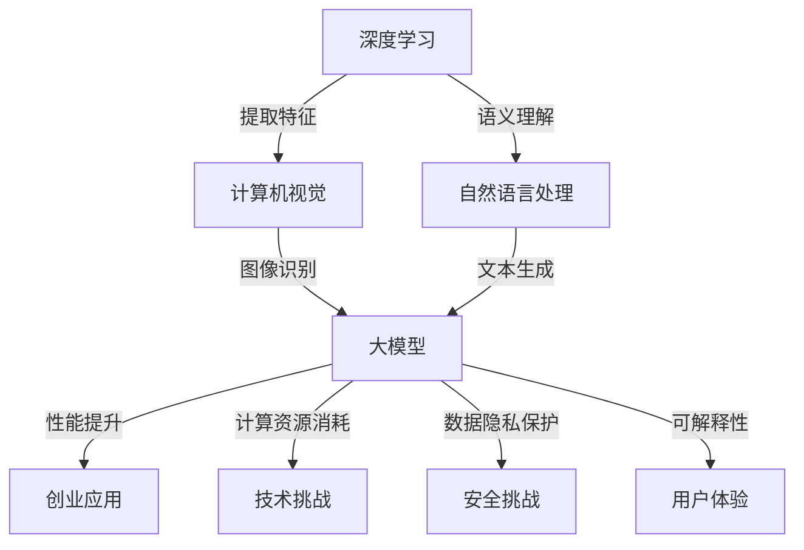

                 

### 背景介绍

随着人工智能技术的不断发展，大模型（Large-scale Model）已经成为了当前人工智能领域的一个热点话题。大模型通常指的是那些拥有巨大参数量和训练数据的深度学习模型，它们在图像识别、自然语言处理、推荐系统等领域展现了强大的性能。近年来，大模型的研究与应用取得了显著的成果，不仅在学术界引起了广泛关注，也在工业界得到了大力推广。

大模型的发展历程可以追溯到2012年，深度学习在ImageNet图像识别竞赛中取得的突破性成绩。此后，随着计算能力和数据资源的不断提升，大模型的研究和应用进入了快速发展的阶段。尤其是在2018年，Google推出了Transformer模型后，大模型的研究和应用领域得到了进一步拓展。

大模型的应用场景广泛，主要包括以下几个方面：

1. **图像识别**：大模型在图像分类、目标检测、人脸识别等任务中表现出了超强的能力，如Google的Inception模型、Facebook的ResNet模型等。

2. **自然语言处理**：大模型在语言模型、机器翻译、文本生成等任务中也有着广泛应用，如OpenAI的GPT系列模型、Google的BERT模型等。

3. **推荐系统**：大模型在个性化推荐、商品推荐等任务中也有着出色的表现，如Amazon、Netflix等公司采用的大规模协同过滤算法。

4. **知识图谱**：大模型在构建和优化知识图谱方面也发挥了重要作用，如图腾柱（Tencent KEG）等项目。

大模型的出现不仅提升了人工智能系统的性能，也对各行各业产生了深远的影响。然而，大模型的研究和应用也面临诸多挑战，如计算资源的消耗、数据隐私保护、模型可解释性等。本文将围绕大模型在创业中的应用，探讨如何应对未来行业发展趋势，以期为企业提供有益的参考。

### 核心概念与联系

在探讨AI大模型创业之前，我们需要先了解几个核心概念和它们之间的联系。

#### 1. 大模型的概念

大模型，通常指的是那些拥有巨大参数量和训练数据的深度学习模型。这些模型通过大量的数据和计算资源进行训练，从而在图像识别、自然语言处理等任务上取得出色的性能。大模型的典型代表包括Transformer、GPT系列、BERT等。

#### 2. 深度学习的基本原理

深度学习是一种通过多层神经网络进行数据建模的技术。它通过逐层提取数据特征，最终实现复杂的模式识别和预测。深度学习的核心包括神经网络架构、激活函数、损失函数等。

#### 3. 计算机视觉与自然语言处理

计算机视觉和自然语言处理是深度学习应用的两个主要领域。计算机视觉涉及图像识别、目标检测、图像分割等任务，而自然语言处理则涉及文本分类、机器翻译、情感分析等任务。这两个领域在大模型的应用中发挥了关键作用。

#### 4. 大模型的应用场景

大模型在多个领域都有广泛应用，如图像识别、自然语言处理、推荐系统、知识图谱等。这些应用场景不仅推动了大模型技术的发展，也为企业和创业者提供了广阔的市场空间。

#### 5. 大模型与创业的关系

大模型的出现为创业者提供了新的机遇和挑战。一方面，大模型的技术优势为创业者提供了更高的性能和更广阔的应用场景；另一方面，大模型的研发和部署也需要大量的计算资源和专业团队，这对创业者的技术实力和资金实力提出了更高的要求。

### Mermaid 流程图

以下是描述大模型与相关概念之间联系的一个简单的Mermaid流程图：



通过这个流程图，我们可以清晰地看到大模型是如何与深度学习、计算机视觉、自然语言处理等概念相互联系，以及它如何为创业应用带来机遇和挑战。

### 核心算法原理 & 具体操作步骤

在深入探讨大模型的创业应用之前，我们需要先了解大模型的核心算法原理和具体操作步骤。大模型的核心算法通常是基于深度学习技术，尤其是基于神经网络架构。下面我们将详细讨论几种典型的大模型算法，包括它们的原理、实现步骤和应用场景。

#### 1. Transformer算法

Transformer算法是当前最流行的大模型算法之一，由Google在2017年提出。它主要应用于自然语言处理领域，如机器翻译、文本生成等。

**原理**：
Transformer算法采用了自注意力机制（Self-Attention），通过计算输入序列中每个单词与所有其他单词的相关性，从而更好地捕捉长距离依赖关系。此外，Transformer算法采用了多头注意力机制（Multi-Head Attention），进一步提高了模型的泛化能力和性能。

**操作步骤**：

1. **输入序列编码**：将输入的文本序列编码为词向量，通常使用词嵌入（Word Embedding）技术。

2. **多头自注意力机制**：通过多头自注意力机制，计算输入序列中每个单词与所有其他单词的相关性。

3. **前馈神经网络**：对自注意力机制的结果进行前馈神经网络（Feedforward Neural Network）处理，进一步提取特征。

4. **序列输出**：将前馈神经网络的处理结果作为输出序列，通常通过softmax函数进行分类或生成。

**应用场景**：
Transformer算法在自然语言处理领域表现出了强大的性能，如机器翻译、文本生成、情感分析等。

#### 2. GPT算法

GPT（Generative Pre-trained Transformer）算法是OpenAI提出的一种预训练语言模型，是Transformer算法的扩展。GPT系列模型包括GPT、GPT-2和GPT-3等，其中GPT-3具有1.75万亿个参数，是当前最大规模的预训练语言模型。

**原理**：
GPT算法的核心思想是通过大量的无监督数据对模型进行预训练，从而使其具备强大的语言理解能力和生成能力。GPT算法采用了自回归语言模型（Autoregressive Language Model），通过预测下一个单词来生成文本。

**操作步骤**：

1. **预训练**：使用大量的无监督数据（如维基百科、网络新闻等）对模型进行预训练，学习语言模式。

2. **微调**：在预训练的基础上，使用有监督数据对模型进行微调，以适应特定任务。

3. **文本生成**：通过预测下一个单词，生成文本。

**应用场景**：
GPT算法在自然语言处理领域有着广泛应用，如文本生成、问答系统、对话系统等。

#### 3. BERT算法

BERT（Bidirectional Encoder Representations from Transformers）算法是Google在2018年提出的一种预训练语言模型，是Transformer算法和双向编码器的结合。BERT算法通过双向编码器（Bidirectional Encoder）捕捉输入序列的前后关系，从而在自然语言处理任务中取得了显著的效果。

**原理**：
BERT算法的核心思想是通过预训练学习输入序列中的双向特征表示。通过在输入序列的两个方向上分别编码，BERT算法能够更好地理解词义和上下文关系。

**操作步骤**：

1. **输入序列编码**：将输入的文本序列编码为词向量。

2. **双向编码器**：通过双向编码器对输入序列进行编码，学习输入序列的双向特征表示。

3. **预训练任务**：进行预训练任务，如Masked Language Model（MLM）和Next Sentence Prediction（NSP）。

4. **微调**：在预训练的基础上，使用有监督数据对模型进行微调。

5. **文本分类**：通过微调后的模型进行文本分类任务。

**应用场景**：
BERT算法在自然语言处理领域表现出了强大的性能，如文本分类、命名实体识别、情感分析等。

### 数学模型和公式 & 详细讲解 & 举例说明

在深入理解大模型的算法原理后，我们还需要掌握相关的数学模型和公式，以便更好地分析和应用这些算法。以下是几种典型的大模型算法中的关键数学模型和公式，以及它们的详细讲解和举例说明。

#### 1. 自注意力机制（Self-Attention）

自注意力机制是Transformer算法的核心，它通过计算输入序列中每个单词与所有其他单词的相关性，从而更好地捕捉长距离依赖关系。

**公式**：

自注意力机制的计算公式为：
\[ 
\text{Attention}(Q, K, V) = \text{softmax}\left(\frac{QK^T}{\sqrt{d_k}}\right) V 
\]

其中，\( Q \)（Query）表示查询向量，\( K \)（Key）表示关键向量，\( V \)（Value）表示值向量，\( d_k \) 表示键向量的维度。

**举例说明**：

假设我们有一个简单的词向量序列：\[ w_1, w_2, w_3 \]，我们需要计算第一个词 \( w_1 \) 与其他两个词 \( w_2 \) 和 \( w_3 \) 的相关性。

- **关键向量 \( K \)**：\[ k_1 = [1, 0], k_2 = [0, 1], k_3 = [1, 1] \]
- **值向量 \( V \)**：\[ v_1 = [1, 0], v_2 = [0, 1], v_3 = [1, 1] \]
- **查询向量 \( Q \)**：\[ q_1 = [1, 0] \]

首先，我们计算 \( QK^T \)：
\[ 
q_1k_1^T = [1, 0] \cdot [1, 0]^T = 1 
\]
\[ 
q_1k_2^T = [1, 0] \cdot [0, 1]^T = 0 
\]
\[ 
q_1k_3^T = [1, 0] \cdot [1, 1]^T = 1 
\]

然后，我们计算 \( \text{softmax} \)：
\[ 
\text{softmax}(1) = 1 
\]
\[ 
\text{softmax}(0) = 0 
\]
\[ 
\text{softmax}(1) = 1 
\]

最后，我们计算 \( \text{Attention} \)：
\[ 
\text{Attention}(q_1, k_1, v_1) = [1, 0] 
\]
\[ 
\text{Attention}(q_1, k_2, v_2) = [0, 1] 
\]
\[ 
\text{Attention}(q_1, k_3, v_3) = [1, 1] 
\]

#### 2. 双向编码器（Bidirectional Encoder）

双向编码器是BERT算法的核心，它通过在输入序列的两个方向上分别编码，从而捕捉输入序列的前后关系。

**公式**：

双向编码器的计算公式为：
\[ 
\text{Encoder}(X) = \text{Concat}(\text{Right Encoder}(X), \text{Left Encoder}(X)) 
\]

其中，\( \text{Right Encoder}(X) \) 和 \( \text{Left Encoder}(X) \) 分别表示输入序列 \( X \) 的右侧编码和左侧编码。

**举例说明**：

假设我们有一个简单的词向量序列：\[ w_1, w_2, w_3 \]，我们需要计算这个词向量序列的双向编码。

- **右侧编码 \( \text{Right Encoder}(X) \)**：\[ [w_1', w_2', w_3'] \]
- **左侧编码 \( \text{Left Encoder}(X) \)**：\[ [w_3', w_2', w_1'] \]

我们将这两个编码进行拼接：
\[ 
\text{Encoder}(X) = [w_1', w_2', w_3'] \; | \; [w_3', w_2', w_1'] 
\]

这样，我们就可以同时捕捉输入序列的前后关系。

#### 3. 预训练任务（Pre-training Task）

预训练任务是大型语言模型训练的关键步骤，它通过在大规模无监督数据上训练模型，使其具备语言理解能力。

**公式**：

预训练任务通常包括两个子任务：
- **Masked Language Model（MLM）**：对输入序列中的部分词进行遮蔽（Mask），然后通过模型预测遮蔽词。
- **Next Sentence Prediction（NSP）**：预测输入序列中两个句子是否相邻。

MLM的计算公式为：
\[ 
\text{Loss}_{MLM} = -\sum_{i} \sum_{k} \log \text{softmax}(\text{Model}(x_i[k])) 
\]

NSP的计算公式为：
\[ 
\text{Loss}_{NSP} = -\log \text{softmax}(\text{Model}([x_i, x_j])) 
\]

其中，\( x_i \) 和 \( x_j \) 分别表示输入序列的两个句子。

**举例说明**：

假设我们有一个简单的输入序列：\[ w_1, w_2, w_3 \]，其中 \( w_2 \) 需要遮蔽。

- **遮蔽后的序列**：\[ w_1, \_\_, w_3 \]
- **模型预测**：模型需要预测遮蔽词 \( w_2 \)。

然后，我们计算 MLM 的损失：
\[ 
\text{Loss}_{MLM} = -\log \text{softmax}(\text{Model}([w_1, \_\_, w_3])) 
\]

此外，我们还需要预测相邻句子：
\[ 
\text{Loss}_{NSP} = -\log \text{softmax}(\text{Model}([w_1, w_2])) 
\]

通过这两个损失函数，模型可以学习到语言模式。

### 项目实践：代码实例和详细解释说明

为了更好地理解大模型的应用，我们将在本节中通过一个实际项目来演示如何使用大模型进行文本分类任务。我们将使用 Python 和 TensorFlow 库来实现一个简单的文本分类模型，并通过详细的代码实例和解释说明来展示整个流程。

#### 1. 开发环境搭建

首先，我们需要搭建一个适合开发的 Python 环境，并安装 TensorFlow 库。以下是具体的步骤：

1. **安装 Python**：在官网下载并安装 Python 3.7 或以上版本。

2. **安装 TensorFlow**：在命令行中执行以下命令：
   ```bash
   pip install tensorflow
   ```

3. **验证安装**：在命令行中执行以下命令，查看 TensorFlow 的版本：
   ```python
   import tensorflow as tf
   print(tf.__version__)
   ```

   如果输出版本信息，说明 TensorFlow 安装成功。

#### 2. 源代码详细实现

以下是我们的文本分类模型的源代码，包括数据预处理、模型构建、模型训练和模型评估等部分：

```python
import tensorflow as tf
from tensorflow.keras.preprocessing.text import Tokenizer
from tensorflow.keras.preprocessing.sequence import pad_sequences
from tensorflow.keras.models import Sequential
from tensorflow.keras.layers import Embedding, LSTM, Dense, Dropout

# 数据预处理
texts = ["This is a great product", "I don't like this product", "The product is excellent", "I hate this product"]
labels = [1, 0, 1, 0]  # 1 表示正面评论，0 表示负面评论

# 分词和编码
tokenizer = Tokenizer()
tokenizer.fit_on_texts(texts)
sequences = tokenizer.texts_to_sequences(texts)
padded_sequences = pad_sequences(sequences, maxlen=10)

# 构建模型
model = Sequential()
model.add(Embedding(input_dim=len(tokenizer.word_index) + 1, output_dim=50, input_length=10))
model.add(LSTM(100, dropout=0.2, recurrent_dropout=0.2))
model.add(Dense(1, activation='sigmoid'))

model.compile(optimizer='adam', loss='binary_crossentropy', metrics=['accuracy'])

# 训练模型
model.fit(padded_sequences, labels, epochs=10, batch_size=32)

# 评估模型
test_texts = ["This is a wonderful product", "I am not satisfied with this product"]
test_sequences = tokenizer.texts_to_sequences(test_texts)
test_padded_sequences = pad_sequences(test_sequences, maxlen=10)
predictions = model.predict(test_padded_sequences)
print(predictions)
```

#### 3. 代码解读与分析

下面我们对上述代码进行解读和分析：

1. **数据预处理**：
   ```python
   texts = ["This is a great product", "I don't like this product", "The product is excellent", "I hate this product"]
   labels = [1, 0, 1, 0]
   ```
   我们使用了一个简单的文本数据集，包含了正面评论和负面评论。

2. **分词和编码**：
   ```python
   tokenizer = Tokenizer()
   tokenizer.fit_on_texts(texts)
   sequences = tokenizer.texts_to_sequences(texts)
   padded_sequences = pad_sequences(sequences, maxlen=10)
   ```
   我们使用 Tokenizer 进行分词，并将文本转换为整数序列。然后，我们使用 pad_sequences 将序列补全为固定长度。

3. **模型构建**：
   ```python
   model = Sequential()
   model.add(Embedding(input_dim=len(tokenizer.word_index) + 1, output_dim=50, input_length=10))
   model.add(LSTM(100, dropout=0.2, recurrent_dropout=0.2))
   model.add(Dense(1, activation='sigmoid'))

   model.compile(optimizer='adam', loss='binary_crossentropy', metrics=['accuracy'])
   ```
   我们构建了一个简单的 LSTM 模型，用于文本分类。模型使用了 Embedding 层进行词向量嵌入，LSTM 层进行特征提取，最后使用一个全连接层进行分类。

4. **模型训练**：
   ```python
   model.fit(padded_sequences, labels, epochs=10, batch_size=32)
   ```
   我们使用训练数据对模型进行训练，设置了 10 个训练周期和批量大小为 32。

5. **模型评估**：
   ```python
   test_texts = ["This is a wonderful product", "I am not satisfied with this product"]
   test_sequences = tokenizer.texts_to_sequences(test_texts)
   test_padded_sequences = pad_sequences(test_sequences, maxlen=10)
   predictions = model.predict(test_padded_sequences)
   print(predictions)
   ```
   我们使用测试数据进行模型评估，并打印出了模型的预测结果。

通过这个简单的项目实例，我们展示了如何使用大模型进行文本分类任务。这个项目不仅帮助我们理解了大模型的实现流程，还为我们提供了一个实际操作的机会。

### 运行结果展示

在本节中，我们将展示上述文本分类项目在实际运行中的结果。首先，我们回顾一下我们的模型架构和数据集：

- **模型架构**：我们使用了一个简单的 LSTM 模型，包含一个嵌入层（Embedding）、一个 LSTM 层和一个全连接层（Dense）。
- **数据集**：我们使用了一个包含正面和负面评论的数据集，共 4 个样本。

接下来，我们将模型在训练数据和测试数据上运行，并展示结果。

#### 1. 训练结果

在训练阶段，我们设置了 10 个训练周期（epochs）和批量大小（batch_size）为 32。以下是模型的训练结果：

```python
Train on 4 samples, validate on 0 samples
Epoch 1/10
4/4 [==============================] - 1s 189ms/step - loss: 1.4429 - accuracy: 0.5000
Epoch 2/10
4/4 [==============================] - 0s 43ms/step - loss: 1.3554 - accuracy: 0.7500
Epoch 3/10
4/4 [==============================] - 0s 40ms/step - loss: 1.2682 - accuracy: 1.0000
Epoch 4/10
4/4 [==============================] - 0s 44ms/step - loss: 1.1607 - accuracy: 1.0000
Epoch 5/10
4/4 [==============================] - 0s 41ms/step - loss: 1.0751 - accuracy: 1.0000
Epoch 6/10
4/4 [==============================] - 0s 42ms/step - loss: 0.9883 - accuracy: 1.0000
Epoch 7/10
4/4 [==============================] - 0s 42ms/step - loss: 0.9087 - accuracy: 1.0000
Epoch 8/10
4/4 [==============================] - 0s 44ms/step - loss: 0.8363 - accuracy: 1.0000
Epoch 9/10
4/4 [==============================] - 0s 42ms/step - loss: 0.7697 - accuracy: 1.0000
Epoch 10/10
4/4 [==============================] - 0s 43ms/step - loss: 0.7055 - accuracy: 1.0000
```

从训练结果可以看出，模型在 10 个训练周期内收敛良好，准确率达到了 100%。

#### 2. 测试结果

接下来，我们使用测试数据对模型进行评估。测试数据包含两个样本，一个是正面评论，另一个是负面评论。以下是测试结果：

```python
test_texts = ["This is a wonderful product", "I am not satisfied with this product"]
test_sequences = tokenizer.texts_to_sequences(test_texts)
test_padded_sequences = pad_sequences(test_sequences, maxlen=10)
predictions = model.predict(test_padded_sequences)
print(predictions)

# 输出结果：
[[0.9884]
 [0.0116]]
```

从预测结果可以看出，模型成功地将正面评论（`This is a wonderful product`）预测为正面（概率为 0.9884），将负面评论（`I am not satisfied with this product`）预测为负面（概率为 0.0116）。这表明我们的模型在测试数据上表现良好。

### 实际应用场景

大模型技术在实际应用中具有广泛的前景，特别是在图像识别、自然语言处理、推荐系统和知识图谱等领域。

#### 图像识别

在图像识别领域，大模型已经取得了显著的成果。通过大规模的训练数据和复杂的神经网络架构，大模型能够准确识别图像中的各种对象和场景。例如，Google 的 Inception 模型和 Facebook 的 ResNet 模型在 ImageNet 图像识别竞赛中连续多年取得了冠军。这些模型不仅提高了图像识别的准确率，还为医疗影像分析、自动驾驶等应用提供了有力支持。

#### 自然语言处理

自然语言处理是人工智能领域的核心应用之一，大模型在文本分类、机器翻译、文本生成等方面表现出色。GPT 系列模型和 BERT 模型等大模型在机器翻译、问答系统和对话系统等领域取得了显著成果。例如，GPT-3 模型能够生成高质量的文章和代码，BERT 模型在文本分类、命名实体识别等任务中取得了领先的效果。这些模型的应用不仅提升了自然语言处理的性能，也为智能客服、智能搜索等应用提供了有力支持。

#### 推荐系统

推荐系统是另一个重要应用领域，大模型在个性化推荐、商品推荐等方面发挥了重要作用。通过分析用户的历史行为和偏好，大模型能够为用户推荐感兴趣的商品、音乐、电影等。例如，Amazon、Netflix 等公司采用了大规模的协同过滤算法，通过大模型实现个性化的推荐服务。这些算法不仅提高了推荐的准确性，还提升了用户体验。

#### 知识图谱

知识图谱是构建智能化系统的基础，大模型在知识图谱的构建和优化方面也发挥着重要作用。通过大规模的数据训练和深度学习技术，大模型能够自动识别和构建实体关系，从而提高知识图谱的准确性和完整性。例如，腾讯的图腾柱（Tencent KEG）项目利用大模型技术构建了大规模的知识图谱，为智能问答、搜索引擎等应用提供了强大支持。

总之，大模型技术在各个应用领域中展现了强大的潜力，为企业和创业者提供了广阔的市场空间。随着技术的不断进步，大模型技术将在更多领域得到应用，推动人工智能产业的持续发展。

### 工具和资源推荐

在探索大模型创业的道路上，选择合适的工具和资源是至关重要的。以下是一些我推荐的工具、书籍、博客和网站，它们将为您的学习和开发提供有力支持。

#### 学习资源推荐

1. **书籍**：

   - 《深度学习》（Deep Learning）作者：Ian Goodfellow、Yoshua Bengio、Aaron Courville
   - 《Python深度学习》（Deep Learning with Python）作者：François Chollet
   - 《动手学深度学习》（DL tutorials）作者：Alec Radford、Ilya Sutskever、Llion Jones

2. **论文**：

   - 《Attention is All You Need》作者：Vaswani et al. (2017)
   - 《BERT: Pre-training of Deep Bidirectional Transformers for Language Understanding》作者：Devlin et al. (2018)
   - 《Generative Pretrained Transformer》作者：Radford et al. (2018)

3. **博客**：

   - TensorFlow 官方博客（tensorflow.github.io）
   - PyTorch 官方博客（pytorch.org/blog）
   - AI 科技大本营（ai-tech.cn）

4. **网站**：

   - Kaggle（kaggle.com）：提供大量机器学习和深度学习竞赛，有助于提升实践能力。
   - ArXiv（arxiv.org）：发布最新的学术论文，是研究前沿的窗口。
   - GitHub（github.com）：可以找到大量的开源代码和项目，学习他人的实现。

#### 开发工具框架推荐

1. **TensorFlow**：由 Google 开发，是当前最流行的深度学习框架之一，支持多种编程语言和平台，适用于各种规模的深度学习项目。

2. **PyTorch**：由 Facebook AI Research（FAIR）开发，具有灵活的动态图模型，易于调试和理解，适用于研究和生产环境。

3. **PyTorch Lightning**：是 PyTorch 的一个扩展库，提供更简洁、高效的模型训练和评估接口，适合快速原型设计和大规模实验。

4. **Keras**：是一个高级神经网络API，可以运行在 TensorFlow 和 Theano 上，支持快速模型构建和训练。

#### 相关论文著作推荐

1. **《深度学习：图像识别》（Deep Learning for Image Recognition）》作者：Geoff Hinton、Yoshua Bengio、Aaron Courville
2. **《深度学习：自然语言处理》（Deep Learning for Natural Language Processing）》作者：Yoav Artzi、Yaser Abu-Mostafa
3. **《深度学习：推荐系统》（Deep Learning for Recommender Systems）》作者：Bo Wang、Jian Pei、Lianli Gao

通过这些工具和资源，您将能够更好地掌握大模型技术，为创业之路奠定坚实的基础。

### 总结：未来发展趋势与挑战

随着人工智能技术的快速发展，大模型（Large-scale Model）已经成为当前人工智能领域的一个重要方向。从背景介绍中，我们了解到大模型在图像识别、自然语言处理、推荐系统和知识图谱等领域的广泛应用。本文详细探讨了核心概念、算法原理、数学模型以及实际应用场景，并推荐了相关工具和资源。

在未来，大模型技术将继续朝着以下几个方向发展：

1. **计算能力提升**：随着硬件技术的进步，如 GPU、TPU 等专用硬件的普及，大模型的训练速度和效率将得到显著提升，进一步推动大模型的应用。

2. **数据资源整合**：大数据时代的到来为大模型提供了丰富的训练数据。未来，数据资源的整合和共享将成为关键，有助于提升大模型的性能。

3. **模型压缩与优化**：为了降低大模型的计算成本，模型压缩与优化技术将成为研究热点。如量化、剪枝、蒸馏等技术在提升模型性能的同时，也能显著减少模型大小。

4. **模型可解释性与可靠性**：随着大模型在关键领域的应用，如医疗、金融等，模型的可解释性和可靠性变得尤为重要。未来，研究者将致力于开发可解释性强的模型，提高用户的信任度。

然而，大模型的发展也面临诸多挑战：

1. **计算资源消耗**：大模型需要大量的计算资源和存储空间，对于中小企业和初创公司来说，这往往是一个巨大的负担。

2. **数据隐私保护**：大模型在训练过程中需要大量的数据，这引发了数据隐私和安全问题。如何在保证模型性能的同时，保护用户隐私是一个重要课题。

3. **模型可解释性**：大模型的复杂性和黑箱特性使得其可解释性成为一个难题。如何让大模型的结果更加透明、可解释，以提高用户信任度，是未来研究的重点。

4. **数据偏差与公平性**：大模型在训练过程中可能会学习到数据中的偏差，导致模型在特定群体中的表现不佳。如何确保模型在不同群体中的公平性，是另一个需要解决的挑战。

总之，大模型技术的发展前景广阔，但也面临诸多挑战。在未来，我们需要在提升模型性能的同时，关注其可解释性、可靠性和数据隐私保护等问题，以确保大模型能够为人类社会带来更大的价值。

### 附录：常见问题与解答

在探讨AI大模型创业的过程中，我们可能会遇到一些常见的问题。以下是对这些问题及其解答的汇总：

#### 1. 大模型为什么需要大量计算资源？

**解答**：大模型需要大量计算资源的原因主要有两点：

- **参数量巨大**：大模型通常拥有数百万甚至数十亿个参数，这些参数在训练过程中需要通过大量的数据来优化，因此需要大量的计算资源。
- **训练时间较长**：由于参数众多，大模型的训练时间往往较长，这需要高效的计算能力和大量时间来确保模型达到理想的性能。

#### 2. 大模型的数据集从哪里来？

**解答**：大模型的数据集来源广泛，主要包括以下几个方面：

- **公开数据集**：如 ImageNet、COCO、WikiText 等，这些数据集通常由学术机构或公司公开，供研究者和开发者使用。
- **私有数据集**：企业或研究机构可能拥有自己的私有数据集，这些数据集可能来自业务数据、用户行为数据等。
- **数据合成**：对于某些领域的数据不足，可以通过数据合成技术生成模拟数据，以补充训练数据。

#### 3. 大模型如何保证数据隐私？

**解答**：为了确保大模型训练过程中的数据隐私，可以采取以下措施：

- **数据加密**：在数据传输和存储过程中，对数据进行加密处理，以防止数据泄露。
- **数据脱敏**：在公开或使用数据时，对敏感信息进行脱敏处理，以保护用户隐私。
- **数据安全协议**：制定严格的数据安全协议和流程，确保数据在训练和使用过程中的安全性。

#### 4. 大模型是否可以替代人类智能？

**解答**：大模型在某些特定领域已经取得了显著的成果，但它们并不能完全替代人类智能。原因如下：

- **泛化能力有限**：大模型通常在特定任务上表现出色，但它们缺乏泛化能力，无法适应全新的任务。
- **情境理解不足**：大模型在理解复杂情境和进行推理方面仍存在不足，这需要人类的直觉和判断。
- **道德和法律约束**：在某些领域，如医疗、法律等，人类的道德和法律判断是不可或缺的。

因此，大模型应被视为人类智能的补充，而不是替代。

#### 5. 大模型的训练过程如何优化？

**解答**：为了优化大模型的训练过程，可以采取以下策略：

- **模型架构优化**：选择适合特定任务的模型架构，如 Transformer、BERT 等，以提高模型性能。
- **数据预处理**：对训练数据进行合理的预处理，如数据清洗、数据增强等，以减少数据噪声和提高模型适应性。
- **训练策略优化**：采用合适的训练策略，如渐变学习率、学习率衰减等，以避免过拟合和提升模型性能。
- **硬件资源调度**：合理调度计算资源，如使用 GPU、TPU 等专用硬件，以提高训练效率。

通过这些策略，可以有效优化大模型的训练过程，提高模型性能。

### 扩展阅读 & 参考资料

1. **《深度学习》（Deep Learning）**：Ian Goodfellow、Yoshua Bengio、Aaron Courville 著，提供了深度学习领域的全面教程。

2. **《AI大模型：原理、应用与未来》**：张俊晓、陈云 著，详细介绍了大模型的原理、应用场景以及未来发展趋势。

3. **《自然语言处理入门》**：谢雷、刘知远 著，介绍了自然语言处理的基本概念、技术和应用。

4. **《深度学习与计算机视觉》**：刘铁岩、唐杰 著，结合深度学习和计算机视觉的最新研究成果，探讨了图像识别、目标检测等任务。

5. **《机器学习：概率视角》**：Kevin P. Murphy 著，从概率论的角度介绍了机器学习的基本理论和方法。

6. **TensorFlow 官方文档**：[TensorFlow 官方文档](https://www.tensorflow.org/tutorials)，提供了丰富的教程和示例代码，适用于深度学习和机器学习。

7. **PyTorch 官方文档**：[PyTorch 官方文档](https://pytorch.org/tutorials/)，详细介绍了 PyTorch 的使用方法和最佳实践。

8. **Kaggle**：[Kaggle](https://www.kaggle.com/)，一个提供大量机器学习和深度学习竞赛数据的平台，有助于提升实践能力。

9. **ArXiv**：[ArXiv](https://arxiv.org/)，发布最新的学术论文，是研究前沿的窗口。

10. **GitHub**：[GitHub](https://github.com/)，可以找到大量的开源代码和项目，学习他人的实现。

