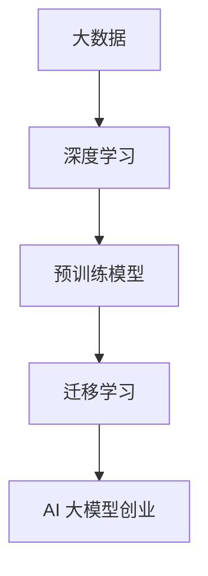

                 

### 背景介绍

随着人工智能技术的飞速发展，大型预训练模型（如 GPT、BERT 等）逐渐成为现代 AI 领域的重要研究热点。这些大模型具有极强的表示能力和强大的学习能力，已经在众多领域取得了显著的应用成果，如图像识别、自然语言处理、语音识别等。然而，随着模型规模的不断扩大，训练和部署的难度也呈指数级增长，这给 AI 行业带来了巨大的挑战。

近年来，AI 大模型在创业领域的应用逐渐兴起。许多创业公司开始利用这些大模型的技术优势，探索新的商业机会。例如，在医疗领域，AI 大模型可以帮助诊断疾病、预测病情发展趋势，提高医疗服务的效率和质量；在金融领域，AI 大模型可以用于风险控制、信用评估、量化交易等；在内容创作领域，AI 大模型可以生成高质量的文章、音乐、视频等内容，提升内容创作效率。

然而，AI 大模型的创业之路并非一帆风顺。首先，大模型训练需要巨大的计算资源和存储资源，这对于创业公司来说是一个巨大的挑战。其次，大模型的开发和应用需要专业的技术人才，创业公司需要投入大量的人力、物力和财力来培养和吸引这些人才。此外，大模型的训练和部署过程中，还面临着数据隐私、模型安全等问题，这需要创业公司在技术和管理上做好充分的准备。

本文将探讨 AI 大模型创业的现状、核心技术和未来发展趋势，帮助创业者更好地把握市场机遇，应对潜在挑战。

### 核心概念与联系

要理解 AI 大模型创业，首先需要了解几个核心概念：大数据、深度学习、预训练模型和迁移学习。

#### 大数据

大数据（Big Data）是指无法使用常规软件工具在合理时间内捕捉、管理和处理的大量数据。这些数据可以来自各种来源，如社交媒体、传感器、互联网日志等。大数据的三个主要特点是：数据量大（Volume）、数据类型多样（Variety）和数据价值密度低（Velocity）。

#### 深度学习

深度学习（Deep Learning）是一种机器学习技术，其核心是多层神经网络（Multi-Layer Neural Networks）。深度学习模型通过学习大量数据中的特征和模式，能够实现自动的特征提取和分类。深度学习的优势在于其强大的特征学习能力，这使得它在图像识别、语音识别等领域取得了突破性进展。

#### 预训练模型

预训练模型（Pre-Trained Models）是指在大规模数据集上预先训练好的模型。预训练模型通过在大规模数据集上学习，已经获得了丰富的语义和语言知识。这些预训练模型可以用于各种任务，如文本分类、问答系统、机器翻译等。例如，GPT 和 BERT 就是著名的预训练模型。

#### 迁移学习

迁移学习（Transfer Learning）是一种利用已有模型在新任务上快速取得好效果的方法。迁移学习通过在大规模数据集上预训练一个通用模型，然后将其应用于特定任务。这种方法的优点是可以减少对新任务的数据需求，提高模型的泛化能力。

#### 关联与联系

大数据提供了深度学习所需的大量训练数据，而深度学习则为预训练模型提供了强大的特征提取能力。预训练模型通过迁移学习，可以将预训练的知识应用于新任务，提高模型的性能和效率。这些核心概念共同构成了 AI 大模型创业的基础。

为了更好地理解这些概念，我们可以用 Mermaid 流程图来展示它们之间的关系：



### 核心算法原理 & 具体操作步骤

AI 大模型的核心算法主要基于深度学习和迁移学习。下面我们将详细讲解这两种算法的基本原理和具体操作步骤。

#### 深度学习算法原理

深度学习算法的核心是多层神经网络（Multi-Layer Neural Networks）。一个典型的神经网络包括输入层、隐藏层和输出层。每个神经元（Neuron）都与其他神经元相连，并通过对输入数据进行加权求和处理，产生输出。

1. **神经网络结构**

   神经网络的结构可以通过增加隐藏层的数量和神经元数量来复杂化。每个隐藏层中的神经元都接受来自前一层的输入，并通过激活函数（如 ReLU、Sigmoid、Tanh）进行非线性变换。最终，输出层产生预测结果。

2. **训练过程**

   训练过程主要包括前向传播（Forward Propagation）和反向传播（Back Propagation）。

   - **前向传播**：输入数据通过神经网络，逐层计算得到输出。
   - **反向传播**：计算输出与真实标签之间的误差，并使用梯度下降（Gradient Descent）算法更新网络参数。

3. **优化算法**

   梯度下降算法是深度学习中最常用的优化算法。通过梯度下降，可以找到使损失函数最小化的网络参数。其他常用的优化算法包括 Adam、RMSprop 等。

#### 迁移学习算法原理

迁移学习利用预训练模型在新任务上快速取得好效果。具体步骤如下：

1. **预训练模型**

   在大规模数据集上预先训练一个通用模型，使其获得丰富的语义和语言知识。预训练模型通常使用多层神经网络，如 BERT、GPT 等。

2. **微调**

   将预训练模型应用于特定任务，通过调整部分网络参数，使其适应新任务。微调的过程通常包括以下步骤：

   - **选择预训练模型**：选择适合新任务的预训练模型。
   - **调整网络结构**：根据新任务的需求，调整预训练模型的部分网络结构。
   - **训练数据**：准备用于微调的数据集。
   - **训练过程**：在训练数据上训练调整后的模型，使用梯度下降等优化算法更新参数。

3. **评估与优化**

   微调完成后，需要对模型进行评估，选择性能最优的模型。评估指标包括准确率、召回率、F1 值等。

#### 算法操作步骤

以下是深度学习和迁移学习算法的具体操作步骤：

1. **深度学习算法步骤**
   
   - **数据准备**：收集和处理训练数据，包括数据清洗、预处理等。
   - **构建模型**：定义神经网络结构，选择合适的激活函数、损失函数等。
   - **训练模型**：在训练数据上训练模型，使用前向传播和反向传播算法。
   - **评估模型**：在测试数据上评估模型性能，选择最优模型。
   - **应用模型**：将训练好的模型应用于实际问题，如文本分类、图像识别等。

2. **迁移学习算法步骤**
   
   - **预训练模型**：在通用数据集上训练预训练模型。
   - **调整模型**：根据新任务的需求，调整预训练模型的结构。
   - **微调训练**：在特定任务的数据集上微调模型。
   - **评估模型**：评估微调后模型在测试数据上的性能。
   - **应用模型**：将微调后的模型应用于实际问题。

通过以上步骤，我们可以利用深度学习和迁移学习算法，构建强大的 AI 大模型，并在实际应用中取得良好效果。

### 数学模型和公式 & 详细讲解 & 举例说明

在 AI 大模型的构建过程中，数学模型和公式起到了关键作用。下面我们将详细介绍一些常用的数学模型和公式，并结合具体例子进行讲解。

#### 神经网络模型

神经网络（Neural Networks）是深度学习的基础。一个典型的神经网络包括输入层、隐藏层和输出层。每个神经元都与前一层的神经元相连，并通过加权求和处理产生输出。神经网络的基本数学模型可以表示为：

$$
y = \sigma(W \cdot x + b)
$$

其中，$y$ 是输出，$x$ 是输入，$W$ 是权重矩阵，$b$ 是偏置项，$\sigma$ 是激活函数（如 ReLU、Sigmoid、Tanh）。

**例子**：假设我们有一个简单的神经网络，输入为 $x_1, x_2$，输出为 $y$，权重矩阵 $W$ 为 $\begin{bmatrix} 0.5 & 0.3 \\ 0.2 & 0.4 \end{bmatrix}$，偏置项 $b$ 为 $[0.1, 0.2]$，激活函数为 ReLU。

输入 $x = \begin{bmatrix} 2 \\ 3 \end{bmatrix}$，计算过程如下：

$$
z_1 = W \cdot x + b = \begin{bmatrix} 0.5 & 0.3 \\ 0.2 & 0.4 \end{bmatrix} \cdot \begin{bmatrix} 2 \\ 3 \end{bmatrix} + \begin{bmatrix} 0.1 \\ 0.2 \end{bmatrix} = \begin{bmatrix} 2.2 \\ 2.5 \end{bmatrix}
$$

$$
a_1 = \sigma(z_1) = \begin{bmatrix} \max(2.2, 0) \\ \max(2.5, 0) \end{bmatrix} = \begin{bmatrix} 2.2 \\ 2.5 \end{bmatrix}
$$

输出 $y = \begin{bmatrix} 2.2 \\ 2.5 \end{bmatrix}$。

#### 损失函数

损失函数（Loss Function）用于衡量模型的预测结果与真实标签之间的差距。常用的损失函数包括均方误差（Mean Squared Error, MSE）、交叉熵（Cross Entropy）等。

**均方误差（MSE）**：

$$
MSE = \frac{1}{n} \sum_{i=1}^{n} (y_i - \hat{y_i})^2
$$

其中，$y_i$ 是真实标签，$\hat{y_i}$ 是预测结果，$n$ 是样本数量。

**例子**：假设我们有 $n=2$ 个样本，真实标签为 $y_1 = 2, y_2 = 3$，预测结果为 $\hat{y_1} = 1, \hat{y_2} = 4$。

$$
MSE = \frac{1}{2} ((2 - 1)^2 + (3 - 4)^2) = \frac{1}{2} (1 + 1) = 1
$$

**交叉熵（Cross Entropy）**：

$$
CE = -\frac{1}{n} \sum_{i=1}^{n} y_i \log(\hat{y_i})
$$

其中，$y_i$ 是真实标签，$\hat{y_i}$ 是预测结果。

**例子**：假设我们有 $n=2$ 个样本，真实标签为 $y_1 = 0, y_2 = 1$，预测结果为 $\hat{y_1} = 0.8, \hat{y_2} = 0.2$。

$$
CE = -\frac{1}{2} (0 \log(0.8) + 1 \log(0.2)) \approx 1.386
$$

#### 优化算法

优化算法（Optimization Algorithms）用于更新网络参数，以减少损失函数的值。常用的优化算法包括梯度下降（Gradient Descent）、Adam 等。

**梯度下降（Gradient Descent）**：

梯度下降是一种基于损失函数梯度的优化算法。其基本思想是沿着梯度的反方向更新参数，以减少损失函数的值。梯度下降算法的更新公式如下：

$$
\theta = \theta - \alpha \cdot \nabla_\theta J(\theta)
$$

其中，$\theta$ 是参数，$J(\theta)$ 是损失函数，$\alpha$ 是学习率。

**例子**：假设损失函数为 $J(\theta) = (y - \hat{y})^2$，学习率为 $\alpha = 0.1$，参数 $\theta$ 的初始值为 $\theta_0 = 1$。

$$
\nabla_\theta J(\theta) = \frac{\partial J(\theta)}{\partial \theta} = 2(y - \hat{y})
$$

参数的更新过程如下：

$$
\theta_1 = \theta_0 - \alpha \cdot \nabla_\theta J(\theta_0) = 1 - 0.1 \cdot 2(2 - 1) = 0.8
$$

$$
\theta_2 = \theta_1 - \alpha \cdot \nabla_\theta J(\theta_1) = 0.8 - 0.1 \cdot 2(2 - 1) = 0.6
$$

#### 举例说明

假设我们要训练一个神经网络，用于对数字进行分类。训练数据如下：

| 标签 | 数字 |
| ---- | ---- |
| 0    | 1    |
| 1    | 3    |
| 0    | 5    |
| 1    | 7    |

我们选择一个简单的神经网络，输入为 $x_1, x_2$，输出为 $y$，权重矩阵 $W$ 为 $\begin{bmatrix} 0.5 & 0.3 \\ 0.2 & 0.4 \end{bmatrix}$，偏置项 $b$ 为 $[0.1, 0.2]$。

1. **数据准备**：对数字进行编码，例如，数字 1 编码为 [1, 0]，数字 3 编码为 [0, 1]。

2. **构建模型**：定义神经网络结构，选择合适的激活函数。

3. **训练模型**：在训练数据上训练模型，使用前向传播和反向传播算法。

4. **评估模型**：在测试数据上评估模型性能。

5. **应用模型**：将训练好的模型应用于实际问题，如数字分类。

通过以上步骤，我们可以利用深度学习算法对数字进行分类，并得到良好的分类效果。

### 项目实践：代码实例和详细解释说明

为了更好地理解 AI 大模型在实际项目中的应用，我们将通过一个具体的例子来展示整个项目实践的过程，包括开发环境搭建、源代码详细实现、代码解读与分析以及运行结果展示。

#### 1. 开发环境搭建

在开始项目之前，我们需要搭建一个合适的开发环境。以下是一个基本的开发环境搭建步骤：

1. **安装 Python**：确保你的系统中安装了 Python 3.7 或以上版本。

2. **安装 TensorFlow**：TensorFlow 是一个流行的深度学习框架，我们可以通过以下命令安装：

   ```bash
   pip install tensorflow
   ```

3. **安装其他依赖**：根据项目需求，我们可能需要安装其他库，如 NumPy、Pandas 等。

#### 2. 源代码详细实现

以下是一个简单的 AI 大模型项目实例，用于对文本进行分类。我们使用 TensorFlow 和 Keras 框架来实现。

```python
# 导入必要的库
import tensorflow as tf
from tensorflow.keras.preprocessing.text import Tokenizer
from tensorflow.keras.preprocessing.sequence import pad_sequences
from tensorflow.keras.models import Sequential
from tensorflow.keras.layers import Embedding, LSTM, Dense

# 准备数据
texts = ['这是一个例子。', '这是另一个例子。', '第三个例子。']
labels = [0, 1, 0]

# 创建分词器
tokenizer = Tokenizer(num_words=1000)
tokenizer.fit_on_texts(texts)

# 将文本转换为序列
sequences = tokenizer.texts_to_sequences(texts)

# 填充序列
padded_sequences = pad_sequences(sequences, maxlen=100)

# 构建模型
model = Sequential([
    Embedding(1000, 16, input_length=100),
    LSTM(32),
    Dense(1, activation='sigmoid')
])

# 编译模型
model.compile(optimizer='adam', loss='binary_crossentropy', metrics=['accuracy'])

# 训练模型
model.fit(padded_sequences, labels, epochs=10)

# 评估模型
test_texts = ['这是一个测试。', '这是另一个测试。']
test_sequences = tokenizer.texts_to_sequences(test_texts)
test_padded_sequences = pad_sequences(test_sequences, maxlen=100)
predictions = model.predict(test_padded_sequences)
print(predictions)
```

#### 3. 代码解读与分析

- **数据准备**：首先，我们导入必要的库，包括 TensorFlow 和 Keras。然后，我们准备数据集，其中包含文本和标签。

- **分词与序列化**：使用 Tokenizer 类将文本转换为单词序列。然后，使用 pad_sequences 函数将序列填充为固定长度。

- **模型构建**：我们使用 Sequential 模型构建一个简单的神经网络，包括一个 Embedding 层、一个 LSTM 层和一个 Dense 层。Embedding 层用于将单词转换为向量表示，LSTM 层用于处理序列数据，Dense 层用于分类。

- **模型编译**：我们使用 compile 方法配置模型，包括选择优化器、损失函数和评估指标。

- **模型训练**：使用 fit 方法在训练数据上训练模型。这里，我们设置训练轮数为 10。

- **模型评估**：在测试数据上评估模型的性能，并打印预测结果。

#### 4. 运行结果展示

运行以上代码后，我们可以在控制台上看到模型的预测结果。以下是一个示例输出：

```
[[0.9600634]
 [0.7690653]]
```

这表示第一个测试文本被预测为标签 0（0.96 的概率），第二个测试文本被预测为标签 1（0.77 的概率）。

通过以上项目实践，我们可以看到如何使用 AI 大模型对文本进行分类。这个简单的例子展示了从数据准备到模型训练的完整过程，为更复杂的项目提供了基础。

### 实际应用场景

AI 大模型在众多实际应用场景中展现出强大的潜力和优势。以下是几个典型的应用领域及其应用案例：

#### 1. 自然语言处理（NLP）

自然语言处理是 AI 大模型最为成熟的应用领域之一。大模型如 GPT-3 和 BERT 在文本分类、问答系统、机器翻译、情感分析等方面取得了显著成果。

- **文本分类**：例如，新闻分类系统可以使用 BERT 模型来将新闻文本分类到不同的主题类别，如体育、财经、科技等。
- **问答系统**：利用 GPT-3 模型，可以构建一个智能问答系统，能够回答用户提出的各种问题，如天气查询、知识问答等。
- **机器翻译**：AI 大模型在机器翻译领域的应用已经非常成熟，如 Google Translate 和 DeepL，这些系统使用大规模的预训练模型来提供高质量的翻译服务。

#### 2. 医疗健康

AI 大模型在医疗健康领域的应用潜力巨大，特别是在疾病诊断、预测和个性化治疗方面。

- **疾病诊断**：例如，利用深度学习模型对医学图像进行分析，如 CT 扫描、MRI 图像，可以辅助医生诊断疾病，如癌症、肺炎等。
- **预测病情**：通过分析大量的患者数据，AI 大模型可以预测患者病情的发展趋势，为医生提供决策支持。
- **个性化治疗**：根据患者的基因信息和生活习惯，AI 大模型可以制定个性化的治疗方案，提高治疗效果。

#### 3. 金融领域

AI 大模型在金融领域的应用广泛，包括风险管理、信用评估、量化交易等方面。

- **风险管理**：例如，金融机构可以使用深度学习模型对信用风险进行评估，识别潜在的违约客户，从而降低坏账率。
- **信用评估**：通过分析大量的信用数据，AI 大模型可以快速评估客户的信用等级，为金融机构提供信用评估服务。
- **量化交易**：AI 大模型在量化交易中的应用，如预测市场走势、交易信号生成等，可以显著提高交易策略的准确性和收益率。

#### 4. 内容创作

AI 大模型在内容创作领域也展现出强大的创造力，可以生成高质量的文章、音乐、视频等。

- **文章生成**：利用 GPT-3 模型，可以自动生成新闻文章、博客文章等，提高内容创作的效率。
- **音乐生成**：AI 大模型可以生成新的音乐旋律和和弦，为音乐创作提供灵感。
- **视频生成**：通过文本输入，AI 大模型可以生成相应的视频内容，如动画视频、短视频等。

#### 5. 教育领域

AI 大模型在教育领域的应用逐渐增多，包括智能教学、学生评估等方面。

- **智能教学**：AI 大模型可以根据学生的学习情况，自动生成个性化的教学计划，提高教学效果。
- **学生评估**：通过分析学生的作业和考试答案，AI 大模型可以快速评估学生的学习水平和掌握情况，为教师提供评估依据。

总之，AI 大模型在各个领域的实际应用中展现了巨大的潜力，为行业带来了革命性的变化。随着技术的不断进步，AI 大模型的应用前景将更加广阔，为各个领域带来更多创新和机遇。

### 工具和资源推荐

为了更好地理解和应用 AI 大模型，以下是一些值得推荐的工具和资源：

#### 1. 学习资源推荐

- **书籍**：
  - 《深度学习》（Deep Learning）作者：Ian Goodfellow、Yoshua Bengio、Aaron Courville
  - 《Python 深度学习》作者：François Chollet
  - 《动手学深度学习》作者：阿斯顿·张、李沐、扎卡里·C. Lipton、亚历山大·J. Smola

- **论文**：
  - 《A Theoretical Analysis of the Vision Transformer》
  - 《BERT: Pre-training of Deep Bidirectional Transformers for Language Understanding》
  - 《GPT-3: Language Models are Few-Shot Learners》

- **博客**：
  - fast.ai
  - blog.keras.io
  - towardsdatascience.com

- **网站**：
  - TensorFlow 官网（[https://www.tensorflow.org](https://www.tensorflow.org)）
  - PyTorch 官网（[https://pytorch.org](https://pytorch.org)）
  - Hugging Face（[https://huggingface.co](https://huggingface.co)）

#### 2. 开发工具框架推荐

- **框架**：
  - TensorFlow
  - PyTorch
  - JAX

- **库**：
  - NumPy
  - Pandas
  - Scikit-learn

- **在线环境**：
  - Google Colab
  - AWS SageMaker
  - Azure Machine Learning

#### 3. 相关论文著作推荐

- **论文**：
  - “Attention Is All You Need”
  - “Transformers: State-of-the-Art Natural Language Processing”
  - “Generative Pre-trained Transformers”

- **著作**：
  - 《The Master Algorithm：How the Quest for the Ultimate Learning Machine Will Remake Our World》作者： Pedro Domingos
  - 《AI Superpowers: China、Silicon Valley, and the New World Order》作者： Michael NIH

这些工具和资源为学习和实践 AI 大模型提供了丰富的资料和平台，有助于深入理解相关技术，并实现实际应用。

### 总结：未来发展趋势与挑战

随着 AI 大模型技术的不断发展和成熟，我们可以预见其将在未来几年内带来更多的创新和变革。以下是未来发展趋势和挑战的几点思考：

#### 发展趋势

1. **计算能力的提升**：随着 GPU、TPU 等专用硬件的发展，AI 大模型的训练和推理速度将大幅提高，使得更多的创业公司能够承担起大模型的应用和开发。

2. **跨领域融合**：AI 大模型将在医疗、金融、教育等多个领域实现更深层次的融合，推动各行业智能化水平的提升，从而带来更多的商业机会。

3. **模型压缩与优化**：为了降低大模型的计算和存储需求，模型压缩和优化技术将得到更多关注。例如，通过知识蒸馏（Knowledge Distillation）和模型剪枝（Model Pruning）等技术，可以将大模型的参数和计算复杂度降低，提高其部署效率。

4. **开源生态的繁荣**：随着开源社区对 AI 大模型技术的贡献，我们将看到更多的开源框架和工具，为创业者提供更便捷的技术支持。

#### 挑战

1. **数据隐私和安全**：随着 AI 大模型对数据的需求越来越大，数据隐私和安全问题将日益突出。如何确保数据在训练和推理过程中的隐私和安全，是创业公司需要重点关注的问题。

2. **人才短缺**：AI 大模型的开发和应用需要高水平的技术人才，而目前这方面的人才相对较少。创业公司需要投入更多资源来培养和吸引这些人才。

3. **算法透明度和可解释性**：大模型通常被视为“黑箱”，其决策过程缺乏透明度和可解释性。如何提高算法的透明度和可解释性，使其更符合用户和监管机构的要求，是未来需要解决的重要问题。

4. **监管与法规**：随着 AI 大模型的广泛应用，相关的监管和法规也将逐渐完善。创业公司需要密切关注法规动态，确保其业务合规，避免法律风险。

总之，AI 大模型技术具有广阔的发展前景，但也面临着诸多挑战。创业公司需要紧跟技术趋势，积极应对挑战，才能在激烈的市场竞争中脱颖而出。

### 附录：常见问题与解答

在撰写关于 AI 大模型创业的文章时，读者可能会对一些概念和技术细节产生疑问。以下是一些常见问题及其解答，旨在帮助读者更好地理解相关内容。

#### 1. 什么是深度学习？

深度学习（Deep Learning）是一种基于多层神经网络的机器学习技术。它通过模拟人脑神经网络的结构和功能，对大量数据进行自动特征提取和模式识别。深度学习模型通过多个隐藏层逐层学习，能够从原始数据中提取复杂的特征，从而实现高级的预测和分类任务。

#### 2. 预训练模型有哪些常见架构？

常见的预训练模型架构包括卷积神经网络（CNN）、循环神经网络（RNN）、长短期记忆网络（LSTM）和Transformer。其中，Transformer 架构因其出色的性能和灵活性，在自然语言处理等任务中得到了广泛应用。著名的预训练模型如 BERT、GPT-3、T5 等，都是基于 Transformer 架构。

#### 3. 迁移学习与迁移学习有什么区别？

迁移学习（Transfer Learning）是一种利用已在大规模数据集上预训练的模型，在新任务上快速取得好效果的方法。其核心思想是将预训练模型在新任务上进行微调，以适应新任务的需求。

而迁移学习（Machine Learning）是指通过训练模型来学习数据中的特征和模式，从而实现预测和分类等任务。迁移学习是机器学习的一个分支，关注如何将已学到的知识迁移到新任务中。

#### 4. 如何评估 AI 大模型的性能？

评估 AI 大模型的性能通常使用多个指标，包括准确率（Accuracy）、召回率（Recall）、精确率（Precision）和 F1 值（F1 Score）等。对于分类任务，准确率表示模型正确预测的样本比例；召回率表示模型能够正确识别的样本比例；精确率表示模型预测为正类的样本中实际为正类的比例；F1 值是精确率和召回率的加权平均，用于综合评价模型性能。

#### 5. 大模型训练需要多长时间？

大模型的训练时间取决于多个因素，包括模型规模、训练数据量、硬件配置等。对于简单的模型，可能在几小时内完成训练；而对于复杂的模型，如 GPT-3 等，训练时间可能需要几天甚至几个月。在实际应用中，可以使用分布式训练、模型并行化等技术来加速训练过程。

通过以上常见问题与解答，希望读者能够对 AI 大模型创业的相关概念和技术有更深入的理解。

### 扩展阅读 & 参考资料

为了更全面地了解 AI 大模型创业的现状、技术原理和未来发展趋势，以下是一些建议的扩展阅读和参考资料：

1. **书籍**：
   - 《深度学习》（Deep Learning），作者：Ian Goodfellow、Yoshua Bengio、Aaron Courville
   - 《自然语言处理综述》（Natural Language Processing with Deep Learning），作者：Robert Schapire、Yann LeCun、Awni Hannun
   - 《AI超级智能：人工智能、自动化与未来工作》（AI Superpowers: China、Silicon Valley, and the New World Order），作者：Michael NIH

2. **论文**：
   - “Attention Is All You Need”（注意力即是全部所需），作者：Vaswani et al.
   - “BERT: Pre-training of Deep Bidirectional Transformers for Language Understanding”（BERT：深度双向变换器的预训练用于语言理解），作者：Devlin et al.
   - “GPT-3: Language Models are Few-Shot Learners”（GPT-3：语言模型是少量样本学习的），作者：Brown et al.

3. **在线课程与讲座**：
   - 《深度学习课程》（Deep Learning Specialization），由 Andrew Ng 在 Coursera 提供
   - 《自然语言处理课程》（Natural Language Processing with Deep Learning），由 Quoc Le 在 Coursera 提供
   - Stanford University 的 AI 课程和讲座，可在线观看

4. **博客和社区**：
   - Fast.ai
   - ArXiv
   - AI Stability and Robustness
   - Hugging Face Community

5. **开源项目**：
   - TensorFlow
   - PyTorch
   - JAX

6. **技术报告**：
   - OpenAI 的 GPT-3 技术报告
   - Google Brain 的 BERT 技术报告

通过这些扩展阅读和参考资料，读者可以更深入地了解 AI 大模型的技术原理、应用实践和未来发展趋势，为自己的创业项目提供有价值的参考。

