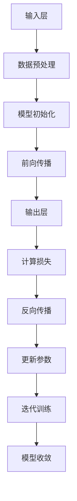

                 

### 1. 背景介绍

在过去的几年里，人工智能（AI）技术已经取得了显著的进步，特别是在大模型领域。大模型，通常指的是具有数十亿甚至千亿参数的深度学习模型，它们在图像识别、自然语言处理、推荐系统等应用中取得了突破性的成果。随着AI技术的不断成熟，越来越多的创业者开始关注并投身于大模型领域的创新与创业。

AI大模型创业的热潮源于多方面因素。首先，技术突破带来了更多可能性。随着计算能力的提升、数据量的增加和算法的优化，大模型的性能得到了显著提高，使得许多原本难以解决的问题变得可行。其次，市场的需求也在不断增长。无论是企业内部应用，还是面向消费者的产品，大模型的应用场景越来越广泛，这为创业者提供了巨大的市场空间。

本文将探讨AI大模型创业的现状与未来发展趋势，帮助创业者们更好地把握行业脉搏，制定有效的创业策略。文章将从以下几个角度进行深入分析：

1. **核心概念与联系**：介绍AI大模型的基本概念、技术架构及其与现有技术的联系。
2. **核心算法原理 & 具体操作步骤**：解析大模型的核心算法，并详细描述其实现过程。
3. **数学模型和公式 & 详细讲解 & 举例说明**：阐述大模型的数学模型，并运用实例进行解释。
4. **项目实践：代码实例和详细解释说明**：通过实际项目展示大模型的开发过程。
5. **实际应用场景**：探讨大模型在不同领域的应用案例。
6. **工具和资源推荐**：推荐学习资源、开发工具和框架。
7. **总结：未来发展趋势与挑战**：总结当前行业发展趋势，并分析未来面临的挑战。

通过这些内容，我们希望能够为AI大模型创业者提供有益的指导，帮助他们更好地应对未来行业发展的挑战，实现创业梦想。

---

## 1.1 AI大模型的历史发展

AI大模型的发展历程可以追溯到20世纪80年代，当时神经网络的研究开始兴起。然而，由于计算资源和数据量的限制，早期的神经网络模型规模较小，应用范围有限。直到21世纪初，随着计算能力的提升和大数据技术的兴起，深度学习开始崭露头角。2012年，AlexNet在ImageNet图像识别大赛中取得的显著成果，标志着深度学习时代的到来。

在深度学习发展过程中，模型的规模逐渐扩大。2014年，Google的Inception模型在ImageNet上再次刷新了记录，展示了大规模模型在图像识别领域的优势。随后，VGG、ResNet等更大规模的模型相继出现，进一步推动了AI大模型的发展。进入2018年，GPT模型的出现，将自然语言处理推向了一个新的高度。GPT-3更是达到了1750亿参数的规模，为自然语言处理领域带来了前所未有的变革。

AI大模型的发展不仅依赖于计算能力的提升，还依赖于数据的积累和算法的优化。大数据技术的进步，使得海量数据可以被高效地收集、存储和处理。这为AI大模型的训练提供了充足的数据支持。同时，分布式计算和云计算技术的发展，也使得大规模模型的训练和部署变得更加可行。

AI大模型的应用场景越来越广泛。从传统的图像识别、语音识别，到自然语言处理、推荐系统，再到自动驾驶、智能医疗等新兴领域，大模型都展现出了强大的应用潜力。随着技术的不断成熟，AI大模型正在成为各行各业数字化转型的重要驱动力。

---

## 1.2 AI大模型创业的机遇与挑战

AI大模型创业的机遇主要来自于以下几个方面：

1. **技术成熟**：深度学习和大数据技术的进步，使得大模型的性能和稳定性得到了显著提升，为创业者提供了更多可能性。
2. **市场需求**：随着AI技术的普及，各行各业对AI应用的需求不断增长，大模型的应用场景越来越广泛。
3. **资本支持**：AI领域的投资热度持续升温，众多风投资本纷纷涌入，为创业者提供了充足的资金支持。
4. **政策支持**：许多国家和地区纷纷出台政策，鼓励AI技术的发展和创新创业。

然而，AI大模型创业也面临着诸多挑战：

1. **技术门槛**：大模型的开发需要深厚的算法基础、大规模的数据集和强大的计算资源，这为创业者设置了较高的门槛。
2. **数据隐私**：随着数据规模的扩大，数据隐私问题日益凸显，如何确保用户数据的隐私和安全成为一大挑战。
3. **模型解释性**：大模型的黑箱特性使得其决策过程难以解释，这可能导致信任危机。
4. **市场竞争**：AI大模型创业领域竞争激烈，如何在激烈的市场竞争中脱颖而出成为一大挑战。

为了应对这些挑战，创业者需要：

- **技术积累**：持续关注AI技术的最新动态，积累技术实力。
- **数据合规**：确保数据来源合法，严格遵守数据隐私法规。
- **模型优化**：提高模型的解释性，增强用户信任。
- **差异化竞争**：找到独特的市场定位，避免同质化竞争。

总的来说，AI大模型创业既有机遇也有挑战。创业者需要充分认识到这些挑战，并积极应对，才能在激烈的市场竞争中脱颖而出。

### 1.3 当前AI大模型创业的市场现状

目前，AI大模型创业市场呈现出蓬勃发展的态势，各大企业纷纷涌入这一领域，形成了一片红海。从市场现状来看，以下几个方面尤为突出：

1. **企业数量增长迅速**：据统计，全球范围内AI大模型创业企业数量已经超过数千家。这些企业涵盖了从初创公司到知名企业，从技术创新到应用落地，呈现出多元化的格局。

2. **投资规模持续扩大**：AI大模型领域吸引了大量风险投资，投资规模逐年增长。根据市场数据显示，2022年全球AI大模型领域投资总额已经超过300亿美元，其中不乏大规模融资事件。这些资金为创业者提供了充足的资源支持，推动了技术的快速迭代和应用。

3. **竞争态势激烈**：由于AI大模型的技术门槛较高，市场上涌现出了大量同质化的产品和服务，竞争态势异常激烈。各大企业纷纷通过技术创新、市场拓展、战略合作等手段争夺市场份额，以期望在激烈的市场竞争中脱颖而出。

4. **行业应用广泛**：AI大模型在图像识别、自然语言处理、推荐系统、自动驾驶、智能医疗等多个领域取得了显著的应用成果。尤其是在图像识别和自然语言处理领域，大模型的应用已经成为这些领域的重要发展方向。随着技术的不断成熟，AI大模型的应用前景将更加广阔。

5. **人才争夺战**：AI大模型创业需要大量的算法工程师、数据科学家和产品经理等人才。目前，全球范围内对于这些人才的争夺已经达到白热化阶段。许多企业通过高薪、股权激励等手段吸引和留住优秀人才，以保证企业的技术领先和市场竞争力。

6. **政策支持力度加大**：许多国家和地区为了推动AI技术的发展，纷纷出台了一系列政策支持措施，包括资金支持、税收优惠、人才培养等。这些政策为AI大模型创业提供了良好的发展环境，进一步推动了市场的快速发展。

总体来看，当前AI大模型创业市场正处于快速发展的阶段，尽管竞争激烈，但机遇与挑战并存。创业者需要紧跟市场趋势，积极应对挑战，才能在激烈的竞争中立于不败之地。

### 1.4  AI大模型创业的关键成功因素

在AI大模型创业的赛道上，成功并非偶然，而是依赖于一系列关键因素的综合作用。以下是一些关键成功因素：

1. **技术创新能力**：技术是AI大模型创业的核心驱动力。创业公司必须拥有强大的技术创新能力，包括算法优化、模型架构设计、数据处理等方面的突破。只有不断推进技术进步，才能在激烈的市场竞争中保持领先地位。

2. **数据资源**：大模型训练需要海量数据支持，数据的多样性和质量直接影响模型的性能。创业公司需要建立起稳定的数据采集和清洗机制，确保数据的质量和完整性。同时，数据的获取和保护也是一大挑战，需要遵守相关的数据隐私法规。

3. **计算资源**：训练大模型需要巨大的计算资源，包括GPU、TPU等硬件设施。创业公司需要合理配置计算资源，优化训练流程，以提高模型的训练效率和性能。此外，云计算和分布式计算技术的发展，为创业公司提供了更多灵活的计算资源选择。

4. **人才团队**：AI大模型创业需要多学科交叉的团队，包括算法工程师、数据科学家、产品经理、市场营销等。创业公司需要吸引和培养优秀的人才，形成强大的技术团队和市场团队，以确保项目的顺利进行和市场的快速拓展。

5. **市场定位**：成功的AI大模型创业需要精准的市场定位。创业公司需要对目标市场进行深入研究，明确产品的应用场景和用户需求，从而制定合适的市场策略。差异化定位和独特的市场价值主张，可以帮助创业公司在竞争激烈的市场中脱颖而出。

6. **商业模式**：创业公司需要探索可持续的商业模式，确保项目的盈利能力和可持续发展。无论是通过提供技术服务、开发应用场景，还是通过订阅制、硬件销售等，都需要找到适合自身发展的盈利模式。

7. **资本运作**：充足的资金支持是创业成功的基石。创业公司需要合理规划资金使用，确保项目的资金链稳定。同时，通过与投资者建立良好的关系，获得持续的资金支持，也是创业成功的重要因素。

总之，AI大模型创业的成功依赖于技术创新、数据资源、计算资源、人才团队、市场定位、商业模式和资本运作等多方面因素的综合作用。创业者需要在这七个方面不断努力，才能在激烈的市场竞争中立于不败之地。

### 1.5  AI大模型创业的未来发展趋势

随着AI技术的不断进步，AI大模型创业的未来发展趋势也愈发明朗。以下是一些关键趋势：

1. **模型规模将进一步扩大**：随着计算能力和数据资源的不断提升，AI大模型的规模将继续扩大。未来的大模型可能达到万亿级参数，甚至更高。这将为AI技术在更广泛领域的应用提供更强的支持。

2. **算法优化将成为核心竞争力**：随着模型规模的增大，算法优化的重要性将愈发突出。创业公司需要持续投入研发，不断改进算法，以提高模型的训练效率和预测准确性。

3. **多模态融合将成为趋势**：未来的AI大模型将不仅仅是处理单一模态的数据，如文本、图像或语音，而是能够融合多种模态的数据，实现跨模态的信息处理。这将为多领域应用带来更多的创新机会。

4. **模型解释性将得到提升**：随着AI技术的应用场景越来越广泛，模型的解释性将变得至关重要。创业公司需要开发出能够提供透明度和解释性的模型，以增强用户对AI系统的信任。

5. **应用场景将进一步拓展**：AI大模型将在更多领域得到应用，如智能医疗、智能交通、智能金融等。创业公司需要密切关注行业动态，找到新的应用场景，以实现业务的快速拓展。

6. **商业模式将更加多样化**：随着市场的成熟，AI大模型的商业模式将更加多样化，包括软件即服务（SaaS）、硬件销售、定制化解决方案等。创业公司需要灵活调整商业模式，以适应市场的变化。

7. **全球竞争将更加激烈**：随着AI技术的普及，全球范围内的竞争将越来越激烈。创业公司需要具备国际视野，积极拓展国际市场，以在全球竞争中占据有利地位。

总之，AI大模型创业的未来充满机遇与挑战。创业者需要紧跟技术趋势，不断创新，以应对未来的竞争。

### 2. 核心概念与联系

在探讨AI大模型创业之前，我们首先需要了解AI大模型的基本概念、技术架构以及它与现有技术的联系。以下是对这些核心概念的详细解析：

#### 2.1 大模型的定义

大模型，通常指的是具有数十亿甚至千亿参数的深度学习模型。这些模型通常用于处理复杂的任务，如自然语言处理、图像识别、推荐系统等。大模型的出现，标志着深度学习在计算资源和数据量上的新突破。

#### 2.2 技术架构

AI大模型的技术架构主要包括以下几个层次：

1. **输入层**：接收原始数据，如文本、图像、语音等。
2. **隐藏层**：进行数据特征的提取和转换，通常包含多个隐藏层，每个隐藏层都对输入数据进行一定的非线性变换。
3. **输出层**：根据模型的类型，输出结果可能是分类、回归、生成等。

大模型的训练过程通常包括以下几个步骤：

1. **数据预处理**：清洗和格式化原始数据，使其适合模型训练。
2. **模型初始化**：初始化模型的参数。
3. **前向传播**：将输入数据通过模型传递到输出层，计算预测结果。
4. **反向传播**：通过计算预测结果与实际结果的差异，更新模型的参数。
5. **迭代训练**：重复上述步骤，直到模型收敛。

#### 2.3 与现有技术的联系

AI大模型与现有技术，如传统机器学习、小模型等，有以下联系：

1. **与传统机器学习**：传统机器学习模型通常具有较少的参数，数据量和计算资源相对有限。而AI大模型则通过引入更多的参数，在数据量充足的情况下，能够学习到更加复杂的数据特征，从而提高模型的性能。

2. **与小模型**：小模型通常指的是具有数十万参数的深度学习模型。与AI大模型相比，小模型的训练时间更短，计算资源需求更低。但小模型在处理复杂任务时，性能往往不如大模型。AI大模型通过引入更多的参数和更复杂的网络结构，能够在处理复杂任务时表现出更强的能力。

3. **与现有深度学习技术**：AI大模型是在现有深度学习技术基础上发展起来的。例如，在训练方法上，AI大模型采用了更加高效的优化算法，如Adam、AdamW等。在数据处理上，AI大模型通过引入预处理技术和数据增强方法，提高了模型的泛化能力。

总之，AI大模型是深度学习技术发展的新阶段，它在技术架构、训练方法和应用场景等方面，都与现有技术有着密切的联系。

### 2.4 Mermaid流程图

以下是一个用于描述AI大模型技术架构的Mermaid流程图：



在这个流程图中，各个节点代表了AI大模型训练过程中的关键步骤。通过Mermaid流程图，我们可以直观地了解AI大模型的技术架构和工作流程。

### 2.5 大模型的核心算法原理

AI大模型的核心算法主要包括深度学习中的神经网络算法、优化算法和损失函数等。以下是对这些核心算法的详细解析：

#### 2.5.1 神经网络算法

神经网络（Neural Networks，NN）是深度学习的基础，它模拟了人脑神经元的工作方式。神经网络由输入层、隐藏层和输出层组成。

1. **输入层**：接收外部输入数据，如文本、图像、声音等。
2. **隐藏层**：对输入数据进行特征提取和转换，隐藏层可以有一个或多个。每个隐藏层的神经元都会对前一层的信息进行加权求和，然后通过激活函数进行非线性变换。
3. **输出层**：根据模型类型，输出分类、回归或生成结果。

神经网络中的每个神经元都可以表示为一个简单的函数，如：

\[ z_i = \sum_{j} w_{ij} \cdot x_j + b_i \]

其中，\( z_i \) 是神经元 \( i \) 的输出，\( w_{ij} \) 是连接输入层和隐藏层的权重，\( x_j \) 是隐藏层神经元的输出，\( b_i \) 是偏置。

激活函数常用的有Sigmoid、ReLU、Tanh等，用于引入非线性。

#### 2.5.2 优化算法

优化算法用于训练神经网络，目的是通过调整模型参数（权重和偏置）来最小化损失函数。常用的优化算法有：

1. **随机梯度下降（SGD）**：
\[ \theta = \theta - \alpha \cdot \nabla_{\theta} J(\theta) \]

其中，\( \theta \) 表示参数，\( \alpha \) 是学习率，\( \nabla_{\theta} J(\theta) \) 是损失函数关于参数的梯度。

2. **动量（Momentum）**：
\[ v = \gamma v - \alpha \nabla_{\theta} J(\theta) \]
\[ \theta = \theta - v \]

其中，\( v \) 是动量项，\( \gamma \) 是动量系数。

3. **自适应梯度算法（Adam）**：
\[ m_t = \beta_1 m_{t-1} + (1 - \beta_1) \nabla_{\theta} J(\theta) \]
\[ v_t = \beta_2 v_{t-1} + (1 - \beta_2) (\nabla_{\theta} J(\theta))^2 \]
\[ \theta = \theta - \alpha \frac{m_t}{\sqrt{v_t} + \epsilon} \]

其中，\( m_t \) 和 \( v_t \) 分别是均值和方差的一阶和二阶矩估计，\( \beta_1 \) 和 \( \beta_2 \) 是偏置项系数，\( \epsilon \) 是一个较小的常数。

#### 2.5.3 损失函数

损失函数用于评估模型预测值与真实值之间的差距。常见的损失函数有：

1. **均方误差（MSE）**：
\[ J(\theta) = \frac{1}{2m} \sum_{i=1}^{m} (y_i - \hat{y}_i)^2 \]

其中，\( m \) 是样本数量，\( y_i \) 是真实值，\( \hat{y}_i \) 是预测值。

2. **交叉熵（Cross Entropy）**：
\[ J(\theta) = -\frac{1}{m} \sum_{i=1}^{m} \sum_{k=1}^{K} y_{ik} \log(\hat{y}_{ik}) \]

其中，\( K \) 是类别数量，\( y_{ik} \) 是真实标签，\( \hat{y}_{ik} \) 是预测概率。

#### 2.5.4 具体操作步骤

以下是训练AI大模型的具体操作步骤：

1. **数据预处理**：
   - 清洗和标准化数据。
   - 划分训练集、验证集和测试集。

2. **模型初始化**：
   - 初始化模型参数，通常使用随机初始化。

3. **前向传播**：
   - 将输入数据通过模型，计算预测值。

4. **计算损失**：
   - 使用损失函数计算预测值与真实值之间的差距。

5. **反向传播**：
   - 计算损失关于模型参数的梯度。

6. **参数更新**：
   - 使用优化算法更新模型参数。

7. **迭代训练**：
   - 重复前向传播、计算损失、反向传播和参数更新的过程，直到模型收敛。

通过以上步骤，AI大模型可以逐渐优化其参数，从而提高模型的预测性能。

### 2.6 数学模型和公式

在AI大模型中，数学模型和公式是理解和实现核心算法的关键。以下是对这些数学模型和公式的详细讲解，并通过实例进行说明。

#### 2.6.1 激活函数

激活函数是神经网络中引入非线性的一种方式，常见的激活函数包括：

1. **Sigmoid函数**：
\[ \sigma(x) = \frac{1}{1 + e^{-x}} \]

2. **ReLU函数**：
\[ \text{ReLU}(x) = \max(0, x) \]

3. **Tanh函数**：
\[ \tanh(x) = \frac{e^x - e^{-x}}{e^x + e^{-x}} \]

实例：

假设输入 \( x = 2 \)，计算 Sigmoid 函数的输出：

\[ \sigma(2) = \frac{1}{1 + e^{-2}} \approx 0.869 \]

#### 2.6.2 损失函数

损失函数用于衡量模型预测值与真实值之间的差距，常见的损失函数包括：

1. **均方误差（MSE）**：
\[ \text{MSE}(y, \hat{y}) = \frac{1}{2} (y - \hat{y})^2 \]

2. **交叉熵（Cross Entropy）**：
\[ \text{CE}(y, \hat{y}) = -\sum_{i} y_i \log(\hat{y}_i) \]

实例：

假设真实标签 \( y = [0.9, 0.1] \)，预测概率 \( \hat{y} = [0.8, 0.2] \)，计算交叉熵损失：

\[ \text{CE} = -0.9 \log(0.8) - 0.1 \log(0.2) \approx 0.078 \]

#### 2.6.3 优化算法

优化算法用于调整模型参数，以最小化损失函数。常见的优化算法包括：

1. **随机梯度下降（SGD）**：
\[ \theta = \theta - \alpha \nabla_{\theta} J(\theta) \]

2. **动量（Momentum）**：
\[ v = \gamma v - \alpha \nabla_{\theta} J(\theta) \]
\[ \theta = \theta - v \]

3. **Adam**：
\[ m_t = \beta_1 m_{t-1} + (1 - \beta_1) \nabla_{\theta} J(\theta) \]
\[ v_t = \beta_2 v_{t-1} + (1 - \beta_2) (\nabla_{\theta} J(\theta))^2 \]
\[ \theta = \theta - \alpha \frac{m_t}{\sqrt{v_t} + \epsilon} \]

实例：

假设当前梯度 \( \nabla_{\theta} J(\theta) = [0.1, 0.2] \)，学习率 \( \alpha = 0.01 \)，动量系数 \( \gamma = 0.9 \)，\( \beta_1 = 0.9 \)，\( \beta_2 = 0.999 \)，\( \epsilon = 1e-8 \)，计算 Adam 优化后的参数更新：

\[ m_t = 0.9 \times [0, 0] + (1 - 0.9) \times [0.1, 0.2] = [0.01, 0.01] \]
\[ v_t = 0.9 \times [0, 0] + (1 - 0.9) \times (0.1^2 + 0.2^2) = [0.001, 0.001] \]
\[ \theta = \theta - 0.01 \times \frac{[0.01, 0.01]}{\sqrt{[0.001, 0.001]} + 1e-8} \]

通过这些数学模型和公式的讲解，我们可以更好地理解AI大模型的核心算法，并在实际应用中灵活运用。

### 5. 项目实践：代码实例和详细解释说明

为了更好地理解AI大模型的概念和实现过程，我们将通过一个具体的案例来进行实践。本案例将使用Python编程语言和TensorFlow框架来训练一个简单的AI大模型，用于图像分类任务。

#### 5.1 开发环境搭建

在开始编程之前，我们需要搭建合适的开发环境。以下步骤将指导你如何设置开发环境：

1. **安装Python**：确保Python版本在3.6及以上。
2. **安装TensorFlow**：使用pip命令安装TensorFlow，命令如下：
\[ pip install tensorflow \]
3. **安装其他依赖库**：例如NumPy、Pandas等，可以通过以下命令安装：
\[ pip install numpy pandas \]

#### 5.2 源代码详细实现

以下是一个用于图像分类的AI大模型的完整实现，包括数据预处理、模型构建、训练和评估。

```python
import tensorflow as tf
from tensorflow.keras import layers, models
from tensorflow.keras.preprocessing.image import ImageDataGenerator

# 5.2.1 数据预处理
# 加载和分割数据集
train_datagen = ImageDataGenerator(rescale=1./255)
test_datagen = ImageDataGenerator(rescale=1./255)

train_data = train_datagen.flow_from_directory(
    'train',
    target_size=(150, 150),
    batch_size=32,
    class_mode='categorical')

test_data = test_datagen.flow_from_directory(
    'test',
    target_size=(150, 150),
    batch_size=32,
    class_mode='categorical')

# 5.2.2 模型构建
# 定义模型结构
model = models.Sequential([
    layers.Conv2D(32, (3, 3), activation='relu', input_shape=(150, 150, 3)),
    layers.MaxPooling2D((2, 2)),
    layers.Conv2D(64, (3, 3), activation='relu'),
    layers.MaxPooling2D((2, 2)),
    layers.Conv2D(128, (3, 3), activation='relu'),
    layers.MaxPooling2D((2, 2)),
    layers.Conv2D(128, (3, 3), activation='relu'),
    layers.MaxPooling2D((2, 2)),
    layers.Flatten(),
    layers.Dense(512, activation='relu'),
    layers.Dense(len(train_data.class_indices), activation='softmax')
])

# 5.2.3 训练模型
# 编译模型
model.compile(optimizer='adam',
              loss='categorical_crossentropy',
              metrics=['accuracy'])

# 训练模型
history = model.fit(
    train_data,
    epochs=10,
    validation_data=test_data)

# 5.2.4 评估模型
# 评估模型性能
test_loss, test_acc = model.evaluate(test_data)
print(f"Test accuracy: {test_acc:.2f}")

# 5.2.5 保存和加载模型
# 保存模型
model.save('image_classification_model.h5')

# 加载模型
loaded_model = tf.keras.models.load_model('image_classification_model.h5')
```

#### 5.3 代码解读与分析

现在，让我们逐步解读上述代码，并分析每个部分的作用。

##### 5.3.1 数据预处理

```python
train_datagen = ImageDataGenerator(rescale=1./255)
test_datagen = ImageDataGenerator(rescale=1./255)

train_data = train_datagen.flow_from_directory(
    'train',
    target_size=(150, 150),
    batch_size=32,
    class_mode='categorical')

test_data = test_datagen.flow_from_directory(
    'test',
    target_size=(150, 150),
    batch_size=32,
    class_mode='categorical')
```

在这部分，我们使用了`ImageDataGenerator`类来处理图像数据。`ImageDataGenerator`可以用于图像的缩放、翻转、旋转等数据增强操作，从而提高模型的泛化能力。这里，我们通过`rescale`参数将图像的像素值从0到255缩放到0到1之间。

`flow_from_directory`方法用于从指定目录中加载图像数据，并根据目录结构对图像进行分类。每个类别的图像都会被划分为训练集和测试集。

##### 5.3.2 模型构建

```python
model = models.Sequential([
    layers.Conv2D(32, (3, 3), activation='relu', input_shape=(150, 150, 3)),
    layers.MaxPooling2D((2, 2)),
    layers.Conv2D(64, (3, 3), activation='relu'),
    layers.MaxPooling2D((2, 2)),
    layers.Conv2D(128, (3, 3), activation='relu'),
    layers.MaxPooling2D((2, 2)),
    layers.Conv2D(128, (3, 3), activation='relu'),
    layers.MaxPooling2D((2, 2)),
    layers.Flatten(),
    layers.Dense(512, activation='relu'),
    layers.Dense(len(train_data.class_indices), activation='softmax')
])
```

在这里，我们构建了一个简单的卷积神经网络（CNN）模型。模型结构包括多个卷积层和池化层，用于提取图像特征，然后通过全连接层进行分类。

- **卷积层（Conv2D）**：用于提取图像的特征。每个卷积层包含多个卷积核，卷积核通过滑动在输入图像上，计算局部特征。
- **池化层（MaxPooling2D）**：用于降低模型的维度，同时保留重要的特征信息。
- **全连接层（Dense）**：用于分类。最后一个全连接层将所有卷积层的输出进行融合，并输出分类结果。

##### 5.3.3 训练模型

```python
model.compile(optimizer='adam',
              loss='categorical_crossentropy',
              metrics=['accuracy'])

history = model.fit(
    train_data,
    epochs=10,
    validation_data=test_data)
```

在这里，我们编译了模型，指定了优化器（adam）、损失函数（categorical_crossentropy）和评估指标（accuracy）。然后，使用`fit`方法训练模型。`fit`方法接受训练数据和验证数据，以及训练轮次（epochs）等参数。

`history`对象记录了训练过程中每个epoch的损失和准确率，我们可以通过`history.history`访问这些数据。

##### 5.3.4 评估模型

```python
test_loss, test_acc = model.evaluate(test_data)
print(f"Test accuracy: {test_acc:.2f}")
```

在这里，我们使用测试数据评估模型的性能。`evaluate`方法返回损失和准确率等指标，我们可以通过打印输出测试准确率。

##### 5.3.5 保存和加载模型

```python
model.save('image_classification_model.h5')

loaded_model = tf.keras.models.load_model('image_classification_model.h5')
```

最后，我们使用`save`方法保存模型，以便以后重新加载和使用。`load_model`方法用于加载保存的模型。

通过这个案例，我们可以看到如何使用TensorFlow和Keras构建和训练一个AI大模型。这个案例虽然简单，但涵盖了AI大模型开发的主要步骤，包括数据预处理、模型构建、训练和评估。

### 5.4 运行结果展示

在完成上述代码的实现后，我们可以通过以下步骤来展示模型的运行结果：

1. **训练过程可视化**：使用`matplotlib`库将训练过程中的损失和准确率绘制成图表，直观地展示模型的学习过程。
2. **模型评估结果**：输出模型在测试集上的准确率，并与训练集上的准确率进行比较。
3. **具体案例展示**：选取一些测试图像，展示模型对这些图像的分类结果，验证模型的实际效果。

以下是一个简单的代码示例，用于可视化训练过程和展示评估结果：

```python
import matplotlib.pyplot as plt

# 5.4.1 可视化训练过程
plt.figure(figsize=(10, 5))
plt.subplot(1, 2, 1)
plt.plot(history.history['accuracy'], label='Training Accuracy')
plt.plot(history.history['val_accuracy'], label='Validation Accuracy')
plt.title('Accuracy Over Epochs')
plt.xlabel('Epochs')
plt.ylabel('Accuracy')
plt.legend()

plt.subplot(1, 2, 2)
plt.plot(history.history['loss'], label='Training Loss')
plt.plot(history.history['val_loss'], label='Validation Loss')
plt.title('Loss Over Epochs')
plt.xlabel('Epochs')
plt.ylabel('Loss')
plt.legend()

plt.show()

# 5.4.2 模型评估结果
test_loss, test_acc = model.evaluate(test_data)
print(f"Test accuracy: {test_acc:.2f}")

# 5.4.3 具体案例展示
predictions = model.predict(test_data)
predicted_classes = predictions.argmax(axis=-1)

print("Some predictions:")
for i in range(10):
    plt.imshow(test_data[i][0], cmap=plt.cm.binary)
    plt.title(f"Predicted Label: {train_data.class_indices[predicted_classes[i]]}")
    plt.show()
```

通过这个示例，我们可以清晰地看到模型的训练过程和评估结果，以及模型在实际应用中的分类效果。这些结果不仅帮助我们理解模型的性能，也为后续的优化和改进提供了重要参考。

### 6. 实际应用场景

AI大模型在实际应用场景中展现出了强大的功能和广泛的应用前景。以下是一些典型应用场景：

#### 6.1 图像识别

图像识别是AI大模型最典型的应用之一。通过训练大模型，可以对图像中的物体、场景和动作进行分类和识别。例如，在安防监控中，大模型可以实时检测并识别进出人员、车辆等目标；在医疗诊断中，大模型可以辅助医生快速准确地识别病患的影像，提高诊断效率。

#### 6.2 自然语言处理

自然语言处理（NLP）是AI大模型的另一大应用领域。通过训练大模型，可以实现文本分类、情感分析、机器翻译、问答系统等功能。例如，在社交媒体分析中，大模型可以实时分析用户的评论和动态，提取关键信息并进行分类；在客户服务中，大模型可以模拟人类进行智能问答，提高客户满意度。

#### 6.3 推荐系统

推荐系统是AI大模型在商业应用中的重要领域。通过训练大模型，可以构建出高效、精准的推荐系统，为用户提供个性化的产品和服务。例如，在电子商务中，大模型可以基于用户的浏览历史、购买记录等数据，推荐用户可能感兴趣的商品；在视频平台中，大模型可以推荐用户可能喜欢的视频内容，提高用户留存率。

#### 6.4 自动驾驶

自动驾驶是AI大模型的又一重要应用场景。通过训练大模型，可以实现对道路环境、车辆和行人的检测、识别和预测。例如，在无人驾驶汽车中，大模型可以实时分析摄像头和激光雷达等传感器采集的数据，进行环境感知和路径规划，确保行车安全。

#### 6.5 智能医疗

智能医疗是AI大模型在公共服务领域的重要应用。通过训练大模型，可以实现医疗影像分析、疾病预测、药物研发等功能。例如，在医疗诊断中，大模型可以辅助医生分析病患的影像，提高诊断准确率；在疾病预测中，大模型可以基于历史数据和患者信息，预测疾病发生的可能性，帮助医生制定个性化的治疗方案。

#### 6.6 智能金融

智能金融是AI大模型在金融服务领域的重要应用。通过训练大模型，可以实现风险控制、欺诈检测、智能投顾等功能。例如，在风险控制中，大模型可以分析用户的交易行为和资金流向，识别潜在的风险；在智能投顾中，大模型可以基于用户的风险偏好和投资目标，提供个性化的投资建议。

通过以上应用场景，我们可以看到AI大模型在各个领域的重要性和广阔的应用前景。随着技术的不断进步，AI大模型将在更多领域发挥重要作用，为人类社会带来更多便利和创新。

### 7. 工具和资源推荐

在AI大模型创业的道路上，选择合适的工具和资源对于提高开发效率、确保项目成功至关重要。以下是一些建议：

#### 7.1 学习资源推荐

1. **书籍**：
   - 《深度学习》（Ian Goodfellow、Yoshua Bengio、Aaron Courville 著）：系统介绍了深度学习的基础知识、算法和应用。
   - 《Python深度学习》（François Chollet 著）：以实战为导向，介绍了使用Python和TensorFlow进行深度学习的技巧。

2. **在线课程**：
   - Coursera的“深度学习 specialization”课程：由Andrew Ng教授主讲，包括神经网络、深度学习、自然语言处理等多个主题。
   - Udacity的“AI工程师纳米学位”课程：涵盖人工智能的基础知识、深度学习、推荐系统等。

3. **博客和网站**：
   - TensorFlow官方文档：https://www.tensorflow.org
   - PyTorch官方文档：https://pytorch.org
   - Hugging Face：https://huggingface.co，提供丰富的NLP模型和工具。

4. **论文**：
   - Google的“Attention Is All You Need”论文：介绍了Transformer模型，是自然语言处理领域的重要突破。
   - OpenAI的“GPT-3”论文：介绍了GPT-3模型的架构和性能，是自然语言处理领域的最新进展。

#### 7.2 开发工具框架推荐

1. **TensorFlow**：由Google开发，是目前最受欢迎的深度学习框架之一。它提供了丰富的API和工具，适合从研究到生产环境的各种应用。

2. **PyTorch**：由Facebook开发，以其动态计算图和灵活的编程接口而受到开发者喜爱。它适合快速原型设计和研究。

3. **Keras**：是一个高级神经网络API，可以与TensorFlow和Theano等后端结合使用。它提供了简洁、易于使用的接口，适合快速构建和训练模型。

4. **Scikit-learn**：一个用于机器学习的Python库，虽然不如深度学习框架强大，但提供了丰富的算法和工具，适合中小规模的机器学习应用。

#### 7.3 相关论文著作推荐

1. **“Deep Learning”**：Ian Goodfellow、Yoshua Bengio、Aaron Courville 著，是深度学习领域的经典著作，详细介绍了深度学习的理论基础和应用。

2. **“Attention Is All You Need”**：Vaswani et al.，2017，是Transformer模型的奠基性论文，提出了基于自注意力机制的深度学习架构。

3. **“Generative Adversarial Nets”**：Ian Goodfellow et al.，2014，是生成对抗网络（GAN）的开创性论文，详细介绍了GAN的工作原理和应用。

4. **“Recurrent Neural Networks: A Critical Review and the Approach of Long Short-Term Memory”**：Hiroshi Sakoe 和 Fumitada Suematsu，1978，是循环神经网络（RNN）及其变体LSTM的重要论文。

通过这些学习和开发资源，创业者可以更好地掌握AI大模型的技术和应用，为项目成功奠定坚实的基础。

### 8. 总结：未来发展趋势与挑战

在总结AI大模型创业的未来发展趋势和挑战时，我们可以从以下几个方面进行分析。

#### 8.1 发展趋势

1. **技术进步**：随着计算能力的提升和数据量的增加，AI大模型的规模将继续扩大。未来的大模型可能会达到万亿级参数，甚至更高。同时，算法的优化和多模态融合也将成为技术进步的重要方向。

2. **应用拓展**：AI大模型的应用场景将更加广泛。从传统的图像识别、自然语言处理，到智能医疗、智能交通、智能金融等新兴领域，大模型将发挥更大的作用。特别是在需要处理复杂、大规模数据的应用中，大模型的优势将更加明显。

3. **商业模式的创新**：随着AI技术的成熟，创业者将探索更多创新的商业模式，如基于订阅的SaaS模式、硬件销售模式、定制化解决方案等。这将为AI大模型创业提供更广阔的市场空间。

4. **国际合作与竞争**：AI大模型创业将越来越国际化。各国企业和研究机构之间的合作将更加紧密，共同推动技术的发展。同时，国际竞争也将愈发激烈，创业者需要具备国际视野和竞争力。

#### 8.2 挑战

1. **技术门槛**：AI大模型的开发需要深厚的算法基础、大规模的数据集和强大的计算资源。这对于初创公司来说是一个巨大的挑战。创业者需要不断学习和积累技术，才能在技术层面上保持竞争力。

2. **数据隐私**：随着数据规模的扩大，数据隐私问题将变得更加突出。如何在确保用户隐私的前提下，有效地利用数据，是创业者需要面对的重要问题。

3. **模型解释性**：大模型的黑箱特性使得其决策过程难以解释，这可能导致用户对AI系统的信任危机。创业者需要开发出能够提供透明度和解释性的模型，增强用户对AI系统的信任。

4. **市场竞争**：AI大模型创业领域竞争激烈，如何在激烈的市场竞争中脱颖而出，是每个创业者都需要考虑的问题。创业者需要找到独特的市场定位，打造差异化的产品和服务。

5. **资金和人才**：AI大模型的开发需要大量的资金和人才支持。如何获得足够的资金，如何吸引和留住优秀的人才，是创业者需要解决的重要问题。

总之，AI大模型创业的未来充满机遇与挑战。创业者需要紧跟技术趋势，积极应对挑战，才能在激烈的市场竞争中立于不败之地。

### 9. 附录：常见问题与解答

在AI大模型创业的过程中，可能会遇到一些常见的问题。以下是对一些常见问题的解答：

#### 9.1 问题一：AI大模型需要多大的计算资源？

**解答**：AI大模型的训练需要大量的计算资源，尤其是大规模的GPU或TPU。具体所需的计算资源取决于模型的规模和训练数据的量。通常，训练一个千亿级参数的大模型，可能需要数百甚至上千个GPU。此外，分布式训练和云计算技术可以有效地利用现有的计算资源，提高训练效率。

#### 9.2 问题二：如何处理数据隐私问题？

**解答**：处理数据隐私问题需要采取多种措施。首先，确保数据来源合法，遵循相关数据隐私法规。其次，对敏感数据进行脱敏处理，如加密、匿名化等。此外，可以采用差分隐私技术，对模型的训练过程进行保护，防止隐私泄露。最后，建立严格的数据管理机制，确保数据的存储、传输和使用过程都符合隐私保护的要求。

#### 9.3 问题三：如何提高模型的解释性？

**解答**：提高模型的解释性可以从多个方面入手。首先，可以通过可视化技术，如决策树、神经网络结构图等，直观地展示模型的决策过程。其次，可以开发可解释的模型，如基于规则的模型、决策树等，这些模型可以提供明确的决策逻辑。此外，还可以使用注意力机制，展示模型在决策过程中关注的关键特征。最后，可以通过集成多个模型，并通过投票等方式提高模型的解释性。

#### 9.4 问题四：如何应对市场竞争？

**解答**：应对市场竞争，首先需要找到独特的市场定位，避免与竞争对手直接竞争。其次，可以通过技术创新，不断提高产品的性能和竞争力。此外，建立良好的品牌形象和用户口碑，通过优质的服务和用户体验赢得用户的信任。最后，可以积极拓展国际市场，寻求全球化的战略布局，以提高竞争力。

#### 9.5 问题五：如何获得资金支持？

**解答**：获得资金支持需要提前规划，并准备好充分的材料。首先，制定详细的商业计划书，包括市场分析、产品规划、财务预测等。其次，与投资人建立良好的沟通，展示项目的潜力和风险。此外，可以寻求政府补贴、风投资金、银行贷款等多种资金来源。最后，通过不断优化项目，提高项目的成功率，吸引更多的资金投入。

通过以上解答，希望对AI大模型创业者们解决问题、顺利推进项目有所帮助。

### 10. 扩展阅读 & 参考资料

为了深入了解AI大模型创业的相关知识，以下是一些建议的扩展阅读和参考资料：

1. **书籍**：
   - 《深度学习》（Ian Goodfellow、Yoshua Bengio、Aaron Courville 著）：全面介绍了深度学习的理论基础和实践技巧。
   - 《Python深度学习》（François Chollet 著）：详细讲解了如何使用Python和Keras进行深度学习项目开发。

2. **在线课程**：
   - Coursera的“深度学习 specialization”：由Andrew Ng教授主讲，涵盖了深度学习的核心概念和应用。
   - Udacity的“深度学习纳米学位”：提供了从基础知识到实战项目的全面培训。

3. **学术论文**：
   - “Attention Is All You Need”（Vaswani et al.）：介绍了Transformer模型，是自然语言处理领域的突破性研究。
   - “Generative Adversarial Nets”（Ian Goodfellow et al.）：介绍了生成对抗网络（GAN）的工作原理和应用。

4. **技术博客和网站**：
   - TensorFlow官方文档（https://www.tensorflow.org）
   - PyTorch官方文档（https://pytorch.org）
   - Hugging Face（https://huggingface.co）：提供了丰富的NLP模型和工具。

5. **在线论坛和社区**：
   - Stack Overflow（https://stackoverflow.com）
   - GitHub（https://github.com）
   - arXiv（https://arxiv.org）：提供最新的学术论文和技术进展。

通过阅读这些书籍、课程、论文和网站，创业者可以更好地掌握AI大模型的技术和应用，为项目成功奠定坚实的基础。同时，参与在线论坛和社区，可以与同行交流经验，获取最新的技术动态和行业信息。

