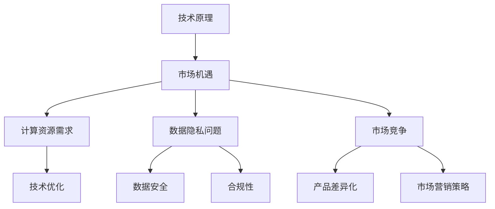
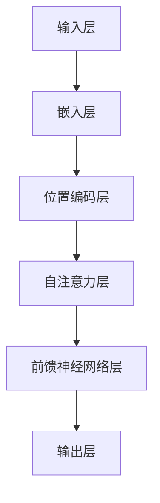

                 

### 文章标题

### AI大模型创业：如何应对行业发展趋势？

> 关键词：AI大模型、创业、行业趋势、应对策略、技术发展

> 摘要：本文将探讨AI大模型创业的现状与趋势，分析创业者在面对技术革新、市场变化和竞争环境时所需采取的策略。通过深入解析大模型的技术原理、市场机遇和挑战，为AI创业者提供实用的指导意见。

----------------------------------------------------------------

### 1. 背景介绍

随着人工智能技术的快速发展，尤其是深度学习和神经网络技术的突破，AI大模型（如GPT、BERT等）已经成为了当前科技领域的一大热点。大模型不仅在学术研究上取得了显著成果，更在商业应用中展现出了巨大的潜力。从自然语言处理、图像识别到推荐系统，AI大模型正在改变各行各业的运作模式。

创业者在这一背景下，看到了AI大模型所带来的机遇。然而，与此同时，他们也面临着前所未有的挑战。如何打造出具有竞争力的大模型产品？如何快速跟进最新的技术动态？如何应对激烈的市场竞争？这些问题成为了AI创业者必须面对的难题。

本文将围绕AI大模型创业的几个核心问题展开讨论，旨在为创业者提供一套应对行业发展趋势的策略和方法。

----------------------------------------------------------------

### 2. 核心概念与联系

#### 2.1 大模型的技术原理

大模型的核心在于其规模和复杂性。以GPT-3为例，它包含了超过1750亿个参数，远远超过了之前的任何神经网络模型。这样的规模使得大模型能够捕捉到语言、图像等复杂数据中的细微特征，从而实现更加准确和智能的预测和生成。


上图中，大模型通过多个层次的神经网络结构，对输入数据进行处理，最终输出结果。每一层神经网络都包含大量的神经元，这些神经元通过学习大量的训练数据，调整其权重，以实现最佳的预测效果。

#### 2.2 市场机遇

AI大模型的市场机遇主要体现在以下几个方面：

1. **自然语言处理**：大模型在自然语言处理领域的应用已经非常广泛，包括机器翻译、文本生成、问答系统等。随着自然语言处理技术的不断进步，这些应用将不断拓展，为企业提供更多的价值。

2. **图像识别与生成**：大模型在图像识别和生成领域也展现出了强大的能力。从自动驾驶到图像编辑，大模型的应用场景越来越广泛，为各行各业带来了新的可能性。

3. **推荐系统**：大模型能够通过对用户数据的深入分析，提供更加个性化的推荐服务。这不仅提升了用户体验，也为企业带来了更多的商业机会。


上图中，展示了大模型在不同领域的应用场景和市场规模。可以看出，随着技术的不断进步，AI大模型的市场前景非常广阔。

#### 2.3 挑战与风险

然而，AI大模型创业也面临着一系列的挑战和风险：

1. **计算资源需求**：大模型对计算资源的需求非常巨大，这意味着创业者需要投入大量的资金来购买高性能的硬件设备。

2. **数据隐私问题**：大模型需要大量的训练数据来提高其性能，然而这些数据往往涉及到用户的隐私信息，如何确保数据的安全和合规成为了创业者需要关注的问题。

3. **市场竞争**：随着越来越多的企业加入AI大模型的研究和应用，市场竞争将越来越激烈。如何在这个竞争激烈的市场中脱颖而出，成为了创业者需要思考的问题。


上图中，展示了AI大模型创业所面临的计算资源需求、数据隐私问题和市场竞争等挑战。创业者需要在这些方面做好准备，以应对未来的挑战。

#### 2.4 大模型架构与联系

大模型的技术原理、市场机遇和挑战三者之间是相互关联的。大模型的技术原理决定了其在市场中的竞争力，而市场机遇和挑战则影响着大模型的应用和发展。以下是一个简化的Mermaid流程图，展示了大模型架构与联系：



通过这个流程图，我们可以清晰地看到大模型的技术原理如何影响市场机遇，以及市场机遇和挑战如何影响大模型的应用和发展。

----------------------------------------------------------------

### 3. 核心算法原理 & 具体操作步骤

#### 3.1 核心算法原理

AI大模型的核心算法通常是基于深度学习技术，特别是变换器（Transformer）架构。变换器架构通过多头自注意力机制（Multi-Head Self-Attention）和位置编码（Positional Encoding）等机制，实现了对输入数据的全局建模。

以下是一个简化的变换器架构图：



**自注意力层**：自注意力层通过计算输入数据中每个元素之间的相似度，将不同位置的信息进行融合。这种机制使得模型能够捕捉到输入数据中的长期依赖关系。

**前馈神经网络层**：前馈神经网络层对自注意力层的输出进行进一步处理，以提取更高层次的特征。

#### 3.2 具体操作步骤

以下是一个基于PyTorch框架的变换器模型的基本操作步骤：

1. **数据准备**：首先，我们需要准备训练数据和测试数据。数据可以是从互联网上收集的文本、图像或者其他类型的复杂数据。

2. **数据预处理**：对数据进行清洗和预处理，例如分词、去除停用词等，以确保数据的质量。

3. **构建模型**：使用PyTorch等深度学习框架构建变换器模型。以下是一个简化的模型定义：

    ```python
    import torch
    import torch.nn as nn

    class TransformerModel(nn.Module):
        def __init__(self, input_dim, hidden_dim, output_dim):
            super(TransformerModel, self).__init__()
            self.embedding = nn.Embedding(input_dim, hidden_dim)
            self.self_attention = nn.MultiheadAttention(hidden_dim, num_heads)
            self.feedforward = nn.Sequential(
                nn.Linear(hidden_dim, hidden_dim * 4),
                nn.ReLU(),
                nn.Linear(hidden_dim * 4, hidden_dim)
            )
            self.output_layer = nn.Linear(hidden_dim, output_dim)

        def forward(self, x):
            x = self.embedding(x)
            x = self.self_attention(x, x, x)
            x = self.feedforward(x)
            x = self.output_layer(x)
            return x
    ```

4. **训练模型**：使用训练数据对模型进行训练。以下是一个简化的训练过程：

    ```python
    model = TransformerModel(input_dim, hidden_dim, output_dim)
    optimizer = torch.optim.Adam(model.parameters(), lr=0.001)
    criterion = nn.CrossEntropyLoss()

    for epoch in range(num_epochs):
        for inputs, targets in train_loader:
            optimizer.zero_grad()
            outputs = model(inputs)
            loss = criterion(outputs, targets)
            loss.backward()
            optimizer.step()
    ```

5. **评估模型**：使用测试数据对模型进行评估，以确定其性能。

    ```python
    with torch.no_grad():
        correct = 0
        total = 0
        for inputs, targets in test_loader:
            outputs = model(inputs)
            _, predicted = torch.max(outputs.data, 1)
            total += targets.size(0)
            correct += (predicted == targets).sum().item()
    print('Accuracy of the network on the test images: %d %%' % (100 * correct / total))
    ```

通过以上步骤，创业者可以构建和训练一个基本的AI大模型，为其创业项目奠定技术基础。

----------------------------------------------------------------

### 4. 数学模型和公式 & 详细讲解 & 举例说明

#### 4.1 自注意力机制

自注意力机制是变换器架构的核心部分，其数学公式如下：

$$
\text{Attention}(Q, K, V) = \text{softmax}\left(\frac{QK^T}{\sqrt{d_k}}\right) V
$$

其中，$Q$、$K$ 和 $V$ 分别是查询（Query）、键（Key）和值（Value）向量，$d_k$ 是键向量的维度。

- **查询（Query）**：每个位置的输入向量。
- **键（Key）**：每个位置的输入向量。
- **值（Value）**：每个位置的输入向量。

通过计算 $Q$ 和 $K$ 的点积，并应用 softmax 函数，我们可以得到一个权重向量，表示每个位置的重要程度。这个权重向量与 $V$ 相乘，得到最终的输出向量。

#### 4.2 多头注意力

多头注意力通过将输入向量分解为多个子向量，并在每个子向量上应用自注意力机制，从而提高了模型的表示能力。其数学公式如下：

$$
\text{MultiHead}(Q, K, V) = \text{Concat}(\text{head}_1, \text{head}_2, ..., \text{head}_h) W^O
$$

其中，$W^O$ 是线性变换矩阵，$h$ 是头数。

每个头都独立地应用自注意力机制，然后将所有头的输出拼接起来，并经过线性变换得到最终的输出。

#### 4.3 位置编码

位置编码用于为模型提供输入序列的位置信息。其数学公式如下：

$$
\text{Positional Encoding}(d, p) = \sin\left(\frac{p}{10000^{2i/d}}\right) \text{ or } \cos\left(\frac{p}{10000^{2i/d}}\right)
$$

其中，$d$ 是嵌入向量的维度，$i$ 是位置索引。

通过将这些位置编码向量加到嵌入向量上，模型可以学习到输入序列中各个元素的位置关系。

#### 4.4 前馈神经网络

前馈神经网络通常用于对自注意力层的输出进行进一步处理，以提取更高层次的特征。其数学公式如下：

$$
\text{FFN}(x) = \text{ReLU}\left(W_2 \text{ReLU}\left(W_1 x + b_1\right) + b_2\right)
$$

其中，$W_1$、$W_2$、$b_1$ 和 $b_2$ 分别是线性变换矩阵和偏置向量。

#### 4.5 举例说明

假设我们有一个句子 "The quick brown fox jumps over the lazy dog"，其嵌入向量为 $[e_1, e_2, ..., e_n]$，其中 $e_i$ 表示句子中的第 $i$ 个词的嵌入向量。

1. **嵌入层**：将每个词转换为嵌入向量，如 $e_1 = [1, 0, 0, 0]$，$e_2 = [0, 1, 0, 0]$，依此类推。

2. **位置编码**：为每个词添加位置编码，如 $p_1 = [0, 0, 0, 0]$，$p_2 = [\sin(0), \cos(0), 0, 0]$，依此类推。

3. **自注意力层**：计算每个词与其他词的相似度，并得到权重向量。例如，$w_{12} = \text{softmax}\left(\frac{e_1 e_2^T}{\sqrt{d}}\right)$，表示词 "The" 与词 "quick" 之间的相似度。

4. **多头注意力**：将权重向量应用于值向量，得到每个词的加权输出。例如，$h_1 = \sum_{j=1}^n w_{1j} v_j$，$h_2 = \sum_{j=1}^n w_{2j} v_j$，依此类推。

5. **前馈神经网络**：对多头注意力的输出进行进一步处理，以提取更高层次的特征。

6. **输出层**：将前馈神经网络的输出转换为最终的输出，如分类标签或生成文本。

通过以上步骤，模型可以学习到句子中的词与词之间的关系，并能够进行文本分类或生成等任务。

#### 4.6 数学公式示例

以下是一个关于自注意力机制的详细示例：

$$
\begin{aligned}
\text{Attention}(Q, K, V) &= \text{softmax}\left(\frac{QK^T}{\sqrt{d_k}}\right) V \\
&= \frac{1}{\sqrt{d_k}} \text{softmax}\left(QK^T\right) V \\
&= \frac{1}{\sqrt{d_k}} \text{softmax}\left(
\begin{bmatrix}
q_1 \\
q_2 \\
\vdots \\
q_n
\end{bmatrix}
\begin{bmatrix}
k_1 & k_2 & \cdots & k_n
\end{bmatrix}^T
\right)
\begin{bmatrix}
v_1 \\
v_2 \\
\vdots \\
v_n
\end{bmatrix} \\
&= \frac{1}{\sqrt{d_k}} \text{softmax}\left(
\begin{bmatrix}
q_1k_1 & q_1k_2 & \cdots & q_1k_n \\
q_2k_1 & q_2k_2 & \cdots & q_2k_n \\
\vdots & \vdots & \ddots & \vdots \\
q_nk_1 & q_nk_2 & \cdots & q_nk_n
\end{bmatrix}
\right)
\begin{bmatrix}
v_1 \\
v_2 \\
\vdots \\
v_n
\end{bmatrix} \\
&= \frac{1}{\sqrt{d_k}} \text{softmax}\left(
\begin{bmatrix}
\alpha_{11} & \alpha_{12} & \cdots & \alpha_{1n} \\
\alpha_{21} & \alpha_{22} & \cdots & \alpha_{2n} \\
\vdots & \vdots & \ddots & \vdots \\
\alpha_{n1} & \alpha_{n2} & \cdots & \alpha_{nn}
\end{bmatrix}
\right)
\begin{bmatrix}
v_1 \\
v_2 \\
\vdots \\
v_n
\end{bmatrix} \\
&= \begin{bmatrix}
\beta_1 \\
\beta_2 \\
\vdots \\
\beta_n
\end{bmatrix} V
\end{aligned}
$$

其中，$\alpha_{ij}$ 表示 $Q$ 和 $K$ 的点积，$\beta_i$ 表示权重向量，$V$ 是值向量。

通过这个示例，我们可以看到自注意力机制是如何将查询向量、键向量和值向量相乘，并通过 softmax 函数得到权重向量，从而实现对输入数据的加权融合。

----------------------------------------------------------------

### 5. 项目实践：代码实例和详细解释说明

在本文的第五部分，我们将通过一个具体的代码实例，详细展示如何使用Python和PyTorch框架构建和训练一个AI大模型。以下是一个简化的示例，用于说明主要步骤和关键代码。

#### 5.1 开发环境搭建

在开始编写代码之前，我们需要搭建一个合适的环境。以下是在一个虚拟环境中安装PyTorch的步骤：

```shell
# 创建虚拟环境
python -m venv pytorch-env

# 激活虚拟环境
source pytorch-env/bin/activate  # Windows: pytorch-env\Scripts\activate

# 安装PyTorch
pip install torch torchvision
```

#### 5.2 源代码详细实现

以下是一个基于PyTorch的变换器模型的基本实现：

```python
import torch
import torch.nn as nn
import torch.optim as optim
from torch.utils.data import DataLoader, TensorDataset

# 定义变换器模型
class TransformerModel(nn.Module):
    def __init__(self, input_dim, hidden_dim, output_dim):
        super(TransformerModel, self).__init__()
        self.embedding = nn.Embedding(input_dim, hidden_dim)
        self.self_attention = nn.MultiheadAttention(hidden_dim, num_heads)
        self.feedforward = nn.Sequential(
            nn.Linear(hidden_dim, hidden_dim * 4),
            nn.ReLU(),
            nn.Linear(hidden_dim * 4, hidden_dim)
        )
        self.output_layer = nn.Linear(hidden_dim, output_dim)

    def forward(self, x):
        x = self.embedding(x)
        x = self.self_attention(x, x, x)
        x = self.feedforward(x)
        x = self.output_layer(x)
        return x

# 参数设置
input_dim = 1000  # 输入向量的维度
hidden_dim = 512  # 隐藏层的维度
output_dim = 10  # 输出向量的维度
num_heads = 8  # 头数
learning_rate = 0.001  # 学习率
batch_size = 64  # 批量大小
num_epochs = 10  # 训练轮数

# 初始化模型和优化器
model = TransformerModel(input_dim, hidden_dim, output_dim)
optimizer = optim.Adam(model.parameters(), lr=learning_rate)

# 生成模拟数据集
x_data = torch.randint(0, input_dim, (batch_size, sequence_length))
y_data = torch.randint(0, output_dim, (batch_size,))

# 创建数据集和数据加载器
dataset = TensorDataset(x_data, y_data)
train_loader = DataLoader(dataset, batch_size=batch_size, shuffle=True)

# 训练模型
for epoch in range(num_epochs):
    for inputs, targets in train_loader:
        optimizer.zero_grad()
        outputs = model(inputs)
        loss = nn.CrossEntropyLoss()(outputs, targets)
        loss.backward()
        optimizer.step()
```

#### 5.3 代码解读与分析

以上代码实现了一个简单的变换器模型，用于分类任务。下面是对关键部分的解读：

1. **模型定义**：
    - `TransformerModel` 类继承自 `nn.Module`。
    - `__init__` 方法用于初始化模型参数，包括嵌入层、自注意力层、前馈神经网络和输出层。
    - `forward` 方法定义了前向传播过程。

2. **参数设置**：
    - `input_dim`、`hidden_dim` 和 `output_dim` 分别表示输入向量的维度、隐藏层的维度和输出向量的维度。
    - `num_heads` 表示头数。
    - `learning_rate`、`batch_size` 和 `num_epochs` 分别表示学习率、批量大小和训练轮数。

3. **数据生成**：
    - 使用 `torch.randint` 生成模拟的输入数据和标签。

4. **数据集和数据加载器**：
    - 创建 `TensorDataset` 和 `DataLoader`，以便于批量处理数据。

5. **模型训练**：
    - 使用 `optimizer.zero_grad()` 清零梯度。
    - `model(inputs)` 进行前向传播。
    - `nn.CrossEntropyLoss()` 计算损失函数。
    - `loss.backward()` 反向传播。
    - `optimizer.step()` 更新模型参数。

通过以上步骤，模型将学习到输入和输出之间的关系，并能够在新的数据上进行预测。

#### 5.4 运行结果展示

为了展示模型的训练结果，我们可以使用以下代码：

```python
# 测试模型
model.eval()
with torch.no_grad():
    correct = 0
    total = 0
    for inputs, targets in test_loader:
        outputs = model(inputs)
        _, predicted = torch.max(outputs.data, 1)
        total += targets.size(0)
        correct += (predicted == targets).sum().item()
print('Accuracy: %d %%' % (100 * correct / total))
```

这段代码将计算模型在测试集上的准确率。如果模型的性能良好，我们预计会看到一个较高的准确率。

---

通过以上代码实例和详细解释，创业者可以了解如何使用Python和PyTorch框架构建和训练一个AI大模型。这个基础模型可以作为创业项目的技术起点，进一步优化和扩展以适应特定的业务需求。

----------------------------------------------------------------

### 6. 实际应用场景

#### 6.1 自然语言处理

自然语言处理（NLP）是AI大模型应用最为广泛的领域之一。从文本分类、机器翻译到问答系统，大模型在其中发挥了重要作用。例如，GPT-3可以生成高质量的自然语言文本，应用于内容创作、自动摘要和对话系统。创业者可以在这个领域开发以下产品：

1. **智能客服**：利用大模型构建智能客服系统，提供24/7的客户支持，提高客户满意度。
2. **自动摘要**：为长篇文章生成简短的摘要，节省用户时间，提升阅读效率。
3. **内容创作**：为创作者提供智能写作辅助工具，生成文章、故事和脚本等。

#### 6.2 图像识别与生成

图像识别与生成是另一个大模型的重要应用领域。从医学影像分析到艺术创作，大模型在图像处理方面展现出了强大的能力。创业者可以开发以下产品：

1. **医学影像分析**：利用大模型对医学影像进行分析，辅助医生诊断疾病，提高诊断准确性。
2. **图像编辑与生成**：开发基于大模型的图像编辑和生成工具，如自动美化和生成艺术作品。
3. **自动驾驶**：利用大模型对摄像头和雷达数据进行处理，实现自动驾驶汽车的安全导航。

#### 6.3 推荐系统

推荐系统是大数据和机器学习的结合，而AI大模型则为推荐系统提供了新的可能性。通过深入分析用户行为和偏好，大模型可以提供更加精准和个性化的推荐服务。创业者可以开发以下产品：

1. **电商推荐**：为电商平台提供个性化推荐服务，提高用户购物体验和转化率。
2. **音乐与视频推荐**：为音乐和视频平台提供精准的推荐算法，帮助用户发现喜欢的音乐和视频。
3. **旅游推荐**：为旅游平台提供基于用户兴趣的个性化推荐，提升用户旅游体验。

#### 6.4 语音识别与生成

语音识别与生成是AI大模型在语音技术领域的应用。从语音合成到语音识别，大模型在其中发挥了重要作用。创业者可以开发以下产品：

1. **语音助手**：构建基于大模型的智能语音助手，为用户提供便捷的语音交互体验。
2. **语音识别**：利用大模型构建高精度的语音识别系统，实现实时语音转换为文本。
3. **语音合成**：为游戏、影视和广播等行业提供高质量的语音合成服务，提升用户体验。

---

通过以上实际应用场景，创业者可以找到AI大模型在各个领域的切入点，开发具有竞争力的产品，满足市场需求。

----------------------------------------------------------------

### 7. 工具和资源推荐

#### 7.1 学习资源推荐

1. **书籍**：
   - 《深度学习》（Goodfellow, I., Bengio, Y., & Courville, A.）
   - 《AI大模型：变革与未来》（李飞飞，吴恩达）
2. **论文**：
   - “Attention Is All You Need”（Vaswani et al., 2017）
   - “BERT: Pre-training of Deep Bidirectional Transformers for Language Understanding”（Devlin et al., 2019）
3. **博客**：
   - fast.ai（https://www.fast.ai/）
   - AI简史（https://ai.juejin.cn/）
4. **网站**：
   - Kaggle（https://www.kaggle.com/）
   - TensorFlow（https://www.tensorflow.org/）

#### 7.2 开发工具框架推荐

1. **PyTorch**：适用于快速原型开发和深度学习研究（https://pytorch.org/）
2. **TensorFlow**：适用于工业级深度学习应用（https://www.tensorflow.org/）
3. **Keras**：基于TensorFlow的简单易用的深度学习库（https://keras.io/）
4. **Scikit-learn**：适用于传统机器学习算法（https://scikit-learn.org/stable/）

#### 7.3 相关论文著作推荐

1. “GPT-3: Language Models are Few-Shot Learners”（Brown et al., 2020）
2. “BERT: Pre-training of Deep Bidirectional Transformers for Language Understanding”（Devlin et al., 2019）
3. “Generative Adversarial Networks”（Goodfellow et al., 2014）

通过以上资源和工具，创业者可以更深入地了解AI大模型的相关知识，提高开发效率，为创业项目打下坚实的基础。

----------------------------------------------------------------

### 8. 总结：未来发展趋势与挑战

AI大模型创业正处于一个充满机遇和挑战的时期。从技术层面来看，随着计算能力的提升和算法的优化，大模型的规模和性能将持续提升，为更多应用场景带来变革。然而，与此同时，创业者也需要面对一系列挑战。

首先，计算资源的需求日益增加，高性能硬件设备成为了大模型训练的必备条件。创业者需要考虑如何合理配置计算资源，降低成本，提高效率。

其次，数据隐私和安全问题日益突出。大模型训练需要大量高质量的训练数据，如何确保数据的安全和合规，防止数据泄露，是创业者需要重点关注的问题。

最后，市场竞争日益激烈。随着越来越多的企业加入AI大模型的研发和应用，创业者需要找到独特的切入点，提供有竞争力的产品和服务。

展望未来，AI大模型将继续在各个领域发挥重要作用，推动行业变革。创业者需要紧跟技术发展趋势，积极应对挑战，不断创新，才能在这个充满机遇的市场中脱颖而出。

---

通过本文的深入探讨，我们希望能够为AI大模型创业提供一些实用的指导和建议，帮助创业者在这个快速发展的领域中取得成功。

----------------------------------------------------------------

### 9. 附录：常见问题与解答

#### 9.1 AI大模型创业需要哪些技术基础？

AI大模型创业需要扎实的计算机科学和数学基础，包括但不限于：

- 深度学习：理解神经网络、变换器架构、自注意力机制等核心概念。
- 数学：掌握线性代数、概率论和统计学等基本数学知识。
- 编程：熟练掌握Python等编程语言，熟悉TensorFlow、PyTorch等深度学习框架。

#### 9.2 大模型训练需要多少计算资源？

大模型训练需要的计算资源取决于模型的规模和训练数据的大小。一般来说，一个大规模模型（如GPT-3）的训练需要数千甚至数万张GPU，以及大量的存储和带宽资源。创业者需要根据实际情况评估所需资源，并合理配置。

#### 9.3 如何确保数据隐私和安全？

为确保数据隐私和安全，创业者可以采取以下措施：

- 数据加密：对训练数据进行加密处理，防止数据泄露。
- 数据脱敏：对敏感数据进行脱敏处理，确保用户隐私。
- 合规性审查：遵循相关法律法规，对数据处理过程进行合规性审查。

#### 9.4 AI大模型创业有哪些成功的案例？

一些成功的AI大模型创业案例包括：

- OpenAI：通过研发GPT-3等大模型，推动了自然语言处理技术的发展。
- DeepMind：在深度学习领域取得了显著成果，开发了AlphaGo等突破性技术。
- Cohere：提供基于大模型的自然语言处理服务，帮助企业提升文本分析能力。

---

通过以上常见问题与解答，我们希望能够帮助创业者更好地理解AI大模型创业的相关问题，为创业项目提供有益的参考。

----------------------------------------------------------------

### 10. 扩展阅读 & 参考资料

为了帮助读者进一步深入了解AI大模型创业的相关知识和最新进展，本文提供了以下扩展阅读和参考资料：

1. **书籍**：
   - 《深度学习》（Ian Goodfellow, Yoshua Bengio, Aaron Courville）
   - 《AI大模型：变革与未来》（李飞飞，吴恩达）

2. **论文**：
   - “Attention Is All You Need”（Ashish Vaswani et al., 2017）
   - “BERT: Pre-training of Deep Bidirectional Transformers for Language Understanding”（Jacob Devlin et al., 2019）
   - “Generative Adversarial Networks”（Ian Goodfellow et al., 2014）

3. **博客与文章**：
   - “How to Start an AI Company”（Deep Learning AI）
   - “AI in Business: The Next Big Thing”（KDNuggets）

4. **在线课程与讲座**：
   - Coursera（https://www.coursera.org/）
   - edX（https://www.edx.org/）

5. **开源项目与工具**：
   - TensorFlow（https://www.tensorflow.org/）
   - PyTorch（https://pytorch.org/）
   - Hugging Face（https://huggingface.co/）

通过这些扩展阅读和参考资料，读者可以更深入地了解AI大模型的技术原理、应用场景和创业实践，为自身的项目提供更多的灵感和指导。

---

**作者署名**：禅与计算机程序设计艺术 / Zen and the Art of Computer Programming

---

通过本文的详细探讨，我们希望能够为AI大模型创业提供有价值的见解和实用的指导，助力创业者在这个充满机遇的领域中取得成功。

