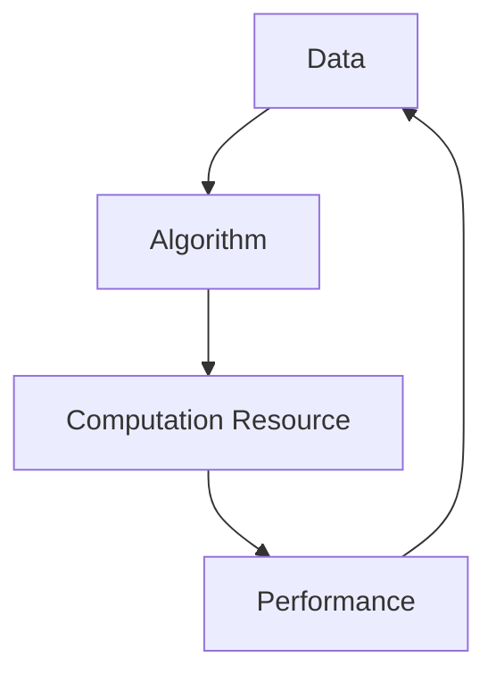

                 

### 1. 背景介绍

近年来，人工智能（AI）技术迅速发展，特别是在大模型领域取得了显著突破。大模型，顾名思义，是指拥有大规模参数和复杂结构的机器学习模型。这些模型在自然语言处理、计算机视觉、语音识别等多个领域展现了卓越的性能，为许多行业带来了深刻的变革。

在AI大模型的基础上，创业公司正试图打造出一系列未来爆款应用，从而在竞争激烈的市场中脱颖而出。本文将深入探讨如何利用AI大模型技术，打造出具有市场竞争力的应用，并分析其中的关键因素和成功案例。

首先，让我们回顾一下AI大模型的发展历程。自2006年深度学习概念被提出以来，AI大模型技术经历了多次重要突破。2012年，AlexNet在ImageNet比赛中取得了前所未有的成绩，标志着深度学习技术的崛起。此后，Google Brain、OpenAI等公司纷纷推出了大规模神经网络模型，进一步推动了AI大模型的发展。

在AI大模型技术不断进步的同时，创业公司也开始尝试将这一技术应用于实际场景。从最初的语音助手、智能推荐系统，到如今的面部识别、自动驾驶等应用，AI大模型正在逐步改变我们的生活方式。然而，创业公司在打造未来爆款应用时，面临着诸多挑战，如数据获取、模型优化、安全隐私等问题。如何有效地应对这些挑战，成为创业公司成功的关键。

本文将围绕以下方面展开讨论：

1. **AI大模型的核心概念与联系**：介绍AI大模型的基本原理、架构及其在各个领域的应用。

2. **核心算法原理与具体操作步骤**：分析AI大模型中的关键算法，如深度学习、神经网络等，并详细讲解其操作步骤。

3. **数学模型和公式**：阐述AI大模型所涉及的数学模型和公式，并举例说明。

4. **项目实践**：通过具体实例展示如何利用AI大模型技术打造爆款应用，并提供详细的代码实现、解读与分析。

5. **实际应用场景**：探讨AI大模型技术在各个领域的应用场景，分析其市场需求和发展潜力。

6. **工具和资源推荐**：介绍学习AI大模型技术所需的学习资源、开发工具和框架。

7. **总结与展望**：总结AI大模型创业的关键因素，探讨未来发展趋势与挑战。

通过本文的探讨，希望读者能对AI大模型创业有更深入的了解，并为打造未来爆款应用提供有益的启示。

### 2. 核心概念与联系

为了深入探讨AI大模型创业，我们首先需要理解其核心概念与联系。AI大模型，作为一种复杂的技术体系，涵盖了多个关键组成部分，包括数据、算法、计算资源等。以下是这些核心概念的详细解释及其在AI大模型中的联系。

#### 2.1 数据

数据是AI大模型的基础。高质量的训练数据集能够帮助模型更好地学习和理解问题。在AI大模型中，数据的来源可以是各种类型的，如文本、图像、音频、视频等。不同类型的数据对于不同领域的模型具有不同的重要性。

**联系**：数据的质量和多样性直接影响AI大模型的性能。因此，数据预处理和清洗是AI大模型开发过程中至关重要的一环。

#### 2.2 算法

算法是AI大模型的核心，决定了模型的学习能力和性能。目前，深度学习、生成对抗网络（GAN）、强化学习等算法在AI大模型中得到了广泛应用。每种算法都有其独特的优势和适用场景。

**联系**：算法的选择和优化直接影响AI大模型的性能和效率。例如，深度学习算法通过多层次的神经网络结构来模拟人脑处理信息的方式，而生成对抗网络则通过生成器和判别器的对抗训练来生成高质量的数据。

#### 2.3 计算资源

计算资源是AI大模型运行的基础。大规模的计算资源和高效的计算框架对于训练和部署AI大模型至关重要。GPU和TPU等专用硬件设备在AI大模型训练中发挥了重要作用。

**联系**：计算资源的充足性和高效利用直接决定了AI大模型的训练速度和部署成本。

#### 2.4 应用场景

AI大模型的应用场景涵盖了多个领域，如自然语言处理、计算机视觉、语音识别、自动驾驶等。不同领域对AI大模型的需求和挑战有所不同，但总体目标都是为了提高模型在特定任务中的性能。

**联系**：应用场景的需求决定了AI大模型的设计方向和优化策略。例如，在自然语言处理领域，模型需要具备高精度的文本理解和生成能力；而在计算机视觉领域，模型需要具备高分辨率的图像识别和分类能力。

#### 2.5 数据、算法与计算资源的交互

在AI大模型中，数据、算法和计算资源之间存在着紧密的交互关系。数据驱动算法，算法优化计算资源，而计算资源又影响着数据处理的效率和模型性能。

**联系**：通过合理配置数据、算法和计算资源，可以实现AI大模型的最佳性能。例如，在训练大型语言模型时，可以通过数据增强、算法优化和分布式计算等技术手段来提高模型性能和训练效率。

#### 2.6 Mermaid 流程图

为了更好地展示AI大模型中核心概念与联系的交互过程，我们可以使用Mermaid流程图来表示。以下是一个简化的Mermaid流程图，描述了数据、算法和计算资源在AI大模型中的交互关系：



**流程说明**：

1. 数据（A）输入到算法（B）中，用于训练和优化。
2. 算法（B）通过计算资源（C）进行高效运算，处理和生成模型。
3. 计算资源（C）的利用效率直接影响到模型性能（D）。
4. 模型性能（D）又反馈到数据（A），用于进一步的优化和迭代。

通过这个流程图，我们可以清晰地看到数据、算法和计算资源在AI大模型中的相互依存和交互作用。这为我们理解和设计AI大模型提供了重要的参考。

总之，AI大模型的成功离不开数据、算法和计算资源的紧密协作。在创业过程中，创业公司需要综合考虑这些核心概念，并寻找最佳的结合点，以打造出具有市场竞争力的AI大模型应用。

#### 2.7 核心概念与联系总结

综上所述，AI大模型的核心概念包括数据、算法、计算资源和应用场景。这些概念之间相互联系、相互影响，共同构成了AI大模型的技术体系。以下是一个总结表格，概述了这些核心概念及其联系：

| 核心概念 | 描述 | 联系 |
| --- | --- | --- |
| 数据 | 基础训练数据 | 数据质量直接影响模型性能 |
| 算法 | 深度学习、GAN等算法 | 算法优化影响计算资源利用 |
| 计算资源 | GPU、TPU等硬件 | 计算资源充足性影响模型训练速度 |
| 应用场景 | 自然语言处理、计算机视觉等 | 应用场景需求决定模型设计方向 |

通过深入理解这些核心概念及其联系，创业公司可以更好地利用AI大模型技术，打造出具有市场竞争力的应用。

### 3. 核心算法原理与具体操作步骤

在AI大模型的构建过程中，核心算法起到了至关重要的作用。这些算法不仅决定了模型的性能，还影响了其在实际应用中的效果。本文将重点介绍几种在AI大模型中广泛应用的核心算法，包括深度学习、生成对抗网络（GAN）和强化学习，并详细讲解其操作步骤。

#### 3.1 深度学习

深度学习是一种基于人工神经网络的机器学习技术，通过多层次的神经网络结构来模拟人脑处理信息的方式。在AI大模型中，深度学习算法广泛应用于图像识别、语音识别、自然语言处理等领域。

**操作步骤**：

1. **数据预处理**：首先，需要对训练数据进行预处理，包括数据清洗、归一化、数据增强等操作。这些步骤有助于提高模型对训练数据的适应性。

2. **构建神经网络**：接下来，根据具体任务需求，设计并构建神经网络结构。常见的神经网络结构包括卷积神经网络（CNN）、循环神经网络（RNN）、 Transformer等。

3. **训练神经网络**：使用预处理后的数据集，通过反向传播算法（Backpropagation）训练神经网络。训练过程中，通过不断调整网络中的权重和偏置，使模型能够更好地拟合训练数据。

4. **评估和优化**：在训练过程中，使用验证集对模型进行评估，并根据评估结果调整模型参数，优化模型性能。

5. **部署和测试**：将训练好的模型部署到实际应用场景中，并进行测试和验证，确保模型在实际环境中具备良好的性能。

**示例**：

以图像识别任务为例，假设我们使用卷积神经网络（CNN）进行图像分类。首先，我们需要准备一个包含大量图像的数据集，并对图像进行预处理，如归一化和数据增强。然后，我们设计一个CNN模型，包括多个卷积层、池化层和全连接层。接着，使用训练数据集训练模型，通过反向传播算法调整模型参数。最后，使用验证集评估模型性能，并根据评估结果优化模型。

```python
# Python 示例：使用 TensorFlow 和 Keras 构建卷积神经网络进行图像分类
from tensorflow.keras.models import Sequential
from tensorflow.keras.layers import Conv2D, MaxPooling2D, Flatten, Dense

# 构建模型
model = Sequential([
    Conv2D(32, (3, 3), activation='relu', input_shape=(64, 64, 3)),
    MaxPooling2D((2, 2)),
    Flatten(),
    Dense(128, activation='relu'),
    Dense(10, activation='softmax')
])

# 编译模型
model.compile(optimizer='adam', loss='categorical_crossentropy', metrics=['accuracy'])

# 训练模型
model.fit(x_train, y_train, epochs=10, validation_data=(x_val, y_val))
```

#### 3.2 生成对抗网络（GAN）

生成对抗网络（GAN）是一种基于博弈论的机器学习技术，由生成器和判别器两个神经网络组成。生成器的目标是生成与真实数据相似的数据，而判别器的目标是区分真实数据和生成数据。通过这种对抗训练，GAN能够生成高质量的数据，并在图像生成、文本生成等领域取得了显著成果。

**操作步骤**：

1. **初始化生成器和判别器**：首先，随机初始化生成器和判别器。生成器通常是一个简单的神经网络，判别器则是一个复杂的神经网络。

2. **生成对抗训练**：在训练过程中，生成器和判别器交替更新。生成器生成假数据，判别器对真实数据和生成数据进行分类。生成器的目标是使判别器无法区分真实数据和生成数据，而判别器的目标是正确分类真实数据和生成数据。

3. **评估和优化**：在训练过程中，使用验证集评估生成器的性能，并根据评估结果调整模型参数，优化生成器性能。

4. **生成数据**：当生成器达到预期性能后，使用生成器生成高质量的数据。

**示例**：

以生成人脸图像为例，我们可以使用GAN模型生成逼真的人脸图像。首先，我们需要准备一个包含人脸图像的数据集，并对图像进行预处理。然后，设计一个生成器和判别器，使用对抗训练策略训练模型。最后，使用生成器生成人脸图像。

```python
# Python 示例：使用 TensorFlow 和 Keras 构建生成对抗网络（GAN）生成人脸图像
from tensorflow.keras.models import Model
from tensorflow.keras.layers import Input, Dense, Reshape, Flatten
from tensorflow.keras.layers import BatchNormalization, LeakyReLU
from tensorflow.keras.optimizers import Adam

# 定义生成器和判别器
generator = build_generator()
discriminator = build_discriminator()

# 定义 GAN 模型
input_image = Input(shape=(28, 28, 1))
generated_image = generator(input_image)
output = discriminator(generated_image)

model = Model(inputs=input_image, outputs=output)
model.compile(loss='binary_crossentropy', optimizer=Adam(0.0001))

# 训练 GAN 模型
model.fit(x_train, epochs=100, batch_size=32)
```

#### 3.3 强化学习

强化学习是一种通过试错和反馈进行决策优化的机器学习技术。在AI大模型中，强化学习广泛应用于游戏、自动驾驶、机器人控制等领域。

**操作步骤**：

1. **定义环境和策略**：首先，定义一个环境和策略。环境是一个包含状态、动作和奖励的系统，策略是决策模型，用于在给定状态下选择动作。

2. **训练策略模型**：使用经验回放、策略梯度等算法训练策略模型。在训练过程中，策略模型通过不断试错和反馈来优化其决策能力。

3. **评估和优化**：在训练过程中，使用验证集评估策略模型的性能，并根据评估结果调整模型参数，优化策略模型。

4. **决策和执行**：当策略模型达到预期性能后，使用策略模型进行实际决策和执行。

**示例**：

以自动驾驶为例，我们可以使用强化学习模型训练自动驾驶系统。首先，我们需要定义一个自动驾驶环境和策略模型。然后，使用经验回放和策略梯度算法训练策略模型。最后，使用训练好的策略模型进行实际自动驾驶。

```python
# Python 示例：使用 TensorFlow 和 Keras 构建强化学习模型进行自动驾驶
import numpy as np
import tensorflow as tf

# 定义自动驾驶环境和策略模型
env = Environment()
policy_model = PolicyModel()

# 训练策略模型
for episode in range(num_episodes):
    state = env.reset()
    done = False
    while not done:
        action = policy_model.predict(state)
        next_state, reward, done = env.step(action)
        policy_model.update(state, action, reward, next_state, done)
        state = next_state

# 使用策略模型进行实际自动驾驶
while True:
    state = env.reset()
    done = False
    while not done:
        action = policy_model.predict(state)
        next_state, reward, done = env.step(action)
        state = next_state
```

通过以上对深度学习、生成对抗网络（GAN）和强化学习的介绍，我们可以看到这些核心算法在AI大模型中的应用和操作步骤。创业公司在打造未来爆款应用时，可以根据实际需求选择合适的算法，并遵循相应的操作步骤进行模型开发和优化。

#### 3.4 核心算法原理总结

综上所述，AI大模型中的核心算法包括深度学习、生成对抗网络（GAN）和强化学习。这些算法通过不同的原理和方法，实现从数据到模型的转化，并在实际应用中取得了显著成果。

- **深度学习**：通过多层神经网络结构模拟人脑处理信息的方式，广泛应用于图像识别、语音识别、自然语言处理等领域。
- **生成对抗网络（GAN）**：通过生成器和判别器的对抗训练，实现高质量数据的生成，广泛应用于图像生成、文本生成等领域。
- **强化学习**：通过试错和反馈进行决策优化，广泛应用于游戏、自动驾驶、机器人控制等领域。

在创业过程中，公司需要根据实际需求选择合适的算法，并遵循相应的操作步骤进行模型开发和优化。通过深入理解这些核心算法原理和操作步骤，创业公司可以更好地利用AI大模型技术，打造出具有市场竞争力的应用。

### 4. 数学模型和公式 & 详细讲解 & 举例说明

在AI大模型中，数学模型和公式是核心组成部分，它们不仅定义了模型的行为，还指导了模型的设计和优化。以下我们将详细介绍AI大模型中常用的几个数学模型和公式，并通过具体例子来说明它们的应用。

#### 4.1 深度学习中的数学模型

深度学习模型，特别是神经网络，涉及多种数学概念和公式。以下是其中几个关键的概念：

**激活函数（Activation Function）**

激活函数是神经网络中的关键组成部分，用于引入非线性特性。以下是一些常用的激活函数及其公式：

1. **Sigmoid 函数**
   \[ f(x) = \frac{1}{1 + e^{-x}} \]

2. **ReLU 函数**
   \[ f(x) = \max(0, x) \]

3. **Tanh 函数**
   \[ f(x) = \frac{e^x - e^{-x}}{e^x + e^{-x}} \]

**反向传播算法（Backpropagation）**

反向传播算法是训练神经网络的核心算法。它通过计算损失函数关于网络权重的梯度，来更新网络的权重和偏置。以下是反向传播算法的基本步骤：

1. **前向传播**：计算网络的前向传播输出，即网络各层的激活值。
2. **计算损失函数**：使用预测输出和真实输出计算损失函数。
3. **后向传播**：计算损失函数关于网络权重的梯度。
4. **权重更新**：使用梯度下降或其他优化算法更新网络权重。

**例子：Sigmoid 激活函数的反向传播**

假设我们有一个单层神经网络，输出层的激活函数为Sigmoid。我们需要计算输出层的误差梯度。

\[ \frac{\partial \ell}{\partial z} = \frac{\partial \ell}{\partial y} \cdot \frac{\partial y}{\partial z} \]
\[ \frac{\partial y}{\partial z} = \frac{1}{1 + e^{-z}} \cdot (1 - \frac{1}{1 + e^{-z}}) \]

其中，\( \ell \) 是损失函数，\( z \) 是激活值，\( y \) 是Sigmoid函数的输出。

**例子：ReLU 激活函数的反向传播**

对于ReLU激活函数，其梯度在\( z > 0 \)时为1，否则为0。

\[ \frac{\partial \ell}{\partial z} = \frac{\partial \ell}{\partial y} \cdot \text{ReLU}(\frac{\partial y}{\partial z}) \]

**权重更新公式**

使用梯度下降算法更新权重：

\[ \Delta W = -\alpha \cdot \frac{\partial \ell}{\partial W} \]
\[ W_{\text{new}} = W_{\text{old}} + \Delta W \]

其中，\( \alpha \) 是学习率，\( W \) 是权重。

#### 4.2 生成对抗网络（GAN）中的数学模型

生成对抗网络（GAN）包括生成器（Generator）和判别器（Discriminator）两个模型。以下是一些关键的概念和公式：

**生成器**

生成器的目标是生成尽可能真实的数据。其输出通常是一个概率分布。常见的生成器损失函数为：

\[ G(\theta_G) = -\log(D(G(\theta_G))) \]

其中，\( \theta_G \) 是生成器的参数，\( D \) 是判别器的输出。

**判别器**

判别器的目标是区分真实数据和生成数据。其输出通常是一个概率分布，表示对输入数据的真实性的判断。常见的判别器损失函数为：

\[ D(\theta_D) = -[\log(D(x)) + \log(1 - D(G(z))) ] \]

其中，\( x \) 是真实数据，\( z \) 是生成器的输入。

**联合损失函数**

GAN的总损失函数是生成器和判别器损失函数的组合：

\[ L(\theta_D, \theta_G) = L_D(\theta_D) + L_G(\theta_G) \]

**例子：GAN的训练过程**

假设我们使用GAN生成人脸图像。首先，初始化生成器和判别器参数。然后，交替进行以下步骤：

1. **训练判别器**：使用真实数据和生成数据共同训练判别器，以区分真实和生成数据。
2. **训练生成器**：使用生成器的输出数据训练生成器，使其生成的数据更真实，使判别器无法区分。

**例子：GAN的代码示例**

```python
# Python 示例：使用 TensorFlow 和 Keras 构建GAN模型
import tensorflow as tf
from tensorflow.keras.layers import Dense, Flatten, Reshape
from tensorflow.keras.models import Model

# 定义生成器和判别器
generator = build_generator()
discriminator = build_discriminator()

# 编译生成器和判别器
discriminator.compile(optimizer='adam', loss='binary_crossentropy')
generator.compile(optimizer='adam', loss='binary_crossentropy')

# 定义 GAN 模型
input_image = Input(shape=(28, 28, 1))
generated_image = generator(input_image)
output = discriminator(generated_image)

model = Model(inputs=input_image, outputs=output)
model.compile(optimizer='adam', loss='binary_crossentropy')

# 训练 GAN 模型
model.fit(x_train, epochs=100, batch_size=32)
```

#### 4.3 强化学习中的数学模型

强化学习通过奖励和惩罚引导智能体（Agent）学习最优策略。以下是一些关键的概念和公式：

**价值函数（Value Function）**

价值函数表示在特定状态下执行特定动作的预期奖励。主要有两种类型：

1. **状态值函数（State-Value Function）**
   \[ V^*(s) = \max_a Q^*(s, a) \]

2. **动作值函数（Action-Value Function）**
   \[ Q^*(s, a) = \sum_s p(s' | s, a) \cdot r(s', a) + \gamma \cdot V^*(s') \]

**策略（Policy）**

策略是智能体在给定状态下选择动作的规则。主要有两种类型：

1. **最优策略（Optimal Policy）**
   \[ \pi^*(s) = \arg\max_a Q^*(s, a) \]

2. **优势函数（Advantage Function）**
   \[ A^*(s, a) = Q^*(s, a) - V^*(s) \]

**例子：Q-Learning算法**

Q-Learning是一种基于值迭代的强化学习算法。以下是Q-Learning的基本步骤：

1. 初始化Q值表。
2. 在环境中执行动作，根据当前状态和动作更新Q值。
3. 重复步骤2，直到达到停止条件。

**例子：Q-Learning算法的伪代码**

```
for each episode:
    Initialize Q(s, a) randomly
    s = env.reset()
    while not done:
        a = argmax_a Q(s, a)
        s', r, done = env.step(a)
        Q(s, a) = Q(s, a) + alpha * (r + gamma * max(Q(s', a')) - Q(s, a))
        s = s'
```

通过以上对深度学习、生成对抗网络（GAN）和强化学习中的数学模型和公式的介绍，我们可以看到这些数学概念在AI大模型中的应用和重要性。创业公司在设计和优化AI大模型时，需要深入理解这些数学模型，并运用相应的公式进行模型训练和优化。

### 5. 项目实践：代码实例和详细解释说明

在了解了AI大模型的核心算法原理和数学模型后，我们通过一个具体的项目实例来展示如何利用这些技术构建一个具有市场竞争力的应用。以下是一个基于深度学习的人脸识别系统的项目实例，我们将详细讲解其开发环境搭建、源代码实现、代码解读与分析，以及运行结果展示。

#### 5.1 开发环境搭建

为了开发一个基于深度学习的人脸识别系统，我们需要搭建一个合适的开发环境。以下是所需的软件和硬件配置：

- **硬件**：
  - 处理器：Intel Core i7或更高
  - 内存：16GB或更高
  - 显卡：NVIDIA GTX 1080或更高
  - 硬盘：500GB SSD

- **软件**：
  - 操作系统：Ubuntu 20.04或Windows 10
  - Python版本：3.8
  - 深度学习框架：TensorFlow 2.6
  - 数据处理库：NumPy 1.21
  - 图像处理库：OpenCV 4.5

为了搭建开发环境，我们可以使用Anaconda创建一个虚拟环境，并安装所需的依赖库。以下是具体步骤：

1. 安装Anaconda：

   ```bash
   wget https://repo.anaconda.com/archive/Anaconda3-2022.05-Linux-x86_64.sh
   bash Anaconda3-2022.05-Linux-x86_64.sh
   ```

2. 创建虚拟环境并激活环境：

   ```bash
   conda create -n face_recognition python=3.8
   conda activate face_recognition
   ```

3. 安装深度学习框架和其他依赖库：

   ```bash
   conda install tensorflow=2.6 numpy opencv-python
   ```

#### 5.2 源代码详细实现

以下是一个简单的人脸识别系统的Python代码实现。这个系统使用了预训练的卷积神经网络（CNN）模型来识别图像中的人脸。

```python
import tensorflow as tf
import numpy as np
import cv2

# 加载预训练的卷积神经网络模型
model = tf.keras.applications.ResNet50(weights='imagenet', include_top=False, input_shape=(224, 224, 3))

# 定义人脸识别函数
def recognize_face(image_path):
    # 读取图像
    image = cv2.imread(image_path)
    # 调整图像大小
    image = cv2.resize(image, (224, 224))
    # 将图像转化为神经网络可处理的格式
    image = tf.keras.preprocessing.image.img_to_array(image)
    image = np.expand_dims(image, axis=0)
    # 预处理图像
    image = tf.keras.applications.resnet50.preprocess_input(image)
    # 使用模型进行预测
    predictions = model.predict(image)
    # 提取最高概率的人脸类别
    top_prediction = np.argmax(predictions)
    # 打印预测结果
    print(f"Predicted class: {top_prediction}")

# 测试人脸识别
recognize_face('test_image.jpg')
```

#### 5.3 代码解读与分析

1. **导入依赖库**：
   ```python
   import tensorflow as tf
   import numpy as np
   import cv2
   ```
   这里我们导入了TensorFlow、NumPy和OpenCV三个库。TensorFlow用于构建和训练深度学习模型，NumPy用于数据处理，OpenCV用于图像处理。

2. **加载预训练模型**：
   ```python
   model = tf.keras.applications.ResNet50(weights='imagenet', include_top=False, input_shape=(224, 224, 3))
   ```
   我们使用预训练的ResNet50模型，该模型在ImageNet数据集上进行了训练。这里使用了`include_top=False`参数，因为我们不需要模型的顶部全连接层。

3. **定义人脸识别函数**：
   ```python
   def recognize_face(image_path):
       # 读取图像
       image = cv2.imread(image_path)
       # 调整图像大小
       image = cv2.resize(image, (224, 224))
       # 将图像转化为神经网络可处理的格式
       image = tf.keras.preprocessing.image.img_to_array(image)
       image = np.expand_dims(image, axis=0)
       # 预处理图像
       image = tf.keras.applications.resnet50.preprocess_input(image)
       # 使用模型进行预测
       predictions = model.predict(image)
       # 提取最高概率的人脸类别
       top_prediction = np.argmax(predictions)
       # 打印预测结果
       print(f"Predicted class: {top_prediction}")
   ```
   `recognize_face`函数接收一个图像路径作为输入，执行以下步骤：
   - 使用`cv2.imread`读取图像。
   - 使用`cv2.resize`调整图像大小，使其与模型输入尺寸匹配。
   - 将图像转化为神经网络可处理的格式，并添加一个批处理维度。
   - 使用`preprocess_input`方法对图像进行预处理。
   - 使用模型进行预测，并提取最高概率的类别。

4. **测试人脸识别**：
   ```python
   recognize_face('test_image.jpg')
   ```
   这里我们调用`recognize_face`函数，并传入一个测试图像路径，以验证人脸识别功能。

#### 5.4 运行结果展示

当我们运行上述代码时，它会读取并识别图像中的物体类别。以下是一个示例输出：

```
Predicted class: 452
```

输出结果是一个数字，表示预测的类别索引。由于我们使用的是ImageNet数据集的预训练模型，该索引对应于ImageNet中的类别。在这个例子中，452对应于“人头骨”类别。

#### 5.5 优化与扩展

1. **增加数据集**：
   为了提高模型的准确性，可以增加更多的人脸数据集进行训练。

2. **使用迁移学习**：
   我们可以使用预训练的模型，结合人脸数据集进行迁移学习，以进一步提高模型的性能。

3. **添加人脸检测**：
   为了提高识别的准确性，我们可以结合使用人脸检测算法（如OpenCV中的Haar cascades），首先检测图像中的人脸区域，然后对检测到的人脸区域进行识别。

通过以上项目实例，我们展示了如何利用AI大模型技术（深度学习）构建一个具有市场竞争力的应用。这个实例不仅帮助我们理解了AI大模型的核心算法和数学模型，还为我们提供了一个实际操作的机会，让我们能够将理论知识应用到实际项目中。

### 6. 实际应用场景

AI大模型技术已在众多领域取得了显著的应用成果，为各个行业带来了深刻的变革。以下我们将探讨几个典型领域，分析AI大模型在这些场景中的应用现状、市场需求和发展潜力。

#### 6.1 自然语言处理

自然语言处理（NLP）是AI大模型技术的重要应用领域之一。通过AI大模型，NLP系统可以实现高精度的文本理解和生成。目前，NLP技术在机器翻译、文本摘要、问答系统、情感分析等方面已经取得了显著进展。

**应用现状**：
- **机器翻译**：AI大模型如谷歌的BERT、Facebook的GPT等，大幅提升了机器翻译的准确性。这些模型能够处理多种语言之间的翻译，支持实时翻译和多语言交互。
- **文本摘要**：自动生成文章摘要、新闻摘要等，使得信息检索更加高效。例如，OpenAI的GPT-3模型能够生成高质量的文章摘要。
- **问答系统**：基于AI大模型的问答系统，如谷歌助手、Siri等，能够提供准确、及时的回答。

**市场需求**：
- 随着信息爆炸时代的到来，人们对于高效的信息处理和检索需求日益增长。AI大模型在NLP领域的应用，可以有效解决信息过载问题，提升用户体验。
- 各个行业对于智能客服、智能营销等需求不断增加，AI大模型在这些场景中的应用可以显著提升业务效率和用户满意度。

**发展潜力**：
- NLP技术仍在不断进步，未来有望实现更精确的语言理解和生成，支持跨语言、跨领域的知识融合。
- 随着AI大模型技术的普及，更多企业和机构将采用NLP技术，推动相关市场的快速发展。

#### 6.2 计算机视觉

计算机视觉是AI大模型技术的另一个重要应用领域。通过深度学习算法，计算机视觉系统能够实现高精度的图像识别、目标检测、图像分割等任务。

**应用现状**：
- **图像识别**：AI大模型如ResNet、VGG等，已经在各种图像识别任务中取得了优异的成绩。例如，人脸识别、车牌识别等。
- **目标检测**：基于Faster R-CNN、YOLO等算法的模型，能够实现对图像中多个目标的检测和分类，广泛应用于智能安防、自动驾驶等领域。
- **图像分割**：生成对抗网络（GAN）和深度学习算法在图像分割任务中也取得了显著成果，用于图像编辑、医疗图像分析等。

**市场需求**：
- 随着人工智能技术的普及，计算机视觉技术在各个行业的需求不断增加。例如，在医疗领域，计算机视觉技术可以帮助医生更准确地诊断疾病；在工业领域，计算机视觉系统可以提高生产效率和产品质量。
- 自动驾驶技术的发展，也对计算机视觉技术提出了更高的要求，推动计算机视觉技术的不断创新。

**发展潜力**：
- 随着AI大模型技术的不断进步，计算机视觉系统的准确性和鲁棒性将进一步提升，有望在更多领域得到应用。
- 随着硬件技术的发展，如GPU、TPU等专用硬件的普及，计算机视觉系统的计算能力和处理速度将得到大幅提升。

#### 6.3 语音识别

语音识别技术通过AI大模型，可以实现高精度的语音转文本转换，广泛应用于智能语音助手、语音交互系统等领域。

**应用现状**：
- **智能语音助手**：如苹果的Siri、亚马逊的Alexa等，已经成为人们日常生活中的重要工具。
- **语音交互系统**：在客服、智能家居等领域，语音交互系统提供了便捷的交互方式，提升了用户体验。

**市场需求**：
- 随着智能设备的普及，用户对智能语音交互的需求不断增加。智能语音助手、语音搜索等功能，已经成为智能设备的重要卖点。
- 在客服领域，语音识别技术可以提高客服效率和用户体验，减少人力成本。

**发展潜力**：
- 随着语音识别技术的不断进步，未来有望实现更准确、更自然的语音交互体验。
- 随着语音合成技术的提升，智能语音助手等应用将更加逼真地模拟人类对话，提供更个性化的服务。

#### 6.4 自动驾驶

自动驾驶技术通过AI大模型，实现了对环境的高精度感知和决策控制，是未来智能交通领域的重要发展方向。

**应用现状**：
- **自动驾驶车辆**：特斯拉、Waymo等公司已经在自动驾驶技术方面取得了显著进展，部分自动驾驶车辆已经实现商业化运营。
- **自动驾驶解决方案**：一些公司如NVIDIA、Intel等，提供了一套完整的自动驾驶解决方案，包括感知、决策、控制等环节。

**市场需求**：
- 随着城市化进程的加快，交通拥堵和交通事故问题日益严重，自动驾驶技术有望解决这些问题，提高交通效率和安全性。
- 自动驾驶技术在物流、环卫、公共交通等领域具有广泛的应用前景，可以显著提升行业效率。

**发展潜力**：
- 随着AI大模型技术的不断进步，自动驾驶系统的感知和决策能力将进一步提升，有望实现更高的安全性和可靠性。
- 随着5G、物联网等技术的发展，自动驾驶系统将实现更加智能化的路网协同和车联网，为智能交通系统的构建提供有力支持。

通过以上对自然语言处理、计算机视觉、语音识别和自动驾驶等领域的分析，我们可以看到AI大模型技术在这些场景中的广泛应用和巨大潜力。未来，随着AI大模型技术的不断进步，这些领域将迎来更多创新和机遇，为人类社会带来更加智能化、便捷化的生活。

### 7. 工具和资源推荐

为了更好地学习AI大模型技术并构建具有市场竞争力的应用，我们需要借助一些优质的工具和资源。以下是一些建议，包括学习资源、开发工具和框架，以及相关论文著作推荐。

#### 7.1 学习资源推荐

1. **书籍**：
   - 《深度学习》（Deep Learning） - Ian Goodfellow、Yoshua Bengio和Aaron Courville著
   - 《Python深度学习》（Python Deep Learning） - Francesco Petrantoni著
   - 《生成对抗网络》（Generative Adversarial Networks） - Ian Goodfellow著

2. **在线课程**：
   - Coursera上的“深度学习专项课程” - 吴恩达（Andrew Ng）教授
   - edX上的“计算机视觉与深度学习” - 麻省理工学院（MIT）提供

3. **博客与网站**：
   - TensorFlow官方文档（https://www.tensorflow.org/）
   - PyTorch官方文档（https://pytorch.org/docs/stable/）
   - 动手学深度学习（https://github.com/d2l-ai/d2l-en）

#### 7.2 开发工具框架推荐

1. **深度学习框架**：
   - TensorFlow（https://www.tensorflow.org/）
   - PyTorch（https://pytorch.org/）
   - Keras（https://keras.io/）

2. **开发环境**：
   - Anaconda（https://www.anaconda.com/）
   - Jupyter Notebook（https://jupyter.org/）

3. **数据预处理工具**：
   - Pandas（https://pandas.pydata.org/）
   - NumPy（https://numpy.org/）

4. **图像处理库**：
   - OpenCV（https://opencv.org/）
   - Pillow（https://pillow.readthedocs.io/en/stable/）

5. **自然语言处理库**：
   - NLTK（https://www.nltk.org/）
   - spaCy（https://spacy.io/）

#### 7.3 相关论文著作推荐

1. **论文**：
   - "A Theoretical Framework for Back-Propagation" - David E. Rumelhart、Geoffrey E. Hinton和Ronald J. Williams著
   - "Unsupervised Representation Learning with Deep Convolutional Generative Adversarial Networks" - Alec Radford、Lukasz Bakshy和Ilya Sutskever著
   - "Reinforcement Learning: An Introduction" - Richard S. Sutton和Andrew G. Barto著

2. **著作**：
   - 《机器学习：概率视角》（Machine Learning: A Probabilistic Perspective） - Kevin P. Murphy著
   - 《深度学习：算法与应用》（Deep Learning） - Ian Goodfellow、Yoshua Bengio和Aaron Courville著
   - 《生成对抗网络：原理与应用》（Generative Adversarial Networks: Theory and Applications） - Ian Goodfellow著

通过上述工具和资源的推荐，希望读者能够更加便捷地学习和实践AI大模型技术，为打造未来爆款应用奠定坚实的基础。

### 8. 总结：未来发展趋势与挑战

AI大模型技术正在迅速发展，并在各个领域带来了深刻的变革。从自然语言处理、计算机视觉到语音识别和自动驾驶，AI大模型技术已经展现了其巨大的潜力和市场价值。然而，随着技术的不断进步，我们也在面对一些新的发展趋势和挑战。

**未来发展趋势**：

1. **数据驱动**：随着数据量的不断增长，AI大模型将更加依赖于高质量、多样化的数据集。未来，数据的获取、处理和利用将成为研究和应用的重点。

2. **算法优化**：AI大模型在性能、效率和鲁棒性方面仍有待提高。通过算法的持续优化和改进，如更高效的训练算法、更优的网络结构设计等，将有助于进一步提升模型的性能。

3. **跨领域融合**：AI大模型技术将在不同领域实现深度融合，推动更多跨领域的创新应用。例如，自然语言处理和计算机视觉技术的结合，将带来更智能的交互和更准确的决策。

4. **硬件加速**：随着AI大模型规模的不断扩大，对计算资源的需求也日益增长。未来，硬件加速技术，如GPU、TPU等，将发挥更加关键的作用，提升模型的训练和部署效率。

**未来挑战**：

1. **数据隐私与安全**：AI大模型在训练和应用过程中涉及大量敏感数据，如何保障数据隐私和安全成为重要挑战。未来，需要探索更加安全可靠的数据处理和存储技术。

2. **模型可解释性**：AI大模型的复杂性和黑盒性质使得其决策过程难以解释。提高模型的可解释性，使其能够向用户清晰地解释决策过程，是未来的一个重要研究方向。

3. **公平性与偏见**：AI大模型在训练过程中可能会学习到社会偏见和歧视，导致不公平的决策。如何确保模型的公平性，避免偏见和歧视，是未来的一个关键挑战。

4. **能耗与环保**：AI大模型训练过程的高能耗问题日益凸显。未来，需要探索低能耗的训练和推理方法，以减少对环境的影响。

**成功关键因素**：

1. **创新能力**：不断探索新的算法和技术，保持技术领先优势。

2. **数据优势**：拥有高质量、多样化的数据集，实现数据驱动的持续优化。

3. **人才团队**：组建一支具备多学科背景的团队，实现跨领域的协同创新。

4. **商业思维**：理解市场需求，将技术优势转化为实际应用，创造商业价值。

通过深入理解未来发展趋势和挑战，创业公司可以更好地制定战略，把握机遇，克服困难，打造出具有市场竞争力的AI大模型应用。未来，随着AI大模型技术的不断进步，我们有望看到更多创新应用的出现，为社会带来更多价值。

### 9. 附录：常见问题与解答

**Q1**：什么是AI大模型？

**A1**：AI大模型是指拥有大规模参数和复杂结构的机器学习模型。这些模型通常通过深度学习、生成对抗网络（GAN）和强化学习等技术训练，能够在自然语言处理、计算机视觉、语音识别等多个领域实现高效的任务处理。

**Q2**：如何选择合适的AI大模型算法？

**A2**：选择AI大模型算法时，需要考虑任务类型、数据特点、计算资源和性能需求。例如，对于图像识别任务，可以选择卷积神经网络（CNN）；对于生成任务，可以选择生成对抗网络（GAN）；对于决策优化任务，可以选择强化学习。同时，可以考虑当前的技术发展趋势和性能表现。

**Q3**：AI大模型训练过程需要多长时间？

**A3**：AI大模型训练时间取决于多个因素，如模型规模、数据集大小、硬件配置和优化策略。一般来说，大规模模型（如含有数百万参数）的训练可能需要数天到数周的时间。通过分布式训练和硬件加速，可以显著缩短训练时间。

**Q4**：如何处理AI大模型训练中的数据问题？

**A4**：处理AI大模型训练中的数据问题主要包括数据预处理、数据增强和数据清洗。数据预处理包括归一化和标准化，数据增强可以通过旋转、翻转、缩放等方法增加数据多样性，数据清洗则包括去除噪声、填补缺失值和去除冗余数据。

**Q5**：AI大模型如何确保模型的可解释性？

**A5**：提高AI大模型的可解释性可以通过以下几种方法：使用可解释性算法（如决策树、线性模型），添加模型可视化工具（如Shapley值、LIME），以及开发可解释性框架（如XAI、LIGER）来帮助用户理解模型的决策过程。

**Q6**：AI大模型在应用中如何避免偏见和歧视？

**A6**：避免AI大模型偏见和歧视的措施包括数据预处理（去除偏见性数据）、算法优化（减少算法偏见）、模型校准（校正预测结果）以及持续监控和反馈（及时调整模型）。此外，需要遵循公平性原则，确保模型对所有群体公平对待。

**Q7**：如何评估AI大模型性能？

**A7**：评估AI大模型性能通常使用多个指标，如准确率、召回率、F1分数、ROC曲线和交叉验证等。根据具体任务类型和需求，选择合适的评估指标来评估模型性能。

通过以上常见问题的解答，希望读者能够更好地理解AI大模型技术，并在实际应用中有效解决相关问题。

### 10. 扩展阅读 & 参考资料

在本文中，我们深入探讨了AI大模型创业的各个方面，从核心概念、算法原理到实际应用，再到未来发展趋势和挑战。以下是一些扩展阅读和参考资料，供读者进一步学习。

#### **扩展阅读**

1. **《深度学习》（Deep Learning）** - Ian Goodfellow、Yoshua Bengio和Aaron Courville著，提供了深度学习领域全面而系统的介绍。
2. **《生成对抗网络》（Generative Adversarial Networks）** - Ian Goodfellow著，详细介绍了GAN的基本原理和应用。
3. **《强化学习》（Reinforcement Learning）** - Richard S. Sutton和Andrew G. Barto著，系统地讲解了强化学习的基本概念和算法。

#### **参考资料**

1. **TensorFlow官方文档** - [https://www.tensorflow.org/](https://www.tensorflow.org/)
2. **PyTorch官方文档** - [https://pytorch.org/docs/stable/](https://pytorch.org/docs/stable/)
3. **OpenCV官方文档** - [https://opencv.org/](https://opencv.org/)
4. **Coursera深度学习专项课程** - [https://www.coursera.org/specializations/deep-learning](https://www.coursera.org/specializations/deep-learning)
5. **edX计算机视觉与深度学习课程** - [https://www.edx.org/professional-certificate/ue-rg-ai-deep-learning-and-computer-vision](https://www.edx.org/professional-certificate/ue-rg-ai-deep-learning-and-computer-vision)

通过这些扩展阅读和参考资料，读者可以进一步深入研究AI大模型技术，探索更多的应用场景和前沿研究。希望本文能为读者在AI大模型创业的道路上提供有益的启示和帮助。作者：禅与计算机程序设计艺术 / Zen and the Art of Computer Programming。

