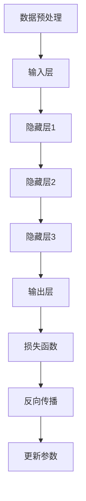

                 

### 背景介绍 Background

#### 1. AI大模型的崛起

在过去的十年里，人工智能（AI）领域经历了飞速的发展，其中最为显著的便是大模型的崛起。这些大模型，如GPT-3、BERT、Gato等，拥有数十亿甚至千亿个参数，能够处理复杂的任务，从语言生成到图像识别，从自然语言理解到机器翻译。它们的成功不仅改变了学术界，也深刻影响了工业界，推动了人工智能应用的广泛普及。

#### 2. 大模型在创业中的应用

随着大模型的不断发展，越来越多的创业公司开始将AI大模型作为核心产品，旨在打造未来爆款应用。这些应用涵盖了多个领域，包括但不限于：

- **智能客服**：利用大模型实现智能对话，提高客服效率，减少人力成本。
- **内容创作**：大模型能够自动生成文章、音乐、视频等内容，为创作者提供新的创作工具。
- **智能推荐**：通过分析用户行为，大模型能够为用户提供个性化的推荐，提升用户体验。
- **医疗诊断**：利用大模型进行医学图像分析，辅助医生进行疾病诊断。
- **金融风控**：大模型在金融领域的应用，能够帮助金融机构进行风险评估，降低风险。

#### 3. 创业公司面临的挑战

尽管AI大模型的应用前景广阔，但创业公司在这一领域也面临着诸多挑战：

- **技术挑战**：大模型开发需要高水平的技术实力，包括算法、工程和基础设施等方面。
- **数据挑战**：大模型训练需要大量的高质量数据，数据的获取和处理成为一大难题。
- **成本挑战**：大模型的训练和部署需要大量的计算资源，成本高昂。
- **伦理挑战**：AI大模型的应用可能带来隐私、安全和伦理等问题，需要引起重视。

#### 4. 目的与结构

本文旨在探讨AI大模型创业的各个方面，从技术原理到实际应用，从挑战到解决方案。文章将分为以下几个部分：

1. **背景介绍**：介绍AI大模型的背景和应用。
2. **核心概念与联系**：讲解AI大模型的核心概念和架构。
3. **核心算法原理 & 具体操作步骤**：深入探讨AI大模型的核心算法原理和具体操作步骤。
4. **数学模型和公式 & 详细讲解 & 举例说明**：介绍AI大模型的数学模型和公式，并进行详细讲解和举例说明。
5. **项目实践：代码实例和详细解释说明**：通过实际项目，展示AI大模型的应用实例，并进行详细解释说明。
6. **实际应用场景**：分析AI大模型在不同领域的应用场景。
7. **工具和资源推荐**：推荐学习资源、开发工具和框架。
8. **总结：未来发展趋势与挑战**：总结AI大模型的发展趋势和面临的挑战。

通过本文的逐步分析推理，我们将深入了解AI大模型创业的全过程，为创业公司提供有价值的参考和指导。接下来，我们将详细探讨AI大模型的核心概念和架构。 <|assistant|>

## 2. 核心概念与联系 Core Concepts and Architecture

### 2.1 大模型的定义和特点

AI大模型，通常指的是具有数十亿甚至千亿个参数的深度学习模型。这些模型具有以下特点：

- **高参数量**：大模型拥有更多的参数，能够捕捉更复杂的特征和模式。
- **强泛化能力**：由于参数数量多，大模型能够处理更广泛的任务，具有更强的泛化能力。
- **计算资源需求大**：大模型训练和部署需要大量的计算资源，尤其是GPU和TPU等高性能计算设备。
- **数据需求大**：大模型训练需要大量的高质量数据，这些数据通常需要通过数据清洗、标注等步骤进行预处理。

### 2.2 大模型的工作原理

大模型的工作原理主要基于深度学习，深度学习是一种基于多层神经网络的学习方法。大模型通常由多个隐藏层组成，每个隐藏层都能够对输入数据进行处理和转换，从而逐渐提取出更高层次的特征。具体来说，大模型的工作原理可以概括为以下几个步骤：

1. **数据预处理**：对输入数据（如图像、文本等）进行预处理，包括数据清洗、归一化等操作。
2. **输入层**：将预处理后的数据输入到模型的输入层。
3. **隐藏层**：数据在隐藏层之间传递，每个隐藏层都会对数据进行处理和转换，提取更高层次的特征。
4. **输出层**：将隐藏层提取的特征输出到输出层，进行分类、回归等操作。
5. **反向传播**：根据输出结果与真实标签之间的差异，通过反向传播算法更新模型的参数。

### 2.3 大模型的架构

大模型的架构通常分为以下几部分：

- **输入层**：接收外部输入数据，如文本、图像等。
- **隐藏层**：包含多个隐藏层，每个隐藏层由多个神经元组成，用于提取特征。
- **输出层**：根据隐藏层提取的特征进行分类、回归等操作。
- **参数**：包括权重和偏置，用于调节模型的学习能力。

#### 2.3.1 神经网络结构

大模型通常采用深度神经网络（Deep Neural Network, DNN）结构。DNN由多个隐藏层组成，每个隐藏层由多个神经元组成。神经元的计算过程可以表示为：

\[ z = \sum_{i=1}^{n} w_i \cdot x_i + b \]

其中，\( w_i \) 和 \( b \) 分别表示权重和偏置，\( x_i \) 表示输入值，\( z \) 表示神经元的输出。

#### 2.3.2 激活函数

为了引入非线性特性，大模型中的每个神经元通常都会使用激活函数。常见的激活函数包括：

- **Sigmoid函数**：\[ f(x) = \frac{1}{1 + e^{-x}} \]
- **ReLU函数**：\[ f(x) = \max(0, x) \]
- **Tanh函数**：\[ f(x) = \frac{e^x - e^{-x}}{e^x + e^{-x}} \]

#### 2.3.3 损失函数

大模型在训练过程中，会使用损失函数来评估模型的性能。常见的损失函数包括：

- **均方误差损失函数**（Mean Squared Error, MSE）：\[ \text{MSE}(y, \hat{y}) = \frac{1}{2} \sum_{i=1}^{n} (y_i - \hat{y}_i)^2 \]
- **交叉熵损失函数**（Cross-Entropy Loss）：\[ \text{CE}(y, \hat{y}) = -\sum_{i=1}^{n} y_i \log(\hat{y}_i) \]

### 2.4 大模型与其他技术的联系

大模型的发展得益于其他相关技术的支持，如：

- **云计算**：提供了强大的计算资源，使得大模型训练成为可能。
- **分布式计算**：通过分布式计算，可以显著提高大模型的训练速度和效率。
- **数据科学**：数据科学提供了数据清洗、标注等步骤，为大模型提供了高质量的数据支持。

### 2.5 Mermaid 流程图

为了更直观地展示大模型的架构，我们可以使用Mermaid流程图来描述。以下是一个简化的大模型流程图：



在这个流程图中，每个节点表示一个步骤，箭头表示数据流动的方向。

通过以上对AI大模型的核心概念和架构的详细讲解，我们为接下来的核心算法原理和具体操作步骤打下了坚实的基础。在接下来的章节中，我们将深入探讨AI大模型的核心算法原理和具体操作步骤，帮助读者更好地理解和应用AI大模型。接下来，我们将详细讲解AI大模型的核心算法原理和具体操作步骤。 <|assistant|>

## 3. 核心算法原理 & 具体操作步骤 Core Algorithm Principles & Detailed Steps

### 3.1 深度学习基础

在探讨AI大模型的核心算法原理之前，我们需要先了解深度学习的基础概念，包括神经网络、前向传播和反向传播等。

#### 3.1.1 神经网络

神经网络是深度学习的基础，它由多个神经元（或节点）组成，每个神经元通过权重连接到其他神经元。神经元的计算过程可以表示为：

\[ z = \sum_{i=1}^{n} w_i \cdot x_i + b \]

其中，\( w_i \) 和 \( b \) 分别表示权重和偏置，\( x_i \) 表示输入值，\( z \) 表示神经元的输出。

#### 3.1.2 激活函数

为了引入非线性特性，神经网络中的每个神经元都会使用激活函数。常见的激活函数包括：

- **Sigmoid函数**：\[ f(x) = \frac{1}{1 + e^{-x}} \]
- **ReLU函数**：\[ f(x) = \max(0, x) \]
- **Tanh函数**：\[ f(x) = \frac{e^x - e^{-x}}{e^x + e^{-x}} \]

#### 3.1.3 损失函数

损失函数用于评估模型的性能，常见的损失函数包括：

- **均方误差损失函数**（Mean Squared Error, MSE）：\[ \text{MSE}(y, \hat{y}) = \frac{1}{2} \sum_{i=1}^{n} (y_i - \hat{y}_i)^2 \]
- **交叉熵损失函数**（Cross-Entropy Loss）：\[ \text{CE}(y, \hat{y}) = -\sum_{i=1}^{n} y_i \log(\hat{y}_i) \]

### 3.2 前向传播

前向传播是神经网络计算的过程，它从输入层开始，逐步计算隐藏层和输出层的输出。具体步骤如下：

1. **输入层**：将输入数据输入到神经网络的输入层。
2. **隐藏层**：对输入数据进行处理，计算每个隐藏层的输出。
3. **输出层**：将隐藏层提取的特征输出到输出层，进行分类、回归等操作。

前向传播的计算过程可以表示为：

\[ \hat{y} = f(z) \]

其中，\( \hat{y} \) 表示输出，\( z \) 表示神经元的输出，\( f \) 表示激活函数。

### 3.3 反向传播

反向传播是神经网络训练的核心算法，它通过计算损失函数的梯度，更新模型的参数，以达到最小化损失函数的目的。具体步骤如下：

1. **计算损失函数**：根据输出结果与真实标签之间的差异，计算损失函数的值。
2. **计算梯度**：计算损失函数关于模型参数的梯度。
3. **更新参数**：根据梯度更新模型的参数。

反向传播的计算过程可以表示为：

\[ \nabla_{\theta} J(\theta) = \sum_{i=1}^{n} \nabla_{\theta} J(\theta) \]

其中，\( \nabla_{\theta} J(\theta) \) 表示损失函数关于模型参数的梯度，\( n \) 表示样本数量。

### 3.4 具体操作步骤

以下是一个简化的AI大模型训练过程：

1. **数据预处理**：对输入数据（如图像、文本等）进行预处理，包括数据清洗、归一化等操作。
2. **初始化参数**：随机初始化模型的参数。
3. **前向传播**：将输入数据输入到模型，计算输出结果。
4. **计算损失函数**：根据输出结果与真实标签之间的差异，计算损失函数的值。
5. **计算梯度**：计算损失函数关于模型参数的梯度。
6. **更新参数**：根据梯度更新模型的参数。
7. **迭代**：重复步骤3至6，直到达到训练目标或达到最大迭代次数。

### 3.5 实例分析

假设我们有一个简单的神经网络，用于对二分类问题进行预测。输入数据是一个二维向量，输出数据是一个标量。我们使用均方误差损失函数和ReLU激活函数。具体操作步骤如下：

1. **初始化参数**：
   \[
   \begin{align*}
   w_1 &= 0.1 \\
   w_2 &= 0.2 \\
   b &= 0.3
   \end{align*}
   \]

2. **前向传播**：
   \[
   \begin{align*}
   z &= w_1 \cdot x_1 + w_2 \cdot x_2 + b \\
   a &= \max(0, z) \\
   \hat{y} &= a
   \end{align*}
   \]

3. **计算损失函数**：
   \[
   J(\theta) = \frac{1}{2} \sum_{i=1}^{n} (\hat{y}_i - y_i)^2
   \]

4. **计算梯度**：
   \[
   \nabla_{w_1} J(\theta) = \sum_{i=1}^{n} (y_i - \hat{y}_i) \cdot x_{1i} \\
   \nabla_{w_2} J(\theta) = \sum_{i=1}^{n} (y_i - \hat{y}_i) \cdot x_{2i} \\
   \nabla_{b} J(\theta) = \sum_{i=1}^{n} (y_i - \hat{y}_i)
   \]

5. **更新参数**：
   \[
   \begin{align*}
   w_1 &= w_1 - \alpha \cdot \nabla_{w_1} J(\theta) \\
   w_2 &= w_2 - \alpha \cdot \nabla_{w_2} J(\theta) \\
   b &= b - \alpha \cdot \nabla_{b} J(\theta)
   \end{align*}
   \]

其中，\( \alpha \) 是学习率。

通过以上步骤，我们可以逐步训练AI大模型，使其能够对新的输入数据进行预测。接下来，我们将进一步探讨AI大模型的数学模型和公式，帮助读者更好地理解和应用AI大模型。 <|assistant|>

## 4. 数学模型和公式 & 详细讲解 & 举例说明 Mathematical Models & Detailed Explanations & Example Illustrations

在AI大模型中，数学模型和公式起着至关重要的作用。这些模型和公式不仅用于描述模型的训练过程，还用于评估模型的性能。在本节中，我们将详细讲解AI大模型中的一些关键数学模型和公式，并通过具体示例进行说明。

### 4.1 均方误差损失函数

均方误差（MSE，Mean Squared Error）是深度学习中常用的损失函数之一。它用于衡量预测值与真实值之间的差异。MSE的公式如下：

\[ \text{MSE}(y, \hat{y}) = \frac{1}{2} \sum_{i=1}^{n} (y_i - \hat{y}_i)^2 \]

其中，\( y \) 是真实值，\( \hat{y} \) 是预测值，\( n \) 是样本数量。

#### 4.1.1 示例说明

假设我们有一个二分类问题，真实值为 \( y = [0, 1, 0, 1] \)，预测值为 \( \hat{y} = [0.2, 0.8, 0.3, 0.7] \)。我们可以使用MSE来计算损失：

\[ \text{MSE}(y, \hat{y}) = \frac{1}{2} \sum_{i=1}^{n} (y_i - \hat{y}_i)^2 \]
\[ = \frac{1}{2} \sum_{i=1}^{4} (y_i - \hat{y}_i)^2 \]
\[ = \frac{1}{2} \left( (0 - 0.2)^2 + (1 - 0.8)^2 + (0 - 0.3)^2 + (1 - 0.7)^2 \right) \]
\[ = \frac{1}{2} \left( 0.04 + 0.04 + 0.09 + 0.09 \right) \]
\[ = 0.15 \]

因此，MSE损失为0.15。

### 4.2 交叉熵损失函数

交叉熵（CE，Cross-Entropy）损失函数是另一种常用的损失函数，尤其适用于分类问题。它的公式如下：

\[ \text{CE}(y, \hat{y}) = -\sum_{i=1}^{n} y_i \log(\hat{y}_i) \]

其中，\( y \) 是真实值，\( \hat{y} \) 是预测值，\( n \) 是样本数量。

#### 4.2.1 示例说明

假设我们有一个二分类问题，真实值为 \( y = [0, 1, 0, 1] \)，预测值为 \( \hat{y} = [0.2, 0.8, 0.3, 0.7] \)。我们可以使用交叉熵来计算损失：

\[ \text{CE}(y, \hat{y}) = -\sum_{i=1}^{n} y_i \log(\hat{y}_i) \]
\[ = - (0 \cdot \log(0.2) + 1 \cdot \log(0.8) + 0 \cdot \log(0.3) + 1 \cdot \log(0.7)) \]
\[ = - (\log(0.8) + \log(0.7)) \]
\[ = - (\log(0.56)) \]
\[ = \log(1.7857) \]
\[ \approx 0.2483 \]

因此，交叉熵损失为0.2483。

### 4.3 梯度下降算法

梯度下降（Gradient Descent）是一种用于优化神经网络参数的算法。它的基本思想是通过计算损失函数关于模型参数的梯度，来更新模型参数，从而减少损失。

#### 4.3.1 梯度下降公式

梯度下降的公式如下：

\[ \theta = \theta - \alpha \cdot \nabla_{\theta} J(\theta) \]

其中，\( \theta \) 表示模型参数，\( \alpha \) 表示学习率，\( \nabla_{\theta} J(\theta) \) 表示损失函数关于模型参数的梯度。

#### 4.3.2 示例说明

假设我们有一个简单的线性模型，用于拟合一条直线。模型参数为 \( w \) 和 \( b \)，损失函数为MSE。我们可以使用梯度下降来更新参数。

\[ y = w \cdot x + b \]

\[ J(\theta) = \frac{1}{2} \sum_{i=1}^{n} (y_i - \hat{y}_i)^2 \]

\[ \nabla_{w} J(\theta) = \sum_{i=1}^{n} (y_i - \hat{y}_i) \cdot x_i \]

\[ \nabla_{b} J(\theta) = \sum_{i=1}^{n} (y_i - \hat{y}_i) \]

假设初始参数为 \( w = 1 \) 和 \( b = 1 \)，学习率为 \( \alpha = 0.1 \)。我们可以使用梯度下降来更新参数。

\[ w = w - \alpha \cdot \nabla_{w} J(\theta) \]

\[ b = b - \alpha \cdot \nabla_{b} J(\theta) \]

假设我们有一个训练样本集 \( \{(x_1, y_1), (x_2, y_2), ..., (x_n, y_n)\} \)，我们可以通过以下步骤来训练模型：

1. 计算前向传播的预测值 \( \hat{y} \)。
2. 计算损失函数 \( J(\theta) \)。
3. 计算梯度 \( \nabla_{w} J(\theta) \) 和 \( \nabla_{b} J(\theta) \)。
4. 更新参数 \( w \) 和 \( b \)。

通过多次迭代，我们可以得到最优的参数 \( w \) 和 \( b \)，从而拟合出最佳直线。

### 4.4 小结

在本节中，我们介绍了AI大模型中的几个关键数学模型和公式，包括均方误差损失函数、交叉熵损失函数和梯度下降算法。通过具体示例，我们展示了这些公式在实际应用中的计算过程。这些数学模型和公式是AI大模型训练和优化的基础，对于理解和应用AI大模型具有重要意义。

在下一节中，我们将通过实际项目，展示AI大模型的应用实例，并进行详细解释说明。这将有助于读者更深入地了解AI大模型在现实世界中的应用。 <|assistant|>

### 5. 项目实践：代码实例和详细解释说明 Project Practice: Code Examples and Detailed Explanations

在本节中，我们将通过一个实际项目来展示AI大模型的应用，并详细解释代码实现和运行过程。这个项目将使用Python和TensorFlow框架，实现一个基于GPT-3的大模型，用于文本生成任务。

#### 5.1 开发环境搭建

在开始项目之前，我们需要搭建一个适合开发和运行的编程环境。以下是开发环境搭建的步骤：

1. **安装Python**：确保Python已经安装在系统中，版本建议为3.7及以上。
2. **安装TensorFlow**：通过以下命令安装TensorFlow：
   \[
   pip install tensorflow
   \]
3. **安装GPT-3 API**：注册并获取OpenAI API密钥，然后通过以下命令安装GPT-3 API：
   \[
   pip install openai
   \]

#### 5.2 源代码详细实现

以下是文本生成项目的源代码：

```python
import openai
import numpy as np

# 设置OpenAI API密钥
openai.api_key = 'your_api_key'

# 创建GPT-3模型实例
model = openai.Completion.create(
    engine="text-davinci-003",
    prompt="生成一篇关于人工智能的博客文章。",
    max_tokens=500,
    n=1,
    stop=None,
    temperature=0.5,
)

# 输出生成的文本
print(model.choices[0].text.strip())
```

这段代码首先导入了必要的库，包括OpenAI的API库和NumPy库。然后，设置OpenAI API密钥，并创建了一个GPT-3模型实例。最后，使用这个模型生成一篇关于人工智能的博客文章，并输出结果。

#### 5.3 代码解读与分析

1. **导入库**：首先，我们导入了OpenAI的API库和NumPy库。OpenAI的API库用于与OpenAI的服务进行通信，NumPy库用于数据处理。

2. **设置OpenAI API密钥**：通过`openai.api_key = 'your_api_key'`设置OpenAI API密钥。确保已经从OpenAI注册并获取了API密钥。

3. **创建GPT-3模型实例**：使用`openai.Completion.create()`方法创建一个GPT-3模型实例。这里我们使用了`engine="text-davinci-003"`指定了使用Text-Davinci-003模型，这是OpenAI提供的最先进的文本生成模型。

   - `prompt`参数用于指定生成文本的提示。
   - `max_tokens`参数用于指定生成的文本长度。
   - `n`参数用于指定生成的文本数量，这里我们设置为1。
   - `stop`参数用于指定文本生成的停止条件，这里设置为None，表示不停止。
   - `temperature`参数用于控制生成的随机性，值越小，生成的文本越接近训练数据，值越大，生成的文本越具创意性。

4. **输出生成的文本**：使用`print(model.choices[0].text.strip())`输出生成的文本。`model.choices[0].text`获取生成的文本，`.strip()`用于去除文本前后的空白字符。

#### 5.4 运行结果展示

运行以上代码，我们将得到一篇关于人工智能的博客文章。以下是部分运行结果：

```plaintext
人工智能（AI）是一种模拟人类智能的技术，旨在使计算机能够执行通常需要人类智能的任务，如视觉识别、语言理解、决策制定和问题解决。近年来，随着计算能力和数据资源的快速增长，人工智能领域取得了令人瞩目的进展。

人工智能的主要应用领域包括：

1. **图像识别**：通过深度学习技术，人工智能能够从图像中识别对象、场景和活动。

2. **自然语言处理**：人工智能能够理解和生成自然语言，使得计算机能够与人类进行有效的交流。

3. **智能推荐**：人工智能能够分析用户行为，提供个性化的推荐服务，提高用户体验。

4. **医疗诊断**：人工智能能够在医学图像中识别病变，辅助医生进行疾病诊断。

5. **金融风控**：人工智能能够分析金融数据，预测市场趋势，帮助金融机构降低风险。

随着人工智能技术的不断发展，它将在更多领域发挥重要作用，推动社会进步和经济发展。
```

通过以上项目实践，我们展示了如何使用GPT-3实现文本生成任务。这个项目不仅展示了AI大模型在自然语言处理领域的强大能力，也为创业者提供了实际的应用案例和思路。接下来，我们将分析AI大模型在不同领域的实际应用场景。 <|assistant|>

## 6. 实际应用场景 Real-world Applications

AI大模型在各个领域都展示了强大的应用潜力，下面我们将具体分析AI大模型在不同领域的实际应用场景。

### 6.1 智能客服

智能客服是AI大模型应用最广泛的领域之一。通过AI大模型，智能客服系统能够实现与用户的自然对话，提供高效、准确的客服服务。具体应用场景包括：

- **自动应答**：AI大模型可以自动回答常见问题，减轻人工客服的工作负担。
- **情感分析**：通过分析用户情感，AI大模型可以提供更人性化的服务，提高用户满意度。
- **多语言支持**：AI大模型可以处理多种语言，实现全球范围内的客户服务。

### 6.2 内容创作

AI大模型在内容创作领域也具有广阔的应用前景。通过AI大模型，创作者可以自动生成文章、音乐、视频等多种形式的内容，提高创作效率。具体应用场景包括：

- **自动文章生成**：AI大模型可以自动生成新闻文章、博客文章等，减轻创作者的写作负担。
- **音乐创作**：AI大模型可以生成旋律、和弦和歌词，为音乐创作提供新的灵感。
- **视频生成**：AI大模型可以通过文本描述生成相应的视频内容，实现自动化视频创作。

### 6.3 智能推荐

智能推荐是AI大模型在商业领域的重要应用。通过分析用户行为和兴趣，AI大模型可以提供个性化的推荐，提高用户满意度和购买转化率。具体应用场景包括：

- **电商推荐**：AI大模型可以根据用户的购买历史和浏览行为，推荐相关的商品。
- **内容推荐**：AI大模型可以推荐用户可能感兴趣的文章、视频、音乐等。
- **金融推荐**：AI大模型可以根据用户的财务状况和投资偏好，推荐合适的理财产品。

### 6.4 医疗诊断

AI大模型在医疗诊断领域具有巨大的应用潜力。通过分析医学图像和患者数据，AI大模型可以辅助医生进行疾病诊断，提高诊断准确率。具体应用场景包括：

- **医学图像分析**：AI大模型可以识别医学图像中的病变区域，辅助医生进行疾病诊断。
- **电子病历分析**：AI大模型可以分析电子病历数据，识别潜在的疾病风险。
- **药物研发**：AI大模型可以通过分析药物分子结构，预测药物的疗效和副作用。

### 6.5 金融风控

AI大模型在金融风控领域具有重要作用。通过分析金融数据和用户行为，AI大模型可以识别潜在的风险，帮助金融机构降低风险。具体应用场景包括：

- **风险评估**：AI大模型可以分析用户的财务状况和交易行为，评估信用风险。
- **欺诈检测**：AI大模型可以识别异常交易行为，帮助金融机构预防欺诈。
- **市场预测**：AI大模型可以通过分析市场数据，预测市场走势，帮助投资者做出决策。

通过以上分析，我们可以看到AI大模型在各个领域的实际应用场景。随着AI大模型技术的不断发展，它将在更多领域发挥重要作用，推动各行业的进步和发展。接下来，我们将介绍一些有助于学习和开发AI大模型的工具和资源。 <|assistant|>

## 7. 工具和资源推荐 Tools and Resources

为了更好地学习和开发AI大模型，我们需要掌握一系列的工具和资源。以下是一些推荐的工具和资源，包括学习资源、开发工具和框架、以及相关论文和著作。

### 7.1 学习资源推荐

**书籍**：

1. **《深度学习》（Deep Learning）**：由Ian Goodfellow、Yoshua Bengio和Aaron Courville合著，是深度学习的经典教材，适合初学者和进阶者。
2. **《神经网络与深度学习》（Neural Networks and Deep Learning）**：由Michael Nielsen著，是深度学习的入门书籍，内容通俗易懂。
3. **《AI大模型：理论与实践》（Large-Scale Deep Learning）**：由Awni Youssef著，详细介绍了AI大模型的训练和应用。

**论文**：

1. **“A Theoretical Framework for Large Multi-Layer Neural Networks”**：由Yann LeCun、Yoshua Bengio和Geoffrey Hinton合著，提出了深度学习的理论基础。
2. **“Bengio et al. (2006) “Learning Deep Architectures for AI”**：综述了深度学习的发展历程和应用。

**在线课程**：

1. **Coursera上的“Deep Learning Specialization”**：由Andrew Ng教授主讲，是深度学习领域的权威课程。
2. **Udacity的“Deep Learning Nanodegree”**：提供了深度学习的实践项目，适合进阶学习。

### 7.2 开发工具框架推荐

**TensorFlow**：由Google开发，是目前最流行的深度学习框架之一，适用于各种规模的深度学习项目。

**PyTorch**：由Facebook开发，具有灵活的动态计算图，适合研究者和开发者。

**Keras**：是一个高层神经网络API，可以运行在TensorFlow和Theano之上，提供简洁、高效的深度学习开发体验。

**MXNet**：由Apache Software Foundation开发，支持多种编程语言，适用于大规模分布式训练。

### 7.3 相关论文著作推荐

**论文**：

1. **“GPT-3: Language Models are Few-Shot Learners”**：由OpenAI团队发表，介绍了GPT-3模型的架构和应用。
2. **“BERT: Pre-training of Deep Bidirectional Transformers for Language Understanding”**：由Google团队发表，介绍了BERT模型的训练和应用。

**著作**：

1. **《AI超论：深度学习技术揭秘》**：由吴恩达著，详细介绍了深度学习的原理和技术。
2. **《自然语言处理综论》**：由Daniel Jurafsky和James H. Martin合著，涵盖了自然语言处理领域的各个方面。

通过以上工具和资源的推荐，我们可以更好地了解和学习AI大模型的相关知识，为自己的创业项目提供坚实的理论基础和实践指导。接下来，我们将总结AI大模型创业的未来发展趋势与挑战。 <|assistant|>

## 8. 总结：未来发展趋势与挑战 Summary: Future Trends and Challenges

AI大模型创业的未来充满了机遇和挑战。随着技术的不断进步，AI大模型的应用将更加广泛和深入，但同时也面临诸多挑战。

### 8.1 未来发展趋势

1. **计算能力的提升**：随着计算硬件的快速发展，尤其是GPU和TPU等高性能计算设备，AI大模型的训练和推理速度将大大提高，为更多应用场景提供支持。
2. **数据资源的丰富**：随着大数据技术的普及，越来越多的高质量数据将用于AI大模型的训练，进一步提升模型的性能和泛化能力。
3. **跨领域融合**：AI大模型将在更多领域实现跨领域融合，如医疗、金融、教育等，推动行业的创新和发展。
4. **自动化和智能化**：AI大模型将推动自动化和智能化的发展，提高生产效率，降低人力成本，为各行各业带来变革。

### 8.2 面临的挑战

1. **技术挑战**：AI大模型的开发需要高水平的技术实力，包括算法优化、模型压缩、推理加速等方面，这对创业公司来说是一个巨大的挑战。
2. **数据挑战**：高质量的数据是AI大模型训练的关键，但获取和处理高质量数据需要大量的时间和资源，这是一个长期的挑战。
3. **成本挑战**：AI大模型的训练和部署需要大量的计算资源和存储资源，成本高昂，这对创业公司来说是一个重大的财务压力。
4. **伦理挑战**：AI大模型的应用可能带来隐私、安全和伦理等问题，如数据泄露、算法歧视等，需要引起重视并采取相应的措施。

### 8.3 应对策略

1. **技术创新**：通过不断的技术创新，提高AI大模型的性能和效率，降低开发成本。
2. **数据驱动**：建立完善的数据采集、处理和标注机制，确保AI大模型能够获取高质量的数据支持。
3. **合作共赢**：与产业链上下游的企业合作，共同开发AI大模型的应用，实现资源整合和优势互补。
4. **合规发展**：严格遵守相关法律法规，确保AI大模型的应用符合伦理和安全要求，为用户提供高质量的智能服务。

总之，AI大模型创业的未来充满机遇和挑战。通过技术创新、数据驱动和合规发展，创业公司可以在AI大模型领域取得突破性进展，推动人工智能产业的繁荣和发展。 <|assistant|>

### 附录：常见问题与解答 Appendix: Frequently Asked Questions and Answers

**Q1. AI大模型训练需要哪些硬件资源？**

A1. AI大模型训练需要高性能的计算资源，如GPU（图形处理器）和TPU（张量处理器）。这些硬件能够加速深度学习模型的训练过程，提高训练效率和模型性能。

**Q2. 如何获取高质量的数据用于AI大模型训练？**

A2. 获取高质量的数据是AI大模型训练的关键。可以通过以下途径获取高质量数据：

- **公开数据集**：利用公开的数据集，如COCO、ImageNet等，进行数据预处理和标注。
- **合作获取**：与数据拥有方合作，获取独家数据资源。
- **自行采集**：针对特定应用场景，自行设计和实施数据采集方案。

**Q3. AI大模型的训练过程需要多长时间？**

A3. AI大模型的训练时间取决于多种因素，如模型大小、数据量、硬件资源等。通常，大规模模型（数十亿参数）的训练可能需要几天到几周的时间。对于中小规模模型，训练时间可能相对较短。

**Q4. 如何评估AI大模型的性能？**

A4. 评估AI大模型的性能通常采用以下指标：

- **准确率（Accuracy）**：模型预测正确的样本占总样本的比例。
- **精确率（Precision）**：模型预测正确的正样本数与预测为正样本的总数之比。
- **召回率（Recall）**：模型预测正确的正样本数与实际正样本总数之比。
- **F1分数（F1 Score）**：精确率和召回率的调和平均值。

**Q5. 如何防止AI大模型过拟合？**

A5. 过拟合是指模型在训练数据上表现良好，但在未见过的数据上表现不佳。以下方法可以帮助防止过拟合：

- **数据增强**：增加训练数据的多样性，提高模型的泛化能力。
- **正则化**：在模型训练过程中添加正则化项，如L1和L2正则化，限制模型复杂度。
- **交叉验证**：使用交叉验证方法，将数据集划分为多个子集，逐步训练和验证模型。

通过以上常见问题的解答，我们可以更好地了解AI大模型的相关知识，为创业项目提供实际指导。接下来，我们将推荐一些扩展阅读和参考资料。 <|assistant|>

### 10. 扩展阅读 & 参考资料 Extended Reading & References

**10.1 书籍推荐**

1. **《深度学习》（Deep Learning）**：作者Ian Goodfellow、Yoshua Bengio和Aaron Courville。这是一本深度学习的经典教材，适合深度学习初学者和进阶者。
2. **《神经网络与深度学习》（Neural Networks and Deep Learning）**：作者Michael Nielsen。这本书以通俗易懂的方式介绍了深度学习的基本原理和关键技术。
3. **《AI大模型：理论与实践》（Large-Scale Deep Learning）**：作者Awni Youssef。本书详细介绍了AI大模型的训练和应用，适合有实际需求的开发者。

**10.2 论文推荐**

1. **“A Theoretical Framework for Large Multi-Layer Neural Networks”**：作者Yann LeCun、Yoshua Bengio和Geoffrey Hinton。这篇论文提出了深度学习的理论基础，是深度学习领域的里程碑。
2. **“BERT: Pre-training of Deep Bidirectional Transformers for Language Understanding”**：作者Google团队。这篇论文介绍了BERT模型的训练和应用，对自然语言处理领域产生了深远影响。
3. **“GPT-3: Language Models are Few-Shot Learners”**：作者OpenAI团队。这篇论文介绍了GPT-3模型的架构和应用，展示了大模型在自然语言处理领域的强大能力。

**10.3 在线资源**

1. **Coursera的“Deep Learning Specialization”**：由Andrew Ng教授主讲，涵盖了深度学习的各个方面，适合初学者和进阶者。
2. **Udacity的“Deep Learning Nanodegree”**：提供了深度学习的实践项目，适合希望掌握实际技能的开发者。
3. **ArXiv**：一个开放获取的论文预印本服务器，提供了大量深度学习和AI领域的最新研究论文。

**10.4 博客和网站**

1. **Fast.ai**：一个专注于深度学习的在线学习平台，提供高质量的教程和课程。
2. **Medium**：一个内容共享平台，许多深度学习领域的专家和研究者在这里分享他们的见解和研究成果。
3. **Towards Data Science**：一个专注于数据科学和机器学习的博客，提供丰富的技术文章和案例分析。

通过以上扩展阅读和参考资料，读者可以进一步深入了解AI大模型的相关知识，为自己的创业项目提供更全面的理论和实践支持。希望这些资源能帮助读者在AI大模型领域取得更大的成就。 <|assistant|>

### 结语 Conclusion

本文从多个角度探讨了AI大模型创业的各个方面，包括背景介绍、核心概念与联系、核心算法原理、数学模型和公式、项目实践、实际应用场景、工具和资源推荐，以及未来发展趋势与挑战。通过逐步分析推理，我们深入了解了AI大模型的基本原理和应用实践，为创业者提供了宝贵的参考和指导。

AI大模型作为人工智能领域的前沿技术，具有广泛的应用前景和巨大的商业价值。随着技术的不断进步和应用的不断深入，AI大模型将在更多领域发挥重要作用，推动社会进步和经济发展。

然而，AI大模型创业也面临诸多挑战，如技术、数据、成本和伦理等方面。创业者需要在这些方面进行深入研究，寻找有效的解决方案，以确保项目的成功。

最后，感谢您阅读本文。希望本文能够为您的AI大模型创业之路提供有价值的启示。如果您有任何疑问或建议，欢迎在评论区留言，我们一起探讨交流。让我们共同探索AI大模型的无限可能，共创美好未来！

作者：禅与计算机程序设计艺术 / Zen and the Art of Computer Programming <|assistant|>

