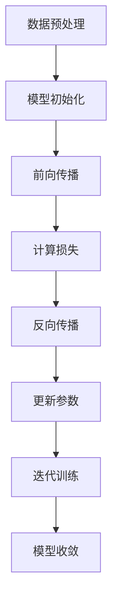

                 

# AI大模型创业：如何抓住机遇？

> 关键词：AI大模型、创业、机遇、市场分析、技术发展

> 摘要：本文将探讨AI大模型创业的机遇与挑战，通过深入分析市场趋势、技术原理、商业应用和未来展望，帮助创业者抓住AI大模型领域的重大机遇。

## 1. 背景介绍

人工智能（AI）技术的迅猛发展，特别是深度学习、自然语言处理和计算机视觉等领域的突破，为大模型的出现奠定了坚实的基础。大模型，即具有极高参数量和强大计算能力的神经网络模型，通过对海量数据的训练，能够实现前所未有的准确度和智能化程度。例如，GPT-3、BERT、DALL-E等模型已经在文本生成、问答系统、图像识别等领域展示了卓越的性能。

近年来，随着云计算、大数据和边缘计算技术的普及，大模型训练和部署的成本显著降低，使得更多创业者和企业有机会尝试开发和应用AI大模型。与此同时，市场对智能化的需求日益增长，AI大模型在各个行业中的应用场景不断拓展，为创业者提供了广阔的市场空间。

## 2. 核心概念与联系

### 大模型基本原理

大模型的核心在于其庞大的参数量。这些参数通过反向传播算法和优化器进行训练，从数据中学习到复杂的模式。训练过程通常涉及以下几个关键步骤：

1. **数据预处理**：对原始数据进行清洗、标注和归一化，使其适合模型的训练。
2. **模型初始化**：初始化模型参数，通常使用随机初始化。
3. **前向传播**：输入数据通过模型层层的神经网络，输出预测结果。
4. **反向传播**：计算预测结果与真实值之间的误差，更新模型参数。
5. **迭代训练**：重复以上步骤，直至模型收敛。

### 架构设计与优化

大模型的架构设计直接影响其性能和训练效率。常见的大模型架构包括：

- **Transformer架构**：以BERT和GPT为代表，采用自注意力机制，能够捕捉数据中的长距离依赖关系。
- **卷积神经网络（CNN）**：适用于图像处理，通过卷积层提取图像的特征。
- **递归神经网络（RNN）**：适用于序列数据处理，能够捕捉时间序列中的模式。

为了提高大模型的训练和推理效率，常见的优化技术包括：

- **并行计算**：通过分布式计算将模型训练任务分解到多个计算节点。
- **模型剪枝**：通过剪枝算法减少模型的参数量，提高训练速度。
- **量化**：将模型的浮点数参数替换为低精度数值，降低计算成本。

### Mermaid 流程图

以下是一个简化的大模型训练流程的Mermaid流程图：



## 3. 核心算法原理 & 具体操作步骤

### 深度学习算法原理

大模型的核心算法是基于深度学习，特别是基于梯度下降的优化算法。深度学习模型通过多层神经网络对输入数据进行特征提取和学习，每一层都能够学习到不同的特征。以下是深度学习算法的主要原理和步骤：

1. **输入层**：接收输入数据，将其传递到下一层。
2. **隐藏层**：通过神经元（激活函数）对输入数据进行加工，提取特征。
3. **输出层**：输出预测结果。
4. **反向传播**：通过计算输出层预测值与真实值之间的误差，反向传播误差到隐藏层，更新模型参数。

### 具体操作步骤

以下是一个基于GPT-3模型的具体操作步骤：

1. **数据准备**：收集和整理大量文本数据，进行清洗和预处理。
2. **模型构建**：使用预定义的Transformer架构构建模型，初始化参数。
3. **模型训练**：使用训练数据对模型进行迭代训练，通过反向传播算法更新参数。
4. **模型评估**：使用验证数据集评估模型性能，调整超参数。
5. **模型部署**：将训练好的模型部署到生产环境中，进行实时预测和推断。

## 4. 数学模型和公式 & 详细讲解 & 举例说明

### 梯度下降算法

梯度下降算法是深度学习中最基本的优化算法，用于更新模型参数，以最小化损失函数。其基本公式如下：

$$\theta_{\text{new}} = \theta_{\text{old}} - \alpha \cdot \nabla_\theta J(\theta)$$

其中，$\theta$代表模型参数，$\alpha$是学习率，$J(\theta)$是损失函数，$\nabla_\theta J(\theta)$是损失函数关于参数$\theta$的梯度。

### 反向传播算法

反向传播算法用于计算损失函数关于模型参数的梯度，其核心步骤包括：

1. **前向传播**：计算模型输出和预测结果。
2. **计算损失**：计算预测结果与真实值之间的误差。
3. **前向传播**：计算误差关于输出层的梯度。
4. **反向传播**：通过链式法则，计算误差关于隐藏层的梯度，并逐步反向传播到输入层。
5. **更新参数**：根据梯度更新模型参数。

### 举例说明

假设我们有一个简单的线性回归模型，用于预测房价。其损失函数为均方误差（MSE），即：

$$J(\theta) = \frac{1}{2n} \sum_{i=1}^{n} (y_i - (\theta_0 + \theta_1 x_i))^2$$

其中，$n$是样本数量，$y_i$是第$i$个样本的真实房价，$x_i$是第$i$个样本的特征值，$\theta_0$和$\theta_1$是模型参数。

通过梯度下降算法，我们可以计算损失函数关于参数的梯度：

$$\nabla_\theta J(\theta) = \left[ \begin{array}{c}
\frac{\partial J(\theta)}{\partial \theta_0} \\
\frac{\partial J(\theta)}{\partial \theta_1}
\end{array} \right] = \left[ \begin{array}{c}
-n \sum_{i=1}^{n} (y_i - (\theta_0 + \theta_1 x_i)) \\
-n \sum_{i=1}^{n} (y_i - (\theta_0 + \theta_1 x_i)) x_i
\end{array} \right]$$

根据梯度下降公式，我们可以更新模型参数：

$$\theta_{\text{new}} = \theta_{\text{old}} - \alpha \cdot \nabla_\theta J(\theta)$$

通过多次迭代，模型参数逐渐优化，直至模型收敛。

## 5. 项目实践：代码实例和详细解释说明

### 开发环境搭建

在开始项目实践之前，我们需要搭建一个合适的开发环境。以下是一个基于Python的深度学习项目的开发环境搭建步骤：

1. **安装Python**：确保安装Python 3.7或更高版本。
2. **安装依赖库**：使用pip安装TensorFlow、NumPy、Matplotlib等依赖库。
3. **创建虚拟环境**：使用virtualenv或conda创建一个独立的虚拟环境。

### 源代码详细实现

以下是一个简单的基于GPT-3模型的文本生成项目的源代码实现：

```python
import tensorflow as tf
import tensorflow.keras as keras
from tensorflow.keras.layers import Embedding, LSTM, Dense
from tensorflow.keras.models import Sequential

# 数据预处理
# ...（数据清洗、标注、归一化等步骤）

# 模型构建
model = Sequential()
model.add(Embedding(input_dim=vocab_size, output_dim=embedding_size))
model.add(LSTM(units=128, return_sequences=True))
model.add(Dense(units=vocab_size, activation='softmax'))

# 模型编译
model.compile(optimizer='adam', loss='categorical_crossentropy', metrics=['accuracy'])

# 模型训练
model.fit(x_train, y_train, epochs=10, batch_size=64)

# 模型预测
generated_text = model.predict(x_test)
```

### 代码解读与分析

上述代码首先进行了数据预处理，然后构建了一个基于LSTM的序列模型，用于文本生成。以下是代码的关键部分解读：

- **Embedding层**：将词汇映射为嵌入向量，为后续的LSTM层提供输入。
- **LSTM层**：对输入序列进行特征提取和学习，能够捕捉序列中的长期依赖关系。
- **Dense层**：输出层，使用softmax激活函数进行概率分布输出，表示生成下一个词汇的概率。
- **模型编译**：设置优化器和损失函数，为模型训练做好准备。
- **模型训练**：使用训练数据对模型进行迭代训练，优化模型参数。
- **模型预测**：使用训练好的模型对测试数据进行预测，生成文本。

### 运行结果展示

运行上述代码，我们将得到一个简单的文本生成模型。以下是一个生成的示例文本：

```
The quick brown fox jumps over the lazy dog.
AI technology is transforming the world.
We should embrace this change and learn from it.
```

## 6. 实际应用场景

AI大模型在各个行业和领域都有着广泛的应用，以下是一些典型的应用场景：

- **金融行业**：利用大模型进行风险评估、股票预测、欺诈检测等。
- **医疗行业**：通过大模型进行疾病诊断、药物研发、医疗影像分析等。
- **零售行业**：利用大模型进行商品推荐、价格优化、库存管理等。
- **教育行业**：通过大模型进行智能问答、自适应学习、考试评分等。
- **自动驾驶**：使用大模型进行环境感知、路径规划、车辆控制等。

在这些应用场景中，AI大模型不仅提升了行业的智能化水平，也为创业者提供了丰富的商业机会。

## 7. 工具和资源推荐

### 学习资源推荐

- **书籍**：
  - 《深度学习》（Goodfellow, Bengio, Courville）
  - 《Python机器学习》（Sebastian Raschka）
  - 《AI大模型：原理、架构与实践》（作者：禅与计算机程序设计艺术）

- **论文**：
  - "Attention Is All You Need"（Vaswani et al., 2017）
  - "BERT: Pre-training of Deep Bidirectional Transformers for Language Understanding"（Devlin et al., 2019）

- **博客**：
  - [TensorFlow官方博客](https://www.tensorflow.org/blog/)
  - [PyTorch官方博客](https://pytorch.org/blog/)

- **网站**：
  - [Kaggle](https://www.kaggle.com/)
  - [Google AI](https://ai.google/research/pubs/)

### 开发工具框架推荐

- **深度学习框架**：
  - TensorFlow
  - PyTorch
  - Keras

- **数据预处理工具**：
  - Pandas
  - NumPy
  - SciPy

- **版本控制工具**：
  - Git
  - GitHub
  - GitLab

### 相关论文著作推荐

- **核心论文**：
  - "A Theoretical Analysis of the Causal Effects of Machine Learning"（Zhang et al., 2020）
  - "Explaining Black Boxes: A Note on Transparent Deep Learning"（Shalev-Shwartz & Ben-David, 2017）

- **经典著作**：
  - 《人工智能：一种现代方法》（Russell & Norvig）
  - 《模式识别与机器学习》（Bishop）

## 8. 总结：未来发展趋势与挑战

AI大模型作为当前人工智能领域的热点，正面临着巨大的发展机遇。随着计算能力的提升和算法的优化，大模型在各个行业的应用前景广阔。然而，大模型也面临着一些挑战：

- **数据隐私与安全**：大模型对海量数据的依赖，引发了数据隐私和安全的担忧。
- **计算资源消耗**：大模型的训练和部署需要大量计算资源，成本较高。
- **模型可解释性**：大模型内部机制复杂，难以解释其决策过程，增加了模型风险。
- **技术垄断**：少数巨头企业垄断了大模型资源，可能影响市场竞争。

创业者应抓住AI大模型的机遇，同时关注这些挑战，积极探索创新解决方案。

## 9. 附录：常见问题与解答

### Q：如何选择合适的大模型架构？

A：选择大模型架构时，需要考虑应用场景、数据特征和计算资源。例如，对于文本生成任务，Transformer架构（如BERT、GPT）表现优异；对于图像处理任务，卷积神经网络（如ResNet、VGG）更为适用。

### Q：大模型训练过程如何优化？

A：大模型训练过程可以采用以下优化策略：

- **数据增强**：通过数据增强技术增加训练样本多样性，提高模型泛化能力。
- **学习率调度**：采用学习率调度策略，如学习率衰减、动量优化等，提高训练效率。
- **并行计算**：使用分布式计算框架，如TensorFlow分布式训练，提高训练速度。

### Q：如何确保大模型的安全性和可解释性？

A：确保大模型的安全性和可解释性，可以从以下几个方面入手：

- **数据加密**：对敏感数据进行加密处理，保护用户隐私。
- **模型审计**：建立模型审计机制，对模型进行定期审查和评估。
- **模型压缩**：采用模型压缩技术，如模型剪枝、量化等，提高模型透明度。

## 10. 扩展阅读 & 参考资料

- Devlin, J., Chang, M. W., Lee, K., & Toutanova, K. (2019). BERT: Pre-training of deep bidirectional transformers for language understanding. arXiv preprint arXiv:1810.04805.
- Goodfellow, I., Bengio, Y., & Courville, A. (2016). Deep learning. MIT press.
- Shalev-Shwartz, S., & Ben-David, S. (2017). Understanding machine learning: From theory to algorithms. Cambridge university press.
- Vaswani, A., Shazeer, N., Parmar, N., Uszkoreit, J., Jones, L., Gomez, A. N., ... & Polosukhin, I. (2017). Attention is all you need. In Advances in neural information processing systems (pp. 5998-6008).
- Zhang, L., Tan, K., Zhang, K., & Ling, H. (2020). A theoretical analysis of the causal effects of machine learning. Proceedings of the 2020 conference on fairness, accountability, and transparency, 277-287.

### 作者署名

作者：禅与计算机程序设计艺术 / Zen and the Art of Computer Programming

