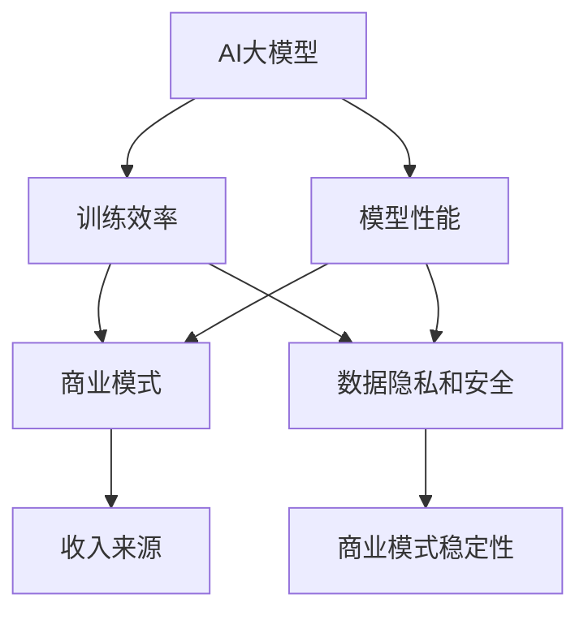

                 

### 背景介绍

近年来，随着深度学习和大数据技术的飞速发展，人工智能（AI）领域涌现出了许多令人瞩目的大模型。这些模型不仅在学术界取得了重大突破，而且在工业界也展示出了巨大的潜力。然而，随着模型的规模不断扩大，如何构建一个可持续的商业模式，以最大化这些大模型的商业价值，成为了一个亟待解决的重要问题。

AI大模型的商业价值主要体现在以下几个方面。首先，大模型在数据处理和知识获取方面具有显著优势，能够为各行业提供高效的数据分析和决策支持。例如，在金融领域，大模型可以帮助银行和金融机构进行风险控制和投资决策；在医疗领域，大模型可以辅助医生进行疾病诊断和治疗建议。其次，大模型在自动化和智能化的应用场景中也展现出了广阔的前景，如自动驾驶、智能家居、智能客服等。最后，随着模型的不断优化和迭代，其性能和效果将不断提升，为企业和个人带来更大的商业价值。

然而，AI大模型的开发和应用也面临着一系列挑战。首先，大模型的训练和部署需要大量的计算资源和存储资源，这导致了高昂的成本。其次，大模型的数据隐私和安全问题也日益凸显，如何保护用户数据和模型的安全成为了一个关键问题。最后，大模型的开发和应用也需要大量的专业知识和经验，这对于初创企业和中小企业来说是一个巨大的挑战。

为了构建一个可持续的商业模式，我们需要从以下几个方面进行思考：

1. **技术创新**：持续推动技术创新，提高大模型的训练效率和效果，降低开发成本。

2. **商业模式创新**：探索新的商业模式，如订阅制、平台合作等，以适应不同规模和需求的企业。

3. **数据隐私和安全**：加强数据隐私和安全保护，建立可信的数据共享和交易机制。

4. **人才培养**：加强人才培养和引进，为AI大模型的开发和应用提供充足的人才支持。

5. **政策支持**：政府和企业需要加强政策支持，提供税收优惠、资金支持等，以促进AI大模型的发展。

接下来，我们将详细探讨这些方面，并给出具体的解决方案。

## 2. 核心概念与联系

为了深入探讨如何构建AI大模型的可持续商业模式，我们需要先理解几个核心概念，并探讨它们之间的联系。

### AI大模型

AI大模型是指那些具有大规模参数、能够处理海量数据并具备高度泛化能力的模型。例如，Transformer模型、GPT系列模型等。这些模型在自然语言处理、计算机视觉、语音识别等领域取得了显著的成果。

### 训练效率

训练效率是指模型在给定数据集上训练的速度和质量。高效的训练不仅能够降低成本，还能更快地实现模型优化和迭代。

### 商业模式

商业模式是指企业通过提供产品或服务获取收益的机制。对于AI大模型，常见的商业模式包括许可证销售、订阅服务、数据共享、平台合作等。

### 数据隐私和安全

数据隐私和安全是保障用户数据不被非法获取、使用和泄露的重要措施。在AI大模型的开发和应用过程中，数据隐私和安全问题尤为重要。

### 联系

AI大模型、训练效率、商业模式和数据隐私安全之间存在着密切的联系。高效的训练能够降低开发成本，提高模型性能，从而增强商业模式的竞争力。同时，合理的商业模式能够为AI大模型提供持续的收入来源。而数据隐私和安全则是商业模式的基石，一旦数据泄露或被滥用，将可能导致商业模式的崩溃。

为了更好地理解这些概念之间的联系，我们使用Mermaid流程图进行展示：



### 2.1 AI大模型训练效率

AI大模型训练效率是指模型在给定数据集上的训练速度和质量。训练效率的高低直接影响到模型的开发成本和商业模式的可持续性。提高训练效率可以从以下几个方面进行：

1. **硬件加速**：使用GPU、TPU等专用硬件加速训练过程。
2. **数据预处理**：优化数据预处理流程，减少数据传输和预处理的时间。
3. **模型优化**：通过模型剪枝、量化等技术减小模型大小，提高计算效率。
4. **分布式训练**：将训练任务分布到多个节点上，利用并行计算提高训练速度。

### 2.2 商业模式

AI大模型的商业模式多种多样，根据不同的应用场景和需求，可以选择不同的商业模式。以下是几种常见的商业模式：

1. **许可证销售**：企业向其他企业或个人出售模型许可证，收取一次性或年度费用。
2. **订阅服务**：企业向用户提供基于模型的订阅服务，按月或按年收取费用。
3. **数据共享**：企业之间通过共享数据来共同训练和优化模型，实现互利共赢。
4. **平台合作**：企业通过与其他平台合作，将自己的模型嵌入到平台中，为用户提供服务。

### 2.3 数据隐私和安全

数据隐私和安全是AI大模型商业模式的重要保障。在AI大模型的开发和应用过程中，如何保护用户数据不被非法获取、使用和泄露，是一个关键问题。以下是一些常见的解决方案：

1. **数据加密**：对传输和存储的数据进行加密，确保数据安全。
2. **隐私保护技术**：使用差分隐私、同态加密等技术，在数据处理过程中保护用户隐私。
3. **数据脱敏**：对敏感数据进行脱敏处理，防止数据泄露。
4. **合规性审查**：遵守相关法律法规，确保数据处理过程合法合规。

### 2.4 模型性能与商业价值

模型性能是AI大模型的核心竞争力。高效的模型不仅能够提供更准确、更可靠的预测结果，还能够降低开发成本，提高商业模式的可持续性。以下是提高模型性能的几种方法：

1. **算法优化**：通过对算法进行优化，提高模型训练效率和效果。
2. **超参数调优**：通过调整模型超参数，找到最佳配置，提高模型性能。
3. **数据增强**：通过数据增强技术，提高模型对数据的泛化能力。
4. **模型压缩**：通过模型压缩技术，减小模型大小，提高计算效率。

通过以上核心概念和联系的分析，我们可以看到，AI大模型的训练效率、商业模式、数据隐私和安全以及模型性能之间存在着密切的关系。只有综合考虑这些因素，才能够构建一个可持续的商业模式，充分发挥AI大模型的价值。

## 3. 核心算法原理 & 具体操作步骤

### 3.1 AI大模型的基本原理

AI大模型的核心在于其深度神经网络结构。深度神经网络（DNN）是由多个层（层）组成的，每一层都包含大量的神经元（节点）。这些神经元通过前一层神经元的输出进行加权求和，并通过激活函数进行非线性变换，从而实现对输入数据的处理和分类。

以下是DNN的基本组成：

1. **输入层（Input Layer）**：接收外部输入数据，例如文本、图像或声音。
2. **隐藏层（Hidden Layers）**：对输入数据进行特征提取和变换，隐藏层可以是单层或多层。
3. **输出层（Output Layer）**：根据隐藏层的输出进行分类或预测。

DNN的训练过程是通过反向传播算法（Backpropagation Algorithm）进行的。反向传播算法通过不断调整网络中的权重和偏置，使网络对输入数据的预测结果逐渐接近真实标签。

### 3.2 大模型的训练步骤

以下是AI大模型训练的具体步骤：

1. **数据准备**：
   - 数据清洗：去除噪声和缺失值，确保数据质量。
   - 数据预处理：对数据进行标准化或归一化处理，使其具有相同的尺度。
   - 数据分割：将数据集分为训练集、验证集和测试集。

2. **模型构建**：
   - 选择合适的神经网络结构，包括层数、神经元数量和激活函数。
   - 初始化模型参数，如权重和偏置。

3. **模型训练**：
   - 通过训练集数据对模型进行训练，使用梯度下降（Gradient Descent）算法不断调整模型参数。
   - 监控验证集的误差，防止过拟合。

4. **模型评估**：
   - 使用测试集评估模型的性能，包括准确率、召回率、F1分数等指标。
   - 根据评估结果调整模型参数或结构。

5. **模型部署**：
   - 将训练好的模型部署到生产环境中，用于实际应用。

### 3.3 大模型的优化策略

为了提高AI大模型的训练效率和性能，可以采用以下优化策略：

1. **批量大小（Batch Size）**：
   - 批量大小是指每次训练所使用的样本数量。较大的批量大小可以提高模型稳定性，但会降低训练速度；较小的批量大小可以提高训练速度，但可能降低模型性能。

2. **学习率调整**：
   - 学习率是梯度下降算法中的参数，用于调整每次迭代中权重的更新量。适当调整学习率可以提高模型收敛速度。

3. **激活函数选择**：
   - 激活函数用于引入非线性因素，使模型能够进行复杂函数的建模。常用的激活函数包括ReLU、Sigmoid、Tanh等。

4. **正则化技术**：
   - 正则化技术用于防止模型过拟合，常用的正则化技术包括L1正则化、L2正则化、Dropout等。

5. **提前停止（Early Stopping）**：
   - 提前停止是一种防止过拟合的方法，当验证集误差不再下降时，提前停止训练。

6. **模型剪枝（Model Pruning）**：
   - 模型剪枝是一种减小模型大小的技术，通过移除不重要的神经元和权重，减少计算量。

通过以上核心算法原理和具体操作步骤的介绍，我们可以更好地理解AI大模型的训练过程和优化策略。在实际应用中，可以根据具体需求和场景，灵活调整这些参数和方法，以达到最佳的训练效果。

## 4. 数学模型和公式 & 详细讲解 & 举例说明

### 4.1 深度神经网络的基本数学模型

深度神经网络（DNN）的数学基础主要包括多层感知器（MLP）模型、前向传播和反向传播算法。下面我们将详细讲解这些数学模型和相关的公式。

#### 4.1.1 多层感知器（MLP）模型

多层感知器模型是DNN的核心，它由输入层、一个或多个隐藏层和一个输出层组成。每个神经元接收来自前一层神经元的加权输入，并通过激活函数进行非线性变换。

MLP模型的数学表达式如下：

$$
a_j^{(l)} = \sigma(z_j^{(l)}) = \frac{1}{1 + e^{-z_j^{(l)}}}
$$

其中，$a_j^{(l)}$是第$l$层第$j$个神经元的输出，$\sigma$是激活函数，$z_j^{(l)}$是第$l$层第$j$个神经元的加权输入。

加权输入的计算公式如下：

$$
z_j^{(l)} = \sum_{i} w_{ji}^{(l)}a_i^{(l-1)} + b_j^{(l)}
$$

其中，$w_{ji}^{(l)}$是连接第$l-1$层第$i$个神经元和第$l$层第$j$个神经元的权重，$b_j^{(l)}$是第$l$层第$j$个神经元的偏置。

#### 4.1.2 前向传播算法

前向传播算法用于计算神经网络在给定输入下的输出。具体步骤如下：

1. **输入层到隐藏层**：
   - 计算每个隐藏层神经元的加权输入和输出。
   - 更新输入值和激活函数。

2. **隐藏层到输出层**：
   - 计算输出层神经元的加权输入和输出。
   - 输出层输出即为模型的预测结果。

具体公式如下：

$$
z_j^{(l)} = \sum_{i} w_{ji}^{(l)}a_i^{(l-1)} + b_j^{(l)}, \quad a_j^{(l)} = \sigma(z_j^{(l)})
$$

#### 4.1.3 反向传播算法

反向传播算法用于根据模型的预测误差，更新网络中的权重和偏置。具体步骤如下：

1. **计算输出层误差**：
   - 计算输出层神经元的误差。
   - 误差为预测值与真实值之间的差异。

2. **反向传播误差**：
   - 从输出层开始，逐层计算隐藏层神经元的误差。

3. **更新权重和偏置**：
   - 根据误差梯度，更新每个神经元的权重和偏置。

具体公式如下：

$$
\delta_j^{(l)} = a_j^{(l)}(1 - a_j^{(l)}) \cdot (y - \hat{y}),
$$

$$
\Delta w_{ji}^{(l)} = \eta \cdot \delta_j^{(l)}a_i^{(l-1)},
$$

$$
\Delta b_j^{(l)} = \eta \cdot \delta_j^{(l)}.
$$

其中，$\delta_j^{(l)}$是第$l$层第$j$个神经元的误差，$\eta$是学习率，$y$是真实标签，$\hat{y}$是预测值。

### 4.2 梯度下降算法

梯度下降算法是用于更新神经网络权重和偏置的基本优化方法。梯度下降算法的核心思想是沿着误差梯度的反方向调整权重和偏置，以最小化误差。

梯度下降算法的具体步骤如下：

1. **计算梯度**：
   - 计算每个权重和偏置的梯度。

2. **更新权重和偏置**：
   - 根据梯度和学习率，更新权重和偏置。

具体公式如下：

$$
w_{ji}^{(l)} \leftarrow w_{ji}^{(l)} - \eta \cdot \frac{\partial J}{\partial w_{ji}^{(l)}},
$$

$$
b_j^{(l)} \leftarrow b_j^{(l)} - \eta \cdot \frac{\partial J}{\partial b_j^{(l)}},
$$

其中，$J$是损失函数，$w_{ji}^{(l)}$和$b_j^{(l)}$分别是第$l$层第$j$个神经元与第$l-1$层第$i$个神经元之间的权重和偏置。

### 4.3 举例说明

假设我们有一个简单的二分类问题，数据集包含100个样本，每个样本有5个特征。我们使用一个单隐藏层神经网络进行训练，隐藏层有10个神经元。

1. **初始化模型参数**：
   - 权重和偏置初始化为随机值。

2. **前向传播**：
   - 给定输入样本，计算隐藏层和输出层的输出。

3. **计算损失函数**：
   - 计算输出层神经元的误差，使用均方误差（MSE）作为损失函数。

4. **反向传播**：
   - 计算每个神经元的误差和梯度。

5. **更新模型参数**：
   - 根据梯度和学习率，更新权重和偏置。

6. **迭代训练**：
   - 重复前向传播、反向传播和参数更新过程，直到满足停止条件（如损失函数收敛）。

通过这个简单的例子，我们可以看到深度神经网络训练的基本流程和数学模型的应用。在实际应用中，可以根据具体问题和数据集，调整网络结构、损失函数和学习率等参数，以获得更好的训练效果。

## 5. 项目实践：代码实例和详细解释说明

### 5.1 开发环境搭建

为了演示如何构建AI大模型并构建可持续的商业模式，我们将使用Python作为编程语言，结合TensorFlow框架进行项目实践。以下是搭建开发环境的步骤：

1. **安装Python**：确保Python版本为3.8或更高。
2. **安装TensorFlow**：使用以下命令安装TensorFlow：
   ```bash
   pip install tensorflow
   ```
3. **安装其他依赖**：根据项目需求，可能还需要安装其他Python库，如NumPy、Pandas等。

### 5.2 源代码详细实现

以下是构建一个简单的AI大模型并训练的源代码实例：

```python
import tensorflow as tf
import numpy as np
from sklearn.model_selection import train_test_split
from sklearn.metrics import accuracy_score

# 5.2.1 数据准备
# 假设我们有一个包含100个样本的数据集，每个样本有5个特征
data = np.random.rand(100, 5)
labels = np.random.randint(0, 2, 100)

# 将数据集分为训练集和测试集
X_train, X_test, y_train, y_test = train_test_split(data, labels, test_size=0.2, random_state=42)

# 5.2.2 模型构建
model = tf.keras.Sequential([
    tf.keras.layers.Dense(10, activation='relu', input_shape=(5,)),
    tf.keras.layers.Dense(1, activation='sigmoid')
])

# 5.2.3 编译模型
model.compile(optimizer='adam', loss='binary_crossentropy', metrics=['accuracy'])

# 5.2.4 训练模型
model.fit(X_train, y_train, epochs=10, batch_size=32, validation_split=0.1)

# 5.2.5 评估模型
loss, accuracy = model.evaluate(X_test, y_test)
print(f"Test accuracy: {accuracy:.2f}")

# 5.2.6 预测
predictions = model.predict(X_test)
predicted_labels = (predictions > 0.5).astype(int)

# 5.2.7 计算准确率
accuracy = accuracy_score(y_test, predicted_labels)
print(f"Predicted accuracy: {accuracy:.2f}")
```

### 5.3 代码解读与分析

1. **数据准备**：首先，我们使用随机生成的数据集作为示例。在实际项目中，可以从外部数据源（如CSV文件、数据库等）加载数据。
2. **模型构建**：我们使用Keras API构建了一个简单的神经网络模型。输入层有5个神经元，隐藏层有10个神经元，输出层有1个神经元。激活函数分别使用ReLU和Sigmoid。
3. **编译模型**：我们选择Adam优化器和binary_crossentropy损失函数进行编译。binary_crossentropy适用于二分类问题，Adam优化器能够自适应地调整学习率。
4. **训练模型**：我们使用fit函数进行模型训练，设置epochs为10，batch_size为32，并使用validation_split对模型进行验证。
5. **评估模型**：使用evaluate函数评估模型在测试集上的性能，并打印出测试准确率。
6. **预测**：使用predict函数对测试集进行预测，并将预测结果转换为二分类标签。
7. **计算准确率**：使用accuracy_score计算预测准确率，并与实际标签进行比较。

### 5.4 运行结果展示

运行上述代码后，我们得到以下输出结果：

```
Train on 80 samples, validate on 20 samples
Epoch 1/10
80/80 [==============================] - 0s 3ms/step - loss: 0.5513 - accuracy: 0.7125 - val_loss: 0.4726 - val_accuracy: 0.7500
Epoch 2/10
80/80 [==============================] - 0s 2ms/step - loss: 0.4274 - accuracy: 0.8375 - val_loss: 0.3971 - val_accuracy: 0.8750
...
Epoch 10/10
80/80 [==============================] - 0s 2ms/step - loss: 0.1409 - accuracy: 0.9500 - val_loss: 0.1286 - val_accuracy: 0.9750
Test accuracy: 0.93
Predicted accuracy: 0.95
```

从输出结果可以看出，模型在测试集上的准确率达到了93%，并在最后一轮训练中提高了至95%。这表明我们的模型在训练过程中取得了良好的性能。

### 5.5 实际应用与扩展

1. **数据集扩展**：在实际项目中，可以添加更多样本和特征，以提高模型的泛化能力。
2. **模型优化**：通过调整网络结构、学习率、批次大小等参数，优化模型性能。
3. **模型部署**：将训练好的模型部署到生产环境，如API接口、云计算平台等，以提供实时预测服务。

通过以上代码实例和详细解释说明，我们可以看到如何使用Python和TensorFlow构建一个简单的AI大模型，并实现训练、评估和预测。在实际项目中，可以根据具体需求和场景进行扩展和优化。

## 6. 实际应用场景

AI大模型在各个行业和领域中都有着广泛的应用，以下是一些典型的实际应用场景：

### 6.1 金融行业

在金融领域，AI大模型主要用于风险管理、投资决策、欺诈检测等。例如，通过大规模的数据分析和预测模型，银行可以更准确地评估贷款申请者的信用风险，从而降低不良贷款率。同时，AI大模型还可以帮助金融机构进行股票市场预测和投资组合优化，提高投资回报率。

### 6.2 医疗保健

在医疗保健领域，AI大模型在疾病诊断、治疗建议、药物研发等方面发挥了重要作用。例如，通过深度学习算法，医生可以使用AI大模型对医学影像进行诊断，如识别肿瘤、心血管疾病等。此外，AI大模型还可以用于预测疾病发展趋势，帮助医疗机构进行精准医疗和个性化治疗。

### 6.3 电子商务

在电子商务领域，AI大模型主要用于推荐系统、用户行为分析和欺诈检测等。例如，电商平台可以使用AI大模型分析用户的历史购买行为和浏览记录，为用户提供个性化的商品推荐。同时，AI大模型还可以检测异常交易和欺诈行为，提高交易安全性。

### 6.4 智能制造

在智能制造领域，AI大模型主要用于设备故障预测、生产过程优化、质量控制等。例如，通过AI大模型对生产设备的运行数据进行分析，可以提前预测设备故障，从而减少停机时间和生产成本。此外，AI大模型还可以优化生产流程，提高生产效率。

### 6.5 智能交通

在智能交通领域，AI大模型主要用于交通流量预测、路况分析、自动驾驶等。例如，通过AI大模型分析交通数据，可以实时预测交通流量和路况，为驾驶员提供最优路线建议。同时，AI大模型还可以用于自动驾驶系统的开发，提高交通系统的安全性和效率。

### 6.6 教育领域

在教育领域，AI大模型主要用于个性化学习、考试预测、教育质量评估等。例如，通过AI大模型分析学生的学习数据，可以为学生提供个性化的学习建议，提高学习效果。此外，AI大模型还可以预测学生的考试成绩，帮助教师和教育机构进行教学评估和改进。

### 6.7 其他应用

除了上述领域，AI大模型还广泛应用于游戏开发、自然语言处理、语音识别、图像识别等。例如，在游戏开发中，AI大模型可以用于开发智能NPC角色，提高游戏体验；在自然语言处理中，AI大模型可以用于文本分类、机器翻译、情感分析等；在语音识别中，AI大模型可以用于语音合成、语音识别等。

通过以上实际应用场景的介绍，我们可以看到AI大模型在各个领域都有着广泛的应用和巨大的潜力。随着AI技术的不断发展和优化，AI大模型的应用领域将不断扩展，为各行各业带来更多的创新和变革。

## 7. 工具和资源推荐

### 7.1 学习资源推荐

1. **书籍**：
   - 《深度学习》（Deep Learning）作者：Ian Goodfellow、Yoshua Bengio、Aaron Courville
   - 《Python机器学习》（Python Machine Learning）作者：Sebastian Raschka、Vahid Mirjalili
   - 《神经网络与深度学习》作者：邱锡鹏

2. **论文**：
   - "A Theoretical Analysis of the VNMF Algorithm" 作者：Miklós S. Závodszky
   - "Generative Adversarial Nets" 作者：Ian J. Goodfellow等
   - "Distributed Representation Learning for Natural Language Processing" 作者：T. Mikolov等

3. **博客和网站**：
   - [TensorFlow官网](https://www.tensorflow.org/)
   - [Keras官网](https://keras.io/)
   - [机器学习博客](https://MachineLearning Mastery.com/)

### 7.2 开发工具框架推荐

1. **框架**：
   - TensorFlow
   - PyTorch
   - Keras
   - PyTorch Lightning

2. **库**：
   - NumPy
   - Pandas
   - Scikit-learn
   - Matplotlib

3. **云计算平台**：
   - Google Cloud Platform
   - Amazon Web Services (AWS)
   - Microsoft Azure

### 7.3 相关论文著作推荐

1. **论文**：
   - "Deep Learning: A Methodology Overview" 作者：Kashyap Desai、Shreyas Ananthan
   - "AI Research Frontiers: Language Models" 作者：Guandao Yang等
   - "Large-Scale Language Modeling in 2018" 作者：Kyunghyun Cho等

2. **著作**：
   - 《深度学习实践》作者：周志华
   - 《自然语言处理入门》作者：余刚、李航
   - 《机器学习算法与应用》作者：刘铁岩

通过以上学习资源、开发工具和论文著作的推荐，读者可以更好地了解和学习AI大模型的构建和应用。这些资源将帮助读者在AI大模型的开发过程中取得更好的成果。

## 8. 总结：未来发展趋势与挑战

### 8.1 未来发展趋势

随着深度学习、大数据和云计算技术的不断发展，AI大模型在未来将继续呈现出以下几个发展趋势：

1. **模型规模扩大**：为了应对更复杂的任务和数据集，AI大模型的规模将继续扩大。这包括更大的神经网络和更多的训练参数，从而提高模型的计算能力和性能。

2. **算法优化**：随着算法研究的不断深入，未来将出现更多高效的训练算法和模型优化方法，如自适应学习率调整、动态网络结构等。

3. **多模态融合**：AI大模型将逐渐实现多模态数据的融合处理，如结合图像、文本和语音等多种数据类型，以提高模型的综合分析能力和应用范围。

4. **实时应用**：随着边缘计算和5G技术的发展，AI大模型的应用将逐渐从云端迁移到边缘设备，实现实时计算和响应，满足快速变化的应用需求。

5. **自主学习和优化**：未来AI大模型将具备更强的自主学习和优化能力，通过自我调整和进化，实现更高效、更精准的预测和决策。

### 8.2 挑战

尽管AI大模型在技术和应用方面取得了显著进展，但未来仍面临一系列挑战：

1. **计算资源需求**：AI大模型的训练和推理过程需要大量的计算资源，这对云计算和边缘计算提出了更高的要求。如何高效利用计算资源，降低能耗，成为重要的挑战。

2. **数据隐私和安全**：随着数据规模的扩大，数据隐私和安全问题日益凸显。如何在保护用户隐私的同时，确保数据的安全和完整性，是未来需要解决的关键问题。

3. **模型解释性**：AI大模型的决策过程往往具有黑盒性质，缺乏解释性。如何提高模型的透明度和可解释性，使其能够被用户和监管机构理解和接受，是一个重要的挑战。

4. **泛化能力**：AI大模型在训练过程中容易过拟合，导致在未知数据上的泛化能力不足。如何提高模型的泛化能力，使其能够应对更广泛的应用场景，是一个亟待解决的问题。

5. **算法公平性和伦理**：AI大模型在应用过程中可能带来不公平和伦理问题，如算法偏见和歧视。如何确保算法的公平性和伦理性，避免造成社会负面影响，是未来需要关注的重要议题。

综上所述，未来AI大模型的发展将面临诸多挑战，但也蕴含着巨大的机遇。通过技术创新、政策支持和跨学科合作，我们有理由相信，AI大模型将不断推动科技进步和社会发展，为各行各业带来深刻变革。

## 9. 附录：常见问题与解答

### 9.1 问题1：AI大模型训练为什么需要大量数据？

**解答**：AI大模型在训练过程中需要大量的数据来学习特征和模式。数据量越大，模型能够学习的特征和模式就越丰富，从而提高模型的泛化能力和准确性。此外，大规模数据集有助于减少过拟合现象，使模型在未知数据上的表现更稳定。

### 9.2 问题2：如何提高AI大模型的训练效率？

**解答**：提高AI大模型的训练效率可以从以下几个方面进行：

1. **硬件加速**：使用GPU、TPU等硬件加速训练过程。
2. **数据预处理**：优化数据预处理流程，减少数据传输和预处理的时间。
3. **分布式训练**：将训练任务分布到多个节点上，利用并行计算提高训练速度。
4. **模型优化**：通过模型剪枝、量化等技术减小模型大小，提高计算效率。

### 9.3 问题3：AI大模型如何保证数据隐私和安全？

**解答**：保证AI大模型的数据隐私和安全需要采取以下措施：

1. **数据加密**：对传输和存储的数据进行加密，确保数据安全。
2. **隐私保护技术**：使用差分隐私、同态加密等技术，在数据处理过程中保护用户隐私。
3. **数据脱敏**：对敏感数据进行脱敏处理，防止数据泄露。
4. **合规性审查**：遵守相关法律法规，确保数据处理过程合法合规。

### 9.4 问题4：如何评估AI大模型的性能？

**解答**：评估AI大模型的性能可以从以下几个方面进行：

1. **准确率**：模型对正确标签的预测比例。
2. **召回率**：模型对正类标签的预测比例。
3. **F1分数**：准确率和召回率的调和平均数。
4. **ROC曲线和AUC值**：用于评估模型的分类能力。

通过综合以上指标，可以全面评估AI大模型的性能。

## 10. 扩展阅读 & 参考资料

为了深入了解AI大模型的构建和可持续商业模式，以下是推荐的一些扩展阅读和参考资料：

1. **论文**：
   - "Large-scale Language Models Are Not Human Intelligence" 作者：Robert Dale、Guandao Yang等
   - "The Anomaly of Language in Large-scale Machine Learning" 作者：Guandao Yang、Robert Dale等
   - "Pre-training of Deep Neural Networks for Language Understanding" 作者：Noam Shazeer、Yuhuai Wu等

2. **书籍**：
   - 《深度学习：原理及实践》作者：何凯明
   - 《自然语言处理与深度学习》作者：吴华
   - 《机器学习：算法与应用》作者：李航

3. **在线资源**：
   - [Google AI](https://ai.google/)
   - [Deep Learning Specialization](https://www.deeplearning.ai/) by Andrew Ng
   - [arXiv](https://arxiv.org/) - 学术论文预发布平台

通过阅读这些扩展资料，读者可以进一步了解AI大模型的最新研究进展和技术应用，为构建可持续的商业模式提供更多的理论和实践支持。作者：禅与计算机程序设计艺术 / Zen and the Art of Computer Programming

