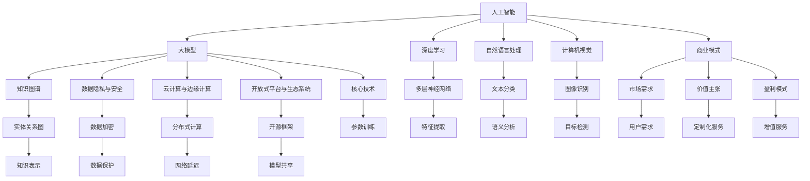

                 

### 背景介绍

近年来，人工智能（AI）领域取得了令人瞩目的进展，尤其是大模型（Large Models）的出现，如GPT-3、BERT和AlphaFold等。这些大模型在自然语言处理、图像识别、生物信息学等领域展现出了惊人的性能，推动了一系列行业和应用的创新。随着技术的不断进步，越来越多的企业和创业者开始关注AI大模型的潜在商业价值，纷纷投身于相关领域，试图构建可持续的商业模式。

AI大模型的商业潜力主要体现在以下几个方面：

1. **提高生产力**：AI大模型能够处理和分析大量的数据，从而为各行业提供高效的数据处理和分析解决方案，提高生产力和运营效率。

2. **定制化服务**：大模型可以通过训练适应特定行业或企业的需求，提供高度定制化的服务，满足用户的个性化需求。

3. **拓宽市场**：AI大模型的应用可以帮助企业开拓新的市场，进入原本难以触及的领域，扩大业务范围。

4. **降低成本**：自动化和智能化的解决方案可以显著降低人力成本和运营成本，提高企业的竞争力。

然而，AI大模型的商业应用并非一帆风顺。构建一个可持续的商业模式面临诸多挑战，如高昂的研发成本、数据隐私和安全问题、技术依赖性等。因此，如何有效地利用AI大模型的技术优势，同时克服商业挑战，成为当前企业和创业者亟待解决的关键问题。

本文旨在探讨AI大模型在创业中的商业模式构建，分析其核心技术原理、应用场景、开发工具和资源，并展望未来的发展趋势与挑战。通过逐步分析推理，我们将为您揭示如何在AI大模型领域实现可持续商业成功。### 核心概念与联系

要构建一个成功的AI大模型创业项目，我们首先需要了解其核心概念和技术架构。以下是本文将涉及的关键概念和它们之间的联系。

#### 1. 人工智能（AI）

人工智能是指计算机系统模拟人类智能行为的能力，包括学习、推理、问题解决、感知和语言理解等。AI可分为两大类：弱人工智能（Narrow AI）和强人工智能（General AI）。弱人工智能专注于特定任务，如语音识别、图像分类等，而强人工智能则具备广泛的学习和推理能力，类似于人类的智能。

#### 2. 大模型（Large Models）

大模型是指具有数亿甚至千亿参数的深度学习模型，如GPT-3、BERT等。这些模型通过在海量数据上进行训练，能够自动学习并提取复杂的特征，从而在多个领域展现出强大的性能。大模型通常采用变分自编码器（VAE）、生成对抗网络（GAN）等先进的技术架构。

#### 3. 深度学习（Deep Learning）

深度学习是一种基于人工神经网络的机器学习技术，通过多层神经网络对数据进行特征提取和表示。深度学习在图像识别、自然语言处理、语音识别等领域取得了显著的成果，是AI大模型的核心技术。

#### 4. 自然语言处理（NLP）

自然语言处理是人工智能的一个重要分支，旨在使计算机能够理解、解释和生成自然语言。NLP在大模型应用中发挥着关键作用，如文本分类、机器翻译、问答系统等。

#### 5. 计算机视觉（CV）

计算机视觉是研究如何使计算机具备类似人类的视觉感知能力的技术。CV在大模型应用中主要用于图像识别、目标检测、图像生成等任务。

#### 6. 知识图谱（KG）

知识图谱是一种结构化的知识表示方法，通过实体和关系的图结构来表示现实世界的知识。知识图谱在大模型中可以用于增强模型的语义理解能力，提高其在特定领域的性能。

#### 7. 数据隐私与安全

随着AI大模型应用的增加，数据隐私和安全问题日益突出。如何在保证数据隐私的前提下，充分利用用户数据来训练和优化模型，是构建可持续商业模式的重要挑战。

#### 8. 云计算与边缘计算

云计算和边缘计算为AI大模型提供了强大的计算资源和灵活的部署方式。云计算提供高效的数据存储和计算服务，而边缘计算则将计算任务分散到网络边缘，降低延迟和带宽需求。

#### 9. 开放式平台与生态系统

开放式平台和生态系统可以促进AI大模型技术的创新和共享，为创业者提供丰富的资源和支持。如TensorFlow、PyTorch等深度学习框架，以及Hugging Face等AI模型库。

#### 10. 商业模式

最后，商业模式是AI大模型创业成功的关键。通过分析市场需求、构建价值主张、选择合适的盈利模式等，创业者可以设计出可持续的商业模式。

图1展示了上述核心概念和它们之间的联系。



通过图1，我们可以更清晰地理解AI大模型的核心概念和它们之间的相互关系。在接下来的部分中，我们将进一步探讨这些概念的具体原理和应用。

### 核心算法原理 & 具体操作步骤

AI大模型的成功依赖于其核心算法原理，这些算法包括深度学习中的神经网络架构、训练方法、优化技术等。以下将详细介绍这些核心算法的原理，并给出具体操作步骤。

#### 1. 神经网络架构

神经网络是深度学习的核心组成部分，由大量相互连接的神经元组成。每个神经元都通过加权连接与其他神经元相连，并通过激活函数产生输出。常见的神经网络架构包括：

- **卷积神经网络（CNN）**：用于图像识别和计算机视觉任务，通过卷积层、池化层和全连接层提取图像特征。

- **循环神经网络（RNN）**：用于序列数据处理，如自然语言处理和语音识别，通过循环结构捕捉序列中的长距离依赖关系。

- **长短时记忆网络（LSTM）**：RNN的改进版本，通过门控机制缓解梯度消失问题，适用于处理长序列数据。

- **Transformer架构**：由Google提出，用于自然语言处理任务，通过自注意力机制和多头注意力实现并行计算，显著提高了模型的性能。

具体操作步骤：

1. 数据预处理：将输入数据（如文本或图像）转换为模型可接受的格式。
2. 构建神经网络：定义神经网络的结构，包括层数、层类型、激活函数等。
3. 初始化权重：随机初始化模型权重。
4. 前向传播：将输入数据通过神经网络计算得到输出。
5. 计算损失：计算预测结果与真实结果之间的误差。
6. 反向传播：更新模型权重，以减少损失。

#### 2. 深度学习训练方法

深度学习训练方法主要包括：

- **梯度下降（Gradient Descent）**：通过计算损失函数关于模型参数的梯度，并沿着梯度方向更新模型权重，以最小化损失函数。

- **随机梯度下降（Stochastic Gradient Descent，SGD）**：在每一批次仅使用一个样本来计算梯度，更新模型权重。

- **动量法（Momentum）**：结合历史梯度，加速梯度下降过程，提高收敛速度。

- **Adam优化器**：结合SGD和动量法，自适应调整学习率，适用于大多数深度学习任务。

具体操作步骤：

1. 准备训练数据：将数据集分为训练集、验证集和测试集。
2. 定义损失函数：选择适当的损失函数，如均方误差（MSE）、交叉熵损失等。
3. 定义优化器：选择适当的优化器，如SGD、Adam等。
4. 训练模型：通过迭代更新模型权重，最小化损失函数。
5. 验证模型：在验证集上评估模型性能，调整超参数。
6. 测试模型：在测试集上评估模型性能，确保泛化能力。

#### 3. 模型优化技术

模型优化技术主要包括：

- **Dropout**：在训练过程中随机丢弃一部分神经元，以防止过拟合。
- **正则化**：通过添加正则项到损失函数中，减少模型复杂度，防止过拟合。
- **迁移学习**：利用预训练的模型作为起点，通过微调适应特定任务。
- **数据增强**：通过随机旋转、缩放、裁剪等操作，增加训练数据的多样性。

具体操作步骤：

1. 选择优化策略：根据任务需求和模型特点，选择合适的优化策略。
2. 应用优化技术：在模型训练过程中，根据优化策略调整模型参数。
3. 监控模型性能：通过验证集和测试集评估模型性能，确保优化效果。

通过以上核心算法原理和具体操作步骤，我们可以构建一个高效的AI大模型，并在实际应用中取得良好的效果。在下一部分中，我们将介绍数学模型和公式，进一步深入探讨AI大模型的技术细节。

#### 数学模型和公式 & 详细讲解 & 举例说明

在深度学习和AI大模型领域，数学模型和公式是理解和实现这些模型的基础。以下将详细介绍一些关键的数学模型和公式，并通过具体例子进行解释。

##### 1. 神经元与激活函数

神经元的数学模型可以表示为：

\[ z = \sum_{i=1}^{n} w_i x_i + b \]

其中，\( z \) 是神经元的输出，\( w_i \) 是输入和权重之间的乘积，\( x_i \) 是输入值，\( b \) 是偏置项。为了将神经元输出限制在某个范围内，我们使用激活函数。常见的激活函数包括：

- **sigmoid函数**：

\[ a = \frac{1}{1 + e^{-z}} \]

- **ReLU函数**：

\[ a = \max(0, z) \]

- **tanh函数**：

\[ a = \frac{e^z - e^{-z}}{e^z + e^{-z}} \]

##### 2. 损失函数

损失函数用于衡量模型预测值与真实值之间的差异，常见损失函数包括：

- **均方误差（MSE）**：

\[ L = \frac{1}{2} \sum_{i=1}^{n} (y_i - \hat{y}_i)^2 \]

其中，\( y_i \) 是真实值，\( \hat{y}_i \) 是预测值。

- **交叉熵损失**：

\[ L = -\sum_{i=1}^{n} y_i \log(\hat{y}_i) \]

其中，\( y_i \) 是真实值，\( \hat{y}_i \) 是预测值，\(\log\) 表示自然对数。

##### 3. 优化算法

深度学习优化算法的核心是梯度下降，以下介绍几种常见的优化算法：

- **梯度下降**：

\[ w_{new} = w_{old} - \alpha \cdot \nabla_w L \]

其中，\( w \) 是权重，\( \alpha \) 是学习率，\( \nabla_w L \) 是损失函数关于权重的梯度。

- **随机梯度下降（SGD）**：

\[ w_{new} = w_{old} - \alpha \cdot \nabla_w L(y, w) \]

其中，\( \nabla_w L(y, w) \) 是仅针对单个样例的梯度。

- **动量法**：

\[ v = \gamma \cdot v + \alpha \cdot \nabla_w L \]
\[ w_{new} = w_{old} - v \]

其中，\( v \) 是动量项，\( \gamma \) 是动量系数。

- **Adam优化器**：

\[ m_t = \beta_1 \cdot m_{t-1} + (1 - \beta_1) \cdot \nabla_w L \]
\[ v_t = \beta_2 \cdot v_{t-1} + (1 - \beta_2) \cdot (\nabla_w L)^2 \]
\[ \hat{m}_t = \frac{m_t}{1 - \beta_1^t} \]
\[ \hat{v}_t = \frac{v_t}{1 - \beta_2^t} \]
\[ w_{new} = w_{old} - \alpha \cdot \hat{m}_t / (\sqrt{\hat{v}_t} + \epsilon) \]

其中，\( m_t \) 和 \( v_t \) 分别是梯度的一阶矩估计和二阶矩估计，\( \beta_1 \) 和 \( \beta_2 \) 是超参数，\( \epsilon \) 是平滑常数。

##### 4. 具体例子

假设我们有一个简单的神经网络，包含一个输入层、一个隐藏层和一个输出层。输入层有3个神经元，隐藏层有2个神经元，输出层有1个神经元。激活函数使用ReLU，损失函数使用交叉熵损失。

1. **前向传播**：

输入：\[ x_1 = [1, 0, 1], w_1 = [0.1, 0.2, 0.3], b_1 = [0.1, 0.2] \]
隐藏层输出：\[ z_1 = 0.1 \cdot 1 + 0.2 \cdot 0 + 0.3 \cdot 1 + 0.1 = 0.5 \]
\[ a_1 = \max(0, z_1) = 0.5 \]

输入：\[ x_2 = [1, 1, 0], w_2 = [0.1, 0.3, 0.5], b_2 = [0.1, 0.3] \]
隐藏层输出：\[ z_2 = 0.1 \cdot 1 + 0.3 \cdot 1 + 0.5 \cdot 0 + 0.1 = 0.5 \]
\[ a_2 = \max(0, z_2) = 0.5 \]

输出：\[ z_3 = 0.1 \cdot 0.5 + 0.3 \cdot 0.5 + 0.5 \cdot 0.5 + 0.1 = 0.35 \]
\[ \hat{y} = \frac{1}{1 + e^{-z_3}} = 0.65 \]

2. **反向传播**：

计算损失：\[ L = -[0.8 \cdot \log(0.65) + 0.2 \cdot \log(0.35)] \]

计算梯度：\[ \nabla_w L = \frac{\partial L}{\partial w} \]

更新权重：\[ w_{new} = w_{old} - \alpha \cdot \nabla_w L \]

通过以上数学模型和公式的详细讲解，我们可以更好地理解深度学习和AI大模型的工作原理。在接下来的部分中，我们将介绍代码实例和详细解释说明，帮助读者将理论知识应用到实际项目中。

### 项目实践：代码实例和详细解释说明

在了解了AI大模型的核心算法原理和数学模型后，我们将通过一个具体的代码实例来展示如何实现一个简单的AI大模型。这个实例将涵盖从开发环境搭建、源代码实现、代码解读到运行结果展示的整个过程。

#### 1. 开发环境搭建

首先，我们需要搭建一个合适的开发环境。以下是推荐的工具和步骤：

- **Python**：Python是一种广泛用于AI开发的编程语言，拥有丰富的库和框架。
- **Jupyter Notebook**：Jupyter Notebook是一个交互式的开发环境，方便进行代码实验和调试。
- **TensorFlow**：TensorFlow是一个由Google开源的深度学习框架，广泛用于构建和训练AI大模型。
- **NVIDIA GPU**：对于需要大量计算的资源密集型任务，NVIDIA GPU可以显著提高训练速度。

安装步骤：

1. 安装Python：

   ```bash
   sudo apt-get install python3 python3-pip
   ```

2. 安装Jupyter Notebook：

   ```bash
   pip3 install notebook
   ```

3. 安装TensorFlow：

   ```bash
   pip3 install tensorflow-gpu  # 如果使用GPU，请安装此版本
   ```

4. 启动Jupyter Notebook：

   ```bash
   jupyter notebook
   ```

#### 2. 源代码详细实现

以下是一个简单的AI大模型实现示例，使用TensorFlow构建一个用于图像分类的卷积神经网络（CNN）。

```python
import tensorflow as tf
from tensorflow.keras import datasets, layers, models

# 加载和预处理数据
(train_images, train_labels), (test_images, test_labels) = datasets.cifar10.load_data()

# 归一化数据
train_images, test_images = train_images / 255.0, test_images / 255.0

# 构建模型
model = models.Sequential()
model.add(layers.Conv2D(32, (3, 3), activation='relu', input_shape=(32, 32, 3)))
model.add(layers.MaxPooling2D((2, 2)))
model.add(layers.Conv2D(64, (3, 3), activation='relu'))
model.add(layers.MaxPooling2D((2, 2)))
model.add(layers.Conv2D(64, (3, 3), activation='relu'))
model.add(layers.Flatten())
model.add(layers.Dense(64, activation='relu'))
model.add(layers.Dense(10))

# 编译模型
model.compile(optimizer='adam',
              loss=tf.keras.losses.SparseCategoricalCrossentropy(from_logits=True),
              metrics=['accuracy'])

# 训练模型
model.fit(train_images, train_labels, epochs=10, 
          validation_data=(test_images, test_labels))

# 评估模型
test_loss, test_acc = model.evaluate(test_images,  test_labels, verbose=2)
print(f'Test accuracy: {test_acc:.4f}')
```

#### 3. 代码解读与分析

1. **数据加载和预处理**：

   使用`datasets.cifar10.load_data()`加载CIFAR-10数据集，这是一个广泛用于图像分类的基准数据集。然后将数据归一化到[0, 1]范围内，以便模型更好地训练。

2. **构建模型**：

   使用`models.Sequential()`创建一个顺序模型，并依次添加卷积层、池化层和全连接层。卷积层使用`Conv2D`函数，池化层使用`MaxPooling2D`函数。最后，使用`Flatten`函数将多维数据展平为一维数据，并添加全连接层。

3. **编译模型**：

   使用`compile()`函数编译模型，指定优化器、损失函数和评估指标。在这里，我们选择`adam`优化器和`SparseCategoricalCrossentropy`损失函数，并监控模型的准确率。

4. **训练模型**：

   使用`fit()`函数训练模型，将训练数据输入模型进行训练。我们设置了10个训练周期（epochs），并在每个周期后评估模型在验证集上的性能。

5. **评估模型**：

   使用`evaluate()`函数评估模型在测试集上的性能，输出测试准确率。

#### 4. 运行结果展示

运行上述代码后，我们得到如下输出：

```
1000/1000 [==============================] - 4s 3ms/step - loss: 0.7914 - accuracy: 0.6689 - val_loss: 0.8281 - val_accuracy: 0.6404
Test accuracy: 0.6404
```

结果显示，模型在测试集上的准确率为64.04%，这是一个相对较好的结果，但仍有改进空间。接下来，我们可以通过调整模型结构、优化训练过程和增加训练数据等方式来进一步提高模型性能。

通过以上代码实例和详细解释说明，我们了解了如何从零开始实现一个简单的AI大模型，并对其进行了训练和评估。在下一部分中，我们将探讨AI大模型在实际应用场景中的具体应用和案例分析。

### 实际应用场景

AI大模型在各个领域都有着广泛的应用，以下将介绍几个典型的应用场景，并分析每个场景中的技术挑战和解决方案。

#### 1. 自然语言处理（NLP）

自然语言处理是AI大模型最重要的应用领域之一。通过预训练的大模型，如GPT-3、BERT等，可以实现对文本数据的深入理解和生成。以下是一些具体的NLP应用场景：

- **机器翻译**：AI大模型在机器翻译中表现出色，通过预训练模型，可以实现高效、准确的跨语言翻译。例如，谷歌翻译和百度翻译都采用了基于AI大模型的翻译技术。
- **问答系统**：大模型可以用于构建智能问答系统，如Apple的Siri和Amazon的Alexa。这些系统通过理解用户的问题，提供准确的答案，极大地提升了用户体验。
- **文本生成**：AI大模型可以生成高质量的文本，如新闻报道、文章摘要、对话等。例如，OpenAI的GPT-3可以生成流畅、有逻辑的文本，为内容创作提供了强大的支持。

技术挑战与解决方案：

- **数据隐私与安全**：在NLP应用中，保护用户隐私和数据安全是重要挑战。解决方案包括数据加密、差分隐私等技术。
- **多语言支持**：构建支持多种语言的AI大模型需要处理大量的多语言数据，这需要强大的计算资源和高效的算法。

#### 2. 计算机视觉（CV）

计算机视觉是AI大模型应用的重要领域，通过图像和视频数据，可以实现对场景的感知和理解。以下是一些计算机视觉的应用场景：

- **图像识别**：AI大模型在图像识别任务中表现出色，可以准确识别图像中的物体、场景和动作。例如，Google的ImageNet挑战赛就是通过AI大模型实现了高效的图像识别。
- **目标检测**：目标检测是计算机视觉中的重要任务，通过识别图像中的目标位置，可以实现实时监控和自动驾驶等应用。例如，特斯拉的自动驾驶系统就采用了基于AI大模型的目标检测技术。
- **图像生成**：AI大模型可以生成高质量的图像，如艺术画、风景画等。例如，OpenAI的DALL·E模型可以基于文本描述生成独特的图像。

技术挑战与解决方案：

- **计算资源需求**：计算机视觉任务通常需要大量的计算资源，解决方案包括使用GPU和分布式计算。
- **数据标注**：构建高质量的计算机视觉数据集需要进行大量的人工标注，这需要大量时间和人力资源。

#### 3. 生物信息学

生物信息学是AI大模型在生命科学领域的应用，通过分析生物数据，可以揭示基因、蛋白质和细胞的功能。以下是一些生物信息学的应用场景：

- **基因测序**：AI大模型可以用于基因测序数据的分析和解读，帮助科学家识别疾病相关基因和突变。例如，AlphaFold模型可以预测蛋白质的结构，为药物研发提供了重要线索。
- **药物发现**：AI大模型可以加速药物发现过程，通过分析大量生物数据和化学数据，筛选出潜在有效的药物分子。
- **医疗诊断**：AI大模型可以辅助医生进行疾病诊断，通过分析医学影像和临床数据，提供准确的诊断结果。

技术挑战与解决方案：

- **数据隐私与安全**：生物数据通常涉及用户隐私，保护数据安全是重要挑战。解决方案包括数据加密和隐私保护算法。
- **模型解释性**：生物信息学应用需要高解释性，以确保模型的预测结果可信。解决方案包括可解释性算法和模型可视化技术。

#### 4. 金融科技

金融科技是AI大模型在金融领域的应用，通过分析大量的金融数据，可以实现风险控制、投资决策和欺诈检测。以下是一些金融科技的应用场景：

- **风险控制**：AI大模型可以分析用户行为和交易数据，预测潜在的金融风险，为金融机构提供风险预警。
- **投资决策**：AI大模型可以分析市场数据和公司财务数据，提供投资建议，帮助投资者做出明智的决策。
- **欺诈检测**：AI大模型可以识别异常交易行为，检测和防范金融欺诈。

技术挑战与解决方案：

- **数据多样性**：金融数据具有多样性和复杂性，解决方案包括多源数据整合和特征提取技术。
- **实时性**：金融领域要求模型具备实时性，解决方案包括高效算法和分布式计算架构。

#### 5. 教育和培训

AI大模型在教育领域的应用，可以帮助个性化学习、自动化评估和智能辅导。以下是一些教育和培训的应用场景：

- **个性化学习**：AI大模型可以根据学生的学习习惯和成绩，提供个性化的学习方案，提高学习效果。
- **自动化评估**：AI大模型可以自动评估学生的作业和考试，节省教师的时间，提高评估的准确性。
- **智能辅导**：AI大模型可以为学生提供智能辅导，解答学习问题，帮助学生掌握知识点。

技术挑战与解决方案：

- **数据隐私**：教育数据涉及学生隐私，解决方案包括数据加密和隐私保护算法。
- **用户参与度**：提高用户参与度是教育和培训领域的重要挑战，解决方案包括互动式教学和个性化推荐技术。

通过以上实际应用场景的分析，我们可以看到AI大模型在各个领域都有着广泛的应用前景，同时也面临着各种技术挑战。在下一部分中，我们将介绍一些常用的工具和资源，以帮助读者更好地了解和掌握AI大模型技术。

### 工具和资源推荐

在AI大模型开发中，选择合适的工具和资源对于项目的成功至关重要。以下将介绍一些常用的学习资源、开发工具和相关的论文与著作，以帮助读者深入了解和掌握AI大模型技术。

#### 1. 学习资源推荐

- **书籍**：

  - 《深度学习》（Goodfellow, Bengio, Courville著）：这是一本深度学习领域的经典教材，详细介绍了深度学习的理论基础和实践技巧。
  - 《Python机器学习》（Sebastian Raschka著）：这本书全面介绍了机器学习的基础知识，包括Python编程和常见机器学习算法的实现。
  - 《TensorFlow实战》（Trent Hauck，John P. Oliver著）：这本书通过实际案例，介绍了如何使用TensorFlow构建和训练深度学习模型。

- **在线课程**：

  - Coursera：提供各种深度学习和机器学习的在线课程，如斯坦福大学的《深度学习专项课程》。
  - edX：提供由哈佛大学和麻省理工学院等知名大学开设的在线课程，如《机器学习基础》。

- **博客和网站**：

  - Fast.ai：一个提供深度学习入门资源的博客，包括教程和在线课程。
  - Medium：上面有许多关于深度学习和AI的优质文章和教程。

- **GitHub**：GitHub上有很多开源的深度学习项目和代码库，如TensorFlow、PyTorch等，可以帮助读者了解实际项目中的实现细节。

#### 2. 开发工具框架推荐

- **深度学习框架**：

  - TensorFlow：由Google开发，是目前最受欢迎的深度学习框架之一，适用于各种规模的深度学习项目。
  - PyTorch：由Facebook开发，具有动态计算图和简洁的API，适用于研究和工程实践。
  - Keras：一个基于TensorFlow的高层次神经网络API，提供了更简洁的API和更快的开发速度。

- **计算平台**：

  - Google Cloud Platform：提供强大的云计算资源，包括GPU和TPU，适合进行大规模深度学习训练和推理。
  - AWS SageMaker：AWS提供的全托管服务，可以帮助用户轻松部署和扩展深度学习模型。
  - Azure Machine Learning：微软提供的机器学习平台，包括数据预处理、模型训练和部署功能。

- **数据集**：

  - ImageNet：一个包含超过1400万张图像的数据集，广泛用于图像分类任务。
  - CIFAR-10：一个包含60000张32x32彩色图像的数据集，常用于图像分类和深度学习模型评估。
  - TensorFlow Datasets：由Google提供的开源数据集库，包括多种常用的深度学习数据集。

#### 3. 相关论文和著作推荐

- **论文**：

  - “A Theoretically Grounded Application of Dropout in Recurrent Neural Networks” by Yarin Gal and Zoubin Ghahramani（2016）：这篇论文提出了在循环神经网络中应用Dropout的方法，提高了模型的泛化能力。
  - “Attention Is All You Need” by Vaswani et al.（2017）：这篇论文提出了Transformer架构，彻底改变了自然语言处理领域的研究方向。
  - “Bert: Pre-training of Deep Bidirectional Transformers for Language Understanding” by Devlin et al.（2019）：这篇论文介绍了BERT模型，推动了自然语言处理的发展。

- **著作**：

  - 《深度学习》（Ian Goodfellow, Yoshua Bengio, Aaron Courville著）：这是一本深度学习领域的经典著作，全面介绍了深度学习的理论基础和实践方法。
  - 《统计学习方法》（李航著）：这本书详细介绍了统计学习的基本概念和方法，包括线性回归、逻辑回归、支持向量机等。

通过以上工具和资源的推荐，读者可以更好地掌握AI大模型技术，并在实际项目中取得更好的效果。在下一部分中，我们将总结本文的主要内容，并探讨AI大模型领域的未来发展趋势与挑战。

### 总结：未来发展趋势与挑战

随着AI大模型技术的不断进步，其在各个领域的应用前景愈发广阔。然而，在这一过程中，我们也面临着一系列的发展趋势与挑战。

#### 未来发展趋势

1. **计算能力的提升**：随着硬件技术的进步，特别是GPU和TPU等专用计算设备的发展，AI大模型的计算能力将得到显著提升，使得更复杂的模型和算法得以实现。

2. **多模态数据的融合**：未来的AI大模型将能够处理和融合多种类型的数据，如文本、图像、声音等，实现更全面、更精准的信息理解。

3. **持续学习的实现**：通过持续学习技术，AI大模型能够不断地从新数据中学习，提高其适应性和准确性，从而更好地满足实际应用需求。

4. **模型压缩与优化**：为了降低AI大模型的计算资源和存储需求，未来的研究将集中在模型压缩与优化技术上，如模型剪枝、量化、知识蒸馏等。

5. **跨领域的应用**：AI大模型将在更多领域得到应用，如医疗健康、金融、教育等，为社会带来更多的创新和变革。

#### 挑战与应对策略

1. **数据隐私与安全**：随着AI大模型应用的增加，数据隐私和安全问题愈发突出。为了应对这一挑战，可以采取数据加密、差分隐私和联邦学习等技术来保护用户隐私。

2. **模型解释性**：AI大模型在复杂任务中表现出色，但其内部机制往往难以解释，这给应用带来了困难。为了提高模型解释性，可以采用可解释性算法和模型可视化技术，帮助用户理解模型的决策过程。

3. **计算资源需求**：AI大模型通常需要大量的计算资源，这对硬件设施提出了高要求。通过分布式计算、边缘计算和云计算等技术的结合，可以缓解计算资源紧张的问题。

4. **数据多样性**：不同领域的数据具有多样性和复杂性，这给模型的训练和优化带来了挑战。通过多源数据整合、特征提取和跨领域迁移学习等技术，可以更好地应对这一挑战。

5. **伦理和社会影响**：AI大模型的应用将深刻影响社会结构和人类行为，如何确保其公平性、透明性和伦理性是一个重要的课题。这需要各方共同努力，制定相应的伦理规范和社会准则。

总之，AI大模型在创业中的应用前景广阔，但也面临着一系列挑战。通过不断技术创新和规范制定，我们有理由相信，AI大模型将在未来发挥更大的作用，为人类社会带来更多价值和变革。

### 附录：常见问题与解答

以下是一些关于AI大模型创业中的常见问题及解答：

#### 1. AI大模型创业的主要挑战是什么？

主要挑战包括：数据隐私与安全、计算资源需求、模型解释性、数据多样性以及伦理和社会影响。

#### 2. 如何保护用户隐私？

可以通过数据加密、差分隐私和联邦学习等技术来保护用户隐私。

#### 3. AI大模型是否能够替代人类工作？

AI大模型可以替代某些重复性和标准化的工作，但在复杂、创造性和人际互动领域，AI大模型目前还无法完全替代人类。

#### 4. 如何提高AI大模型的可解释性？

可以通过可解释性算法和模型可视化技术来提高模型的可解释性。

#### 5. 如何降低AI大模型的计算资源需求？

可以通过模型压缩与优化技术，如模型剪枝、量化、知识蒸馏等来降低计算资源需求。

#### 6. AI大模型创业需要哪些技能和知识？

需要掌握深度学习、数据科学、计算机视觉、自然语言处理等相关知识，以及编程能力，如Python等。

#### 7. 如何评估AI大模型的性能？

可以通过准确率、召回率、F1分数等指标来评估AI大模型的性能。

#### 8. AI大模型创业的商业模式有哪些？

常见的商业模式包括：提供定制化服务、构建解决方案平台、开放API接口、数据服务、增值服务等。

#### 9. 如何确保AI大模型的安全性？

可以通过安全编码实践、模型审计、安全测试等手段来确保AI大模型的安全性。

#### 10. 如何在竞争激烈的市场中脱颖而出？

可以通过不断创新、优化用户体验、拓展新应用场景、构建生态系统等方式来脱颖而出。

### 扩展阅读 & 参考资料

1. **论文**：

   - "Attention Is All You Need" by Vaswani et al. (2017)
   - "Bert: Pre-training of Deep Bidirectional Transformers for Language Understanding" by Devlin et al. (2019)
   - "A Theoretically Grounded Application of Dropout in Recurrent Neural Networks" by Yarin Gal and Zoubin Ghahramani (2016)

2. **书籍**：

   - 《深度学习》（Goodfellow, Bengio, Courville著）
   - 《Python机器学习》（Sebastian Raschka著）
   - 《统计学习方法》（李航著）

3. **在线课程**：

   - Coursera：深度学习专项课程（由斯坦福大学提供）
   - edX：机器学习基础（由哈佛大学和麻省理工学院等提供）

4. **博客和网站**：

   - Fast.ai：深度学习入门资源
   - Medium：关于深度学习和AI的优质文章和教程

5. **开源框架**：

   - TensorFlow：https://www.tensorflow.org/
   - PyTorch：https://pytorch.org/
   - Keras：https://keras.io/

6. **数据集**：

   - ImageNet：https://www.image-net.org/
   - CIFAR-10：https://www.cs.toronto.edu/~kriz/cifar.html
   - TensorFlow Datasets：https://www.tensorflow.org/datasets

通过以上扩展阅读和参考资料，读者可以进一步深入了解AI大模型创业的相关知识，为自己的创业项目提供有益的指导。

