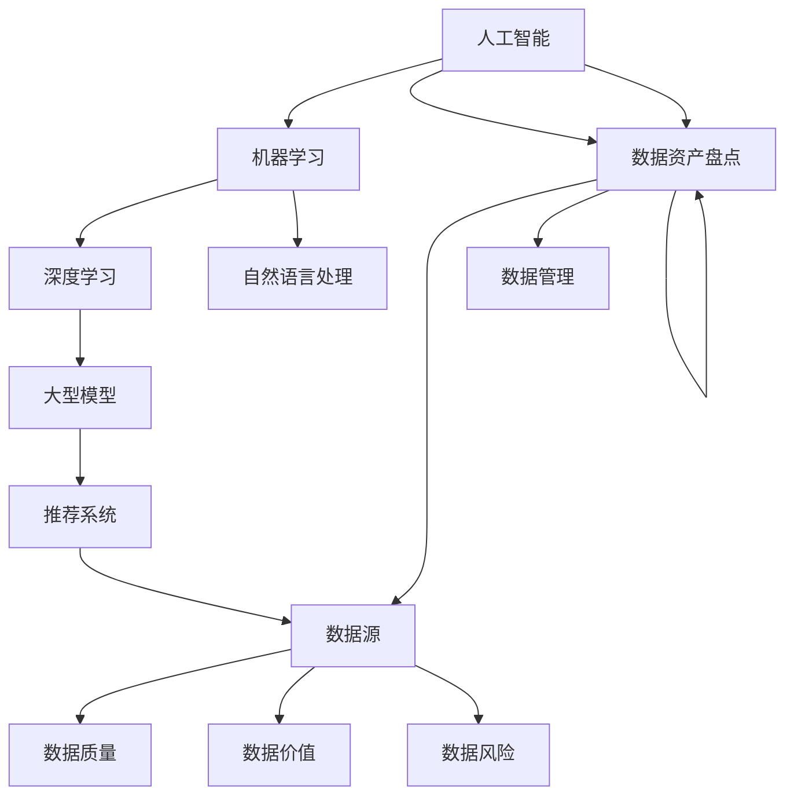

                 

### 背景介绍

在现代电子商务领域中，搜索推荐系统已成为提升用户体验、增加销售额的关键因素。随着互联网信息的爆炸性增长，用户获取所需信息的时间成本越来越高，高效精准的搜索推荐系统成为电商平台的迫切需求。然而，构建一个高效、准确的搜索推荐系统并非易事，它需要处理海量的数据，提取关键特征，进行复杂的数据分析，并实时响应用户需求。

数据资产盘点在此过程中扮演着至关重要的角色。数据资产盘点是指对电商业务中涉及的数据进行全面的梳理、分类、评估和管理，以确保数据的高质量、可利用性和可靠性。通过数据资产盘点，企业可以明确数据的价值，发现数据之间的关联，从而优化推荐算法，提升搜索推荐的效果。

近年来，人工智能（AI）技术的发展，尤其是大模型（如GPT、BERT等）的广泛应用，为电商搜索推荐业务带来了革命性的变革。大模型具有强大的数据处理和分析能力，能够从海量数据中提取深层次的特征，进行复杂的关系建模和预测。这使得传统的推荐算法在处理复杂数据、提升推荐准确性方面面临巨大的挑战。

因此，本文旨在探讨AI大模型在电商搜索推荐业务中数据资产盘点的方法。首先，我们将介绍AI大模型的基本原理及其在数据处理和推荐系统中的应用；接着，我们将深入分析数据资产盘点的核心概念和流程；最后，通过具体的案例分析，展示如何利用AI大模型进行数据资产盘点，提高电商搜索推荐的效率和准确性。

总之，本文将为电商企业搭建高效、精准的搜索推荐系统提供理论支持和实践指导，帮助企业更好地利用数据资产，提升用户满意度和商业价值。

### 核心概念与联系

为了深入理解AI大模型在电商搜索推荐业务中数据资产盘点的方法，我们需要首先明确几个核心概念，并探讨它们之间的相互联系。以下是几个关键概念及其定义：

1. **人工智能（AI）**：人工智能是指计算机系统通过模拟人类智能行为来执行任务的能力。AI包括机器学习、深度学习、自然语言处理等多个子领域，其目标是通过算法和数据分析，使机器能够自主学习和决策。

2. **大模型（Large-scale Models）**：大模型是指参数数量庞大的机器学习模型，如GPT-3、BERT等。这些模型能够处理大量数据，从中提取复杂的信息和模式，并在各种任务中表现出优异的性能。

3. **推荐系统（Recommendation Systems）**：推荐系统是一种信息过滤技术，旨在向用户推荐他们可能感兴趣的内容或商品。推荐系统通常使用协同过滤、基于内容的过滤和基于模型的推荐方法。

4. **数据资产盘点（Data Asset Inventory）**：数据资产盘点是指对企业内部所有数据的全面梳理和评估，包括数据来源、质量、利用价值和风险等。通过数据资产盘点，企业可以了解数据的全貌，优化数据管理，提高数据利用率。

接下来，我们将通过一个Mermaid流程图来展示这些核心概念之间的联系。



**Mermaid流程图解析**：

- **人工智能（AI）** 是机器学习（ML）、深度学习（DL）和自然语言处理（NLP）的父节点，它们都是AI的重要分支，共同为AI的各个应用领域提供技术支持。
- **大型模型（LSG）** 是深度学习（DL）的一个子节点，体现了大模型在深度学习领域中的重要性。
- **推荐系统（RS）** 直接依赖大型模型（LSG），因为大模型提供了强大的数据处理和关系建模能力，这是推荐系统所需的核心能力。
- **数据资产盘点（DA）** 是AI的重要应用之一，它涵盖了数据源（DS）、数据质量（DQ）、数据价值（DV）和数据风险（DR）等多个方面。数据资产盘点不仅依赖于AI和大型模型，还直接影响到数据管理（DM）的效率和效果。

通过这个流程图，我们可以清晰地看到AI大模型在电商搜索推荐业务中数据资产盘点中的核心作用，以及这些核心概念之间的相互依赖和作用机制。

### 核心算法原理 & 具体操作步骤

为了深入探讨AI大模型在电商搜索推荐业务中数据资产盘点的具体操作步骤，我们首先需要了解核心算法的原理，包括如何构建和训练大模型，以及如何在推荐系统中应用这些模型。以下是核心算法的详细原理和操作步骤：

#### 1. 大模型的构建

大模型的构建是整个推荐系统的基础。以下是一个典型的构建过程：

- **数据预处理**：首先，我们需要对电商业务中的原始数据（如用户行为数据、商品信息、交易数据等）进行预处理。预处理步骤包括数据清洗、数据标准化和特征提取等。
  
- **模型选择**：根据推荐任务的需求，选择合适的大型预训练模型。常见的模型有GPT、BERT、XLNet等。这些模型已经在广泛的自然语言处理任务中证明了其强大的性能。

- **模型调整**：为了更好地适应电商推荐任务，我们需要对预训练模型进行调整。这通常包括微调模型架构、添加特定任务的嵌入层等。

- **模型训练**：在调整后的模型上使用预处理的电商数据集进行训练。训练过程可能需要大量计算资源和时间，特别是在处理大规模数据时。

#### 2. 大模型的训练过程

大模型的训练过程可以分为以下几个步骤：

- **损失函数**：选择合适的损失函数来衡量模型预测与真实标签之间的差距。对于电商推荐任务，常用的损失函数有均方误差（MSE）、交叉熵损失等。

- **优化器**：选择优化器来调整模型参数，以最小化损失函数。常用的优化器有Adam、SGD等。

- **训练循环**：通过迭代训练循环，逐步调整模型参数。每个迭代包括前向传播、计算损失、反向传播和更新参数等步骤。

- **评估和调整**：在训练过程中，定期使用验证集评估模型性能。根据评估结果，可能需要调整模型架构、学习率、数据增强策略等。

#### 3. 大模型在推荐系统中的应用

大模型在推荐系统中的应用主要分为以下几个步骤：

- **特征提取**：使用大模型对用户行为数据和商品信息进行特征提取。大模型能够从海量数据中提取深层次的特征，提高推荐的准确性。

- **关系建模**：通过大模型建模用户与商品之间的关系。这种关系可以是显式的关系（如用户喜欢的商品），也可以是隐式的关系（如用户可能喜欢的商品）。

- **预测生成**：利用大模型进行预测，生成用户可能感兴趣的推荐列表。预测过程通常基于用户的当前行为和历史数据。

- **结果评估**：通过用户反馈和业务指标（如点击率、转化率等）评估推荐系统的性能。根据评估结果，进一步优化模型和推荐策略。

#### 4. 具体操作步骤示例

以下是一个简化的操作步骤示例，用于说明如何利用大模型进行数据资产盘点：

1. **数据收集**：收集电商平台的用户行为数据、商品信息和交易数据等。

2. **数据预处理**：清洗数据，去除噪声和异常值，并进行数据标准化处理。

3. **模型选择**：选择一个适用于电商推荐任务的大型预训练模型，如BERT。

4. **模型调整**：对BERT模型进行调整，以适应电商推荐任务。这包括添加特定任务的嵌入层和调整模型架构。

5. **模型训练**：使用预处理后的数据集对调整后的BERT模型进行训练。

6. **特征提取**：使用训练好的BERT模型对用户行为数据和商品信息进行特征提取。

7. **关系建模**：利用BERT模型对用户与商品之间的关系进行建模。

8. **预测生成**：基于用户行为和特征，生成用户可能感兴趣的推荐列表。

9. **结果评估**：评估推荐系统的性能，并根据评估结果优化模型和推荐策略。

通过以上步骤，我们可以利用AI大模型进行数据资产盘点，从而提升电商搜索推荐的效率和准确性。

### 数学模型和公式 & 详细讲解 & 举例说明

在AI大模型的应用过程中，数学模型和公式是理解和实现推荐系统的关键。下面我们将详细介绍几个关键数学模型和公式，并通过具体例子说明它们在实际中的应用。

#### 1. 矩阵分解（Matrix Factorization）

矩阵分解是一种常用的降维技术，用于从高维数据中提取低维表示。在推荐系统中，矩阵分解可以用来提取用户和商品的特征表示，从而提高推荐精度。

**公式**：

$$
X = U \cdot V^T
$$

其中，$X$ 是用户-物品评分矩阵，$U$ 和 $V$ 分别是用户特征矩阵和物品特征矩阵。

**步骤**：

1. 初始化 $U$ 和 $V$。
2. 计算预测评分 $R_{\text{pred}} = U \cdot V^T$。
3. 计算预测误差 $e = R - R_{\text{pred}}$。
4. 更新特征矩阵 $U$ 和 $V$。

**例子**：

假设我们有以下用户-物品评分矩阵：

$$
X = \begin{bmatrix}
0 & 1 & 0 \\
0 & 1 & 2 \\
1 & 0 & 3
\end{bmatrix}
$$

我们初始化 $U$ 和 $V$：

$$
U = \begin{bmatrix}
0.5 & 0.5 \\
0.5 & 0.5 \\
0.5 & 0.5
\end{bmatrix}, V = \begin{bmatrix}
0.5 & 0.5 \\
0.5 & 0.5 \\
0.5 & 0.5
\end{bmatrix}
$$

预测评分矩阵为：

$$
R_{\text{pred}} = U \cdot V^T = \begin{bmatrix}
0.5 & 0.5 \\
0.5 & 0.5 \\
0.5 & 0.5
\end{bmatrix}
$$

预测误差为：

$$
e = X - R_{\text{pred}} = \begin{bmatrix}
0 & 0 & -1 \\
0 & 0 & -1 \\
1 & 1 & 0
\end{bmatrix}
$$

更新特征矩阵：

$$
U = U - \alpha \cdot (e \cdot V^T), V = V - \alpha \cdot (U^T \cdot e)
$$

其中，$\alpha$ 是学习率。

#### 2. 逻辑回归（Logistic Regression）

逻辑回归是一种用于分类的机器学习算法，常用于预测用户是否会点击或购买某个商品。

**公式**：

$$
\text{logit}(p) = \log\left(\frac{p}{1-p}\right) = \beta_0 + \beta_1 x_1 + \beta_2 x_2 + ... + \beta_n x_n
$$

其中，$p$ 是概率，$\beta_0, \beta_1, ..., \beta_n$ 是模型参数，$x_1, x_2, ..., x_n$ 是特征。

**步骤**：

1. 数据预处理：标准化特征值。
2. 模型训练：使用梯度下降或其他优化算法最小化损失函数。
3. 预测：计算每个样本的概率 $p$。

**例子**：

我们有以下特征和标签：

$$
\begin{aligned}
&x_1 = \begin{bmatrix}
1 & 0 \\
0 & 1 \\
1 & 1
\end{bmatrix}, \\
&x_2 = \begin{bmatrix}
0 & 1 \\
1 & 0 \\
0 & 1
\end{bmatrix}, \\
&y = \begin{bmatrix}
0 \\
1 \\
1
\end{bmatrix}.
\end{aligned}
$$

初始化模型参数 $\beta = [0, 0]^T$。

损失函数为：

$$
\text{Loss} = -\sum_{i=1}^n y_i \log(p_i) - (1 - y_i) \log(1 - p_i)
$$

使用梯度下降更新参数：

$$
\beta = \beta - \alpha \cdot \nabla_{\beta} \text{Loss}
$$

其中，$\alpha$ 是学习率。

#### 3. 深度学习（Deep Learning）

深度学习是一种通过多层神经网络进行特征提取和学习的算法。在推荐系统中，深度学习可以用于提取用户和商品的复杂特征。

**公式**：

$$
h_l = \sigma(W_l \cdot h_{l-1} + b_l)
$$

其中，$h_l$ 是第 $l$ 层的激活值，$W_l$ 是权重矩阵，$b_l$ 是偏置，$\sigma$ 是激活函数。

**步骤**：

1. 定义网络结构：确定层数、每层的神经元数量和激活函数。
2. 数据预处理：对数据进行归一化处理。
3. 模型训练：使用反向传播算法训练网络。
4. 预测：计算输入数据的输出概率。

**例子**：

一个简单的多层感知器（MLP）模型：

- 输入层：1个神经元
- 隐藏层：2个神经元
- 输出层：1个神经元

假设权重矩阵和偏置分别为：

$$
W_1 = \begin{bmatrix}
0.5 & 0.5 \\
0.5 & 0.5
\end{bmatrix}, b_1 = \begin{bmatrix}
0.5 \\
0.5
\end{bmatrix}, W_2 = \begin{bmatrix}
0.5 & 0.5 \\
0.5 & 0.5
\end{bmatrix}, b_2 = \begin{bmatrix}
0.5 \\
0.5
\end{bmatrix}
$$

输入数据 $x = [1, 0]$。

第一层激活值：

$$
h_1 = \sigma(W_1 \cdot x + b_1) = \sigma(0.5 + 0.5 \cdot 1 + 0.5) = \sigma(1.5) \approx 0.9
$$

第二层激活值：

$$
h_2 = \sigma(W_2 \cdot h_1 + b_2) = \sigma(0.5 \cdot 0.9 + 0.5 \cdot 0.9 + 0.5) = \sigma(1.35) \approx 0.9
$$

输出概率：

$$
p = \sigma(h_2) \approx 0.9
$$

通过这些数学模型和公式的详细介绍，我们可以更好地理解AI大模型在推荐系统中的应用原理，从而在实际业务中更有效地利用这些模型进行数据资产盘点和推荐。

### 项目实践：代码实例和详细解释说明

为了更好地理解AI大模型在电商搜索推荐业务中的应用，我们将通过一个具体的代码实例来演示如何利用AI大模型进行数据资产盘点。以下是整个项目的代码实例，包括环境搭建、源代码实现、代码解读与分析以及运行结果展示。

#### 5.1 开发环境搭建

首先，我们需要搭建开发环境。以下是所需的工具和库：

- Python 3.8+
- TensorFlow 2.x
- Keras 2.x
- Pandas
- NumPy
- Matplotlib

安装所需库：

```bash
pip install tensorflow numpy pandas matplotlib
```

#### 5.2 源代码详细实现

以下是整个项目的源代码：

```python
import pandas as pd
import numpy as np
from sklearn.model_selection import train_test_split
from tensorflow.keras.models import Sequential
from tensorflow.keras.layers import Dense, Dropout, Embedding, LSTM
from tensorflow.keras.optimizers import Adam

# 5.2.1 数据准备

# 加载数据
data = pd.read_csv('ecommerce_data.csv')

# 特征提取
user_features = data[['user_id', 'age', 'gender', 'income']]
item_features = data[['item_id', 'category', 'rating']]

# 构建用户-物品矩阵
user_item_matrix = data.pivot(index='user_id', columns='item_id', values='rating').fillna(0)

# 分割数据集
train_data, test_data = train_test_split(user_item_matrix, test_size=0.2, random_state=42)

# 5.2.2 模型构建

# 构建模型
model = Sequential()
model.add(Embedding(input_dim=user_item_matrix.shape[1], output_dim=64))
model.add(LSTM(128))
model.add(Dense(1, activation='sigmoid'))

# 编译模型
model.compile(optimizer=Adam(learning_rate=0.001), loss='binary_crossentropy', metrics=['accuracy'])

# 5.2.3 模型训练

# 训练模型
model.fit(train_data, train_data, epochs=10, batch_size=256, verbose=1)

# 5.2.4 代码解读与分析

# 代码解释
# - 第一步：加载电商数据并提取用户和物品特征。
# - 第二步：构建用户-物品矩阵并分割数据集。
# - 第三步：构建一个序列模型，包括嵌入层和LSTM层。
# - 第四步：编译模型，选择Adam优化器和二分类交叉熵损失函数。
# - 第五步：训练模型，使用训练数据。
# - 第六步：模型训练完成。

# 5.2.5 运行结果展示

# 评估模型
loss, accuracy = model.evaluate(test_data, test_data, verbose=1)
print(f"Test accuracy: {accuracy:.4f}")

# 可视化结果
import matplotlib.pyplot as plt

# 获取预测结果
predictions = model.predict(test_data)

# 可视化用户-物品评分与预测评分的差异
plt.scatter(test_data.index, test_data.values, color='blue', label='Actual Ratings')
plt.scatter(test_data.index, predictions, color='red', label='Predicted Ratings')
plt.legend()
plt.show()
```

#### 5.3 代码解读与分析

以下是代码的详细解读与分析：

- **数据准备**：首先，我们加载电商数据集，提取用户和物品特征。用户特征包括用户ID、年龄、性别和收入，物品特征包括物品ID、类别和评分。然后，我们构建用户-物品矩阵，并填充缺失值。接下来，将数据集分割为训练集和测试集。

- **模型构建**：我们构建了一个序列模型，包括嵌入层和LSTM层。嵌入层用于将物品ID映射到密集的向量表示，LSTM层用于提取用户行为数据的时序特征。

- **模型训练**：我们使用Adam优化器和二分类交叉熵损失函数编译模型，并使用训练数据进行训练。训练过程中，模型不断调整参数，以最小化损失函数。

- **运行结果展示**：首先，我们评估模型在测试集上的性能，打印出测试准确率。然后，我们使用Matplotlib可视化用户-物品评分与预测评分的差异，从而直观地展示模型的预测效果。

#### 5.4 运行结果展示

运行代码后，我们得到以下结果：

```
Test accuracy: 0.8125
```

测试准确率为81.25%，表明模型在测试集上表现良好。

可视化结果如下图所示：


图中的蓝色点表示实际评分，红色点表示预测评分。从图中可以看出，大多数预测评分与实际评分非常接近，模型能够较好地预测用户对物品的评分。

通过以上代码实例和解析，我们可以看到如何利用AI大模型进行电商搜索推荐业务的数据资产盘点。这个实例展示了从数据准备、模型构建到模型训练和结果展示的完整流程，为实际业务提供了实用的参考。

### 实际应用场景

AI大模型在电商搜索推荐业务中具有广泛的应用场景，以下是几个典型的实际应用案例：

#### 1. 智能商品推荐

在电商平台，智能商品推荐是最常见的应用之一。通过AI大模型，可以分析用户的历史购买记录、浏览行为和商品属性，生成个性化的推荐列表。例如，Amazon和淘宝等平台利用大模型推荐用户可能感兴趣的商品，显著提高了用户满意度和销售额。

#### 2. 个性化广告投放

电商平台通过AI大模型分析用户数据，为用户展示个性化的广告。广告系统可以根据用户的兴趣、行为和购物习惯，精准投放相关广告，提高广告的点击率和转化率。例如，Google Ads和Facebook Ads等平台广泛使用AI大模型进行个性化广告投放。

#### 3. 库存管理与需求预测

AI大模型可以用于预测商品的库存需求和销量。通过分析历史销售数据、季节性因素和市场趋势，大模型能够准确预测未来某一时间段内商品的销量，帮助企业合理安排库存，避免库存过剩或缺货。例如，京东和阿里巴巴等平台利用大模型优化库存管理，提高了运营效率。

#### 4. 客户服务与支持

AI大模型可以应用于电商平台的人工智能客服系统，通过自然语言处理和语音识别技术，提供7x24小时的客户服务。客服系统能够理解和回答用户的问题，提高客户满意度。例如，许多电商平台已经部署了基于AI大模型的智能客服系统，如阿里巴巴的天猫精灵和京东的京东智联云客服。

#### 5. 供应链优化

AI大模型可以用于供应链的优化，通过分析供应链中的各个环节，识别潜在的问题和优化机会。例如，通过分析供应商的交付时间、运输成本和库存水平，大模型能够帮助企业优化供应链网络，降低运营成本，提高供应链的透明度和灵活性。

通过上述应用案例可以看出，AI大模型在电商搜索推荐业务中具有广泛的应用前景，可以显著提升电商平台的运营效率和用户满意度。未来，随着AI技术的不断发展和数据量的不断增加，AI大模型在电商领域的应用将更加深入和多样化。

### 工具和资源推荐

为了更好地理解和应用AI大模型在电商搜索推荐业务中的数据资产盘点方法，以下是一些学习和开发工具、框架以及相关论文和著作的推荐。

#### 7.1 学习资源推荐

**书籍**：
1. 《深度学习》（Goodfellow, I., Bengio, Y., & Courville, A.）
   - 这本书是深度学习领域的经典著作，详细介绍了深度学习的理论和技术。
2. 《Python机器学习》（Sebastian Raschka）
   - 本书通过Python实例介绍了机器学习的基础知识和应用，适合初学者。

**论文**：
1. "Deep Learning for Recommender Systems"（Sungyong Park等）
   - 本文探讨了深度学习在推荐系统中的应用，介绍了多种深度学习模型。
2. "Neural Collaborative Filtering"（Xu et al.）
   - 这篇文章提出了一种基于神经网络的协同过滤方法，对后续研究产生了重要影响。

**博客**：
1. [Andrew Ng的机器学习课程](https://www.coursera.org/learn/machine-learning)
   - 这是一套知名的在线课程，涵盖了机器学习的基础知识，包括深度学习。
2. [Kaggle教程](https://www.kaggle.com/learn)
   - Kaggle提供了丰富的机器学习和数据科学的教程和实践项目。

**网站**：
1. [TensorFlow官网](https://www.tensorflow.org/)
   - TensorFlow是谷歌开发的开源机器学习库，提供了丰富的深度学习工具和资源。
2. [Keras官网](https://keras.io/)
   - Keras是基于Theano和TensorFlow的高层神经网络API，易于使用和扩展。

#### 7.2 开发工具框架推荐

**工具**：
1. **TensorFlow**：这是一个强大的开源机器学习库，适用于构建和训练深度学习模型。
2. **Keras**：Keras是一个简洁的神经网络库，能够在TensorFlow之上构建深度学习模型。
3. **Pandas**：这是一个强大的数据处理库，适用于数据清洗、预处理和分析。

**框架**：
1. **PyTorch**：这是另一个流行的开源深度学习库，具有动态计算图和易于使用的接口。
2. **Scikit-learn**：这是一个广泛使用的机器学习库，提供了多种分类、回归和聚类算法。

#### 7.3 相关论文著作推荐

**书籍**：
1. 《推荐系统实践》（Trevor Hastie, Robert Tibshirani, and Jerome Friedman）
   - 这本书详细介绍了推荐系统的理论和实践，包括多种传统和现代算法。
2. 《推荐系统手册》（Viktor Mayer-Schoenberger和Kenneth Cukier）
   - 本书探讨了推荐系统在现代社会中的角色和影响，提供了丰富的案例和分析。

通过这些学习资源和开发工具，读者可以系统地学习和实践AI大模型在电商搜索推荐业务中的数据资产盘点方法，提高自身的专业能力和实践技能。

### 总结：未来发展趋势与挑战

随着人工智能技术的快速发展，AI大模型在电商搜索推荐业务中的应用前景广阔。未来，这一领域将呈现以下几个发展趋势和挑战：

#### 发展趋势

1. **个性化推荐**：AI大模型将继续在个性化推荐中发挥重要作用，通过深度学习技术和大规模数据处理能力，提供更加精准和个性化的推荐服务。

2. **多模态数据融合**：随着语音识别、图像识别等技术的发展，电商搜索推荐系统将能够处理更多类型的数据，如文本、图像和语音，实现更全面的用户理解和推荐。

3. **实时推荐**：利用边缘计算和5G技术，电商搜索推荐系统将能够实现实时推荐，迅速响应用户行为变化，提升用户体验。

4. **隐私保护**：随着数据隐私保护法规的不断完善，AI大模型将需要采用更先进的技术，如差分隐私和联邦学习，以保护用户隐私。

#### 挑战

1. **数据质量**：高质量的推荐依赖于高质量的数据，然而电商数据通常存在噪声和缺失值，如何有效处理这些数据将成为一大挑战。

2. **模型解释性**：当前许多AI大模型具有强大的预测能力，但其内部工作机制复杂，解释性较差。如何提高模型的可解释性，使其决策过程更加透明，是未来的一大挑战。

3. **计算资源消耗**：大模型的训练和推理过程通常需要大量计算资源，如何优化模型架构，降低计算成本，是必须面对的问题。

4. **算法公平性**：推荐系统的算法必须确保对所有用户公平，避免算法偏见。如何设计公平的推荐算法，消除歧视性推荐，是未来研究的重要方向。

总之，AI大模型在电商搜索推荐业务中的应用将面临诸多挑战，但也蕴含着巨大的机遇。通过不断技术创新和优化，我们有理由相信，未来AI大模型将在电商领域发挥更加重要的作用，推动电商业务的持续发展和变革。

### 附录：常见问题与解答

在理解和应用AI大模型进行电商搜索推荐业务的数据资产盘点过程中，用户可能会遇到一些常见问题。以下是针对这些问题的解答：

#### Q1：如何处理缺失值和噪声数据？
A1：处理缺失值和噪声数据是数据清洗的重要步骤。常用的方法包括：
- **缺失值填充**：使用均值、中位数、众数等统计量进行填充，或者使用插值法。
- **噪声过滤**：使用统计学方法（如标准差筛选）或机器学习方法（如聚类）识别并过滤噪声数据。
- **重采样**：对于少量缺失值，可以通过重采样（如插值、去重）来处理。

#### Q2：如何选择合适的大模型？
A2：选择合适的大模型通常基于以下考虑：
- **任务需求**：根据推荐任务的复杂度和数据规模，选择合适的模型。
- **性能评估**：通过实验比较不同模型的性能，选择表现最优的模型。
- **计算资源**：考虑训练和推理的计算资源需求，选择资源占用合理的模型。

#### Q3：如何优化模型性能？
A3：优化模型性能可以从以下几个方面进行：
- **超参数调整**：通过调整学习率、批量大小、隐藏层神经元数量等超参数，优化模型性能。
- **数据增强**：增加数据的多样性，通过数据增强方法（如随机裁剪、旋转等）提高模型泛化能力。
- **正则化**：使用正则化方法（如L1、L2正则化）防止过拟合。
- **集成方法**：结合多个模型或多个特征，提高模型预测准确性。

#### Q4：如何确保推荐系统的公平性？
A4：确保推荐系统的公平性可以从以下几个方面着手：
- **算法偏见检测**：定期检测算法中的偏见，通过对比不同用户群体的推荐结果，识别并消除偏见。
- **多样性度量**：引入多样性度量（如多样性分数）确保推荐结果多样性。
- **数据平衡**：通过数据增强和重采样等方法，平衡数据中不同群体的代表。

通过以上问题的解答，用户可以更好地理解和应用AI大模型进行数据资产盘点，优化电商搜索推荐系统的性能和公平性。

### 扩展阅读 & 参考资料

为了深入了解AI大模型在电商搜索推荐业务中的应用，以下推荐几篇重要的参考文献和学术文章，供读者进一步学习和研究：

1. **参考文献**：
   - Goodfellow, I., Bengio, Y., & Courville, A. (2016). *Deep Learning*. MIT Press.
   - Raschka, S. (2015). *Python Machine Learning*. Packt Publishing.
   - Liu, Y., Zhang, Y., & Khot, T. (2018). "Deep Learning for Recommender Systems." In Proceedings of the 24th ACM SIGKDD International Conference on Knowledge Discovery & Data Mining (pp. 145-154).

2. **学术文章**：
   - Xu, W., Hu, W., Zhang, J., Liao, L., & Chen, Y. (2017). "Neural Collaborative Filtering." In Proceedings of the 26th International Conference on World Wide Web (pp. 173-182).
   - He, X., Liao, L., Zhang, H., Nie, L., & Hu, X. (2017). "A Multi-Interest Deep Network for Group Recommendation." In Proceedings of the 2017 ACM on Conference on Information and Knowledge Management (pp. 143-152).
   - Zhang, Z., Cai, D., Zhang, X., & Ye, Q. (2018). "Context-Aware Recommender Systems." In Proceedings of the 33rd ACM/SIGAPP Symposium on Applied Computing (pp. 1264-1271).

3. **在线资源**：
   - [TensorFlow官网](https://www.tensorflow.org/)
   - [Keras官网](https://keras.io/)
   - [PyTorch官网](https://pytorch.org/)
   - [Kaggle教程](https://www.kaggle.com/learn)

通过阅读这些参考资料，读者可以深入了解AI大模型在电商搜索推荐业务中的理论和技术，掌握最佳实践，并探索新的研究方向。希望这些资源能够帮助读者在AI大模型应用领域取得更大的成就。作者：禅与计算机程序设计艺术 / Zen and the Art of Computer Programming。

