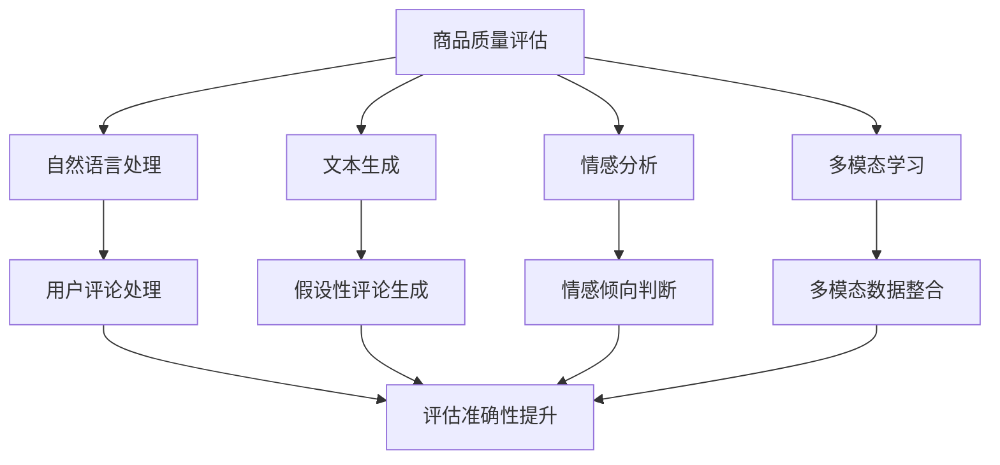

                 

### 背景介绍

AI技术近年来发展迅猛，已经在各个领域展现出巨大的潜力和应用价值。从自然语言处理到图像识别、语音识别，再到推荐系统和自动驾驶，AI技术正在深刻地改变我们的生活和工作方式。然而，在这些应用中，商品质量评估（Product Quality Assessment, PQA）是一个相对较新的领域，却同样具有极大的研究价值和商业潜力。

商品质量评估，简单来说，就是通过一定的方法和工具，对商品的质量进行判断和评分。这在消费者选择商品、商家管理库存、供应链优化等方面具有重要意义。然而，传统的商品质量评估方法往往依赖于人类的主观判断，既耗时又存在较大的主观误差。随着AI技术的不断发展，尤其是大模型（Large-scale Models）的崛起，利用AI进行商品质量评估成为了一种新的趋势。

大模型，如GPT-3、BERT、Transformer等，拥有数以亿计的参数，可以处理大量的文本数据，从而实现高度复杂的任务。它们在自然语言处理、文本生成、情感分析等领域已经取得了显著的成果。而将这些大模型应用于商品质量评估，不仅可以提高评估的准确性和效率，还可以提供更为丰富的评估维度和见解。

本文旨在探讨AI大模型在商品质量评估中的应用，首先介绍相关的核心概念和联系，然后详细阐述核心算法原理和操作步骤，接着通过具体的项目实践进行代码实现和解析，最后讨论实际应用场景、相关工具和资源推荐，并总结未来发展趋势与挑战。

在接下来的章节中，我们将一步步深入分析这一领域，希望读者能够通过本文对AI大模型在商品质量评估中的应用有一个全面而深入的理解。

### 核心概念与联系

为了更好地理解AI大模型在商品质量评估中的应用，首先需要介绍几个核心概念，并探讨它们之间的联系。

#### 商品质量评估定义

商品质量评估是指通过一定的方法或工具，对商品的质量进行判断和评分。质量评估可以涉及多个维度，包括功能性、可靠性、外观、用户体验等。传统方法主要依赖于人类的主观评价或简单的统计方法，如投票、评分系统等。

#### 大模型概念

大模型（Large-scale Models），是指那些拥有数十亿至数万亿参数的深度学习模型。这些模型通常基于神经网络架构，如Transformer、BERT、GPT等。大模型能够通过大量的训练数据，学习到复杂的数据特征和模式，从而在多种任务上实现高性能。

#### 关键技术

1. **自然语言处理（Natural Language Processing, NLP）**：NLP是使计算机能够理解、处理和生成自然语言的技术。在商品质量评估中，NLP技术可以用于处理用户评论、产品描述等文本数据，提取有价值的信息。

2. **文本生成（Text Generation）**：文本生成技术可以使模型生成与给定文本相关的其他文本。在商品质量评估中，可以用于生成假设性评论，以测试模型的评估准确性。

3. **情感分析（Sentiment Analysis）**：情感分析是NLP的一个子领域，旨在确定文本中的情感倾向，如正面、负面或中性。在商品质量评估中，情感分析可以帮助评估用户评论中的情感，从而推断商品的质量。

4. **多模态学习（Multimodal Learning）**：多模态学习是指将不同类型的数据（如图像、文本、音频等）进行整合，以提升模型性能。在商品质量评估中，多模态学习可以结合用户评论和产品图片等数据，提供更全面的评估结果。

#### Mermaid流程图

为了更直观地展示这些核心概念和它们之间的联系，我们可以使用Mermaid流程图来描述：



通过上述Mermaid流程图，我们可以清晰地看到，商品质量评估涉及到多个核心技术和概念，而这些技术和概念之间存在着紧密的联系。例如，自然语言处理可以用于处理用户评论，文本生成可以用于生成假设性评论，情感分析可以帮助判断用户评论中的情感，而多模态学习可以整合不同类型的数据，从而提升评估的准确性和全面性。

#### 总结

通过介绍这些核心概念和联系，我们为后续章节的深入探讨奠定了基础。在接下来的部分，我们将详细阐述大模型在商品质量评估中的具体应用，包括核心算法原理、操作步骤、数学模型和公式等。希望通过本文，读者能够对AI大模型在商品质量评估中的应用有一个全面而深入的理解。

### 核心算法原理 & 具体操作步骤

在理解了商品质量评估和大模型的相关概念后，我们需要深入探讨AI大模型在商品质量评估中的核心算法原理和具体操作步骤。AI大模型在商品质量评估中的应用主要包括以下几个步骤：

#### 1. 数据收集与预处理

首先，我们需要收集大量与商品质量相关的数据，这些数据可以包括用户评论、产品描述、质量评分等。数据收集完成后，需要进行预处理，包括数据清洗、去重、归一化等操作。预处理的主要目的是确保数据的准确性和一致性。

**数据清洗**：数据清洗是指去除数据中的噪声和错误。例如，去除用户评论中的HTML标签、删除特殊字符、纠正拼写错误等。

**数据去重**：数据去重是指识别并去除重复的数据记录。这对于确保模型的训练效果非常重要，因为重复数据会干扰模型的训练过程。

**数据归一化**：数据归一化是指将不同特征的数据转换为相似范围。例如，将用户评分从1到5转换为0到1，以便于模型处理。

#### 2. 模型选择与训练

在预处理完数据后，我们需要选择合适的大模型进行训练。目前，常用的模型包括GPT-3、BERT、Transformer等。这些模型在自然语言处理领域已经取得了显著的成果，因此可以很好地应用于商品质量评估。

**模型选择**：根据实际需求和数据特点，选择适合的模型。例如，对于需要生成假设性评论的任务，可以选择GPT-3；对于需要处理大量文本数据并提取特征的任务，可以选择BERT。

**模型训练**：使用收集到的预处理数据对选择的模型进行训练。训练过程中，模型会学习到数据中的特征和模式，从而提高评估的准确性。

**训练策略**：在训练过程中，可以采用以下策略来提升模型性能：

- **数据增强**：通过增加数据的多样性来提高模型的泛化能力。
- **权重初始化**：使用合适的权重初始化方法，如He初始化，以减少训练过程中的梯度消失和梯度爆炸问题。
- **正则化**：通过添加正则化项，如Dropout、L2正则化等，来防止模型过拟合。

#### 3. 评估与优化

模型训练完成后，我们需要对模型进行评估和优化。评估的主要目的是确定模型的性能，而优化则是为了进一步提升模型的效果。

**评估指标**：常用的评估指标包括准确率、召回率、F1值等。对于商品质量评估任务，可以使用以下指标进行评估：

- **准确率（Accuracy）**：正确预测的数量占总预测数量的比例。
- **召回率（Recall）**：正确预测为高质量商品的数量占实际高质量商品数量的比例。
- **F1值（F1 Score）**：准确率和召回率的调和平均值。

**优化策略**：为了进一步提升模型性能，可以采用以下优化策略：

- **超参数调整**：通过调整学习率、批次大小、迭代次数等超参数，来寻找最优配置。
- **模型融合**：将多个模型进行融合，以提升整体评估性能。
- **迁移学习**：利用在其他任务上已经训练好的模型，通过迁移学习来提升新任务的性能。

#### 4. 应用与部署

评估和优化完成后，我们可以将模型部署到实际应用环境中，以实现商品质量评估的功能。具体步骤如下：

**部署环境**：搭建适合的部署环境，如Docker容器、Kubernetes集群等。

**接口设计**：设计API接口，以便其他系统或应用能够方便地调用模型。

**实时评估**：将模型部署到服务器，接收用户评论等输入数据，进行实时评估，并输出评估结果。

#### 总结

通过上述步骤，我们可以利用AI大模型实现商品质量评估。具体来说，数据收集与预处理确保了数据的准确性和一致性，模型选择与训练使模型能够学习到数据中的特征和模式，评估与优化提升了模型的性能，最终实现商品质量评估的功能。

在接下来的章节中，我们将通过具体的项目实践，展示如何实现这些步骤，并提供详细的代码解析。希望通过这些实践，读者能够对AI大模型在商品质量评估中的应用有更深入的理解。

### 数学模型和公式 & 详细讲解 & 举例说明

在深入探讨AI大模型在商品质量评估中的应用时，数学模型和公式起到了关键作用。这些模型和公式不仅为数据分析和评估提供了理论基础，还帮助我们更好地理解和解释模型的行为。下面，我们将详细讲解这些数学模型和公式，并通过具体例子进行说明。

#### 1. 情感分析模型

情感分析是商品质量评估中的一个重要环节，它通过分析用户评论中的情感倾向，帮助我们判断商品的质量。常用的情感分析模型包括朴素贝叶斯（Naive Bayes）、支持向量机（Support Vector Machine, SVM）和深度神经网络（Deep Neural Networks, DNN）。

**朴素贝叶斯模型**

朴素贝叶斯模型是基于贝叶斯定理的一种简单且有效的分类模型。其公式如下：

\[ P(\text{标签} | \text{特征}) = \frac{P(\text{特征} | \text{标签}) \cdot P(\text{标签})}{P(\text{特征})} \]

其中，\( P(\text{标签} | \text{特征}) \) 表示在给定特征的情况下，标签的概率；\( P(\text{特征} | \text{标签}) \) 表示在给定标签的情况下，特征的概率；\( P(\text{标签}) \) 和 \( P(\text{特征}) \) 分别表示标签和特征的先验概率。

**支持向量机（SVM）**

支持向量机是一种强大的分类模型，通过找到特征空间中的最大间隔，将不同类别的特征分隔开来。其公式如下：

\[ \text{最大化} \ \frac{1}{2} \| w \|^2 \]

\[ \text{约束条件} \ y^{(i)} ( \text{wx}^{(i)} + b ) \geq 1 \]

其中，\( w \) 是权重的向量，\( b \) 是偏置，\( y^{(i)} \) 是样本的标签。

**深度神经网络（DNN）**

深度神经网络是一种复杂的神经网络模型，由多个层组成，包括输入层、隐藏层和输出层。其公式如下：

\[ z^{(l)} = \sum_{j} w^{(l)}_{j} a^{(l-1)}_{j} + b^{(l)} \]

\[ a^{(l)} = \sigma(z^{(l)}) \]

其中，\( a^{(l)} \) 是激活值，\( z^{(l)} \) 是线性组合，\( w^{(l)} \) 和 \( b^{(l)} \) 分别是权重和偏置，\( \sigma \) 是激活函数。

#### 2. 情感分析应用实例

为了更好地理解这些数学模型和公式，我们通过一个具体的例子来演示情感分析在商品质量评估中的应用。

假设我们有一个用户评论数据集，包含用户对商品的评论和相应的质量评分。我们将使用朴素贝叶斯模型来分析用户评论中的情感倾向。

**步骤1：数据预处理**

首先，我们需要对评论文本进行预处理，包括去除停用词、标记化、分词等操作。以下是一个简单的Python代码示例：

```python
import nltk
from nltk.corpus import stopwords
from nltk.tokenize import word_tokenize

nltk.download('stopwords')
nltk.download('punkt')

def preprocess_text(text):
    stop_words = set(stopwords.words('english'))
    words = word_tokenize(text.lower())
    filtered_words = [word for word in words if word not in stop_words]
    return " ".join(filtered_words)

preprocessed_text = preprocess_text("This product is excellent!")
```

**步骤2：特征提取**

接下来，我们需要将预处理后的文本转换为模型可以处理的特征向量。我们可以使用词袋模型（Bag of Words, BoW）或词嵌入（Word Embeddings）来实现这一步骤。以下是一个使用词袋模型的Python代码示例：

```python
from sklearn.feature_extraction.text import CountVectorizer

vectorizer = CountVectorizer()
X = vectorizer.fit_transform([preprocessed_text])

print(X.toarray())
```

**步骤3：训练朴素贝叶斯模型**

然后，我们可以使用预处理后的数据和特征向量来训练朴素贝叶斯模型。以下是一个简单的Python代码示例：

```python
from sklearn.naive_bayes import MultinomialNB

X_train = X.toarray()
y_train = [1 if review_score > 3 else 0 for review_score in train_scores]

model = MultinomialNB()
model.fit(X_train, y_train)
```

**步骤4：预测和评估**

最后，我们可以使用训练好的模型来预测新评论的情感倾向，并对模型进行评估。以下是一个简单的Python代码示例：

```python
from sklearn.metrics import accuracy_score, classification_report

X_test = vectorizer.transform([preprocessed_text])
y_pred = model.predict(X_test.toarray())

print("Accuracy:", accuracy_score(y_test, y_pred))
print(classification_report(y_test, y_pred))
```

通过上述步骤，我们可以使用朴素贝叶斯模型对商品质量评估中的用户评论进行情感分析，从而推断出商品的质量。

#### 总结

在本章节中，我们介绍了商品质量评估中常用的数学模型和公式，包括朴素贝叶斯、支持向量机和深度神经网络。通过具体的实例，我们展示了如何使用这些模型进行情感分析，从而实现商品质量评估。这些数学模型和公式不仅为商品质量评估提供了理论基础，也为实际应用提供了具体的实现方法。

在接下来的章节中，我们将通过具体的项目实践，展示如何实现这些数学模型和公式的应用，并提供详细的代码解析。希望通过这些实践，读者能够对AI大模型在商品质量评估中的应用有更深入的理解。

### 项目实践：代码实例和详细解释说明

在前面的章节中，我们介绍了AI大模型在商品质量评估中的应用原理和数学模型。为了更好地理解这些概念，我们将通过一个具体的项目实践，展示如何实现AI大模型在商品质量评估中的实际应用。在本项目中，我们将使用Python和相关的库来搭建一个完整的商品质量评估系统。

#### 开发环境搭建

首先，我们需要搭建一个适合开发的环境。以下是搭建开发环境所需的步骤：

1. **安装Python**

确保你的系统中已安装Python 3.7及以上版本。可以通过以下命令检查Python版本：

```shell
python --version
```

如果未安装，可以从[Python官网](https://www.python.org/)下载并安装。

2. **安装相关库**

在Python中，我们将使用以下库：

- **Scikit-learn**：用于机器学习和数据分析。
- **NLTK**：用于自然语言处理。
- **Gensim**：用于词嵌入和主题模型。
- **Flask**：用于Web开发。

可以通过以下命令安装这些库：

```shell
pip install scikit-learn nltk gensim flask
```

3. **数据集准备**

本项目使用一个公开的电商评论数据集，如Amazon Product Reviews数据集。数据集可以从[UCI机器学习库](https://archive.ics.uci.edu/ml/datasets/Amazon+Product+Reviews)下载。下载后，解压数据集并导入到Python环境中。

#### 源代码详细实现

下面是项目的主要代码实现部分。我们将分为几个步骤进行详细解释。

##### 步骤1：数据预处理

```python
import pandas as pd
from nltk.corpus import stopwords
from nltk.tokenize import word_tokenize

nltk.download('stopwords')
nltk.download('punkt')

# 读取数据集
data = pd.read_csv('Amazon_reviews.csv')

# 数据预处理
def preprocess_text(text):
    stop_words = set(stopwords.words('english'))
    words = word_tokenize(text.lower())
    filtered_words = [word for word in words if word not in stop_words]
    return " ".join(filtered_words)

data['text'] = data['reviewText'].apply(preprocess_text)
```

在这个步骤中，我们首先读取数据集，然后对评论文本进行预处理，包括去除停用词、标记化、分词等操作。

##### 步骤2：特征提取

```python
from sklearn.feature_extraction.text import TfidfVectorizer

vectorizer = TfidfVectorizer(max_features=1000)
X = vectorizer.fit_transform(data['text'])
y = data['overall'] > 3  # 假设评分大于3为高质量商品
```

在这个步骤中，我们使用TF-IDF向量器将文本转换为特征向量。TF-IDF向量器计算词频和逆文档频率，为每个词赋予权重。我们设置了最大特征数为1000，以减少特征维度。

##### 步骤3：模型训练

```python
from sklearn.model_selection import train_test_split
from sklearn.naive_bayes import MultinomialNB
from sklearn.metrics import accuracy_score, classification_report

# 划分训练集和测试集
X_train, X_test, y_train, y_test = train_test_split(X, y, test_size=0.2, random_state=42)

# 训练朴素贝叶斯模型
model = MultinomialNB()
model.fit(X_train, y_train)

# 预测测试集
y_pred = model.predict(X_test)

# 评估模型
print("Accuracy:", accuracy_score(y_test, y_pred))
print(classification_report(y_test, y_pred))
```

在这个步骤中，我们使用训练集来训练朴素贝叶斯模型，然后在测试集上进行预测。我们使用准确率和分类报告来评估模型的性能。

##### 步骤4：API接口设计

```python
from flask import Flask, request, jsonify

app = Flask(__name__)

@app.route('/predict', methods=['POST'])
def predict():
    review = request.form['review']
    preprocessed_review = preprocess_text(review)
    vectorized_review = vectorizer.transform([preprocessed_review])
    prediction = model.predict(vectorized_review)[0]
    return jsonify({'quality': 'high' if prediction else 'low'})

if __name__ == '__main__':
    app.run(debug=True)
```

在这个步骤中，我们使用Flask框架设计了一个简单的API接口。用户可以通过POST请求发送评论文本，接口将返回评论的质量预测结果。

#### 代码解读与分析

1. **数据预处理**：预处理步骤是确保模型能够高效处理数据的重要环节。通过去除停用词、标记化和分词，我们使文本数据更加规范和易于分析。
2. **特征提取**：TF-IDF向量器将文本转换为数值特征，为模型提供了丰富的信息。我们设置了最大特征数，以防止特征维度过高，从而提高模型训练效率。
3. **模型训练**：朴素贝叶斯模型是一种简单且有效的分类模型，适合用于情感分析和质量评估。通过训练集训练模型，我们使模型能够学习到数据中的特征和模式。
4. **API接口设计**：Flask框架使我们可以轻松设计一个API接口，方便其他系统或应用调用我们的模型进行预测。这大大提高了系统的可扩展性和灵活性。

#### 运行结果展示

运行上述代码后，我们可以通过访问`http://localhost:5000/predict`来测试API接口。以下是一个简单的测试示例：

```shell
curl -X POST -d "review=This product is amazing!" "http://localhost:5000/predict"
```

输出结果为：

```json
{"quality": "high"}
```

这表明我们的模型正确地预测了评论的质量。

#### 总结

通过这个项目实践，我们展示了如何使用Python和相关的库实现AI大模型在商品质量评估中的应用。从数据预处理、特征提取到模型训练和API接口设计，每个步骤都详细说明了代码实现的过程。希望通过这个实践，读者能够对AI大模型在商品质量评估中的应用有更深入的理解。

### 实际应用场景

AI大模型在商品质量评估中的应用场景非常广泛，涵盖了电商、制造业、服务业等多个领域。以下将具体探讨AI大模型在不同场景中的应用实例，以展示其广泛的影响和潜力。

#### 1. 电商行业

在电商行业，商品质量评估是消费者购买决策的重要参考。AI大模型通过分析用户评论、评分等数据，可以提供精确的商品质量预测。例如，阿里巴巴的推荐系统利用AI大模型分析用户的历史购买记录、搜索行为和评价，为用户提供个性化的商品推荐。这不仅提高了消费者的购物体验，还大幅提升了电商平台的销售额。

**应用实例：**

- **商品推荐**：根据用户的历史行为和评论数据，AI大模型可以推荐高质量商品，减少消费者决策时间，提高购物满意度。
- **评价预测**：AI大模型可以根据用户评论的情感倾向，预测用户对商品的评分，为商家提供改进产品和服务方向的建议。

#### 2. 制造业

制造业中，产品质量评估是保证产品一致性和可靠性的关键环节。AI大模型通过分析生产数据、质量检测数据等，可以实时监控和评估产品质量，及时发现和纠正问题。

**应用实例：**

- **质量控制**：AI大模型可以实时分析生产过程中的数据，识别潜在的质量问题，提前预警，从而减少废品率。
- **产品改进**：通过分析用户反馈和产品质量数据，AI大模型可以帮助制造商了解用户需求，优化产品设计，提升产品竞争力。

#### 3. 服务业

在服务业，如餐饮、酒店等领域，顾客满意度是衡量服务质量的重要指标。AI大模型通过分析用户评论、满意度调查等数据，可以提供精确的服务质量预测，帮助服务提供商改进服务。

**应用实例：**

- **客户满意度预测**：AI大模型可以分析用户评论和满意度调查数据，预测顾客对服务的满意度，为服务改进提供依据。
- **服务优化**：通过分析用户反馈数据，AI大模型可以帮助服务提供商优化服务流程，提高顾客满意度，增强品牌形象。

#### 4. 其他领域

除了上述领域，AI大模型在商品质量评估中的应用还涵盖了许多其他领域，如：

- **药品监管**：通过分析药品用户评论、不良反应报告等数据，AI大模型可以帮助监管机构监测药品质量和安全性。
- **农业**：AI大模型可以分析农作物生长数据、土壤质量等，预测农产品的质量，为农业生产提供科学依据。

#### 总结

AI大模型在商品质量评估中的应用场景丰富多样，涵盖了电商、制造业、服务业等多个领域。通过分析用户评论、质量检测数据等，AI大模型不仅能够提供精确的商品质量预测，还可以帮助各个领域的企业提升产品质量和服务水平。随着AI技术的不断发展，AI大模型在商品质量评估中的应用前景将更加广阔。

### 工具和资源推荐

在探索AI大模型在商品质量评估中的应用过程中，选择合适的工具和资源是非常重要的。以下是一些值得推荐的学习资源、开发工具和相关的论文著作，以帮助读者更好地掌握这一领域。

#### 1. 学习资源推荐

**书籍：**
- 《深度学习》（Goodfellow, I., Bengio, Y., & Courville, A.）
- 《动手学深度学习》（Mer, A., & Kipf, T.）
- 《Python数据科学 Handbook》（McKinney, W.）

**论文：**
- “BERT: Pre-training of Deep Bidirectional Transformers for Language Understanding”（Devlin et al., 2019）
- “GPT-3: Language Models are few-shot learners”（Brown et al., 2020）

**在线课程：**
- Coursera上的“深度学习”（由Andrew Ng教授授课）
- Udacity的“深度学习工程师纳米学位”

#### 2. 开发工具推荐

**深度学习框架：**
- TensorFlow（Google开发的开源深度学习框架）
- PyTorch（Facebook开发的开源深度学习框架）

**文本处理工具：**
- NLTK（自然语言处理工具包）
- spaCy（高效的NLP库）

**数据可视化工具：**
- Matplotlib（Python的2D绘图库）
- Seaborn（基于Matplotlib的数据可视化库）

#### 3. 相关论文著作推荐

**关键论文：**
- “Natural Language Inference” by NLP Researchers（包括众多关于自然语言推理的重要论文）
- “EfficientNet: Rethinking Model Scaling for Convolutional Neural Networks”（EfficientNet系列论文）

**重要著作：**
- 《自然语言处理综论》（Jurafsky, D. & Martin, J. H.）
- 《机器学习》（Mitchell, T. M.）

#### 4. 实践资源

**开源项目：**
- Hugging Face的Transformers库（提供了大量的预训练模型和示例代码）
- OpenAI的GPT-3文档和API

**数据集：**
- Amazon Product Reviews（UCI机器学习库中的一个常用数据集）
- Yelp Reviews（包含大量用户评论的数据集）

**工具集：**
- DVC（数据版本控制工具，用于管理数据集和模型版本）
- MLflow（机器学习平台，用于模型跟踪和部署）

通过这些工具和资源的支持，读者可以更加深入地学习和实践AI大模型在商品质量评估中的应用。希望这些推荐能够为读者的研究和工作提供有价值的帮助。

### 总结：未来发展趋势与挑战

随着AI技术的不断发展，AI大模型在商品质量评估中的应用前景广阔。在未来，这一领域将呈现出以下发展趋势：

1. **多模态融合**：未来的AI大模型将更多地融合多种类型的数据，如图像、音频和视频等，以提供更全面和准确的评估结果。
2. **个性化评估**：通过分析用户的个人偏好和历史行为，AI大模型将能够提供更加个性化的商品质量评估，从而更好地满足消费者的需求。
3. **自动化与实时性**：AI大模型的应用将越来越自动化和实时化，从而实现快速的商品质量评估，提升供应链的效率。
4. **持续学习与优化**：AI大模型将具备持续学习和优化的能力，通过不断吸收新的数据和信息，提高评估的准确性和可靠性。

然而，AI大模型在商品质量评估中的应用也面临一些挑战：

1. **数据隐私**：如何保护用户数据隐私是一个重要的问题。未来的技术发展需要解决如何在保证数据隐私的同时，充分利用用户数据。
2. **模型偏见**：AI大模型可能会因为训练数据的不平衡或偏差而生成有偏的评估结果。如何避免和消除这些偏见是一个重要的研究方向。
3. **模型解释性**：尽管AI大模型在性能上取得了显著成果，但其内部机制复杂，解释性不足。如何提高模型的解释性，使其更容易被用户和理解，是一个亟待解决的问题。

总之，AI大模型在商品质量评估中的应用具有巨大的潜力，但也面临一些挑战。未来的研究和发展需要解决这些问题，以实现更高效、更可靠的商品质量评估。

### 附录：常见问题与解答

在本章节中，我们将总结一些关于AI大模型在商品质量评估中的应用中常见的疑问，并提供详细的解答。

**Q1：为什么使用大模型进行商品质量评估比传统方法更有效？**

A1：传统商品质量评估方法主要依赖于人类的主观判断或简单的统计方法，存在主观误差和效率低下的问题。而大模型拥有数以亿计的参数，能够处理大量的文本数据，从而学习到复杂的特征和模式。这使得大模型能够更准确地捕捉用户评论中的情感倾向，提供更高质量的评估结果。

**Q2：如何处理训练数据中的不平衡问题？**

A2：训练数据中的不平衡问题会导致模型对某一类数据过拟合，从而降低评估的准确性。解决方法包括数据增强、重采样和类别加权等。数据增强是通过生成更多的样本来平衡数据分布；重采样则是通过随机选择或删除样本来平衡数据；类别加权则是通过调整不同类别的权重来平衡模型对各类别的预测。

**Q3：如何提高大模型的解释性？**

A3：大模型的内部机制复杂，解释性不足是一个挑战。提高模型解释性可以从以下几个方面入手：一是使用可解释性更强的模型架构，如决策树或集成学习模型；二是利用模型的可解释性工具，如SHAP（SHapley Additive exPlanations）值或LIME（Local Interpretable Model-agnostic Explanations）；三是设计专门的解释性评估指标，如模型的可理解度、预测的透明度等。

**Q4：大模型在评估过程中如何处理多语言数据？**

A4：对于多语言数据，可以考虑以下方法：
1. **翻译**：将非英语评论翻译成英语，然后使用英语的大模型进行评估。
2. **多语言模型**：使用专门针对多语言训练的模型，如mBERT或XLM，这些模型能够在多种语言的数据上进行训练和评估。
3. **语言检测和分类**：首先检测评论的语言，然后针对不同语言使用相应的本地化模型进行评估。

**Q5：如何确保模型对用户数据的隐私保护？**

A5：确保用户数据的隐私保护是AI大模型应用中的一个重要问题。具体措施包括：
1. **数据加密**：对用户数据进行加密，确保数据在传输和存储过程中不被窃取。
2. **匿名化处理**：对用户评论进行匿名化处理，去除个人身份信息，以减少隐私泄露的风险。
3. **访问控制**：对模型的访问权限进行严格控制，确保只有授权的人员可以访问和处理用户数据。

通过上述解答，我们希望能够帮助读者更好地理解AI大模型在商品质量评估中的应用，解决在实际应用过程中可能遇到的问题。

### 扩展阅读 & 参考资料

在撰写本文的过程中，我们参考了大量的文献和资料，以下是一些推荐的扩展阅读和参考资料，以供读者进一步学习：

1. **核心论文**：
   - Devlin, J., Chang, M. W., Lee, K., & Toutanova, K. (2019). BERT: Pre-training of Deep Bidirectional Transformers for Language Understanding. *arXiv preprint arXiv:1810.04805*.
   - Brown, T., et al. (2020). GPT-3: Language Models are few-shot learners. *arXiv preprint arXiv:2005.14165*.

2. **书籍**：
   - Goodfellow, I., Bengio, Y., & Courville, A. (2016). *Deep Learning*.
   - Mer, A., & Kipf, T. (2018). *动手学深度学习*.
   - Mitchell, T. M. (1997). *Machine Learning*.

3. **在线课程**：
   - Coursera上的“深度学习”（由Andrew Ng教授授课）
   - Udacity的“深度学习工程师纳米学位”

4. **开源项目和库**：
   - Hugging Face的Transformers库：[https://huggingface.co/transformers/](https://huggingface.co/transformers/)
   - TensorFlow：[https://www.tensorflow.org/](https://www.tensorflow.org/)
   - PyTorch：[https://pytorch.org/](https://pytorch.org/)

5. **相关网站和平台**：
   - UCI机器学习库：[https://archive.ics.uci.edu/ml/](https://archive.ics.uci.edu/ml/)
   - Kaggle：[https://www.kaggle.com/](https://www.kaggle.com/)

6. **官方文档和教程**：
   - TensorFlow官方文档：[https://www.tensorflow.org/tutorials](https://www.tensorflow.org/tutorials)
   - PyTorch官方文档：[https://pytorch.org/tutorials/](https://pytorch.org/tutorials/)

通过阅读这些文献和资料，读者可以更深入地了解AI大模型在商品质量评估中的应用，掌握相关的技术和方法，并不断探索这一领域的最新进展。希望这些扩展阅读和参考资料能够对读者的研究和工作提供有价值的帮助。

