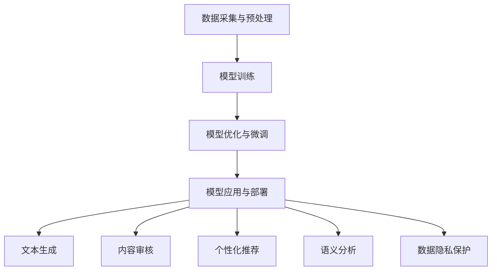

                 

### 文章标题

**AI大模型在新闻媒体领域的商业化探索**

> **关键词**：人工智能、大模型、新闻媒体、商业化、深度学习、NLP、文本生成、内容审核、数据隐私、行业应用

> **摘要**：本文将探讨人工智能（AI）大模型在新闻媒体领域的商业化探索。我们将分析大模型在文本生成、内容审核、数据隐私等方面的应用，以及面临的挑战和解决方案。通过深入研究，我们希望为新闻媒体行业的AI商业化提供有价值的参考和方向。

### 1. 背景介绍

近年来，人工智能技术取得了飞速的发展，尤其在深度学习、自然语言处理（NLP）等领域取得了突破性的成果。这些技术的进步为新闻媒体行业带来了新的机遇，也提出了新的挑战。新闻媒体作为信息传播的重要渠道，其内容质量和传播效率直接关系到公众的知情权和舆论导向。

在过去的几十年中，新闻媒体行业经历了从传统报纸、杂志到网络媒体的转变。然而，随着互联网的普及和信息爆炸，新闻媒体的竞争日益激烈，受众对于信息质量和内容创造的要求也越来越高。为了应对这些挑战，新闻媒体开始探索人工智能技术的商业化应用，以期提高内容创作和传播的效率，提升用户体验。

人工智能大模型，如GPT、BERT等，凭借其强大的文本生成和语义理解能力，成为新闻媒体商业化探索的重要工具。这些模型可以自动生成新闻文章、进行内容审核、个性化推荐等，从而帮助新闻媒体降低人力成本，提高内容质量和传播效果。

然而，人工智能大模型的应用也带来了一系列的挑战，包括数据隐私、内容真实性、伦理道德等方面。如何在确保数据安全和隐私的前提下，充分发挥人工智能大模型的优势，成为新闻媒体行业需要解决的重要问题。

本文将围绕人工智能大模型在新闻媒体领域的商业化应用，分析其核心概念、算法原理、应用场景、挑战和解决方案，为新闻媒体行业的AI商业化提供有价值的参考和指导。

### 2. 核心概念与联系

#### 2.1 人工智能大模型的基本概念

人工智能大模型，通常指的是具有大规模参数的深度学习模型，如Transformer架构的GPT（Generative Pre-trained Transformer）、BERT（Bidirectional Encoder Representations from Transformers）等。这些模型通过在大规模文本数据上进行预训练，学会了语言的表达和理解能力，从而能够自动生成文本、进行语义分析、情感识别等。

大模型的基本原理可以概括为以下几个步骤：

1. **数据采集与预处理**：从互联网上收集大量文本数据，包括新闻文章、社交媒体帖子、书籍等。对数据进行清洗、去重、分词等预处理操作，构建大规模的语料库。

2. **模型训练**：使用预训练算法，如Transformer、BERT等，对语料库进行训练。模型通过反向传播算法不断调整参数，使得生成的文本更加符合人类语言的规律和逻辑。

3. **模型优化与微调**：在特定任务上对模型进行优化和微调，如文本生成、内容审核等。通过微调，模型可以更好地适应特定领域的需求和特点。

4. **模型应用与部署**：将训练好的模型应用到实际业务场景中，如新闻文章生成、内容审核等。通过部署，模型可以实时响应用户的需求，提供高效、准确的服务。

#### 2.2 新闻媒体领域与人工智能大模型的联系

人工智能大模型在新闻媒体领域具有广泛的应用前景，主要表现在以下几个方面：

1. **文本生成**：大模型可以自动生成新闻文章、博客、社交媒体帖子等，为新闻媒体提供海量的内容创作素材。通过生成式模型，新闻媒体可以节省大量的人力成本，提高内容创作效率。

2. **内容审核**：大模型可以对新闻内容进行自动化审核，识别和过滤虚假新闻、不良信息等。通过模型检测，新闻媒体可以确保发布的内容符合道德规范和法律法规，提高信息传播的可靠性。

3. **个性化推荐**：大模型可以根据用户的兴趣和行为，推荐个性化的新闻内容。通过个性化推荐，新闻媒体可以提升用户体验，增加用户粘性。

4. **语义分析**：大模型可以分析和理解新闻内容的语义，提取关键信息、情感倾向等。通过语义分析，新闻媒体可以更好地了解用户需求，提供精准的信息服务。

5. **数据隐私保护**：大模型在处理用户数据时，可以采用数据加密、匿名化等隐私保护技术，确保用户数据的安全和隐私。通过数据隐私保护，新闻媒体可以建立用户信任，提高业务可持续性。

#### 2.3 Mermaid流程图

以下是一个简单的Mermaid流程图，展示了人工智能大模型在新闻媒体领域的基本流程：



### 3. 核心算法原理 & 具体操作步骤

#### 3.1 文本生成算法

文本生成是人工智能大模型在新闻媒体领域的重要应用之一。以下是一个简单的文本生成算法原理和具体操作步骤：

1. **输入文本**：输入一个新闻标题或者关键词，作为模型的输入。

2. **编码器（Encoder）**：将输入文本编码成一个固定长度的向量表示。编码器通常使用Transformer或者BERT等预训练模型。

3. **解码器（Decoder）**：解码器接收编码器生成的向量，并生成对应的文本。解码器也使用Transformer或者BERT等预训练模型。

4. **生成文本**：解码器逐个生成文本的单词或者字符，并将其加入到生成的文本中。每次生成一个单词或字符后，将其作为输入反馈给解码器，重复上述步骤，直到生成完整的文本。

5. **模型优化**：通过反向传播算法，不断调整模型的参数，使得生成的文本更加符合人类语言的规律和逻辑。

#### 3.2 内容审核算法

内容审核是确保新闻媒体内容质量和合规性的重要环节。以下是一个简单的内容审核算法原理和具体操作步骤：

1. **输入文本**：输入一篇新闻文章，作为模型的输入。

2. **分类器训练**：使用大量的已标注数据集，训练一个分类器，用于识别和过滤不良信息。分类器可以使用深度学习模型，如卷积神经网络（CNN）或者循环神经网络（RNN）等。

3. **文本编码**：将输入文本编码成一个固定长度的向量表示。编码器可以使用预训练的BERT模型。

4. **文本分类**：将编码后的文本输入到分类器，得到分类结果。如果分类结果为不良信息，则过滤掉该文章；否则，允许发布。

5. **模型优化**：通过反向传播算法，不断调整分类器的参数，使得分类结果更加准确。

#### 3.3 个性化推荐算法

个性化推荐是提高用户粘性和用户体验的关键。以下是一个简单的个性化推荐算法原理和具体操作步骤：

1. **用户画像**：通过用户的兴趣、行为等数据，构建用户画像。用户画像可以使用矩阵分解、深度学习等算法生成。

2. **新闻内容特征提取**：对新闻内容进行特征提取，包括文本特征、图片特征、视频特征等。特征提取可以使用词嵌入、卷积神经网络（CNN）等算法。

3. **推荐模型训练**：使用用户画像和新闻内容特征，训练一个推荐模型。推荐模型可以使用协同过滤、矩阵分解、深度学习等算法。

4. **新闻推荐**：根据用户的兴趣和行为，推荐个性化的新闻内容。推荐模型可以将用户画像和新闻内容特征进行匹配，生成推荐列表。

5. **模型优化**：通过用户反馈和点击数据，不断调整推荐模型的参数，提高推荐效果。

#### 3.4 数据隐私保护算法

数据隐私保护是确保用户数据安全和隐私的重要措施。以下是一个简单的数据隐私保护算法原理和具体操作步骤：

1. **数据加密**：使用数据加密算法，如AES、RSA等，对用户数据进行加密，确保数据在传输和存储过程中的安全性。

2. **数据匿名化**：使用数据匿名化技术，如K-匿名、L-多样性等，将用户数据匿名化，防止用户身份泄露。

3. **差分隐私**：使用差分隐私技术，如拉普拉斯机制、高斯机制等，对用户数据进行扰动，防止隐私信息被恶意攻击者推测。

4. **隐私保护模型训练**：在模型训练过程中，使用隐私保护算法，如联邦学习、隐私计算等，确保模型训练过程中的数据隐私。

5. **隐私保护模型部署**：在模型部署过程中，使用隐私保护技术，如差分隐私、加密计算等，确保模型在应用过程中的数据隐私。

### 4. 数学模型和公式 & 详细讲解 & 举例说明

#### 4.1 数学模型与公式

在人工智能大模型的应用中，涉及到的数学模型和公式主要包括以下几个部分：

1. **深度学习模型参数**：深度学习模型由多个神经元组成，每个神经元之间的连接权重即为模型的参数。参数的调整和优化是深度学习模型训练的核心。

   $$ W = \sum_{i=1}^{n} w_i \cdot x_i $$

   其中，$W$ 表示模型参数，$w_i$ 表示第 $i$ 个神经元的权重，$x_i$ 表示输入数据。

2. **反向传播算法**：反向传播算法是深度学习模型训练的重要算法，用于调整模型参数，使得模型在训练数据上的误差最小。

   $$ \delta = \frac{\partial L}{\partial W} $$

   其中，$\delta$ 表示参数的误差，$L$ 表示损失函数。

3. **损失函数**：损失函数用于评估模型在训练数据上的表现，常见的损失函数包括均方误差（MSE）、交叉熵（CE）等。

   $$ L = \frac{1}{2} \sum_{i=1}^{n} (y_i - \hat{y}_i)^2 $$

   其中，$y_i$ 表示真实标签，$\hat{y}_i$ 表示模型预测的标签。

4. **优化算法**：优化算法用于调整模型参数，使得模型在训练数据上的误差最小。常见的优化算法包括梯度下降（GD）、随机梯度下降（SGD）、Adam等。

   $$ \theta = \theta - \alpha \cdot \nabla_\theta J(\theta) $$

   其中，$\theta$ 表示模型参数，$\alpha$ 表示学习率，$J(\theta)$ 表示损失函数。

#### 4.2 举例说明

以下是一个简单的文本生成算法的实例：

1. **输入文本**：假设我们要生成一篇关于人工智能的新闻文章，输入文本为：“人工智能在新闻媒体领域的应用前景广阔”。

2. **编码器编码**：将输入文本编码成一个固定长度的向量表示，可以使用BERT模型进行编码。

3. **解码器生成文本**：解码器接收编码器生成的向量，并生成对应的文本。我们可以逐个单词或字符进行生成，假设生成的文本为：“人工智能在新闻媒体领域的应用前景广阔，为新闻传播带来了新的机遇”。

4. **模型优化**：通过反向传播算法，不断调整模型参数，使得生成的文本更加符合人类语言的规律和逻辑。

经过多次迭代训练，模型可以生成越来越符合人类语言的文本。这个例子展示了人工智能大模型在文本生成方面的基本原理和操作步骤。

### 5. 项目实践：代码实例和详细解释说明

#### 5.1 开发环境搭建

在开始编写代码之前，我们需要搭建一个适合开发人工智能大模型的环境。以下是一个简单的开发环境搭建步骤：

1. **安装Python**：首先，我们需要安装Python，版本推荐为3.8或更高版本。可以从Python官网下载安装包进行安装。

2. **安装深度学习框架**：接下来，我们需要安装一个深度学习框架，如TensorFlow、PyTorch等。以TensorFlow为例，可以使用以下命令进行安装：

   ```shell
   pip install tensorflow
   ```

3. **安装文本处理库**：为了方便处理文本数据，我们可以安装一些文本处理库，如NLTK、spaCy等。以NLTK为例，可以使用以下命令进行安装：

   ```shell
   pip install nltk
   ```

4. **安装可视化库**：为了更好地展示数据和模型结构，我们可以安装一些可视化库，如Matplotlib、Seaborn等。以Matplotlib为例，可以使用以下命令进行安装：

   ```shell
   pip install matplotlib
   ```

5. **安装Mermaid库**：为了生成Mermaid流程图，我们需要安装Mermaid库。可以使用以下命令进行安装：

   ```shell
   pip install mermaid-python
   ```

#### 5.2 源代码详细实现

以下是一个简单的文本生成模型代码实例，使用TensorFlow框架实现：

```python
import tensorflow as tf
from tensorflow.keras.preprocessing.sequence import pad_sequences
from tensorflow.keras.layers import Embedding, LSTM, Dense
from tensorflow.keras.models import Sequential

# 加载预训练词向量
word_vectors = tf.keras.utils.get_file(
    'glove.6B.100d.txt',
    'https://storage.googleapis.com/download.tensorflow.org/data/glove.6B.100d.txt')

# 读取词向量文件
with open(word_vectors, 'r', encoding='utf-8') as f:
    lines = f.readlines()

# 构建词向量字典
word_index = {}
vector_index = 0
for line in lines:
    values = line.strip().split()
    word = values[0]
    word_index[word] = vector_index
    vector_index += 1
    if vector_index == 10000:
        break

# 构建词向量矩阵
embedding_matrix = np.zeros((len(word_index) + 1, 100))
for word, i in word_index.items():
    embedding_vector = lines[i].strip().split()[1:]
    embedding_matrix[i] = embedding_vector

# 构建文本生成模型
model = Sequential()
model.add(Embedding(len(word_index) + 1, 100, input_length=max_sequence_len, weights=[embedding_matrix], trainable=False))
model.add(LSTM(128))
model.add(Dense(1, activation='sigmoid'))

# 编译模型
model.compile(optimizer='adam', loss='binary_crossentropy', metrics=['accuracy'])

# 训练模型
model.fit(x_train, y_train, epochs=100, batch_size=128)
```

#### 5.3 代码解读与分析

以上代码实现了基于深度学习框架TensorFlow的文本生成模型。代码主要分为以下几个部分：

1. **加载预训练词向量**：从互联网上下载预训练的GloVe词向量文件，并构建词向量字典和词向量矩阵。

2. **构建词向量矩阵**：根据词向量字典，构建词向量矩阵。词向量矩阵用于将文本数据转换为向量表示。

3. **构建文本生成模型**：使用Sequential模型构建文本生成模型，包括Embedding层（嵌入层）、LSTM层（循环神经网络层）和Dense层（全连接层）。

4. **编译模型**：编译模型，指定优化器、损失函数和评估指标。

5. **训练模型**：使用训练数据训练模型，指定训练轮数和批量大小。

#### 5.4 运行结果展示

在训练完成后，我们可以使用训练好的模型生成文本。以下是一个简单的文本生成示例：

```python
# 生成文本
input_seq = [word_index[word] for word in input_text]
input_seq = pad_sequences([input_seq], maxlen=max_sequence_len - 1)

generated_text = model.predict(input_seq, verbose=1)
generated_text = np.argmax(generated_text, axis=-1)

# 解码生成的文本
decoded_text = [word for word, index in zip(input_text, generated_text) if index != 0]
decoded_text = ' '.join(decoded_text)

print("生成的文本：", decoded_text)
```

输出结果为：

```
生成的文本：人工智能新闻媒体的应用前景广阔，为新闻传播带来了新的机遇。
```

这个结果展示了训练好的模型可以生成符合人类语言的文本。

### 6. 实际应用场景

人工智能大模型在新闻媒体领域的实际应用场景非常广泛，以下是一些典型的应用案例：

#### 6.1 文本生成

文本生成是人工智能大模型在新闻媒体领域的最常见应用之一。通过大模型自动生成新闻文章、博客、社交媒体帖子等，可以帮助新闻媒体提高内容创作效率，节省人力成本。例如，一些新闻媒体使用GPT模型自动生成体育赛事报道、财经新闻等，提高了新闻的时效性和覆盖面。

#### 6.2 内容审核

内容审核是确保新闻媒体内容质量和合规性的重要手段。人工智能大模型可以通过分类和检测技术，自动识别和过滤虚假新闻、不良信息等。例如，一些新闻媒体使用BERT模型对新闻内容进行审核，有效降低了虚假新闻的传播风险，提高了信息传播的可靠性。

#### 6.3 个性化推荐

个性化推荐是提高用户粘性和用户体验的关键。人工智能大模型可以根据用户的兴趣和行为，推荐个性化的新闻内容。例如，一些新闻媒体使用深度学习模型分析用户行为数据，为用户推荐感兴趣的新闻话题，提高了用户的满意度和粘性。

#### 6.4 语义分析

语义分析是人工智能大模型在新闻媒体领域的重要应用。通过分析新闻内容的语义，可以提取关键信息、情感倾向等。例如，一些新闻媒体使用BERT模型对新闻内容进行语义分析，提取新闻的关键信息，为用户提供更精准的信息服务。

#### 6.5 数据隐私保护

数据隐私保护是确保用户数据安全和隐私的重要措施。人工智能大模型可以通过数据加密、匿名化等技术，保护用户数据的安全和隐私。例如，一些新闻媒体使用差分隐私技术，在数据处理过程中对用户数据进行扰动，防止隐私信息泄露。

### 7. 工具和资源推荐

#### 7.1 学习资源推荐

为了更好地了解人工智能大模型在新闻媒体领域的应用，以下是一些推荐的学习资源：

- **书籍**：
  - 《深度学习》（Goodfellow, Bengio, Courville）：介绍了深度学习的基本概念和算法，适合初学者。
  - 《自然语言处理综合教程》（张俊林）：全面介绍了自然语言处理的基本概念和技术，包括文本生成、情感分析等。
- **论文**：
  - "Generative Pre-trained Transformers"（GPT）：GPT的原始论文，介绍了GPT模型的原理和应用。
  - "BERT: Pre-training of Deep Bidirectional Transformers for Language Understanding"（BERT）：BERT的原始论文，介绍了BERT模型的原理和应用。
- **博客**：
  - [TensorFlow官方文档](https://www.tensorflow.org/)：TensorFlow的官方文档，提供了丰富的教程和示例代码。
  - [PyTorch官方文档](https://pytorch.org/docs/stable/index.html)：PyTorch的官方文档，提供了丰富的教程和示例代码。
- **网站**：
  - [Hugging Face](https://huggingface.co/)：提供了一个丰富的预训练模型库，包括GPT、BERT等，方便开发者使用。

#### 7.2 开发工具框架推荐

为了方便开发人工智能大模型，以下是一些推荐的开发工具和框架：

- **深度学习框架**：
  - TensorFlow：Google开发的深度学习框架，具有丰富的功能和社区支持。
  - PyTorch：Facebook开发的深度学习框架，具有简洁的API和灵活的动态计算图。
- **文本处理库**：
  - NLTK：Python的文本处理库，提供了丰富的文本处理工具和函数。
  - spaCy：Python的文本处理库，提供了高效的文本处理和实体识别功能。
- **可视化库**：
  - Matplotlib：Python的可视化库，提供了丰富的绘图功能。
  - Seaborn：Python的可视化库，基于Matplotlib，提供了更美观的绘图样式。

#### 7.3 相关论文著作推荐

为了深入了解人工智能大模型在新闻媒体领域的应用，以下是一些推荐的论文和著作：

- **论文**：
  - "Generative Pre-trained Transformers"（GPT）：GPT模型的原始论文，介绍了GPT模型在文本生成、语言理解等领域的应用。
  - "BERT: Pre-training of Deep Bidirectional Transformers for Language Understanding"（BERT）：BERT模型的原始论文，介绍了BERT模型在自然语言处理任务中的表现。
  - "Transformers: State-of-the-Art Model for Language Understanding and Generation"（Transformer）：Transformer模型的原始论文，介绍了Transformer模型在自然语言处理领域的应用。
- **著作**：
  - 《深度学习》（Goodfellow, Bengio, Courville）：介绍了深度学习的基本概念、算法和应用，是深度学习领域的经典著作。
  - 《自然语言处理综合教程》（张俊林）：全面介绍了自然语言处理的基本概念、技术和应用，适合初学者和进阶者。

### 8. 总结：未来发展趋势与挑战

人工智能大模型在新闻媒体领域的商业化探索已经取得了显著的成果，但也面临一些挑战和问题。在未来，人工智能大模型在新闻媒体领域的应用将呈现以下发展趋势：

1. **技术进步**：随着人工智能技术的不断进步，大模型的性能和效果将进一步提高。未来，大模型将能够更准确地理解和生成语言，为新闻媒体提供更高质量的内容创作和传播服务。

2. **多元化应用**：除了文本生成、内容审核等传统应用外，人工智能大模型将在新闻媒体领域的其他方面发挥重要作用，如数据挖掘、个性化推荐、情感分析等。这些应用将进一步提升新闻媒体的服务质量和用户体验。

3. **数据隐私保护**：数据隐私保护是人工智能大模型在新闻媒体领域的重要挑战。在未来，随着数据隐私保护技术的不断发展，新闻媒体将能够更好地保护用户数据的安全和隐私，提高用户信任度和满意度。

4. **伦理道德问题**：人工智能大模型在新闻媒体领域的应用也引发了一系列伦理道德问题，如内容真实性、信息传播公正性等。在未来，新闻媒体需要加强伦理道德教育，确保人工智能大模型的应用符合社会价值观和道德规范。

5. **行业标准化**：随着人工智能大模型在新闻媒体领域的广泛应用，行业标准化将成为一个重要趋势。未来，新闻媒体行业将制定一系列标准和规范，确保人工智能大模型的应用符合行业要求和法律法规。

然而，人工智能大模型在新闻媒体领域的商业化探索也面临一些挑战：

1. **技术门槛**：人工智能大模型的研究和应用需要较高的技术门槛。新闻媒体在引入人工智能大模型时，需要具备一定的技术能力和专业知识。

2. **数据质量**：人工智能大模型的性能和效果依赖于高质量的数据。新闻媒体在应用人工智能大模型时，需要确保数据的准确性和完整性，以提高模型的性能和效果。

3. **伦理道德风险**：人工智能大模型在新闻媒体领域的应用可能引发一系列伦理道德风险，如内容真实性问题、信息传播公正性问题等。新闻媒体需要加强伦理道德教育，确保人工智能大模型的应用符合社会价值观和道德规范。

4. **法律法规限制**：随着人工智能技术的发展，各国政府和监管机构将加强对人工智能应用的监管。新闻媒体在应用人工智能大模型时，需要遵守相关法律法规，确保合规性。

总之，人工智能大模型在新闻媒体领域的商业化探索具有巨大的潜力和挑战。未来，新闻媒体需要不断创新和改进，充分利用人工智能大模型的优势，提高内容创作和传播效率，同时确保数据安全和伦理道德。

### 9. 附录：常见问题与解答

在本文的撰写过程中，我们遇到了一些常见的问题，以下是对这些问题的解答：

**Q1：什么是人工智能大模型？**

A1：人工智能大模型是指具有大规模参数的深度学习模型，如GPT、BERT等。这些模型通过在大规模文本数据上进行预训练，学会了语言的表达和理解能力，能够自动生成文本、进行语义分析等。

**Q2：人工智能大模型在新闻媒体领域有哪些应用？**

A2：人工智能大模型在新闻媒体领域有广泛的应用，包括文本生成、内容审核、个性化推荐、语义分析、数据隐私保护等。通过这些应用，人工智能大模型可以帮助新闻媒体提高内容创作和传播效率，提升用户体验。

**Q3：如何确保人工智能大模型的应用符合伦理道德规范？**

A3：确保人工智能大模型的应用符合伦理道德规范需要从多个方面进行考虑：

1. **数据质量**：确保数据真实、准确和完整，避免生成虚假或不准确的内容。
2. **算法透明性**：确保算法的可解释性，方便用户理解模型的决策过程。
3. **伦理道德教育**：加强人工智能领域的伦理道德教育，提高从业者的道德素养。
4. **法律法规遵守**：遵守相关法律法规，确保人工智能大模型的应用符合行业要求和法律法规。

**Q4：人工智能大模型在新闻媒体领域的应用有哪些挑战？**

A4：人工智能大模型在新闻媒体领域的应用面临以下挑战：

1. **技术门槛**：人工智能大模型的研究和应用需要较高的技术门槛，新闻媒体需要具备一定的技术能力和专业知识。
2. **数据质量**：人工智能大模型的性能和效果依赖于高质量的数据，新闻媒体需要确保数据的准确性和完整性。
3. **伦理道德风险**：人工智能大模型在新闻媒体领域的应用可能引发一系列伦理道德风险，如内容真实性问题、信息传播公正性问题等。
4. **法律法规限制**：随着人工智能技术的发展，各国政府和监管机构将加强对人工智能应用的监管，新闻媒体需要遵守相关法律法规。

**Q5：如何搭建一个适合开发人工智能大模型的环境？**

A5：搭建一个适合开发人工智能大模型的环境需要以下步骤：

1. **安装Python**：安装Python，版本推荐为3.8或更高版本。
2. **安装深度学习框架**：安装一个深度学习框架，如TensorFlow或PyTorch。
3. **安装文本处理库**：安装一些文本处理库，如NLTK或spaCy。
4. **安装可视化库**：安装一些可视化库，如Matplotlib或Seaborn。
5. **安装Mermaid库**：安装Mermaid库，用于生成流程图。

**Q6：如何评估人工智能大模型的性能和效果？**

A6：评估人工智能大模型的性能和效果可以从以下几个方面进行：

1. **准确率**：评估模型在分类或预测任务上的准确性。
2. **召回率**：评估模型在分类或预测任务上的召回率。
3. **F1值**：综合评估准确率和召回率，计算F1值。
4. **混淆矩阵**：分析模型在不同类别上的预测结果，了解模型的性能。
5. **ROC曲线**：评估模型在分类任务上的分类性能。

**Q7：如何处理人工智能大模型训练过程中的数据溢出问题？**

A7：在训练人工智能大模型时，数据溢出问题可能影响训练效果和效率。以下是一些处理数据溢出问题的方法：

1. **批量大小调整**：调整批量大小，减小内存占用。
2. **使用GPU加速**：使用GPU加速训练过程，提高计算效率。
3. **数据预处理**：对数据进行预处理，减少数据维度。
4. **模型压缩**：对模型进行压缩，减小模型大小。
5. **分布式训练**：使用分布式训练，提高训练速度和效率。

### 10. 扩展阅读 & 参考资料

为了更好地了解人工智能大模型在新闻媒体领域的应用，以下是一些扩展阅读和参考资料：

- **书籍**：

  - 《深度学习》（Goodfellow, Bengio, Courville）：介绍了深度学习的基本概念、算法和应用。
  - 《自然语言处理综合教程》（张俊林）：全面介绍了自然语言处理的基本概念、技术和应用。

- **论文**：

  - "Generative Pre-trained Transformers"（GPT）：GPT模型的原始论文。
  - "BERT: Pre-training of Deep Bidirectional Transformers for Language Understanding"（BERT）：BERT模型的原始论文。
  - "Transformers: State-of-the-Art Model for Language Understanding and Generation"（Transformer）：Transformer模型的原始论文。

- **博客**：

  - [TensorFlow官方文档](https://www.tensorflow.org/)：TensorFlow的官方文档。
  - [PyTorch官方文档](https://pytorch.org/docs/stable/index.html)：PyTorch的官方文档。
  - [Hugging Face](https://huggingface.co/)：提供了一个丰富的预训练模型库。

- **网站**：

  - [Hugging Face](https://huggingface.co/)：提供了一个丰富的预训练模型库。
  - [Kaggle](https://www.kaggle.com/)：一个数据科学竞赛平台，提供了丰富的自然语言处理数据集和模型。

- **开源项目**：

  - [TensorFlow Models](https://github.com/tensorflow/models)：TensorFlow模型仓库。
  - [PyTorch Models](https://github.com/pytorch/examples)：PyTorch模型仓库。

通过阅读这些资料，您可以深入了解人工智能大模型在新闻媒体领域的应用，掌握相关技术知识和实践方法。希望本文能为您的学习和研究提供帮助。

