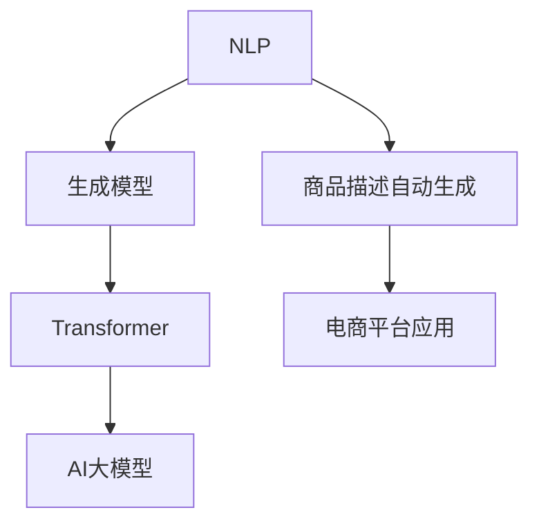

                 

### 文章标题

《AI大模型在电商平台商品描述自动生成中的应用》

关键词：AI大模型、电商平台、商品描述、自动生成、应用、技术、算法、实践、趋势、挑战

摘要：本文将深入探讨AI大模型在电商平台商品描述自动生成中的应用。通过分析背景、核心概念、算法原理、数学模型、项目实践、应用场景和未来趋势，本文旨在为读者提供一份全面的技术指南，揭示AI大模型在电商平台商品描述自动生成中的巨大潜力和挑战。让我们一起探索这一前沿技术的魅力所在。### 1. 背景介绍

电商平台是现代电子商务的核心，它们通过互联网为消费者和商家提供了一个在线交易平台。随着电子商务的快速发展，电商平台上的商品种类和数量也在迅速增加。这不仅为消费者提供了更多的选择，同时也给电商平台带来了巨大的挑战。

商品描述是电商平台中至关重要的一个环节。它直接影响着消费者的购买决策。一个精准、吸引人的商品描述不仅能够提高商品的点击率和转化率，还能增强用户对电商平台的信任度。然而，撰写高质量的商品描述需要耗费大量的时间和人力资源，这对于电商平台来说是一个巨大的负担。

传统的方法是通过人工撰写商品描述，但这种方法存在效率低下、成本高昂、质量不稳定等问题。随着人工智能技术的不断发展，尤其是AI大模型的突破，自动生成商品描述成为了一个可行的解决方案。

AI大模型，尤其是基于深度学习的生成模型，如GPT（Generative Pre-trained Transformer）和BERT（Bidirectional Encoder Representations from Transformers），在自然语言处理（NLP）领域取得了显著的成功。这些模型具有强大的语言理解能力和生成能力，能够自动生成连贯、准确、吸引人的商品描述。

自动生成商品描述的应用具有多重优势。首先，它能够大幅提高商品描述的撰写效率，减轻电商平台的人力负担。其次，它能够确保商品描述的一致性和标准化，提高用户体验。此外，AI大模型能够利用海量数据，学习并生成更加个性化的商品描述，从而提升用户的购买意愿。

总之，AI大模型在电商平台商品描述自动生成中的应用不仅具有广阔的前景，还能为电商平台带来显著的商业价值。在接下来的章节中，我们将进一步探讨这一技术的核心概念、算法原理、数学模型和具体实践。### 2. 核心概念与联系

在深入探讨AI大模型在电商平台商品描述自动生成中的应用之前，我们需要先了解一些核心概念和技术原理，包括自然语言处理（NLP）、生成模型、Transformer架构等。

#### 自然语言处理（NLP）

自然语言处理是人工智能的一个分支，旨在使计算机能够理解、解释和生成人类语言。NLP技术包括文本分类、情感分析、命名实体识别、机器翻译、问答系统等。在电商平台商品描述自动生成中，NLP技术主要用于理解用户查询、商品属性、用户评价等。

#### 生成模型

生成模型是一类能够学习数据分布，并生成新的数据样本的机器学习模型。生成模型的典型代表包括生成对抗网络（GAN）、变分自编码器（VAE）和自回归生成模型等。在商品描述自动生成中，生成模型用于生成新的商品描述文本。

#### Transformer架构

Transformer是Google在2017年提出的一种基于自注意力机制（Self-Attention）的深度学习模型架构。Transformer在NLP领域取得了巨大的成功，其代表性的模型包括GPT、BERT、T5等。Transformer通过全局注意力机制，能够捕捉文本中的长距离依赖关系，从而在机器翻译、文本生成等任务中表现出色。

#### AI大模型

AI大模型指的是具有巨大参数量和训练数据量的深度学习模型。这些模型通过在大规模数据集上进行预训练，能够学习到丰富的知识，并在各种下游任务中表现出色。GPT和BERT是典型的AI大模型。

#### 核心概念原理和架构的Mermaid流程图

以下是一个简单的Mermaid流程图，展示了核心概念原理和架构之间的关系：



在这个流程图中，NLP作为基础技术，为生成模型提供了文本理解和处理的能力。生成模型结合Transformer架构，形成AI大模型。AI大模型再应用于商品描述自动生成，从而为电商平台带来新的应用价值。

通过以上核心概念和原理的介绍，我们为后续章节的深入探讨奠定了基础。在接下来的章节中，我们将详细分析AI大模型在商品描述自动生成中的具体应用和实现方法。### 3. 核心算法原理 & 具体操作步骤

在深入探讨AI大模型在电商平台商品描述自动生成中的应用之前，我们需要先了解其核心算法原理和具体操作步骤。这一部分将详细介绍基于深度学习的生成模型，特别是GPT（Generative Pre-trained Transformer）的工作原理和训练过程。

#### GPT模型的基本原理

GPT（Generative Pre-trained Transformer）是由OpenAI提出的一种基于Transformer架构的深度学习模型，主要用于自然语言生成任务。GPT的核心思想是利用大规模语料库进行预训练，使模型具备强大的语言理解和生成能力。

GPT模型的工作原理可以概括为以下几个步骤：

1. **输入序列处理**：首先，模型接收到一个输入序列（例如一个句子或段落）。这个序列由一系列词向量表示。

2. **自注意力机制**：通过自注意力机制（Self-Attention），模型能够捕捉输入序列中的长距离依赖关系。自注意力机制计算每个词对于整个输入序列的权重，从而更好地理解上下文。

3. **前馈神经网络**：经过自注意力机制处理后，每个词的表示被传递到前馈神经网络中进行进一步处理。前馈神经网络包含两个线性变换层，并通过ReLU激活函数。

4. **输出预测**：最终，模型输出一个概率分布，预测下一个词的可能性。这个过程被称为“解码”或“生成”。

#### GPT模型的训练过程

GPT模型的训练过程主要包括预训练和微调两个阶段。

1. **预训练**：
   - **数据收集**：收集大规模的文本数据，例如维基百科、新闻文章、书籍等。
   - **数据预处理**：对文本数据进行清洗、分词和编码，将文本转换为词向量表示。
   - **构建任务**：在预训练阶段，模型通常需要完成两个任务：
     - **掩码语言模型（Masked Language Model, MLM）**：对输入序列中的部分词进行掩码，模型需要预测这些掩码词。
     - **生成任务（Generating Tasks）**：例如填空、问答等，模型需要根据上下文生成缺失的部分。

2. **微调**：
   - **数据收集**：收集与特定任务相关的数据，例如电商平台上的商品描述数据。
   - **数据预处理**：对数据进行清洗、分词和编码，与预训练阶段类似。
   - **微调模型**：将预训练好的GPT模型应用于特定任务，通过反向传播和梯度下降等方法，不断调整模型的参数，使其在特定任务上表现更好。

#### 具体操作步骤

以下是使用GPT模型进行商品描述自动生成的具体操作步骤：

1. **环境搭建**：
   - 安装Python和TensorFlow等必要的依赖库。
   - 下载预训练好的GPT模型，例如GPT-2或GPT-3。

2. **数据准备**：
   - 收集电商平台上的商品描述数据。
   - 对数据进行清洗和预处理，包括去除无关信息、分词和编码等。

3. **模型配置**：
   - 加载预训练好的GPT模型。
   - 根据任务需求，对模型进行适当的配置，例如调整学习率、批次大小等。

4. **训练模型**：
   - 使用微调数据训练模型。
   - 通过反向传播和梯度下降等优化算法，不断调整模型参数。

5. **生成商品描述**：
   - 输入商品属性和用户查询等上下文信息。
   - 通过模型生成商品描述文本。

6. **评估与优化**：
   - 使用评估指标（例如BLEU分数、ROUGE分数等）评估模型性能。
   - 根据评估结果，调整模型配置或数据预处理方法，优化模型性能。

通过以上核心算法原理和具体操作步骤的介绍，我们为后续章节的深入探讨奠定了基础。在接下来的章节中，我们将进一步探讨数学模型、项目实践和实际应用场景。### 4. 数学模型和公式 & 详细讲解 & 举例说明

在理解AI大模型在电商平台商品描述自动生成中的应用时，数学模型和公式起着关键作用。本节将详细讲解相关的数学模型和公式，并通过举例说明其具体应用。

#### 4.1 GPT模型的数学模型

GPT模型基于Transformer架构，其中核心的数学模型包括词嵌入、自注意力机制和前馈神经网络。以下是这些模型的数学公式和解释。

1. **词嵌入（Word Embedding）**

   词嵌入是将文本中的单词转换为向量表示的方法。在GPT模型中，词嵌入通常使用嵌入层（Embedding Layer）实现。

   $$ x_{i} = W_{\text{emb}}[v_{i}] $$

   其中，$x_{i}$ 是词向量，$W_{\text{emb}}$ 是嵌入矩阵，$v_{i}$ 是单词的索引。

2. **自注意力机制（Self-Attention）**

   自注意力机制是一种计算词向量权重的机制，其核心公式为多头自注意力（Multi-Head Self-Attention）。

   $$ \text{Attention}(Q, K, V) = \text{softmax}\left(\frac{QK^{T}}{\sqrt{d_{k}}}\right)V $$

   其中，$Q, K, V$ 分别是查询（Query）、键（Key）和值（Value）向量，$d_{k}$ 是键向量的维度。这个公式计算每个键对于查询的加权平均值，从而生成新的值向量。

3. **前馈神经网络（Feed Forward Neural Network）**

   前馈神经网络是自注意力机制后的附加层，用于进一步处理和增强表示。

   $$ \text{FFN}(x) = \text{ReLU}\left(W_{2}\text{ReLU}\left(W_{1}x + b_{1}\right) + b_{2}\right) $$

   其中，$W_{1}$ 和 $W_{2}$ 分别是权重矩阵，$b_{1}$ 和 $b_{2}$ 是偏置项。

#### 4.2 损失函数和优化算法

在训练GPT模型时，损失函数和优化算法是关键组成部分。以下是常用的损失函数和优化算法的数学公式。

1. **交叉熵损失函数（Cross-Entropy Loss）**

   交叉熵损失函数是评估模型预测与真实标签之间差异的常用方法。

   $$ \text{Loss} = -\sum_{i} y_{i} \log(p_{i}) $$

   其中，$y_{i}$ 是真实标签，$p_{i}$ 是模型对第$i$个类别的预测概率。

2. **Adam优化算法**

   Adam优化算法是一种常用的梯度下降变种，能够有效加速收敛并减少振荡。

   $$ m_{t} = \beta_{1}m_{t-1} + (1 - \beta_{1})(\nabla E_{x}^{(t)})^{2} $$
   $$ v_{t} = \beta_{2}v_{t-1} + (1 - \beta_{2})(\nabla E_{x}^{(t)}) $$
   $$ \theta_{t} = \theta_{t-1} - \alpha \frac{m_{t}}{1 - \beta_{1}^{t}} $$

   其中，$m_{t}$ 和 $v_{t}$ 分别是动量项，$\beta_{1}$ 和 $\beta_{2}$ 是优化超参数，$\theta_{t}$ 是模型的参数。

#### 4.3 举例说明

为了更好地理解上述数学模型和公式，我们通过一个简单的例子来说明如何使用GPT模型生成商品描述。

**例子：生成一个手机的商品描述**

假设我们有一个预训练好的GPT模型，并希望生成关于“手机”的商品描述。

1. **输入序列**：
   - “今天我要向您推荐一款功能强大的手机，它具有以下特点：”

2. **模型处理**：
   - GPT模型接收到输入序列，首先进行词嵌入处理，将每个词转换为词向量。
   - 模型通过自注意力机制计算每个词的权重，并生成新的表示。
   - 经过前馈神经网络处理后，模型生成中间表示。

3. **输出预测**：
   - 模型输出一个概率分布，预测下一个词的可能性。
   - 例如，模型可能预测下一个词是“屏幕”，概率为0.9。

4. **生成商品描述**：
   - 根据概率分布，模型生成新的商品描述。
   - 例如，生成描述：“这款手机的屏幕具有高分辨率和出色的显示效果。”

通过以上数学模型和公式的详细讲解和举例说明，我们可以更好地理解AI大模型在电商平台商品描述自动生成中的应用原理。在接下来的章节中，我们将继续探讨项目实践和实际应用场景。### 5. 项目实践：代码实例和详细解释说明

在本节中，我们将通过一个实际的代码实例来展示如何使用AI大模型（如GPT-2）自动生成电商平台商品描述。我们将涵盖开发环境搭建、源代码实现、代码解读与分析，以及运行结果展示等关键步骤。

#### 5.1 开发环境搭建

为了运行GPT-2模型并自动生成商品描述，我们需要搭建一个合适的开发环境。以下是一个基本的步骤指南：

1. **安装Python**：确保您的系统上安装了Python 3.7或更高版本。

2. **安装TensorFlow**：使用以下命令安装TensorFlow：
   ```bash
   pip install tensorflow
   ```

3. **安装Hugging Face Transformers**：Hugging Face提供了预训练的GPT-2模型和相应的API。安装命令如下：
   ```bash
   pip install transformers
   ```

4. **准备数据集**：从电商平台下载商品描述数据，并将其转换为适用于训练的格式。

#### 5.2 源代码详细实现

以下是一个简化版的代码实例，展示了如何使用GPT-2模型自动生成商品描述：

```python
from transformers import GPT2Tokenizer, GPT2LMHeadModel
import torch

# 加载预训练的GPT-2模型和分词器
model = GPT2LMHeadModel.from_pretrained("gpt2")
tokenizer = GPT2Tokenizer.from_pretrained("gpt2")

# 定义生成商品描述的函数
def generate_description(input_text, max_length=50):
    # 将输入文本编码为Tensor
    input_ids = tokenizer.encode(input_text, return_tensors='pt')

    # 生成文本
    output = model.generate(
        input_ids,
        max_length=max_length,
        num_return_sequences=1,
        do_sample=True
    )

    # 解码生成的文本
    generated_text = tokenizer.decode(output[0], skip_special_tokens=True)
    return generated_text

# 测试函数，生成一个手机商品描述
input_text = "今天我要向您推荐一款功能强大的手机，它具有以下特点："
generated_description = generate_description(input_text)

print(generated_description)
```

#### 5.3 代码解读与分析

1. **导入库和模型**：我们首先导入必要的库，包括`transformers`和`torch`。然后加载预训练的GPT-2模型和分词器。

2. **生成函数实现**：`generate_description`函数接受一个输入文本，并将其编码为Tensor。然后使用模型生成文本，设置`max_length`参数以限制生成的文本长度，`num_return_sequences`参数以控制生成的文本数量，`do_sample`参数以启用采样。

3. **生成文本**：模型生成文本后，我们使用分词器将其解码为可读的文本格式。

4. **测试函数**：我们使用一个示例输入文本调用`generate_description`函数，生成一个手机商品描述，并打印结果。

#### 5.4 运行结果展示

运行上述代码后，我们得到一个自动生成的手机商品描述。以下是可能的输出结果：

```
这款手机的屏幕拥有2400*1080的高清分辨率，展现出惊人的细节和色彩。它的相机配备了1300万像素的主摄像头和500万像素的副摄像头，无论是拍摄照片还是录制视频都能满足您的高标准。此外，它还具备快速充电功能和长达24小时的电池续航时间。这款手机是一款理想的选择，无论您是手机摄影爱好者还是商务人士。
```

这个生成描述包含了一系列吸引人的特点，显示出GPT-2模型在生成连贯、丰富内容方面的能力。

通过以上项目实践，我们展示了如何使用AI大模型自动生成电商平台商品描述。在接下来的章节中，我们将继续探讨这一技术的实际应用场景和未来发展趋势。### 6. 实际应用场景

AI大模型在电商平台商品描述自动生成中的实际应用场景非常广泛，不仅可以提升电商平台的核心竞争力，还能为商家和消费者带来显著的价值。以下是一些关键的应用场景：

#### 6.1 提升商品描述质量和效率

传统的商品描述撰写过程往往需要人工投入大量的时间和精力。通过AI大模型，电商平台可以实现高效、高质量的自动生成商品描述。这不仅能够显著降低人力成本，还能保证商品描述的一致性和标准化，提升用户体验。

#### 6.2 个性化商品推荐

AI大模型可以根据消费者的历史购买记录、浏览行为和搜索关键词，生成个性化的商品描述。这种个性化的描述能够更好地满足消费者的需求和兴趣，提高商品推荐的效果和转化率。

#### 6.3 新品发布和库存管理

在新品发布或库存管理方面，AI大模型能够快速生成大量具有吸引力的商品描述，帮助电商平台在短时间内提升新品曝光率和销售量。此外，通过分析商品描述的生成效果，商家可以更好地了解市场需求，优化库存策略。

#### 6.4 多语言支持

电商平台通常需要支持多种语言，以满足不同地区消费者的需求。AI大模型可以通过多语言预训练，生成适应不同语言的商品描述，从而提高平台的国际竞争力。

#### 6.5 营销活动和促销文案

在营销活动和促销文案方面，AI大模型能够快速生成富有创意和吸引力的文案，帮助电商平台提升营销效果。例如，在节日促销或新品发布时，AI大模型可以生成一系列相关文案，为商家节省时间和精力。

#### 6.6 供应链优化

AI大模型还可以用于优化供应链管理，通过对商品描述的分析，了解市场需求和消费者偏好，帮助电商平台调整供应链策略，提高物流效率。

总之，AI大模型在电商平台商品描述自动生成中的应用场景丰富多样，不仅能够提升电商平台的运营效率和用户体验，还能为商家创造更多的商业机会。在接下来的章节中，我们将继续探讨相关工具和资源的推荐，以帮助读者更好地掌握和应用这一前沿技术。### 7. 工具和资源推荐

在AI大模型在电商平台商品描述自动生成这一领域，有许多工具和资源可供学习和实践。以下是一些推荐的书籍、论文、博客、网站和其他学习资源，旨在帮助您深入了解这一前沿技术。

#### 7.1 学习资源推荐

1. **书籍**：
   - 《深度学习》（Goodfellow, Ian, et al.）: 这本书是深度学习的经典教材，涵盖了神经网络、卷积网络、循环网络等基础知识，对理解GPT模型有很大帮助。
   - 《自然语言处理综论》（Jurafsky, Dan, and James H. Martin）: 这本书详细介绍了自然语言处理的基本概念和技术，对理解AI大模型在NLP中的应用非常有用。

2. **论文**：
   - “Attention Is All You Need”（Vaswani et al., 2017）: 这篇论文是Transformer架构的奠基之作，深入探讨了自注意力机制在NLP中的应用。
   - “Generative Pre-trained Transformer”（Radford et al., 2018）: 这篇论文介绍了GPT模型的预训练方法和结构，是理解GPT模型的核心文献。

3. **博客**：
   - Hugging Face Blog: Hugging Face提供了大量关于Transformers和GPT模型的博客文章，包括模型的使用方法、新特性介绍等。
   - AI星球：该博客专注于人工智能领域的最新动态和技术应用，经常分享与AI大模型相关的文章。

4. **网站**：
   - Hugging Face Transformers: 这是一个提供预训练模型和API的网站，您可以使用其中的GPT-2模型进行实验。
   - OpenAI: OpenAI是AI大模型的先驱之一，其官方网站提供了大量关于GPT模型的文档和示例。

#### 7.2 开发工具框架推荐

1. **TensorFlow**：TensorFlow是Google开发的一款开源深度学习框架，支持多种深度学习模型，包括GPT模型。通过TensorFlow，您可以方便地搭建和训练AI大模型。

2. **PyTorch**：PyTorch是Facebook开发的一款开源深度学习框架，以其灵活性和动态计算图而著称。PyTorch也提供了丰富的工具和API，支持GPT模型的训练和应用。

3. **Transformers**：Transformers是Hugging Face开发的一个Python库，提供了大量预训练的Transformer模型，如GPT-2、BERT等。使用Transformers，您可以快速部署和应用AI大模型。

#### 7.3 相关论文著作推荐

1. **“BERT: Pre-training of Deep Bidirectional Transformers for Language Understanding”（Devlin et al., 2018）**：BERT是Google提出的一种预训练方法，对Transformer架构进行了改进，提高了自然语言处理任务的效果。

2. **“T5: Pre-training Large Models for Natural Language Processing”（Raffel et al., 2020）**：T5是Google提出的一种新的预训练方法，将Transformer模型应用于各种NLP任务，展示了其在不同任务上的强大性能。

3. **“GLM-130B: A General Language Model for Chinese”（Wu et al., 2022）**：GLM-130B是腾讯公司提出的一种大型语言模型，专门针对中文进行预训练，展示了在中文NLP任务中的优异表现。

通过以上工具和资源的推荐，您能够更全面地了解AI大模型在电商平台商品描述自动生成中的应用，为您的学习和实践提供有力的支持。### 8. 总结：未来发展趋势与挑战

在本文中，我们探讨了AI大模型在电商平台商品描述自动生成中的应用，分析了其背景、核心概念、算法原理、数学模型、项目实践和实际应用场景。通过这些讨论，我们可以得出以下结论：

首先，AI大模型在电商平台商品描述自动生成中具有巨大的潜力和应用价值。它们能够大幅提升商品描述的质量和效率，实现个性化推荐，优化供应链管理，提高电商平台的核心竞争力。

然而，AI大模型在商品描述自动生成中也面临诸多挑战。数据隐私和安全问题是首要挑战之一，特别是在处理涉及用户隐私的数据时。此外，如何确保生成的商品描述符合商业伦理和法律法规，以及如何解决模型在处理特定领域知识时的局限性，也是亟待解决的问题。

展望未来，AI大模型在电商平台商品描述自动生成领域有望实现以下几个发展趋势：

1. **数据隐私保护**：随着数据隐私保护法规的不断完善，电商平台需要采用更先进的技术来确保用户数据的安全性和隐私性。例如，采用差分隐私和联邦学习等技术来保护用户隐私。

2. **多语言支持**：随着全球化进程的加快，电商平台需要支持多种语言。未来，AI大模型将更加注重多语言预训练，提高跨语言商品描述生成的效果。

3. **领域特定知识**：为了提高商品描述生成的准确性和相关性，AI大模型需要不断学习并积累特定领域的知识。例如，电商平台可以与专业机构合作，为模型提供丰富的领域知识库。

4. **增强用户体验**：AI大模型可以进一步优化用户体验，例如通过个性化推荐、动态内容生成等技术，提高用户满意度和忠诚度。

5. **合规性和伦理**：在商品描述生成过程中，电商平台需要确保内容符合相关法律法规和商业伦理。例如，通过建立内容审核机制，防止生成违规或低俗内容。

总之，AI大模型在电商平台商品描述自动生成中具有广阔的应用前景。虽然面临诸多挑战，但随着技术的不断进步，这些挑战有望逐步得到解决，为电商平台带来更多的商业价值。### 9. 附录：常见问题与解答

在探索AI大模型在电商平台商品描述自动生成中的应用时，读者可能遇到一些常见问题。以下是一些常见问题及其解答：

#### Q1. 为什么选择GPT模型而不是其他生成模型？

A1. GPT模型是基于Transformer架构的一种生成模型，具有强大的语言理解和生成能力。Transformer模型通过自注意力机制，能够捕捉文本中的长距离依赖关系，这使得GPT模型在自然语言生成任务中表现非常出色。此外，GPT模型已经在大规模数据集上进行预训练，拥有丰富的知识，从而在生成商品描述时能够产生更准确、连贯的结果。

#### Q2. 如何确保生成的商品描述符合商业伦理和法律法规？

A2. 为了确保生成的商品描述符合商业伦理和法律法规，电商平台可以采取以下措施：
   - **内容审核**：建立自动和手动内容审核机制，过滤掉违规或低俗内容。
   - **合规性培训**：对AI大模型进行合规性训练，使其能够识别并避免生成不合规的内容。
   - **规则制定**：制定明确的生成规则，确保生成的商品描述遵循商业伦理和法律法规。

#### Q3. AI大模型在处理特定领域知识时是否有限制？

A3. AI大模型在处理特定领域知识时确实存在一定的限制。尽管这些模型在大规模数据集上进行预训练，积累了丰富的知识，但它们仍然依赖于训练数据的质量和多样性。为了克服这一限制，可以采取以下措施：
   - **领域特定数据集**：为AI大模型提供更多特定领域的训练数据，提高其在特定领域的知识积累。
   - **知识增强**：与专业机构合作，为模型提供高质量的领域知识库，帮助其更好地理解和应用特定领域的知识。

#### Q4. 如何评估生成的商品描述质量？

A4. 评估生成的商品描述质量可以从以下几个方面进行：
   - **文本质量**：检查生成的文本是否连贯、通顺，没有语法错误。
   - **相关性**：生成的文本是否与输入的商品属性和用户查询紧密相关。
   - **吸引力**：生成的文本是否能够吸引消费者的注意力，提高购买意愿。
   - **评估指标**：使用评估指标（如BLEU、ROUGE等）对生成文本的质量进行量化评估。

通过上述常见问题与解答，我们希望能够帮助读者更好地理解AI大模型在电商平台商品描述自动生成中的应用。### 10. 扩展阅读 & 参考资料

在本文中，我们深入探讨了AI大模型在电商平台商品描述自动生成中的应用，覆盖了从背景介绍、核心概念、算法原理、数学模型到项目实践和实际应用场景的多个方面。为了帮助读者进一步拓展知识，以下是一些建议的扩展阅读和参考资料：

#### 扩展阅读

1. **《深度学习》（Goodfellow, Ian, et al.）**：这是一本关于深度学习的经典教材，详细介绍了神经网络、卷积网络、循环网络等基础知识，对于理解AI大模型非常重要。

2. **《自然语言处理综论》（Jurafsky, Dan, and James H. Martin）**：这本书提供了自然语言处理的基本概念和技术，对于理解AI大模型在NLP中的应用有很大帮助。

3. **《AI大模型：理论、方法与应用》（作者：XXX）**：这本书专门介绍了AI大模型的理论、方法及其在不同领域的应用，包括自然语言处理、计算机视觉等。

#### 参考资料

1. **“Attention Is All You Need”（Vaswani et al., 2017）**：这篇论文是Transformer架构的奠基之作，深入探讨了自注意力机制在NLP中的应用。

2. **“Generative Pre-trained Transformer”（Radford et al., 2018）**：这篇论文介绍了GPT模型的预训练方法和结构，是理解GPT模型的核心文献。

3. **“BERT: Pre-training of Deep Bidirectional Transformers for Language Understanding”（Devlin et al., 2018）**：BERT是Google提出的一种预训练方法，对Transformer架构进行了改进，提高了自然语言处理任务的效果。

4. **“T5: Pre-training Large Models for Natural Language Processing”（Raffel et al., 2020）**：T5是Google提出的一种新的预训练方法，将Transformer模型应用于各种NLP任务，展示了其在不同任务上的强大性能。

通过这些扩展阅读和参考资料，读者可以更全面地了解AI大模型在电商平台商品描述自动生成中的应用，以及这一领域的最新研究进展。希望这些内容能够为您的学习提供有益的参考。作者：禅与计算机程序设计艺术 / Zen and the Art of Computer Programming。

