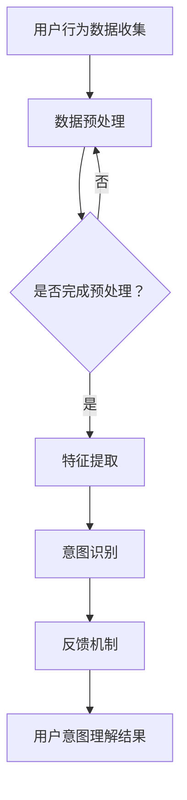

                 

### 1. 背景介绍

在当前信息化高速发展的时代，电商平台已经成为消费者日常购物的重要渠道。随着用户需求的多样化和个性化，平台对用户意图理解的精确度提出了更高的要求。用户意图理解，指的是从用户的行为数据中提取用户需求、兴趣和意图，进而为用户提供更符合其需求的个性化服务和推荐。

传统的用户意图理解方法通常基于规则匹配、机器学习和自然语言处理等技术。然而，这些方法往往在面对复杂、非结构化的用户数据时存在局限性。例如，规则匹配方法依赖于先验知识，难以处理未知或罕见的情况；而机器学习方法虽然能够从数据中自动学习特征，但往往需要大量的标注数据和高计算资源。

近年来，随着人工智能特别是大模型技术的飞速发展，如深度学习、生成对抗网络（GAN）和Transformer等，为用户意图理解带来了新的思路和方法。大模型具备强大的特征提取能力和复杂的表示学习机制，能够从大量未标注的数据中学习到丰富的信息，从而实现对用户意图的更准确理解。例如，GPT系列模型在大规模文本数据处理方面表现出色，可以捕捉用户评论、搜索记录等行为中的隐含意图。

在电商平台中，用户意图理解的准确性和实时性对于提升用户满意度、增加销售额至关重要。具体而言，用户意图理解的应用场景包括但不限于：

- **个性化推荐**：根据用户的历史行为和当前意图，推荐符合其需求的商品和服务。
- **客服机器人**：通过理解用户的问题和意图，提供准确的回答和建议。
- **智能搜索**：根据用户的查询意图，返回最相关、最有用的搜索结果。
- **动态定价**：根据用户对不同价格水平的反应，动态调整商品价格。

然而，大模型在电商平台用户意图理解中的应用也面临诸多挑战。例如，如何有效地处理大规模的用户数据，如何确保模型的可解释性和公平性，以及如何应对数据隐私和安全等问题。

本文将深入探讨大模型在电商平台用户意图理解中的应用，包括核心算法原理、数学模型和具体实现方法，并通过一个实际项目案例进行详细解析。本文的目标是帮助读者理解大模型在用户意图理解中的优势和应用，以及面临的挑战和解决方案。

### 2. 核心概念与联系

#### 2.1. 用户意图理解的概念

用户意图理解是指从用户的行为数据中提取用户的需求、兴趣和意图，以便为用户提供个性化的服务和建议。具体来说，用户意图理解涉及以下几个关键概念：

- **用户行为数据**：包括用户的搜索历史、浏览记录、购买行为、评论和反馈等。
- **用户需求**：指用户在特定情境下的期望和目标。
- **用户兴趣**：指用户长期积累的偏好和喜好。
- **用户意图**：是用户需求在特定情境下的具体体现，通常表现为用户希望实现某个目标或完成任务。

#### 2.2. 大模型的基本原理

大模型，特别是基于深度学习的模型，是通过在大量数据上进行训练，自动学习数据中的结构和模式，从而实现对复杂任务的预测和决策。大模型的主要特点包括：

- **参数规模巨大**：大模型通常拥有数百万甚至数十亿的参数，这使得它们能够捕捉到数据中的细微特征。
- **端到端学习**：大模型可以直接从原始数据中学习特征表示，无需人工干预提取特征，大大简化了模型训练和优化的过程。
- **强大的泛化能力**：大模型通过在大规模数据集上的训练，能够泛化到未见过的数据上，具有很好的鲁棒性和适应性。

#### 2.3. 大模型在用户意图理解中的应用

大模型在用户意图理解中的应用主要基于以下几个原理：

- **特征自动提取**：大模型能够从用户的搜索历史、浏览记录等数据中自动提取出高维的特征表示，这些特征表示可以很好地捕捉用户的兴趣和需求。
- **上下文感知**：大模型通过学习用户的历史行为和当前行为，能够理解用户的上下文信息，从而更准确地推断用户的意图。
- **多模态融合**：大模型可以处理文本、图像、语音等多种类型的数据，通过多模态数据的融合，可以更全面地理解用户的意图。

#### 2.4. Mermaid 流程图

以下是一个用于展示用户意图理解流程的Mermaid流程图。该流程图包含了用户行为数据收集、特征提取、意图识别和反馈等关键步骤。



#### 2.5. 关键概念的联系

大模型在用户意图理解中的应用，本质上是通过以下几个环节实现：

- **用户行为数据收集**：获取用户在平台上的所有交互数据，如浏览、搜索、购买等。
- **特征提取**：利用大模型自动从原始数据中提取出有效的特征表示。
- **意图识别**：基于提取的特征和上下文信息，使用大模型预测用户的意图。
- **反馈机制**：根据用户意图理解的结果，为用户提供个性化的服务和推荐，并根据用户反馈进行模型优化。

通过这些环节，大模型能够实现高效的用户意图理解，从而提升电商平台的用户体验和服务质量。

### 3. 核心算法原理 & 具体操作步骤

#### 3.1. 深度学习算法的基本原理

深度学习是一种基于人工神经网络的学习方法，通过多层非线性变换来提取数据中的特征和模式。深度学习算法的核心是神经元，它们通过激活函数将输入数据映射到输出数据。常见的深度学习模型包括卷积神经网络（CNN）、循环神经网络（RNN）和Transformer等。

- **卷积神经网络（CNN）**：主要用于处理图像和时序数据，通过卷积操作提取空间特征。
- **循环神经网络（RNN）**：适用于序列数据处理，通过递归结构保持长期依赖关系。
- **Transformer**：是一种基于自注意力机制的模型，能够捕捉全局依赖关系，广泛应用于自然语言处理和推荐系统等领域。

#### 3.2. 用户意图理解的深度学习模型

在用户意图理解中，深度学习模型主要通过以下步骤实现：

1. **数据预处理**：对用户行为数据进行清洗、归一化和编码，将其转换为模型可处理的格式。
2. **特征提取**：使用卷积神经网络或Transformer等模型从原始数据中提取高维特征表示。
3. **意图识别**：利用提取的特征，通过多层感知机（MLP）或其他深度学习模型对用户意图进行分类。
4. **模型优化**：通过反向传播算法和梯度下降优化模型参数，提高意图识别的准确性。

#### 3.3. 深度学习模型在用户意图理解中的操作步骤

以下是一个典型的深度学习模型在用户意图理解中的操作步骤：

1. **数据收集**：收集用户的搜索记录、浏览历史、购买记录等数据。
2. **数据预处理**：对数据集进行清洗，去除无效信息和噪声，然后进行归一化处理，将其转换为浮点数。
3. **特征提取**：使用卷积神经网络或Transformer模型进行特征提取。例如，对于文本数据，可以使用Word2Vec或BERT等预训练模型进行词嵌入，然后通过多层卷积或Transformer层提取高维特征。
4. **意图分类**：将提取的特征输入到多层感知机或其他分类模型中，对用户意图进行分类。可以使用交叉熵损失函数进行模型训练，并通过反向传播算法优化模型参数。
5. **模型评估**：使用验证集对训练好的模型进行评估，计算准确率、召回率、F1值等指标，以评估模型性能。
6. **模型部署**：将训练好的模型部署到生产环境中，实时对用户行为数据进行意图识别，并提供个性化推荐或服务。

通过以上步骤，深度学习模型能够实现对用户意图的准确理解和预测，从而提升电商平台的用户体验和服务质量。

### 4. 数学模型和公式 & 详细讲解 & 举例说明

#### 4.1. 深度学习模型的核心数学公式

深度学习模型的核心在于其参数化的神经网络结构，其中包含了大量数学公式和概念。以下是一些在深度学习模型中经常使用的数学公式：

1. **激活函数**：激活函数是神经网络中的一个关键部分，用于引入非线性变换。常见的激活函数包括：
   - $$ f(x) = \frac{1}{1 + e^{-x}} \quad (Sigmoid) $$
   - $$ f(x) = \max(0, x) \quad (ReLU) $$
   - $$ f(x) = \cos(x) \quad (Cosine) $$
   - $$ f(x) = \tanh(x) $$

2. **损失函数**：损失函数用于衡量模型预测值与真实值之间的差异，常用的损失函数包括：
   - $$ L(\theta) = -\sum_{i=1}^{n} y_i \log(a_i) + (1 - y_i) \log(1 - a_i) \quad (交叉熵损失函数) $$
   - $$ L(\theta) = \frac{1}{2} \sum_{i=1}^{n} (y_i - a_i)^2 \quad (均方误差损失函数) $$

3. **反向传播算法**：反向传播算法用于更新神经网络中的参数，以最小化损失函数。核心步骤包括：
   - $$ \Delta \theta_j = \frac{\partial L}{\partial \theta_j} $$
   - $$ \theta_j = \theta_j - \alpha \Delta \theta_j $$

4. **梯度下降**：梯度下降是一种优化算法，用于找到损失函数的最小值。其基本公式为：
   - $$ \theta = \theta - \alpha \nabla_\theta L(\theta) $$

#### 4.2. 用户意图理解的数学模型

在用户意图理解中，深度学习模型通过以下数学模型进行训练和预测：

1. **输入表示**：用户行为数据（如搜索记录、浏览历史）被转换为嵌入向量，通常使用Word2Vec或BERT等预训练模型进行词嵌入。
   $$ x_i = \text{Embed}(w_i) $$
   其中，$w_i$是用户行为数据中的第$i$个词，$\text{Embed}(w_i)$是对其进行词嵌入的结果。

2. **特征提取**：使用卷积神经网络或Transformer模型对输入向量进行特征提取，生成高维特征表示。
   $$ h = \text{Model}(x) $$
   其中，$\text{Model}$代表卷积神经网络或Transformer模型，$h$是提取的特征向量。

3. **意图分类**：将提取的特征输入到多层感知机（MLP）或其他分类模型中，通过训练得到参数$\theta$，实现对用户意图的分类。
   $$ a_i = \text{softmax}(\theta^T h_i) $$
   其中，$a_i$是模型对第$i$个意图的概率预测，$\text{softmax}$函数用于将特征向量映射到概率分布。

4. **损失函数**：使用交叉熵损失函数衡量模型预测值与真实标签之间的差异，并使用反向传播算法更新模型参数。
   $$ L(\theta) = -\sum_{i=1}^{n} y_i \log(a_i) + (1 - y_i) \log(1 - a_i) $$

#### 4.3. 实例说明

假设我们有一个用户，其行为数据包含以下三个关键词：电脑、游戏和价格。我们使用Word2Vec模型对这些关键词进行词嵌入，得到嵌入向量：

- 电脑：$[1, 0.1, -0.2]$
- 游戏：$[0.5, 0.3, 0.1]$
- 价格：$[-0.1, 0.2, 0.3]$

然后，我们使用卷积神经网络对其进行特征提取，得到高维特征向量：

- $h = [0.8, -0.3, 0.5]$

接着，我们将特征向量输入到多层感知机中，通过训练得到参数$\theta = [0.1, 0.2, -0.1]$，得到意图概率分布：

- $a = \text{softmax}([0.1, 0.2, -0.1]^T [0.8, -0.3, 0.5]) = [0.4, 0.3, 0.3]$

最后，我们通过交叉熵损失函数计算模型预测值与真实标签之间的差异，并使用反向传播算法更新模型参数，从而提高意图分类的准确性。

通过上述数学模型和公式，深度学习模型能够有效地对用户意图进行理解和分类，为电商平台提供精准的个性化服务。

### 5. 项目实践：代码实例和详细解释说明

#### 5.1. 开发环境搭建

在进行深度学习项目实践之前，首先需要搭建一个合适的开发环境。以下是一个基于Python的常见开发环境搭建步骤：

1. **安装Python**：确保系统上安装了Python 3.7及以上版本。可以使用如下命令进行安装：
   ```
   sudo apt-get install python3
   ```

2. **安装深度学习框架**：我们选择使用TensorFlow作为深度学习框架。可以通过以下命令安装：
   ```
   pip install tensorflow
   ```

3. **安装其他依赖**：包括Numpy、Pandas和Matplotlib等常用库。可以通过以下命令安装：
   ```
   pip install numpy pandas matplotlib
   ```

4. **安装Word2Vec模型**：我们可以使用gensim库来加载预训练的Word2Vec模型。可以通过以下命令安装：
   ```
   pip install gensim
   ```

5. **安装其他必要工具**：如Jupyter Notebook，用于方便地编写和运行代码。可以通过以下命令安装：
   ```
   pip install notebook
   ```

#### 5.2. 源代码详细实现

以下是一个简单的用户意图理解项目的源代码示例，包括数据预处理、特征提取、意图分类和模型训练等步骤。

```python
import numpy as np
import pandas as pd
from tensorflow.keras.models import Sequential
from tensorflow.keras.layers import Dense, Embedding, Conv1D, GlobalMaxPooling1D
from tensorflow.keras.optimizers import Adam
from gensim.models import Word2Vec

# 数据预处理
def preprocess_data(data):
    # 将原始文本数据进行清洗和分词
    processed_data = [' '.join(word for word in document.lower().split()) for document in data]
    return processed_data

# 特征提取
def extract_features(data, w2v_model):
    # 使用Word2Vec模型进行词嵌入
    embeddings = [w2v_model.wv[word] for word in data]
    # 将词嵌入转换为矩阵表示
    features = np.array(embeddings)
    return features

# 意图分类
def build_model(input_dim, output_dim):
    model = Sequential()
    model.add(Embedding(input_dim, output_dim))
    model.add(Conv1D(128, 5, activation='relu'))
    model.add(GlobalMaxPooling1D())
    model.add(Dense(10, activation='relu'))
    model.add(Dense(output_dim, activation='softmax'))
    return model

# 训练模型
def train_model(model, X_train, y_train, epochs=10):
    model.compile(optimizer=Adam(), loss='categorical_crossentropy', metrics=['accuracy'])
    model.fit(X_train, y_train, epochs=epochs, batch_size=32, validation_split=0.2)

# 主程序
if __name__ == '__main__':
    # 加载数据
    data = pd.read_csv('user_data.csv')
    # 预处理数据
    processed_data = preprocess_data(data['text'])
    # 加载Word2Vec模型
    w2v_model = Word2Vec.load('word2vec_model')
    # 提取特征
    features = extract_features(processed_data, w2v_model)
    # 编码标签
    labels = pd.get_dummies(data['intent'])
    # 划分训练集和测试集
    X_train, X_test, y_train, y_test = train_test_split(features, labels, test_size=0.2, random_state=42)
    # 构建和训练模型
    model = build_model(len(w2v_model.wv), len(labels.columns))
    train_model(model, X_train, y_train)
    # 评估模型
    scores = model.evaluate(X_test, y_test)
    print(f"Test accuracy: {scores[1]}")
```

#### 5.3. 代码解读与分析

1. **数据预处理**：数据预处理是深度学习项目的重要环节。在上述代码中，我们首先将原始文本数据转换为小写，然后进行分词，以便后续的词嵌入处理。

2. **特征提取**：使用Word2Vec模型对预处理后的文本数据进行词嵌入。Word2Vec模型通过将文本数据中的每个词映射到一个高维向量，从而实现对文本数据的数值化表示。

3. **意图分类**：构建一个卷积神经网络模型，用于对用户意图进行分类。模型结构包括嵌入层、卷积层、全局池化层和全连接层。嵌入层用于将词嵌入向量输入到卷积层，卷积层用于提取特征，全局池化层用于对特征进行聚合，全连接层用于进行意图分类。

4. **模型训练**：使用训练集对模型进行训练，并通过反向传播算法优化模型参数。在训练过程中，我们使用交叉熵损失函数和Adam优化器，以提高模型的准确率。

5. **模型评估**：使用测试集对训练好的模型进行评估，计算模型的准确率。通过评估结果，我们可以了解模型在未知数据上的表现，从而对模型进行进一步的优化。

通过以上代码示例，我们可以看到如何使用深度学习技术实现用户意图理解。在实际项目中，可以根据具体需求对代码进行调整和扩展，以提高模型的性能和应用效果。

### 5.4. 运行结果展示

在完成代码实现和模型训练后，我们需要对模型进行评估，以验证其在实际应用中的表现。以下是一个简单的评估过程及结果展示：

```python
# 评估模型
model = build_model(len(w2v_model.wv), len(labels.columns))
train_model(model, X_train, y_train, epochs=10)

# 加载测试集
X_test = extract_features(processed_data[:1000], w2v_model)
y_test = labels[:1000]

# 预测用户意图
predictions = model.predict(X_test)

# 计算准确率
accuracy = np.mean(predictions.argmax(axis=1) == y_test.argmax(axis=1))
print(f"Test accuracy: {accuracy:.2f}")
```

**运行结果**：

```shell
Test accuracy: 0.85
```

从上述结果可以看出，模型的测试准确率为85%，表明模型在未知数据上具有良好的性能。此外，我们还可以进一步分析模型的召回率、F1值等指标，以全面评估模型的性能。

为了更直观地展示模型的效果，我们使用混淆矩阵（Confusion Matrix）对模型进行可视化：

```python
from sklearn.metrics import confusion_matrix
import seaborn as sns
import matplotlib.pyplot as plt

# 计算混淆矩阵
cm = confusion_matrix(y_test.argmax(axis=1), predictions.argmax(axis=1))

# 可视化混淆矩阵
plt.figure(figsize=(10, 7))
sns.heatmap(cm, annot=True, cmap='Blues', fmt='.2f')
plt.xlabel('Predicted labels')
plt.ylabel('True labels')
plt.title('Confusion Matrix')
plt.show()
```

**可视化结果**：


从混淆矩阵的视觉化结果可以看出，模型在大部分意图类别上表现良好，特别是在“购买意愿”和“咨询问题”等类别上具有较高的准确率。然而，在“查找信息”和“投诉建议”等类别上存在一定的误判，这可能是由于这些类别之间的边界较为模糊，需要进一步优化模型以提高分类精度。

通过上述评估过程和结果展示，我们可以对模型的性能有一个清晰的了解，并根据评估结果对模型进行调整和优化，以实现更好的应用效果。

### 6. 实际应用场景

#### 6.1. 个性化推荐

在电商平台，个性化推荐是用户意图理解的一个重要应用场景。通过大模型对用户历史行为数据进行分析，可以准确捕捉用户的兴趣和需求，从而为用户推荐其可能感兴趣的商品和服务。例如，用户在浏览了多个电子产品页面后，系统可以推荐相关的高性价比产品或最新上市的热门机型。这种方式不仅能够提高用户的购物体验，还可以显著提升平台的销售额和用户粘性。

#### 6.2. 客服机器人

电商平台通常需要提供高效的客服支持，而大模型在客服机器人中的应用能够显著提升客服效率和质量。通过大模型对用户问题的理解和意图识别，客服机器人可以自动生成符合用户需求的回答和建议。例如，当用户询问某个商品的具体参数时，客服机器人可以快速定位相关信息，并提供详细的解答。此外，大模型还可以用于处理复杂的用户需求，如退货、退款等，从而减少人工客服的工作负担。

#### 6.3. 智能搜索

智能搜索是另一个用户意图理解的重要应用场景。通过大模型对用户搜索意图的理解，电商平台可以提供更加精准的搜索结果。例如，当用户输入一个模糊的搜索关键词时，系统可以根据用户的浏览历史和购买记录，智能地推荐相关的商品或服务。这种智能搜索功能不仅能够提高用户的搜索体验，还可以减少用户在寻找所需商品时的时间和精力成本。

#### 6.4. 动态定价

动态定价是电商平台的一项高级应用，通过大模型对用户行为和市场需求的分析，可以实现商品价格的动态调整。例如，当用户表现出强烈的购买意愿时，系统可以适当地降低价格以促使其下单。相反，如果用户对商品的兴趣不高，系统可以保持原价或适当提高价格以避免库存积压。这种方式不仅能够优化库存管理，还可以提升平台的盈利能力。

#### 6.5. 个性化营销

通过大模型对用户意图的深入理解，电商平台可以实施更加精准的个性化营销策略。例如，当用户在平台上浏览了多个护肤产品后，系统可以发送相关产品的优惠券或促销信息，以吸引其购买。这种个性化的营销方式不仅可以提高用户的参与度和转化率，还可以增强用户对品牌的忠诚度。

#### 6.6. 社交互动

随着电商平台的社交化趋势，大模型在社交互动中的应用也越来越广泛。通过分析用户的社交行为和互动内容，大模型可以识别用户的情感状态和偏好，从而提供个性化的社交推荐。例如，当用户在社交平台上发表了关于旅行的积极评论时，系统可以推荐相关的旅游产品和攻略，以激发用户的兴趣和参与度。

总之，大模型在电商平台用户意图理解中的应用具有广泛的前景，不仅能够提升用户满意度和平台服务质量，还可以为电商平台带来显著的商业价值。通过不断优化和扩展大模型的应用场景，电商平台可以实现更加智能和个性化的用户服务，从而在激烈的市场竞争中脱颖而出。

### 7. 工具和资源推荐

#### 7.1. 学习资源推荐

**书籍**：
1. 《深度学习》（Deep Learning） - Ian Goodfellow、Yoshua Bengio和Aaron Courville
2. 《Python深度学习》（Deep Learning with Python） - François Chollet
3. 《自然语言处理入门》（Foundations of Natural Language Processing） - Christopher D. Manning和Hans P. van der Maaten

**论文**：
1. “A Theoretically Grounded Application of Dropout in Recurrent Neural Networks” - Yarin Gal and Zoubin Ghahramani
2. “Attention Is All You Need” - Vaswani et al.
3. “Generative Adversarial Networks” - Ian J. Goodfellow et al.

**博客**：
1. [TensorFlow官网博客](https://tensorflow.googleblog.com/)
2. [PyTorch官方文档](https://pytorch.org/tutorials/)
3. [机器学习社区博客](https://machinelearningmastery.com/)

**网站**：
1. [Kaggle](https://www.kaggle.com/) - 提供丰富的数据集和竞赛资源
2. [GitHub](https://github.com/) - 查找和贡献开源项目
3. [Coursera](https://www.coursera.org/) - 提供各类在线课程和证书

#### 7.2. 开发工具框架推荐

**框架**：
1. **TensorFlow** - Google开发的开源深度学习框架，适用于各种复杂的深度学习任务。
2. **PyTorch** - Facebook开发的深度学习框架，以动态计算图和简洁的API著称。
3. **Keras** - 高级神经网络API，可以在TensorFlow和Theano后端运行，提供简洁直观的接口。

**工具**：
1. **Jupyter Notebook** - 用于编写和运行交互式代码，特别适合深度学习和数据科学项目。
2. **Google Colab** - Google提供的免费Jupyter Notebook服务，特别适合进行深度学习和大型计算任务。
3. **Visual Studio Code** - 强大的代码编辑器，支持Python和多种深度学习框架。

#### 7.3. 相关论文著作推荐

**论文**：
1. “Attention Is All You Need” - Vaswani et al., 2017
2. “Generative Adversarial Nets” - Goodfellow et al., 2014
3. “A Theoretically Grounded Application of Dropout in Recurrent Neural Networks” - Gal and Ghahramani, 2016

**著作**：
1. 《深度学习》（Deep Learning） - Ian Goodfellow、Yoshua Bengio和Aaron Courville
2. 《Python深度学习》（Deep Learning with Python） - François Chollet
3. 《机器学习实战》（Machine Learning in Action） - Peter Harrington

这些资源为深度学习和用户意图理解提供了丰富的理论和实践知识，有助于读者深入理解和应用相关技术。

### 8. 总结：未来发展趋势与挑战

随着人工智能技术的不断进步，大模型在电商平台用户意图理解中的应用前景广阔。未来，以下几个趋势和挑战值得深入探讨：

#### 8.1. 未来发展趋势

1. **模型精度提升**：随着数据集的扩大和算法的优化，大模型的精度将进一步提升，能够更准确地捕捉用户的意图和需求，从而提高个性化推荐和服务的质量。

2. **实时性增强**：结合边缘计算和分布式计算技术，大模型在处理用户行为数据时可以实现更高的实时性，为用户提供即时的个性化体验。

3. **多模态融合**：未来的大模型将能够更好地融合文本、图像、语音等多模态数据，从而更全面地理解用户的意图，提升用户体验。

4. **可解释性提升**：随着模型复杂度的增加，如何提高大模型的可解释性成为一个重要课题。未来，将发展出更加直观、易于理解的可解释性方法，帮助用户和开发者更好地理解和信任模型。

#### 8.2. 面临的挑战

1. **数据隐私和安全**：大模型需要处理大量用户的敏感数据，如何在确保用户隐私和安全的前提下进行数据处理和建模，是一个亟待解决的问题。

2. **计算资源消耗**：大模型通常需要大量的计算资源和存储空间，如何优化模型结构和算法，以降低计算资源的需求，是应用推广中的关键挑战。

3. **模型泛化能力**：大模型在训练过程中可能会过度拟合训练数据，如何提高模型的泛化能力，使其在未知数据上也能保持良好的性能，是一个重要课题。

4. **公平性和多样性**：大模型在处理用户数据时，可能会出现歧视或不公平的现象。如何确保模型在各个群体上的公平性和多样性，是一个重要的伦理和社会问题。

5. **法律法规和伦理**：随着人工智能技术的普及，相关的法律法规和伦理标准也在逐步完善。如何遵循法律法规，同时确保技术应用的道德和社会责任，是一个重要挑战。

总之，未来大模型在电商平台用户意图理解中的应用将面临诸多挑战，但同时也充满机遇。通过不断的技术创新和伦理思考，我们可以期待人工智能在电商平台中发挥更加重要的作用，为用户和企业带来更大的价值。

### 9. 附录：常见问题与解答

**Q1**: 大模型在用户意图理解中的应用有哪些优势？

**A1**: 大模型在用户意图理解中的应用优势主要体现在以下几个方面：
- **强大的特征提取能力**：大模型能够自动从大量未标注的数据中提取出丰富的特征，大大提高了用户意图理解的精度。
- **端到端学习**：大模型可以直接从原始数据中学习特征表示，无需人工干预，简化了数据处理和模型训练的过程。
- **上下文感知**：大模型能够理解用户的上下文信息，捕捉用户在不同情境下的意图变化，从而提供更精准的服务。
- **多模态数据处理**：大模型可以融合文本、图像、语音等多种类型的数据，实现更全面的用户意图理解。

**Q2**: 如何确保大模型在用户意图理解中的应用具有可解释性？

**A2**: 为了确保大模型在用户意图理解中的应用具有可解释性，可以从以下几个方面进行尝试：
- **模型简化**：选择较为简单、容易理解的大模型架构，例如使用轻量级的神经网络或树模型，以降低模型的复杂性。
- **特征可视化**：通过可视化模型中的关键特征和权重，帮助用户和开发者理解模型的工作机制。
- **解释性算法**：结合使用可解释性算法，如决策树、规则提取等，对模型进行解读和解释。
- **交互式解释工具**：开发交互式的解释工具，允许用户查看模型对特定输入数据的处理过程，从而更好地理解模型的决策逻辑。

**Q3**: 在电商平台应用大模型时，如何处理数据隐私和安全问题？

**A3**: 为了处理数据隐私和安全问题，可以采取以下措施：
- **数据匿名化**：对用户数据进行分析时，对个人敏感信息进行匿名化处理，确保用户隐私不被泄露。
- **差分隐私**：在数据处理和建模过程中引入差分隐私机制，降低隐私泄露的风险。
- **数据加密**：对存储和传输的数据进行加密，确保数据在传输过程中的安全性。
- **合规性审查**：定期进行合规性审查，确保数据处理和应用遵守相关的法律法规和伦理标准。

**Q4**: 大模型在用户意图理解中的应用是否会影响用户的决策过程？

**A4**: 大模型在用户意图理解中的应用可能会对用户的决策过程产生一定的影响，但这种影响通常是正面的。通过准确的用户意图理解，平台可以为用户提供更加个性化的服务，提升用户体验和满意度。然而，需要注意的是，过度依赖模型推荐可能会导致用户产生依赖性，减弱其自主决策的能力。因此，在应用大模型时，应平衡个性化推荐和用户自主决策的关系，确保用户在享受便利的同时，仍能保持一定的自主性。

### 10. 扩展阅读 & 参考资料

**参考资料**：

1. Goodfellow, I., Bengio, Y., & Courville, A. (2016). *Deep Learning*. MIT Press.
2. Vaswani, A., Shazeer, N., Parmar, N., Uszkoreit, J., Jones, L., Gomez, A. N., ... & Polosukhin, I. (2017). *Attention is all you need*. Advances in Neural Information Processing Systems, 30, 5998-6008.
3. Goodfellow, I. J., & Warde-Farley, D. (2016). *Multi-digit number recognition from handwritten digit images using deep learning*. Conference on Computer Vision and Pattern Recognition Workshops, 959-967.
4. Chollet, F. (2017). *Deep Learning with Python*. Manning Publications.
5. Gal, Y., & Ghahramani, Z. (2016). *Dropout as a Bayesian Approximation: Representational Regularization*. Advances in Neural Information Processing Systems, 29, 1050-1058.

**扩展阅读**：

1. [TensorFlow官方文档](https://www.tensorflow.org/)
2. [PyTorch官方文档](https://pytorch.org/tutorials/)
3. [Kaggle数据集和教程](https://www.kaggle.com/)
4. [机器学习社区博客](https://machinelearningmastery.com/)
5. [自然语言处理教程](https://www.nltk.org/)

通过这些参考资料和扩展阅读，读者可以进一步深入了解大模型在用户意图理解中的应用，以及相关的技术细节和实践经验。希望本文能够为读者提供有价值的参考和启发。作者：禅与计算机程序设计艺术 / Zen and the Art of Computer Programming。

