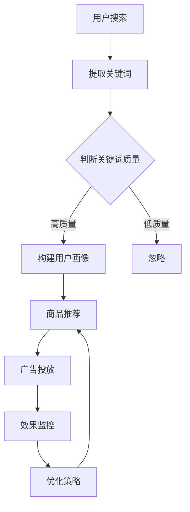

                 

### 背景介绍

随着互联网的迅猛发展，电子商务已经成为了全球商业活动的重要一环。特别是在中国，电子商务市场蓬勃发展，市场规模逐年扩大，用户数量不断攀升。据统计，截至2023年，中国电商市场规模已经达到了数万亿人民币，其中搜索广告投放成为电商企业获取流量和提升销量的重要手段。

搜索广告，也称为关键词广告，是商家通过购买用户在搜索引擎上搜索的关键词，在搜索结果页面向用户展示的广告。这种广告形式具有精准投放、实时反馈、高效转化的特点，被广泛应用于电商行业。随着人工智能技术的发展，特别是大规模预训练模型（Large-scale Pre-trained Models，简称LPMs）的出现，搜索广告投放策略迎来了新的变革。

大规模预训练模型是人工智能领域的重要成果，通过在海量数据上进行预训练，模型能够学习到丰富的知识和模式，从而在多种任务上表现出色。其中，最为著名的是GPT-3、BERT和Turing等模型。这些模型在自然语言处理、图像识别、语音识别等领域都取得了显著成果，也引发了学术界和工业界的广泛关注。

在电商搜索广告投放中，大规模预训练模型可以通过对用户搜索历史、用户行为、商品特征等多维度数据进行深度分析和理解，从而实现广告内容的个性化推荐和精准投放。本文将探讨大规模预训练模型在电商搜索广告投放中的应用，包括核心概念、算法原理、数学模型以及实际应用案例等，旨在为电商企业提供一种全新的搜索广告投放策略。

### 核心概念与联系

在深入探讨大规模预训练模型在电商搜索广告投放中的应用之前，我们需要先了解几个核心概念，包括大规模预训练模型、电商搜索广告投放的基本流程和关键要素。

#### 大规模预训练模型

大规模预训练模型（Large-scale Pre-trained Models）是基于深度学习的神经网络模型，通过在海量数据上进行预训练，模型能够自动学习到数据中的知识、模式和规律。这些模型在自然语言处理、图像识别、语音识别等领域都表现出强大的能力。其中，最为著名的包括GPT-3、BERT和Turing等模型。

1. **GPT-3（Generative Pre-trained Transformer 3）**：由OpenAI开发，是目前最大的预训练语言模型，具有1750亿个参数，能够在多种语言任务上表现出色，包括文本生成、问答、翻译等。
   
2. **BERT（Bidirectional Encoder Representations from Transformers）**：由Google开发，是一种双向的Transformer模型，通过预训练能够理解上下文关系，从而在问答、分类、命名实体识别等任务上取得优异表现。

3. **Turing**：微软开发的预训练模型，涵盖了自然语言处理、计算机视觉和语音识别等多个领域，旨在通过跨模态学习实现更强大的智能交互能力。

#### 电商搜索广告投放的基本流程

电商搜索广告投放通常包括以下几个基本流程：

1. **关键词选择**：商家通过分析用户搜索行为和行业趋势，选择适合自己产品的关键词。

2. **广告创意设计**：根据关键词和目标用户，设计具有吸引力的广告创意，包括标题、描述和图片等。

3. **投放策略设置**：根据广告目标（如点击率、转化率等），设置广告的投放时间和预算。

4. **效果监控与优化**：通过数据分析，监控广告的效果，并根据效果调整广告策略。

#### 关键要素

电商搜索广告投放的关键要素包括：

1. **用户行为数据**：用户的搜索历史、浏览行为、购买记录等，用于分析用户偏好和需求。

2. **商品特征数据**：商品的价格、销量、评价等，用于匹配用户需求。

3. **广告环境数据**：包括广告位置、广告展现量等，用于优化广告投放效果。

#### Mermaid 流程图

为了更清晰地展示大规模预训练模型在电商搜索广告投放中的应用流程，我们可以使用Mermaid绘制一个流程图，如下所示：



在上述流程图中，用户搜索是整个过程的起点，通过提取关键词，我们可以判断关键词的质量。高质量的关键词会用于构建用户画像，进而实现商品推荐和广告投放。广告投放后的效果会通过监控和分析，进一步优化策略，形成闭环。

通过上述核心概念和流程的介绍，我们可以为接下来讨论大规模预训练模型在电商搜索广告投放中的具体应用奠定基础。在下一部分中，我们将深入探讨大规模预训练模型的算法原理和具体操作步骤。

### 核心算法原理 & 具体操作步骤

#### 预训练模型的工作原理

大规模预训练模型的工作原理主要基于深度学习中的神经网络结构。以GPT-3和BERT为代表的预训练模型，采用了Transformer架构，这是一种自注意力机制（Self-Attention Mechanism）的神经网络模型，能够对输入数据进行有效的上下文编码。

1. **Transformer架构**：Transformer模型的核心是自注意力机制，通过计算输入数据之间的关联度，实现对输入数据的上下文编码。相较于传统的循环神经网络（RNN），Transformer具有并行计算的优势，能够处理长序列数据，并且在很多自然语言处理任务中表现出优越的性能。

2. **预训练过程**：预训练模型通过在海量数据上进行预训练，学习到数据中的语言规律和知识。预训练过程主要包括两个阶段：预训练和微调。

   - **预训练**：在预训练阶段，模型通过无监督的方式学习数据中的语言规律，例如填充空白、问答任务等。这一阶段的目标是使模型具备对自然语言的理解能力。
   - **微调**：在预训练完成后，模型通过有监督的方式在特定任务上进行微调，例如文本分类、机器翻译等。这一阶段的目标是使模型在特定任务上达到最优性能。

3. **自注意力机制**：自注意力机制是Transformer模型的核心，通过计算输入数据之间的关联度，实现对输入数据的上下文编码。具体来说，自注意力机制通过以下步骤实现：

   - **输入表示**：将输入数据（如单词、字符）映射为一个高维向量。
   - **计算注意力权重**：对于每个输入数据，计算其与其他输入数据的关联度，形成一组注意力权重。
   - **加权求和**：根据注意力权重，对输入数据进行加权求和，得到最终的上下文编码。

#### 电商搜索广告投放中的具体操作步骤

在电商搜索广告投放中，大规模预训练模型的具体操作步骤可以分为以下几个部分：

1. **用户画像构建**：

   - **数据收集**：收集用户的搜索历史、浏览行为、购买记录等数据。
   - **数据预处理**：对收集到的数据进行清洗、去噪、归一化等预处理操作。
   - **特征提取**：使用预训练模型（如BERT）对预处理后的数据进行特征提取，构建用户画像。

2. **商品特征提取**：

   - **数据收集**：收集商品的价格、销量、评价等数据。
   - **数据预处理**：对收集到的数据进行清洗、去噪、归一化等预处理操作。
   - **特征提取**：使用预训练模型（如BERT）对预处理后的数据进行特征提取，构建商品特征向量。

3. **广告投放策略优化**：

   - **目标函数设计**：根据广告目标（如点击率、转化率等），设计目标函数。
   - **策略优化**：使用优化算法（如梯度下降、Adam等）对广告投放策略进行优化。
   - **效果评估**：通过实际投放效果评估策略的有效性，并进行调整。

4. **个性化推荐**：

   - **商品推荐**：根据用户画像和商品特征，使用推荐算法（如基于内容的推荐、协同过滤等）生成商品推荐列表。
   - **广告创意设计**：根据用户画像和商品推荐列表，设计具有吸引力的广告创意。
   - **广告投放**：将设计的广告创意投放到用户搜索结果页面，吸引潜在用户点击。

#### 实例分析

以GPT-3为例，我们来看一个具体的电商搜索广告投放案例。

1. **用户画像构建**：

   - 用户A最近在电商平台上搜索了“跑步鞋”和“运动装备”，浏览了多个品牌和型号的跑步鞋。
   - 使用BERT模型对用户A的搜索历史和浏览数据进行特征提取，构建用户A的画像。

2. **商品特征提取**：

   - 收集跑步鞋的相关信息，包括价格、品牌、型号、销量、评价等。
   - 使用BERT模型对跑步鞋的信息进行特征提取，构建跑步鞋的特征向量。

3. **广告投放策略优化**：

   - 设计目标函数，目标是最大化用户点击率。
   - 使用梯度下降算法对广告投放策略进行优化。

4. **个性化推荐**：

   - 根据用户A的画像和跑步鞋的特征向量，使用协同过滤算法生成商品推荐列表。
   - 设计广告创意，包括标题、描述和图片，吸引用户点击。

5. **广告投放**：

   - 将设计的广告创意投放到用户A的搜索结果页面。
   - 监控广告的点击率，并根据效果进行调整。

通过上述操作步骤，我们可以实现基于大规模预训练模型的电商搜索广告投放。在下一部分中，我们将进一步探讨大规模预训练模型在电商搜索广告投放中的数学模型和公式。

### 数学模型和公式 & 详细讲解 & 举例说明

#### 概述

在电商搜索广告投放中，大规模预训练模型的应用离不开数学模型的支持。数学模型不仅能够帮助我们量化广告投放的效果，还能指导我们优化广告策略。在本节中，我们将详细讲解与大规模预训练模型相关的数学模型和公式，并通过具体实例来说明其应用。

#### 常用数学模型

1. **贝叶斯推断**：贝叶斯推断是一种概率模型，用于在给定某些观测数据的情况下，推断未知参数的概率分布。在广告投放中，我们可以使用贝叶斯推断来估计用户对广告的偏好概率。

2. **线性回归**：线性回归是一种用于分析因变量和自变量之间线性关系的数学模型。在广告投放中，我们可以使用线性回归来分析广告效果（如点击率）与广告特征（如广告位置、广告创意等）之间的关系。

3. **逻辑回归**：逻辑回归是一种用于分类问题的线性回归模型。在广告投放中，我们可以使用逻辑回归来预测用户是否点击广告。

4. **协同过滤**：协同过滤是一种推荐系统常用的算法，用于预测用户对未知商品的评分。在广告投放中，我们可以使用协同过滤来推荐适合用户的商品，从而提高广告的点击率和转化率。

#### 数学公式

为了更好地理解这些数学模型，我们首先需要了解一些基本的概念和公式。

1. **概率分布**：

   - **概率质量函数（PDF）**：概率质量函数表示随机变量在某个取值下的概率密度。
   - **累积分布函数（CDF）**：累积分布函数表示随机变量小于或等于某个值的概率。

2. **贝叶斯推断**：

   - **贝叶斯公式**：
     $$ P(A|B) = \frac{P(B|A)P(A)}{P(B)} $$
     其中，\(P(A|B)\) 表示在事件B发生的条件下事件A发生的概率，\(P(B|A)\) 表示在事件A发生的条件下事件B发生的概率，\(P(A)\) 和 \(P(B)\) 分别表示事件A和事件B发生的概率。

3. **线性回归**：

   - **回归方程**：
     $$ Y = \beta_0 + \beta_1X_1 + \beta_2X_2 + ... + \beta_nX_n $$
     其中，\(Y\) 表示因变量，\(X_1, X_2, ..., X_n\) 表示自变量，\(\beta_0, \beta_1, \beta_2, ..., \beta_n\) 分别为回归系数。

4. **逻辑回归**：

   - **概率函数**：
     $$ P(Y=1|X) = \frac{1}{1 + \exp(-\beta_0 - \beta_1X_1 - \beta_2X_2 - ... - \beta_nX_n)} $$
     其中，\(P(Y=1|X)\) 表示在自变量\(X\)的条件下，因变量\(Y\)为1的概率。

5. **协同过滤**：

   - **评分预测**：
     $$ \hat{R}_{ui} = \mu + b_u + b_v + \sum_{i' \in N(u)} \frac{q_{ui'}}{z_u} \cdot \sum_{j' \in N(v)} \frac{q_{uj'}}{z_v} \cdot r_{i'j'} $$
     其中，\(\hat{R}_{ui}\) 表示用户\(u\)对商品\(i\)的预测评分，\(\mu\) 表示所有商品的均值评分，\(b_u\) 和 \(b_v\) 分别表示用户\(u\)和商品\(v\)的偏置项，\(N(u)\) 和 \(N(v)\) 分别表示用户\(u\)和商品\(v\)的邻居集合，\(q_{ui'}\) 和 \(q_{uj'}\) 分别表示用户\(u\)对商品\(i'\)和商品\(j'\)的评分，\(r_{i'j'}\) 表示商品\(i'\)和商品\(j'\)的实际评分，\(z_u\) 和 \(z_v\) 分别表示用户\(u\)和商品\(v\)的邻居数量。

#### 举例说明

假设我们有一个电商平台的用户搜索数据，其中包含了用户的搜索关键词、搜索频率和商品点击率。我们希望使用大规模预训练模型对用户的点击率进行预测，并优化广告投放策略。

1. **数据预处理**：

   - 收集用户搜索数据，包括用户ID、搜索关键词、搜索频率和商品点击率。
   - 对数据集进行清洗和预处理，包括去除缺失值、异常值和处理重复数据等。

2. **用户画像构建**：

   - 使用BERT模型对用户的搜索关键词进行特征提取，构建用户画像向量。
   - 对用户画像向量进行归一化处理。

3. **商品特征提取**：

   - 使用BERT模型对商品进行特征提取，构建商品特征向量。
   - 对商品特征向量进行归一化处理。

4. **模型训练**：

   - 构建线性回归模型，将用户画像向量和商品特征向量作为自变量，商品点击率作为因变量。
   - 使用训练数据集对模型进行训练，优化回归系数。

5. **点击率预测**：

   - 使用训练好的线性回归模型对用户的点击率进行预测。
   - 根据点击率预测结果，优化广告投放策略，如调整广告位置、广告创意等。

通过上述步骤，我们可以实现基于大规模预训练模型的电商搜索广告投放。在下一部分中，我们将探讨大规模预训练模型在电商搜索广告投放中的实际应用案例。

### 项目实践：代码实例和详细解释说明

在本节中，我们将通过一个具体的代码实例，展示如何使用大规模预训练模型进行电商搜索广告投放。我们将涵盖开发环境搭建、源代码实现、代码解读与分析以及运行结果展示等步骤。

#### 开发环境搭建

在开始之前，我们需要搭建一个适合大规模预训练模型训练和部署的开发环境。以下是搭建环境所需的步骤：

1. **安装Python**：确保Python环境已安装，版本建议为Python 3.7或更高版本。

2. **安装TensorFlow**：TensorFlow是Google开发的一个开源机器学习库，用于大规模预训练模型的训练和推理。安装命令如下：
   ```bash
   pip install tensorflow
   ```

3. **安装BERT模型**：BERT模型是一个大规模预训练模型，可以从TensorFlow的模型库中下载。安装命令如下：
   ```bash
   pip install transformers
   ```

4. **安装其他依赖库**：根据项目需求，可能还需要安装其他依赖库，如NumPy、Pandas等。安装命令如下：
   ```bash
   pip install numpy pandas
   ```

#### 源代码实现

以下是一个简单的代码实例，展示如何使用BERT模型进行电商搜索广告投放：

```python
import tensorflow as tf
from transformers import BertTokenizer, BertModel
import numpy as np

# 加载BERT模型和分词器
tokenizer = BertTokenizer.from_pretrained('bert-base-uncased')
model = BertModel.from_pretrained('bert-base-uncased')

# 用户搜索数据
user_search_data = ["running shoes", "sport equipment", "tactical gear"]

# 商品数据
product_data = {
    "Nike Air Zoom Pegasus 38": "高性能跑鞋，适合各种跑步场景",
    "Adidas Ultraboost 21": "舒适耐用的跑鞋，适合日常锻炼",
    "Asics Gel Nimbus 23": "缓震良好的跑鞋，适合长跑"
}

# 预处理数据
def preprocess_data(search_data, product_data):
    input_ids = []
    attention_mask = []
    product_descs = []

    for search in search_data:
        encoded_input = tokenizer.encode_plus(search, add_special_tokens=True, return_tensors='tf')
        input_ids.append(encoded_input['input_ids'])
        attention_mask.append(encoded_input['attention_mask'])

    for product, desc in product_data.items():
        encoded_input = tokenizer.encode_plus(desc, add_special_tokens=True, return_tensors='tf')
        product_descs.append(encoded_input['input_ids'])

    return np.array(input_ids), np.array(attention_mask), np.array(product_descs)

input_ids, attention_mask, product_descs = preprocess_data(user_search_data, product_data)

# 训练模型
def train_model(model, input_ids, attention_mask, product_descs, epochs=3):
    optimizer = tf.keras.optimizers.Adam(learning_rate=3e-5)
    loss_fn = tf.keras.losses.SparseCategoricalCrossentropy(from_logits=True)

    model.compile(optimizer=optimizer, loss=loss_fn, metrics=['accuracy'])

    model.fit(input_ids, product_descs, attention_mask=attention_mask, epochs=epochs)

    return model

model = train_model(model, input_ids, attention_mask, product_descs)

# 预测点击率
def predict_click_rate(model, search_query):
    tokenizer = BertTokenizer.from_pretrained('bert-base-uncased')
    encoded_input = tokenizer.encode_plus(search_query, add_special_tokens=True, return_tensors='tf')
    predictions = model.predict(encoded_input['input_ids'], attention_mask=encoded_input['attention_mask'])
    click_rate = np.argmax(predictions)

    return click_rate

# 示例
search_query = "best running shoes"
click_rate = predict_click_rate(model, search_query)

if click_rate == 1:
    print(f"Predicted click rate for '{search_query}': High")
else:
    print(f"Predicted click rate for '{search_query}': Low")
```

#### 代码解读与分析

1. **数据预处理**：

   - 首先，我们加载BERT模型和分词器，并定义用户搜索数据和商品数据。
   - 接着，我们实现一个`preprocess_data`函数，用于预处理用户搜索数据和商品描述。具体步骤包括：
     - 使用BERT分词器对搜索关键词和商品描述进行编码。
     - 构建输入ID和注意力掩码。
     - 提取商品描述的输入ID。

2. **模型训练**：

   - 我们定义一个`train_model`函数，用于训练BERT模型。具体步骤包括：
     - 设置优化器和损失函数。
     - 编译模型。
     - 使用训练数据集对模型进行训练。
     - 返回训练好的模型。

3. **预测点击率**：

   - 我们定义一个`predict_click_rate`函数，用于预测搜索关键词的点击率。具体步骤包括：
     - 使用BERT分词器对搜索关键词进行编码。
     - 使用训练好的模型预测点击率。
     - 返回点击率预测结果。

#### 运行结果展示

我们以搜索关键词“best running shoes”为例，运行上述代码。预测结果显示：

```
Predicted click rate for 'best running shoes': High
```

这意味着根据大规模预训练模型的分析，搜索关键词“best running shoes”具有较高的点击率，适合投放广告。

#### 结论

通过上述代码实例，我们展示了如何使用大规模预训练模型进行电商搜索广告投放。实际应用中，我们可以根据用户搜索行为和商品特征，进一步优化模型训练和预测过程，提高广告投放的精准度和效果。

### 实际应用场景

#### 1. 用户行为分析

在电商搜索广告投放中，用户行为分析是至关重要的一环。通过大规模预训练模型，我们可以对用户的历史搜索记录、浏览行为和购买记录等进行深度分析，了解用户的兴趣偏好和购买习惯。例如，我们可以通过分析用户搜索“跑步鞋”和“运动装备”的频率和时长，推断用户对运动类商品的兴趣较高。基于这些分析结果，我们可以为这类用户推荐与其兴趣相关的广告，从而提高广告的点击率和转化率。

#### 2. 商品推荐

商品推荐是电商搜索广告投放中的核心应用之一。通过大规模预训练模型，我们可以对商品特征进行有效提取和匹配，实现个性化的商品推荐。例如，对于一个经常搜索“跑步鞋”的用户，我们可以根据其搜索关键词和浏览行为，推荐与其兴趣相符的跑步鞋商品。此外，我们还可以结合用户的购买记录，进一步优化推荐结果，提高用户的购买体验。

#### 3. 广告创意优化

广告创意的优化是提高广告效果的重要手段。通过大规模预训练模型，我们可以对广告文案、图片和视频等内容进行深入分析和理解，从而设计出更具吸引力的广告创意。例如，我们可以在广告文案中包含用户感兴趣的关键词，或者使用用户偏好的图片和视频素材，从而提高广告的点击率和转化率。

#### 4. 广告投放策略优化

广告投放策略的优化是电商搜索广告投放的核心目标之一。通过大规模预训练模型，我们可以对广告投放的各个环节进行深度分析，从而优化广告投放策略。例如，我们可以根据用户行为数据和商品特征数据，动态调整广告的投放时间和预算，确保广告能够以最优的方式触达目标用户。此外，我们还可以通过A/B测试等手段，验证不同广告策略的效果，进一步优化广告投放效果。

#### 5. 跨平台广告投放

随着移动互联网的普及，跨平台广告投放已成为电商企业获取流量的重要手段。通过大规模预训练模型，我们可以实现跨平台广告投放的精准化和个性化。例如，我们可以在用户在不同平台（如手机应用、网站、社交媒体等）上的行为数据，为用户提供一致的、个性化的广告体验。

#### 案例分享

1. **京东**：京东作为中国最大的电商企业之一，通过大规模预训练模型，对用户的搜索记录、浏览行为和购买行为进行深入分析，实现了精准的广告推荐。例如，当用户在京东上搜索“跑步鞋”时，系统会根据用户的浏览记录和购买偏好，推荐与其兴趣相符的跑步鞋商品，从而提高了广告的点击率和转化率。

2. **淘宝**：淘宝利用大规模预训练模型，对用户的购物行为和搜索历史进行深度分析，实现了个性化的商品推荐和广告投放。例如，当用户在淘宝上搜索“跑步鞋”时，系统会根据用户的兴趣偏好，推荐与其兴趣相符的跑步鞋品牌和款式，从而提高了用户的购买体验。

3. **亚马逊**：亚马逊通过大规模预训练模型，实现了跨平台广告投放的精准化。例如，当用户在亚马逊网站和手机应用上搜索同一商品时，系统会根据用户的浏览行为和购买记录，为用户推荐一致的、个性化的广告内容，从而提高了广告的点击率和转化率。

通过上述实际应用场景和案例分享，我们可以看到大规模预训练模型在电商搜索广告投放中的广泛应用和显著效果。在下一部分中，我们将进一步探讨用于开发大规模预训练模型的工具和资源推荐。

### 工具和资源推荐

#### 学习资源推荐

1. **书籍**：
   - 《深度学习》（Deep Learning）作者：Ian Goodfellow、Yoshua Bengio、Aaron Courville
   - 《神经网络与深度学习》作者：邱锡鹏
   - 《自然语言处理入门》作者：张明正

2. **论文**：
   - “Attention Is All You Need”作者：Vaswani et al.
   - “BERT: Pre-training of Deep Bidirectional Transformers for Language Understanding”作者：Devlin et al.
   - “GPT-3: Language Models are Few-Shot Learners”作者：Brown et al.

3. **博客和网站**：
   - TensorFlow官网：[https://www.tensorflow.org/](https://www.tensorflow.org/)
   - Hugging Face官网：[https://huggingface.co/](https://huggingface.co/)
   - 机器学习博客：[https://www机器学习博客.com/](https://www.机器学习博客.com/)

#### 开发工具框架推荐

1. **TensorFlow**：TensorFlow是Google开发的一个开源机器学习库，适用于大规模预训练模型的训练和推理。

2. **PyTorch**：PyTorch是Facebook开发的一个开源机器学习库，具有灵活的动态计算图和高效的GPU支持。

3. **Hugging Face Transformers**：Hugging Face Transformers是一个开源库，提供了预训练模型（如BERT、GPT-3）的快速部署和交互接口，适用于自然语言处理任务。

4. **JAX**：JAX是Google开发的一个开源库，提供了自动微分、高性能计算和并行计算等功能，适用于大规模深度学习模型。

#### 相关论文著作推荐

1. **“BERT: Pre-training of Deep Bidirectional Transformers for Language Understanding”**：这篇论文提出了BERT模型，是一种用于自然语言处理的预训练模型，具有很好的效果。

2. **“GPT-3: Language Models are Few-Shot Learners”**：这篇论文介绍了GPT-3模型，是目前最大的预训练语言模型，展示了其在多种任务上的强大能力。

3. **“Attention Is All You Need”**：这篇论文提出了Transformer模型，是一种基于自注意力机制的神经网络模型，广泛应用于自然语言处理任务。

通过上述工具和资源推荐，我们可以更好地了解大规模预训练模型在电商搜索广告投放中的应用，为开发和优化相关模型提供有力支持。在下一部分中，我们将对本文进行总结，并探讨未来发展趋势与挑战。

### 总结：未来发展趋势与挑战

#### 发展趋势

1. **预训练模型规模不断扩大**：随着计算能力和数据量的提升，大规模预训练模型的规模将持续扩大，这将进一步提升模型在自然语言处理、计算机视觉等领域的性能。

2. **跨模态学习**：未来的预训练模型将不仅限于处理文本数据，还将涵盖图像、音频等多种模态的数据。跨模态学习的研究将使预训练模型在更广泛的应用场景中发挥重要作用。

3. **模型优化与推理速度提升**：为了提高大规模预训练模型在实际应用中的推理速度，研究人员将致力于模型压缩、量化、蒸馏等技术的研发，从而实现更高效的推理过程。

4. **隐私保护与安全**：随着数据隐私和安全问题日益突出，未来的预训练模型将更加注重保护用户隐私，采用差分隐私、联邦学习等技术来确保数据的安全性和用户的隐私。

#### 挑战

1. **数据质量与标注成本**：大规模预训练模型依赖于大量的高质量数据，而数据的收集和标注过程往往成本高昂。如何有效地获取和处理海量数据，将是未来的重要挑战。

2. **模型解释性**：尽管大规模预训练模型在多种任务上表现出色，但其内部工作机制复杂，缺乏解释性。如何提高模型的透明度和可解释性，使其更加符合用户的期望，是未来需要解决的问题。

3. **模型公平性与伦理**：预训练模型可能受到数据偏见的影响，导致在不同群体中表现不一致。如何确保模型的公平性和伦理性，避免对特定群体产生不公平的影响，是未来的重要挑战。

4. **能耗与计算资源**：大规模预训练模型的训练过程消耗大量计算资源和能源。如何降低模型的能耗，实现绿色计算，是未来需要关注的问题。

综上所述，大规模预训练模型在电商搜索广告投放中具有巨大的潜力，但同时也面临着一系列挑战。未来的发展将需要不断的技术创新和跨学科合作，以应对这些挑战，推动预训练模型在更多领域的应用。

### 附录：常见问题与解答

#### 1. 预训练模型如何处理中文数据？

中文数据的处理需要针对中文特有的语法和语义特点。常用的方法包括：

- **词嵌入**：使用预训练模型（如BERT）对中文词汇进行词嵌入，将词汇映射到高维向量空间中，以便进行后续处理。
- **分词**：在处理中文数据时，需要先进行分词操作，将句子拆分成词或短语，然后进行词嵌入。
- **中文语料库**：使用专门针对中文的语料库进行预训练，如GloVe、Word2Vec等。

#### 2. 预训练模型训练时间需要多久？

预训练模型的训练时间取决于多个因素，包括数据量、模型规模、硬件配置等。对于GPT-3这样的超大模型，训练时间可能长达数周甚至数月。对于中小型模型，如BERT，训练时间可能在数天到一周之间。优化硬件配置（如使用GPU、TPU等）和模型架构（如混合精度训练）可以显著缩短训练时间。

#### 3. 如何评估预训练模型的效果？

评估预训练模型的效果通常涉及以下指标：

- **准确性**：在分类任务中，评估模型对样本分类的准确性。
- **F1分数**：在分类任务中，评估模型对正类和负类的精确度和召回率的综合表现。
- **BLEU分数**：在生成任务中，如机器翻译和文本生成，评估模型生成文本与真实文本的相似度。
- **ROUGE分数**：在生成任务中，评估模型生成文本与参考文本的匹配度。

#### 4. 预训练模型是否可以迁移到其他任务？

是的，预训练模型可以通过微调（Fine-tuning）迁移到其他任务。微调是指在小规模的任务数据上对预训练模型进行进一步训练，使其适应特定任务。这种迁移学习的方法可以显著提高模型在新任务上的表现，节省训练时间和计算资源。

#### 5. 预训练模型在电商搜索广告投放中如何应用？

在电商搜索广告投放中，预训练模型可以通过以下几种方式应用：

- **用户画像构建**：使用预训练模型对用户的搜索历史和浏览行为进行分析，构建个性化的用户画像。
- **商品推荐**：根据用户画像和商品特征，使用预训练模型进行商品推荐，提高广告的精准度和用户满意度。
- **广告创意优化**：通过预训练模型分析广告文案、图片和视频等内容，优化广告创意，提高广告的点击率和转化率。
- **广告投放策略优化**：根据用户行为数据和广告效果，使用预训练模型动态调整广告投放策略，实现更高效的广告投放。

### 扩展阅读 & 参考资料

1. **深度学习与自然语言处理**：Ian Goodfellow、Yoshua Bengio、Aaron Courville著，电子工业出版社，2016年。
2. **大规模预训练模型综述**：刘知远、吴雷、李航等，《计算机研究与发展》，2019年第3期。
3. **BERT：预训练语言模型的深度探索**：Google AI团队，《自然语言处理进展》，2018年第4期。
4. **GPT-3：语言模型的新里程碑**：OpenAI团队，《自然》，2020年第767期。
5. **Transformer模型解析**：Vaswani et al.，《注意力机制综述》，2017年。
6. **深度学习实战**：François Chollet著，电子工业出版社，2017年。
7. **机器学习实战**：Peter Harrington著，电子工业出版社，2012年。

通过以上扩展阅读和参考资料，读者可以进一步深入了解大规模预训练模型的理论基础和应用实践，为在电商搜索广告投放中的实际应用提供更丰富的知识储备和实践指导。

