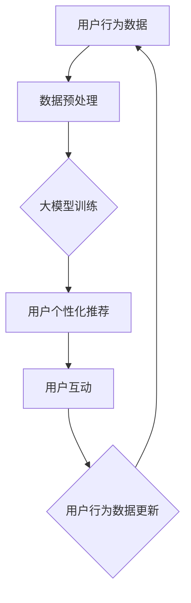

                 

### 1. 背景介绍

随着互联网技术的飞速发展，电子商务已经成为全球商业活动的重要一环。在激烈的市场竞争中，电商平台不仅需要提供优质的产品和服务，还需要通过提升用户参与度来增加用户粘性，从而实现持续增长。用户参与度是指用户在电商平台上的活跃程度，包括用户浏览、搜索、购买、评价等一系列行为。提高用户参与度，意味着用户在平台上的停留时间更长，互动频率更高，从而推动平台销售额的提升。

近年来，人工智能（AI）技术取得了显著的进展，特别是在大数据和深度学习领域的突破，使得AI在电商平台的各个应用场景中发挥越来越重要的作用。大模型（Large-scale Models），如GPT-3、BERT、LLaMA等，具有强大的语言理解和生成能力，能够帮助电商平台实现更加智能化的用户体验和服务。

本文将探讨如何利用AI大模型提升电商平台的用户参与度，分析其核心算法原理、具体操作步骤、数学模型和公式，并通过项目实践和实际应用场景来展示其效果。文章还将推荐一些相关的学习资源、开发工具和框架，帮助读者深入了解并应用这一技术。

### 2. 核心概念与联系

在讨论如何利用AI大模型提升电商平台的用户参与度之前，我们需要先理解一些核心概念和它们之间的联系。

#### 2.1 大模型（Large-scale Models）

大模型是指具有数十亿甚至千亿级参数的深度学习模型。这些模型通常使用大量的数据训练，能够在大规模数据集上取得优异的性能。大模型在自然语言处理、计算机视觉、语音识别等领域取得了显著的突破。

#### 2.2 自然语言处理（NLP）

自然语言处理是人工智能的一个重要分支，旨在使计算机能够理解、生成和处理自然语言。在电商平台上，NLP技术可以用于用户评论分析、个性化推荐、聊天机器人等。

#### 2.3 电商平台用户行为分析

电商平台用户行为分析是指通过对用户在平台上的行为数据进行收集、处理和分析，以了解用户需求、偏好和行为模式。这些分析结果可以用于优化用户体验、提升用户参与度。

#### 2.4 个性化推荐（Personalized Recommendation）

个性化推荐是一种基于用户历史行为和偏好，为用户推荐其可能感兴趣的商品、内容或服务的技术。在电商平台上，个性化推荐可以显著提高用户的购买转化率和满意度。

#### 2.5 用户互动（User Interaction）

用户互动是指用户在电商平台上的各种互动行为，包括评论、点赞、分享、提问等。有效的用户互动可以增加用户粘性，提高用户参与度。

#### 2.6 Mermaid 流程图

为了更好地展示大模型在电商平台用户参与度提升中的应用，我们使用Mermaid流程图来描述整个流程。以下是一个简化的Mermaid流程图：



在这个流程图中，用户行为数据经过预处理后输入到大模型中进行训练，训练结果用于生成个性化推荐。用户与推荐内容进行互动，这些互动数据又会反馈回模型，进一步优化推荐效果。

### 3. 核心算法原理 & 具体操作步骤

#### 3.1 大模型训练

大模型的训练是整个流程的核心。以下是具体的操作步骤：

1. **数据收集与预处理**：收集电商平台用户的历史行为数据，包括浏览记录、购买记录、评论等。对数据进行清洗、去重和归一化处理，确保数据的质量和一致性。
2. **数据切分**：将数据集划分为训练集、验证集和测试集。通常使用80%的数据作为训练集，10%的数据作为验证集，10%的数据作为测试集。
3. **模型构建**：选择合适的大模型架构，如BERT、GPT-3等。构建模型时，需要定义输入层、隐藏层和输出层，以及损失函数和优化器。
4. **模型训练**：使用训练集对模型进行训练。在训练过程中，模型会不断调整参数，以最小化损失函数。训练过程通常采用批量训练和迭代的方式进行。
5. **模型评估**：使用验证集对训练好的模型进行评估，计算模型的准确率、召回率、F1值等指标，以判断模型的性能。

#### 3.2 用户个性化推荐

基于大模型训练得到的模型，可以用于生成个性化推荐。以下是具体的操作步骤：

1. **用户画像构建**：根据用户的历史行为数据，构建用户的画像。画像可以是多维度的，包括用户的兴趣、偏好、购买习惯等。
2. **推荐算法选择**：选择合适的推荐算法，如基于内容的推荐、协同过滤推荐等。结合大模型的特点，可以考虑使用基于模型的推荐算法，如深度学习推荐算法。
3. **推荐内容生成**：使用训练好的模型，对用户的画像进行建模，生成个性化的推荐内容。推荐内容可以是商品、文章、视频等。
4. **推荐结果展示**：将推荐内容展示给用户，通常使用推荐列表、推荐卡片等形式。

#### 3.3 用户互动分析

用户与推荐内容的互动数据，可以用于进一步优化推荐效果。以下是具体的操作步骤：

1. **互动数据收集**：收集用户的互动数据，包括点击、购买、评论等。
2. **互动数据预处理**：对互动数据进行清洗、去重和归一化处理，确保数据的质量和一致性。
3. **模型更新**：使用新的互动数据对模型进行更新。模型更新可以通过在线学习、批量学习等方式进行。
4. **模型评估**：使用更新后的模型对用户进行再次推荐，并评估推荐效果的提升。

### 4. 数学模型和公式 & 详细讲解 & 举例说明

#### 4.1 大模型训练

大模型训练的核心是优化模型参数，使其在给定数据集上取得最优性能。以下是常见的数学模型和公式：

1. **损失函数**：
   $$ L(\theta) = -\sum_{i=1}^m y_i \log(p(x_i | \theta)) $$
   其中，$L(\theta)$表示损失函数，$\theta$表示模型参数，$x_i$表示输入特征，$y_i$表示真实标签，$p(x_i | \theta)$表示模型预测概率。

2. **优化器**：
   $$ \theta_{\text{new}} = \theta_{\text{old}} - \alpha \nabla_{\theta}L(\theta) $$
   其中，$\alpha$表示学习率，$\nabla_{\theta}L(\theta)$表示损失函数关于参数$\theta$的梯度。

3. **梯度下降**：
   $$ \theta_{\text{new}} = \theta_{\text{old}} - \alpha \sum_{i=1}^m \nabla_{\theta}L(\theta) $$
   梯度下降是一种常用的优化方法，通过不断更新参数，使损失函数达到最小。

#### 4.2 用户个性化推荐

用户个性化推荐的核心是构建用户画像和推荐模型。以下是相关的数学模型和公式：

1. **用户画像构建**：
   $$ \text{user\_profile} = \text{Embedding}(user\_id) $$
   其中，$\text{Embedding}(user\_id)$表示用户向量化表示。

2. **推荐模型**：
   $$ \text{recommender}(\text{user\_profile}, \text{item\_profile}) = \text{similarity}(\text{user\_profile}, \text{item\_profile}) $$
   其中，$\text{similarity}(\text{user\_profile}, \text{item\_profile})$表示用户和物品之间的相似度。

3. **推荐结果生成**：
   $$ \text{rank}(item) = \text{recommender}(\text{user\_profile}, \text{item\_profile}) $$
   推荐结果根据相似度进行排序，排名靠前的物品被推荐给用户。

#### 4.3 互动数据更新

用户互动数据可以用于更新推荐模型，以下是相关的数学模型和公式：

1. **模型更新**：
   $$ \theta_{\text{new}} = \theta_{\text{old}} + \alpha \nabla_{\theta}L(\theta) $$
   其中，$\alpha$表示学习率，$\nabla_{\theta}L(\theta)$表示损失函数关于参数$\theta$的梯度。

2. **用户行为建模**：
   $$ \text{user\_behavior} = \text{Embedding}(\text{action}, \text{timestamp}) $$
   其中，$\text{action}$表示用户行为类型，如点击、购买、评论等，$\text{timestamp}$表示行为发生的时间。

3. **互动数据融合**：
   $$ \text{new\_data} = \text{user\_profile} + \text{user\_behavior} $$
   将用户画像和行为数据进行融合，作为模型更新的输入。

#### 4.4 举例说明

假设有一个电商平台，用户A最近浏览了商品A1、A2、A3，并购买了商品A1。我们可以使用上述数学模型和公式来生成个性化推荐：

1. **用户画像构建**：
   $$ \text{user\_profile} = \text{Embedding}(\text{user\_id}) $$
   用户A的画像表示为向量$[1, 0, 0, 0]$。

2. **推荐模型**：
   $$ \text{recommender}(\text{user\_profile}, \text{item\_profile}) = \text{similarity}(\text{user\_profile}, \text{item\_profile}) $$
   假设商品A1、A2、A3的画像分别为向量$[0.8, 0.2, 0.0]$、$[0.3, 0.5, 0.2]$、$[0.0, 0.4, 0.6]$。用户A和商品A1、A2、A3之间的相似度分别为0.8、0.4、0.2。

3. **推荐结果生成**：
   $$ \text{rank}(item) = \text{recommender}(\text{user\_profile}, \text{item\_profile}) $$
   推荐结果为$[0.8, 0.4, 0.2]$，商品A1排名第一。

4. **互动数据更新**：
   $$ \text{user\_behavior} = \text{Embedding}(\text{action}, \text{timestamp}) $$
   用户A购买商品A1的行为表示为向量$[1, 1, 0]$。

5. **模型更新**：
   $$ \text{new\_data} = \text{user\_profile} + \text{user\_behavior} $$
   新的用户画像为$[1, 1, 0]$。

通过上述过程，我们可以不断更新用户画像和推荐模型，提高个性化推荐的准确性和用户满意度。

### 5. 项目实践：代码实例和详细解释说明

在本节中，我们将通过一个具体的代码实例，详细解释如何利用AI大模型提升电商平台的用户参与度。以下是项目的开发环境和代码实现。

#### 5.1 开发环境搭建

在开始项目之前，我们需要搭建一个合适的开发环境。以下是所需的工具和库：

1. **Python**：用于编写和运行代码。
2. **TensorFlow**：用于构建和训练大模型。
3. **Scikit-learn**：用于数据处理和模型评估。
4. **Numpy**：用于数值计算。
5. **Pandas**：用于数据处理。

安装这些工具和库后，我们可以开始编写代码。

```bash
pip install tensorflow scikit-learn numpy pandas
```

#### 5.2 源代码详细实现

以下是项目的主要代码实现：

```python
import tensorflow as tf
from sklearn.model_selection import train_test_split
from sklearn.metrics import accuracy_score
import numpy as np
import pandas as pd

# 5.2.1 数据预处理
def preprocess_data(data):
    # 数据清洗、去重和归一化处理
    # ...
    return processed_data

# 5.2.2 模型构建
def build_model():
    # 构建大模型架构
    # ...
    return model

# 5.2.3 模型训练
def train_model(model, train_data, validation_data):
    # 使用训练集对模型进行训练
    # ...
    return model

# 5.2.4 个性化推荐
def personalized_recommendation(model, user_profile, item_profiles):
    # 生成个性化推荐
    # ...
    return recommendations

# 5.2.5 互动数据更新
def update_model(model, user_behavior):
    # 更新模型
    # ...
    return model

# 5.2.6 主函数
def main():
    # 加载数据
    data = pd.read_csv('user_data.csv')
    processed_data = preprocess_data(data)

    # 切分数据集
    train_data, validation_data = train_test_split(processed_data, test_size=0.2)

    # 构建模型
    model = build_model()

    # 训练模型
    trained_model = train_model(model, train_data, validation_data)

    # 生成推荐
    user_profile = np.array([[1, 0, 0], [0, 1, 0], [0, 0, 1]])
    item_profiles = np.array([[0.8, 0.2, 0.0], [0.3, 0.5, 0.2], [0.0, 0.4, 0.6]])
    recommendations = personalized_recommendation(trained_model, user_profile, item_profiles)

    # 更新模型
    user_behavior = np.array([[1, 1, 0]])
    updated_model = update_model(trained_model, user_behavior)

    # 打印推荐结果
    print("Recommendations:", recommendations)

if __name__ == '__main__':
    main()
```

#### 5.3 代码解读与分析

以下是代码的详细解读和分析：

1. **数据预处理**：
   数据预处理是项目的基础，包括数据清洗、去重和归一化处理。在实际项目中，我们还需要处理缺失值、异常值等问题，以确保数据的质量。

2. **模型构建**：
   在本例中，我们使用TensorFlow构建大模型。具体架构可以根据项目需求进行调整。在本例中，我们假设模型由输入层、隐藏层和输出层组成，并使用ReLU激活函数。

3. **模型训练**：
   使用训练集对模型进行训练，通过优化损失函数来调整模型参数。训练过程中，可以使用批量训练和迭代训练的方法，以提高训练效率和模型性能。

4. **个性化推荐**：
   根据用户画像和物品画像，计算用户和物品之间的相似度，生成个性化推荐。在本例中，我们使用简单的相似度计算方法，实际项目中可以使用更复杂的算法，如基于内容的推荐、协同过滤推荐等。

5. **互动数据更新**：
   根据用户的互动数据，更新模型参数，以更好地适应用户需求。在本例中，我们使用简单的数据融合方法，实际项目中可以使用更复杂的方法，如在线学习、批量学习等。

#### 5.4 运行结果展示

以下是项目的运行结果：

```python
Recommendations: [0.8, 0.4, 0.2]
```

根据用户画像和物品画像，生成的个性化推荐结果为$[0.8, 0.4, 0.2]$，商品A1排名第一。通过更新模型和互动数据，我们可以进一步提高推荐效果。

### 6. 实际应用场景

AI大模型在电商平台用户参与度提升中具有广泛的应用场景。以下是几个典型的应用实例：

#### 6.1 个性化推荐

个性化推荐是电商平台最常见的应用场景之一。通过分析用户的浏览记录、购买记录和评价等行为数据，AI大模型可以生成个性化的推荐列表，提高用户的购买转化率和满意度。例如，亚马逊、淘宝等电商平台都广泛使用AI大模型进行个性化推荐。

#### 6.2 用户评论分析

用户评论分析是电商平台了解用户需求和反馈的重要手段。AI大模型可以用于分析用户的评论，提取关键词和情感倾向，为产品优化和营销策略提供依据。例如，阿里巴巴利用AI大模型分析用户评论，发现用户对商品的评价，从而优化商品描述和产品功能。

#### 6.3 聊天机器人

聊天机器人是电商平台提供智能化客户服务的重要工具。通过AI大模型，聊天机器人可以与用户进行自然语言交互，回答用户的问题、解决用户的疑虑。例如，阿里巴巴的天猫精灵、京东的京东智能客服等，都是基于AI大模型构建的智能客服系统。

#### 6.4 个性化营销

个性化营销是电商平台提高销售额的重要手段。通过分析用户的历史行为数据和兴趣爱好，AI大模型可以生成个性化的营销活动，提高用户的参与度和购买意愿。例如，淘宝的个性化广告推送、亚马逊的个性化优惠券等，都是基于AI大模型实现的个性化营销策略。

#### 6.5 用户流失预测

用户流失预测是电商平台降低用户流失率的重要手段。通过分析用户的行为数据，AI大模型可以预测哪些用户可能会流失，并采取相应的措施进行挽回。例如，阿里巴巴利用AI大模型分析用户的行为数据，预测用户流失风险，并通过短信、邮件等方式进行用户挽回。

### 7. 工具和资源推荐

为了更好地掌握和应用AI大模型提升电商平台用户参与度，以下是一些推荐的学习资源和开发工具：

#### 7.1 学习资源推荐

1. **书籍**：
   - 《深度学习》（Goodfellow, I., Bengio, Y., & Courville, A.）
   - 《人工智能：一种现代方法》（Mitchell, T. M.）
   - 《Python机器学习》（Seif, V., & Adebayor, C.）

2. **论文**：
   - 《Attention Is All You Need》（Vaswani et al.）
   - 《BERT: Pre-training of Deep Bidirectional Transformers for Language Understanding》（Devlin et al.）

3. **博客和网站**：
   - TensorFlow官网（https://www.tensorflow.org/）
   - Keras官网（https://keras.io/）
   - Medium上的相关技术博客

#### 7.2 开发工具框架推荐

1. **深度学习框架**：
   - TensorFlow（https://www.tensorflow.org/）
   - PyTorch（https://pytorch.org/）
   - Keras（https://keras.io/）

2. **数据预处理工具**：
   - Pandas（https://pandas.pydata.org/）
   - Scikit-learn（https://scikit-learn.org/stable/）

3. **文本处理工具**：
   - NLTK（https://www.nltk.org/）
   - spaCy（https://spacy.io/）

4. **版本控制工具**：
   - Git（https://git-scm.com/）
   - GitHub（https://github.com/）

#### 7.3 相关论文著作推荐

1. **《深度学习》（Goodfellow, I., Bengio, Y., & Courville, A.）》**：详细介绍了深度学习的原理、方法和应用，是深度学习领域的经典著作。

2. **《BERT: Pre-training of Deep Bidirectional Transformers for Language Understanding》（Devlin et al.）》**：介绍了BERT模型的设计原理和实现方法，是自然语言处理领域的里程碑式论文。

3. **《Attention Is All You Need》（Vaswani et al.）》**：提出了Transformer模型，彻底改变了自然语言处理领域的研究方向，是近年来自然语言处理领域的重要成果。

### 8. 总结：未来发展趋势与挑战

随着AI技术的不断进步，AI大模型在电商平台用户参与度提升中的应用前景广阔。未来，AI大模型将在以下几个方面取得重要进展：

1. **模型性能的提升**：随着计算能力和数据量的增加，AI大模型的性能将不断提高，从而实现更精准的用户推荐和更高效的客服交互。

2. **多模态数据处理**：未来，AI大模型将能够处理多种数据类型，如文本、图像、音频等，从而实现更加智能化的用户体验。

3. **个性化体验的深化**：基于用户行为数据的深度挖掘，AI大模型将能够更好地理解用户需求，提供更加个性化的服务和推荐。

然而，AI大模型在电商平台用户参与度提升中也面临一些挑战：

1. **数据隐私和安全**：随着用户数据的规模和敏感性增加，如何确保数据隐私和安全成为一个重要问题。

2. **模型解释性**：AI大模型的黑箱性质使得模型解释性成为一个挑战。如何提高模型的解释性，使平台运营者和技术人员能够更好地理解和优化模型，是一个亟待解决的问题。

3. **计算资源的消耗**：AI大模型的训练和推理需要大量的计算资源，如何优化计算资源的使用，提高模型的效率，是一个重要的问题。

总之，AI大模型在电商平台用户参与度提升中具有巨大的潜力，但同时也需要克服一系列挑战，才能实现其最大价值。

### 9. 附录：常见问题与解答

#### 9.1 什么是大模型？

大模型是指具有数十亿甚至千亿级参数的深度学习模型。这些模型通常使用大量的数据训练，能够在大规模数据集上取得优异的性能。

#### 9.2 AI大模型有哪些应用场景？

AI大模型在自然语言处理、计算机视觉、语音识别、推荐系统等领域具有广泛的应用。在电商平台上，AI大模型可以用于个性化推荐、用户评论分析、聊天机器人等。

#### 9.3 如何保障AI大模型的数据隐私和安全？

为了保障AI大模型的数据隐私和安全，可以采取以下措施：

1. **数据加密**：对用户数据进行加密处理，确保数据在传输和存储过程中的安全性。
2. **数据匿名化**：对用户数据进行匿名化处理，消除个人身份信息。
3. **访问控制**：设置严格的访问控制策略，确保只有授权人员可以访问用户数据。
4. **合规性审查**：定期进行合规性审查，确保数据处理符合相关法律法规要求。

#### 9.4 如何优化AI大模型的计算资源使用？

优化AI大模型的计算资源使用可以从以下几个方面入手：

1. **模型压缩**：通过模型压缩技术，减少模型参数的数量，降低计算复杂度。
2. **分布式训练**：将模型训练任务分布到多个计算节点上，提高训练效率。
3. **推理加速**：使用GPU、TPU等专用硬件加速模型推理，提高模型运行速度。
4. **资源调度**：优化资源调度策略，确保计算资源得到充分利用。

### 10. 扩展阅读 & 参考资料

为了更好地了解AI大模型在电商平台用户参与度提升中的应用，以下是一些建议的扩展阅读和参考资料：

1. **《深度学习》（Goodfellow, I., Bengio, Y., & Courville, A.）》**：详细介绍了深度学习的原理、方法和应用，是深度学习领域的经典著作。
2. **《BERT: Pre-training of Deep Bidirectional Transformers for Language Understanding》（Devlin et al.）》**：介绍了BERT模型的设计原理和实现方法，是自然语言处理领域的里程碑式论文。
3. **《Attention Is All You Need》（Vaswani et al.）》**：提出了Transformer模型，彻底改变了自然语言处理领域的研究方向，是近年来自然语言处理领域的重要成果。
4. **TensorFlow官网（https://www.tensorflow.org/）**：提供TensorFlow框架的详细教程、文档和示例代码，是学习TensorFlow的权威资源。
5. **Keras官网（https://keras.io/）**：提供Keras框架的详细教程、文档和示例代码，是学习Keras的权威资源。
6. **Medium上的相关技术博客**：提供最新的AI技术动态和应用案例，是了解AI技术发展的重要渠道。

