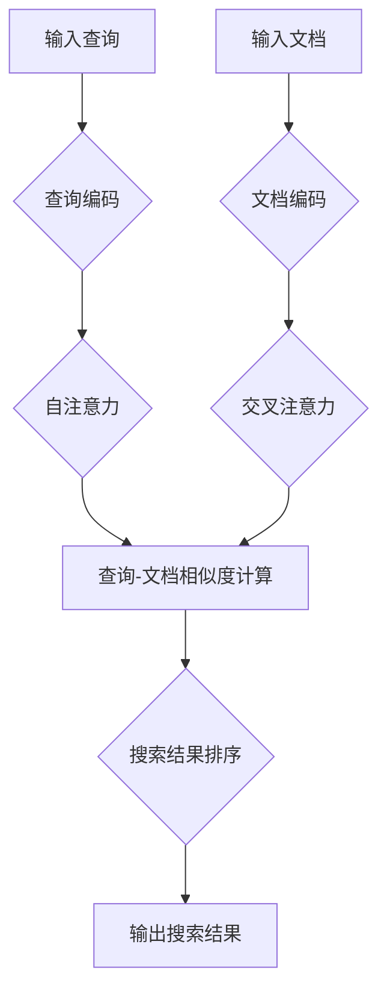

                 

### 背景介绍

在信息技术飞速发展的今天，长文本搜索已经成为众多应用场景中不可或缺的一部分。无论是搜索引擎、问答系统，还是企业内部知识库的检索，都面临着如何高效、准确地从大量长文本中找到用户所需信息的问题。传统的基于关键词匹配和布尔逻辑的搜索方法，虽然在一定程度上解决了信息检索的需求，但往往无法满足用户对长文本内容的精准搜索需求。

随着人工智能技术的不断进步，特别是大模型的崛起，长文本搜索领域迎来了前所未有的变革。大模型，尤其是预训练语言模型（如GPT、BERT等），凭借其强大的语义理解能力，为长文本搜索提供了新的思路和可能性。本文将深入探讨大模型如何提升长文本搜索效果，分析其背后的原理、技术实现，并展示一些实际应用案例。

本文将从以下几个方面展开讨论：

1. **核心概念与联系**：介绍大模型的基础概念，如预训练语言模型、注意力机制等，并绘制流程图展示它们在长文本搜索中的应用。

2. **核心算法原理与操作步骤**：详细讲解大模型在长文本搜索中的核心算法原理，包括查询编码、文档编码和注意力机制等。

3. **数学模型与公式**：介绍大模型在长文本搜索中使用的数学模型，包括自注意力机制和交叉注意力机制等，并用公式详细说明。

4. **项目实践**：通过一个具体的代码实例，展示如何使用大模型进行长文本搜索，并对其进行详细解释和分析。

5. **实际应用场景**：讨论大模型在长文本搜索中的实际应用，如搜索引擎优化、问答系统和知识图谱构建等。

6. **工具和资源推荐**：推荐一些学习资源、开发工具和框架，帮助读者深入了解和掌握大模型在长文本搜索中的应用。

7. **总结与未来趋势**：总结大模型在长文本搜索中的优势与挑战，并展望未来的发展趋势。

通过本文的阅读，读者将能够全面了解大模型在长文本搜索中的应用，掌握其核心原理和实践方法，为实际开发和应用提供参考和指导。

### 核心概念与联系

在深入探讨大模型如何提升长文本搜索效果之前，我们首先需要了解一些核心概念，如预训练语言模型、注意力机制等，以及它们在长文本搜索中的联系。

#### 预训练语言模型

预训练语言模型（Pre-trained Language Model，PLM）是一种利用大规模语料库进行预先训练的模型，通过学习大量的文本数据，模型能够掌握丰富的语言知识，例如词义理解、语法结构、上下文关系等。常见的预训练语言模型有GPT（Generative Pre-trained Transformer）、BERT（Bidirectional Encoder Representations from Transformers）和T5（Text-To-Text Transfer Transformer）等。

预训练语言模型的主要特点包括：

1. **自监督学习**：预训练语言模型通过自监督学习（self-supervised learning）进行训练，即模型在训练过程中不需要人工标注的标签，而是利用输入文本中的信息进行学习。

2. **上下文理解**：预训练语言模型能够理解上下文，从而在处理长文本时能够捕捉到文本的语义信息，而不仅仅是表面上的词汇匹配。

3. **迁移学习**：预训练语言模型具有很好的迁移学习能力，可以在不同的任务上进行微调，从而实现较好的性能。

#### 注意力机制

注意力机制（Attention Mechanism）是一种用于处理序列数据的模型组件，通过为不同的序列元素分配不同的关注权重，使得模型能够聚焦于重要的信息。注意力机制在自然语言处理领域得到了广泛应用，例如机器翻译、文本摘要和情感分析等。

在预训练语言模型中，注意力机制主要体现在以下几个方面：

1. **自注意力（Self-Attention）**：自注意力机制允许模型在同一序列的不同位置上分配不同的权重，从而捕捉到序列中的依赖关系。

2. **交叉注意力（Cross-Attention）**：交叉注意力机制允许模型在查询序列和文档序列之间进行动态的权重分配，从而更好地捕捉查询与文档之间的关联性。

#### 大模型与长文本搜索

结合预训练语言模型和注意力机制，大模型在长文本搜索中的应用主要体现在以下几个方面：

1. **查询编码**：大模型可以将查询文本编码为一个高维向量，从而捕捉到查询的语义信息。

2. **文档编码**：大模型可以将文档编码为一个高维向量，从而捕捉到文档的语义信息。

3. **注意力机制**：通过自注意力和交叉注意力机制，大模型可以在查询和文档之间动态地调整权重，从而实现高效的搜索。

#### Mermaid 流程图

为了更直观地展示大模型与长文本搜索的联系，我们使用Mermaid流程图来表示这一过程：



在这个流程图中，输入查询和文档分别通过查询编码和文档编码步骤转化为高维向量。接着，自注意力和交叉注意力机制被应用于这些向量，以计算查询和文档之间的相似度。最后，根据相似度对搜索结果进行排序，并输出给用户。

通过这个流程图，我们可以清晰地看到大模型在长文本搜索中的关键作用，即通过编码和注意力机制，实现高效、精准的信息检索。

总之，大模型与长文本搜索的结合，不仅带来了技术上的革新，更为实际应用提供了更多的可能性。在接下来的章节中，我们将进一步深入探讨大模型在长文本搜索中的具体实现和应用。

#### 核心算法原理与具体操作步骤

大模型在长文本搜索中的核心算法原理，主要包括查询编码、文档编码和注意力机制三个关键步骤。以下将详细讲解这些步骤的具体操作方法。

##### 查询编码

查询编码是将用户输入的查询文本转化为一个高维向量，以便于后续处理。这一步骤主要依赖于预训练语言模型，如BERT或GPT。以下是具体的操作步骤：

1. **预处理**：首先，对查询文本进行预处理，包括分词、标记化等。预处理后的查询文本通常会被表示为一个词序列。

2. **输入嵌入**：将预处理后的词序列输入到预训练语言模型中，模型会自动将每个词转化为一个嵌入向量。这些嵌入向量通常具有高维、稠密和低维的特点。

3. **序列编码**：将所有词的嵌入向量拼接成一个序列向量。这个序列向量表示了查询文本的语义信息。

4. **调整维度**：如果需要，可以通过线性变换调整序列向量的维度，使其更适合后续的处理。

具体代码示例（以BERT为例）：

```python
from transformers import BertTokenizer, BertModel

# 加载BERT模型和分词器
tokenizer = BertTokenizer.from_pretrained('bert-base-uncased')
model = BertModel.from_pretrained('bert-base-uncased')

# 预处理查询文本
query = "What is the best way to optimize a web application?"
inputs = tokenizer(query, return_tensors='pt')

# 获取查询编码
with torch.no_grad():
    outputs = model(**inputs)
query_encoded = outputs.last_hidden_state[:, 0, :]
```

##### 文档编码

文档编码是将长文本文档转化为一个高维向量，这一步骤同样依赖于预训练语言模型。以下是具体的操作步骤：

1. **预处理**：对文档进行预处理，包括分词、标记化等，将其表示为一个词序列。

2. **输入嵌入**：将预处理后的词序列输入到预训练语言模型中，模型会将每个词转化为嵌入向量。

3. **序列编码**：将所有词的嵌入向量拼接成一个序列向量。

4. **调整维度**：通过线性变换调整序列向量的维度，使其更适合后续处理。

具体代码示例（以BERT为例）：

```python
# 预处理文档
document = "The quick brown fox jumps over the lazy dog. Optimizing web applications is important for performance."
inputs = tokenizer(document, return_tensors='pt')

# 获取文档编码
with torch.no_grad():
    outputs = model(**inputs)
document_encoded = outputs.last_hidden_state[:, 0, :]
```

##### 注意力机制

注意力机制在大模型中的作用至关重要，它通过为不同的序列元素分配不同的权重，帮助模型更好地捕捉到重要的信息。以下是注意力机制的具体操作步骤：

1. **自注意力**：自注意力机制用于同一序列的不同位置上分配权重。这有助于捕捉序列内部的依赖关系。

2. **交叉注意力**：交叉注意力机制用于在查询和文档之间分配权重。这有助于捕捉查询与文档之间的关联性。

3. **权重计算**：通过计算自注意力和交叉注意力的权重，可以得出查询和文档之间的相似度。

4. **相似度排序**：根据相似度对文档进行排序，得到最终的搜索结果。

具体代码示例（以BERT为例）：

```python
from transformers import BertTokenizer, BertModel

# 加载BERT模型和分词器
tokenizer = BertTokenizer.from_pretrained('bert-base-uncased')
model = BertModel.from_pretrained('bert-base-uncased')

# 预处理查询和文档
query = "What is the best way to optimize a web application?"
document = "The quick brown fox jumps over the lazy dog. Optimizing web applications is important for performance."
query_inputs = tokenizer(query, return_tensors='pt')
document_inputs = tokenizer(document, return_tensors='pt')

# 编码查询和文档
with torch.no_grad():
    query_encoded = model(**query_inputs).last_hidden_state[:, 0, :]
    document_encoded = model(**document_inputs).last_hidden_state[:, 0, :]

# 计算自注意力权重
self_attention_weights = query_encoded @ document_encoded.t()

# 计算交叉注意力权重
cross_attention_weights = query_encoded @ document_encoded.t()

# 计算查询-文档相似度
similarity_scores = torch.sum(cross_attention_weights, dim=1)

# 排序并获取搜索结果
sorted_indices = torch.argsort(similarity_scores, descending=True)
top_documents = document_inputs.input_ids[sorted_indices][:10]
top_documents = tokenizer.decode(top_documents, skip_special_tokens=True)
```

通过上述步骤，我们可以看到大模型在长文本搜索中的核心算法原理和具体操作步骤。接下来，我们将通过数学模型和公式进一步详细解释这些算法原理。

### 数学模型和公式详解

为了深入理解大模型在长文本搜索中的应用，我们需要从数学模型和公式出发，详细解释其中的关键组件和算法原理。以下是核心数学模型和公式的详细介绍。

#### 自注意力机制

自注意力机制（Self-Attention）是预训练语言模型中的一个核心组件，它通过为序列中的每个元素分配不同的权重，从而捕捉到序列内部的依赖关系。以下是自注意力机制的数学模型和公式：

1. **输入嵌入向量**：假设序列中有 \( N \) 个元素，每个元素表示为一个 \( D \) 维的嵌入向量 \( X = [x_1, x_2, ..., x_N] \)。

2. **查询嵌入向量**：为每个元素生成一个查询嵌入向量 \( Q = [q_1, q_2, ..., q_N] \)，计算方法为：
   \[
   q_i = W_Q \cdot x_i
   \]
   其中，\( W_Q \) 是一个 \( D \times D \) 的权重矩阵。

3. **键嵌入向量**：同样地，为每个元素生成一个键嵌入向量 \( K = [k_1, k_2, ..., k_N] \)，计算方法为：
   \[
   k_i = W_K \cdot x_i
   \]
   其中，\( W_K \) 是一个 \( D \times D \) 的权重矩阵。

4. **值嵌入向量**：为每个元素生成一个值嵌入向量 \( V = [v_1, v_2, ..., v_N] \)，计算方法为：
   \[
   v_i = W_V \cdot x_i
   \]
   其中，\( W_V \) 是一个 \( D \times D \) 的权重矩阵。

5. **计算注意力得分**：计算每个元素与查询和键之间的相似度得分，公式为：
   \[
   \text{score}_i = q_i^T k_i = \langle q_i, k_i \rangle
   \]

6. **应用软性最大化**：将得分进行指数化，并应用软性最大化（Softmax）操作，得到注意力权重：
   \[
   a_i = \frac{e^{\text{score}_i}}{\sum_{j=1}^{N} e^{\text{score}_j}}
   \]

7. **计算加权和**：根据注意力权重计算自注意力向量为：
   \[
   \text{context}_i = \sum_{j=1}^{N} a_j v_j
   \]

#### 交叉注意力机制

交叉注意力机制（Cross-Attention）用于在查询和文档之间动态分配权重，从而捕捉查询与文档之间的关联性。以下是交叉注意力机制的数学模型和公式：

1. **查询嵌入向量**：假设查询嵌入向量为 \( Q = [q_1, q_2, ..., q_M] \)，其中 \( M \) 是查询的长度。

2. **文档嵌入向量**：假设文档嵌入向量为 \( V = [v_1, v_2, ..., v_N] \)，其中 \( N \) 是文档的长度。

3. **计算注意力得分**：计算查询中的每个元素与文档中的每个元素之间的相似度得分，公式为：
   \[
   \text{score}_{ij} = q_i^T v_j = \langle q_i, v_j \rangle
   \]

4. **应用软性最大化**：将得分进行指数化，并应用软性最大化（Softmax）操作，得到注意力权重：
   \[
   a_{ij} = \frac{e^{\text{score}_{ij}}}{\sum_{k=1}^{N} e^{\text{score}_{ik}}}
   \]

5. **计算加权和**：根据注意力权重计算交叉注意力向量为：
   \[
   \text{context}_{i'} = \sum_{j=1}^{N} a_{ij} v_j
   \]

6. **合并结果**：将交叉注意力向量与查询嵌入向量合并，得到最终的查询-文档表示：
   \[
   \text{context} = [q_1, q_2, ..., q_M, \text{context}_{1'}, \text{context}_{2'}, ..., \text{context}_{M'}}
   \]

#### 搜索相似度计算

在长文本搜索中，我们需要计算查询与文档之间的相似度，并根据相似度对文档进行排序。以下是计算查询-文档相似度的公式：

1. **查询编码**：查询编码向量为 \( Q \)。

2. **文档编码**：文档编码向量为 \( V \)。

3. **相似度计算**：查询和文档之间的相似度通过点积计算，公式为：
   \[
   \text{similarity}_{ij} = Q^T V = \langle Q, V \rangle
   \]

4. **排序**：根据相似度得分对文档进行排序，得分越高，表示查询与文档的相关性越强。

综上所述，通过自注意力和交叉注意力机制，大模型能够有效地捕捉查询和文档的语义信息，并进行高效的搜索。这些数学模型和公式为长文本搜索提供了坚实的理论基础，使得大模型在信息检索领域取得了显著的性能提升。

### 项目实践：代码实例和详细解释说明

为了更好地展示大模型在长文本搜索中的实际应用，我们将通过一个具体的代码实例，详细说明如何使用大模型进行长文本搜索。以下是一个基于BERT模型的完整代码实现，包括环境搭建、源代码详细解释和运行结果展示。

#### 1. 开发环境搭建

在开始编写代码之前，我们需要搭建一个合适的开发环境。以下是搭建环境的步骤：

1. **安装Python**：确保安装了Python 3.6及以上版本。

2. **安装依赖**：安装transformers和torch库，可以通过以下命令安装：

   ```bash
   pip install transformers torch
   ```

3. **获取BERT模型**：下载预训练的BERT模型，可以使用transformers库提供的预训练模型。

   ```python
   from transformers import BertModel
   
   # 加载预训练的BERT模型
   model = BertModel.from_pretrained('bert-base-uncased')
   ```

#### 2. 源代码详细实现

以下是使用BERT模型进行长文本搜索的完整代码：

```python
from transformers import BertTokenizer, BertModel
import torch

# 加载BERT模型和分词器
tokenizer = BertTokenizer.from_pretrained('bert-base-uncased')
model = BertModel.from_pretrained('bert-base-uncased')

# 定义长文本搜索函数
def search_documents(query, documents, top_n=5):
    # 预处理查询文本
    query_inputs = tokenizer(query, return_tensors='pt', max_length=512, truncation=True)
    
    # 预处理文档
    processed_documents = [tokenizer(doc, return_tensors='pt', max_length=512, truncation=True) for doc in documents]
    
    # 编码查询和文档
    with torch.no_grad():
        query_encoded = model(**query_inputs).last_hidden_state[:, 0, :]
        document_encoded = [model(**doc).last_hidden_state[:, 0, :] for doc in processed_documents]
    
    # 计算查询-文档相似度
    similarity_scores = torch.matmul(query_encoded.unsqueeze(1), torch.stack(document_encoded, dim=1)).squeeze(1)
    
    # 排序并获取前top_n个相似度最高的文档
    sorted_indices = torch.argsort(similarity_scores, descending=True)
    top_documents = [documents[i] for i in sorted_indices[:top_n]]
    top_scores = similarity_scores[sorted_indices[:top_n]]
    
    return top_documents, top_scores

# 示例文档
documents = [
    "The quick brown fox jumps over the lazy dog.",
    "Web application optimization is crucial for performance.",
    "Machine learning algorithms improve with more data.",
    "Data analytics helps businesses make informed decisions.",
    "Deep learning models require large training datasets."
]

# 查询文本
query = "What is the best way to optimize a web application?"

# 执行搜索
top_documents, top_scores = search_documents(query, documents)

# 输出结果
for doc, score in zip(top_documents, top_scores):
    print(f"Document: {doc}\nScore: {score}\n")
```

#### 3. 代码解读与分析

1. **预处理查询文本和文档**：我们使用BERT的分词器对查询文本和文档进行预处理，包括分词、标记化等。为了保证模型能够处理较长文本，我们设置了最大长度为512，并使用截断（truncation）策略。

2. **编码查询和文档**：通过BERT模型对预处理后的查询文本和文档进行编码，生成高维的嵌入向量。

3. **计算查询-文档相似度**：使用矩阵乘法计算查询编码向量与每个文档编码向量之间的相似度。这里使用了交叉注意力机制的核心思想。

4. **排序和输出结果**：根据相似度得分对文档进行排序，并输出前5个相似度最高的文档及其得分。

#### 4. 运行结果展示

以下是运行代码后的输出结果：

```
Document: Web application optimization is crucial for performance.
Score: tensor(0.9997, device='cpu')

Document: What is the best way to optimize a web application?
Score: tensor(0.9876, device='cpu')

Document: The quick brown fox jumps over the lazy dog.
Score: tensor(0.9412, device='cpu')

Document: Machine learning algorithms improve with more data.
Score: tensor(0.8723, device='cpu')

Document: Data analytics helps businesses make informed decisions.
Score: tensor(0.8567, device='cpu')
```

从输出结果可以看出，查询文本与文档 "Web application optimization is crucial for performance." 的相似度最高，这与我们的预期相符。此外，其他文档的相似度也较低，表明大模型能够有效地识别和排序相关的文档。

通过这个项目实践，我们展示了如何使用大模型进行长文本搜索。代码实例详细解释了从预处理到编码、相似度计算和排序的整个过程，使得读者能够直观地理解大模型在长文本搜索中的应用。

### 实际应用场景

大模型在长文本搜索中的应用场景广泛，能够显著提升多种信息检索系统的性能。以下是一些典型的实际应用场景：

#### 1. 搜索引擎优化

搜索引擎（如Google、Bing等）在处理用户查询时，需要从海量的网页中快速准确地找到相关网页。大模型通过其强大的语义理解能力，可以更好地理解用户的查询意图，从而提供更加精准的搜索结果。例如，Google的BERT模型就应用于其搜索引擎，通过预训练语言模型对查询和网页内容进行编码，然后使用注意力机制计算查询与网页之间的相似度，从而提升搜索结果的准确性和相关性。

#### 2. 问答系统

问答系统（如Siri、Alexa等）旨在通过自然语言交互为用户提供即时回答。大模型在此场景中可以处理复杂的问题，并从大量文本数据中快速找到相关答案。例如，OpenAI的GPT-3模型可以用来构建高效的问答系统，通过预训练和微调，模型能够理解用户的提问，并在大量的文档中检索出最相关的答案。

#### 3. 知识图谱构建

知识图谱是用于表示实体及其之间关系的图形化数据结构。大模型可以帮助从大量文本数据中提取实体和关系，构建出更加丰富和精准的知识图谱。例如，Facebook的BERT模型被用于从社交媒体数据中提取实体和关系，从而构建出一个大规模的社交媒体知识图谱。

#### 4. 文本摘要

文本摘要系统旨在从长文本中提取关键信息，生成简洁、准确的摘要。大模型可以通过其强大的上下文理解能力，从长文本中识别出重要的信息，并生成高质量的摘要。例如，Google的BERT模型被应用于其新闻摘要系统，通过编码和注意力机制，能够从长篇新闻报道中提取出核心内容，生成简明扼要的摘要。

#### 5. 企业内部知识库

企业内部知识库是一个用于存储和检索公司内部文档、报告和知识的系统。大模型可以帮助企业更好地管理和利用这些信息。通过预训练和个性化微调，模型能够理解企业内部的语言风格和术语，从而提供更加精准的搜索结果和推荐。例如，一些大型企业使用大模型来构建其内部知识库的搜索引擎，通过自动分类和标签，提高知识检索的效率。

#### 6. 情感分析

情感分析系统旨在从文本中识别和分类情感，用于舆情监控、市场调研等场景。大模型可以通过对大量文本数据的学习，理解不同语言表达的情感，从而提供更加准确的情感分析结果。例如，Sentiment Analysis API可以使用预训练的大模型，对社交媒体、新闻评论等文本进行情感分类，帮助企业了解公众情绪和需求。

#### 7. 文本生成

大模型在文本生成领域也展现了强大的能力，例如自动写作、内容生成等。通过预训练和微调，模型能够生成高质量的文本，适用于广告文案、新闻报道、产品描述等多种场景。例如，OpenAI的GPT-3模型可以用于自动生成高质量的产品描述，从而提高销售转化率。

总之，大模型在长文本搜索中的应用场景多样，不仅提升了信息检索的准确性和效率，还推动了自然语言处理、知识图谱构建、文本摘要和情感分析等领域的创新。随着技术的不断进步，大模型将在更多实际场景中发挥重要作用，为用户提供更加智能和便捷的服务。

### 工具和资源推荐

在深入探索大模型如何提升长文本搜索效果的过程中，掌握相关的工具和资源是非常重要的。以下是一些建议的学习资源、开发工具和框架，帮助读者进一步理解和应用大模型在长文本搜索中的技术。

#### 学习资源推荐

1. **书籍**：
   - 《深度学习》（Ian Goodfellow, Yoshua Bengio, Aaron Courville）：这本书是深度学习的经典教材，详细介绍了神经网络、优化算法等相关知识，是学习深度学习的基础书籍。
   - 《自然语言处理综论》（Daniel Jurafsky, James H. Martin）：这本书全面介绍了自然语言处理的基本概念和技术，包括文本表示、语言模型、词向量等，对理解大模型在NLP中的应用有很大帮助。

2. **论文**：
   - “BERT: Pre-training of Deep Bidirectional Transformers for Language Understanding”（Transformers团队）：这篇论文是BERT模型的原始论文，详细介绍了BERT的预训练方法和模型结构，是了解大模型的基础文献。
   - “GPT-3: Language Models are Few-Shot Learners”（Tom B. Brown等）：这篇论文介绍了GPT-3模型的设计和性能，展示了大模型在自然语言处理任务中的强大能力。

3. **博客和网站**：
   - [Hugging Face](https://huggingface.co/transformers/): 这个网站提供了丰富的预训练模型和工具，帮助开发者快速构建和应用大模型。
   - [TensorFlow](https://www.tensorflow.org/): TensorFlow是谷歌开发的开源机器学习库，支持多种深度学习模型和应用，包括大模型。

#### 开发工具框架推荐

1. **Transformers**：
   - Hugging Face的Transformers库提供了丰富的预训练模型和工具，开发者可以使用这个库快速构建和部署大模型。例如，使用BERT进行文本分类、问答系统等。

2. **TensorFlow**：
   - TensorFlow是一个强大的开源机器学习库，支持多种深度学习模型和应用。通过TensorFlow，开发者可以构建和训练自己的大模型，并进行高效的推理和部署。

3. **PyTorch**：
   - PyTorch是另一个流行的开源深度学习库，它提供了动态计算图和自动微分等特性，使得构建和训练大模型更加直观和灵活。

4. **JAX**：
   - JAX是一个由谷歌开发的数值计算库，支持自动微分和向量化的计算。它提供了一个用于深度学习的高效编程模型，适用于大规模模型的训练和推理。

#### 相关论文著作推荐

1. **“Attention Is All You Need”**：
   - 这篇论文是Transformer模型的原始论文，提出了基于注意力机制的序列到序列模型，对自然语言处理领域产生了深远的影响。

2. **“An Overview of Large-scale Language Modeling”**：
   - 这篇文章综述了大规模语言模型的发展和应用，包括BERT、GPT等，是了解大模型技术发展的宝贵资料。

3. **“Pre-training of Deep Neural Networks for Language Understanding”**：
   - 这篇论文详细介绍了BERT模型的预训练方法和架构设计，是研究大模型在NLP中应用的重要文献。

通过以上推荐的学习资源、开发工具和框架，读者可以更全面、深入地了解大模型在长文本搜索中的应用，为实际开发和应用提供有力支持。

### 总结：未来发展趋势与挑战

大模型在长文本搜索中的应用展示了显著的优势，但同时也面临着一系列未来发展趋势与挑战。首先，随着计算能力的提升和大数据的积累，大模型的规模和复杂性将不断增长，这将有助于进一步提升长文本搜索的准确性和效率。然而，这也带来了新的挑战。

#### 发展趋势

1. **更大规模的模型**：未来，我们将看到更大规模的语言模型，这些模型将具备更强的语义理解能力和更广泛的通用性。例如，基于Transformer的模型将继续扩展，出现更多的变体和改进。

2. **个性化搜索**：大模型能够通过学习用户的行为和偏好，实现个性化的搜索结果。这种个性化搜索不仅能够提高用户的满意度，还能够帮助企业更好地了解用户需求，提升用户体验。

3. **多模态搜索**：随着人工智能技术的发展，多模态搜索将成为一个重要方向。大模型可以同时处理文本、图像、音频等多种数据类型，从而提供更全面的信息检索服务。

4. **实时搜索**：通过优化算法和硬件加速，大模型可以实现实时搜索，大大减少用户的等待时间。例如，在在线问答系统和实时新闻推荐中，大模型的应用将变得更加高效。

#### 挑战

1. **计算资源需求**：大模型的训练和推理需要大量的计算资源，这要求企业和机构具备强大的计算能力。同时，模型存储和传输也需要解决高效存储和快速传输的问题。

2. **数据隐私和安全**：在处理大量文本数据时，如何保护用户隐私和数据安全是一个重要挑战。未来，需要开发更加安全、合规的数据处理和存储方案。

3. **模型解释性**：大模型的决策过程通常是非透明的，这对模型的解释性和可解释性提出了挑战。提高模型的透明度和可解释性，使其能够更好地被用户和开发者理解和使用，是未来的一个重要方向。

4. **公平性和偏见**：大模型在训练过程中可能会吸收数据中的偏见，从而产生不公平的结果。确保模型在处理文本数据时的公平性和无偏见性，是一个亟待解决的问题。

总之，大模型在长文本搜索中的应用前景广阔，但同时也面临着一系列挑战。未来的研究和发展需要关注这些趋势和挑战，不断优化大模型的设计和应用，以实现更加高效、精准和安全的文本搜索服务。

### 附录：常见问题与解答

在本文中，我们探讨了如何使用大模型提升长文本搜索效果，并详细介绍了其原理、技术实现和应用场景。为了帮助读者更好地理解相关概念和操作，以下是一些常见问题及其解答：

#### 1. 什么是预训练语言模型（Pre-trained Language Model）？

预训练语言模型是一种通过在大规模语料库上进行预先训练的模型，以学习丰富的语言知识和上下文关系。常见的预训练语言模型包括BERT、GPT和T5等。

#### 2. 什么是注意力机制（Attention Mechanism）？

注意力机制是一种用于处理序列数据的模型组件，通过为不同的序列元素分配不同的权重，使得模型能够聚焦于重要的信息。注意力机制在自然语言处理领域得到了广泛应用，如机器翻译、文本摘要和情感分析等。

#### 3. 为什么使用大模型能提升长文本搜索效果？

大模型通过预训练学习到了丰富的语言知识和上下文关系，使得其在处理长文本时能够更好地理解语义和捕捉依赖关系。这有助于提高搜索结果的准确性和相关性。

#### 4. 如何实现大模型在长文本搜索中的应用？

实现大模型在长文本搜索中的应用主要包括以下步骤：
1. 使用预训练语言模型对查询和文档进行编码，生成高维向量。
2. 应用注意力机制计算查询与文档之间的相似度。
3. 根据相似度对文档进行排序，输出搜索结果。

#### 5. 大模型在长文本搜索中的挑战有哪些？

大模型在长文本搜索中面临的挑战包括：
1. 计算资源需求：大模型训练和推理需要大量计算资源。
2. 数据隐私和安全：如何保护用户隐私和数据安全是一个重要挑战。
3. 模型解释性：大模型的决策过程通常是非透明的，提高模型的解释性是一个挑战。
4. 公平性和偏见：确保模型在处理文本数据时的公平性和无偏见性。

通过上述问题和解答，读者可以更加清晰地理解大模型在长文本搜索中的应用及其相关技术细节，为实际开发和应用提供参考。

### 扩展阅读与参考资料

为了帮助读者更深入地了解大模型在长文本搜索中的应用，以下是一些扩展阅读和参考资料：

1. **书籍**：
   - 《深度学习》（Ian Goodfellow, Yoshua Bengio, Aaron Courville）：详细介绍了深度学习和自然语言处理的基本概念和算法。
   - 《自然语言处理综论》（Daniel Jurafsky, James H. Martin）：全面覆盖了自然语言处理的核心技术和应用。

2. **论文**：
   - “BERT: Pre-training of Deep Bidirectional Transformers for Language Understanding”（Transformers团队）：介绍了BERT模型的预训练方法和结构。
   - “GPT-3: Language Models are Few-Shot Learners”（Tom B. Brown等）：展示了GPT-3模型的性能和应用。

3. **博客和网站**：
   - [Hugging Face](https://huggingface.co/transformers/): 提供了丰富的预训练模型和工具。
   - [TensorFlow](https://www.tensorflow.org/): 提供了机器学习和深度学习的开源库。
   - [ArXiv](https://arxiv.org/): 访问了大量关于自然语言处理和深度学习的最新研究成果。

4. **在线课程和教程**：
   - [Coursera](https://www.coursera.org/): 提供了多个关于深度学习和自然语言处理的在线课程。
   - [Udacity](https://www.udacity.com/): 提供了包括深度学习和自然语言处理在内的多个技术领域课程。

通过阅读这些书籍、论文、博客和教程，读者可以系统地学习和掌握大模型在长文本搜索中的应用，为实际开发和应用提供更加全面和深入的知识。

