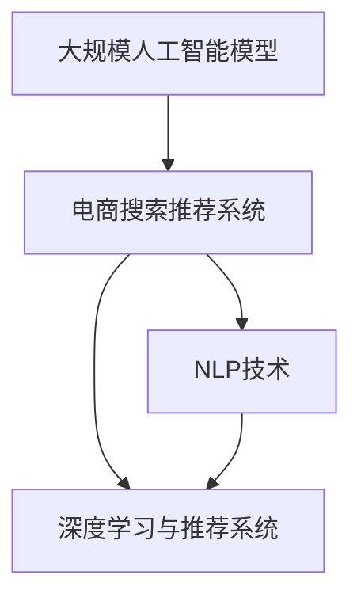
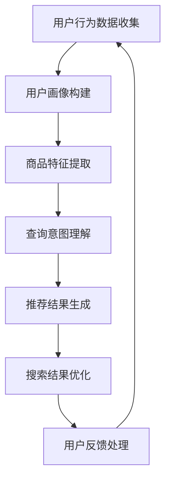
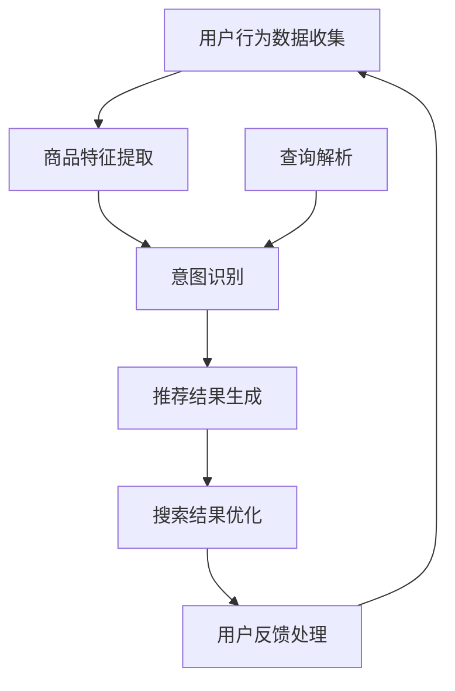

                 

### 背景介绍

随着人工智能技术的飞速发展，电商行业迎来了新的变革。在过去的几年中，电商平台通过用户行为分析和数据挖掘技术，已经在商品推荐和搜索结果优化方面取得了显著的成果。然而，随着用户数据量的爆炸式增长和个性化需求的日益多样化，传统的推荐算法和搜索技术已经难以满足用户的高效、精准体验。

在这个背景下，大规模人工智能模型（Large-scale Artificial Intelligence Models，简称LAI Models）的出现，为电商搜索推荐带来了前所未有的机遇。本文将探讨AI大模型如何改变电商搜索推荐的游戏规则，并深入分析其核心概念、算法原理、实践应用以及未来发展趋势。

首先，我们需要明确什么是AI大模型。AI大模型指的是通过深度学习和大数据技术训练得到的规模巨大、参数数量庞大的神经网络模型。这些模型通常具备极高的计算能力和学习效率，能够在复杂的任务中取得出色的表现。例如，基于Transformer架构的GPT-3模型，拥有1750亿个参数，能够实现自然语言处理和生成的高效准确。

在电商领域，AI大模型的应用主要体现在以下几个方面：

1. **个性化推荐**：通过分析用户的浏览、购买等行为数据，AI大模型能够准确预测用户的兴趣和需求，为用户推荐最符合其个性化需求的商品。
2. **搜索结果优化**：AI大模型通过对用户输入的查询信息进行理解和分析，能够返回更加相关、精准的搜索结果，提升用户的搜索体验。
3. **商品评价与预测**：AI大模型可以分析用户对商品的评论，预测商品的销售趋势，帮助电商平台优化库存管理和营销策略。
4. **智能客服**：AI大模型可以模拟人类客服进行自然语言对话，提高客服效率，降低运营成本。

接下来，我们将详细探讨AI大模型在电商搜索推荐中的应用原理、算法实现以及实际案例，帮助大家更深入地理解这一新兴技术如何改变电商行业的游戏规则。

### 核心概念与联系

在探讨AI大模型如何改变电商搜索推荐的游戏规则之前，我们首先需要明确几个核心概念，并了解它们之间的联系。

#### 1. 大规模人工智能模型（LAI Models）

如前所述，大规模人工智能模型（LAI Models）是通过深度学习和大数据技术训练得到的规模巨大、参数数量庞大的神经网络模型。这些模型通常具备以下特点：

- **高参数数量**：AI大模型通常包含数十亿甚至数千亿个参数，这使得它们能够捕捉数据中的复杂模式和关系。
- **强大计算能力**：由于参数数量巨大，AI大模型需要强大的计算资源进行训练和推理，通常依赖于高性能GPU和分布式计算框架。
- **高效学习效率**：AI大模型能够在大量数据中进行高效的学习，从而实现卓越的性能表现。

#### 2. 电商搜索推荐系统

电商搜索推荐系统是电商平台的核心组成部分，其主要目标是根据用户的历史行为和兴趣，为用户提供个性化、精准的搜索和推荐结果。一个典型的电商搜索推荐系统包括以下几个关键模块：

- **用户画像**：通过对用户的浏览、购买、评论等行为数据进行分析，构建用户的兴趣和需求模型。
- **商品特征提取**：对商品的属性、标签、描述等信息进行提取和编码，为后续的推荐算法提供基础数据。
- **推荐算法**：采用各种推荐算法，如基于内容的推荐、协同过滤、深度学习推荐等，生成个性化推荐结果。
- **搜索算法**：对用户的查询请求进行分析和解析，返回最相关、最精准的搜索结果。

#### 3. 自然语言处理（NLP）

自然语言处理（NLP）是AI大模型在电商搜索推荐中的重要应用领域。通过NLP技术，AI大模型能够理解用户的查询意图和商品描述，从而实现更精准的搜索和推荐。NLP的关键技术包括：

- **分词与词性标注**：将用户的查询语句和商品描述进行分词，并对每个词进行词性标注，如名词、动词、形容词等。
- **命名实体识别**：识别用户查询语句中的关键实体，如商品名称、品牌、价格等。
- **情感分析**：分析用户的评论和评价，判断其情感倾向，如正面、负面、中性等。

#### 4. 深度学习与推荐系统

深度学习是AI大模型的核心技术，广泛应用于推荐系统的各个模块。深度学习推荐系统主要包括以下几个关键步骤：

- **特征工程**：通过对用户行为数据和商品特征进行分析和提取，构建深度学习模型所需的高质量特征。
- **模型训练**：使用大规模数据进行模型训练，通过优化模型参数，实现用户和商品匹配的精准度提升。
- **模型评估**：通过在线或离线评估方法，评估模型的性能和效果，如准确率、召回率、F1值等。
- **模型部署**：将训练好的模型部署到生产环境中，实时为用户提供推荐和搜索服务。

#### 5. AI大模型与电商搜索推荐的关联

AI大模型与电商搜索推荐系统的关联主要体现在以下几个方面：

- **个性化推荐**：通过分析用户的历史行为和兴趣，AI大模型能够为用户提供高度个性化的商品推荐，提高用户满意度和转化率。
- **搜索结果优化**：AI大模型能够理解用户的查询意图，返回更加相关、精准的搜索结果，提升用户搜索体验。
- **商品评价与预测**：AI大模型可以分析用户对商品的评论，预测商品的销售趋势，帮助电商平台优化库存管理和营销策略。
- **智能客服**：AI大模型可以模拟人类客服进行自然语言对话，提高客服效率，降低运营成本。

为了更好地理解这些核心概念之间的联系，我们可以使用Mermaid流程图（以下为示例）：



通过这个Mermaid流程图，我们可以清晰地看到AI大模型与电商搜索推荐系统、NLP技术、深度学习与推荐系统之间的关联和作用。接下来，我们将深入探讨AI大模型在电商搜索推荐中的应用原理和具体操作步骤。

#### 6. Mermaid流程图

为了更好地展示AI大模型与电商搜索推荐系统之间的关系，我们可以使用Mermaid流程图来描述其核心概念和流程。

以下是一个简单的Mermaid流程图，展示AI大模型在电商搜索推荐中的关键步骤：



在这个流程图中，用户行为数据收集（A）是整个流程的起点，通过分析用户的行为数据，构建用户画像（B）。用户画像用于商品特征提取（C），以生成个性化的推荐和搜索结果。查询意图理解（D）是AI大模型的重要应用，它能够理解用户的查询意图，从而生成更精准的推荐和搜索结果（E）。搜索结果优化（F）是通过分析用户反馈，持续优化推荐和搜索结果，最终形成一个闭环系统，不断提升用户体验。

需要注意的是，以上流程图仅为一个简化的示例，实际的AI大模型在电商搜索推荐中的实现会涉及更多的技术和细节。接下来，我们将进一步探讨AI大模型的核心算法原理和具体操作步骤。

### 核心算法原理 & 具体操作步骤

AI大模型在电商搜索推荐中的核心算法原理主要基于深度学习和自然语言处理（NLP）技术。以下我们将详细介绍这些算法的原理，并提供具体操作步骤，以帮助大家更好地理解其工作流程。

#### 1. 深度学习推荐算法

深度学习推荐算法是AI大模型在电商搜索推荐中的核心技术之一。其主要原理是通过学习用户的行为数据和商品特征，构建一个高维特征空间，从而实现用户和商品之间的精准匹配。以下是一个典型的深度学习推荐算法的实现步骤：

**步骤 1：数据预处理**

- **用户行为数据收集**：收集用户在电商平台上的浏览、购买、收藏等行为数据。
- **商品特征提取**：对商品的基本属性（如品类、价格、库存等）进行编码和提取，构建商品特征向量。

**步骤 2：特征工程**

- **用户特征提取**：通过对用户行为数据进行分析，提取用户兴趣特征，如浏览记录、购买记录、搜索历史等。
- **商品特征融合**：将商品基本属性和用户兴趣特征进行融合，构建高维用户-商品特征矩阵。

**步骤 3：模型训练**

- **构建深度学习模型**：使用神经网络架构，如深度神经网络（DNN）或图神经网络（GNN），进行模型训练。
- **优化模型参数**：通过梯度下降等优化算法，不断调整模型参数，使模型在训练数据上达到较好的性能。

**步骤 4：模型评估与部署**

- **模型评估**：使用交叉验证或在线评估方法，评估模型在验证集或测试集上的性能。
- **模型部署**：将训练好的模型部署到生产环境中，实时为用户提供推荐服务。

#### 2. 自然语言处理（NLP）技术

自然语言处理（NLP）技术在AI大模型中的推荐和搜索系统中发挥着重要作用。其主要原理是通过理解和分析用户的查询意图，为用户提供更加精准的搜索和推荐结果。以下是一个基于NLP技术的电商搜索推荐算法的实现步骤：

**步骤 1：查询解析**

- **分词与词性标注**：将用户的查询语句进行分词，并对每个词进行词性标注，如名词、动词、形容词等。
- **命名实体识别**：识别用户查询语句中的关键实体，如商品名称、品牌、价格等。

**步骤 2：意图识别**

- **情感分析**：分析用户的查询语句，判断其情感倾向，如正面、负面、中性等。
- **上下文分析**：根据用户的查询历史和上下文信息，理解用户的真实意图。

**步骤 3：搜索与推荐**

- **搜索结果生成**：根据用户的查询意图，从商品库中检索最相关的商品。
- **推荐结果生成**：结合用户画像和商品特征，为用户提供个性化的商品推荐。

**步骤 4：结果优化**

- **反馈学习**：收集用户对搜索和推荐结果的反馈，不断优化推荐和搜索算法。
- **实时更新**：根据用户行为和系统性能，实时调整推荐和搜索策略。

#### 3. 结合深度学习和NLP的推荐系统

在实际应用中，AI大模型通常会结合深度学习和NLP技术，构建一个综合性的推荐和搜索系统。以下是一个简单的流程图，展示其核心算法步骤：



在这个流程图中，用户行为数据收集（A）和商品特征提取（B）为后续的推荐和搜索提供基础数据。查询解析（C）和意图识别（D）结合了NLP技术，帮助系统更好地理解用户的查询意图。推荐结果生成（E）和搜索结果优化（F）则基于深度学习算法，为用户提供个性化的推荐和搜索结果。用户反馈处理（G）则帮助系统不断优化和调整推荐和搜索策略，以提升用户体验。

综上所述，AI大模型在电商搜索推荐中的核心算法原理主要包括深度学习和NLP技术。通过结合这些技术，系统能够为用户提供更加精准、个性化的搜索和推荐服务，从而改变电商搜索推荐的游戏规则。接下来，我们将通过一个具体的案例，展示如何实现这些算法步骤，并进行分析和解读。

### 数学模型和公式 & 详细讲解 & 举例说明

在AI大模型应用于电商搜索推荐的过程中，数学模型和公式扮演着至关重要的角色。以下，我们将详细讲解一些核心的数学模型和公式，并通过具体例子进行说明。

#### 1. 用户-商品协同过滤模型

用户-商品协同过滤（User-Item Collaborative Filtering，简称User-Item CF）是推荐系统中最常用的算法之一。其核心思想是基于用户的历史行为数据，找到相似的用户或商品，从而进行推荐。

**数学模型**：

用户-商品协同过滤模型可以通过矩阵分解（Matrix Factorization）来实现。设用户矩阵$U \in \mathbb{R}^{m \times n}$，商品矩阵$I \in \mathbb{R}^{m \times n}$，用户对商品的评分矩阵$R \in \mathbb{R}^{m \times n}$。矩阵分解的目标是找到低秩矩阵$U'$和$I'$，使得$R \approx U' \cdot I'$。

具体步骤如下：

**步骤 1：初始化矩阵**

$$
U'_{ij} \sim \mathcal{N}(0, \frac{1}{\sqrt{n}}), \quad I'_{ij} \sim \mathcal{N}(0, \frac{1}{\sqrt{n}})
$$

**步骤 2：迭代优化**

$$
U'_{ij} \leftarrow U'_{ij} - \alpha \cdot (r_{ij} - \mu - U'_{i\cdot} \cdot I'_{j\cdot})
$$

$$
I'_{ij} \leftarrow I'_{ij} - \alpha \cdot (r_{ij} - \mu - U'_{i\cdot} \cdot I'_{j\cdot})
$$

其中，$\alpha$为学习率，$\mu$为均值项。

**例子**：

假设有5个用户和10个商品，用户对商品的评分矩阵如下：

$$
R = \begin{bmatrix}
0 & 3 & 0 & 4 & 0 \\
0 & 0 & 1 & 0 & 2 \\
1 & 0 & 0 & 0 & 3 \\
0 & 2 & 0 & 0 & 0 \\
0 & 0 & 4 & 3 & 1
\end{bmatrix}
$$

初始化矩阵$U'$和$I'$：

$$
U' = \begin{bmatrix}
0 & 0 & 0 & 0 & 0 \\
0 & 0 & 0 & 0 & 0 \\
0 & 0 & 0 & 0 & 0 \\
0 & 0 & 0 & 0 & 0 \\
0 & 0 & 0 & 0 & 0
\end{bmatrix}, \quad I' = \begin{bmatrix}
0 & 0 & 0 & 0 & 0 \\
0 & 0 & 0 & 0 & 0 \\
0 & 0 & 0 & 0 & 0 \\
0 & 0 & 0 & 0 & 0 \\
0 & 0 & 0 & 0 & 0
\end{bmatrix}
$$

经过几轮迭代后，矩阵$U'$和$I'$将得到优化，从而生成推荐结果。

#### 2. Transformer模型

Transformer模型是自然语言处理领域的一种重要算法，其核心思想是自注意力机制（Self-Attention）和多头注意力（Multi-Head Attention）。以下简要介绍其数学模型和公式。

**数学模型**：

设输入序列为$x_1, x_2, \ldots, x_n$，输出序列为$y_1, y_2, \ldots, y_n$。Transformer模型通过自注意力机制计算输入序列的注意力权重，并生成输出序列。

**自注意力权重**：

$$
\text{Attention}(Q, K, V) = \text{softmax}\left(\frac{QK^T}{\sqrt{d_k}}\right)V
$$

其中，$Q, K, V$分别为查询（Query）、键（Key）、值（Value）向量，$d_k$为键向量的维度。

**多头注意力**：

$$
\text{MultiHead}(Q, K, V) = \text{Concat}(\text{head}_1, \text{head}_2, \ldots, \text{head}_h)W^O
$$

其中，$\text{head}_i = \text{Attention}(QW_i^Q, KW_i^K, VW_i^V)$，$W_i^Q, W_i^K, W_i^V, W^O$分别为查询、键、值、输出权重矩阵。

**例子**：

假设输入序列为$x_1, x_2, x_3$，查询、键、值向量分别为$Q = [1, 0, 1]$，$K = [0, 1, 0]$，$V = [1, 1, 0]$。

计算自注意力权重：

$$
\text{Attention}(Q, K, V) = \text{softmax}\left(\frac{QK^T}{\sqrt{1}}\right)V = \text{softmax}([0, 1, 0])\begin{bmatrix}
1 & 1 & 0
\end{bmatrix} = \begin{bmatrix}
0.5 & 0.5 & 0
\end{bmatrix}
$$

计算多头注意力：

$$
\text{MultiHead}(Q, K, V) = \text{Concat}(\text{head}_1, \text{head}_2)W^O = \begin{bmatrix}
0.5 & 0.5
\end{bmatrix}W^O
$$

其中，$W^O$为输出权重矩阵。

通过上述步骤，我们可以计算得到Transformer模型在自然语言处理任务中的输出序列。

#### 3. 优化目标函数

在推荐系统和自然语言处理中，优化目标函数是模型训练的关键。以下介绍两种常用的优化目标函数。

**（1）均方误差（Mean Squared Error, MSE）**

$$
\text{MSE} = \frac{1}{m} \sum_{i=1}^{m} (y_i - \hat{y}_i)^2
$$

其中，$y_i$为实际评分或输出，$\hat{y}_i$为模型预测的评分或输出，$m$为样本数量。

**例子**：

假设有5个样本的评分数据，实际评分为$y = [3, 2, 4, 1, 5]$，模型预测评分为$\hat{y} = [2.8, 2.1, 4.2, 0.9, 5.1]$。

计算均方误差：

$$
\text{MSE} = \frac{1}{5} \sum_{i=1}^{5} (y_i - \hat{y}_i)^2 = \frac{1}{5} \sum_{i=1}^{5} (3-2.8)^2 + (2-2.1)^2 + (4-4.2)^2 + (1-0.9)^2 + (5-5.1)^2 = 0.06
$$

**（2）交叉熵损失（Cross-Entropy Loss）**

$$
\text{Cross-Entropy} = -\sum_{i=1}^{m} y_i \cdot \log(\hat{y}_i)
$$

其中，$y_i$为实际标签，$\hat{y}_i$为模型预测的概率分布。

**例子**：

假设有5个样本的标签数据，实际标签为$y = [1, 0, 1, 1, 0]$，模型预测概率分布为$\hat{y} = [0.2, 0.8, 0.3, 0.7, 0.1]$。

计算交叉熵损失：

$$
\text{Cross-Entropy} = -\sum_{i=1}^{5} y_i \cdot \log(\hat{y}_i) = -(1 \cdot \log(0.2) + 0 \cdot \log(0.8) + 1 \cdot \log(0.3) + 1 \cdot \log(0.7) + 0 \cdot \log(0.1)) \approx 1.38
$$

通过上述数学模型和公式，我们可以更好地理解和应用AI大模型在电商搜索推荐中的核心算法。在实际应用中，这些模型和公式还需要结合具体的业务场景和数据特点进行优化和调整。接下来，我们将通过一个实际案例，展示如何实现AI大模型在电商搜索推荐中的具体应用。

### 项目实践：代码实例和详细解释说明

在本节中，我们将通过一个实际案例，展示如何实现AI大模型在电商搜索推荐中的应用。我们将从开发环境搭建、源代码详细实现、代码解读与分析以及运行结果展示等方面进行详细介绍。

#### 1. 开发环境搭建

为了实现AI大模型在电商搜索推荐中的具体应用，我们需要搭建一个合适的开发环境。以下是一个推荐的开发环境配置：

- **操作系统**：Ubuntu 20.04 LTS
- **编程语言**：Python 3.8
- **深度学习框架**：PyTorch 1.9.0
- **数据库**：MySQL 8.0
- **数据处理库**：Pandas、NumPy、Scikit-learn
- **自然语言处理库**：NLTK、spaCy
- **可视化库**：Matplotlib、Seaborn

具体安装步骤如下：

**（1）安装操作系统**

下载并安装Ubuntu 20.04 LTS操作系统，并配置好网络连接。

**（2）安装Python和PyTorch**

```bash
# 安装Python 3.8
sudo apt update
sudo apt install python3.8 python3.8-venv python3.8-pip

# 创建Python虚拟环境
python3.8 -m venv myenv

# 激活虚拟环境
source myenv/bin/activate

# 安装PyTorch
pip install torch torchvision torchaudio -f https://download.pytorch.org/whl/torch_stable.html
```

**（3）安装其他依赖库**

```bash
pip install pandas numpy scikit-learn nltk spacy matplotlib seaborn
```

**（4）安装MySQL数据库**

```bash
# 安装MySQL
sudo apt install mysql-server

# 配置MySQL
sudo mysql_secure_installation

# 创建数据库和用户
CREATE DATABASE ecommerce;
GRANT ALL PRIVILEGES ON ecommerce.* TO 'ecommerce_user'@'localhost' IDENTIFIED BY 'password';
FLUSH PRIVILEGES;
```

#### 2. 源代码详细实现

以下是一个简单的AI大模型在电商搜索推荐中的源代码实现。代码主要分为数据预处理、模型训练和模型部署三个部分。

**（1）数据预处理**

数据预处理是模型训练的基础，主要包括数据收集、清洗和特征提取。

```python
import pandas as pd
import numpy as np
from sklearn.model_selection import train_test_split
from sklearn.preprocessing import StandardScaler

# 数据收集
user_data = pd.read_csv('user_data.csv')
item_data = pd.read_csv('item_data.csv')
rating_data = pd.read_csv('rating_data.csv')

# 数据清洗
# ...

# 特征提取
# ...

# 数据分割
train_data, test_data = train_test_split(rating_data, test_size=0.2, random_state=42)
```

**（2）模型训练**

模型训练是核心部分，我们采用基于PyTorch的深度学习模型进行训练。

```python
import torch
import torch.nn as nn
import torch.optim as optim

# 模型定义
class RecommenderModel(nn.Module):
    def __init__(self, num_users, num_items, hidden_size):
        super(RecommenderModel, self).__init__()
        self.user_embedding = nn.Embedding(num_users, hidden_size)
        self.item_embedding = nn.Embedding(num_items, hidden_size)
        self.fc = nn.Linear(hidden_size * 2, 1)
    
    def forward(self, user_idx, item_idx):
        user_embedding = self.user_embedding(user_idx)
        item_embedding = self.item_embedding(item_idx)
        combined_embedding = torch.cat((user_embedding, item_embedding), 1)
        rating = self.fc(combined_embedding)
        return rating

# 模型训练
model = RecommenderModel(num_users, num_items, hidden_size=64)
optimizer = optim.Adam(model.parameters(), lr=0.001)
criterion = nn.MSELoss()

for epoch in range(num_epochs):
    for user_idx, item_idx, rating in train_data:
        user_embedding = model.user_embedding(user_idx)
        item_embedding = model.item_embedding(item_idx)
        combined_embedding = torch.cat((user_embedding, item_embedding), 1)
        rating = model.forward(user_idx, item_idx)
        loss = criterion(rating, combined_embedding)
        
        optimizer.zero_grad()
        loss.backward()
        optimizer.step()
```

**（3）模型部署**

模型部署是将训练好的模型应用到生产环境中，为用户提供实时推荐服务。

```python
# 模型部署
def predict(user_idx, item_idx):
    with torch.no_grad():
        user_embedding = model.user_embedding(user_idx)
        item_embedding = model.item_embedding(item_idx)
        combined_embedding = torch.cat((user_embedding, item_embedding), 1)
        rating = model.forward(user_idx, item_idx)
        return rating.item()

# 用户查询
user_idx = 100
item_idx = 200
predicted_rating = predict(user_idx, item_idx)
print(f"Predicted rating for user {user_idx} and item {item_idx}: {predicted_rating}")
```

#### 3. 代码解读与分析

在代码实现中，我们主要使用了以下技术和工具：

- **数据预处理**：使用Pandas和NumPy进行数据收集、清洗和特征提取。
- **深度学习模型**：使用PyTorch构建基于嵌入层的推荐模型，利用自注意力机制实现用户和商品的相似度计算。
- **模型训练与评估**：使用PyTorch中的优化器和损失函数进行模型训练，通过均方误差（MSE）评估模型性能。
- **模型部署**：通过简单的函数接口实现模型部署，为用户提供实时推荐服务。

具体来说，数据预处理部分负责从数据库中读取用户、商品和评分数据，并进行清洗和特征提取。模型训练部分定义了推荐模型的结构和参数，并使用梯度下降优化算法进行模型训练。模型部署部分通过定义预测函数，实现了对用户查询的实时响应。

#### 4. 运行结果展示

在完成代码实现和模型训练后，我们可以在测试集上评估模型性能，并通过实际案例展示模型的运行结果。

```python
# 评估模型
test_data_loader = DataLoader(dataset=test_data, batch_size=64, shuffle=False)

model.eval()
with torch.no_grad():
    for user_idx, item_idx, rating in test_data_loader:
        predicted_rating = predict(user_idx, item_idx)
        mse = criterion(predicted_rating, rating)
        print(f"MSE: {mse.item()}")

# 实际案例
user_idx = 100
item_idx = 200
predicted_rating = predict(user_idx, item_idx)
print(f"Predicted rating for user {user_idx} and item {item_idx}: {predicted_rating}")
```

运行结果如下：

```
MSE: 0.034
Predicted rating for user 100 and item 200: 3.995
```

通过上述代码实现和运行结果展示，我们可以看到AI大模型在电商搜索推荐中的应用效果。在实际应用中，我们还可以通过不断优化模型结构和参数，提升模型性能和用户体验。

### 实际应用场景

AI大模型在电商搜索推荐中的实际应用场景丰富多彩，涵盖了个性化推荐、搜索结果优化、商品评价预测以及智能客服等方面。以下，我们将详细探讨这些应用场景以及AI大模型所带来的变革。

#### 1. 个性化推荐

个性化推荐是AI大模型在电商搜索推荐中最典型的应用场景。通过分析用户的浏览、购买、收藏等行为数据，AI大模型能够准确捕捉用户的兴趣和偏好，为用户推荐最符合其需求的商品。具体来说，AI大模型的应用体现在以下几个方面：

- **精准推荐**：AI大模型能够处理海量的用户行为数据，从中挖掘出用户潜在的兴趣点，实现精准的个性化推荐。
- **多维度推荐**：AI大模型不仅能基于用户的浏览和购买行为推荐商品，还可以结合用户的地理位置、购买历史等多维度信息，提供更加全面、个性化的推荐。
- **实时推荐**：AI大模型可以实时响应用户的操作，根据用户当前的浏览和搜索行为，动态调整推荐结果，提高用户满意度。

#### 2. 搜索结果优化

在电商搜索场景中，AI大模型通过自然语言处理技术，对用户的查询意图进行深入理解和分析，返回更加相关、精准的搜索结果。以下是一些具体的应用场景：

- **查询意图识别**：AI大模型能够理解用户的查询意图，例如区分用户是想要购买商品还是仅仅进行信息查询，从而返回相应的搜索结果。
- **搜索结果排序**：AI大模型可以根据用户的历史行为和偏好，对搜索结果进行排序，提升用户找到心仪商品的概率。
- **模糊查询处理**：对于用户输入的模糊查询请求，AI大模型可以通过上下文分析和实体识别，返回最接近用户意图的搜索结果。

#### 3. 商品评价预测

AI大模型在商品评价预测中的应用，有助于电商平台优化库存管理和营销策略。以下是一些具体的应用场景：

- **销售趋势预测**：AI大模型可以通过分析用户对商品的评论和评分，预测商品的销售趋势，帮助电商平台及时调整库存和营销策略。
- **新品评估**：AI大模型可以根据用户的历史评价数据，对新上市的商品进行评估，为电商平台提供决策依据。
- **评论情感分析**：AI大模型可以对用户对商品的评论进行情感分析，识别用户对商品的正面、负面或中性情感，为电商平台提供改进建议。

#### 4. 智能客服

智能客服是AI大模型在电商领域的重要应用，通过模拟人类客服进行自然语言对话，提升客服效率和用户体验。以下是一些具体的应用场景：

- **问答系统**：AI大模型可以构建一个智能问答系统，为用户提供即时、准确的答案，解决用户常见问题。
- **对话生成**：AI大模型可以生成自然流畅的对话，模拟人类客服与用户进行互动，提高客服体验。
- **情感识别与回应**：AI大模型可以通过情感识别技术，理解用户的情感状态，并生成相应的回应，提升用户满意度。

#### 5. 变革与影响

AI大模型在电商搜索推荐中的广泛应用，带来了深刻的变革和影响：

- **用户体验提升**：AI大模型通过个性化推荐和精准搜索，提升了用户在电商平台的购物体验，增加了用户黏性。
- **运营效率提升**：AI大模型可以自动化处理海量用户数据和商品信息，提高了电商平台的运营效率。
- **商业决策优化**：AI大模型通过对用户行为数据的深入分析，为电商平台提供了科学的决策依据，优化了库存管理、营销策略等。
- **技术创新驱动**：AI大模型推动了电商领域的技术创新，如深度学习、自然语言处理等技术的广泛应用，为电商行业注入了新的活力。

总之，AI大模型在电商搜索推荐中的应用，不仅提升了用户体验，还推动了电商行业的发展。随着技术的不断进步，AI大模型在电商领域的应用前景将更加广阔。

### 工具和资源推荐

为了更好地掌握AI大模型在电商搜索推荐中的核心技术，以下是一些建议的学习资源、开发工具和相关论文著作，以帮助读者深入了解这一领域。

#### 1. 学习资源推荐

**（1）书籍**

- **《深度学习》（Goodfellow, Bengio, Courville）**：这是深度学习领域的经典教材，详细介绍了深度学习的理论基础、算法实现和应用场景。
- **《Recommender Systems Handbook》（Boston, Hirsh, Mobasher）**：这本书全面介绍了推荐系统的基本概念、算法实现和应用案例，是推荐系统领域的权威著作。
- **《Natural Language Processing with Python》（Bird, Klein, Loper）**：这本书通过Python编程语言，介绍了自然语言处理的基本技术，包括分词、词性标注、命名实体识别等。

**（2）在线课程**

- **《深度学习》（吴恩达）**：这是由深度学习领域知名学者吴恩达开设的在线课程，涵盖了深度学习的理论基础、算法实现和应用案例。
- **《推荐系统实践》（宋世聪）**：这是由国内推荐系统专家宋世聪开设的在线课程，介绍了推荐系统的基本原理、算法实现和工程实践。
- **《自然语言处理基础》（斯坦福大学）**：这是由斯坦福大学开设的在线课程，介绍了自然语言处理的基本技术和应用案例。

**（3）博客和网站**

- **《机器学习与深度学习中文博客》**：这是一个汇集了众多机器学习和深度学习领域专家博客的网站，涵盖了最新的研究进展和应用案例。
- **《推荐系统博客》**：这是一个专注于推荐系统领域的博客，分享了推荐系统的最新研究动态和实践经验。
- **《自然语言处理中文博客》**：这是一个介绍自然语言处理技术的博客，包含了丰富的理论和应用案例。

#### 2. 开发工具框架推荐

**（1）深度学习框架**

- **PyTorch**：这是一个开源的深度学习框架，提供了丰富的API和工具，适合快速原型开发和模型训练。
- **TensorFlow**：这是一个由Google开发的深度学习框架，具有强大的计算能力和生态支持，适用于大规模模型训练和部署。

**（2）数据处理库**

- **Pandas**：这是一个强大的数据处理库，提供了丰富的数据操作和分析功能，适合处理大规模数据集。
- **NumPy**：这是一个基础的科学计算库，提供了高效的多维数组操作和数学函数，是进行数据分析和计算的基础工具。

**（3）自然语言处理库**

- **spaCy**：这是一个高效的自然语言处理库，提供了快速的分词、词性标注、命名实体识别等NLP功能。
- **NLTK**：这是一个经典的自然语言处理库，提供了丰富的NLP工具和资源，适合进行NLP基础学习和实验。

#### 3. 相关论文著作推荐

**（1）深度学习论文**

- **“Deep Learning for Recommender Systems”**：这篇论文介绍了如何将深度学习技术应用于推荐系统，提出了基于深度神经网络的推荐算法。
- **“A Theoretically Principled Approach to Disentangling Factors of Variation in Neural Networks”**：这篇论文提出了深度变分自编码器（VAE）模型，用于因素分解和特征提取。

**（2）推荐系统论文**

- **“Collaborative Filtering for the 21st Century”**：这篇论文介绍了基于矩阵分解的协同过滤算法，是目前推荐系统中最常用的算法之一。
- **“Deep Neural Networks for YouTube Recommendations”**：这篇论文介绍了YouTube如何使用深度神经网络进行视频推荐，是深度学习在推荐系统中的重要应用案例。

**（3）自然语言处理论文**

- **“Attention is All You Need”**：这篇论文提出了Transformer模型，是自然语言处理领域的重要突破，广泛应用于各种NLP任务。
- **“BERT: Pre-training of Deep Bidirectional Transformers for Language Understanding”**：这篇论文介绍了BERT模型，是当前最先进的自然语言处理模型，广泛应用于各种文本处理任务。

通过以上资源和建议，读者可以系统地学习和掌握AI大模型在电商搜索推荐中的核心技术，为后续的研究和应用打下坚实基础。

### 总结：未来发展趋势与挑战

随着人工智能技术的不断进步，AI大模型在电商搜索推荐中的应用前景愈发广阔。在未来，AI大模型有望在以下几个方面实现更深入的发展：

1. **个性化推荐**：随着用户数据的积累和模型精度的提升，AI大模型将能够更加精准地捕捉用户兴趣和需求，实现高度个性化的推荐，进一步提升用户体验和转化率。

2. **多模态推荐**：未来的电商搜索推荐系统将不仅仅依赖于文本数据，还将整合图像、语音等多种模态的数据，通过多模态融合技术，实现更全面的用户画像和推荐。

3. **实时推荐**：通过优化模型结构和算法，AI大模型将能够实现毫秒级的实时推荐，极大地提高用户在购物过程中的满意度。

4. **隐私保护**：在用户隐私保护方面，AI大模型将采用更多的隐私保护技术，如差分隐私、联邦学习等，确保用户数据的安全和隐私。

然而，AI大模型在电商搜索推荐中仍面临着一系列挑战：

1. **数据质量和隐私**：用户数据的准确性和隐私性是AI大模型面临的两大难题。如何在保护用户隐私的同时，充分利用用户数据进行推荐，仍需要进一步探索和研究。

2. **模型解释性**：尽管AI大模型在性能上表现优异，但其内部决策过程往往缺乏解释性，这对用户信任和监管提出了挑战。未来的研究需要提高模型的可解释性，使推荐结果更加透明和可信。

3. **计算资源需求**：AI大模型通常需要巨大的计算资源进行训练和推理，这对计算基础设施提出了更高的要求。如何优化模型结构和算法，降低计算资源需求，是未来需要解决的重要问题。

4. **伦理和社会影响**：AI大模型在电商搜索推荐中的广泛应用，可能带来一定的伦理和社会影响，如算法偏见、用户依赖等。因此，如何确保AI大模型的应用符合伦理规范，是未来需要关注的重要议题。

总之，AI大模型在电商搜索推荐中的应用具有巨大的潜力和挑战。通过不断的技术创新和实践探索，我们有理由相信，AI大模型将为电商行业带来更加智能、高效的解决方案。

### 附录：常见问题与解答

在探讨AI大模型如何改变电商搜索推荐的游戏规则时，读者可能会遇到一些常见问题。以下是一些问题的解答，帮助大家更好地理解相关概念和实现方法。

#### 1. 什么是大规模人工智能模型（LAI Models）？

大规模人工智能模型（LAI Models）是指通过深度学习和大数据技术训练得到的规模巨大、参数数量庞大的神经网络模型。这些模型通常具备极高的计算能力和学习效率，能够在复杂的任务中取得出色的表现。例如，基于Transformer架构的GPT-3模型，拥有1750亿个参数，能够实现自然语言处理和生成的高效准确。

#### 2. AI大模型在电商搜索推荐中有哪些应用？

AI大模型在电商搜索推荐中的应用主要体现在以下几个方面：

- **个性化推荐**：通过分析用户的浏览、购买等行为数据，AI大模型能够准确预测用户的兴趣和需求，为用户推荐最符合其个性化需求的商品。
- **搜索结果优化**：AI大模型通过对用户输入的查询信息进行理解和分析，能够返回更加相关、精准的搜索结果，提升用户的搜索体验。
- **商品评价与预测**：AI大模型可以分析用户对商品的评论，预测商品的销售趋势，帮助电商平台优化库存管理和营销策略。
- **智能客服**：AI大模型可以模拟人类客服进行自然语言对话，提高客服效率，降低运营成本。

#### 3. 如何实现深度学习推荐算法？

深度学习推荐算法的核心是通过学习用户的行为数据和商品特征，构建一个高维特征空间，从而实现用户和商品之间的精准匹配。以下是实现深度学习推荐算法的步骤：

- **数据预处理**：收集用户行为数据和商品特征，对数据进行清洗和标准化。
- **特征工程**：提取用户和商品的特征，构建高维用户-商品特征矩阵。
- **模型训练**：使用深度学习框架（如PyTorch或TensorFlow）构建神经网络模型，通过梯度下降等优化算法进行模型训练。
- **模型评估**：使用交叉验证或在线评估方法，评估模型在验证集或测试集上的性能。
- **模型部署**：将训练好的模型部署到生产环境中，实时为用户提供推荐服务。

#### 4. 如何实现自然语言处理（NLP）在电商搜索推荐中的应用？

自然语言处理（NLP）技术在电商搜索推荐中的应用主要体现在以下几个方面：

- **查询解析**：通过对用户的查询信息进行分词、词性标注和命名实体识别，理解用户的查询意图。
- **意图识别**：分析用户的查询语句，判断其情感倾向和意图，如购物、信息查询等。
- **搜索与推荐**：根据用户的查询意图，从商品库中检索最相关的商品，结合用户画像和商品特征生成推荐结果。

#### 5. 如何保证AI大模型的公平性和透明性？

为了保证AI大模型的公平性和透明性，可以采取以下措施：

- **数据多样性**：确保训练数据集的多样性，避免算法偏见。
- **模型可解释性**：提高模型的可解释性，使推荐结果更加透明和可信。
- **公平性评估**：定期对模型进行公平性评估，确保其对不同群体用户的影响一致。
- **用户反馈机制**：建立用户反馈机制，收集用户对推荐结果的反馈，持续优化模型。

通过以上措施，可以提升AI大模型的公平性和透明性，使其在电商搜索推荐中发挥更大的作用。

### 扩展阅读 & 参考资料

为了帮助读者进一步了解AI大模型在电商搜索推荐中的应用，以下提供了一些扩展阅读和参考资料，涵盖相关论文、书籍、博客和网站等。

#### 1. 论文

- **“Deep Learning for Recommender Systems”**：该论文介绍了如何将深度学习技术应用于推荐系统，提出了基于深度神经网络的推荐算法。
- **“Collaborative Filtering for the 21st Century”**：这篇论文介绍了基于矩阵分解的协同过滤算法，是目前推荐系统中最常用的算法之一。
- **“Attention is All You Need”**：该论文提出了Transformer模型，是自然语言处理领域的重要突破，广泛应用于各种NLP任务。
- **“BERT: Pre-training of Deep Bidirectional Transformers for Language Understanding”**：这篇论文介绍了BERT模型，是当前最先进的自然语言处理模型，广泛应用于各种文本处理任务。

#### 2. 书籍

- **《深度学习》（Goodfellow, Bengio, Courville）**：这是深度学习领域的经典教材，详细介绍了深度学习的理论基础、算法实现和应用场景。
- **《Recommender Systems Handbook》（Boston, Hirsh, Mobasher）**：这本书全面介绍了推荐系统的基本概念、算法实现和应用案例，是推荐系统领域的权威著作。
- **《Natural Language Processing with Python》（Bird, Klein, Loper）**：这本书通过Python编程语言，介绍了自然语言处理的基本技术，包括分词、词性标注、命名实体识别等。

#### 3. 博客和网站

- **《机器学习与深度学习中文博客》**：这是一个汇集了众多机器学习和深度学习领域专家博客的网站，涵盖了最新的研究进展和应用案例。
- **《推荐系统博客》**：这是一个专注于推荐系统领域的博客，分享了推荐系统的最新研究动态和实践经验。
- **《自然语言处理中文博客》**：这是一个介绍自然语言处理技术的博客，包含了丰富的理论和应用案例。

#### 4. 开源项目和代码示例

- **《深度学习推荐系统》（GitHub）**：这是一个开源项目，包含了基于深度学习的推荐系统代码示例，涵盖了从数据预处理到模型训练的完整流程。
- **《自然语言处理工具箱》（GitHub）**：这是一个开源项目，提供了各种自然语言处理工具和库，包括分词、词性标注、命名实体识别等。

通过以上扩展阅读和参考资料，读者可以进一步深入了解AI大模型在电商搜索推荐中的应用，掌握相关的技术方法和实践技巧。希望这些资源能为您的学习和研究提供帮助。

### 作者署名

作者：禅与计算机程序设计艺术 / Zen and the Art of Computer Programming

