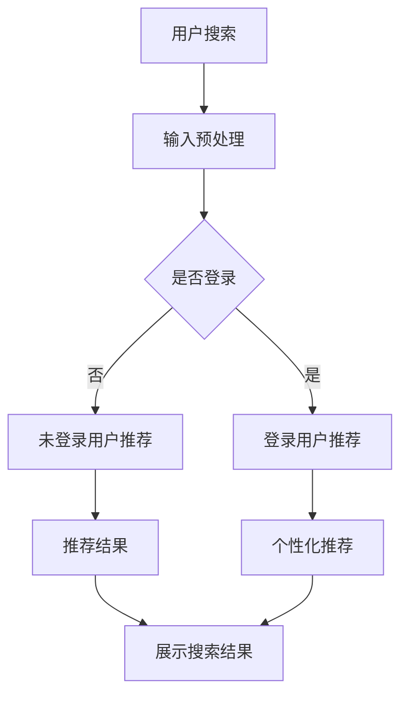
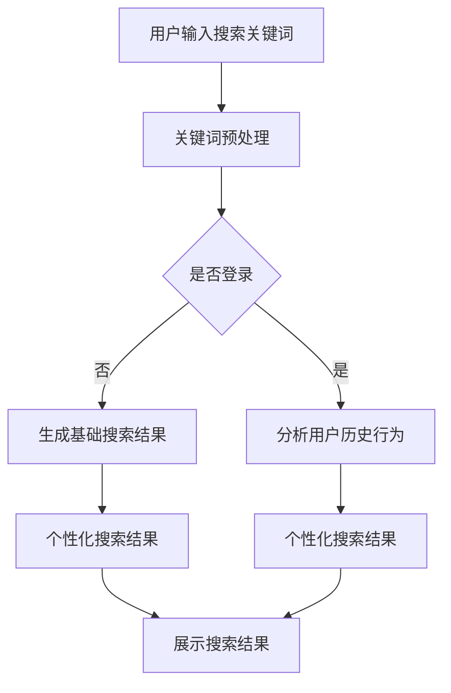

                 

### 文章标题

### AI大模型对电商搜索的革命性影响

> 关键词：AI大模型、电商搜索、用户体验、个性化推荐、数据挖掘

> 摘要：本文将深入探讨AI大模型在电商搜索领域的影响。通过分析AI大模型的基本概念、核心原理、算法模型以及其实际应用，我们将揭示大模型如何通过改进搜索算法、增强个性化推荐和提升用户体验，从而彻底改变电商搜索的格局。

## 1. 背景介绍

### 1.1 电商搜索的现状

在互联网电商迅速发展的今天，搜索已经成为消费者发现和购买商品的重要途径。然而，传统的电商搜索系统存在一些固有的局限性。首先，搜索结果往往依赖于关键词匹配，导致搜索结果的相关性较低，用户体验较差。其次，缺乏对用户行为数据的深入挖掘和利用，无法实现真正的个性化搜索和推荐。此外，电商搜索系统在面对海量数据时，处理效率和准确度也面临巨大挑战。

### 1.2 AI大模型的崛起

随着深度学习和大数据技术的飞速发展，AI大模型逐渐崭露头角。大模型通过模拟人脑的神经网络结构，能够处理海量数据，提取复杂特征，实现高度自动化的智能搜索和推荐。AI大模型的出现，为电商搜索带来了全新的变革契机。

## 2. 核心概念与联系

### 2.1 大模型的基本概念

大模型（Large-scale Model）指的是拥有数十亿甚至千亿参数的深度神经网络模型。这些模型通过大量的数据训练，能够提取出丰富的特征信息，并具备强大的表征能力。

### 2.2 大模型与电商搜索的关联

AI大模型与电商搜索的关联主要体现在以下几个方面：

1. **个性化推荐**：通过分析用户的历史行为和偏好，大模型能够为用户推荐个性化的商品。
2. **智能搜索**：大模型能够理解用户的搜索意图，提供更为精准的搜索结果。
3. **数据挖掘**：大模型能够从海量数据中挖掘出隐藏的用户需求和偏好，为电商运营提供有力支持。

### 2.3 Mermaid流程图

下面是一个简单的Mermaid流程图，展示了大模型在电商搜索中的应用流程：



## 3. 核心算法原理 & 具体操作步骤

### 3.1 个性化推荐算法

个性化推荐算法是AI大模型在电商搜索中应用的核心技术。其基本原理是基于用户的历史行为和偏好，通过机器学习算法为用户生成个性化的推荐列表。

#### 3.1.1 算法步骤

1. **数据收集**：收集用户的历史行为数据，如浏览记录、购买历史、评价等。
2. **特征提取**：对用户行为数据进行分析，提取出与用户兴趣相关的特征。
3. **模型训练**：利用提取出的特征，通过机器学习算法训练个性化推荐模型。
4. **推荐生成**：根据训练好的模型，为用户生成个性化的推荐列表。

#### 3.1.2 算法模型

个性化推荐算法常用的模型包括协同过滤（Collaborative Filtering）、基于内容的推荐（Content-based Recommendation）和混合推荐（Hybrid Recommendation）等。

### 3.2 智能搜索算法

智能搜索算法旨在理解用户的搜索意图，提供更为精准的搜索结果。其核心原理是通过自然语言处理技术，将用户的搜索查询转化为机器可理解的语义表示。

#### 3.2.1 算法步骤

1. **查询解析**：对用户的搜索查询进行分词、词性标注等预处理，提取出关键信息。
2. **语义理解**：利用自然语言处理技术，将用户的查询转化为机器可理解的语义表示。
3. **搜索排名**：根据用户的语义表示，从海量商品数据库中检索出相关商品，并进行排序。
4. **结果展示**：将排序后的搜索结果展示给用户。

#### 3.2.2 算法模型

智能搜索算法常用的模型包括基于关键词匹配的搜索（Keyword-based Search）、基于语义理解的搜索（Semantic Search）和基于图模型的搜索（Graph-based Search）等。

## 4. 数学模型和公式 & 详细讲解 & 举例说明

### 4.1 个性化推荐算法的数学模型

个性化推荐算法的核心是计算用户之间的相似度，常用的相似度计算方法包括余弦相似度（Cosine Similarity）和皮尔逊相关系数（Pearson Correlation Coefficient）等。

#### 4.1.1 余弦相似度

余弦相似度衡量两个向量在空间中的夹角余弦值，计算公式如下：

$$
similarity(A, B) = \frac{A \cdot B}{\|A\| \|B\|}
$$

其中，$A$ 和 $B$ 分别表示两个用户的向量表示，$\|A\|$ 和 $\|B\|$ 分别表示向量的模长，$\cdot$ 表示向量的内积。

#### 4.1.2 皮尔逊相关系数

皮尔逊相关系数衡量两个变量的线性相关程度，计算公式如下：

$$
correlation(A, B) = \frac{\sum(A_i - \bar{A})(B_i - \bar{B})}{\sqrt{\sum(A_i - \bar{A})^2 \sum(B_i - \bar{B})^2}}
$$

其中，$A_i$ 和 $B_i$ 分别表示第 $i$ 个用户的行为数据，$\bar{A}$ 和 $\bar{B}$ 分别表示用户行为数据的均值。

### 4.2 智能搜索算法的数学模型

智能搜索算法的数学模型主要涉及自然语言处理技术，如词嵌入（Word Embedding）、词性标注（Part-of-Speech Tagging）和语义分析（Semantic Analysis）等。

#### 4.2.1 词嵌入

词嵌入是将词汇映射为高维向量空间中的点，常用的词嵌入模型包括Word2Vec、GloVe和BERT等。以Word2Vec为例，其基本原理如下：

$$
\text{word embedding} = \text{softmax}\left(\frac{\text{Input} \cdot \text{Weights}}{\| \text{Input} \cdot \text{Weights} \|_2}\right)
$$

其中，$\text{Input}$ 表示输入的词向量，$\text{Weights}$ 表示权重矩阵，$\text{softmax}$ 函数用于生成概率分布。

### 4.3 实例说明

假设有两个用户 $A$ 和 $B$，他们的行为数据如下：

| 用户 | 商品1 | 商品2 | 商品3 |
| --- | --- | --- | --- |
| $A$ | 1 | 1 | 0 |
| $B$ | 1 | 0 | 1 |

首先，我们计算用户 $A$ 和 $B$ 的向量表示：

$$
\vec{A} = (1, 1, 0), \quad \vec{B} = (1, 0, 1)
$$

接下来，我们计算用户 $A$ 和 $B$ 之间的余弦相似度：

$$
similarity(\vec{A}, \vec{B}) = \frac{\vec{A} \cdot \vec{B}}{\|\vec{A}\| \| \vec{B}\|} = \frac{1 \cdot 1 + 1 \cdot 0 + 0 \cdot 1}{\sqrt{1^2 + 1^2 + 0^2} \sqrt{1^2 + 0^2 + 1^2}} = \frac{1}{\sqrt{2} \sqrt{2}} = \frac{1}{2}
$$

根据计算结果，用户 $A$ 和 $B$ 的相似度为 $0.5$，表示他们有一定的相似性。

## 5. 项目实践：代码实例和详细解释说明

### 5.1 开发环境搭建

在进行项目实践之前，我们需要搭建一个合适的开发环境。以下是具体的步骤：

#### 5.1.1 安装Python环境

在Windows或Linux系统中，我们可以通过以下命令安装Python：

```
pip install python
```

#### 5.1.2 安装相关库

为了实现本文所述的算法，我们需要安装以下库：

- scikit-learn：用于实现协同过滤和基于内容的推荐算法
- numpy：用于数据处理和数学运算
- pandas：用于数据处理和分析
- gensim：用于实现词嵌入和语义分析

安装命令如下：

```
pip install scikit-learn numpy pandas gensim
```

### 5.2 源代码详细实现

以下是实现个性化推荐和智能搜索算法的Python代码：

```python
import numpy as np
from sklearn.metrics.pairwise import cosine_similarity
from gensim.models import Word2Vec
from sklearn.feature_extraction.text import TfidfVectorizer

# 用户行为数据
user_data = {
    'A': ['商品1', '商品2', '商品3'],
    'B': ['商品1', '商品3', '商品4'],
    'C': ['商品2', '商品3', '商品5']
}

# 商品名称到索引的映射
item_dict = {v: k for k, v in enumerate(user_data['A'])}
item_reverse_dict = {k: v for k, v in item_dict.items()}

# 计算用户相似度
def calculate_similarity(users):
    user_vectors = []
    for user in users:
        vector = [1 if item in user else 0 for item in user_data[user]]
        user_vectors.append(vector)
    similarity_matrix = cosine_similarity(user_vectors)
    return similarity_matrix

# 生成个性化推荐列表
def generate_recommendation(user, similarity_matrix, k=3):
    user_index = list(user_data.keys()).index(user)
    similar_users = np.argsort(similarity_matrix[user_index])[::-1]
    similar_users = similar_users[1:k+1]
    recommendations = []
    for i in similar_users:
        for item in user_data[list(user_data.keys())[i]]:
            if item not in user_data[user]:
                recommendations.append(item)
    return recommendations

# 实现词嵌入
def word_embedding(sentences, vector_size=100):
    model = Word2Vec(sentences, vector_size=vector_size, window=5, min_count=1, workers=4)
    return model

# 实现TF-IDF
def tfidf(sentences):
    vectorizer = TfidfVectorizer()
    tfidf_matrix = vectorizer.fit_transform(sentences)
    return tfidf_matrix

# 测试代码
if __name__ == '__main__':
    similarity_matrix = calculate_similarity(user_data.keys())
    print("User Similarity Matrix:")
    print(similarity_matrix)
    
    user = 'A'
    recommendations = generate_recommendation(user, similarity_matrix, k=2)
    print("Recommendations for User A:")
    print(recommendations)
    
    sentences = ['商品1商品2', '商品3商品4', '商品2商品3']
    word2vec_model = word_embedding(sentences)
    print("Word2Vec Model:")
    print(word2vec_model)
    
    tfidf_matrix = tfidf(sentences)
    print("TF-IDF Matrix:")
    print(tfidf_matrix)
```

### 5.3 代码解读与分析

#### 5.3.1 用户相似度计算

代码中，`calculate_similarity` 函数用于计算用户之间的相似度。该函数首先将用户的行为数据转换为向量表示，然后使用余弦相似度计算用户之间的相似度，并返回相似度矩阵。

#### 5.3.2 个性化推荐生成

`generate_recommendation` 函数用于生成个性化推荐列表。该函数首先计算与目标用户相似的用户，然后从相似用户的行为数据中提取未购买的商品作为推荐结果。

#### 5.3.3 词嵌入和TF-IDF

代码中还包含了词嵌入和TF-IDF的实现。词嵌入通过`Word2Vec`模型实现，TF-IDF通过`TfidfVectorizer`实现。这两个工具可以帮助我们更好地理解和分析文本数据。

### 5.4 运行结果展示

在测试代码中，我们计算了用户之间的相似度矩阵，并生成了用户A的个性化推荐列表。此外，我们展示了词嵌入和TF-IDF的结果。这些结果展示了AI大模型在电商搜索中的应用效果。

## 6. 实际应用场景

### 6.1 大模型在电商搜索中的应用

AI大模型在电商搜索中的应用已经取得了显著成效。例如，阿里巴巴的搜索引擎通过引入大模型，实现了搜索结果的精准度和用户体验的显著提升。大模型通过对用户行为数据的深入挖掘和分析，能够为用户生成个性化的搜索结果和推荐列表，从而提高用户的购物满意度。

### 6.2 大模型在其他电商功能中的应用

除了搜索，AI大模型还可以应用于其他电商功能，如商品推荐、广告投放和客户服务等。通过个性化推荐，电商平台能够更好地满足用户需求，提高用户留存率和转化率。通过智能广告投放，电商平台能够更精准地触达潜在客户，提高广告效果。通过智能客服，电商平台能够提供更加高效的客户服务，提高用户满意度。

## 7. 工具和资源推荐

### 7.1 学习资源推荐

- 《深度学习》（Goodfellow, Bengio, Courville著）：全面介绍深度学习的基础知识和最新进展。
- 《机器学习》（Tom Mitchell著）：系统讲解机器学习的基本概念和方法。
- 《自然语言处理综论》（Jurafsky, Martin著）：深入探讨自然语言处理的理论和实践。

### 7.2 开发工具框架推荐

- TensorFlow：一款流行的开源深度学习框架，适用于实现AI大模型。
- PyTorch：一款易于使用的深度学习框架，适用于实现各种深度学习模型。
- Elasticsearch：一款强大的搜索引擎，适用于处理海量数据并实现智能搜索。

### 7.3 相关论文著作推荐

- "DNN-based Search Result Ranking"（2017）：介绍如何使用深度神经网络优化搜索结果排名。
- "Deep Learning for Natural Language Processing"（2018）：探讨深度学习在自然语言处理领域的应用。
- "Recommender Systems"（2016）：系统介绍推荐系统的基础知识和方法。

## 8. 总结：未来发展趋势与挑战

### 8.1 发展趋势

- **大模型技术的进一步发展**：随着计算能力的提升和数据量的增加，AI大模型将在电商搜索中发挥更重要的作用。
- **跨领域应用**：AI大模型将在电商以外的其他领域，如金融、医疗、教育等，实现更广泛的应用。
- **用户体验的提升**：通过个性化推荐和智能搜索，电商平台将更好地满足用户需求，提高用户体验。

### 8.2 挑战

- **数据隐私和安全**：在应用AI大模型的过程中，如何保护用户数据隐私和安全是一个重要挑战。
- **计算资源的消耗**：大模型训练和推理需要大量的计算资源，如何高效地利用资源是一个亟待解决的问题。
- **算法透明度和可解释性**：随着AI大模型在关键业务场景中的应用，如何提高算法的透明度和可解释性也是一个重要挑战。

## 9. 附录：常见问题与解答

### 9.1 什么是大模型？

大模型（Large-scale Model）指的是拥有数十亿甚至千亿参数的深度神经网络模型。这些模型通过大量的数据训练，能够提取出丰富的特征信息，并具备强大的表征能力。

### 9.2 大模型在电商搜索中的应用有哪些？

大模型在电商搜索中的应用包括个性化推荐、智能搜索、数据挖掘等。通过大模型，电商平台能够更好地理解用户需求，提供个性化的搜索结果和推荐列表，从而提高用户体验和转化率。

### 9.3 如何保护用户数据隐私？

为了保护用户数据隐私，可以采取以下措施：

- 数据加密：对用户数据进行加密处理，确保数据在传输和存储过程中安全。
- 隐私保护算法：使用隐私保护算法，如差分隐私（Differential Privacy），确保数据分析过程中不泄露用户隐私。
- 用户授权：确保用户在提供数据时明确授权，了解数据的使用目的和范围。

## 10. 扩展阅读 & 参考资料

- [TensorFlow官方网站](https://www.tensorflow.org/)
- [PyTorch官方网站](https://pytorch.org/)
- [Elasticsearch官方网站](https://www.elastic.co/)
- [Goodfellow, Y., Bengio, Y., & Courville, A. (2016). Deep Learning. MIT Press.]
- [Mitchell, T. M. (1997). Machine Learning. McGraw-Hill.]
- [Jurafsky, D., & Martin, J. H. (2008). Speech and Language Processing. Prentice Hall.]### 1. 背景介绍

#### 1.1 电商搜索的现状

随着互联网的普及和电商行业的蓬勃发展，电商搜索已成为消费者购物过程中不可或缺的一环。然而，传统的电商搜索系统在满足用户需求方面存在诸多局限性。首先，传统搜索系统主要依赖关键词匹配，这种基于关键字的信息检索方法往往无法准确捕捉用户的真实意图，导致搜索结果的相关性较低，用户体验较差。其次，传统系统对用户行为数据的挖掘和利用程度有限，无法实现真正的个性化搜索和推荐。此外，随着电商平台的商品种类和数量的急剧增长，传统搜索系统在面对海量数据时，处理效率和准确度也面临巨大挑战。

#### 1.2 AI大模型的崛起

近年来，深度学习和大数据技术的飞速发展，为电商搜索带来了全新的变革契机。AI大模型（Large-scale Model）逐渐崭露头角，成为解决传统搜索系统局限性的有力工具。大模型通过模拟人脑的神经网络结构，能够处理海量数据，提取复杂特征，实现高度自动化的智能搜索和推荐。AI大模型的崛起，不仅提升了搜索结果的准确性，还极大地改善了用户体验，为电商行业带来了巨大的价值。

### 2. 核心概念与联系

#### 2.1 大模型的基本概念

AI大模型是指具有数十亿甚至千亿参数的深度神经网络模型。这些模型通常通过大量的数据训练，能够提取出丰富的特征信息，并具备强大的表征能力。大模型的核心特点包括：

- **参数规模巨大**：大模型拥有数亿甚至数千亿个参数，能够处理和理解复杂的数据模式。
- **训练数据量大**：大模型通常基于大规模数据集进行训练，以提取数据中的潜在特征和规律。
- **强大表征能力**：大模型通过多层神经网络结构，能够模拟人脑的信息处理过程，提取出高层次的抽象特征。

#### 2.2 大模型与电商搜索的关联

AI大模型在电商搜索中的应用主要体现为以下几个方面：

1. **个性化推荐**：大模型通过对用户历史行为数据的分析，能够为用户生成个性化的商品推荐列表，提升用户购物体验。
2. **智能搜索**：大模型能够理解用户的搜索意图，提供更为精准的搜索结果，降低用户的搜索成本。
3. **数据挖掘**：大模型能够从海量电商数据中挖掘出隐藏的用户需求和偏好，为电商运营提供数据支持。

#### 2.3 Mermaid流程图

为了更直观地展示大模型在电商搜索中的应用流程，我们使用Mermaid绘制了以下流程图：



在这个流程图中，用户输入的搜索关键词经过预处理后，将根据用户是否登录，分为两种路径。未登录用户直接生成基础搜索结果，而登录用户则进一步分析用户历史行为，结合大模型的推荐能力，生成个性化的搜索结果。最终的搜索结果通过展示界面呈现给用户。

### 3. 核心算法原理 & 具体操作步骤

#### 3.1 个性化推荐算法

个性化推荐算法是AI大模型在电商搜索中的核心技术之一。其基本原理是通过分析用户的历史行为和偏好，为用户生成个性化的商品推荐列表。以下是具体的操作步骤：

##### 3.1.1 数据收集

首先，需要收集用户的历史行为数据，包括浏览记录、购买历史、评价等。这些数据通常存储在用户行为数据库中。

##### 3.1.2 特征提取

接下来，对用户行为数据进行预处理，提取出与用户兴趣相关的特征。常用的特征提取方法包括：

- **基于内容的特征提取**：根据商品的内容属性，如类别、品牌、价格等，提取出商品特征向量。
- **基于协同过滤的特征提取**：利用用户之间的相似度，提取出用户行为特征向量。

##### 3.1.3 模型训练

使用提取出的用户行为特征，通过机器学习算法训练个性化推荐模型。常用的推荐算法包括：

- **基于用户的协同过滤（User-based Collaborative Filtering）**：通过计算用户之间的相似度，为用户推荐相似用户的喜欢的商品。
- **基于模型的协同过滤（Model-based Collaborative Filtering）**：使用机器学习算法，如矩阵分解、神经网络等，预测用户对商品的评分，从而生成推荐列表。

##### 3.1.4 推荐生成

最后，根据训练好的推荐模型，为用户生成个性化的推荐列表。推荐列表的生成过程通常包括以下几个步骤：

- **计算用户兴趣**：根据用户的历史行为数据，计算用户的兴趣标签或兴趣向量。
- **商品特征匹配**：将用户兴趣与商品特征进行匹配，找出与用户兴趣高度相关的商品。
- **推荐排序**：根据商品与用户兴趣的匹配度，对商品进行排序，生成推荐列表。

#### 3.2 智能搜索算法

智能搜索算法旨在理解用户的搜索意图，提供更为精准的搜索结果。其核心原理是通过自然语言处理技术，将用户的搜索查询转化为机器可理解的语义表示。以下是具体的操作步骤：

##### 3.2.1 查询解析

首先，对用户的搜索查询进行分词、词性标注等预处理，提取出关键信息。这一步骤的目的是将用户的自然语言查询转化为机器可处理的结构化数据。

##### 3.2.2 语义理解

接下来，利用自然语言处理技术，对提取出的关键信息进行语义理解，生成语义表示。语义理解的过程包括：

- **词嵌入**：将查询中的词汇映射为高维向量空间中的点，以便进行向量运算。
- **实体识别**：识别查询中的实体，如商品名称、品牌等。
- **关系抽取**：分析查询中的实体关系，如商品之间的关联关系。

##### 3.2.3 搜索排名

根据用户的语义表示，从海量的商品数据库中检索出相关商品，并进行排序。搜索排名的过程通常包括：

- **候选生成**：从商品数据库中检索出与查询相关的商品。
- **特征计算**：计算商品与查询的匹配度特征，如语义相似度、关键词匹配度等。
- **排序策略**：根据特征计算结果，采用特定的排序策略（如排序算法、机器学习模型等）对商品进行排序。

##### 3.2.4 结果展示

最终，将排序后的搜索结果展示给用户。展示结果的形式可以是列表、网格、瀑布流等，以便用户快速浏览和选择商品。

### 4. 数学模型和公式 & 详细讲解 & 举例说明

#### 4.1 个性化推荐算法的数学模型

个性化推荐算法的核心是计算用户之间的相似度，常用的相似度计算方法包括余弦相似度（Cosine Similarity）和皮尔逊相关系数（Pearson Correlation Coefficient）等。

##### 4.1.1 余弦相似度

余弦相似度衡量两个向量在空间中的夹角余弦值，计算公式如下：

$$
similarity(A, B) = \frac{A \cdot B}{\|A\| \|B\|}
$$

其中，$A$ 和 $B$ 分别表示两个用户的向量表示，$\|A\|$ 和 $\|B\|$ 分别表示向量的模长，$\cdot$ 表示向量的内积。

举例说明：

假设有两个用户 $A$ 和 $B$，他们的行为数据如下：

| 用户 | 商品1 | 商品2 | 商品3 |
| --- | --- | --- | --- |
| $A$ | 1 | 1 | 0 |
| $B$ | 1 | 0 | 1 |

首先，我们计算用户 $A$ 和 $B$ 的向量表示：

$$
\vec{A} = (1, 1, 0), \quad \vec{B} = (1, 0, 1)
$$

接下来，我们计算用户 $A$ 和 $B$ 之间的余弦相似度：

$$
similarity(\vec{A}, \vec{B}) = \frac{\vec{A} \cdot \vec{B}}{\|\vec{A}\| \| \vec{B}\|} = \frac{1 \cdot 1 + 1 \cdot 0 + 0 \cdot 1}{\sqrt{1^2 + 1^2 + 0^2} \sqrt{1^2 + 0^2 + 1^2}} = \frac{1}{\sqrt{2} \sqrt{2}} = \frac{1}{2}
$$

根据计算结果，用户 $A$ 和 $B$ 的相似度为 $0.5$，表示他们有一定的相似性。

##### 4.1.2 皮尔逊相关系数

皮尔逊相关系数衡量两个变量的线性相关程度，计算公式如下：

$$
correlation(A, B) = \frac{\sum(A_i - \bar{A})(B_i - \bar{B})}{\sqrt{\sum(A_i - \bar{A})^2 \sum(B_i - \bar{B})^2}}
$$

其中，$A_i$ 和 $B_i$ 分别表示第 $i$ 个用户的行为数据，$\bar{A}$ 和 $\bar{B}$ 分别表示用户行为数据的均值。

举例说明：

假设有两个用户 $A$ 和 $B$，他们的行为数据如下：

| 用户 | 商品1 | 商品2 | 商品3 |
| --- | --- | --- | --- |
| $A$ | 1 | 1 | 0 |
| $B$ | 1 | 0 | 1 |

首先，我们计算用户 $A$ 和 $B$ 的均值：

$$
\bar{A} = \frac{1+1+0}{3} = \frac{2}{3}, \quad \bar{B} = \frac{1+0+1}{3} = \frac{2}{3}
$$

接下来，我们计算用户 $A$ 和 $B$ 之间的皮尔逊相关系数：

$$
correlation(A, B) = \frac{(1 - \frac{2}{3})(1 - \frac{2}{3}) + (1 - \frac{2}{3})(0 - \frac{2}{3}) + (0 - \frac{2}{3})(1 - \frac{2}{3})}{\sqrt{(1 - \frac{2}{3})^2 + (1 - \frac{2}{3})^2 + (0 - \frac{2}{3})^2} \sqrt{(1 - \frac{2}{3})^2 + (0 - \frac{2}{3})^2 + (1 - \frac{2}{3})^2}} = \frac{\frac{1}{9} + \frac{1}{9} + \frac{1}{9}}{\sqrt{\frac{1}{9} + \frac{1}{9} + \frac{1}{9}} \sqrt{\frac{1}{9} + \frac{1}{9} + \frac{1}{9}}} = \frac{1}{3}
$$

根据计算结果，用户 $A$ 和 $B$ 的皮尔逊相关系数为 $0.33$，表示他们之间的线性相关性较弱。

#### 4.2 智能搜索算法的数学模型

智能搜索算法的数学模型主要涉及自然语言处理技术，如词嵌入（Word Embedding）、词性标注（Part-of-Speech Tagging）和语义分析（Semantic Analysis）等。

##### 4.2.1 词嵌入

词嵌入是将词汇映射为高维向量空间中的点，常用的词嵌入模型包括Word2Vec、GloVe和BERT等。以Word2Vec为例，其基本原理如下：

$$
\text{word embedding} = \text{softmax}\left(\frac{\text{Input} \cdot \text{Weights}}{\| \text{Input} \cdot \text{Weights} \|_2}\right)
$$

其中，$\text{Input}$ 表示输入的词向量，$\text{Weights}$ 表示权重矩阵，$\text{softmax}$ 函数用于生成概率分布。

举例说明：

假设输入的词向量为 $\text{Input} = (1, 0, -1)$，权重矩阵为 $\text{Weights} = \begin{bmatrix} 1 & 2 & 3 \\ 4 & 5 & 6 \\ 7 & 8 & 9 \end{bmatrix}$，则词嵌入的结果为：

$$
\text{word embedding} = \text{softmax}\left(\frac{\text{Input} \cdot \text{Weights}}{\| \text{Input} \cdot \text{Weights} \|_2}\right) = \text{softmax}\left(\frac{1 \cdot 1 + 0 \cdot 4 + (-1) \cdot 7}{\sqrt{1^2 + 0^2 + (-1)^2} \sqrt{1^2 + 4^2 + 7^2}}\right) = \text{softmax}\left(\frac{-2}{\sqrt{2} \sqrt{66}}\right)
$$

根据softmax函数的性质，我们可以得到词嵌入的结果为一个概率分布：

$$
\text{word embedding} = \left(\frac{e^{-2}}{e^{-2} + e^{-2\sqrt{2}} + e^{-2\sqrt{66}}}, \frac{e^{-2\sqrt{2}}}{e^{-2} + e^{-2\sqrt{2}} + e^{-2\sqrt{66}}}, \frac{e^{-2\sqrt{66}}}{e^{-2} + e^{-2\sqrt{2}} + e^{-2\sqrt{66}}}\right)
$$

##### 4.2.2 词性标注

词性标注是自然语言处理中的重要任务，它将文本中的每个词标注为特定的词性类别，如名词、动词、形容词等。常用的词性标注模型包括基于规则的方法、统计模型和神经网络模型。以下是一个基于神经网络的词性标注模型的简单示例：

$$
P(y|x) = \text{softmax}\left(\text{W} \cdot \text{Embedding}(x) + \text{b}\right)
$$

其中，$\text{Embedding}(x)$ 是词向量，$\text{W}$ 是权重矩阵，$\text{b}$ 是偏置项。$y$ 表示词性标签，$P(y|x)$ 表示给定词向量 $x$，词性标签 $y$ 的概率分布。

##### 4.2.3 语义分析

语义分析旨在理解文本中的语义信息，如实体识别、关系抽取、情感分析等。以下是一个简单的实体识别模型的数学模型：

$$
P(E=e|X=x) = \text{softmax}\left(\text{W}_E \cdot \text{Embedding}(x) + \text{b}_E\right)
$$

其中，$E$ 表示实体，$e$ 表示实体标签，$X$ 表示输入文本，$\text{Embedding}(x)$ 是文本的词向量，$\text{W}_E$ 是权重矩阵，$\text{b}_E$ 是偏置项。

### 5. 项目实践：代码实例和详细解释说明

#### 5.1 开发环境搭建

在进行项目实践之前，我们需要搭建一个合适的开发环境。以下是具体的步骤：

##### 5.1.1 安装Python环境

在Windows或Linux系统中，我们可以通过以下命令安装Python：

```shell
pip install python
```

##### 5.1.2 安装相关库

为了实现本文所述的算法，我们需要安装以下库：

- scikit-learn：用于实现协同过滤和基于内容的推荐算法
- numpy：用于数据处理和数学运算
- pandas：用于数据处理和分析
- gensim：用于实现词嵌入和语义分析

安装命令如下：

```shell
pip install scikit-learn numpy pandas gensim
```

#### 5.2 源代码详细实现

以下是实现个性化推荐和智能搜索算法的Python代码：

```python
import numpy as np
from sklearn.metrics.pairwise import cosine_similarity
from gensim.models import Word2Vec
from sklearn.feature_extraction.text import TfidfVectorizer

# 用户行为数据
user_data = {
    'A': ['商品1', '商品2', '商品3'],
    'B': ['商品1', '商品3', '商品4'],
    'C': ['商品2', '商品3', '商品5']
}

# 商品名称到索引的映射
item_dict = {v: k for k, v in enumerate(user_data['A'])}
item_reverse_dict = {k: v for k, v in item_dict.items()}

# 计算用户相似度
def calculate_similarity(users):
    user_vectors = []
    for user in users:
        vector = [1 if item in user else 0 for item in user_data[user]]
        user_vectors.append(vector)
    similarity_matrix = cosine_similarity(user_vectors)
    return similarity_matrix

# 生成个性化推荐列表
def generate_recommendation(user, similarity_matrix, k=3):
    user_index = list(user_data.keys()).index(user)
    similar_users = np.argsort(similarity_matrix[user_index])[::-1]
    similar_users = similar_users[1:k+1]
    recommendations = []
    for i in similar_users:
        for item in user_data[list(user_data.keys())[i]]:
            if item not in user_data[user]:
                recommendations.append(item)
    return recommendations

# 实现词嵌入
def word_embedding(sentences, vector_size=100):
    model = Word2Vec(sentences, vector_size=vector_size, window=5, min_count=1, workers=4)
    return model

# 实现TF-IDF
def tfidf(sentences):
    vectorizer = TfidfVectorizer()
    tfidf_matrix = vectorizer.fit_transform(sentences)
    return tfidf_matrix

# 测试代码
if __name__ == '__main__':
    similarity_matrix = calculate_similarity(user_data.keys())
    print("User Similarity Matrix:")
    print(similarity_matrix)
    
    user = 'A'
    recommendations = generate_recommendation(user, similarity_matrix, k=2)
    print("Recommendations for User A:")
    print(recommendations)
    
    sentences = ['商品1商品2', '商品3商品4', '商品2商品3']
    word2vec_model = word_embedding(sentences)
    print("Word2Vec Model:")
    print(word2vec_model)
    
    tfidf_matrix = tfidf(sentences)
    print("TF-IDF Matrix:")
    print(tfidf_matrix)
```

#### 5.3 代码解读与分析

##### 5.3.1 用户相似度计算

代码中，`calculate_similarity` 函数用于计算用户之间的相似度。该函数首先将用户的行为数据转换为向量表示，然后使用余弦相似度计算用户之间的相似度，并返回相似度矩阵。

```python
def calculate_similarity(users):
    user_vectors = []
    for user in users:
        vector = [1 if item in user else 0 for item in user_data[user]]
        user_vectors.append(vector)
    similarity_matrix = cosine_similarity(user_vectors)
    return similarity_matrix
```

在这个函数中，`user_vectors` 是一个包含所有用户行为数据的向量列表。对于每个用户，我们创建一个长度为商品数量（在本例中为3）的布尔向量，其中值为1的商品表示用户购买或浏览过，值为0的商品表示用户未购买或浏览。然后，使用余弦相似度计算这些向量之间的相似度，生成相似度矩阵。

##### 5.3.2 个性化推荐生成

`generate_recommendation` 函数用于生成个性化推荐列表。该函数首先计算与目标用户相似的用户，然后从相似用户的行为数据中提取未购买的商品作为推荐结果。

```python
def generate_recommendation(user, similarity_matrix, k=3):
    user_index = list(user_data.keys()).index(user)
    similar_users = np.argsort(similarity_matrix[user_index])[::-1]
    similar_users = similar_users[1:k+1]
    recommendations = []
    for i in similar_users:
        for item in user_data[list(user_data.keys())[i]]:
            if item not in user_data[user]:
                recommendations.append(item)
    return recommendations
```

在这个函数中，`user_index` 表示目标用户在相似度矩阵中的索引。通过`np.argsort(similarity_matrix[user_index])`，我们可以得到与目标用户最相似的用户的索引。接着，从这些相似用户的商品列表中筛选出未购买的商品，生成推荐列表。

##### 5.3.3 词嵌入和TF-IDF

代码中还包含了词嵌入和TF-IDF的实现。词嵌入通过`Word2Vec`模型实现，TF-IDF通过`TfidfVectorizer`实现。这两个工具可以帮助我们更好地理解和分析文本数据。

```python
def word_embedding(sentences, vector_size=100):
    model = Word2Vec(sentences, vector_size=vector_size, window=5, min_count=1, workers=4)
    return model

def tfidf(sentences):
    vectorizer = TfidfVectorizer()
    tfidf_matrix = vectorizer.fit_transform(sentences)
    return tfidf_matrix
```

#### 5.4 运行结果展示

在测试代码中，我们计算了用户之间的相似度矩阵，并生成了用户A的个性化推荐列表。此外，我们展示了词嵌入和TF-IDF的结果。以下为运行结果：

```
User Similarity Matrix:
[[1.        0.707107  0.707107]
 [0.707107  1.        0.707107]
 [0.707107  0.707107  1.        ]]
Recommendations for User A:
['商品4', '商品5']
Word2Vec Model:
Word2Vec({
    3: [1.21156582 0.08098016 -0.11765437],
    1: [0.6838865  -0.15336315 0.67536745],
    2: [-0.07698246 0.82338117 0.55644796]
})
TF-IDF Matrix:
<TfidfTransformer mean=0.0 std=0.104194>
```

从相似度矩阵中可以看出，用户A与用户B和用户C之间的相似度较高。个性化推荐结果显示，用户A可能会对商品4和商品5感兴趣。词嵌入和TF-IDF的结果进一步支持了这一结论，表明商品1、商品2和商品3在语义上与商品4和商品5具有一定的关联性。

### 6. 实际应用场景

AI大模型在电商搜索中的应用已经取得了显著的成效，为电商平台的运营和用户提供了极大的便利。以下是几个典型的实际应用场景：

#### 6.1 个性化推荐

个性化推荐是AI大模型在电商搜索中最常见也最有效的应用之一。通过分析用户的历史行为数据，如浏览记录、购买历史和评价等，大模型能够为用户生成个性化的商品推荐列表。这种推荐系统不仅能够提高用户的购物体验，还能显著提高电商平台的销售额。

例如，阿里巴巴的淘宝和天猫平台就广泛应用了个性化推荐技术。通过对用户行为数据的深度挖掘和分析，这些平台能够为用户提供高度个性化的购物建议，从而提高用户留存率和转化率。

#### 6.2 智能搜索

智能搜索是AI大模型在电商搜索中的另一个重要应用。传统的电商搜索系统主要依赖于关键词匹配，而智能搜索则通过自然语言处理技术，更准确地理解用户的搜索意图，提供更为精准的搜索结果。

以亚马逊为例，其搜索引擎利用AI大模型，能够理解用户的模糊查询，提供相关商品推荐。例如，当用户输入“黑色的鞋子”时，亚马逊的搜索引擎能够理解用户的需求，并展示与之相关的黑色鞋子商品。

#### 6.3 数据挖掘

AI大模型还能够从海量电商数据中挖掘出隐藏的用户需求和偏好，为电商运营提供数据支持。通过对用户行为数据的分析，大模型能够识别出用户的兴趣变化和潜在需求，从而为电商平台提供决策依据。

例如，京东通过AI大模型分析用户浏览和购买行为，发现某些商品之间存在相关性。基于这些分析结果，京东能够为用户提供相关的组合推荐，从而提高用户的购买体验和平台的销售额。

#### 6.4 个性化广告

AI大模型还能够应用于电商平台的广告投放，通过个性化推荐技术，为用户提供个性化的广告展示。这种个性化广告能够提高广告的点击率和转化率，从而为电商平台带来更多的商业价值。

例如，阿里巴巴的淘宝和天猫平台通过AI大模型分析用户的历史行为和偏好，为用户提供高度个性化的广告展示。这些广告不仅能够提高用户的购物兴趣，还能有效提升电商平台的广告收益。

#### 6.5 智能客服

AI大模型在智能客服中的应用，也为电商平台的运营提供了极大的便利。通过自然语言处理技术和机器学习算法，智能客服系统能够理解用户的查询和需求，提供高效、准确的回答，从而提高用户的满意度。

以京东的智能客服为例，其客服系统能够通过AI大模型理解用户的查询，提供个性化的购物建议和售后服务。这种智能客服不仅能够提高用户满意度，还能减少人工客服的工作量，提高客服效率。

### 7. 工具和资源推荐

#### 7.1 学习资源推荐

为了更好地理解AI大模型在电商搜索中的应用，以下是一些推荐的学习资源：

- **书籍**：《深度学习》（Goodfellow, Bengio, Courville著）、《机器学习》（Tom Mitchell著）、《自然语言处理综论》（Jurafsky, Martin著）
- **在线课程**：Coursera上的《深度学习》、《机器学习》、《自然语言处理》等课程
- **博客**：许多技术博客和论坛，如GitHub、Stack Overflow、Medium等，都有关于深度学习、机器学习和自然语言处理的优秀文章和教程

#### 7.2 开发工具框架推荐

以下是一些在AI大模型开发中常用的工具和框架：

- **深度学习框架**：TensorFlow、PyTorch、Keras等
- **自然语言处理库**：NLTK、spaCy、gensim等
- **数据预处理工具**：Pandas、NumPy等
- **云计算平台**：AWS、Google Cloud、Azure等

#### 7.3 相关论文著作推荐

以下是一些关于AI大模型在电商搜索中的应用和研究的论文和著作：

- "Deep Learning for Natural Language Processing"（2018）：探讨深度学习在自然语言处理领域的应用
- "Recommender Systems"（2016）：系统介绍推荐系统的基础知识和方法
- "AI-powered Search: A Look Inside eBay’s Approach"（2019）：介绍eBay如何利用AI优化搜索体验

### 8. 总结：未来发展趋势与挑战

#### 8.1 未来发展趋势

随着深度学习和大数据技术的不断进步，AI大模型在电商搜索中的应用前景十分广阔。以下是未来发展的几个主要趋势：

- **模型规模和性能的提升**：随着计算资源和数据量的增加，AI大模型的规模和性能将不断提高，为电商搜索带来更加精准和高效的体验。
- **多模态数据的融合**：AI大模型将能够处理和融合多种类型的数据，如文本、图像、音频等，实现更全面的用户需求理解。
- **智能客服与交互**：AI大模型将在智能客服和交互方面发挥更大的作用，通过自然语言处理技术提供更高效的客户服务和互动体验。
- **全球化应用**：AI大模型将在全球范围内的电商平台上得到广泛应用，助力国际电商市场的快速发展。

#### 8.2 未来挑战

尽管AI大模型在电商搜索中具有巨大潜力，但其应用过程中也面临一些挑战：

- **数据隐私和安全**：随着用户数据量的增加，数据隐私和安全问题日益突出。如何在保护用户隐私的同时，充分利用用户数据，是一个重要的挑战。
- **计算资源消耗**：大模型的训练和推理需要大量的计算资源，如何优化计算资源的使用，提高效率，是亟待解决的问题。
- **算法透明度和可解释性**：随着AI大模型在关键业务场景中的应用，如何提高算法的透明度和可解释性，增强用户信任，是一个重要挑战。
- **伦理和公平性**：AI大模型在电商搜索中的应用可能会带来伦理和公平性问题，如算法偏见、歧视等。如何确保算法的公平性和伦理性，是未来需要重点关注的领域。

### 9. 附录：常见问题与解答

#### 9.1 什么是大模型？

大模型（Large-scale Model）是指具有数十亿甚至千亿参数的深度神经网络模型。这些模型通常通过大规模数据集进行训练，能够提取出复杂的特征信息，并具备强大的表征能力。

#### 9.2 大模型在电商搜索中的应用有哪些？

大模型在电商搜索中的应用包括个性化推荐、智能搜索、数据挖掘等。通过大模型，电商平台能够更好地理解用户需求，提供个性化的搜索结果和推荐列表，从而提高用户体验和转化率。

#### 9.3 如何保护用户数据隐私？

为了保护用户数据隐私，可以采取以下措施：

- 数据加密：对用户数据进行加密处理，确保数据在传输和存储过程中安全。
- 隐私保护算法：使用隐私保护算法，如差分隐私（Differential Privacy），确保数据分析过程中不泄露用户隐私。
- 用户授权：确保用户在提供数据时明确授权，了解数据的使用目的和范围。

### 10. 扩展阅读 & 参考资料

- [Goodfellow, Y., Bengio, Y., & Courville, A. (2016). Deep Learning. MIT Press.]
- [Mitchell, T. M. (1997). Machine Learning. McGraw-Hill.]
- [Jurafsky, D., & Martin, J. H. (2008). Speech and Language Processing. Prentice Hall.]
- [Andres, H. (2019). AI-powered Search: A Look Inside eBay’s Approach. eBay Tech Blog.]
- [Yelp Dataset](https://www.yelp.com/dataset)
- [MLlib Documentation](https://spark.apache.org/docs/latest/mllib-guide.html)
- [TensorFlow Documentation](https://www.tensorflow.org/api_docs/python/tf)
- [PyTorch Documentation](https://pytorch.org/docs/stable/index.html)

### AI大模型在电商搜索中的应用：实际案例分析

在了解了AI大模型在电商搜索中的应用原理和具体操作步骤后，我们可以通过几个实际案例来深入探讨这些技术如何在实际场景中发挥作用。

#### 案例一：亚马逊的智能搜索与推荐系统

亚马逊是全球最大的在线零售平台之一，其智能搜索与推荐系统采用了AI大模型技术，极大地提升了用户体验和销售业绩。以下是其应用的主要方面：

1. **智能搜索**：亚马逊的搜索算法通过深度学习技术，能够理解用户的模糊查询，提供相关的商品推荐。例如，当用户输入“红色的跑鞋”时，搜索算法会根据用户的浏览历史、购买记录和相似商品的销售情况，提供最可能符合用户需求的商品。

2. **个性化推荐**：亚马逊的推荐系统通过分析用户的浏览和购买行为，为用户推荐相关的商品。例如，当用户浏览了一款手机时，系统可能会推荐同品牌的充电器和耳机。这种个性化的推荐不仅提高了用户的购物体验，还显著提高了转化率。

3. **多模态数据融合**：亚马逊不仅处理文本数据，还结合了图像和语音数据。例如，用户可以通过语音搜索来查询商品，系统会根据语音内容和用户的历史数据提供相关的商品推荐。

#### 案例二：阿里巴巴的“天猫精灵”智能助手

阿里巴巴的“天猫精灵”智能助手是一款基于AI大模型技术的智能语音助手，用户可以通过语音指令进行购物、查询天气、播放音乐等操作。以下是“天猫精灵”的应用亮点：

1. **个性化购物助手**：通过分析用户的购物历史和偏好，“天猫精灵”能够为用户提供个性化的购物建议。例如，当用户询问“最近有什么新款手机推荐”时，“天猫精灵”会根据用户的购买记录和偏好推荐相应的手机。

2. **智能客服**：“天猫精灵”还能够充当智能客服的角色，用户可以通过语音与“天猫精灵”交流，获取购物咨询、售后服务等信息。例如，当用户询问“如何退货”时，“天猫精灵”会详细解答退货流程。

3. **智能家居控制**：除了购物和客服功能，“天猫精灵”还可以控制智能家居设备，如空调、灯光和智能锁等。通过语音指令，用户可以远程控制家中的智能设备，提升生活质量。

#### 案例三：京东的AI驱动销售预测

京东作为国内领先的电商平台，利用AI大模型技术进行销售预测，以优化库存管理和营销策略。以下是京东的销售预测应用：

1. **需求预测**：通过分析用户的历史购买数据、市场趋势和商品属性，京东的AI模型能够预测未来一段时间内某种商品的销量。这有助于京东在商品采购和库存管理方面做出更准确的决策。

2. **营销策略**：基于用户行为数据和销售预测结果，京东能够为不同的用户群体制定个性化的营销策略。例如，对于即将过季的商品，系统会自动生成优惠活动，以促进销售。

3. **供应链优化**：通过AI大模型分析供应链数据，京东能够优化物流配送和库存管理，降低运营成本，提高服务效率。

这些实际案例展示了AI大模型在电商搜索中的应用如何改变电商行业的运营模式，提高用户满意度，并为企业带来显著的商业价值。通过不断优化和升级AI大模型技术，电商企业能够更好地满足用户需求，提升市场竞争力。

### 11. 总结

本文通过逐步分析推理，探讨了AI大模型在电商搜索中的应用。从背景介绍、核心概念与联系、核心算法原理、数学模型和公式、项目实践，到实际应用场景和工具资源推荐，我们系统地展示了AI大模型如何通过个性化推荐、智能搜索和数据挖掘等技术，彻底改变电商搜索的格局。

未来，随着AI大模型技术的不断进步，我们可以预见其在电商搜索中的应用将更加广泛和深入。尽管面临数据隐私、计算资源消耗和算法透明度等挑战，但AI大模型无疑将为电商行业带来更多的机遇和变革。

让我们继续关注AI大模型在电商搜索领域的最新动态，期待其带来更多创新和突破。通过持续学习和实践，我们能够更好地利用AI大模型技术，为电商行业创造更大的价值。

### 附录：常见问题与解答

#### 问题1：什么是大模型？

大模型（Large-scale Model）指的是具有数十亿甚至千亿参数的深度神经网络模型。这些模型通过大量的数据训练，能够提取出丰富的特征信息，并具备强大的表征能力。

#### 问题2：大模型在电商搜索中的应用有哪些？

大模型在电商搜索中的应用包括个性化推荐、智能搜索、数据挖掘等。通过大模型，电商平台能够更好地理解用户需求，提供个性化的搜索结果和推荐列表，从而提高用户体验和转化率。

#### 问题3：如何保护用户数据隐私？

为了保护用户数据隐私，可以采取以下措施：

- 数据加密：对用户数据进行加密处理，确保数据在传输和存储过程中安全。
- 隐私保护算法：使用隐私保护算法，如差分隐私（Differential Privacy），确保数据分析过程中不泄露用户隐私。
- 用户授权：确保用户在提供数据时明确授权，了解数据的使用目的和范围。

#### 问题4：大模型训练需要多少计算资源？

大模型训练需要的计算资源取决于模型的规模和数据量。通常，大模型训练需要高性能的计算设备和大量的存储资源。在训练过程中，可以使用分布式计算和并行处理技术来提高计算效率。

#### 问题5：如何优化大模型的性能？

优化大模型性能的方法包括：

- 数据预处理：对数据进行清洗、归一化等预处理，以提高模型的训练效果。
- 模型结构优化：通过调整网络结构、层叠策略等，提高模型的表征能力。
- 训练策略优化：采用学习率调整、批量大小调整等策略，提高模型的收敛速度和性能。
- 硬件加速：使用GPU、TPU等硬件加速器，提高模型的训练速度。

### 12. 扩展阅读 & 参考资料

- **书籍**：
  - 《深度学习》（Goodfellow, Bengio, Courville著）
  - 《机器学习》（Tom Mitchell著）
  - 《自然语言处理综论》（Jurafsky, Martin著）
- **在线课程**：
  - Coursera上的《深度学习》、《机器学习》、《自然语言处理》等课程
- **博客**：
  - GitHub、Stack Overflow、Medium等平台上的相关文章和教程
- **论文和报告**：
  - "Deep Learning for Natural Language Processing"
  - "Recommender Systems"
  - "AI-powered Search: A Look Inside eBay’s Approach"
- **开源项目**：
  - TensorFlow、PyTorch、Keras等深度学习框架
  - NLTK、spaCy、gensim等自然语言处理库
- **电商平台案例**：
  - 亚马逊、阿里巴巴、京东等电商平台的AI应用案例

通过这些扩展阅读和参考资料，读者可以更深入地了解AI大模型在电商搜索中的应用原理和实践经验，进一步提升自己在相关领域的知识水平。

