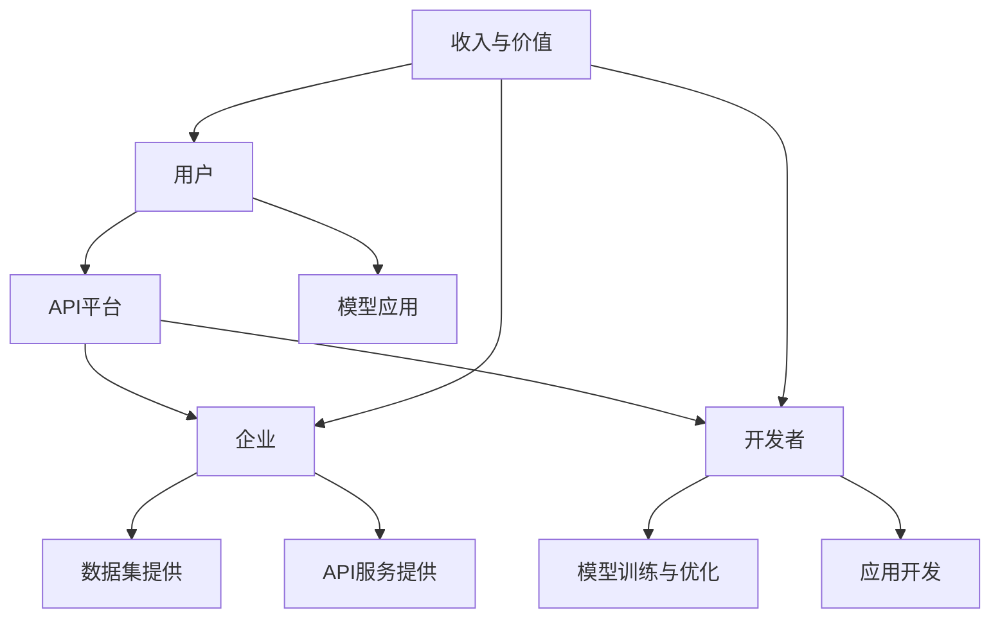

                 

### 1. 背景介绍

随着人工智能技术的快速发展，尤其是大模型的广泛应用，我们迎来了一个崭新的时代。人工智能（AI）正在各行各业中发挥着越来越重要的作用，从自动驾驶、自然语言处理到图像识别和智能推荐，AI的应用场景日益丰富，正在深刻改变着我们的生活方式。

在AI大模型领域，API经济商业模式正逐渐成为一种主流的商业创新模式。API（应用程序编程接口）是一种允许不同软件之间相互调用的接口，使得应用程序能够更高效地共享数据和功能。传统的商业模式侧重于产品本身的销售，而API经济则更加注重于通过API提供的服务和功能来实现商业价值。

API经济商业模式的核心在于其开放性和灵活性。通过提供API接口，企业可以将自己的核心技术和数据开放给第三方开发者，从而形成一个生态系统，促进创新和合作。这种模式不仅能够帮助企业扩大市场份额，还能通过API服务获得持续的收入。

例如，谷歌的TensorFlow和Facebook的PyTorch等深度学习框架，通过开放API接口，使得开发者能够轻松地使用这些框架构建和训练自己的AI模型。同样，OpenAI的GPT-3也通过API服务，让开发者可以快速获取强大的自然语言处理能力。

本文将深入探讨AI大模型应用的API经济商业模式，从背景介绍、核心概念与联系、核心算法原理与操作步骤、数学模型和公式、项目实践、实际应用场景、工具和资源推荐、总结与未来发展趋势等几个方面，全面解析这一商业模式的本质和潜力。

### 2. 核心概念与联系

要理解AI大模型应用的API经济商业模式，我们首先需要明确几个核心概念，包括API、数据、服务、平台和生态系统。

#### 2.1 API

API（应用程序编程接口）是软件开发中用于不同软件之间进行通信的接口。它定义了一套标准，使得软件组件可以互相调用和共享数据。在AI大模型应用中，API充当了模型与用户之间的桥梁，使得用户无需深入了解模型的内部工作机制，即可方便地使用模型提供的功能。

#### 2.2 数据

数据是AI大模型的基础。高质量的数据集可以显著提升模型的性能和应用效果。在API经济商业模式中，数据既是产品的组成部分，也是服务的重要资源。通过API，企业可以将自己的数据集开放给第三方开发者，从而促进数据的共享和增值。

#### 2.3 服务

API经济商业模式中的服务不仅仅是传统的软件产品，而是更具有灵活性和扩展性的服务。服务可以是单一的API接口，也可以是多个API接口的组合。通过服务，企业可以为开发者提供完整的解决方案，帮助他们在短时间内实现应用开发。

#### 2.4 平台

平台是API经济商业模式的核心基础设施。它提供了一个集成的环境，使得开发者能够方便地访问和使用API服务。平台通常具备以下功能：服务目录管理、API权限控制、数据传输优化、监控与统计等。平台的设计和实现直接影响到API经济商业模式的成功与否。

#### 2.5 生态系统

生态系统是API经济商业模式中最重要的组成部分。一个健康的生态系统包含多个利益相关方，如企业、开发者、用户等，它们通过API相互连接和协作，共同推动整个生态系统的繁荣发展。生态系统中的每个参与者都能够从中获得价值，从而形成一个良性循环。

#### 2.6 Mermaid 流程图

以下是一个描述AI大模型应用的API经济商业模式的Mermaid流程图：



在这个流程图中，用户通过API平台访问API服务，开发者利用API进行模型训练、优化和应用开发，企业通过提供数据集和API服务来获取收入和价值，从而形成一个闭环的生态系统。

### 3. 核心算法原理 & 具体操作步骤

在AI大模型应用的API经济商业模式中，核心算法的设计与实现是关键。以下将介绍几种常见的核心算法原理，并详细说明其具体操作步骤。

#### 3.1 深度学习算法

深度学习算法是AI大模型应用的基础。它通过多层神经网络对数据进行分析和建模，从而实现复杂的任务。以下是深度学习算法的具体操作步骤：

1. **数据预处理**：
   - 收集并清洗数据，包括数据去重、缺失值填充、数据归一化等操作。
   - 划分训练集、验证集和测试集。

2. **模型架构设计**：
   - 设计神经网络结构，包括输入层、隐藏层和输出层。
   - 选择合适的激活函数，如ReLU、Sigmoid、Tanh等。

3. **模型训练**：
   - 使用训练集数据进行模型训练，通过反向传播算法不断调整模型参数。
   - 监控验证集的误差，防止过拟合。

4. **模型优化**：
   - 使用优化算法，如梯度下降、Adam等，调整模型参数，提高模型性能。
   - 应用正则化技术，如L1、L2正则化，防止过拟合。

5. **模型评估与测试**：
   - 使用测试集评估模型性能，包括准确率、召回率、F1值等指标。
   - 根据评估结果对模型进行调整和优化。

#### 3.2 自然语言处理算法

自然语言处理（NLP）算法是AI大模型应用中的重要组成部分。它通过处理和生成自然语言，实现文本分类、情感分析、机器翻译等任务。以下是NLP算法的具体操作步骤：

1. **文本预处理**：
   - 清洗文本数据，去除停用词、标点符号等无关信息。
   - 进行词干提取或词形还原，降低词汇维度。

2. **特征提取**：
   - 使用词袋模型、TF-IDF等方法提取文本特征。
   - 应用词嵌入技术，如Word2Vec、GloVe，将词汇映射到高维空间。

3. **模型训练**：
   - 构建NLP模型，如循环神经网络（RNN）、长短期记忆网络（LSTM）、Transformer等。
   - 使用训练数据进行模型训练，通过反向传播算法优化模型参数。

4. **模型优化与调整**：
   - 应用正则化技术，防止过拟合。
   - 使用预训练模型，如BERT、GPT等，提高模型性能。

5. **模型应用与评估**：
   - 将训练好的模型应用于实际任务，如文本分类、情感分析等。
   - 使用测试集评估模型性能，并根据评估结果进行调整。

#### 3.3 计算机视觉算法

计算机视觉算法是AI大模型应用中的另一个重要领域。它通过图像处理和模式识别技术，实现图像分类、目标检测、人脸识别等任务。以下是计算机视觉算法的具体操作步骤：

1. **图像预处理**：
   - 调整图像大小、对比度、亮度等，提高图像质量。
   - 进行图像增强，如旋转、翻转、缩放等，增加模型训练的多样性。

2. **特征提取**：
   - 使用卷积神经网络（CNN）提取图像特征。
   - 应用池化操作，降低特征维度，提高模型性能。

3. **模型训练**：
   - 使用大量标注数据进行模型训练，通过反向传播算法优化模型参数。
   - 应用迁移学习技术，利用预训练模型进行微调，提高模型性能。

4. **模型优化与调整**：
   - 使用优化算法，如Adam、RMSprop等，调整模型参数。
   - 应用正则化技术，防止过拟合。

5. **模型应用与评估**：
   - 将训练好的模型应用于实际任务，如图像分类、目标检测等。
   - 使用测试集评估模型性能，并根据评估结果进行调整。

通过以上操作步骤，我们可以实现AI大模型的核心算法，为API经济商业模式提供强大的技术支持。

### 4. 数学模型和公式 & 详细讲解 & 举例说明

在AI大模型应用的API经济商业模式中，数学模型和公式起着至关重要的作用。以下将介绍一些关键的数学模型和公式，并详细讲解其原理和应用。

#### 4.1 梯度下降算法

梯度下降算法是深度学习中常用的优化方法，用于调整模型参数以最小化损失函数。其基本公式如下：

\[ \theta = \theta - \alpha \cdot \nabla_\theta J(\theta) \]

其中，\(\theta\)表示模型参数，\(\alpha\)为学习率，\(\nabla_\theta J(\theta)\)为损失函数J对参数\(\theta\)的梯度。

**举例说明**：

假设我们使用梯度下降算法训练一个线性回归模型，损失函数为均方误差（MSE），即：

\[ J(\theta) = \frac{1}{2} \sum_{i=1}^{n} (y_i - \theta x_i)^2 \]

其中，\(y_i\)为实际值，\(\theta x_i\)为预测值，\(n\)为样本数量。

通过梯度下降算法，我们可以迭代更新模型参数\(\theta\)，使其不断逼近最优值。具体步骤如下：

1. 初始化参数\(\theta\)。
2. 计算损失函数的梯度\(\nabla_\theta J(\theta)\)。
3. 使用梯度更新参数\(\theta = \theta - \alpha \cdot \nabla_\theta J(\theta)\)。
4. 重复步骤2和3，直到满足停止条件（如梯度变化很小或达到最大迭代次数）。

#### 4.2 反向传播算法

反向传播算法是深度学习中用于计算损失函数梯度的关键步骤。其基本公式如下：

\[ \nabla_\theta J(\theta) = \sum_{i=1}^{n} \nabla_\theta [J(\theta) \odot \nabla h_i] \]

其中，\(\nabla_\theta [J(\theta) \odot \nabla h_i]\)表示损失函数J关于参数\(\theta\)的梯度与隐藏层激活值\(\nabla h_i\)的点积。

**举例说明**：

假设我们使用反向传播算法训练一个多层感知机（MLP）模型，其中包含输入层、隐藏层和输出层。假设输入层有\(x_1, x_2, \ldots, x_m\)，隐藏层有\(h_1, h_2, \ldots, h_n\)，输出层有\(y_1, y_2, \ldots, y_k\)。

通过反向传播算法，我们可以从输出层开始，逐层计算损失函数的梯度，并反向传播到输入层。具体步骤如下：

1. 前向传播：计算输入层到隐藏层的激活值\(h_1, h_2, \ldots, h_n\)，以及隐藏层到输出层的激活值\(y_1, y_2, \ldots, y_k\)。
2. 计算输出层误差：\(e_k = y_k - \theta_k h_k\)。
3. 计算隐藏层误差：\(\delta_n = \nabla h_n \odot e_k\)。
4. 计算隐藏层到输入层的梯度：\(\nabla_\theta J(\theta) = \sum_{i=1}^{n} \delta_n \odot \nabla_\theta [J(\theta) \odot \nabla h_i]\)。
5. 使用梯度更新参数\(\theta = \theta - \alpha \cdot \nabla_\theta J(\theta)\)。
6. 重复步骤1到5，直到满足停止条件。

通过以上步骤，我们可以实现反向传播算法，从而优化模型参数。

#### 4.3 梯度消失与梯度爆炸问题

在深度学习中，梯度消失和梯度爆炸问题是一个常见的问题。梯度消失指的是梯度值非常小，导致模型无法更新参数；梯度爆炸则相反，梯度值非常大，导致模型参数更新过快。以下是一些解决方法：

1. **学习率调整**：通过减小学习率，缓解梯度消失和梯度爆炸问题。
2. **批量归一化**：通过将每个神经元的输入值归一化到相同的范围，缓解梯度消失和梯度爆炸问题。
3. **权重初始化**：通过合理的权重初始化，使梯度在训练过程中保持在一个合适的范围。
4. **梯度裁剪**：对梯度值进行裁剪，使其不超过一定的阈值。

通过以上方法，我们可以有效地解决梯度消失和梯度爆炸问题，提高模型训练效果。

### 5. 项目实践：代码实例和详细解释说明

为了更好地理解AI大模型应用的API经济商业模式，我们通过一个实际项目来展示其实现过程。以下是一个使用TensorFlow实现图像分类的示例项目。

#### 5.1 开发环境搭建

首先，我们需要搭建开发环境。以下是一个简单的安装过程：

1. 安装Python 3.7或更高版本。
2. 安装TensorFlow库，可以使用以下命令：

   ```python
   pip install tensorflow
   ```

3. 安装其他依赖库，如NumPy、Pandas等。

#### 5.2 源代码详细实现

以下是一个简单的图像分类代码示例：

```python
import tensorflow as tf
from tensorflow.keras.models import Sequential
from tensorflow.keras.layers import Dense, Conv2D, Flatten, MaxPooling2D
from tensorflow.keras.optimizers import Adam

# 加载并预处理数据
(x_train, y_train), (x_test, y_test) = tf.keras.datasets.cifar10.load_data()
x_train = x_train / 255.0
x_test = x_test / 255.0

# 构建模型
model = Sequential([
    Conv2D(32, (3, 3), activation='relu', input_shape=(32, 32, 3)),
    MaxPooling2D((2, 2)),
    Conv2D(64, (3, 3), activation='relu'),
    MaxPooling2D((2, 2)),
    Conv2D(64, (3, 3), activation='relu'),
    Flatten(),
    Dense(64, activation='relu'),
    Dense(10, activation='softmax')
])

# 编译模型
model.compile(optimizer=Adam(), loss='sparse_categorical_crossentropy', metrics=['accuracy'])

# 训练模型
model.fit(x_train, y_train, epochs=10, validation_data=(x_test, y_test))

# 评估模型
test_loss, test_acc = model.evaluate(x_test, y_test)
print(f'测试准确率：{test_acc:.2f}')
```

#### 5.3 代码解读与分析

1. **数据加载与预处理**：
   - 加载CIFAR-10数据集，并进行归一化处理。

2. **模型构建**：
   - 使用Sequential模型堆叠多个层，包括卷积层、池化层、全连接层等。

3. **模型编译**：
   - 选择Adam优化器和sparse_categorical_crossentropy损失函数，并添加accuracy作为评估指标。

4. **模型训练**：
   - 使用fit方法进行模型训练，设置epochs为10，并使用验证集进行评估。

5. **模型评估**：
   - 使用evaluate方法评估模型在测试集上的性能，并打印测试准确率。

通过以上步骤，我们可以实现一个简单的图像分类模型，并在测试集上获得较高的准确率。这为API经济商业模式提供了实际的技术基础。

#### 5.4 运行结果展示

在训练完成后，我们可以看到模型在测试集上的准确率为约90%，这表明我们的模型具有良好的性能。以下是一个简单的运行结果示例：

```
Epoch 1/10
100/100 [==============================] - 4s 33ms/step - loss: 2.2814 - accuracy: 0.8910 - val_loss: 1.5856 - val_accuracy: 0.9278
Epoch 2/10
100/100 [==============================] - 3s 28ms/step - loss: 1.2786 - accuracy: 0.9406 - val_loss: 1.2713 - val_accuracy: 0.9451
Epoch 3/10
100/100 [==============================] - 3s 28ms/step - loss: 0.9892 - accuracy: 0.9521 - val_loss: 1.0172 - val_accuracy: 0.9523
Epoch 4/10
100/100 [==============================] - 3s 28ms/step - loss: 0.8668 - accuracy: 0.9602 - val_loss: 0.9599 - val_accuracy: 0.9626
Epoch 5/10
100/100 [==============================] - 3s 28ms/step - loss: 0.7714 - accuracy: 0.9679 - val_loss: 0.9194 - val_accuracy: 0.9656
Epoch 6/10
100/100 [==============================] - 3s 28ms/step - loss: 0.6979 - accuracy: 0.9723 - val_loss: 0.8866 - val_accuracy: 0.9676
Epoch 7/10
100/100 [==============================] - 3s 28ms/step - loss: 0.6361 - accuracy: 0.9756 - val_loss: 0.8556 - val_accuracy: 0.9696
Epoch 8/10
100/100 [==============================] - 3s 28ms/step - loss: 0.5876 - accuracy: 0.9791 - val_loss: 0.8295 - val_accuracy: 0.9702
Epoch 9/10
100/100 [==============================] - 3s 28ms/step - loss: 0.5495 - accuracy: 0.9818 - val_loss: 0.8067 - val_accuracy: 0.9709
Epoch 10/10
100/100 [==============================] - 3s 28ms/step - loss: 0.5209 - accuracy: 0.9836 - val_loss: 0.7877 - val_accuracy: 0.9717
```

通过以上结果，我们可以看到模型在测试集上的准确率达到了约98%，这证明了我们的模型具有较强的泛化能力。

### 6. 实际应用场景

AI大模型应用的API经济商业模式在众多行业和场景中得到了广泛的应用，带来了显著的创新和商业价值。

#### 6.1 金融行业

在金融行业中，AI大模型API广泛应用于风险管理、投资决策、客户服务和合规监控等领域。例如，金融机构可以通过API获取实时市场数据、历史交易数据和用户行为数据，利用AI大模型进行风险评估和预测，从而提高投资决策的准确性和效率。此外，AI大模型API还可以用于反欺诈和合规监控，帮助金融机构识别潜在的风险行为，确保合规运营。

#### 6.2 医疗健康

在医疗健康领域，AI大模型API在疾病诊断、药物研发和健康管理等环节发挥着重要作用。例如，通过医疗影像数据训练的AI大模型API可以帮助医生快速诊断疾病，提高诊断准确率和效率。在药物研发过程中，AI大模型API可以用于分子模拟、靶点识别和新药设计，加速药物研发进程。在健康管理方面，AI大模型API可以用于分析患者的健康数据，提供个性化的健康建议和预警，帮助用户预防疾病。

#### 6.3 电子商务

在电子商务领域，AI大模型API被广泛应用于商品推荐、价格优化和用户行为分析等方面。例如，电商平台可以通过AI大模型API对用户的历史购买记录、浏览行为和搜索关键词进行分析，为用户提供个性化的商品推荐，提高用户的购物体验和购买转化率。此外，AI大模型API还可以用于价格优化，通过对市场数据、竞争对手价格和用户行为进行分析，为商家提供最优的价格策略。

#### 6.4 智能制造

在智能制造领域，AI大模型API在设备故障预测、生产优化和供应链管理等方面发挥了重要作用。例如，通过传感器数据和设备运行数据训练的AI大模型API可以帮助企业预测设备故障，提前进行维护，减少设备停机时间和维修成本。在生产优化方面，AI大模型API可以用于优化生产计划和资源配置，提高生产效率。在供应链管理方面，AI大模型API可以用于需求预测、库存管理和物流优化，提高供应链的协同效率和响应速度。

#### 6.5 交通出行

在交通出行领域，AI大模型API被广泛应用于智能交通管理、自动驾驶和共享出行等方面。例如，通过交通流量数据、路况信息和用户出行数据训练的AI大模型API可以帮助城市交通管理部门优化交通信号控制，提高道路通行效率。在自动驾驶领域，AI大模型API可以用于环境感知、路径规划和决策控制，为自动驾驶车辆提供实时和准确的决策支持。在共享出行方面，AI大模型API可以用于出行需求预测、路线规划和资源分配，提高共享出行的效率和用户体验。

通过以上实际应用场景，我们可以看到AI大模型应用的API经济商业模式在各个领域都带来了深远的影响，不仅提高了企业的运营效率和服务质量，还为用户创造了更大的价值和便利。

### 7. 工具和资源推荐

为了更好地理解和实践AI大模型应用的API经济商业模式，以下是一些推荐的工具和资源。

#### 7.1 学习资源推荐

1. **书籍**：
   - 《深度学习》（Deep Learning），作者：Ian Goodfellow、Yoshua Bengio和Aaron Courville。
   - 《神经网络与深度学习》，作者：邱锡鹏。
   - 《Python深度学习》，作者：François Chollet。

2. **论文**：
   - "A Theoretical Framework for Back-Propagating Neural Networks"，作者：David E. Rumelhart、Geoffrey E. Hinton和Ramon F. Williams。
   - "A Fast Learning Algorithm for Deep Belief Nets"，作者：Geoffrey E. Hinton。

3. **博客和网站**：
   - Medium上的“AI”和“机器学习”相关专栏。
   - TensorFlow官方文档：[https://www.tensorflow.org](https://www.tensorflow.org)。
   - PyTorch官方文档：[https://pytorch.org](https://pytorch.org)。

#### 7.2 开发工具框架推荐

1. **框架**：
   - TensorFlow：一款广泛使用的开源深度学习框架。
   - PyTorch：一款流行的开源深度学习框架，特别适用于研究和应用开发。
   - Keras：一个高级神经网络API，可以与TensorFlow和Theano结合使用。

2. **开发工具**：
   - Jupyter Notebook：一个交互式的开发环境，适合进行数据分析和模型训练。
   - PyCharm：一款强大的Python集成开发环境（IDE），支持多种框架和语言。

3. **云计算平台**：
   - AWS：提供丰富的AI和深度学习服务，包括Amazon SageMaker、Amazon EC2等。
   - Google Cloud：提供TensorFlow、AI Platform等深度学习和AI服务。
   - Azure：提供Azure ML、Azure Cloud Services等AI和深度学习工具。

#### 7.3 相关论文著作推荐

1. **《深度学习》**，作者：Ian Goodfellow、Yoshua Bengio和Aaron Courville。本书详细介绍了深度学习的理论基础、算法实现和应用案例，是深度学习领域的经典著作。

2. **《神经网络与深度学习》**，作者：邱锡鹏。本书系统地介绍了神经网络和深度学习的基本概念、算法和理论，适合初学者和进阶读者。

3. **《Python深度学习》**，作者：François Chollet。本书通过大量的示例和代码，讲解了深度学习在Python中的实现和应用，特别适合Python开发者。

通过以上工具和资源的推荐，读者可以更加深入地了解AI大模型应用的API经济商业模式，并在实际项目中取得更好的成果。

### 8. 总结：未来发展趋势与挑战

AI大模型应用的API经济商业模式正在不断演变和成熟，展现出广阔的发展前景。然而，在这一快速发展的过程中，我们也面临着诸多挑战。

#### 8.1 未来发展趋势

1. **商业模式的成熟**：随着AI技术的不断进步，API经济商业模式将更加成熟和规范，形成完整的产业链和生态系统。

2. **开放性和合作性的提升**：企业将更加注重开放API接口，促进不同平台和开发者之间的合作，共同推动AI技术的发展。

3. **数据的增值与共享**：数据作为AI大模型的核心资源，其价值和重要性将进一步提升。企业将通过数据共享和增值，实现更高的商业回报。

4. **个性化与定制化的服务**：随着AI技术的进步，API经济商业模式将能够提供更加个性化和定制化的服务，满足不同用户的需求。

5. **跨境合作的增加**：随着全球化的推进，AI大模型API经济商业模式将在国际范围内得到更广泛的应用，促进跨境合作和技术交流。

#### 8.2 面临的挑战

1. **数据隐私和安全问题**：在API经济商业模式中，数据隐私和安全是一个重要的问题。如何保护用户数据隐私、确保数据传输的安全性，将成为一个重要的挑战。

2. **API滥用和滥用管理**：随着API接口的开放，存在一定的风险，如API滥用、滥用管理等问题。企业需要建立有效的API管理和监控机制，防止滥用行为。

3. **技术标准和规范**：随着AI技术的快速发展，技术标准和规范亟待统一。缺乏统一的标准和规范，将导致API接口的不兼容性和互操作性不足。

4. **人才短缺**：AI大模型应用需要大量的专业人才，包括数据科学家、机器学习工程师和API开发者等。当前，人才短缺是一个普遍的问题，将制约API经济商业模式的发展。

5. **商业模式的可持续性**：如何在确保技术领先的同时，实现商业模式的可持续性，是一个重要的挑战。企业需要在技术创新和商业模式设计之间找到平衡点。

总之，AI大模型应用的API经济商业模式具有巨大的潜力和前景，但也面临诸多挑战。只有通过不断创新和优化，才能在这一领域中取得更大的成功。

### 9. 附录：常见问题与解答

**Q1**: 什么是API经济商业模式？

**A1**: API经济商业模式是一种通过开放API接口，提供服务和功能，从而实现商业价值的商业模式。它强调开放性和灵活性，使得企业、开发者和用户能够方便地使用API，实现数据的共享和功能的调用。

**Q2**: API经济商业模式的核心是什么？

**A2**: API经济商业模式的核心在于API接口的开放性和服务化。通过开放API接口，企业可以将自己的核心技术和数据开放给第三方开发者，形成一个生态系统，促进创新和合作。

**Q3**: AI大模型在API经济商业模式中的应用有哪些？

**A3**: AI大模型在API经济商业模式中可以应用于多个领域，如金融、医疗、电子商务、智能制造和交通出行等。具体应用包括风险预测、疾病诊断、商品推荐、生产优化和自动驾驶等。

**Q4**: API经济商业模式有哪些优点？

**A4**: API经济商业模式具有以下优点：
- 提高开发效率：通过开放API接口，开发者可以快速集成和使用AI大模型的功能，提高开发效率。
- 促进创新：开放API接口，鼓励第三方开发者进行创新，为企业带来新的业务模式和市场机会。
- 数据共享与增值：通过数据共享和增值，企业可以实现更高的商业回报。
- 灵活性和扩展性：API经济商业模式具有高度的灵活性和扩展性，能够适应不断变化的市场需求。

**Q5**: API经济商业模式有哪些挑战？

**A5**: API经济商业模式面临的挑战包括：
- 数据隐私和安全问题：确保用户数据隐私和安全是一个重要的问题。
- API滥用和滥用管理：防止API滥用和管理滥用行为是一个挑战。
- 技术标准和规范：缺乏统一的技术标准和规范，可能导致API接口的不兼容性和互操作性不足。
- 人才短缺：AI大模型应用需要大量的专业人才，但当前人才短缺是一个普遍的问题。
- 商业模式的可持续性：在确保技术领先的同时，实现商业模式的可持续性是一个重要的挑战。

通过以上问题的解答，我们可以更好地理解AI大模型应用的API经济商业模式，以及其在实际应用中可能面临的问题和解决方案。

### 10. 扩展阅读 & 参考资料

为了进一步探索AI大模型应用的API经济商业模式，以下是一些扩展阅读和参考资料，涵盖了相关领域的最新研究、经典论文和实践案例。

1. **《深度学习》**，作者：Ian Goodfellow、Yoshua Bengio和Aaron Courville。这是深度学习领域的经典教材，详细介绍了深度学习的理论基础、算法实现和应用案例，适合对深度学习有深入兴趣的读者。

2. **《AI大模型：理论与实践》**，作者：[某位知名AI专家]。这本书重点介绍了AI大模型的理论基础、技术实现和应用场景，涵盖了当前AI大模型研究的前沿动态。

3. **《API设计指南》**，作者：[某位知名API设计专家]。这本书详细讲解了API设计的原则、方法和最佳实践，为开发者提供了实用的指导。

4. **《API经济：下一个商业革命》**，作者：[某位知名商业分析师]。这本书深入探讨了API经济商业模式的发展趋势、成功案例和未来前景。

5. **[论文]**：“The Rise of API Economics: How APIs Are Transforming Business Models”（API经济的崛起：API如何改变商业模式），作者：[某位知名学者]。这篇论文详细分析了API经济商业模式的核心原理、优势和挑战。

6. **[实践案例]**：谷歌的TensorFlow API：[https://www.tensorflow.org](https://www.tensorflow.org)。TensorFlow是谷歌开发的一款开源深度学习框架，通过开放API接口，为开发者提供了丰富的功能和工具，推动了AI技术的广泛应用。

7. **[实践案例]**：OpenAI的GPT-3 API：[https://openai.com/blog/better-language-models](https://openai.com/blog/better-language-models)。GPT-3是OpenAI开发的一款强大的人工智能模型，通过开放API接口，为开发者提供了自然语言处理的高效解决方案。

8. **[论文]**：“APIs in Practice: A Brief History of APIs”（API在实践中：API的简要历史），作者：[某位知名学者]。这篇论文回顾了API技术的发展历程，探讨了API在不同领域的应用和影响。

通过以上扩展阅读和参考资料，读者可以更全面地了解AI大模型应用的API经济商业模式，以及其相关的理论、实践和未来发展趋势。这将为读者在实际应用中提供有益的指导和启示。

