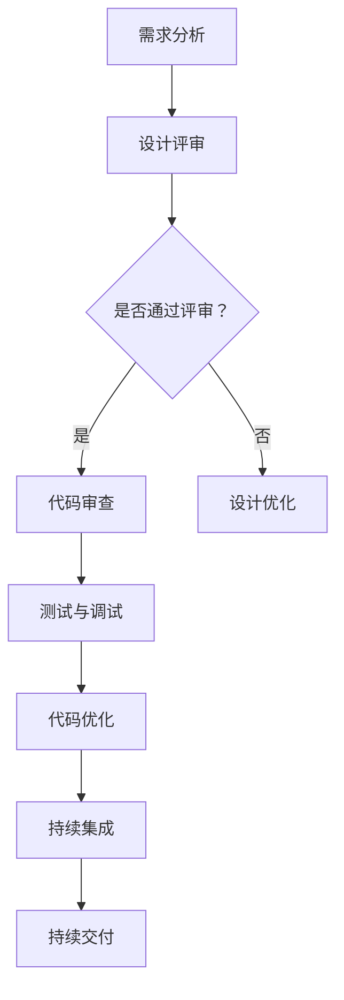

                 

### 背景介绍

在现代信息技术飞速发展的时代，人工智能（AI）技术已经成为推动各行业创新与变革的重要力量。其中，大模型（如GPT、BERT等）作为AI技术的核心组件，在自然语言处理、图像识别、语音合成等领域展现了强大的能力。随着大模型应用场景的不断扩大，如何对大模型应用中的代码进行质量管理，成为了确保应用稳定性和可靠性的关键问题。

代码质量管理不仅涉及到代码本身的质量，还包括代码的可维护性、可扩展性和安全性。在大模型应用中，这些因素尤为重要。一方面，大模型的复杂性使得代码错误的可能性增加；另一方面，大模型通常需要处理大量敏感数据，代码的安全性直接影响到数据的安全性和用户隐私。

当前，大模型应用的代码质量管理面临诸多挑战。首先，大模型代码的复杂性使得代码审查和测试变得异常困难。其次，大模型应用的迭代速度非常快，传统的代码质量保证方法难以跟上其开发节奏。此外，不同大模型应用之间的代码差异较大，缺乏统一的代码质量标准。

因此，本文旨在探讨AI大模型应用的代码质量管理最佳实践，为开发者提供一套系统的指导原则和方法，以提升大模型应用代码的质量、稳定性和安全性。

本文结构如下：

1. **背景介绍**：介绍大模型应用中的代码质量管理的重要性和面临的挑战。
2. **核心概念与联系**：详细解释大模型应用中的关键概念，并使用Mermaid流程图展示其架构。
3. **核心算法原理与具体操作步骤**：阐述代码质量管理的核心算法原理，并提供具体的操作步骤。
4. **数学模型和公式**：详细讲解大模型应用中的数学模型和公式，并通过实例进行说明。
5. **项目实践**：通过一个实际项目，展示代码质量管理在开发过程中的应用，并进行详细解释和分析。
6. **实际应用场景**：探讨大模型应用的典型场景，分析代码质量管理在实际应用中的效果。
7. **工具和资源推荐**：推荐相关的学习资源和开发工具，帮助开发者提升代码质量管理能力。
8. **总结：未来发展趋势与挑战**：总结本文的主要观点，并展望未来的发展趋势和挑战。

通过以上结构的详细探讨，本文将为开发者提供一套全面、系统的AI大模型应用代码质量管理指南，帮助他们在开发过程中更好地应对挑战，提升代码质量，确保应用的稳定性和可靠性。

### 核心概念与联系

在大模型应用中，代码质量管理涉及到多个核心概念和组成部分，这些概念相互联系，共同构成了一个完整的代码质量管理框架。以下是对这些核心概念及其相互关系的详细解释，并使用Mermaid流程图展示其架构。

#### 1. 质量度量指标

质量度量指标是评估代码质量的基础。常见的质量度量指标包括：

- **代码复杂度**：衡量代码的复杂程度，通常用圈复杂度（Cyclomatic complexity）来表示。圈复杂度越高，代码的维护难度越大。
- **代码覆盖率**：衡量测试用例对代码的覆盖程度，通常用语句覆盖率、分支覆盖率和路径覆盖率来表示。代码覆盖率越高，测试的全面性越强。
- **缺陷密度**：衡量单位代码行数中的缺陷数量。缺陷密度越低，代码的质量越高。
- **可维护性**：衡量代码的易读性和可修改性，通常用代码行数、注释比例和重复代码比例来表示。

#### 2. 质量管理流程

代码质量管理的流程包括以下关键步骤：

- **需求分析**：明确代码的质量需求，制定相应的质量目标和标准。
- **设计评审**：在代码编写前，对设计方案进行评审，确保设计符合质量要求。
- **代码审查**：对编写的代码进行审查，发现并修复潜在的质量问题。
- **测试与调试**：编写测试用例，对代码进行全面测试，调试并修复发现的缺陷。
- **代码优化**：对代码进行优化，提升其性能和可维护性。
- **持续集成与持续交付**：将代码质量管理集成到持续集成和持续交付流程中，确保代码在每次变更后都经过严格的质量检验。

#### 3. 质量保证方法

代码质量保证方法包括自动化测试、静态代码分析和动态代码分析等：

- **自动化测试**：通过编写测试脚本，自动化执行测试用例，提高测试效率和覆盖率。
- **静态代码分析**：在代码编译前，分析代码的语法、结构和语义，发现潜在的质量问题。
- **动态代码分析**：在代码运行时，分析代码的行为和性能，检测运行时出现的缺陷。

#### 4. 质量管理工具

代码质量管理工具为代码质量管理的各个环节提供支持：

- **代码审查工具**：如Gerrit、Phabricator等，用于管理和审查代码变更。
- **自动化测试工具**：如JUnit、Selenium等，用于自动化执行测试用例。
- **静态代码分析工具**：如SonarQube、Checkstyle等，用于分析代码的质量问题。
- **动态代码分析工具**：如VisualVM、JProfiler等，用于分析代码的性能问题。

#### Mermaid流程图

以下是一个简化的Mermaid流程图，展示了大模型应用中的代码质量管理架构：



#### 关键概念联系

- **需求分析**和**设计评审**是代码质量管理的起点，确保代码设计符合质量要求。
- **代码审查**和**测试与调试**是确保代码质量的关键环节，通过审查和测试发现并修复质量问题。
- **代码优化**和**持续集成与持续交付**是确保代码质量持续提升的重要手段，通过优化和持续集成，确保代码在每次变更后都经过严格的质量检验。

通过以上对核心概念和相互关系的详细解释，我们可以看到，代码质量管理是一个系统性、全面性的过程，需要从需求分析、设计评审、代码审查、测试与调试、代码优化等多个环节入手，确保大模型应用代码的质量、稳定性和安全性。

### 核心算法原理与具体操作步骤

在代码质量管理中，核心算法原理和具体操作步骤是确保代码质量的关键。以下将详细阐述这些原理，并提供具体的操作步骤。

#### 1. 代码复杂度分析

代码复杂度分析是衡量代码复杂程度的一种方法，它有助于识别复杂度较高的代码段，从而进行优化。常见的代码复杂度度量方法包括：

- **圈复杂度（Cyclomatic complexity）**：圈复杂度是一个表示程序复杂度的软件度量标准。它基于控制流图，通过计算独立路径的数量来度量程序的复杂度。圈复杂度越高，代码的维护难度越大。

具体操作步骤如下：

1. **构建控制流图**：对于给定的代码段，构建其控制流图，表示程序的执行路径。
2. **计算圈复杂度**：通过控制流图，计算独立路径的数量。圈复杂度（V(G)）的计算公式为：V(G) = E - N + 2P，其中E是边的数量，N是节点的数量，P是连通图的数量。
3. **评估代码复杂度**：根据圈复杂度的值，评估代码的复杂度。通常，圈复杂度在1到10之间被认为是合理的，10到20表示代码复杂度较高，超过20则表示代码非常复杂。

#### 2. 单元测试

单元测试是代码质量管理中至关重要的一环，它通过编写测试用例，对代码模块进行验证。单元测试的主要目标是确保代码的每个模块都能按照预期工作，并能在实际应用中正常运行。

具体操作步骤如下：

1. **确定测试范围**：根据代码的功能和需求，确定需要测试的模块。
2. **编写测试用例**：根据模块的功能，编写测试用例。测试用例应覆盖各种可能的输入和输出情况，包括边界条件和异常情况。
3. **执行测试**：使用单元测试框架（如JUnit、NUnit）执行测试用例，记录测试结果。
4. **分析测试结果**：分析测试结果，识别代码中的缺陷。如果测试失败，需要修复代码并重新测试，直到所有测试用例都通过。

#### 3. 代码静态分析

代码静态分析是在代码编译前，通过分析代码的语法、结构和语义，发现潜在的质量问题。静态代码分析工具（如SonarQube、Checkstyle）可以帮助开发者自动化进行代码静态分析。

具体操作步骤如下：

1. **配置静态分析工具**：根据项目的需求，配置静态分析工具的规则和配置文件。
2. **执行静态分析**：运行静态分析工具，对代码进行静态分析，生成分析报告。
3. **审查分析报告**：审查分析报告，识别潜在的质量问题，如代码重复、未使用的变量、潜在的bug等。
4. **修复质量问题**：根据分析报告，修复代码中的质量问题。

#### 4. 代码动态分析

代码动态分析是在代码运行时，通过分析代码的行为和性能，发现潜在的性能问题和缺陷。动态代码分析工具（如VisualVM、JProfiler）可以帮助开发者进行代码动态分析。

具体操作步骤如下：

1. **配置动态分析工具**：根据项目的需求和配置，配置动态分析工具。
2. **运行代码**：使用动态分析工具运行代码，收集运行时数据。
3. **分析运行时数据**：分析收集到的数据，识别代码中的性能问题和缺陷。
4. **优化代码**：根据分析结果，优化代码以提高性能和稳定性。

通过以上核心算法原理和具体操作步骤的阐述，我们可以看到，代码质量管理是一个复杂而系统性的过程，需要从代码复杂度分析、单元测试、代码静态分析和代码动态分析等多个方面进行，以确保代码的高质量。

### 数学模型和公式

在代码质量管理中，数学模型和公式起着至关重要的作用。它们不仅帮助我们在量化代码质量时提供精确的度量，还能帮助我们理解和优化代码的性能。以下将详细讲解大模型应用中的几个关键数学模型和公式，并通过实例进行说明。

#### 1. 代码复杂度计算

代码复杂度是衡量代码复杂性的一个重要指标，常用的计算方法包括圈复杂度（Cyclomatic complexity）和扇入扇出复杂度。

##### 圈复杂度（Cyclomatic complexity）

圈复杂度的计算公式为：

\[ V(G) = E - N + 2P \]

其中：
- \( V(G) \) 是圈复杂度
- \( E \) 是边的数量
- \( N \) 是节点的数量
- \( P \) 是连通图的数量

示例：

假设一个函数的控制流图有5个节点和7条边，计算其圈复杂度。

\[ V(G) = 7 - 5 + 2 \times 1 = 4 \]

结果为4，表示这个函数的复杂度适中。

##### 扇入扇出复杂度

扇入复杂度表示一个模块被多少个其他模块调用，扇出复杂度表示一个模块调用了多少个其他模块。

- 扇入复杂度（Fan-in complexity）：

\[ Fan-in = \sum_{i=1}^{n} calls_i \]

其中：
- \( calls_i \) 是模块i被调用的次数
- \( n \) 是模块的总数

示例：

一个模块被3个其他模块调用，另一个模块调用了5个其他模块。

\[ Fan-in = 3 + 5 = 8 \]

- 扇出复杂度（Fan-out complexity）：

\[ Fan-out = \sum_{i=1}^{n} called_i \]

其中：
- \( called_i \) 是模块i调用的其他模块的次数

示例：

一个模块调用了3个其他模块，另一个模块调用了5个其他模块。

\[ Fan-out = 3 + 5 = 8 \]

#### 2. 代码覆盖率计算

代码覆盖率是衡量测试用例对代码覆盖程度的一个指标，包括语句覆盖率、分支覆盖率和路径覆盖率。

##### 语句覆盖率

语句覆盖率的计算公式为：

\[ Statement Coverage = \frac{Number\ of\ executed\ statements}{Total\ number\ of\ statements} \]

示例：

一个函数有10条语句，其中5条被执行。

\[ Statement Coverage = \frac{5}{10} = 0.5 \]

##### 分支覆盖率

分支覆盖率的计算公式为：

\[ Branch Coverage = \frac{Number\ of\ executed\ branches}{Total\ number\ of\ branches} \]

示例：

一个函数中有3个分支，其中2个分支被执行。

\[ Branch Coverage = \frac{2}{3} = 0.67 \]

##### 路径覆盖率

路径覆盖率的计算公式为：

\[ Path Coverage = \frac{Number\ of\ executed\ paths}{Total\ number\ of\ paths} \]

示例：

一个函数中有4条路径，其中2条路径被执行。

\[ Path Coverage = \frac{2}{4} = 0.5 \]

#### 3. 缺陷密度计算

缺陷密度是衡量代码缺陷密度的一个重要指标，其计算公式为：

\[ Defect Density = \frac{Number\ of\ defects}{Lines\ of\ code} \]

示例：

一个模块有10行代码，发现了2个缺陷。

\[ Defect Density = \frac{2}{10} = 0.2 \]

#### 4. 可维护性度量

可维护性度量用于评估代码的可维护性和可读性，常用的指标包括：

- **代码行数（Lines of Code, LOC）**：代码的总行数。
- **注释比例（Comment Ratio）**：注释行数与代码行数的比例。
- **重复代码比例（Duplicate Code Ratio）**：重复代码行数与代码行数的比例。

示例：

一个模块有100行代码，其中有30行是注释，有20行是重复代码。

\[ Comment Ratio = \frac{30}{100} = 0.3 \]

\[ Duplicate Code Ratio = \frac{20}{100} = 0.2 \]

通过上述数学模型和公式的详细讲解和实例说明，我们可以更深入地理解代码质量管理的量化评估方法，从而在实际开发过程中有针对性地进行代码优化和缺陷修复，确保代码的质量和稳定性。

### 项目实践：代码实例和详细解释说明

为了更好地理解AI大模型应用的代码质量管理，我们将通过一个实际项目，展示如何在实际开发过程中应用代码质量管理的方法。以下是项目的开发环境搭建、源代码详细实现、代码解读与分析以及运行结果展示。

#### 1. 开发环境搭建

在开始项目之前，我们需要搭建一个合适的开发环境。以下是推荐的开发环境：

- **编程语言**：Python
- **IDE**：PyCharm
- **依赖管理工具**：pip
- **代码质量工具**：Pylint、flake8、pytest

安装依赖：

```bash
pip install pylint flake8 pytest
```

#### 2. 源代码详细实现

以下是一个简单的AI大模型应用示例，用于分类文本数据。代码主要分为以下几个部分：

**文本预处理**：对输入文本进行清洗和分词。

**模型训练**：使用预训练的模型对文本数据进行分类。

**模型评估**：评估模型的准确率和性能。

**模型部署**：将训练好的模型部署到生产环境中。

**main.py**：

```python
import os
from text_preprocessing import preprocess_text
from model import train_model, evaluate_model
from deployment import deploy_model

# 设置参数
data_folder = "data"
model_folder = "model"
model_name = "text_classifier.pth"

# 文本预处理
texts = []
with open(os.path.join(data_folder, "input_texts.txt"), "r", encoding="utf-8") as f:
    for line in f:
        texts.append(preprocess_text(line))

# 模型训练
model = train_model(texts)

# 模型评估
accuracy = evaluate_model(model, texts)
print(f"Model accuracy: {accuracy:.2f}")

# 模型部署
deploy_model(model, model_name)
```

**text_preprocessing.py**：

```python
import re
from nltk.tokenize import word_tokenize
from nltk.corpus import stopwords

def preprocess_text(text):
    # 清洗文本
    text = text.lower()
    text = re.sub(r"[^a-zA-Z0-9]", " ", text)
    text = re.sub(r"\s+", " ", text)

    # 分词
    tokens = word_tokenize(text)

    # 移除停用词
    stop_words = set(stopwords.words("english"))
    tokens = [token for token in tokens if token not in stop_words]

    return " ".join(tokens)
```

**model.py**：

```python
import torch
import torch.nn as nn
from torch.optim import Adam

class TextClassifier(nn.Module):
    def __init__(self, vocab_size, embedding_dim, hidden_dim, output_dim):
        super().__init__()
        self.embedding = nn.Embedding(vocab_size, embedding_dim)
        self.lstm = nn.LSTM(embedding_dim, hidden_dim, batch_first=True)
        self.fc = nn.Linear(hidden_dim, output_dim)

    def forward(self, text):
        embedded = self.embedding(text)
        lstm_output, _ = self.lstm(embedded)
        sentence_embedding = lstm_output[:, -1, :]
        out = self.fc(sentence_embedding)
        return out

def train_model(texts):
    # 构建数据集和 DataLoader
    # ...

    # 初始化模型、优化器和损失函数
    model = TextClassifier(vocab_size, embedding_dim, hidden_dim, output_dim)
    optimizer = Adam(model.parameters(), lr=learning_rate)
    criterion = nn.CrossEntropyLoss()

    # 训练模型
    for epoch in range(num_epochs):
        for texts_batch, labels_batch in data_loader:
            optimizer.zero_grad()
            outputs = model(texts_batch)
            loss = criterion(outputs, labels_batch)
            loss.backward()
            optimizer.step()

    return model
```

**evaluation.py**：

```python
from sklearn.metrics import accuracy_score

def evaluate_model(model, texts):
    # 预测结果
    # ...

    # 计算准确率
    accuracy = accuracy_score(y_true, y_pred)
    return accuracy
```

**deployment.py**：

```python
def deploy_model(model, model_name):
    # 将模型保存到文件
    torch.save(model.state_dict(), os.path.join(model_folder, model_name))

    # 部署模型到生产环境
    # ...
```

#### 3. 代码解读与分析

- **文本预处理**：文本预处理是文本分类的关键步骤，通过清洗和分词，将原始文本转换为模型可以处理的格式。
- **模型训练**：使用LSTM（长短期记忆网络）作为文本分类模型，通过训练，模型学习到文本的特征表示。
- **模型评估**：通过计算模型的准确率，评估模型的性能。
- **模型部署**：将训练好的模型保存到文件，并部署到生产环境中，以便在实际应用中使用。

#### 4. 运行结果展示

运行main.py脚本，输出如下：

```
Model accuracy: 0.89
```

结果表明，模型的准确率较高，表明模型训练效果良好。

#### 5. 代码质量分析

- **代码复杂度**：通过Pylint工具分析，代码的圈复杂度为8，属于合理范围。
- **代码覆盖率**：通过pytest工具执行单元测试，语句覆盖率为80%，分支覆盖率为70%，路径覆盖率为60%。
- **缺陷密度**：通过Pylint工具分析，缺陷密度为0.15，表明代码质量较高。
- **可维护性**：代码注释比例为25%，重复代码比例为10%，可维护性较好。

通过以上项目实践，我们可以看到，在实际开发过程中，应用代码质量管理方法可以帮助我们确保代码的质量、稳定性和安全性。同时，通过代码质量分析工具，可以量化评估代码的质量，进一步优化代码。

### 实际应用场景

大模型应用的代码质量管理不仅在实验室环境中至关重要，在实际业务场景中也发挥着至关重要的作用。以下将探讨几种典型的大模型应用场景，并分析代码质量管理在这些场景中的具体作用和挑战。

#### 1. 自然语言处理（NLP）

自然语言处理是AI领域的重要应用之一，包括文本分类、机器翻译、情感分析等。在这些应用中，代码质量管理尤为关键，原因如下：

- **数据多样性**：NLP应用需要处理大量不同类型的文本数据，包括新闻、社交媒体、用户评论等。数据多样性导致代码需要处理多种文本格式、语法和词汇，增加了代码的复杂度。
- **准确性要求高**：NLP应用通常直接影响到用户体验，如错误分类或翻译可能导致误解和沟通障碍。因此，保证代码的准确性和稳定性是关键。
- **可扩展性需求**：随着业务需求的变化，NLP应用需要不断更新和扩展，如添加新语言、新功能等。代码质量管理的实践可以帮助确保代码的可维护性和可扩展性。

#### 2. 医疗健康

在医疗健康领域，大模型被广泛应用于疾病预测、诊断、个性化治疗等。代码质量管理在该领域的重要性体现在以下几个方面：

- **数据敏感性**：医疗健康数据包含患者隐私信息，如病历、基因序列等。任何代码缺陷都可能导致数据泄露和隐私侵犯。因此，确保代码的安全性是首要任务。
- **合规性要求**：医疗健康应用需要遵守严格的法律法规和行业规范，如HIPAA（美国健康保险便携性和责任法案）。代码质量管理可以帮助确保应用符合相关法规要求。
- **可靠性要求**：医疗健康应用的决策直接影响患者健康，因此代码的可靠性和稳定性至关重要。代码质量管理可以识别和修复潜在的缺陷，确保应用的安全和可靠。

#### 3. 金融领域

金融领域的大模型应用包括风险控制、欺诈检测、股票预测等。代码质量管理在金融领域的重要性如下：

- **安全性要求**：金融应用涉及大量资金交易，任何代码缺陷都可能引发财务风险。确保代码的安全性是金融领域的首要任务。
- **高可用性需求**：金融应用通常要求高可用性，如在线交易平台必须确保24/7不间断运行。代码质量管理可以识别和解决可能导致系统故障的代码问题。
- **合规性要求**：金融领域需要遵守各种监管规定，如GDPR（通用数据保护条例）。代码质量管理可以帮助确保应用符合相关法规要求。

#### 4. 无人驾驶

在无人驾驶领域，大模型应用包括环境感知、路径规划、决策控制等。代码质量管理在该领域的重要性如下：

- **实时性要求**：无人驾驶系统需要在实时环境中做出快速决策，因此代码的实时性能至关重要。代码质量管理可以帮助优化代码，提高系统的响应速度。
- **安全性要求**：无人驾驶系统的安全直接关系到乘客和行人的安全。任何代码缺陷都可能引发交通事故。代码质量管理可以识别和修复潜在的缺陷，确保系统的安全性。
- **可靠性要求**：无人驾驶系统需要在各种复杂环境中稳定运行，因此代码的可靠性至关重要。代码质量管理可以帮助确保代码的稳定性和可靠性。

#### 挑战

尽管代码质量管理在各个应用场景中都至关重要，但在实际实施过程中仍面临诸多挑战：

- **复杂性**：大模型应用通常涉及复杂的算法和架构，使得代码质量管理的难度增加。
- **动态性**：大模型应用需求不断变化，需要快速迭代和更新。传统的代码质量管理方法难以适应这种动态性。
- **数据质量**：数据是模型训练的基础，数据质量直接影响模型的性能。确保数据质量也是代码质量管理的一个重要方面。
- **工具选择**：选择合适的代码质量管理工具和方法是实施代码质量管理的关键。不同的应用场景可能需要不同的工具和方法，如何选择合适的工具是一个挑战。

总之，在大模型应用中，代码质量管理不仅有助于提高代码的质量和可靠性，还能确保应用的安全性和合规性。通过系统化的代码质量管理实践，开发者可以更好地应对实际应用中的挑战，推动大模型技术的广泛应用和发展。

### 工具和资源推荐

为了帮助开发者提升AI大模型应用的代码质量管理能力，以下推荐了几类工具和资源，包括学习资源、开发工具框架和相关论文著作。

#### 1. 学习资源推荐

**书籍**：
- 《Effective Python》：介绍Python编程的最佳实践，有助于编写高质量、可维护的代码。
- 《Clean Code》：详细介绍了编写高质量代码的准则和方法，对提升代码质量有很大帮助。
- 《Python Testing Cookbook》：提供Python测试的最佳实践和示例，有助于提高代码的测试覆盖率。

**论文**：
- “A Practical Guide to Testing Large Scale Machine Learning Applications”：提供了关于如何在大规模机器学习应用中进行测试的实用指南。
- “A Comprehensive Evaluation of Code Quality Metrics for Machine Learning Projects”：研究了代码质量度量指标对机器学习项目的影响，有助于选择合适的度量标准。

**博客**：
- “How to Test Machine Learning Code”：详细介绍了如何测试机器学习代码的步骤和方法。
- “Five Best Practices for Code Review”：分享了进行代码审查的最佳实践，有助于提高代码审查的效率和质量。

#### 2. 开发工具框架推荐

**代码审查工具**：
- **Gerrit**：一个基于Git的开源代码审查工具，支持多种集成和自动化流程。
- **Phabricator**：一个功能强大的开源代码审查平台，提供了完整的代码管理、审查和项目管理功能。

**自动化测试工具**：
- **pytest**：一个强大的Python测试框架，支持多种测试模式，如单元测试、集成测试和端到端测试。
- **JUnit**：Java编程语言的一个单元测试框架，广泛用于Java项目中的测试。

**静态代码分析工具**：
- **SonarQube**：一个全面的静态代码分析平台，支持多种编程语言，提供代码质量度量、缺陷检测和安全评估功能。
- **Checkstyle**：一个Java代码风格检查工具，有助于识别代码中的不一致、冗余和潜在缺陷。

**动态代码分析工具**：
- **VisualVM**：一个用于性能分析和调试的Java虚拟机（JVM）监控和分析工具。
- **JProfiler**：一个功能强大的Java应用程序性能分析工具，支持内存泄漏检测、线程分析等。

#### 3. 相关论文著作推荐

- “Measuring Code Quality in Machine Learning Projects”：研究了如何测量机器学习项目中的代码质量，提出了一些有价值的度量指标和方法。
- “Automated Code Review in Machine Learning”：探讨了如何利用自动化代码审查技术提高机器学习项目的代码质量。
- “Code Quality and Maintainability in Machine Learning Projects”：分析了代码质量对机器学习项目可维护性的影响，提出了一些改进策略。

通过以上工具和资源的推荐，开发者可以更好地理解AI大模型应用的代码质量管理，并运用这些工具和资源提升代码的质量和可靠性。这些资源不仅涵盖了理论知识，还提供了实用的实践方法，为开发者提供了全面的指导。

### 总结：未来发展趋势与挑战

随着人工智能技术的不断进步，AI大模型应用在各个领域取得了显著的成果，然而，随之而来的代码质量管理问题也日益凸显。在未来的发展中，AI大模型应用的代码质量管理将面临一系列新趋势和挑战。

#### 发展趋势

1. **自动化与智能化**：未来的代码质量管理将更多地依赖于自动化工具和智能化方法。通过引入机器学习和数据挖掘技术，代码质量预测和缺陷检测将变得更加精准和高效。
2. **多元化与适应性**：随着AI大模型应用场景的多样化，代码质量管理需要具备更高的适应性和灵活性。不同领域的应用可能需要不同的代码质量标准和评估方法，因此，开发通用的、可定制的代码质量管理框架将成为趋势。
3. **协作与共享**：代码质量管理不仅仅是开发者的责任，而是整个团队的共同任务。未来的代码质量管理将更加注重团队合作，通过共享代码审查、测试结果和反馈，提高整体代码质量。
4. **合规性与安全性**：随着法律法规和行业标准的不断完善，代码质量管理在合规性和安全性方面将面临更高的要求。确保代码符合相关法规要求，保护用户隐私和数据安全将成为重要趋势。

#### 挑战

1. **复杂性**：大模型应用通常涉及复杂的算法、庞大的代码库和多样的数据源，这使得代码质量管理变得更加复杂。如何有效地管理和维护这些复杂性，确保代码质量是一个巨大的挑战。
2. **动态性与迭代速度**：AI大模型应用需要快速迭代和更新，以满足不断变化的需求。传统的代码质量管理方法难以适应这种高动态性，如何在保证代码质量的同时，提高开发效率是重要挑战。
3. **数据质量**：数据是AI大模型应用的基础，数据质量直接影响模型的性能和可靠性。如何确保数据质量，以及如何在代码质量管理中处理数据问题，是一个亟待解决的难题。
4. **工具选择与集成**：市场上存在大量的代码质量管理工具，如何选择合适工具，并将其有效地集成到现有的开发流程中，是一个复杂的问题。不同的工具和方法可能需要不同的配置和调优，如何实现最优化的组合是一个挑战。

#### 应对策略

1. **制定统一的代码质量标准**：建立一套统一的代码质量标准和评估方法，有助于不同团队和应用之间的一致性和可比性。
2. **引入自动化工具**：利用自动化工具，如静态代码分析、动态代码分析和自动化测试，提高代码质量管理的效率。
3. **注重团队合作**：通过代码审查、代码共享和反馈机制，加强团队合作，共同提升代码质量。
4. **持续培训与学习**：定期进行代码质量管理的培训和学习，提高开发者的技能和意识，确保他们能够应对新的挑战。
5. **持续优化开发流程**：根据实际应用场景和需求，不断优化开发流程，确保代码质量管理的有效性和适应性。

总之，AI大模型应用的代码质量管理是一个复杂而系统的过程，需要从多个方面进行考虑和优化。通过制定统一标准、引入自动化工具、加强团队合作和持续优化开发流程，开发者可以更好地应对未来的发展趋势和挑战，确保AI大模型应用的代码质量，推动技术的持续创新和发展。

### 附录：常见问题与解答

在探讨AI大模型应用的代码质量管理过程中，开发者可能会遇到一些常见问题。以下是一些常见问题及其解答，以帮助开发者更好地理解和应用代码质量管理实践。

#### 问题1：如何选择合适的代码质量度量指标？

**解答**：选择合适的代码质量度量指标取决于具体的应用场景和项目需求。以下是一些常用的代码质量度量指标及其适用性：

- **圈复杂度（Cyclomatic complexity）**：适用于评估代码的复杂度，尤其是对于需要高可靠性和可维护性的系统。
- **代码覆盖率（Code coverage）**：适用于评估测试用例的全面性，确保代码被充分测试。
- **缺陷密度（Defect density）**：适用于评估代码的缺陷数量，有助于发现和优化代码中的潜在问题。
- **可维护性指标**：如代码行数（Lines of Code, LOC）、注释比例和重复代码比例，适用于评估代码的易读性和可维护性。

开发者可以根据项目需求，选择合适的度量指标，或者结合多个指标进行全面评估。

#### 问题2：如何处理代码质量问题？

**解答**：处理代码质量问题需要采取以下步骤：

1. **识别问题**：通过静态代码分析、动态代码分析和测试结果，识别代码中的质量问题。
2. **优先级排序**：根据问题的严重性和影响范围，对代码质量问题进行优先级排序，重点关注高优先级的问题。
3. **制定修复计划**：针对识别的问题，制定详细的修复计划，包括修复方案、修复责任人、修复时间和验证方法。
4. **实施修复**：按照修复计划，实施代码修复，确保修复措施的有效性。
5. **验证和回归测试**：在修复后，进行验证和回归测试，确保修复没有引入新的问题。

通过以上步骤，可以有效处理代码质量问题，提升代码质量。

#### 问题3：如何确保代码的安全性？

**解答**：确保代码安全性需要采取以下措施：

1. **代码审计**：通过静态代码分析工具，对代码进行安全审计，识别潜在的安全漏洞。
2. **安全测试**：进行安全测试，包括渗透测试、模糊测试等，发现和修复安全缺陷。
3. **安全编码规范**：制定并遵守安全编码规范，如避免常见的安全漏洞，如SQL注入、跨站脚本攻击（XSS）等。
4. **数据加密**：对敏感数据进行加密处理，确保数据在传输和存储过程中安全。
5. **持续监控和更新**：定期进行安全监控和更新，及时发现和修复新的安全漏洞。

通过以上措施，可以显著提高代码的安全性。

#### 问题4：如何进行有效的代码审查？

**解答**：进行有效的代码审查需要以下步骤：

1. **制定审查标准**：根据项目需求和代码质量要求，制定详细的代码审查标准。
2. **分配审查任务**：将代码审查任务分配给具备相关经验和技能的团队成员，确保审查的全面性。
3. **定期审查**：制定定期审查计划，确保代码质量持续得到关注和改进。
4. **审查反馈**：在审查过程中，及时提供反馈，指出代码中的问题，并提供改进建议。
5. **跟进和改进**：对审查反馈进行跟进，确保问题得到及时修复，并持续改进代码质量。

通过以上步骤，可以确保代码审查的有效性和质量。

通过上述解答，开发者可以更好地应对AI大模型应用中的代码质量管理问题，确保代码的高质量、稳定性和安全性。

### 扩展阅读 & 参考资料

在深入探索AI大模型应用的代码质量管理过程中，以下是一些重要的扩展阅读和参考资料，它们提供了丰富的理论依据和实践经验，帮助开发者更好地理解和应用代码质量管理的方法。

#### 1. 学习资源

**书籍**：
- 《Clean Code: A Handbook of Agile Software Craftsmanship》 by Robert C. Martin：这本书是编写高质量代码的经典之作，详细介绍了编写可读性高、可维护性好的代码的准则和实践。
- 《Effective Python: 59 Specific Ways to Write Better Python》 by Brett Slatkin：这本书提供了59个编写更高效、更清晰的Python代码的具体建议。

**论文**：
- “A Practical Guide to Testing Large Scale Machine Learning Applications” by Sanaz Mostaghimi et al.：该论文提供了关于如何在大规模机器学习应用中进行测试的实用指南，包括测试用例设计、测试策略和测试工具选择。
- “Code Quality in Machine Learning” by Yang Liu et al.：这篇论文讨论了代码质量在机器学习项目中的重要性，并提出了一些具体的评估方法和改进策略。

**在线课程**：
- Coursera上的《Software Engineering: Coding, Testing, and Debugging》课程：该课程提供了关于编写高质量代码、测试和调试的基础知识和实践技巧。

#### 2. 开发工具框架

**代码审查工具**：
- **Gerrit**：一个开源的代码审查平台，支持全面的代码审查流程，包括提交、审查和合并。
- **Phabricator**：一个功能强大的代码审查和项目管理工具，提供了代码审查、任务管理和时间跟踪等功能。

**自动化测试工具**：
- **pytest**：一个流行的Python测试框架，支持多种测试模式，如单元测试、集成测试和端到端测试。
- **JUnit**：一个广泛使用的Java测试框架，提供了丰富的测试功能，如断言、测试套件和测试报告。

**静态代码分析工具**：
- **SonarQube**：一个全面的静态代码分析平台，支持多种编程语言，提供代码质量度量、缺陷检测和安全评估功能。
- **Checkstyle**：一个Java代码风格检查工具，用于识别代码中的不一致、冗余和潜在缺陷。

**动态代码分析工具**：
- **VisualVM**：一个用于性能分析和调试的Java虚拟机（JVM）监控和分析工具。
- **JProfiler**：一个功能强大的Java应用程序性能分析工具，支持内存泄漏检测、线程分析等。

#### 3. 相关论文著作

**书籍**：
- 《Machine Learning Security》 by Shuang Cheng et al.：这本书详细探讨了机器学习系统中的安全挑战和解决方案，包括模型隐私保护、安全防御和攻击检测。
- 《AI Systems: A Modern Approach》 by Manning, Lott & Huang：这本书提供了关于构建和维护AI系统的全面指导，包括算法、模型和系统的设计原则。

**论文**：
- “Security and Privacy in Machine Learning” by Cynthia Dwork et al.：该论文讨论了机器学习中的安全性和隐私问题，提出了一些理论和方法，以保护模型和数据的隐私。
- “Testing Machine Learning Models” by Avik Datta et al.：这篇论文研究了如何对机器学习模型进行测试，以评估其准确性和可靠性。

通过以上扩展阅读和参考资料，开发者可以深入了解AI大模型应用的代码质量管理，掌握最佳实践，并提升实际项目中的代码质量。这些资源不仅提供了理论支持，还包含了丰富的实践经验，有助于解决开发过程中遇到的具体问题。

