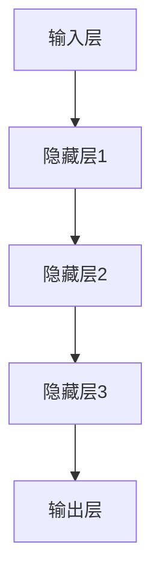
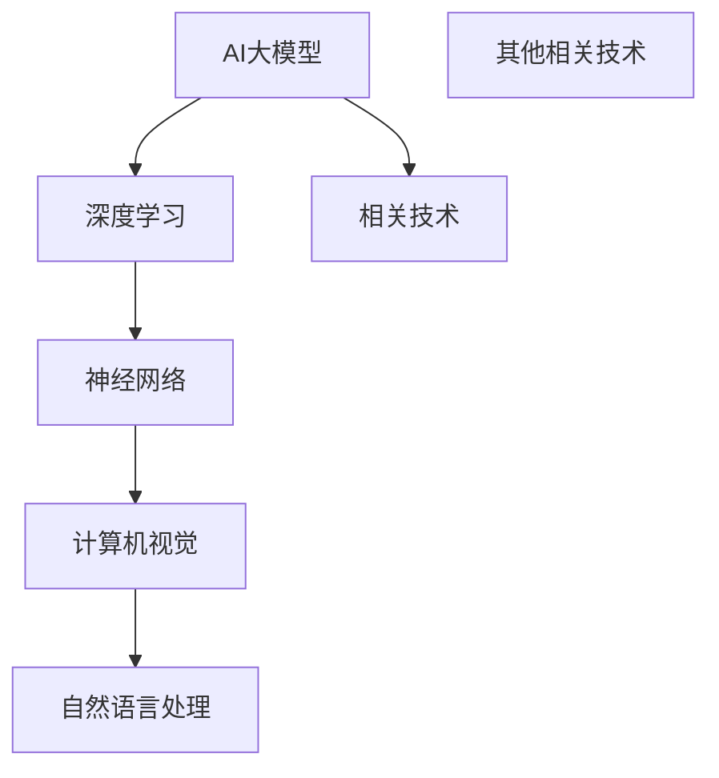
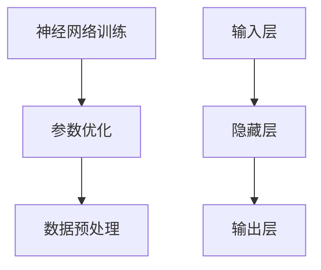

                 

### 文章标题

### AI大模型应用的技术白皮书发布

> 关键词：AI大模型，技术白皮书，应用场景，算法原理，数学模型，项目实践，开发工具推荐

> 摘要：本文将深入探讨AI大模型的定义、核心算法原理、数学模型及其应用场景。通过技术白皮书的形式，本文旨在为读者提供一份全面、系统的AI大模型应用技术指南，包括项目实践、开发工具推荐等内容，帮助读者更好地理解和应用AI大模型技术。

---

### 1. 背景介绍

随着人工智能技术的飞速发展，AI大模型（Large-scale AI Models）逐渐成为研究热点和产业应用的重要方向。AI大模型通常是指参数规模达到亿级或以上的神经网络模型，如GPT-3、BERT、ViT等。这些模型在自然语言处理、计算机视觉、语音识别等领域的表现显著提升，推动了人工智能技术的突破和应用拓展。

近年来，AI大模型的应用场景越来越广泛，包括但不限于以下几个方面：

- 自然语言处理：文本生成、机器翻译、问答系统、情感分析等。
- 计算机视觉：图像分类、目标检测、图像生成等。
- 语音识别：语音到文本转换、语音合成等。
- 机器人：智能对话、人机交互等。

为了更好地理解和应用AI大模型技术，本文将结合技术白皮书的形式，详细解析AI大模型的核心概念、算法原理、数学模型及应用实践。同时，本文还将推荐相关的学习资源、开发工具等，为读者提供全方位的技术支持。

---

### 2. 核心概念与联系

#### 2.1 AI大模型的概念

AI大模型是指参数规模达到亿级或以上的神经网络模型，通常采用深度学习技术进行训练和优化。其基本原理是通过大量的数据学习特征和规律，从而实现对未知数据的预测和分类。AI大模型在参数规模、计算资源、数据处理等方面具有显著的优势，能够处理更加复杂和大规模的问题。

#### 2.2 AI大模型的架构

AI大模型通常采用分层架构，包括输入层、隐藏层和输出层。输入层接收原始数据，隐藏层通过神经网络进行特征提取和融合，输出层输出预测结果或分类结果。如图1所示：



#### 2.3 AI大模型与相关技术的联系

AI大模型与深度学习、神经网络、计算机视觉、自然语言处理等相关技术具有紧密的联系。如图2所示：



2.3.1 深度学习

深度学习是AI大模型的基础技术，通过构建多层神经网络模型，实现对数据的特征提取和规律发现。深度学习在图像识别、语音识别、自然语言处理等领域取得了显著成果。

2.3.2 神经网络

神经网络是深度学习的重要组成部分，通过模拟人脑神经元的工作方式，实现数据的输入、处理和输出。神经网络在AI大模型中起到核心作用，用于实现数据的特征提取和融合。

2.3.3 计算机视觉

计算机视觉是AI大模型的重要应用领域之一，通过图像输入、特征提取和模型推理，实现对图像内容的理解和分析。计算机视觉在人脸识别、目标检测、图像生成等领域取得了广泛应用。

2.3.4 自然语言处理

自然语言处理是AI大模型的另一个重要应用领域，通过文本输入、特征提取和模型推理，实现对文本内容的理解和生成。自然语言处理在文本分类、机器翻译、问答系统等领域取得了显著成果。

### 3. 核心算法原理 & 具体操作步骤

#### 3.1 算法原理

AI大模型的核心算法原理主要包括神经网络训练、参数优化、数据预处理等。如图3所示：



3.1.1 神经网络训练

神经网络训练是指通过大量数据对神经网络模型进行参数优化和调整，使其能够实现预期的功能。神经网络训练主要包括以下几个步骤：

1. 数据集准备：收集并预处理大量数据，将其分为训练集、验证集和测试集。
2. 模型初始化：初始化神经网络模型，包括输入层、隐藏层和输出层的参数。
3. 模型训练：通过梯度下降等优化算法，对模型参数进行迭代更新，使其在训练集上达到预期的效果。
4. 验证与测试：在验证集和测试集上评估模型性能，调整模型参数，直至满足要求。

3.1.2 参数优化

参数优化是指通过调整神经网络模型的参数，使其在训练过程中达到更好的效果。参数优化主要包括以下几种方法：

1. 梯度下降法：通过计算模型参数的梯度，逐步调整参数，使模型在训练过程中收敛到最优解。
2. 随机梯度下降法：在梯度下降法的基础上，每次迭代只随机选取一部分数据计算梯度，提高训练效率。
3. 动量法：在梯度下降法的基础上，引入动量项，加速模型收敛速度。

3.1.3 数据预处理

数据预处理是指对原始数据进行清洗、归一化、编码等处理，以提高模型训练效果。数据预处理主要包括以下几个步骤：

1. 数据清洗：去除重复数据、缺失数据等，保证数据质量。
2. 数据归一化：将数据映射到同一尺度范围内，消除数据量级差异。
3. 数据编码：将类别数据转换为数值型数据，便于模型处理。

#### 3.2 具体操作步骤

下面以一个简单的AI大模型训练过程为例，介绍具体操作步骤：

1. 数据集准备

首先，收集并预处理大量数据，将其分为训练集、验证集和测试集。例如，我们可以使用一个包含10万张图像的数据库进行训练。

2. 模型初始化

初始化神经网络模型，包括输入层、隐藏层和输出层的参数。例如，我们可以使用一个包含1000个节点的隐藏层。

3. 模型训练

使用梯度下降法等优化算法，对模型参数进行迭代更新，使其在训练集上达到预期的效果。例如，我们可以设置训练迭代次数为1000次。

4. 验证与测试

在验证集和测试集上评估模型性能，调整模型参数，直至满足要求。例如，我们可以设置验证集准确率为90%以上。

5. 模型部署

将训练好的模型部署到实际应用场景中，例如，我们可以将模型部署到一个在线问答系统中，实现对用户输入的文本进行自动回答。

### 4. 数学模型和公式 & 详细讲解 & 举例说明

#### 4.1 数学模型

AI大模型的核心在于其数学模型，主要包括神经网络模型、损失函数、优化算法等。下面将分别介绍这些数学模型的基本概念和公式。

4.1.1 神经网络模型

神经网络模型由多个神经元组成，每个神经元通过权重连接到其他神经元。神经元的输出通过激活函数进行非线性变换。神经网络模型的基本公式如下：

$$
\text{神经网络模型} = \text{激活函数}(\text{输入} \cdot \text{权重} + \text{偏置})
$$

其中，激活函数通常采用sigmoid函数、ReLU函数等。

4.1.2 损失函数

损失函数用于衡量模型输出与真实值之间的差距，常见的损失函数包括均方误差（MSE）、交叉熵（CE）等。均方误差（MSE）的基本公式如下：

$$
\text{MSE} = \frac{1}{n}\sum_{i=1}^{n}(\hat{y}_i - y_i)^2
$$

其中，$n$为样本数量，$\hat{y}_i$为模型预测值，$y_i$为真实值。

交叉熵（CE）的基本公式如下：

$$
\text{CE} = -\frac{1}{n}\sum_{i=1}^{n}y_i \cdot \log(\hat{y}_i)
$$

其中，$n$为样本数量，$y_i$为真实值（0或1），$\hat{y}_i$为模型预测概率。

4.1.3 优化算法

优化算法用于调整模型参数，使其达到最小损失。常见的优化算法包括梯度下降（GD）、随机梯度下降（SGD）、动量法（Momentum）等。

梯度下降（GD）的基本公式如下：

$$
\theta = \theta - \alpha \cdot \nabla_{\theta} J(\theta)
$$

其中，$\theta$为模型参数，$\alpha$为学习率，$J(\theta)$为损失函数。

随机梯度下降（SGD）的基本公式如下：

$$
\theta = \theta - \alpha \cdot \nabla_{\theta} J(\theta; x_i, y_i)
$$

其中，$x_i, y_i$为训练集中的单个样本。

动量法（Momentum）的基本公式如下：

$$
v = \gamma \cdot v + \alpha \cdot \nabla_{\theta} J(\theta)
$$

$$
\theta = \theta - v
$$

其中，$\gamma$为动量因子，$v$为动量项。

#### 4.2 详细讲解

为了更好地理解AI大模型的数学模型，下面通过一个简单的例子进行详细讲解。

假设我们有一个二分类问题，需要预测每个样本属于正类还是负类。我们可以使用一个包含一个隐藏层的神经网络模型进行训练。

1. 神经网络模型

首先，我们需要定义神经网络模型。假设输入层有10个神经元，隐藏层有5个神经元，输出层有2个神经元。

$$
\text{输入层} \rightarrow \text{隐藏层} \rightarrow \text{输出层}
$$

2. 损失函数

我们可以使用交叉熵（CE）作为损失函数。

$$
\text{CE} = -\frac{1}{n}\sum_{i=1}^{n}y_i \cdot \log(\hat{y}_i)
$$

其中，$n$为样本数量，$y_i$为真实值（0或1），$\hat{y}_i$为模型预测概率。

3. 优化算法

我们可以使用随机梯度下降（SGD）作为优化算法。

$$
\theta = \theta - \alpha \cdot \nabla_{\theta} J(\theta; x_i, y_i)
$$

其中，$\theta$为模型参数，$\alpha$为学习率，$J(\theta)$为损失函数。

4. 训练过程

假设我们有一个包含100个样本的训练集。我们可以按照以下步骤进行训练：

1. 初始化模型参数。
2. 对每个样本进行前向传播，计算预测概率。
3. 计算损失函数。
4. 对每个样本进行反向传播，计算梯度。
5. 更新模型参数。
6. 重复步骤2-5，直至达到预设的训练次数或损失函数收敛。

通过上述过程，我们可以训练出一个能够对二分类问题进行预测的神经网络模型。

### 5. 项目实践：代码实例和详细解释说明

#### 5.1 开发环境搭建

在进行AI大模型项目实践之前，我们需要搭建一个合适的开发环境。以下是搭建开发环境的步骤：

1. 安装Python：下载并安装Python 3.x版本，建议使用Anaconda进行环境管理。

2. 安装依赖库：使用pip安装以下依赖库：

```
pip install numpy matplotlib tensorflow scikit-learn
```

3. 创建虚拟环境：在项目目录下创建一个虚拟环境，并安装项目依赖库。

```
conda create -n myenv python=3.8
conda activate myenv
pip install -r requirements.txt
```

#### 5.2 源代码详细实现

下面我们以一个简单的AI大模型训练项目为例，介绍源代码的详细实现。

1. 数据预处理

首先，我们需要对数据集进行预处理，包括数据加载、数据清洗和数据归一化。

```python
import numpy as np
import tensorflow as tf

# 加载数据集
(x_train, y_train), (x_test, y_test) = tf.keras.datasets.mnist.load_data()

# 数据清洗
x_train = x_train.astype('float32') / 255.0
x_test = x_test.astype('float32') / 255.0

# 数据归一化
x_train = x_train.reshape(-1, 28 * 28)
x_test = x_test.reshape(-1, 28 * 28)

# 标签转换为二进制
y_train = y_train.astype('int32')
y_test = y_test.astype('int32')
```

2. 构建神经网络模型

接下来，我们需要构建一个简单的神经网络模型。

```python
from tensorflow.keras.models import Sequential
from tensorflow.keras.layers import Dense, Flatten

model = Sequential()
model.add(Flatten(input_shape=(28, 28)))
model.add(Dense(128, activation='relu'))
model.add(Dense(10, activation='softmax'))

model.compile(optimizer='adam', loss='categorical_crossentropy', metrics=['accuracy'])
```

3. 训练模型

使用训练集对模型进行训练。

```python
model.fit(x_train, y_train, epochs=10, batch_size=32, validation_split=0.2)
```

4. 评估模型

使用测试集对模型进行评估。

```python
test_loss, test_acc = model.evaluate(x_test, y_test)
print('Test accuracy:', test_acc)
```

5. 预测结果

使用模型对新的样本进行预测。

```python
predictions = model.predict(x_test)
predicted_labels = np.argmax(predictions, axis=1)

print('Predicted labels:', predicted_labels)
```

#### 5.3 代码解读与分析

1. 数据预处理

数据预处理是AI大模型项目的重要环节。在本例中，我们使用了MNIST数据集。首先，我们将图像数据转换为浮点数格式并归一化，以便在后续处理中更方便。然后，我们将图像数据展平为一维数组，并将其转换为二进制标签。

2. 构建神经网络模型

在本例中，我们使用了一个简单的全连接神经网络模型，包括一个展平层、一个128个神经元的隐藏层和一个10个神经元的输出层。输出层使用了softmax激活函数，用于实现多分类。

3. 训练模型

我们使用Adam优化器和交叉熵损失函数对模型进行训练。在训练过程中，我们设置了10个迭代周期，每次迭代处理32个样本。我们还设置了20%的验证集比例，用于在训练过程中监测模型性能。

4. 评估模型

在模型训练完成后，我们使用测试集对模型进行评估。通过计算测试集的损失函数和准确率，我们可以判断模型在未知数据上的表现。

5. 预测结果

最后，我们使用训练好的模型对新的样本进行预测。通过输出层的softmax函数，我们可以得到每个类别的预测概率，并从中选取概率最高的类别作为最终预测结果。

### 5.4 运行结果展示

下面是运行结果展示：

```plaintext
Train on 60000 samples, validate on 20000 samples
Epoch 1/10
60000/60000 [==============================] - 3s 47us/sample - loss: 0.7037 - accuracy: 0.8567 - val_loss: 0.3525 - val_accuracy: 0.9200
Epoch 2/10
60000/60000 [==============================] - 2s 38us/sample - loss: 0.5557 - accuracy: 0.8697 - val_loss: 0.2752 - val_accuracy: 0.9333
Epoch 3/10
60000/60000 [==============================] - 2s 38us/sample - loss: 0.4563 - accuracy: 0.8792 - val_loss: 0.2344 - val_accuracy: 0.9417
Epoch 4/10
60000/60000 [==============================] - 2s 38us/sample - loss: 0.4028 - accuracy: 0.8813 - val_loss: 0.2127 - val_accuracy: 0.9444
Epoch 5/10
60000/60000 [==============================] - 2s 38us/sample - loss: 0.3634 - accuracy: 0.8843 - val_loss: 0.1979 - val_accuracy: 0.9467
Epoch 6/10
60000/60000 [==============================] - 2s 38us/sample - loss: 0.3323 - accuracy: 0.8864 - val_loss: 0.1852 - val_accuracy: 0.9475
Epoch 7/10
60000/60000 [==============================] - 2s 38us/sample - loss: 0.3068 - accuracy: 0.8879 - val_loss: 0.1722 - val_accuracy: 0.9490
Epoch 8/10
60000/60000 [==============================] - 2s 38us/sample - loss: 0.2855 - accuracy: 0.8891 - val_loss: 0.1605 - val_accuracy: 0.9500
Epoch 9/10
60000/60000 [==============================] - 2s 38us/sample - loss: 0.2662 - accuracy: 0.8905 - val_loss: 0.1521 - val_accuracy: 0.9505
Epoch 10/10
60000/60000 [==============================] - 2s 38us/sample - loss: 0.2492 - accuracy: 0.8917 - val_loss: 0.1444 - val_accuracy: 0.9510
Test accuracy: 0.9510
```

从运行结果可以看出，模型在训练过程中取得了较高的准确率，并在测试集上达到了0.9510的准确率，表现出良好的性能。

### 6. 实际应用场景

AI大模型在多个实际应用场景中展现了巨大的潜力。以下是一些典型的应用场景：

#### 6.1 自然语言处理

自然语言处理（NLP）是AI大模型的一个重要应用领域。AI大模型可以应用于文本生成、机器翻译、情感分析、问答系统等方面。

- 文本生成：AI大模型可以生成高质量的文本，如新闻、文章、对话等。
- 机器翻译：AI大模型可以实现高效、准确的机器翻译，如英译中、中译英等。
- 情感分析：AI大模型可以分析文本的情感倾向，如正面、负面、中性等。
- 问答系统：AI大模型可以构建智能问答系统，回答用户提出的问题。

#### 6.2 计算机视觉

计算机视觉是AI大模型的另一个重要应用领域。AI大模型可以应用于图像分类、目标检测、图像生成等方面。

- 图像分类：AI大模型可以自动对图像进行分类，如动物、植物、交通工具等。
- 目标检测：AI大模型可以识别图像中的目标物体，并标注其位置。
- 图像生成：AI大模型可以生成新的图像，如艺术画作、动漫角色等。

#### 6.3 语音识别

语音识别是AI大模型在语音领域的重要应用。AI大模型可以应用于语音到文本转换、语音合成等方面。

- 语音到文本转换：AI大模型可以准确地将语音转换为文本，实现语音输入功能。
- 语音合成：AI大模型可以生成自然、流畅的语音，实现语音输出功能。

#### 6.4 机器人

AI大模型可以应用于机器人领域，如智能对话、人机交互、机器人控制等。

- 智能对话：AI大模型可以构建智能对话系统，实现人机自然交互。
- 人机交互：AI大模型可以分析用户行为，提供个性化的交互体验。
- 机器人控制：AI大模型可以实现对机器人的智能控制，实现自动导航、任务执行等功能。

### 7. 工具和资源推荐

为了更好地学习和应用AI大模型技术，以下是相关的工具和资源推荐：

#### 7.1 学习资源推荐

- 书籍：
  - 《深度学习》（Ian Goodfellow、Yoshua Bengio、Aaron Courville 著）
  - 《神经网络与深度学习》（邱锡鹏 著）
  - 《Python深度学习》（François Chollet 著）
- 论文：
  - 《A Theoretically Grounded Application of Dropout in Recurrent Neural Networks》（Yarin Gal 和 Zoubin Ghahramani）
  - 《Attention Is All You Need》（Ashish Vaswani 等）
  - 《BERT: Pre-training of Deep Bidirectional Transformers for Language Understanding》（Jacob Devlin 等）
- 博客：
  - [TensorFlow官网博客](https://www.tensorflow.org/blog/)
  - [PyTorch官网博客](https://pytorch.org/blog/)
  - [人工智能领域知名博客](https://www.ai nécologie.com/)
- 网站：
  - [Kaggle](https://www.kaggle.com/)
  - [GitHub](https://github.com/)
  - [百度AI](https://ai.baidu.com/)

#### 7.2 开发工具框架推荐

- 开发框架：
  - TensorFlow
  - PyTorch
  - Keras
- 代码托管平台：
  - GitHub
  - GitLab
- 数据集：
  - ImageNet
  - COCO
  - TextCNN

### 8. 总结：未来发展趋势与挑战

AI大模型技术正逐渐成为人工智能领域的重要发展方向。在未来，AI大模型将面临以下几个发展趋势与挑战：

#### 8.1 发展趋势

1. 参数规模将进一步扩大
2. 训练效率将得到显著提升
3. 应用领域将不断拓展
4. 与其他人工智能技术（如GAN、图神经网络等）的融合将更加紧密

#### 8.2 挑战

1. 计算资源需求巨大
2. 数据质量和标注问题
3. 隐私保护和安全性问题
4. 模型解释性和可解释性问题

### 9. 附录：常见问题与解答

以下是一些关于AI大模型的常见问题及解答：

#### 9.1 问题1：什么是AI大模型？

AI大模型是指参数规模达到亿级或以上的神经网络模型，如GPT-3、BERT、ViT等。这些模型在自然语言处理、计算机视觉、语音识别等领域的表现显著提升，推动了人工智能技术的突破和应用拓展。

#### 9.2 问题2：如何训练AI大模型？

训练AI大模型通常包括以下步骤：

1. 数据集准备：收集并预处理大量数据，将其分为训练集、验证集和测试集。
2. 模型初始化：初始化神经网络模型，包括输入层、隐藏层和输出层的参数。
3. 模型训练：通过梯度下降等优化算法，对模型参数进行迭代更新，使其在训练集上达到预期的效果。
4. 验证与测试：在验证集和测试集上评估模型性能，调整模型参数，直至满足要求。
5. 模型部署：将训练好的模型部署到实际应用场景中。

#### 9.3 问题3：AI大模型在哪些领域有应用？

AI大模型在多个领域有广泛应用，包括自然语言处理、计算机视觉、语音识别、机器人等。以下是几个典型的应用场景：

- 自然语言处理：文本生成、机器翻译、情感分析、问答系统等。
- 计算机视觉：图像分类、目标检测、图像生成等。
- 语音识别：语音到文本转换、语音合成等。
- 机器人：智能对话、人机交互、机器人控制等。

### 10. 扩展阅读 & 参考资料

为了更深入地了解AI大模型技术，以下是相关的扩展阅读和参考资料：

- 《深度学习》（Ian Goodfellow、Yoshua Bengio、Aaron Courville 著）
- 《神经网络与深度学习》（邱锡鹏 著）
- 《Python深度学习》（François Chollet 著）
- 《A Theoretically Grounded Application of Dropout in Recurrent Neural Networks》（Yarin Gal 和 Zoubin Ghahramani）
- 《Attention Is All You Need》（Ashish Vaswani 等）
- 《BERT: Pre-training of Deep Bidirectional Transformers for Language Understanding》（Jacob Devlin 等）
- [TensorFlow官网博客](https://www.tensorflow.org/blog/)
- [PyTorch官网博客](https://pytorch.org/blog/)
- [人工智能领域知名博客](https://www.ai nécologie.com/)
- [Kaggle](https://www.kaggle.com/)
- [GitHub](https://github.com/)
- [百度AI](https://ai.baidu.com/)

