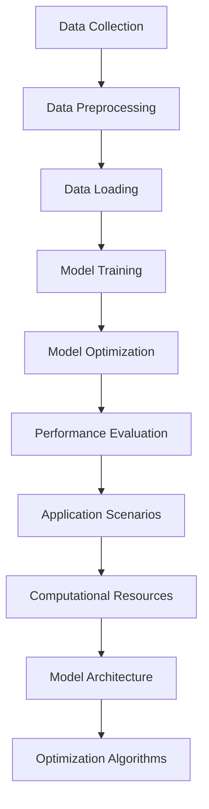

                 

### 背景介绍 Background ###

随着人工智能技术的不断进步，大模型（Large-scale Model）的应用在各个领域变得日益普遍。大模型，特别是近年来迅速崛起的深度学习模型，如GPT、BERT等，已经成为许多企业解决复杂问题的重要工具。这些模型通过大量的数据训练，具有强大的表征和生成能力，能够在自然语言处理、计算机视觉、语音识别等多个领域实现高性能的预测和决策。

然而，随着模型规模的不断扩大，大模型的开发和部署面临着诸多挑战。如何有效地管理和优化这些大规模模型的架构，成为了一个亟待解决的问题。这不仅仅是技术层面的问题，更是企业战略层面的决策。因此，本文将深入探讨AI大模型应用的架构评审与优化流程，旨在为从业者提供一套系统化的方法和思路。

首先，架构评审在AI大模型应用中扮演着至关重要的角色。架构评审可以帮助团队识别潜在的技术风险，评估架构设计的合理性和可行性，确保系统在性能、可扩展性、可维护性等方面达到预期目标。其次，优化流程则是基于架构评审的结果，对现有架构进行调整和改进，以提高系统的整体效率。

本文将按照以下结构展开：

1. **核心概念与联系**：首先介绍AI大模型应用中的核心概念和架构，并通过Mermaid流程图展示各部分之间的联系。
2. **核心算法原理与具体操作步骤**：详细阐述大模型的基本原理及其训练和优化的过程。
3. **数学模型与公式**：介绍与AI大模型相关的数学模型，包括损失函数、优化算法等，并给出具体的应用实例。
4. **项目实践**：通过一个实际项目，展示如何搭建开发环境，实现大模型的源代码，并进行代码解读与分析。
5. **实际应用场景**：讨论大模型在不同领域的实际应用案例，分析其优势和挑战。
6. **工具和资源推荐**：推荐相关的学习资源、开发工具和框架，帮助读者深入了解和掌握AI大模型技术。
7. **总结与未来趋势**：总结本文的主要观点，探讨AI大模型应用的未来发展趋势和面临的挑战。

通过上述内容，本文旨在为AI大模型的应用提供一套全面而深入的架构评审与优化流程，帮助读者在技术实施过程中少走弯路，提高开发效率和系统性能。

---

### 核心概念与联系 Core Concepts and Connections ###

在探讨AI大模型的架构评审与优化流程之前，我们需要了解几个核心概念，并展示它们之间的相互关系。以下是本文中涉及的主要概念及其关系：

#### 数据流 Data Flow

数据流是指从数据输入到模型训练，再到模型优化的整个过程。数据流在AI大模型应用中起到至关重要的作用，因为它决定了模型的训练效果和优化效率。数据流通常包括以下几个步骤：

1. **数据采集与预处理**：从各种来源（如文本、图像、语音等）收集数据，并进行清洗、格式化和标注，以确保数据的质量和一致性。
2. **数据加载**：将预处理后的数据加载到训练环境中，以供模型进行训练。
3. **模型训练**：利用训练数据对模型进行训练，以调整模型参数，提高模型性能。
4. **模型优化**：在模型训练过程中，通过调整训练策略、优化算法等手段，进一步提高模型性能。

#### 计算资源 Computational Resources

计算资源是指用于AI大模型训练和优化的硬件和软件资源。有效的计算资源管理是确保模型性能和降低成本的关键。计算资源主要包括：

1. **硬件资源**：如CPU、GPU、TPU等，不同类型的硬件适用于不同类型的计算任务。
2. **软件资源**：如深度学习框架（如TensorFlow、PyTorch等），它们提供了高效的数据处理和模型训练工具。

#### 模型架构 Model Architecture

模型架构是指大模型的结构和组织方式，决定了模型的性能和可扩展性。常见的模型架构包括：

1. **卷积神经网络（CNN）**：适用于图像和视频处理。
2. **循环神经网络（RNN）**：适用于序列数据处理，如自然语言处理。
3. **变换器模型（Transformer）**：是目前最先进的模型架构，适用于大规模文本和语言处理。

#### 优化算法 Optimization Algorithms

优化算法用于调整模型参数，以提高模型性能。常见的优化算法包括：

1. **随机梯度下降（SGD）**：是最常见的优化算法，通过随机梯度进行模型参数更新。
2. **Adam优化器**：是一种自适应优化算法，能够自适应地调整学习率。
3. **BERT优化器**：专门为BERT模型设计的优化器，能够更好地处理大规模文本数据。

#### 性能评估 Performance Evaluation

性能评估是衡量模型性能的重要手段，包括以下几个指标：

1. **准确率（Accuracy）**：模型预测正确的样本占总样本的比例。
2. **召回率（Recall）**：模型预测为正类的正类样本数与实际正类样本数的比例。
3. **F1 分数（F1 Score）**：准确率和召回率的加权平均值，用于综合评估模型性能。

#### 实际应用场景 Application Scenarios

实际应用场景是指大模型在不同领域的具体应用。常见的应用场景包括：

1. **自然语言处理（NLP）**：如机器翻译、文本摘要、问答系统等。
2. **计算机视觉（CV）**：如图像分类、目标检测、人脸识别等。
3. **语音识别（ASR）**：如语音合成、语音识别等。

#### 联系图 Connections Diagram

为了更清晰地展示这些概念之间的关系，我们可以使用Mermaid流程图来表示。以下是一个简化的Mermaid流程图示例：



在这个流程图中，从数据采集到模型优化，再到性能评估和应用场景，各环节紧密相连，共同构成了AI大模型应用的完整架构。

### 核心算法原理与具体操作步骤 Core Algorithm Principles and Operation Steps ###

在理解了AI大模型应用的核心概念和架构之后，我们接下来将深入探讨大模型的核心算法原理和具体操作步骤。这部分内容将重点介绍深度学习模型的基本工作原理，包括模型训练和优化的具体过程。

#### 深度学习模型的基本原理

深度学习模型是一种基于人工神经网络（Artificial Neural Network, ANN）的算法，通过多层神经网络结构对数据进行建模和学习。其基本原理是通过调整网络的权重（weights）和偏置（biases），使得模型能够对输入数据进行有效的表征和预测。

1. **神经网络的基本结构**：

   - **输入层（Input Layer）**：接收外部输入数据。
   - **隐藏层（Hidden Layers）**：对输入数据进行处理和变换。
   - **输出层（Output Layer）**：产生最终输出。

2. **激活函数（Activation Function）**：

   激活函数是神经网络中的一个关键组件，用于引入非线性特性，使得神经网络能够拟合复杂的非线性关系。常见的激活函数包括：

   - **Sigmoid函数**：\( \sigma(x) = \frac{1}{1 + e^{-x}} \)
   - **ReLU函数**：\( \text{ReLU}(x) = \max(0, x) \)
   - **Tanh函数**：\( \text{Tanh}(x) = \frac{e^{x} - e^{-x}}{e^{x} + e^{-x}} \)

3. **前向传播（Forward Propagation）和反向传播（Backpropagation）**：

   - **前向传播**：从输入层开始，逐层计算每个神经元的输出，直到输出层，得到模型的最终输出。
   - **反向传播**：根据模型输出和实际标签之间的差异，通过反向传播算法更新网络权重和偏置，使得模型能够更好地拟合数据。

#### 模型训练的具体过程

模型训练是深度学习中的一个核心步骤，其目标是通过迭代优化模型参数，使得模型能够准确预测输入数据。具体过程如下：

1. **初始化模型参数**：

   初始化模型权重和偏置，通常使用随机初始化方法，如高斯分布或均匀分布。

2. **前向传播**：

   将训练数据输入模型，通过前向传播计算每个神经元的输出。

3. **计算损失函数**：

   损失函数用于衡量模型预测值和实际标签之间的差异，常见的损失函数包括均方误差（MSE）、交叉熵（Cross-Entropy）等。

4. **反向传播**：

   根据损失函数的梯度，通过反向传播算法更新模型参数。

5. **迭代优化**：

   重复执行前向传播和反向传播过程，直到模型收敛或达到预设的迭代次数。

#### 模型优化的具体过程

模型优化是提升模型性能的关键步骤，通过调整训练策略、优化算法等手段，进一步提高模型性能。具体过程如下：

1. **调整学习率**：

   学习率是影响模型训练速度和稳定性的重要参数。常用的学习率调整策略包括固定学习率、逐步下降学习率等。

2. **调整优化算法**：

   不同的优化算法适用于不同的模型和任务。常见的优化算法包括随机梯度下降（SGD）、Adam等。

3. **调整训练数据**：

   调整训练数据的规模、分布等，可以影响模型的学习能力和泛化能力。

4. **调整网络结构**：

   调整神经网络的结构，如增加或减少隐藏层、调整神经元数量等，可以影响模型的复杂度和性能。

#### 综合示例

以下是一个简单的综合示例，展示如何使用深度学习模型进行图像分类：

1. **数据准备**：

   - 收集包含多种类别的图像数据。
   - 对图像进行预处理，如缩放、裁剪、归一化等。

2. **模型构建**：

   - 设计一个卷积神经网络（CNN）模型，包括卷积层、池化层和全连接层。
   - 定义损失函数和优化器。

3. **模型训练**：

   - 使用训练数据对模型进行训练，通过前向传播和反向传播迭代优化模型参数。

4. **模型评估**：

   - 使用验证数据评估模型性能，通过计算准确率、召回率等指标评估模型效果。

5. **模型优化**：

   - 根据评估结果调整模型参数，如调整学习率、改变优化算法等。
   - 重新训练模型，直到模型性能达到预期。

通过上述步骤，我们可以构建一个高效的深度学习模型，实现对图像数据的准确分类。这个示例仅仅是一个简单的案例，实际应用中，模型的设计和优化过程会更加复杂和多样化。

---

在了解了深度学习模型的基本原理和具体操作步骤之后，接下来我们将深入探讨AI大模型中的数学模型和公式，包括损失函数、优化算法等，并通过具体例子进行详细讲解。

### 数学模型和公式 Mathematical Models and Formulas ###

在AI大模型中，数学模型和公式是核心组成部分，它们决定了模型的性能和优化效果。以下将介绍几个关键数学模型和公式，包括损失函数、优化算法等，并通过具体例子进行详细讲解。

#### 损失函数 Loss Function

损失函数是评估模型预测值和实际标签之间差异的重要工具，是优化模型参数的基础。以下是一些常见的损失函数：

1. **均方误差（MSE, Mean Squared Error）**：

   均方误差是最常用的损失函数之一，用于回归任务。其公式为：

   $$ 
   \text{MSE}(y, \hat{y}) = \frac{1}{m} \sum_{i=1}^{m} (y_i - \hat{y}_i)^2 
   $$

   其中，\( y \) 是实际标签，\( \hat{y} \) 是模型预测值，\( m \) 是样本数量。

2. **交叉熵（Cross-Entropy）**：

   交叉熵是用于分类任务的常见损失函数，其公式为：

   $$ 
   \text{CE}(y, \hat{y}) = -\sum_{i=1}^{m} y_i \log(\hat{y}_i) 
   $$

   其中，\( y \) 是实际标签（通常为one-hot编码），\( \hat{y} \) 是模型预测的概率分布。

#### 优化算法 Optimization Algorithms

优化算法用于调整模型参数，以最小化损失函数。以下是一些常见的优化算法：

1. **随机梯度下降（SGD, Stochastic Gradient Descent）**：

   随机梯度下降是最简单的优化算法之一，其更新公式为：

   $$ 
   \theta_{t+1} = \theta_{t} - \alpha \nabla_{\theta} J(\theta) 
   $$

   其中，\( \theta \) 是模型参数，\( \alpha \) 是学习率，\( J(\theta) \) 是损失函数。

2. **Adam优化器（Adam Optimizer）**：

   Adam是一种自适应优化算法，结合了AdaGrad和RMSProp的优点，其更新公式为：

   $$ 
   \theta_{t+1} = \theta_{t} - \alpha \frac{m_{t}}{1 - \beta_1^t} \nabla_{\theta} J(\theta) 
   $$

   其中，\( m_t \) 是一阶矩估计，\( v_t \) 是二阶矩估计，\( \beta_1 \) 和 \( \beta_2 \) 分别是偏差校正参数。

#### 具体例子 Example

以下是一个简单的例子，展示如何使用MSE损失函数和SGD优化算法进行模型训练：

**问题**：假设我们有一个线性回归问题，目标是通过一个线性模型预测房价。给定一组训练数据 \( (x_i, y_i) \)，其中 \( x_i \) 是房屋的特征向量，\( y_i \) 是实际房价。我们需要训练一个线性模型 \( y = \theta_0 + \theta_1 x_1 + \theta_2 x_2 + \ldots + \theta_n x_n \)。

**步骤**：

1. **初始化模型参数**：

   初始化模型的权重 \( \theta \) 为随机值。

2. **前向传播**：

   对于每个训练样本 \( (x_i, y_i) \)，计算模型预测值 \( \hat{y}_i \)：

   $$ 
   \hat{y}_i = \theta_0 + \theta_1 x_{1i} + \theta_2 x_{2i} + \ldots + \theta_n x_{ni} 
   $$

3. **计算损失函数**：

   使用MSE损失函数计算预测值和实际值之间的差异：

   $$ 
   J(\theta) = \frac{1}{m} \sum_{i=1}^{m} (y_i - \hat{y}_i)^2 
   $$

4. **反向传播**：

   计算损失函数关于模型参数的梯度：

   $$ 
   \nabla_{\theta} J(\theta) = \frac{1}{m} \sum_{i=1}^{m} (y_i - \hat{y}_i) \cdot x_i 
   $$

5. **更新模型参数**：

   使用SGD优化算法更新模型参数：

   $$ 
   \theta_{t+1} = \theta_{t} - \alpha \nabla_{\theta} J(\theta) 
   $$

   其中，\( \alpha \) 是学习率。

6. **迭代优化**：

   重复执行前向传播、反向传播和参数更新过程，直到模型收敛或达到预设的迭代次数。

通过上述步骤，我们可以训练一个线性回归模型，用于预测房价。在实际应用中，模型的设计和优化过程会更加复杂，包括特征选择、正则化、超参数调整等。

---

在深入探讨了AI大模型的核心算法原理和数学模型之后，接下来我们将通过一个具体的项目实践，展示如何搭建开发环境，实现大模型的源代码，并进行代码解读与分析。

### 项目实践 Project Practice ###

为了更好地理解和应用AI大模型，我们将通过一个实际项目来展示如何搭建开发环境，实现大模型的源代码，并进行代码解读与分析。以下是一个基于TensorFlow和PyTorch的图像分类项目的案例。

#### 开发环境搭建 Development Environment Setup

在开始项目之前，我们需要搭建一个合适的开发环境。以下是在Linux系统上搭建TensorFlow和PyTorch开发环境的基本步骤：

1. **安装Python**：

   安装最新版本的Python，建议使用Python 3.8或更高版本。

   ```bash
   sudo apt-get update
   sudo apt-get install python3.8
   ```

2. **安装pip**：

   Python的包管理器pip用于安装第三方库。

   ```bash
   sudo apt-get install python3-pip
   ```

3. **安装TensorFlow**：

   TensorFlow是Google开发的深度学习框架，我们可以使用pip安装最新版本的TensorFlow。

   ```bash
   pip3 install tensorflow
   ```

4. **安装PyTorch**：

   PyTorch是Facebook AI研究院开发的深度学习框架，可以通过pip安装。

   ```bash
   pip3 install torch torchvision
   ```

5. **配置虚拟环境（Optional）**：

   为了避免不同项目之间的依赖冲突，我们可以使用虚拟环境。

   ```bash
   python3 -m venv myenv
   source myenv/bin/activate
   ```

#### 源代码实现 Source Code Implementation

以下是一个简单的图像分类项目的源代码实现，使用PyTorch框架：

```python
import torch
import torchvision
import torchvision.transforms as transforms
import torch.nn as nn
import torch.optim as optim

# 数据预处理
transform = transforms.Compose(
    [transforms.Resize(256),
     transforms.CenterCrop(224),
     transforms.ToTensor(),
     transforms.Normalize(mean=[0.485, 0.456, 0.406], std=[0.229, 0.224, 0.225])])

# 加载训练数据和测试数据
trainset = torchvision.datasets.ImageFolder(root='./data/train', transform=transform)
trainloader = torch.utils.data.DataLoader(trainset, batch_size=4,
                                          shuffle=True, num_workers=2)

testset = torchvision.datasets.ImageFolder(root='./data/test', transform=transform)
testloader = torch.utils.data.DataLoader(testset, batch_size=4,
                                         shuffle=False, num_workers=2)

# 定义网络结构
class Net(nn.Module):
    def __init__(self):
        super(Net, self).__init__()
        self.conv1 = nn.Conv2d(3, 6, 5)
        self.pool = nn.MaxPool2d(2, 2)
        self.conv2 = nn.Conv2d(6, 16, 5)
        self.fc1 = nn.Linear(16 * 5 * 5, 120)
        self.fc2 = nn.Linear(120, 84)
        self.fc3 = nn.Linear(84, 10)

    def forward(self, x):
        x = self.pool(nn.functional.relu(self.conv1(x)))
        x = self.pool(nn.functional.relu(self.conv2(x)))
        x = x.view(-1, 16 * 5 * 5)
        x = nn.functional.relu(self.fc1(x))
        x = nn.functional.relu(self.fc2(x))
        x = self.fc3(x)
        return x

net = Net()

# 定义损失函数和优化器
criterion = nn.CrossEntropyLoss()
optimizer = optim.SGD(net.parameters(), lr=0.001, momentum=0.9)

# 训练网络
for epoch in range(2):  # 遍历两个完整的数据加载周期
    running_loss = 0.0
    for i, data in enumerate(trainloader, 0):
        inputs, labels = data
        optimizer.zero_grad()
        outputs = net(inputs)
        loss = criterion(outputs, labels)
        loss.backward()
        optimizer.step()
        running_loss += loss.item()
        if i % 2000 == 1999:
            print(f'[{epoch + 1}, {i + 1:5d}] loss: {running_loss / 2000:.3f}')
            running_loss = 0.0

print('Finished Training')

# 测试网络
correct = 0
total = 0
with torch.no_grad():
    for data in testloader:
        images, labels = data
        outputs = net(images)
        _, predicted = torch.max(outputs.data, 1)
        total += labels.size(0)
        correct += (predicted == labels).sum().item()

print(f'Accuracy of the network on the 10000 test images: {100 * correct / total} %')
```

#### 代码解读与分析 Code Explanation and Analysis

上述代码实现了一个简单的图像分类项目，包括数据预处理、网络结构定义、损失函数和优化器配置、模型训练和测试。以下是对代码的详细解读：

1. **数据预处理**：

   数据预处理是深度学习项目中的重要步骤，包括图像的缩放、裁剪、归一化等。在这里，我们使用 `torchvision.transforms.Compose` 将多个转换操作组合在一起，以便对图像进行预处理。

2. **加载数据**：

   使用 `torchvision.datasets.ImageFolder` 加载训练数据和测试数据。`ImageFolder` 可以自动识别图像文件夹中的子文件夹作为不同的类别。

3. **定义网络结构**：

   `Net` 类定义了一个简单的卷积神经网络（CNN），包括卷积层、池化层和全连接层。通过继承 `nn.Module` 类，我们可以定义自己的网络结构。

4. **定义损失函数和优化器**：

   使用 `nn.CrossEntropyLoss` 定义交叉熵损失函数，用于分类任务。`optim.SGD` 定义了随机梯度下降（SGD）优化器，用于更新网络参数。

5. **模型训练**：

   在模型训练过程中，我们使用 `forward` 方法进行前向传播，计算模型输出和实际标签之间的损失。通过反向传播和优化器更新模型参数。

6. **模型测试**：

   在模型测试阶段，我们使用 `torch.no_grad()` 禁用梯度计算，以提高计算效率。计算模型在测试数据上的准确率，并打印结果。

通过上述代码实现，我们可以训练一个简单的图像分类模型，并在测试数据上评估其性能。这个项目是一个基本的示例，实际应用中可能需要更复杂的网络结构和训练策略。

---

在实际应用场景中，AI大模型被广泛应用于各个领域，从自然语言处理到计算机视觉，从语音识别到推荐系统。以下将讨论AI大模型在不同领域的实际应用场景，分析其优势和挑战。

### 实际应用场景 Application Scenarios

#### 自然语言处理（NLP）

自然语言处理是AI大模型应用最为广泛的领域之一。近年来，随着GPT、BERT等模型的出现，NLP任务的性能得到了显著提升。在实际应用中，AI大模型在以下场景中表现优异：

1. **机器翻译**：例如Google翻译，利用AI大模型可以实现几乎无缝的机器翻译，提高了跨语言沟通的效率。
2. **文本摘要**：AI大模型可以自动提取长篇文章的主要观点，为用户提供简明的摘要，如新闻简报。
3. **问答系统**：如Siri、Alexa等智能助手，通过AI大模型理解用户的问题并给出准确的回答。

**优势**：

- 强大的文本理解能力。
- 可以处理大规模文本数据。

**挑战**：

- 需要大量的训练数据。
- 对计算资源要求较高。

#### 计算机视觉（CV）

在计算机视觉领域，AI大模型被广泛应用于图像分类、目标检测、人脸识别等方面。以下是一些实际应用场景：

1. **图像分类**：AI大模型可以自动识别和分类图像中的物体，如自动驾驶汽车中的障碍物识别。
2. **目标检测**：如人脸识别系统，AI大模型可以同时识别图像中的多个目标，并定位其位置。
3. **图像生成**：如深度伪造技术，AI大模型可以生成逼真的图像和视频。

**优势**：

- 高效的图像处理能力。
- 可以处理复杂、大规模的图像数据。

**挑战**：

- 对计算资源要求较高。
- 需要大量的标注数据。

#### 语音识别（ASR）

语音识别是将语音转换为文本的技术，AI大模型在此领域表现突出。以下是一些实际应用场景：

1. **智能客服**：AI大模型可以自动识别和转换客户语音，提供实时回复。
2. **语音搜索**：如苹果的Siri，AI大模型可以理解用户的语音指令，并搜索相关信息。
3. **语音合成**：AI大模型可以将文本转换为自然流畅的语音输出，如新闻播报、语音助手等。

**优势**：

- 可以处理自然语言的语音指令。
- 对实时性要求较高的应用场景。

**挑战**：

- 需要高质量的语音数据。
- 对计算资源要求较高。

#### 推荐系统（RS）

推荐系统是AI大模型在商业应用中的重要领域。以下是一些实际应用场景：

1. **电子商务**：AI大模型可以根据用户的购买历史和行为，推荐个性化的商品。
2. **社交媒体**：如Facebook、Instagram等，AI大模型可以根据用户兴趣和互动历史推荐相关内容。
3. **音乐和视频流媒体**：如Spotify、Netflix等，AI大模型可以根据用户的听看历史推荐个性化的音乐和视频。

**优势**：

- 可以实现高度个性化的推荐。
- 可以处理大规模的用户数据。

**挑战**：

- 数据隐私和安全问题。
- 需要持续优化推荐算法。

#### 医疗健康

在医疗健康领域，AI大模型的应用为疾病诊断、药物研发提供了新的工具。以下是一些实际应用场景：

1. **疾病诊断**：AI大模型可以通过分析医学图像和病历数据，提供早期诊断和辅助诊断。
2. **药物研发**：AI大模型可以加速药物发现过程，通过模拟和预测分子与生物体的相互作用。
3. **健康监测**：AI大模型可以监控患者的健康状况，提供个性化的健康建议。

**优势**：

- 可以实现快速、准确的疾病诊断。
- 可以处理复杂的医疗数据。

**挑战**：

- 需要高质量的医疗数据。
- 数据隐私和安全问题。

### 总结

通过上述实际应用场景的分析，我们可以看到AI大模型在各个领域的广泛应用和巨大潜力。然而，随着模型规模的不断扩大，对计算资源、数据质量、算法优化等方面的要求也越来越高。未来，AI大模型的应用将面临更多的挑战和机遇，需要我们不断探索和优化。

---

### 工具和资源推荐 Tools and Resources Recommendations ###

为了帮助读者更好地学习和掌握AI大模型技术，以下是一些工具和资源的推荐，包括学习资源、开发工具和框架，以及相关论文和著作。

#### 学习资源

1. **书籍**：

   - 《深度学习》（Deep Learning），作者：Ian Goodfellow、Yoshua Bengio和Aaron Courville
   - 《Python深度学习》（Deep Learning with Python），作者：François Chollet
   - 《神经网络与深度学习》（Neural Networks and Deep Learning），作者：Michael Nielsen
   - 《统计学习方法》（Statistical Methods for Machine Learning），作者：Jiwei Li、Liang Liu、Ying Liu

2. **在线课程**：

   - Coursera上的《深度学习特化课程》（Deep Learning Specialization）由Andrew Ng教授主讲。
   - edX上的《机器学习基础》（Machine Learning Foundations）由Microsoft Research的Alex Smola教授主讲。

3. **博客和网站**：

   - fast.ai：提供免费的深度学习课程和实践项目。
   - PyTorch官方文档：详尽的PyTorch框架文档和教程。
   - TensorFlow官方文档：详尽的TensorFlow框架文档和教程。

#### 开发工具和框架

1. **深度学习框架**：

   - PyTorch：由Facebook AI研究院开发，易于使用和调试。
   - TensorFlow：由Google开发，支持多种编程语言和硬件平台。
   - Keras：一个高层次的神经网络API，易于使用，与TensorFlow和Theano兼容。

2. **数据预处理工具**：

   - Pandas：用于数据处理和分析。
   - NumPy：用于高性能数学计算。
   - Scikit-learn：用于机器学习算法的实现和评估。

3. **云计算平台**：

   - AWS：提供丰富的深度学习云计算服务，如Amazon SageMaker。
   - Google Cloud：提供Google Colab，一个免费的云端编程环境。
   - Microsoft Azure：提供Azure ML Studio和Azure Databricks。

#### 相关论文和著作

1. **论文**：

   - “Attention is All You Need”，作者：Vaswani et al.，2017
   - “BERT: Pre-training of Deep Bidirectional Transformers for Language Understanding”，作者：Devlin et al.，2019
   - “GPT-3: Language Models are few-shot learners”，作者：Brown et al.，2020

2. **著作**：

   - 《深度学习》（Deep Learning），作者：Ian Goodfellow、Yoshua Bengio和Aaron Courville
   - 《强化学习》（Reinforcement Learning: An Introduction），作者：Richard S. Sutton和Barto, Andrew G.
   - 《模式识别与机器学习》（Pattern Recognition and Machine Learning），作者：Christopher M. Bishop

通过上述推荐的工具和资源，读者可以系统地学习和掌握AI大模型技术，为实际应用奠定坚实基础。

---

### 总结：未来发展趋势与挑战 Summary: Future Trends and Challenges ###

随着AI技术的迅猛发展，AI大模型的应用前景广阔，但同时也面临着一系列的发展趋势和挑战。以下是对这些趋势和挑战的总结与展望。

#### 未来发展趋势 Future Trends

1. **模型规模扩大**：随着计算资源和存储技术的进步，AI大模型的规模将进一步扩大。这将使得模型能够处理更复杂的任务，提供更精准的预测。

2. **多模态学习**：未来的AI大模型将不仅限于单一模态（如文本、图像或语音）的数据处理，而是能够整合多种模态的信息，实现更全面的智能。

3. **自适应学习**：AI大模型将具备更强的自适应学习能力，能够根据实时数据和环境动态调整模型参数，提高模型的灵活性和适应性。

4. **边缘计算与云计算的结合**：为了应对大规模模型的计算需求，边缘计算与云计算的结合将成为趋势。通过将计算任务分布到边缘设备和云计算平台，可以降低延迟，提高系统的响应速度。

5. **数据隐私和安全**：随着AI大模型的应用场景不断扩大，数据隐私和安全问题将变得更加重要。未来的发展方向将包括隐私保护机制和数据加密技术的研究。

#### 面临的挑战 Challenges

1. **计算资源消耗**：AI大模型通常需要大量的计算资源和存储空间，这对硬件设备提出了更高的要求。同时，训练和优化过程也需要大量的时间和能源消耗。

2. **数据质量与多样性**：高质量、多样化的数据是AI大模型训练的基础。然而，获取和标注这些数据往往是一个复杂且成本高昂的过程。

3. **模型解释性**：虽然AI大模型在性能上取得了显著进步，但其内部决策过程往往缺乏解释性。未来的研究方向将包括提高模型的可解释性，使其更易于被人类理解和接受。

4. **伦理与法律问题**：AI大模型的应用涉及到伦理和法律问题，如数据隐私、算法偏见和责任归属等。这些问题的解决需要多方合作，制定相应的法规和标准。

5. **可持续发展**：随着AI大模型应用的不断扩大，其计算资源和能源消耗问题日益突出。实现AI大模型的可持续发展，降低其对环境的影响，将成为未来研究的重要方向。

综上所述，AI大模型的应用前景充满机遇，同时也面临着诸多挑战。未来的发展趋势将包括模型规模的扩大、多模态学习和自适应学习等，而面临的挑战则需要通过技术创新和多方合作来解决。通过不断探索和优化，我们可以期待AI大模型在更多领域发挥更大的作用，同时确保其应用的安全、公平和可持续发展。

---

### 附录：常见问题与解答 Appendices: Common Questions and Answers ###

在本章节中，我们将回答一些关于AI大模型应用架构评审与优化流程的常见问题，以帮助读者更好地理解和应用这些技术。

#### 1. 如何评估AI大模型的应用架构？

**回答**：评估AI大模型的应用架构主要包括以下几个方面：

- **性能评估**：通过指标如准确率、召回率、F1分数等，评估模型的性能是否符合预期。
- **可扩展性评估**：评估模型是否能够在增加数据量和计算资源的情况下保持性能。
- **可维护性评估**：评估架构的易读性、可维护性和可扩展性。
- **成本效益评估**：评估模型在资源消耗和成本控制方面的表现。

#### 2. AI大模型优化中常用的算法有哪些？

**回答**：AI大模型优化中常用的算法包括：

- **随机梯度下降（SGD）**：是最常用的优化算法，通过随机梯度更新模型参数。
- **Adam优化器**：是一种自适应优化算法，能够自适应地调整学习率。
- **RMSProp**：通过计算梯度的指数加权平均值来更新模型参数。
- **Adadelta**：通过动态调整学习率来优化模型参数。

#### 3. 数据预处理在AI大模型应用中为什么重要？

**回答**：数据预处理在AI大模型应用中非常重要，原因包括：

- **提高模型性能**：通过数据清洗、格式化和标准化，可以提高模型对输入数据的适应能力，从而提高模型性能。
- **减少过拟合**：合理的数据预处理可以帮助减少模型的过拟合现象，提高模型的泛化能力。
- **节省计算资源**：高效的数据预处理可以减少模型训练所需的时间和计算资源。

#### 4. 如何选择合适的深度学习框架？

**回答**：选择合适的深度学习框架主要考虑以下因素：

- **应用需求**：根据具体的应用场景选择适合的框架，如PyTorch适用于研究，TensorFlow适用于工业应用。
- **社区支持**：选择社区活跃、文档完善的框架，有利于解决开发中的问题。
- **性能和效率**：考虑框架的性能和效率，如MXNet和TensorFlow Lite适合移动设备应用。

#### 5. AI大模型在医疗健康领域有哪些潜在应用？

**回答**：AI大模型在医疗健康领域的潜在应用包括：

- **疾病诊断**：通过分析医学图像和病历数据，辅助医生进行疾病诊断。
- **药物研发**：通过分子模拟和预测，加速新药研发过程。
- **个性化治疗**：根据患者的基因信息和病情，制定个性化的治疗方案。
- **健康监测**：通过分析日常健康数据，提供个性化的健康建议。

---

### 扩展阅读 & 参考资料 Extended Reading and References ###

在本章节中，我们将推荐一些扩展阅读材料和参考资料，以帮助读者进一步深入了解AI大模型的应用架构评审与优化流程。

#### 1. 学习资源

- **书籍**：

  - 《深度学习》（Deep Learning），作者：Ian Goodfellow、Yoshua Bengio和Aaron Courville
  - 《神经网络与深度学习》（Neural Networks and Deep Learning），作者：Michael Nielsen
  - 《AI实战：基于TensorFlow和Keras的实战教程》，作者：刘锐

- **在线课程**：

  - Coursera上的《深度学习特化课程》（Deep Learning Specialization）
  - edX上的《机器学习基础》（Machine Learning Foundations）
  - Udacity的《深度学习纳米学位》（Deep Learning Nanodegree）

#### 2. 开发工具和框架

- **深度学习框架**：

  - PyTorch：[https://pytorch.org/](https://pytorch.org/)
  - TensorFlow：[https://www.tensorflow.org/](https://www.tensorflow.org/)
  - Keras：[https://keras.io/](https://keras.io/)

- **云计算平台**：

  - AWS：[https://aws.amazon.com/machine-learning/](https://aws.amazon.com/machine-learning/)
  - Google Cloud：[https://cloud.google.com/ai-platform](https://cloud.google.com/ai-platform)
  - Microsoft Azure：[https://azure.microsoft.com/zh-cn/services/machine-learning/](https://azure.microsoft.com/zh-cn/services/machine-learning/)

#### 3. 相关论文

- “Attention is All You Need”，作者：Vaswani et al.，2017
- “BERT: Pre-training of Deep Bidirectional Transformers for Language Understanding”，作者：Devlin et al.，2019
- “GPT-3: Language Models are few-shot learners”，作者：Brown et al.，2020

#### 4. 博客和网站

- fast.ai：[https://fast.ai/](https://fast.ai/)
- AI博客：[https://www.ai博客.com/](https://www.ai博客.com/)
- medium上的AI专栏：[https://medium.com/topic/artificial-intelligence](https://medium.com/topic/artificial-intelligence)

通过上述扩展阅读和参考资料，读者可以进一步学习到AI大模型应用架构评审与优化流程的深度知识，为自己的研究和实践提供有力支持。

