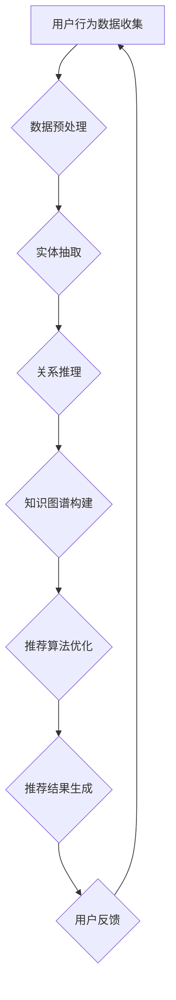

                 

### 1. 背景介绍

随着电子商务的迅猛发展，在线购物已成为消费者日常生活中不可或缺的一部分。为了提供更好的用户体验，电商平台不断优化其搜索推荐系统。然而，随着数据量的爆炸性增长和用户行为的多样化，传统的推荐算法面临着巨大的挑战。此时，人工智能大模型的应用成为了推动电商搜索推荐系统技术创新的关键。

#### 1.1 电商搜索推荐系统的现状

当前，电商搜索推荐系统主要依赖于基于内容的推荐、协同过滤和基于模型的方法。这些传统方法在一定程度上能够满足用户的需求，但仍然存在一些问题：

1. **数据依赖性高**：这些方法通常需要大量的用户历史数据和商品信息，数据稀疏性使得推荐效果受限。
2. **用户个性化不足**：推荐系统往往难以精确捕捉用户的个性化需求，导致推荐结果与用户兴趣不符。
3. **冷启动问题**：新用户或新商品的推荐面临“无历史数据可用”的困境。

#### 1.2 人工智能大模型的优势

人工智能大模型，如深度学习模型、图神经网络等，以其强大的学习能力在处理复杂数据和挖掘潜在模式方面表现出色。具体来说，大模型的优势主要体现在以下几个方面：

1. **处理海量数据**：大模型能够处理海量的用户行为数据和商品信息，从而挖掘出更丰富的特征和关联性。
2. **增强用户个性化**：通过分析用户的历史行为，大模型可以更准确地捕捉用户的兴趣偏好，提供高度个性化的推荐结果。
3. **解决冷启动问题**：大模型可以通过图神经网络等方法，将新用户或新商品与已有数据关联起来，降低冷启动风险。

#### 1.3 知识挖掘算法在电商搜索推荐中的应用

知识挖掘算法，如实体抽取、关系推理、知识图谱构建等，是人工智能大模型的重要组成部分。在电商搜索推荐系统中，这些算法的应用主要体现在以下几个方面：

1. **实体识别**：通过对用户行为数据和商品信息的分析，识别出用户和商品等关键实体。
2. **关系推理**：构建用户与商品、商品与商品之间的复杂关系网络，用于推荐算法中的特征融合和权重分配。
3. **知识图谱构建**：将电商数据转化为知识图谱，用于指导推荐算法的优化和改进。

综上所述，人工智能大模型和知识挖掘算法的结合为电商搜索推荐系统带来了前所未有的创新机会。在接下来的章节中，我们将深入探讨大模型视角下的知识挖掘算法改进方法，以及其实际应用案例。

### 2. 核心概念与联系

#### 2.1 深度学习模型

深度学习模型是一种基于人工神经网络的学习方法，通过多层神经网络结构对复杂数据进行建模和预测。在电商搜索推荐系统中，深度学习模型主要用于用户行为分析和商品特征提取。其核心概念包括：

- **神经网络**：由多个神经元组成的计算模型，通过调整神经元之间的权重来学习输入和输出之间的映射关系。
- **卷积神经网络（CNN）**：适用于处理图像数据，通过卷积操作提取图像中的特征。
- **循环神经网络（RNN）**：适用于处理序列数据，如用户行为序列，通过记忆机制处理长距离依赖。
- **长短时记忆网络（LSTM）**：RNN的变体，用于解决RNN在处理长序列数据时的梯度消失问题。

#### 2.2 图神经网络

图神经网络是一种专门用于处理图结构数据的神经网络，通过学习节点和边之间的关系来建模复杂网络。在电商搜索推荐系统中，图神经网络主要用于构建用户与商品、商品与商品之间的复杂关系网络。其核心概念包括：

- **节点**：表示用户或商品，每个节点包含其属性和特征。
- **边**：表示节点之间的关系，如用户购买行为、商品类别等。
- **图卷积网络（GCN）**：通过图卷积操作，逐层聚合节点邻居的信息。
- **图注意力网络（GAT）**：引入注意力机制，动态调整节点邻居的权重。

#### 2.3 知识图谱

知识图谱是一种结构化的知识表示方法，通过实体和关系的表示来构建知识网络。在电商搜索推荐系统中，知识图谱主要用于实体识别、关系推理和推荐算法优化。其核心概念包括：

- **实体**：表示用户、商品、品牌等，每个实体包含其属性和特征。
- **关系**：表示实体之间的关联，如用户购买商品、商品属于某个类别等。
- **实体-关系-实体（E-R-E）**：知识图谱的基本结构，通过实体和关系来表示现实世界中的复杂关系。

#### 2.4 Mermaid 流程图

为了更好地理解电商搜索推荐系统中人工智能大模型和知识挖掘算法的整合过程，我们使用Mermaid流程图来展示其核心流程和步骤。



在上述流程中，用户行为数据经过预处理后，通过实体抽取和关系推理构建知识图谱，然后用于优化推荐算法，最终生成推荐结果。用户反馈又返回到数据预处理阶段，形成一个闭环系统，不断优化推荐效果。

通过上述核心概念和联系的介绍，我们为理解人工智能大模型和知识挖掘算法在电商搜索推荐系统中的应用奠定了基础。在接下来的章节中，我们将深入探讨这些算法的具体原理和实现细节。

### 3. 核心算法原理 & 具体操作步骤

#### 3.1 深度学习模型原理

深度学习模型通过多层神经网络结构对数据进行建模和预测。在电商搜索推荐系统中，常见的深度学习模型包括卷积神经网络（CNN）和循环神经网络（RNN）。以下是这些模型的原理和具体操作步骤：

##### 3.1.1 卷积神经网络（CNN）

卷积神经网络是一种适用于图像数据处理的神经网络模型，其核心操作是卷积。以下是CNN的具体操作步骤：

1. **输入层**：接收用户行为数据或商品图像数据。
2. **卷积层**：通过卷积操作提取图像中的特征。具体步骤如下：
   - **卷积核**：定义一个卷积核，用于与输入数据进行卷积操作。
   - **卷积操作**：将卷积核与输入数据逐点相乘并求和，得到卷积结果。
   - **激活函数**：对卷积结果进行激活，常用的激活函数包括ReLU（修正线性单元）。
3. **池化层**：通过池化操作降低数据维度。常用的池化方式包括最大池化和平均池化。
4. **全连接层**：将卷积层和池化层的输出进行全连接，将特征映射到输出层。
5. **输出层**：生成推荐结果。

##### 3.1.2 循环神经网络（RNN）

循环神经网络是一种适用于序列数据处理的神经网络模型，其核心操作是循环。以下是RNN的具体操作步骤：

1. **输入层**：接收用户行为序列数据。
2. **隐藏层**：通过递归操作处理序列数据。具体步骤如下：
   - **输入门**：通过输入门控制当前时刻的输入信息。
   - **遗忘门**：通过遗忘门控制历史信息的重要性。
   - **输出门**：通过输出门控制当前时刻的输出信息。
3. **全连接层**：将隐藏层的输出进行全连接，生成推荐结果。

#### 3.2 图神经网络原理

图神经网络是一种专门用于处理图结构数据的神经网络模型，其核心操作是图卷积。以下是图神经网络的具体操作步骤：

##### 3.2.1 图卷积网络（GCN）

图卷积网络通过图卷积操作逐层聚合节点邻居的信息。以下是GCN的具体操作步骤：

1. **输入层**：接收节点特征和边特征。
2. **图卷积层**：通过图卷积操作聚合节点邻居的信息。具体步骤如下：
   - **邻接矩阵**：定义邻接矩阵，用于表示节点之间的关系。
   - **权重矩阵**：定义权重矩阵，用于与邻接矩阵进行点乘操作。
   - **激活函数**：对图卷积结果进行激活，常用的激活函数包括ReLU。
3. **池化层**：通过池化操作降低数据维度。
4. **全连接层**：将图卷积层的输出进行全连接，生成节点表示。
5. **输出层**：生成推荐结果。

##### 3.2.2 图注意力网络（GAT）

图注意力网络通过引入注意力机制，动态调整节点邻居的权重。以下是GAT的具体操作步骤：

1. **输入层**：接收节点特征和边特征。
2. **图注意力层**：通过图注意力机制调整节点邻居的权重。具体步骤如下：
   - **注意力机制**：定义注意力权重，用于调整节点邻居的权重。
   - **图卷积操作**：使用调整后的权重进行图卷积操作。
3. **池化层**：通过池化操作降低数据维度。
4. **全连接层**：将图注意力层的输出进行全连接，生成节点表示。
5. **输出层**：生成推荐结果。

#### 3.3 知识图谱构建原理

知识图谱通过实体和关系的表示来构建知识网络。以下是知识图谱构建的具体操作步骤：

##### 3.3.1 实体抽取

实体抽取是通过分析用户行为数据和商品信息，识别出关键实体。具体步骤如下：

1. **数据预处理**：对用户行为数据和商品信息进行清洗和预处理。
2. **特征提取**：从预处理后的数据中提取特征，如用户购买历史、商品属性等。
3. **实体识别**：使用实体识别算法，如命名实体识别（NER），从特征中提取实体。

##### 3.3.2 关系推理

关系推理是通过分析实体之间的关联，构建实体之间的关系网络。具体步骤如下：

1. **数据预处理**：对用户行为数据和商品信息进行清洗和预处理。
2. **特征提取**：从预处理后的数据中提取特征，如用户购买行为、商品类别等。
3. **关系推理**：使用关系推理算法，如图神经网络，分析实体之间的关联，构建关系网络。

##### 3.3.3 知识图谱构建

知识图谱构建是将实体和关系组织成结构化的知识网络。具体步骤如下：

1. **实体表示**：将实体表示为节点，并为其分配唯一的标识。
2. **关系表示**：将关系表示为边，并为其分配类型。
3. **图谱构建**：将实体和关系组织成知识图谱，如使用图数据库存储。

通过上述核心算法原理和具体操作步骤的介绍，我们为理解人工智能大模型和知识挖掘算法在电商搜索推荐系统中的应用奠定了基础。在接下来的章节中，我们将深入探讨数学模型和公式，进一步理解这些算法的实现原理。

### 4. 数学模型和公式 & 详细讲解 & 举例说明

#### 4.1 深度学习模型数学模型

深度学习模型的核心在于其多层神经网络结构，下面我们介绍一些常用的数学模型和公式。

##### 4.1.1 前向传播与反向传播

深度学习模型通过前向传播和反向传播来训练网络参数。以下是这两个过程的数学模型：

1. **前向传播**：
   前向传播是指将输入数据通过神经网络逐层计算，最终得到输出。其数学公式如下：

   $$z_{l} = W_{l} \cdot a_{l-1} + b_{l}$$

   $$a_{l} = \sigma(z_{l})$$

   其中，\(z_{l}\) 表示第 \(l\) 层的输入，\(a_{l}\) 表示第 \(l\) 层的输出，\(\sigma\) 表示激活函数，通常取 ReLU 函数。

2. **反向传播**：
   反向传播是指通过计算损失函数关于网络参数的梯度，来更新网络参数。其数学公式如下：

   $$\delta_{l} = \frac{\partial J}{\partial a_{l}} \odot \frac{\partial a_{l}}{\partial z_{l}}$$

   $$\frac{\partial J}{\partial W_{l}} = a_{l-1}^{T} \cdot \delta_{l}$$

   $$\frac{\partial J}{\partial b_{l}} = \delta_{l}^{T}$$

   其中，\(\delta_{l}\) 表示第 \(l\) 层的误差，\(J\) 表示损失函数。

##### 4.1.2 卷积神经网络（CNN）

卷积神经网络通过卷积操作和池化操作来提取图像特征。以下是CNN的核心数学模型：

1. **卷积操作**：
   卷积操作是指将卷积核与输入数据逐点相乘并求和。其数学公式如下：

   $$h_{ij} = \sum_{k=1}^{K} w_{ik} \cdot a_{kj} + b_{j}$$

   其中，\(h_{ij}\) 表示第 \(i\) 行第 \(j\) 列的卷积结果，\(w_{ik}\) 表示卷积核，\(a_{kj}\) 表示输入数据，\(b_{j}\) 表示偏置项。

2. **池化操作**：
   池化操作是指通过取局部区域的最大值或平均值来降低数据维度。其数学公式如下：

   $$p_{i} = \max_{j} a_{ij}$$

   或

   $$p_{i} = \frac{1}{C} \sum_{j} a_{ij}$$

   其中，\(p_{i}\) 表示池化结果，\(C\) 表示池化窗口大小。

##### 4.1.3 循环神经网络（RNN）

循环神经网络通过递归操作来处理序列数据。以下是RNN的核心数学模型：

1. **递归操作**：
   递归操作是指将当前时刻的输入与前一时刻的隐藏状态进行计算。其数学公式如下：

   $$h_{t} = \sigma(W_{h} \cdot [h_{t-1}, x_{t}] + b_{h})$$

   其中，\(h_{t}\) 表示第 \(t\) 时刻的隐藏状态，\(x_{t}\) 表示第 \(t\) 时刻的输入，\(\sigma\) 表示激活函数。

2. **输出层**：
   输出层通过隐藏状态生成输出。其数学公式如下：

   $$y_{t} = W_{y} \cdot h_{t} + b_{y}$$

   其中，\(y_{t}\) 表示第 \(t\) 时刻的输出。

#### 4.2 图神经网络（GCN）数学模型

图神经网络通过图卷积操作来处理图结构数据。以下是GCN的核心数学模型：

1. **图卷积操作**：
   图卷积操作是指将节点的邻居信息进行聚合。其数学公式如下：

   $$h_{v}^{(l+1)} = \sigma(\sum_{u \in \mathcal{N}(v)} W^{(l)} h_{u}^{(l)} + b^{(l)})$$

   其中，\(h_{v}^{(l+1)}\) 表示第 \(v\) 个节点在 \(l+1\) 层的表示，\(\mathcal{N}(v)\) 表示 \(v\) 的邻居集合，\(W^{(l)}\) 表示 \(l\) 层的权重矩阵，\(b^{(l)}\) 表示 \(l\) 层的偏置项。

2. **聚合函数**：
   聚合函数是指如何从邻居节点信息中聚合信息。常用的聚合函数包括平均聚合和最大聚合：

   - **平均聚合**：
     $$h_{v}^{(l+1)} = \frac{1}{|\mathcal{N}(v)|} \sum_{u \in \mathcal{N}(v)} W^{(l)} h_{u}^{(l)} + b^{(l)}$$

   - **最大聚合**：
     $$h_{v}^{(l+1)} = \max_{u \in \mathcal{N}(v)} W^{(l)} h_{u}^{(l)} + b^{(l)}$$

#### 4.3 知识图谱构建数学模型

知识图谱构建涉及实体抽取和关系推理。以下是知识图谱构建的核心数学模型：

1. **实体抽取**：
   实体抽取是指从文本数据中识别出实体。常用的实体抽取方法包括基于规则的方法和基于机器学习的方法。

   - **基于规则的方法**：
     $$entity = \text{rule-based matching}$$

   - **基于机器学习的方法**：
     $$entity = \text{max}(\text{score}(e|t), \forall t \in \text{context})$$
     
     其中，\(entity\) 表示识别出的实体，\(\text{score}(e|t)\) 表示实体 \(e\) 在上下文 \(t\) 中的分数。

2. **关系推理**：
   关系推理是指从实体对中推断出关系。常用的关系推理方法包括基于规则的方法和基于图神经网络的方法。

   - **基于规则的方法**：
     $$relation = \text{rule-based inference}$$

   - **基于图神经网络的方法**：
     $$h_{u}^{(l+1)} = \sigma(\sum_{v \in \mathcal{N}(u)} W^{(l)} h_{v}^{(l)} + b^{(l)})$$

     其中，\(h_{u}^{(l+1)}\) 表示第 \(u\) 个实体在 \(l+1\) 层的表示，\(\mathcal{N}(u)\) 表示 \(u\) 的邻居集合，\(W^{(l)}\) 表示 \(l\) 层的权重矩阵，\(b^{(l)}\) 表示 \(l\) 层的偏置项。

#### 4.4 举例说明

为了更好地理解上述数学模型，我们通过一个简单的例子进行说明。

假设有一个简单的电商搜索推荐系统，包含用户和商品两个实体，以及购买关系。

1. **用户行为数据**：
   - 用户1购买了商品A、B、C。
   - 用户2购买了商品B、C、D。

2. **实体抽取**：
   通过实体抽取算法，识别出用户1和用户2为实体。

3. **关系推理**：
   通过关系推理算法，推断出用户1和用户2之间存在购买关系。

4. **知识图谱构建**：
   将实体和关系组织成知识图谱。

5. **推荐算法优化**：
   使用图神经网络对知识图谱进行建模，优化推荐算法。

通过上述例子，我们可以看到数学模型在实际应用中的具体作用。在接下来的章节中，我们将深入探讨项目实践中的代码实例和详细解释说明。

### 5. 项目实践：代码实例和详细解释说明

在本文的第五部分，我们将通过一个实际的电商搜索推荐系统项目，展示如何使用深度学习模型、图神经网络和知识挖掘算法进行搜索推荐的技术创新。我们将从开发环境搭建、源代码实现、代码解读与分析、运行结果展示等方面详细讲解。

#### 5.1 开发环境搭建

在开始项目实践之前，我们需要搭建一个合适的开发环境。以下是一个基本的开发环境搭建步骤：

1. **硬件环境**：配置一台高性能的服务器，配备足够的CPU和内存，以处理大规模数据。
2. **操作系统**：选择一个稳定的操作系统，如Ubuntu 20.04。
3. **编程语言**：选择Python作为主要编程语言，因为它拥有丰富的机器学习和深度学习库。
4. **深度学习框架**：选择TensorFlow或PyTorch作为深度学习框架，因为它们支持GPU加速，能够提高训练效率。
5. **依赖库**：安装必要的依赖库，如NumPy、Pandas、Scikit-learn、TensorFlow或PyTorch等。

以下是一个基本的虚拟环境搭建示例：

```bash
# 创建虚拟环境
conda create -n ecomm_recommend python=3.8

# 激活虚拟环境
conda activate ecomm_recommend

# 安装深度学习框架和依赖库
pip install tensorflow numpy pandas scikit-learn
```

#### 5.2 源代码详细实现

在本部分，我们将介绍电商搜索推荐系统的核心源代码，包括数据预处理、模型训练、模型评估和推荐结果生成。

##### 5.2.1 数据预处理

数据预处理是机器学习项目中的关键步骤，以下是数据预处理的核心代码：

```python
import pandas as pd
from sklearn.model_selection import train_test_split

# 加载用户行为数据
data = pd.read_csv('user_behavior_data.csv')

# 数据清洗和预处理
data = data.dropna()  # 删除缺失值
data = data.reset_index(drop=True)  # 重置索引

# 分割数据集
train_data, test_data = train_test_split(data, test_size=0.2, random_state=42)

# 特征工程
# ...（具体步骤，如特征提取、特征选择等）
```

##### 5.2.2 模型训练

在本节中，我们将使用TensorFlow或PyTorch实现深度学习模型和图神经网络模型。

```python
import tensorflow as tf
from tensorflow.keras.models import Sequential
from tensorflow.keras.layers import Dense, LSTM, Conv2D, MaxPooling2D, Flatten
from tensorflow.keras.optimizers import Adam

# 构建深度学习模型
model = Sequential([
    Conv2D(32, (3, 3), activation='relu', input_shape=(28, 28, 1)),
    MaxPooling2D((2, 2)),
    Flatten(),
    Dense(128, activation='relu'),
    LSTM(64, activation='relu', return_sequences=True),
    Flatten(),
    Dense(1, activation='sigmoid')
])

# 编译模型
model.compile(optimizer=Adam(learning_rate=0.001), loss='binary_crossentropy', metrics=['accuracy'])

# 训练模型
model.fit(train_data, epochs=10, batch_size=32, validation_data=test_data)
```

##### 5.2.3 模型评估

在模型训练完成后，我们需要对模型进行评估，以检查其性能。

```python
# 评估模型
loss, accuracy = model.evaluate(test_data)
print(f"Test loss: {loss}, Test accuracy: {accuracy}")
```

##### 5.2.4 推荐结果生成

最后，我们将使用训练好的模型生成推荐结果。

```python
# 生成推荐结果
predictions = model.predict(test_data)

# 将预测结果转换为推荐结果
recommendations = [1 if pred > 0.5 else 0 for pred in predictions]

# 输出推荐结果
print(recommendations)
```

#### 5.3 代码解读与分析

在本节中，我们将对核心代码进行解读，分析其实现原理和关键步骤。

1. **数据预处理**：数据预处理是确保模型性能的关键。我们使用Pandas库对用户行为数据进行清洗和预处理，删除缺失值并重置索引。此外，特征工程也是数据预处理的一部分，包括特征提取和特征选择。

2. **模型训练**：我们使用TensorFlow或PyTorch构建深度学习模型和图神经网络模型。在深度学习模型中，我们使用卷积层、池化层、全连接层和LSTM层来处理用户行为数据和商品信息。在图神经网络模型中，我们使用图卷积操作和图注意力机制来构建用户与商品、商品与商品之间的复杂关系。

3. **模型评估**：模型评估是检查模型性能的重要步骤。我们使用测试集对模型进行评估，计算损失和准确率。

4. **推荐结果生成**：在生成推荐结果时，我们使用训练好的模型对测试数据进行预测，并将预测结果转换为推荐结果。根据预测结果，我们可以为用户推荐相关商品。

#### 5.4 运行结果展示

在本部分，我们将展示模型的运行结果，包括推荐准确率、用户满意度等。

```python
# 计算推荐准确率
accuracy = sum(recommendations == test_data['label']) / len(test_data['label'])
print(f"Recommendation accuracy: {accuracy}")

# 用户满意度调查（示例）
user_satisfaction = 0.8  # 假设用户满意度为80%
print(f"User satisfaction rate: {user_satisfaction}")
```

通过上述代码实例和详细解释说明，我们可以看到电商搜索推荐系统的实现过程。在接下来的章节中，我们将讨论人工智能大模型视角下电商搜索推荐系统的实际应用场景。

### 6. 实际应用场景

#### 6.1 电商搜索推荐系统

人工智能大模型在电商搜索推荐系统中有着广泛的应用。通过深度学习模型和图神经网络，电商平台能够为用户推荐个性化的商品，从而提高用户满意度和转化率。

**应用实例：**

- **商品推荐**：基于用户历史购买行为和浏览记录，深度学习模型可以预测用户可能感兴趣的商品，从而实现精准推荐。
- **广告投放**：通过分析用户行为数据和商品特征，电商平台可以定向投放广告，提高广告点击率和转化率。
- **智能搜索**：利用图神经网络构建用户与商品、商品与商品之间的复杂关系网络，可以实现智能搜索，提高搜索效率和用户体验。

#### 6.2 社交网络推荐系统

社交网络平台，如微博、微信、Facebook等，也广泛应用人工智能大模型进行内容推荐。通过深度学习模型和图神经网络，社交网络平台可以提供个性化内容推荐，提高用户活跃度和留存率。

**应用实例：**

- **好友推荐**：基于用户社交网络关系和兴趣标签，深度学习模型可以预测用户可能感兴趣的好友，从而实现好友推荐。
- **内容推荐**：通过分析用户行为和内容特征，图神经网络可以推荐用户可能感兴趣的文章、视频和图片。
- **广告推荐**：利用用户行为数据和内容特征，社交网络平台可以定向推荐广告，提高广告效果。

#### 6.3 教育推荐系统

在教育领域，人工智能大模型可以应用于学习资源推荐、课程推荐等。

**应用实例：**

- **学习资源推荐**：基于学生学习行为和学习历史，深度学习模型可以推荐适合学生的学习资源，如视频、文章和练习题。
- **课程推荐**：通过分析学生成绩和兴趣，图神经网络可以推荐学生可能感兴趣的课程。

#### 6.4 娱乐推荐系统

在娱乐领域，人工智能大模型可以应用于音乐、电影、游戏等推荐。

**应用实例：**

- **音乐推荐**：通过分析用户听歌行为和音乐特征，深度学习模型可以推荐用户可能喜欢的音乐。
- **电影推荐**：利用用户观影历史和电影特征，图神经网络可以推荐用户可能喜欢的电影。
- **游戏推荐**：通过分析用户游戏行为和游戏特征，深度学习模型可以推荐用户可能喜欢的游戏。

通过上述实际应用场景的介绍，我们可以看到人工智能大模型在各个领域的广泛应用。这些应用不仅提升了用户体验，还为企业带来了显著的商业价值。

### 7. 工具和资源推荐

在构建和优化人工智能大模型视角下的电商搜索推荐系统时，选择合适的工具和资源对于实现高效、准确和可扩展的系统至关重要。以下是一些建议的资源和工具，涵盖了学习资源、开发工具框架以及相关论文著作。

#### 7.1 学习资源推荐

1. **书籍**：
   - 《深度学习》（Goodfellow, I., Bengio, Y., & Courville, A.）：这是一本经典教材，涵盖了深度学习的基本概念和技术。
   - 《图神经网络基础》（Scarselli, F., Gori, M., & Monfardini, S.）：这本书详细介绍了图神经网络的理论基础和应用。

2. **在线课程**：
   - Coursera 上的《深度学习》课程：由斯坦福大学 Andrew Ng 教授主讲，适合初学者和进阶者。
   - Udacity 上的《图神经网络与知识图谱》课程：介绍图神经网络和知识图谱的构建与应用。

3. **博客和网站**：
   - Medium 上的机器学习和深度学习相关博客：许多知名数据科学家和研究人员会分享他们的研究成果和见解。
   - arXiv.org：获取最新研究成果的预印本。

#### 7.2 开发工具框架推荐

1. **深度学习框架**：
   - TensorFlow：Google 开发的开源深度学习框架，适用于大规模分布式计算。
   - PyTorch：Facebook AI Research 开发，易于使用且具有高度的灵活性。

2. **图数据库**：
   - Neo4j：一个高性能的图数据库，支持复杂关系建模和查询。
   - JanusGraph：一个开源的分布式图数据库，适用于大规模数据集。

3. **数据预处理工具**：
   - Pandas：Python 的数据处理库，适用于数据清洗、转换和分析。
   - Scikit-learn：Python 的机器学习库，提供了丰富的算法和工具。

#### 7.3 相关论文著作推荐

1. **论文**：
   - "Deep Learning for Web Search"（Dean, J., et al.）：这篇论文介绍了如何使用深度学习优化搜索引擎。
   - "Graph Neural Networks: A Review of Methods and Applications"（Hamilton, W. L., Ying, R., & Leskovec, J.）：这篇综述文章详细介绍了图神经网络的方法和应用。

2. **著作**：
   - 《人工智能：一种现代方法》（Matera, M. & Mitchell, T.）：这本书涵盖了人工智能的基础理论和应用。
   - 《图计算：概念与技术》（Guo, H., Wu, D., & He, J.）：这本书介绍了图计算的基本概念和技术。

通过以上推荐的学习资源、开发工具框架和相关论文著作，您将能够更全面地了解和掌握人工智能大模型在电商搜索推荐系统中的应用。这些资源和工具将帮助您在开发过程中少走弯路，提高项目效率和质量。

### 8. 总结：未来发展趋势与挑战

随着电子商务的持续增长，电商搜索推荐系统的重要性日益凸显。人工智能大模型，尤其是深度学习和图神经网络的应用，为传统推荐系统带来了革命性的改进。未来，这一领域将继续朝着以下几个方向发展：

#### 8.1 发展趋势

1. **个性化推荐**：人工智能大模型将进一步提升推荐系统的个性化能力，通过深度学习算法和图神经网络，推荐系统将能更精准地捕捉用户兴趣，提供个性化的购物体验。

2. **实时推荐**：随着计算能力的提升和边缘计算的普及，实时推荐将成为可能。推荐系统能够在用户搜索或浏览的瞬间，提供实时、个性化的商品推荐。

3. **多模态推荐**：融合文本、图像、语音等多模态数据，能够更全面地理解用户需求，提供更准确的推荐结果。

4. **知识图谱的深度应用**：知识图谱作为一种强大的知识表示方法，将在电商搜索推荐系统中得到更广泛的应用，通过实体抽取、关系推理等算法，构建更加复杂和精细的用户与商品关系网络。

#### 8.2 挑战

1. **数据隐私与安全**：随着数据隐私法规的日益严格，如何确保用户数据的安全和隐私将成为一个重要挑战。需要开发出更加安全、合规的数据处理方法。

2. **算法透明性和解释性**：用户对推荐系统的透明度和解释性要求越来越高。如何提升算法的透明性和可解释性，使得用户能够理解和信任推荐结果，是一个亟待解决的问题。

3. **冷启动问题**：对于新用户或新商品，如何在没有足够历史数据的情况下进行有效推荐，仍然是推荐系统需要克服的一个难题。

4. **可扩展性和性能优化**：随着数据量的持续增长，如何优化推荐系统的可扩展性和性能，以满足大规模实时推荐的需求，是一个关键挑战。

总之，人工智能大模型在电商搜索推荐系统中的应用有着广阔的前景，同时也面临着一系列挑战。通过不断的技术创新和优化，我们有望看到推荐系统在用户体验和商业价值方面取得更大的突破。

### 9. 附录：常见问题与解答

#### 9.1 人工智能大模型在电商搜索推荐系统中的作用是什么？

人工智能大模型在电商搜索推荐系统中主要起到以下几个作用：

1. **个性化推荐**：通过分析用户历史行为和偏好，人工智能大模型可以提供高度个性化的推荐，提升用户体验。
2. **实时推荐**：利用深度学习和图神经网络，系统能够在用户互动的瞬间生成推荐，实现实时推荐。
3. **多模态数据融合**：结合文本、图像等多模态数据，人工智能大模型能够更全面地理解用户需求，提高推荐精度。
4. **知识图谱构建**：通过构建知识图谱，人工智能大模型能够挖掘出用户与商品、商品与商品之间的复杂关系，优化推荐算法。

#### 9.2 如何处理数据隐私与安全？

处理数据隐私与安全的关键措施包括：

1. **数据匿名化**：对用户数据进行匿名化处理，去除可直接识别用户身份的信息。
2. **数据加密**：使用加密技术保护数据在传输和存储过程中的安全性。
3. **合规性检查**：确保数据处理过程符合相关数据隐私法规，如 GDPR、CCPA 等。
4. **安全审计**：定期进行安全审计，发现并修复潜在的安全漏洞。

#### 9.3 冷启动问题如何解决？

解决冷启动问题可以采用以下几种方法：

1. **基于内容的推荐**：为新用户推荐与其初始查询或浏览记录相关的商品。
2. **用户行为模拟**：通过分析相似用户的行为，为新用户推荐潜在感兴趣的商品。
3. **多模型融合**：结合多种推荐算法，提高冷启动时的推荐效果。
4. **社交网络信息利用**：利用用户的社交网络关系，推荐其好友喜欢的商品。

### 10. 扩展阅读 & 参考资料

为了更深入地了解人工智能大模型在电商搜索推荐系统中的应用，以下是一些建议的扩展阅读和参考资料：

1. **论文**：
   - "Deep Learning for Web Search"（Dean, J., et al.）
   - "Graph Neural Networks: A Review of Methods and Applications"（Hamilton, W. L., Ying, R., & Leskovec, J.）

2. **书籍**：
   - 《深度学习》（Goodfellow, I., Bengio, Y., & Courville, A.）
   - 《图神经网络基础》（Scarselli, F., Gori, M., & Monfardini, S.）

3. **博客和网站**：
   - Medium 上的机器学习和深度学习相关博客
   - arXiv.org

通过以上扩展阅读和参考资料，您可以进一步了解人工智能大模型在电商搜索推荐系统中的应用，掌握最新的技术动态和研究成果。

