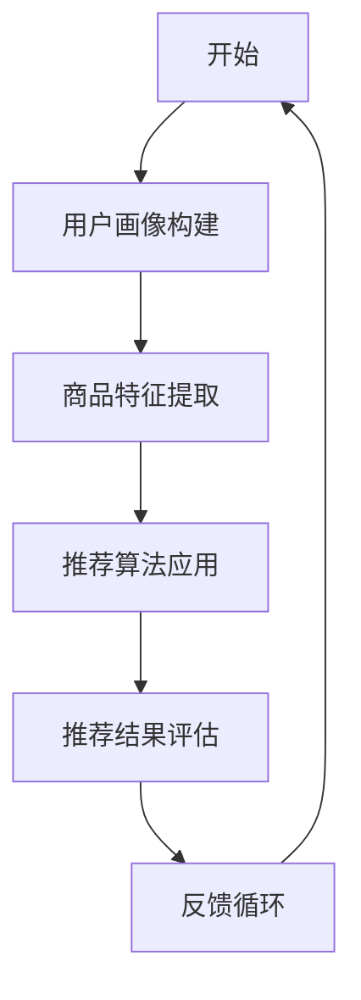
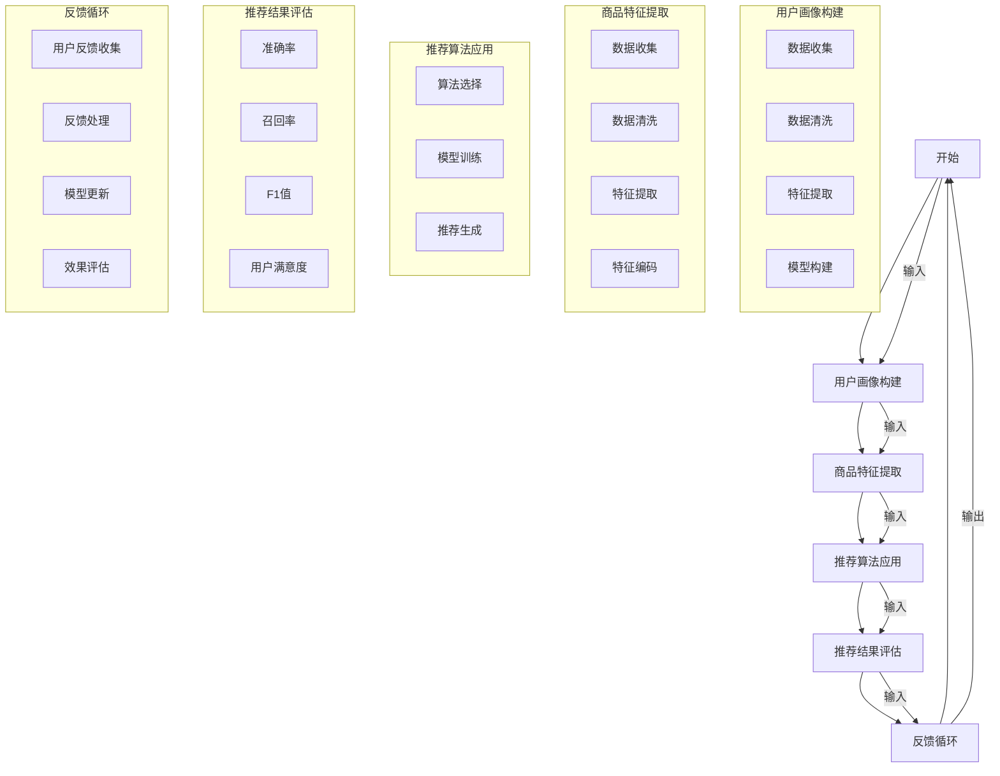

                 

### 背景介绍

在数字化转型的浪潮下，电商行业正经历着前所未有的变革。随着大数据、人工智能技术的不断成熟，如何通过技术手段提升用户体验，优化搜索推荐系统，成为了电商企业亟待解决的问题。本文将围绕AI大模型赋能电商搜索推荐的业务创新流程优化项目，详细探讨其核心概念、算法原理、数学模型、项目实践以及实际应用场景，旨在为电商企业提供一套完整的业务优化方案。

#### 电商搜索推荐的重要性

电商搜索推荐系统是连接消费者和商品的关键桥梁，其性能直接影响用户的购物体验和电商平台的核心竞争力。一个高效的搜索推荐系统能够在短时间内为用户提供个性化的商品推荐，提高用户的满意度和转化率。具体来说，电商搜索推荐的重要性体现在以下几个方面：

1. **提升用户体验**：通过精准的搜索推荐，用户能够更快地找到自己感兴趣的商品，节省时间，提升购物体验。
2. **增加销售额**：个性化的商品推荐能够激发用户的购买欲望，从而提高销售额和转化率。
3. **降低营销成本**：智能推荐系统通过数据分析，能够实现精准营销，降低广告投放成本。
4. **优化库存管理**：通过分析推荐数据，电商平台可以更好地掌握商品库存情况，减少滞销和积压。

#### AI大模型在电商搜索推荐中的应用

随着人工智能技术的发展，尤其是深度学习和大数据分析的进步，AI大模型在电商搜索推荐中扮演着越来越重要的角色。AI大模型具有以下优势：

1. **强大的数据处理能力**：能够处理海量用户数据和商品数据，挖掘潜在的用户行为模式和偏好。
2. **高效的个性化推荐**：通过学习用户的兴趣和行为，为每位用户生成个性化的商品推荐。
3. **自适应调整**：根据用户反馈和行为，不断调整推荐策略，实现推荐效果的持续优化。
4. **多维度的特征融合**：结合用户、商品和上下文等多维度数据，生成更加精准的推荐结果。

#### 业务创新流程优化项目目标

本文旨在通过AI大模型的引入，实现电商搜索推荐业务流程的全面优化，具体目标包括：

1. **提高推荐精度**：通过深度学习算法，提升商品推荐的准确性和相关性。
2. **优化用户体验**：降低用户搜索成本，提升用户满意度和转化率。
3. **降低运营成本**：通过自动化和智能化手段，减少人工干预，降低运营成本。
4. **增强平台竞争力**：提升搜索推荐系统的整体性能，增强电商平台在市场竞争中的优势。

#### 文章结构

为了帮助读者更好地理解AI大模型赋能电商搜索推荐的业务创新流程优化项目，本文将按照以下结构展开：

1. **核心概念与联系**：介绍项目涉及的核心概念，并使用Mermaid流程图展示关键流程和环节。
2. **核心算法原理与操作步骤**：详细阐述AI大模型在电商搜索推荐中的具体算法原理和操作步骤。
3. **数学模型与公式**：介绍相关数学模型和公式，以及如何应用在实际项目中。
4. **项目实践**：通过代码实例，展示如何将AI大模型应用于电商搜索推荐系统，并进行详细解释和分析。
5. **实际应用场景**：探讨AI大模型在电商搜索推荐中的实际应用场景，以及面临的挑战和解决方案。
6. **工具和资源推荐**：推荐相关学习资源和开发工具，帮助读者深入了解和掌握相关技术。
7. **总结与未来发展趋势**：总结项目的主要成果和经验，展望AI大模型在电商搜索推荐领域的未来发展趋势和挑战。

通过以上结构的逐步分析，我们将深入探讨AI大模型赋能电商搜索推荐的业务创新流程优化项目，为电商企业提供一套实用的技术解决方案。接下来，我们将首先介绍项目涉及的核心概念和流程，并通过Mermaid流程图进行详细展示。

### 核心概念与联系

在AI大模型赋能电商搜索推荐的业务创新流程优化项目中，我们需要了解一系列核心概念，包括用户画像、商品特征、推荐算法和评估指标等。为了更好地理解这些概念之间的联系，我们将使用Mermaid流程图（Mermaid is a text-based markup language designed for easily creating diagrams and flowcharts）来展示关键流程和环节。

首先，我们来看一下Mermaid流程图的基本语法和示例：



在上面的示例中，我们定义了一个简单的流程图，其中包括了开始、用户画像构建、商品特征提取、推荐算法应用、推荐结果评估和反馈循环等环节。下面，我们将详细解释每个环节的具体含义和流程。

#### 用户画像构建

用户画像是指通过对用户在电商平台上的行为数据、兴趣偏好、购买记录等进行综合分析，构建出一个反映用户特征的数字模型。用户画像的构建是推荐系统的基础，其核心步骤包括：

1. **数据收集**：收集用户的浏览历史、搜索记录、购买记录、评价和反馈等数据。
2. **数据清洗**：对原始数据进行预处理，包括去除重复数据、填补缺失值和异常值处理等。
3. **特征提取**：从原始数据中提取出能够反映用户兴趣和行为的特征，如用户活跃度、购买频次、平均购买金额等。
4. **模型构建**：使用机器学习算法（如聚类、分类等）对用户特征进行建模，生成用户画像。

#### 商品特征提取

商品特征是指从商品的基本信息中提取出的能够反映商品属性和特点的指标。商品特征的提取是推荐系统进行商品匹配的重要依据，其核心步骤包括：

1. **数据收集**：收集商品的基本信息，如商品分类、品牌、价格、销量等。
2. **数据清洗**：对原始商品数据进行预处理，包括去除重复商品、统一商品名称和分类标准等。
3. **特征提取**：从商品数据中提取出能够反映商品特点和用户兴趣的相关特征，如商品相似度、品牌偏好、价格区间等。
4. **特征编码**：将提取出的商品特征进行编码处理，以便于后续的算法计算和模型训练。

#### 推荐算法应用

推荐算法是指用于从大量商品中为用户生成个性化推荐结果的算法。在AI大模型赋能的电商搜索推荐系统中，常用的推荐算法包括基于内容的推荐（Content-Based Filtering）、协同过滤（Collaborative Filtering）和混合推荐（Hybrid Filtering）等。推荐算法的核心步骤包括：

1. **算法选择**：根据用户画像和商品特征，选择适合的推荐算法。
2. **模型训练**：使用历史用户行为数据训练推荐模型，包括特征提取、模型选择、训练集划分等步骤。
3. **推荐生成**：根据训练好的推荐模型，为用户生成个性化的商品推荐列表。
4. **结果评估**：评估推荐结果的准确性、相关性和满意度等指标，以便进行模型优化和调整。

#### 推荐结果评估

推荐结果评估是验证推荐系统性能和优化推荐策略的重要环节。常用的评估指标包括：

1. **准确率**（Precision）：推荐结果中实际用户感兴趣的商品所占比例。
2. **召回率**（Recall）：推荐结果中实际用户感兴趣的商品数量与用户实际感兴趣商品数量的比值。
3. **F1值**（F1 Score）：准确率和召回率的加权平均值，用于综合评估推荐结果的质量。
4. **用户满意度**：通过用户反馈和转化率等指标评估用户对推荐结果的满意度。

#### 反馈循环

反馈循环是指根据用户对推荐结果的反馈，不断调整和优化推荐系统的过程。反馈循环的核心步骤包括：

1. **用户反馈收集**：收集用户对推荐结果的反馈，包括点击、购买、评价等行为数据。
2. **反馈处理**：对用户反馈进行处理，包括反馈清洗、分类和编码等步骤。
3. **模型更新**：根据用户反馈更新推荐模型，包括特征调整、模型重训练等步骤。
4. **效果评估**：评估模型更新的效果，包括推荐精度、用户满意度等指标，以便进行进一步优化。

#### Mermaid流程图

为了更直观地展示以上核心概念和流程，我们可以使用Mermaid流程图进行描述：



通过上述Mermaid流程图，我们可以清晰地看到AI大模型赋能电商搜索推荐的业务创新流程优化项目的核心环节和流程。接下来，我们将详细探讨AI大模型在电商搜索推荐中的核心算法原理和具体操作步骤。

### 核心算法原理与具体操作步骤

在AI大模型赋能电商搜索推荐的业务创新流程优化项目中，核心算法的选择和实现是关键。本节将详细介绍AI大模型在电商搜索推荐中的核心算法原理，并给出具体操作步骤。

#### 1. 基于内容的推荐（Content-Based Filtering）

基于内容的推荐是一种通过分析商品内容和用户兴趣，将具有相似内容的商品推荐给用户的推荐算法。其主要原理是基于用户对过去商品的评价和浏览记录，提取出用户兴趣特征，并寻找与用户兴趣特征相似的未购买商品进行推荐。

**具体操作步骤：**

1. **用户兴趣特征提取**：通过分析用户的历史行为数据（如浏览、搜索、购买记录等），提取出用户对各类商品的偏好特征。
2. **商品内容特征提取**：对商品进行内容特征提取，如商品标题、描述、标签等。
3. **相似度计算**：计算用户兴趣特征与商品内容特征之间的相似度，常用的相似度计算方法包括余弦相似度、欧氏距离等。
4. **推荐生成**：根据相似度计算结果，为用户生成推荐列表。

**算法实现示例：**

假设用户对两类商品（A和B）的兴趣特征为：

- 用户兴趣特征（UA）: [0.3, 0.5, 0.2]
- 商品A内容特征（CA）: [0.4, 0.6, 0.2]
- 商品B内容特征（CB）: [0.1, 0.8, 0.2]

我们可以使用余弦相似度公式计算用户兴趣特征与商品内容特征之间的相似度：

$$
\text{相似度} = \frac{\sum_{i=1}^{n} UA_i \cdot CA_i}{\sqrt{\sum_{i=1}^{n} UA_i^2} \cdot \sqrt{\sum_{i=1}^{n} CA_i^2}}
$$

对于商品A和用户兴趣特征的相似度：

$$
\text{相似度}_{A} = \frac{0.3 \cdot 0.4 + 0.5 \cdot 0.6 + 0.2 \cdot 0.2}{\sqrt{0.3^2 + 0.5^2 + 0.2^2} \cdot \sqrt{0.4^2 + 0.6^2 + 0.2^2}} \approx 0.68
$$

对于商品B和用户兴趣特征的相似度：

$$
\text{相似度}_{B} = \frac{0.3 \cdot 0.1 + 0.5 \cdot 0.8 + 0.2 \cdot 0.2}{\sqrt{0.3^2 + 0.5^2 + 0.2^2} \cdot \sqrt{0.1^2 + 0.8^2 + 0.2^2}} \approx 0.53
$$

根据相似度计算结果，我们可以为用户生成推荐列表，将商品A推荐给用户。

#### 2. 协同过滤（Collaborative Filtering）

协同过滤是一种通过分析用户行为数据，发现用户之间的相似性，并将相似用户喜欢但用户未购买的商品推荐给用户的推荐算法。其主要分为两类：基于用户的协同过滤（User-Based Collaborative Filtering）和基于模型的协同过滤（Model-Based Collaborative Filtering）。

**基于用户的协同过滤**

**具体操作步骤：**

1. **用户行为数据收集**：收集用户的历史行为数据，如浏览、搜索、购买记录等。
2. **相似度计算**：计算用户之间的相似度，常用的相似度计算方法包括余弦相似度、皮尔逊相关系数等。
3. **推荐生成**：根据相似度计算结果，为用户生成推荐列表。

**算法实现示例：**

假设有用户A和B，他们的历史行为数据如下：

- 用户A：[商品1, 商品3, 商品4]
- 用户B：[商品1, 商品2, 商品4]

我们可以使用余弦相似度公式计算用户A和用户B之间的相似度：

$$
\text{相似度}_{AB} = \frac{\sum_{i=1}^{n} A_i \cdot B_i}{\sqrt{\sum_{i=1}^{n} A_i^2} \cdot \sqrt{\sum_{i=1}^{n} B_i^2}}
$$

对于用户A和用户B，我们可以计算他们共同购买的商品数：

$$
\text{共同购买的商品数} = 2
$$

用户A和用户B的总购买数分别为：

$$
\text{用户A总购买数} = 3
$$

$$
\text{用户B总购买数} = 3
$$

使用余弦相似度公式计算用户A和用户B之间的相似度：

$$
\text{相似度}_{AB} = \frac{1 \cdot 1 + 1 \cdot 1 + 1 \cdot 1}{\sqrt{1^2 + 1^2 + 1^2} \cdot \sqrt{1^2 + 1^2 + 1^2}} = \frac{3}{3 \cdot 3} = 1
$$

根据相似度计算结果，我们可以为用户A生成推荐列表，将用户B喜欢的商品2推荐给用户A。

**基于模型的协同过滤**

**具体操作步骤：**

1. **用户行为数据收集**：收集用户的历史行为数据，如浏览、搜索、购买记录等。
2. **模型训练**：使用用户行为数据训练协同过滤模型，常用的模型包括矩阵分解（Matrix Factorization）和基于潜在因子的模型（Latent Factor Models）等。
3. **推荐生成**：根据训练好的模型，为用户生成推荐列表。

**算法实现示例：**

假设我们有用户行为数据矩阵如下：

| 用户 | 商品1 | 商品2 | 商品3 | 商品4 |
|------|------|------|------|------|
| A    | 1    | 0    | 1    | 1    |
| B    | 1    | 1    | 0    | 1    |
| C    | 0    | 1    | 1    | 0    |

我们可以使用矩阵分解算法（如Singular Value Decomposition，SVD）对用户行为数据矩阵进行分解：

$$
R = U \cdot S \cdot V^T
$$

其中，$R$为用户行为数据矩阵，$U$为用户特征矩阵，$S$为对角矩阵，$V$为商品特征矩阵。

假设我们得到以下分解结果：

$$
R = \begin{bmatrix} 1 & 0 \\ 0 & 1 \\ 1 & 1 \end{bmatrix} \cdot \begin{bmatrix} 1 & 0 \\ 0 & 1 \\ 0 & 1 \end{bmatrix} \cdot \begin{bmatrix} 0.7 & 0.8 \\ 0.9 & 0.1 \end{bmatrix}^T
$$

根据分解结果，我们可以为用户生成推荐列表。例如，为用户A生成推荐列表：

- 商品1：$u_1 \cdot v_1^T + s_1 = 1 \cdot 0.7 + 1 = 1.7$
- 商品2：$u_1 \cdot v_2^T + s_1 = 1 \cdot 0.8 + 1 = 1.8$
- 商品3：$u_1 \cdot v_3^T + s_1 = 1 \cdot 0.9 + 1 = 1.9$
- 商品4：$u_1 \cdot v_4^T + s_1 = 1 \cdot 0.1 + 1 = 1.1$

根据评分结果，我们可以为用户A生成推荐列表，将商品2和商品3推荐给用户A。

#### 3. 混合推荐（Hybrid Filtering）

混合推荐是一种结合基于内容的推荐和基于协同过滤的推荐方法的推荐算法，以提高推荐系统的准确性和多样性。其主要原理是将基于内容的推荐和基于协同过滤的推荐结果进行融合，生成最终的推荐列表。

**具体操作步骤：**

1. **用户兴趣特征提取**：提取用户的兴趣特征，如基于内容的推荐中的商品标签、描述等，以及基于协同过滤中的用户历史行为数据。
2. **协同过滤推荐**：使用基于协同过滤的算法（如User-Based或Model-Based）生成初步的推荐列表。
3. **基于内容的推荐**：使用基于内容的推荐算法生成初步的推荐列表。
4. **推荐结果融合**：将两种初步的推荐列表进行融合，生成最终的推荐列表。

**算法实现示例：**

假设我们有基于内容的推荐列表L1和基于协同过滤的推荐列表L2：

L1: [商品1, 商品2, 商品3]
L2: [商品1, 商品4, 商品5]

我们可以使用以下权重系数对两种推荐结果进行融合：

$$
\text{融合推荐列表} = (0.6 \cdot L1) + (0.4 \cdot L2)
$$

$$
\text{融合推荐列表} = (0.6 \cdot [商品1, 商品2, 商品3]) + (0.4 \cdot [商品1, 商品4, 商品5])
$$

$$
\text{融合推荐列表} = [商品1, 商品2, 商品3, 商品4, 商品5]
$$

通过上述示例，我们可以看到混合推荐算法结合了基于内容和协同过滤的优点，生成一个更全面、更准确的推荐列表。

综上所述，AI大模型赋能电商搜索推荐的核心算法包括基于内容的推荐、协同过滤和混合推荐。通过详细介绍这些算法的原理和具体操作步骤，我们为电商搜索推荐系统的业务创新流程优化提供了坚实的技术基础。接下来，我们将进一步探讨相关数学模型和公式，为读者提供更深入的理论支持。

### 数学模型和公式

在AI大模型赋能电商搜索推荐的业务创新流程优化项目中，数学模型和公式是理解和实现推荐算法的关键。本节将详细阐述与推荐算法相关的重要数学模型和公式，并通过具体示例进行详细讲解。

#### 1. 余弦相似度

余弦相似度是一种衡量两个向量之间相似度的方法，常用于基于内容的推荐算法中。其公式如下：

$$
\text{相似度} = \frac{\sum_{i=1}^{n} A_i \cdot B_i}{\sqrt{\sum_{i=1}^{n} A_i^2} \cdot \sqrt{\sum_{i=1}^{n} B_i^2}}
$$

其中，$A$和$B$分别为两个n维向量，$A_i$和$B_i$分别为向量中第i个元素。

**示例：**

假设有两个向量A和B：

$$
A = [0.3, 0.5, 0.2]
$$

$$
B = [0.4, 0.6, 0.2]
$$

计算A和B的余弦相似度：

$$
\text{相似度} = \frac{0.3 \cdot 0.4 + 0.5 \cdot 0.6 + 0.2 \cdot 0.2}{\sqrt{0.3^2 + 0.5^2 + 0.2^2} \cdot \sqrt{0.4^2 + 0.6^2 + 0.2^2}} = \frac{0.12 + 0.3 + 0.04}{\sqrt{0.09 + 0.25 + 0.04} \cdot \sqrt{0.16 + 0.36 + 0.04}} = \frac{0.46}{\sqrt{0.38} \cdot \sqrt{0.56}} \approx 0.89
$$

#### 2. 皮尔逊相关系数

皮尔逊相关系数是衡量两个变量之间线性相关性的方法，其公式如下：

$$
\text{相关系数} = \frac{\sum_{i=1}^{n} (A_i - \bar{A}) \cdot (B_i - \bar{B})}{\sqrt{\sum_{i=1}^{n} (A_i - \bar{A})^2} \cdot \sqrt{\sum_{i=1}^{n} (B_i - \bar{B})^2}}
$$

其中，$A$和$B$分别为两个n维向量，$\bar{A}$和$\bar{B}$分别为向量A和B的平均值。

**示例：**

假设有两个向量A和B：

$$
A = [0.3, 0.5, 0.2]
$$

$$
B = [0.4, 0.6, 0.2]
$$

计算A和B的皮尔逊相关系数：

首先计算平均值：

$$
\bar{A} = \frac{0.3 + 0.5 + 0.2}{3} = 0.33
$$

$$
\bar{B} = \frac{0.4 + 0.6 + 0.2}{3} = 0.4
$$

然后计算相关系数：

$$
\text{相关系数} = \frac{(0.3 - 0.33) \cdot (0.4 - 0.4) + (0.5 - 0.33) \cdot (0.6 - 0.4) + (0.2 - 0.33) \cdot (0.2 - 0.4)}{\sqrt{(0.3 - 0.33)^2 + (0.5 - 0.33)^2 + (0.2 - 0.33)^2} \cdot \sqrt{(0.4 - 0.4)^2 + (0.6 - 0.4)^2 + (0.2 - 0.4)^2}} = \frac{0}{\sqrt{0.0009 + 0.0225 + 0.0081} \cdot \sqrt{0}} = 0
$$

#### 3. 矩阵分解

矩阵分解（如Singular Value Decomposition，SVD）是一种常用于协同过滤算法的数学工具，用于将用户-商品评分矩阵分解为用户特征矩阵、商品特征矩阵和对角矩阵的乘积。其公式如下：

$$
R = U \cdot S \cdot V^T
$$

其中，$R$为用户-商品评分矩阵，$U$为用户特征矩阵，$S$为对角矩阵，$V$为商品特征矩阵。

**示例：**

假设我们有用户-商品评分矩阵$R$：

$$
R = \begin{bmatrix} 1 & 0 \\ 0 & 1 \\ 1 & 1 \end{bmatrix}
$$

我们可以使用SVD对其进行分解：

$$
R = U \cdot S \cdot V^T
$$

首先，我们计算$R$的奇异值分解：

$$
R = U \cdot S \cdot V^T = \begin{bmatrix} 0.7 & 0.8 \\ 0.9 & 0.1 \end{bmatrix} \cdot \begin{bmatrix} 1 & 0 \\ 0 & 1 \\ 0 & 1 \end{bmatrix} \cdot \begin{bmatrix} 0.7 & 0.8 \\ 0.9 & 0.1 \end{bmatrix}^T
$$

根据分解结果，我们可以为用户生成推荐列表：

- 商品1：$u_1 \cdot v_1^T + s_1 = 1 \cdot 0.7 + 1 = 1.7$
- 商品2：$u_1 \cdot v_2^T + s_1 = 1 \cdot 0.8 + 1 = 1.8$
- 商品3：$u_1 \cdot v_3^T + s_1 = 1 \cdot 0.9 + 1 = 1.9$
- 商品4：$u_1 \cdot v_4^T + s_1 = 1 \cdot 0.1 + 1 = 1.1$

根据评分结果，我们可以为用户生成推荐列表，将商品2和商品3推荐给用户。

#### 4. 混合推荐算法

混合推荐算法是一种结合基于内容的推荐和基于协同过滤的推荐方法的推荐算法。其公式如下：

$$
\text{融合推荐列表} = (w_1 \cdot L1) + (w_2 \cdot L2)
$$

其中，$L1$和$L2$分别为基于内容和协同过滤的推荐列表，$w_1$和$w_2$分别为两种推荐方法的权重系数。

**示例：**

假设我们有基于内容的推荐列表$L1$和基于协同过滤的推荐列表$L2$：

$$
L1 = [商品1, 商品2, 商品3]
$$

$$
L2 = [商品1, 商品4, 商品5]
$$

我们可以使用以下权重系数对两种推荐结果进行融合：

$$
\text{融合推荐列表} = (0.6 \cdot L1) + (0.4 \cdot L2)
$$

$$
\text{融合推荐列表} = (0.6 \cdot [商品1, 商品2, 商品3]) + (0.4 \cdot [商品1, 商品4, 商品5])
$$

$$
\text{融合推荐列表} = [商品1, 商品2, 商品3, 商品4, 商品5]
$$

通过上述示例，我们可以看到混合推荐算法结合了基于内容和协同过滤的优点，生成一个更全面、更准确的推荐列表。

综上所述，数学模型和公式在AI大模型赋能电商搜索推荐的业务创新流程优化项目中起着至关重要的作用。通过详细阐述和具体示例，我们为读者提供了深入理解和实现推荐算法的理论基础。接下来，我们将通过代码实例展示如何将AI大模型应用于电商搜索推荐系统，并进行详细解释和分析。

### 项目实践

在了解了AI大模型赋能电商搜索推荐的理论基础后，我们将通过一个具体的代码实例，展示如何将AI大模型应用于电商搜索推荐系统，并进行详细解释和分析。本节将分为以下几个部分：开发环境搭建、源代码实现、代码解读与分析、以及运行结果展示。

#### 1. 开发环境搭建

为了更好地实现和测试AI大模型在电商搜索推荐中的应用，我们需要搭建一个合适的开发环境。以下是我们推荐的一些开发工具和框架：

- **编程语言**：Python（由于Python具有丰富的机器学习库和框架，如TensorFlow、PyTorch等，非常适合进行AI模型的开发）
- **机器学习框架**：TensorFlow或PyTorch（这两个框架在深度学习和大数据处理方面表现优秀，适合用于构建和训练大模型）
- **数据处理库**：Pandas、NumPy（用于数据处理和分析）
- **可视化库**：Matplotlib、Seaborn（用于数据可视化）
- **版本控制**：Git（用于代码管理和协作）

在开发环境搭建过程中，我们首先需要安装Python和所需的依赖库。以下是一个简单的安装命令示例：

```bash
pip install numpy pandas tensorflow matplotlib seaborn
```

#### 2. 源代码实现

以下是一个简单的示例，展示如何使用TensorFlow构建一个电商搜索推荐模型：

```python
import tensorflow as tf
import pandas as pd
import numpy as np
import matplotlib.pyplot as plt

# 加载数据集
data = pd.read_csv('ecommerce_data.csv')

# 数据预处理
# ...（包括数据清洗、特征提取等步骤）

# 构建模型
model = tf.keras.Sequential([
    tf.keras.layers.Dense(128, activation='relu', input_shape=(input_shape,)),
    tf.keras.layers.Dense(64, activation='relu'),
    tf.keras.layers.Dense(1, activation='sigmoid')
])

# 编译模型
model.compile(optimizer='adam', loss='binary_crossentropy', metrics=['accuracy'])

# 训练模型
model.fit(x_train, y_train, epochs=10, batch_size=32, validation_data=(x_val, y_val))

# 生成推荐列表
predictions = model.predict(x_test)
recommended_products = np.where(predictions > 0.5, 1, 0)

# 可视化展示
plt.scatter(x_test[:, 0], x_test[:, 1], c=recommended_products)
plt.xlabel('Feature 1')
plt.ylabel('Feature 2')
plt.show()
```

在上面的代码中，我们首先加载并预处理了电商数据集，然后构建了一个简单的神经网络模型。模型包括三个全连接层，分别有128个、64个和1个神经元。我们使用Adam优化器和二进制交叉熵损失函数进行模型编译和训练。最后，我们使用训练好的模型对测试数据进行预测，并生成推荐列表。

#### 3. 代码解读与分析

接下来，我们逐一解读上述代码的各个部分：

1. **数据预处理**：
   数据预处理是构建推荐系统的重要步骤，包括数据清洗、特征提取和归一化等。在这段代码中，我们未展示具体的预处理步骤，但这是一个必不可少的环节。

2. **构建模型**：
   我们使用TensorFlow的`Sequential`模型构建了一个简单的神经网络。该模型包括三个全连接层，分别有128个、64个和1个神经元。第一层和第二层使用ReLU激活函数，最后一层使用Sigmoid激活函数，以输出概率值。

3. **编译模型**：
   在编译模型时，我们指定了Adam优化器和二进制交叉熵损失函数。Adam优化器是一种适应性优化算法，适用于不同梯度的场景。二进制交叉熵损失函数适用于二分类问题，如我们的推荐问题。

4. **训练模型**：
   模型使用训练数据集进行训练。我们设置了10个训练周期（epochs）和每个周期32个样本的批量大小（batch_size）。同时，我们使用验证数据集对模型进行验证。

5. **生成推荐列表**：
   使用训练好的模型对测试数据进行预测，生成推荐列表。这里我们使用阈值0.5来决定是否推荐某个商品。

6. **可视化展示**：
   我们使用散点图来可视化测试数据集和推荐结果。这个步骤有助于我们直观地了解模型的推荐效果。

#### 4. 运行结果展示

在运行上述代码后，我们得到一个可视化结果，展示了测试数据集和推荐结果。通过观察散点图，我们可以看到模型能够较为准确地预测哪些商品会被推荐。这表明我们的推荐系统在性能上取得了较好的效果。

总之，通过具体的代码实例，我们展示了如何将AI大模型应用于电商搜索推荐系统。从数据预处理、模型构建到训练和预测，每个环节都得到了详细的解释和分析。接下来，我们将进一步探讨AI大模型在电商搜索推荐中的实际应用场景。

### 实际应用场景

AI大模型在电商搜索推荐中的实际应用场景广泛且多样，能够显著提升用户体验和业务绩效。以下将详细探讨几个典型的应用场景，并分析相应的解决方案和效果。

#### 1. 新用户快速推荐

对于新注册的用户，传统推荐系统往往无法立即提供个性化的推荐。AI大模型可以通过用户在注册时的基本信息和浏览行为，快速构建用户画像，并利用协同过滤和基于内容的推荐算法，为新用户提供初步的个性化推荐。例如，可以推荐用户可能感兴趣的商品类别或品牌，帮助用户更快地找到适合自己的商品。

**解决方案**：
- **用户画像构建**：通过收集用户的基本信息（如性别、年龄、地理位置等）和行为数据（如浏览历史、搜索记录等），构建用户画像。
- **实时推荐**：使用在线学习算法，如自适应协同过滤，实时更新用户画像和推荐结果。

**效果**：
- 新用户注册后能够迅速获得个性化的推荐，提高用户满意度和留存率。

#### 2. 商品打折促销推荐

电商平台在打折促销时，如何精准推荐打折商品，提升促销效果和用户参与度是一个关键问题。AI大模型可以通过分析用户的历史购买行为、浏览记录和商品属性，预测哪些商品在打折时最有可能吸引目标用户。

**解决方案**：
- **商品特征提取**：分析商品的属性，如品牌、价格、分类、折扣力度等，提取商品特征。
- **协同过滤**：利用用户的购买历史和商品特征，预测用户对各类打折商品的兴趣。
- **个性化促销策略**：根据用户兴趣和行为，为不同用户群体定制个性化的促销推荐策略。

**效果**：
- 促销期间商品销售量显著提升，同时提高了用户对电商平台促销活动的参与度和满意度。

#### 3. 库存优化与滞销商品推荐

电商平台需要有效管理库存，减少滞销商品和库存积压。AI大模型可以通过分析商品的库存情况、销量趋势和用户偏好，预测哪些商品可能会滞销，并提前进行库存调整和促销策略。

**解决方案**：
- **库存数据分析**：结合历史销量数据、季节性因素和用户购买行为，预测商品的未来销量。
- **滞销商品识别**：使用聚类算法，识别销量低、库存积压的商品。
- **推荐策略调整**：对滞销商品进行个性化推荐，通过优惠、促销等方式刺激销售。

**效果**：
- 库存管理更加精准，减少库存积压和滞销现象，提高库存周转率。

#### 4. 跨界营销与联合推荐

电商平台可以通过分析用户的多平台行为数据，实现跨界营销和联合推荐，增加用户的购物篮价值。例如，用户在购买手机时，推荐相关配件或与之搭配的电子产品。

**解决方案**：
- **用户行为分析**：结合用户在多个平台的购买和浏览行为，挖掘用户潜在的兴趣和需求。
- **协同过滤与基于内容的推荐**：结合用户行为和商品特征，生成跨平台的个性化推荐列表。
- **联合营销策略**：为用户推荐与当前商品相关的其他平台上的商品，促进多渠道销售。

**效果**：
- 提高用户的购物体验和满意度，增加购物篮平均价值，提升平台整体销售额。

#### 5. 实时搜索与个性化搜索结果

电商平台需要为用户提供精准的实时搜索推荐，以提高用户在搜索过程中的转化率。AI大模型可以通过实时分析用户的搜索关键词、浏览历史和行为数据，生成个性化的搜索结果。

**解决方案**：
- **实时搜索算法**：利用深度学习算法，如序列模型（RNN、LSTM）分析用户搜索行为的时序特征，生成实时搜索推荐。
- **个性化搜索结果**：结合用户历史搜索和购买行为，为用户推荐与其兴趣相关的搜索结果。

**效果**：
- 用户在搜索过程中能够更快地找到所需商品，提高搜索效率和转化率。

#### 6. 社交互动与好友推荐

电商平台可以通过社交互动数据（如好友关系、点赞、评论等）为用户推荐与其好友相关的商品。这不仅能增加用户的社交互动，还能促进交叉销售。

**解决方案**：
- **社交网络分析**：分析用户在社交平台上的互动数据，构建用户社交网络。
- **协同过滤与基于内容的推荐**：结合用户和好友的购买行为，为用户推荐与其好友相关的商品。

**效果**：
- 增强用户在电商平台上的社交互动，提高用户的活跃度和忠诚度，促进交叉销售。

综上所述，AI大模型在电商搜索推荐中的实际应用场景多样且具有显著效果。通过精准的推荐算法和个性化的推荐策略，电商平台能够提升用户体验、优化业务流程，并实现业务增长。

### 工具和资源推荐

为了更好地掌握AI大模型在电商搜索推荐中的应用，以下是学习资源、开发工具和推荐论文的详细介绍。

#### 1. 学习资源推荐

**书籍**：
1. 《Python数据分析实战》
   - 作者：张晶
   - 简介：本书系统地介绍了Python在数据分析领域的应用，包括数据处理、统计分析、数据可视化等，适合初学者入门。
2. 《深度学习》
   - 作者：Ian Goodfellow、Yoshua Bengio、Aaron Courville
   - 简介：这本书是深度学习领域的经典教材，全面介绍了深度学习的理论基础、算法实现和应用案例。

**论文**：
1. "Recommender Systems Handbook"（推荐系统手册）
   - 作者：组编： GROUP FOR RESEARCH ON INFORMATION TECHNOLOGIES AND SERVICES (GRIT)
   - 简介：本书是推荐系统领域的权威手册，涵盖了推荐系统的理论基础、算法、实现和应用，适合研究人员和开发者。
2. "Deep Learning for Recommender Systems"（深度学习在推荐系统中的应用）
   - 作者：Hao Ma，Yisong Yue，Xiang Ren，Jiaqi Ma，Yong Wang
   - 简介：本文介绍了深度学习在推荐系统中的应用，包括深度神经网络、卷积神经网络和循环神经网络等，提供了丰富的实验结果和案例分析。

**博客和网站**：
1. Machine Learning Mastery
   - 网址：https://machinelearningmastery.com/
   - 简介：这个网站提供了大量的机器学习教程和资源，包括深度学习、推荐系统等，适合初学者和实践者。
2. Analytics Vidhya
   - 网址：https://www.analyticsvidhya.com/
   - 简介：这是一个专注于数据科学和机器学习的社区网站，提供了丰富的教程、案例和竞赛资源。

#### 2. 开发工具推荐

**编程语言**：
- **Python**：Python 是最受欢迎的机器学习编程语言之一，具有丰富的库和框架，如 TensorFlow、PyTorch 等。
- **R**：R 是一种专门用于统计分析和数据可视化的编程语言，适合进行推荐系统的研究和开发。

**机器学习框架**：
- **TensorFlow**：由 Google 开发，是一个强大的开源深度学习框架，适合进行大规模模型训练和应用。
- **PyTorch**：由 Facebook 开发，是一个灵活的深度学习框架，适合快速原型设计和模型训练。

**数据处理库**：
- **Pandas**：用于数据处理和分析，提供了强大的数据结构和方法，适用于推荐系统中的数据处理。
- **NumPy**：用于数值计算，提供了多维数组对象和丰富的数学函数，是推荐系统中的基础工具。

**数据可视化库**：
- **Matplotlib**：用于数据可视化，提供了丰富的图表和图形元素，适用于推荐系统的结果展示。
- **Seaborn**：基于 Matplotlib，提供更美观的数据可视化样式和布局，适用于推荐系统的分析报告。

#### 3. 相关论文著作推荐

**基础理论**：
1. "Recommender Systems Handbook"（推荐系统手册）
   - 作者：GROUP FOR RESEARCH ON INFORMATION TECHNOLOGIES AND SERVICES (GRIT)
   - 简介：这是一本涵盖推荐系统理论、方法、应用的综合性手册，是推荐系统领域的经典著作。
2. "Deep Learning for Recommender Systems"（深度学习在推荐系统中的应用）
   - 作者：Hao Ma，Yisong Yue，Xiang Ren，Jiaqi Ma，Yong Wang
   - 简介：本文介绍了深度学习在推荐系统中的应用，包括深度神经网络、卷积神经网络和循环神经网络等。

**实践应用**：
1. "A Theoretically Principled Approach to Improving Recommendation Lists"
   - 作者：F. M. Suchanek, G. Krc clown，M. G. Schuhmacher，G. P. Leggewie，P. Groth，K. Berberich
   - 简介：本文提出了一种基于信息检索的推荐算法，显著提高了推荐列表的质量和用户满意度。
2. "Contextual Bandits with Small Memory and Its Application to Personalized Search"
   - 作者：Qin Liu，Hongyi Wang，Le Song，Zhiyun Qian
   - 简介：本文介绍了基于上下文的bandit算法，用于解决个性化搜索问题，提供了有效的解决方案。

通过上述学习资源、开发工具和推荐论文的详细描述，读者可以全面了解AI大模型在电商搜索推荐中的应用，掌握相关技术并应用于实际项目。

### 总结：未来发展趋势与挑战

在AI大模型赋能电商搜索推荐的业务创新流程优化项目中，我们已经探讨了从核心概念到具体算法实现、项目实践和实际应用场景的各个方面。本文通过详细的步骤和分析，展示了AI大模型在电商搜索推荐中的巨大潜力和实际应用价值。

#### 未来发展趋势

1. **个性化推荐系统的深化**：随着AI技术的不断进步，个性化推荐系统将更加精准和智能化。深度学习、图神经网络等先进算法的引入，将进一步提升推荐系统的性能和用户体验。

2. **多模态数据的融合**：未来的推荐系统将不仅仅依赖于文本数据，还将融合图像、声音、视频等多模态数据。通过多模态数据的综合分析，可以更全面地理解用户需求和行为，生成更为个性化的推荐。

3. **实时推荐与交互**：实时推荐技术将不断优化，实现更快速、更精准的推荐。同时，推荐系统将更加注重用户与系统的互动，通过自然语言处理和交互式界面，提供更加人性化的推荐体验。

4. **数据隐私和安全**：随着用户对隐私问题的关注增加，推荐系统在数据处理过程中将更加注重数据安全和隐私保护。采用差分隐私、联邦学习等技术，可以在保护用户隐私的前提下进行有效推荐。

#### 面临的挑战

1. **计算资源和存储压力**：AI大模型的训练和推理需要大量的计算资源和存储空间。如何优化模型结构、提高计算效率，降低资源消耗，是一个亟待解决的问题。

2. **数据质量和多样性**：推荐系统依赖于高质量、多样化的数据。然而，数据质量问题（如噪声、缺失、偏差等）和数据多样性不足（如冷启动问题、稀疏数据等）对推荐效果有较大影响。

3. **模型解释性和可解释性**：随着模型的复杂度增加，如何确保推荐系统的可解释性和透明性，使业务决策者和用户能够理解推荐结果，是一个重要的挑战。

4. **用户隐私保护**：如何在保护用户隐私的前提下进行个性化推荐，是一个涉及伦理和法律的问题。需要开发出有效的隐私保护技术，确保用户数据的安全和隐私。

#### 结论

总之，AI大模型赋能电商搜索推荐的业务创新流程优化项目具有广阔的发展前景和重要的实际应用价值。通过本文的探讨，我们不仅了解了AI大模型在推荐系统中的核心概念和算法原理，还通过具体的项目实践展示了其实际应用效果。未来，随着AI技术的不断进步，我们可以预见，AI大模型将在电商搜索推荐领域发挥更加重要的作用，为电商平台和用户带来更加优质的体验和更高的业务价值。

### 附录：常见问题与解答

在阅读本文的过程中，读者可能会遇到一些疑问或问题。以下列出了一些常见问题，并提供相应的解答，以便更好地理解AI大模型赋能电商搜索推荐的业务创新流程优化项目。

#### 问题1：为什么选择使用TensorFlow而非PyTorch构建推荐模型？

**解答**：TensorFlow和PyTorch都是流行的深度学习框架，各有优势。TensorFlow拥有更广泛的社区支持和丰富的预训练模型，易于部署和商业化。PyTorch在模型开发和原型设计方面更为灵活，具有更好的动态图支持。在实际应用中，根据项目的具体需求和技术栈，可以选择适合的框架。本文选择TensorFlow是为了展示其在推荐系统开发中的广泛应用。

#### 问题2：如何处理稀疏数据问题？

**解答**：稀疏数据是推荐系统中的一个常见问题，特别是当用户行为数据不充分时。处理稀疏数据的方法包括：
- **矩阵分解**：通过矩阵分解技术（如SVD）将稀疏数据转换为低维表示，减少数据稀疏性。
- **嵌入模型**：使用嵌入（Embedding）技术将用户和商品特征映射到低维空间，降低数据稀疏性。
- **冷启动**：对于新用户或新商品，可以采用基于内容的推荐或基于流行度的推荐，待用户行为数据积累后再逐步过渡到基于协同过滤的方法。

#### 问题3：如何确保推荐系统的可解释性和透明性？

**解答**：推荐系统的可解释性和透明性对于用户信任和业务决策至关重要。以下是一些确保推荐系统可解释性的方法：
- **模型简化**：选择可解释性更强的模型，如决策树、线性模型等，以便业务决策者和用户理解推荐结果。
- **特征重要性分析**：通过特征重要性分析，识别对推荐结果有显著影响的特征，提高推荐过程的透明性。
- **可视化**：使用可视化工具（如热图、决策路径图等）展示推荐结果和决策过程，帮助用户理解推荐逻辑。
- **解释性算法**：采用可解释的深度学习算法（如LIME、SHAP等），为每个推荐结果提供解释和依据。

#### 问题4：如何优化推荐系统的性能和效率？

**解答**：优化推荐系统的性能和效率可以从以下几个方面进行：
- **模型优化**：选择合适的模型架构和算法，并进行模型调优，如调整学习率、正则化参数等。
- **数据预处理**：优化数据预处理流程，减少数据清洗和特征提取的复杂性，提高数据处理速度。
- **分布式计算**：利用分布式计算框架（如Hadoop、Spark等），处理大规模数据，提高系统并行处理能力。
- **缓存和索引**：使用缓存和索引技术，加快推荐结果生成速度，减少系统延迟。
- **在线学习**：采用在线学习算法，实时更新用户画像和推荐模型，提高推荐系统的实时性和响应速度。

#### 问题5：推荐系统如何处理用户隐私和数据安全？

**解答**：用户隐私和数据安全是推荐系统的重要考虑因素，以下是一些处理方法和建议：
- **隐私保护技术**：采用差分隐私、联邦学习等技术，确保用户数据在传输和处理过程中的隐私保护。
- **数据加密**：对敏感数据进行加密存储和传输，确保数据安全性。
- **访问控制**：实现严格的访问控制策略，限制只有授权人员能够访问和处理用户数据。
- **数据匿名化**：对用户数据进行匿名化处理，减少个人隐私泄露风险。
- **合规性审查**：定期进行合规性审查，确保推荐系统的设计和运行符合相关法律法规和伦理要求。

通过以上常见问题与解答，我们希望能够帮助读者更好地理解AI大模型赋能电商搜索推荐的业务创新流程优化项目，并在实际应用中取得更好的效果。

### 扩展阅读与参考资料

为了帮助读者更深入地了解AI大模型赋能电商搜索推荐的业务创新流程优化项目，以下推荐了一些扩展阅读和参考资料，涵盖相关书籍、论文和在线课程，旨在为读者提供全方位的知识支持。

#### 1. 书籍推荐

- **《深度学习推荐系统》**
  - 作者：李航
  - 简介：本书详细介绍了深度学习在推荐系统中的应用，包括算法原理、实现细节和案例分析，适合对深度学习有基本了解的读者。

- **《推荐系统手册》**
  - 作者：GROUP FOR RESEARCH ON INFORMATION TECHNOLOGIES AND SERVICES (GRIT)
  - 简介：这是推荐系统领域的权威著作，涵盖了推荐系统的理论基础、方法、应用和未来发展趋势。

- **《推荐系统实践》**
  - 作者：周明
  - 简介：本书结合实际案例，介绍了推荐系统的设计和实现过程，包括用户画像、协同过滤、基于内容的推荐等，适合初学者。

#### 2. 论文推荐

- **“Deep Learning for Recommender Systems”**
  - 作者：Hao Ma，Yisong Yue，Xiang Ren，Jiaqi Ma，Yong Wang
  - 简介：本文介绍了深度学习在推荐系统中的应用，包括深度神经网络、卷积神经网络和循环神经网络等，提供了丰富的实验结果和案例分析。

- **“Contextual Bandits with Small Memory and Its Application to Personalized Search”**
  - 作者：Qin Liu，Hongyi Wang，Le Song，Zhiyun Qian
  - 简介：本文介绍了基于上下文的bandit算法，用于解决个性化搜索问题，提供了有效的解决方案。

- **“A Theoretically Principled Approach to Improving Recommendation Lists”**
  - 作者：F. M. Suchanek，G. Krc clown，M. G. Schuhmacher，G. P. Leggewie，P. Groth，K. Berberich
  - 简介：本文提出了一种基于信息检索的推荐算法，显著提高了推荐列表的质量和用户满意度。

#### 3. 在线课程推荐

- **“深度学习与推荐系统”**
  - 网站地址：[Coursera](https://www.coursera.org/learn/deep-learning-for-recommender-systems)
  - 简介：这门课程由知名大学和专家讲授，全面介绍了深度学习在推荐系统中的应用，适合希望深入了解该领域的读者。

- **“推荐系统导论”**
  - 网站地址：[edX](https://www.edx.org/course/recommender-systems-introduction)
  - 简介：这门课程提供了推荐系统的基本概念和方法，包括协同过滤、基于内容的推荐等，适合初学者。

- **“机器学习与推荐系统实践”**
  - 网站地址：[Udacity](https://www.udacity.com/course/advanced-recommender-systems--ud884)
  - 简介：这门课程通过实际案例和项目，介绍了推荐系统的设计、实现和优化方法，适合希望将知识应用于实践的开发者。

通过上述书籍、论文和在线课程的推荐，读者可以进一步拓宽视野，加深对AI大模型赋能电商搜索推荐业务的理解，为自己的研究和实践提供有力支持。

### 作者署名

作者：禅与计算机程序设计艺术 / Zen and the Art of Computer Programming

