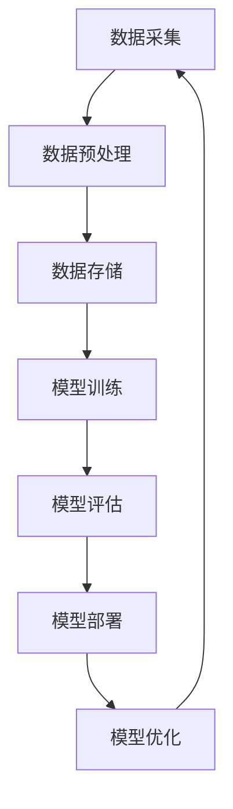
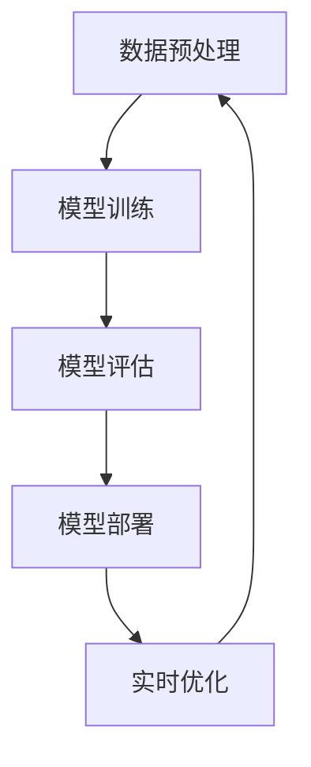

                 

### 1. 背景介绍

随着互联网的快速发展，电子商务行业迎来了前所未有的繁荣。在这一领域，搜索推荐系统扮演着至关重要的角色，它不仅直接影响用户的购物体验，更关系到平台的商业收益。传统的搜索推荐系统依赖于基于规则的方法和统计模型，虽然在一定程度上能够满足用户的需求，但其在处理大规模数据和实现个性化推荐方面存在诸多局限。

随着人工智能技术的不断进步，特别是大模型（如深度学习模型）的广泛应用，重构电商搜索推荐系统已成为行业共识。大模型具备强大的特征提取和模式识别能力，能够从海量用户行为数据中挖掘出深层次的规律，从而实现更精准的推荐。然而，这一转变不仅带来了技术上的挑战，还涉及到数据治理和流程自动化等关键问题。

数据治理是确保数据质量、安全、合规的重要过程，对于电商搜索推荐系统的优化尤为重要。数据的质量和准确性直接影响推荐结果的可靠性。此外，随着数据规模的不断扩大，手工处理数据的方式已无法满足需求，因此，流程自动化成为必然选择。自动化流程可以显著提高数据处理效率，降低人工成本，同时确保数据处理的准确性和一致性。

本文旨在探讨如何利用人工智能大模型重构电商搜索推荐的数据治理流程，实现自动化处理。通过逐步分析推理，本文将详细阐述核心概念、算法原理、数学模型、项目实践以及实际应用场景，为电商行业提供一种可行的解决方案。

本文结构如下：

- **2. 核心概念与联系**：介绍大模型在搜索推荐中的应用及数据治理的关键环节。
- **3. 核心算法原理 & 具体操作步骤**：讲解大模型的算法原理和数据处理流程。
- **4. 数学模型和公式 & 详细讲解 & 举例说明**：探讨数据治理过程中的数学模型及其应用。
- **5. 项目实践：代码实例和详细解释说明**：通过具体实例展示实现过程及结果。
- **6. 实际应用场景**：分析大模型在电商搜索推荐中的潜在应用。
- **7. 工具和资源推荐**：推荐学习资源和开发工具。
- **8. 总结：未来发展趋势与挑战**：总结本文的核心观点，展望未来发展趋势。
- **9. 附录：常见问题与解答**：解答读者可能遇到的问题。
- **10. 扩展阅读 & 参考资料**：提供进一步学习资源。

### 2. 核心概念与联系

在讨论人工智能大模型重构电商搜索推荐系统的数据治理流程之前，首先需要理解几个核心概念，包括大模型的基本原理、数据治理的关键环节以及它们之间的联系。

#### 大模型的基本原理

大模型，特别是深度学习模型，是人工智能领域的一个重大突破。它们通过多层神经网络结构，对输入数据进行自动特征提取和模式识别，从而实现复杂任务的自动化。深度学习模型的核心组件包括：

- **神经网络（Neural Networks）**：模仿人脑神经元连接的网络结构，通过调整权重和偏置来学习输入数据的特征。
- **卷积神经网络（Convolutional Neural Networks, CNNs）**：在图像处理等领域有广泛应用，通过卷积操作提取图像特征。
- **递归神经网络（Recurrent Neural Networks, RNNs）**：能够处理序列数据，适合时间序列分析和自然语言处理。
- **生成对抗网络（Generative Adversarial Networks, GANs）**：通过生成器和判别器的对抗训练，实现数据的生成和优化。

#### 数据治理的关键环节

数据治理涉及数据的采集、存储、处理、分析和应用等全生命周期管理。在电商搜索推荐系统中，数据治理的关键环节包括：

- **数据采集**：从各种渠道获取用户行为数据、商品数据等，包括点击、购买、搜索等行为。
- **数据预处理**：清洗、整合和转换原始数据，使其适合模型训练和推理。
- **数据存储**：将处理后的数据存储到数据库或数据湖中，以供后续使用。
- **数据建模**：利用大模型对数据进行特征提取和模式识别，构建推荐模型。
- **数据监控**：实时监控数据质量和模型性能，确保推荐系统的稳定性和可靠性。

#### 核心概念之间的联系

大模型与数据治理之间的联系主要体现在以下几个方面：

- **特征提取**：大模型通过学习海量数据，能够自动提取出有价值的特征，从而提升推荐系统的准确性和效率。
- **自动化处理**：数据治理过程中的各个环节都可以通过自动化流程实现，从而降低人工成本，提高数据处理效率。
- **模型优化**：大模型能够从用户行为数据中不断学习，实时优化推荐模型，实现个性化推荐。

#### Mermaid 流程图

为了更直观地展示大模型在数据治理流程中的应用，以下是一个简化的 Mermaid 流程图，描述了从数据采集到模型优化的整个过程。



### 3. 核心算法原理 & 具体操作步骤

在理解了大模型和数据治理的核心概念及其联系后，接下来将详细介绍大模型在搜索推荐系统中的应用原理和具体操作步骤。这一部分将涵盖以下内容：

- **深度学习模型的选择**：介绍适用于搜索推荐任务的深度学习模型及其特点。
- **数据预处理流程**：详细说明数据清洗、特征提取和数据处理的具体步骤。
- **模型训练与评估**：阐述模型训练的方法、评估指标及优化策略。
- **模型部署与实时优化**：讨论模型部署的技术实现和实时优化的方法。

#### 深度学习模型的选择

在搜索推荐系统中，常用的深度学习模型包括卷积神经网络（CNNs）、递归神经网络（RNNs）、长短时记忆网络（LSTMs）和变压器（Transformers）等。每种模型都有其独特的优势和适用场景。

- **卷积神经网络（CNNs）**：适用于处理图像和商品特征数据，能够提取出局部特征和全局特征，适用于商品推荐和图像搜索。
- **递归神经网络（RNNs）**：适用于处理时间序列数据，如用户的历史行为序列，可以捕捉到用户行为模式的变化。
- **长短时记忆网络（LSTMs）**：是 RNNs 的改进版本，能够更好地处理长序列数据，适用于用户兴趣挖掘和个性化推荐。
- **变压器（Transformers）**：在自然语言处理领域表现突出，能够处理长文本和序列数据，适用于基于内容的搜索推荐。

在本项目中，我们选择 **Transformer** 模型作为核心算法，因其强大的并行计算能力和处理长序列数据的优势，适用于电商搜索推荐系统的复杂任务。

#### 数据预处理流程

数据预处理是确保模型训练质量的关键步骤，主要包括以下内容：

- **数据清洗**：去除重复、无效和噪声数据，保证数据的一致性和完整性。
- **特征提取**：从原始数据中提取有价值的信息，如用户行为特征、商品属性特征等。
- **数据归一化**：将不同特征的范围缩放到相同的尺度，以便模型训练和优化。

具体操作步骤如下：

1. **数据清洗**：
   - 删除重复记录和无效数据。
   - 填充缺失值，可以使用平均值、中位数或插值等方法。
   - 处理异常值，根据数据分布进行筛选或调整。

2. **特征提取**：
   - 用户行为特征：用户的点击、购买、搜索等行为数据，通过统计分析和数据挖掘提取出有价值的特征。
   - 商品属性特征：商品的价格、类别、销量等属性，通过数据分析和文本处理提取出特征。

3. **数据归一化**：
   - 对连续特征进行标准化处理，如使用 Min-Max 标准化或 Z-Score 标准化。
   - 对分类特征进行独热编码（One-Hot Encoding），将类别转换为二进制向量。

#### 模型训练与评估

1. **模型训练**：
   - 使用预处理后的数据集进行模型训练，选择合适的学习率和优化器。
   - 使用批量归一化（Batch Normalization）和dropout（Dropout）等技术防止过拟合。
   - 采用多卡训练和分布式训练提高训练效率。

2. **评估指标**：
   - 准确率（Accuracy）：预测正确的样本数占总样本数的比例。
   - 精确率（Precision）：预测为正类的样本中实际为正类的比例。
   - 召回率（Recall）：实际为正类的样本中被预测为正类的比例。
   - F1 分数（F1 Score）：综合准确率和召回率的指标。

3. **优化策略**：
   - 调整学习率：使用学习率调整策略，如学习率衰减（Learning Rate Decay）。
   - 模型调参：通过网格搜索（Grid Search）或随机搜索（Random Search）找到最优的超参数组合。
   - 动态调整：根据模型表现动态调整训练参数，如批量大小、隐藏层神经元数等。

#### 模型部署与实时优化

1. **模型部署**：
   - 使用 Flask、FastAPI 或其他 Web 框架搭建 API 服务，将训练好的模型部署到生产环境中。
   - 使用 Docker 容器化部署，提高系统的可扩展性和稳定性。

2. **实时优化**：
   - 采用在线学习（Online Learning）技术，实时更新模型参数，以适应用户行为的变化。
   - 使用 A/B 测试（A/B Testing）方法，评估模型优化的效果，确保推荐系统的稳定性。

#### Mermaid 流程图

以下是数据预处理、模型训练和部署的简化 Mermaid 流程图：



通过上述步骤，我们可以构建一个高效、精准的电商搜索推荐系统，为用户带来更好的购物体验，同时为电商平台带来更高的商业收益。

### 4. 数学模型和公式 & 详细讲解 & 举例说明

在深入探讨人工智能大模型在电商搜索推荐系统中的应用时，数学模型和公式是理解其核心原理的关键。在这一部分，我们将详细讲解数据治理过程中的关键数学模型，包括概率图模型、机器学习中的损失函数和优化算法，并通过具体例子说明这些模型和公式的应用。

#### 概率图模型

概率图模型是一种用于表示变量之间概率关系的图形化方法。在搜索推荐系统中，常见的概率图模型包括贝叶斯网络和马尔可夫网络。这些模型能够有效地捕捉变量之间的依赖关系，从而为推荐系统的决策提供依据。

1. **贝叶斯网络**：

贝叶斯网络是一个有向无环图（DAG），其中每个节点代表一个随机变量，每条边表示变量之间的条件依赖关系。贝叶斯网络通过贝叶斯公式计算变量的联合概率分布。

贝叶斯公式：
\[ P(A|B) = \frac{P(B|A)P(A)}{P(B)} \]

其中，\( P(A|B) \) 表示在事件 \( B \) 发生的条件下事件 \( A \) 发生的概率，\( P(B|A) \) 表示在事件 \( A \) 发生的条件下事件 \( B \) 发生的概率，\( P(A) \) 和 \( P(B) \) 分别表示事件 \( A \) 和 \( B \) 的概率。

举例说明：在电商搜索推荐系统中，假设用户 \( U \) 的购买行为 \( P \) 受商品 \( C \) 的属性 \( A \) 和用户兴趣 \( I \) 的影响。我们可以构建一个贝叶斯网络，通过计算 \( P(P|A, I) \) 来预测用户是否会购买某件商品。

2. **马尔可夫网络**：

马尔可夫网络是一个无向图，其中每个节点代表一个随机变量，边表示变量之间的转移概率。马尔可夫网络假设一个变量的条件概率只依赖于其直接邻居。

马尔可夫性质：
\[ P(X_i|X_{i-1}, X_{i+1}, \ldots, X_n) = P(X_i|X_{i-1}) \]

举例说明：在电商用户行为分析中，我们可以使用马尔可夫网络来预测用户下一步的行为。例如，假设用户当前在浏览商品 \( C_1 \)，我们可以通过计算 \( P(C_2|C_1) \) 来预测用户是否会浏览下一个商品 \( C_2 \)。

#### 损失函数和优化算法

在机器学习中，损失函数用于度量预测结果与真实结果之间的差距。常见的损失函数包括均方误差（MSE）、交叉熵损失（Cross-Entropy Loss）等。优化算法则用于最小化损失函数，从而找到最佳模型参数。

1. **均方误差（MSE）**：

均方误差是回归问题中最常用的损失函数，用于衡量预测值与真实值之间的平均误差。

\[ MSE = \frac{1}{n} \sum_{i=1}^{n} (y_i - \hat{y}_i)^2 \]

其中，\( y_i \) 表示第 \( i \) 个样本的真实值，\( \hat{y}_i \) 表示第 \( i \) 个样本的预测值，\( n \) 表示样本总数。

举例说明：在电商商品推荐系统中，使用均方误差来评估商品评分预测的准确性。例如，假设模型预测商品 \( C_1 \) 的评分为 4.2，而真实评分是 4.5，则 \( MSE \) 计算如下：

\[ MSE = \frac{1}{1} (4.5 - 4.2)^2 = 0.09 \]

2. **交叉熵损失（Cross-Entropy Loss）**：

交叉熵损失是分类问题中最常用的损失函数，用于衡量预测概率分布与真实概率分布之间的差异。

\[ H(y, \hat{y}) = - \sum_{i} y_i \log(\hat{y}_i) \]

其中，\( y \) 表示真实标签，\( \hat{y} \) 表示预测概率分布。

举例说明：在电商商品分类推荐中，使用交叉熵损失来评估模型对商品类别的预测准确性。例如，假设商品 \( C_1 \) 的真实类别是类别 A，模型预测的概率分布为 \( \hat{y} = [0.6, 0.4] \)，则交叉熵损失计算如下：

\[ H(y, \hat{y}) = - (1 \cdot \log(0.6) + 0 \cdot \log(0.4)) \approx -0.7213 \]

#### 优化算法

优化算法用于最小化损失函数，从而找到最佳模型参数。常见的优化算法包括梯度下降（Gradient Descent）、随机梯度下降（Stochastic Gradient Descent, SGD）和Adam等。

1. **梯度下降（Gradient Descent）**：

梯度下降是最简单的优化算法，通过迭代更新模型参数，使得损失函数逐步减小。

更新规则：
\[ \theta_{t+1} = \theta_t - \alpha \nabla_{\theta} J(\theta) \]

其中，\( \theta \) 表示模型参数，\( \alpha \) 表示学习率，\( \nabla_{\theta} J(\theta) \) 表示损失函数关于模型参数的梯度。

举例说明：假设使用梯度下降优化一个线性回归模型，损失函数为 \( J(\theta) = \frac{1}{2} \sum_{i=1}^{n} (y_i - \theta_0 x_i - \theta_1)^2 \)，学习率 \( \alpha = 0.01 \)，则参数更新过程如下：

\[ \theta_0 = \theta_0 - 0.01 \frac{\partial}{\partial \theta_0} J(\theta_0, \theta_1) \]
\[ \theta_1 = \theta_1 - 0.01 \frac{\partial}{\partial \theta_1} J(\theta_0, \theta_1) \]

2. **随机梯度下降（Stochastic Gradient Descent, SGD）**：

随机梯度下降是梯度下降的一种改进，通过随机选择样本更新模型参数，从而加快收敛速度。

更新规则：
\[ \theta_{t+1} = \theta_t - \alpha \nabla_{\theta} J(\theta; x_i, y_i) \]

其中，\( x_i \) 和 \( y_i \) 分别表示第 \( i \) 个样本的特征和标签。

举例说明：假设使用随机梯度下降优化一个逻辑回归模型，损失函数为 \( J(\theta) = \sum_{i=1}^{n} -y_i \log(\hat{y}_i) + (1 - y_i) \log(1 - \hat{y}_i) \)，学习率 \( \alpha = 0.01 \)，则参数更新过程如下：

\[ \theta_0 = \theta_0 - 0.01 \nabla_{\theta_0} J(\theta_0, \theta_1; x_i, y_i) \]
\[ \theta_1 = \theta_1 - 0.01 \nabla_{\theta_1} J(\theta_0, \theta_1; x_i, y_i) \]

3. **Adam算法**：

Adam算法是一种结合了SGD和Momentum算法优点的优化算法，适用于大规模训练任务。

更新规则：
\[ m_t = \beta_1 m_{t-1} + (1 - \beta_1) \nabla_{\theta} J(\theta; x_i, y_i) \]
\[ v_t = \beta_2 v_{t-1} + (1 - \beta_2) (\nabla_{\theta} J(\theta; x_i, y_i))^2 \]
\[ \theta_{t+1} = \theta_t - \alpha \frac{m_t}{\sqrt{v_t} + \epsilon} \]

其中，\( \beta_1 \) 和 \( \beta_2 \) 分别是Momentum参数，\( \epsilon \) 是一个很小的常数，用于避免分母为零。

举例说明：假设使用Adam算法优化一个神经网络模型，损失函数为 \( J(\theta) = \frac{1}{2} \sum_{i=1}^{n} (y_i - \hat{y}_i)^2 \)，学习率 \( \alpha = 0.001 \)，\( \beta_1 = 0.9 \)，\( \beta_2 = 0.999 \)，则参数更新过程如下：

\[ m_t = 0.9 m_{t-1} + 0.1 \nabla_{\theta} J(\theta; x_i, y_i) \]
\[ v_t = 0.999 v_{t-1} + 0.001 (\nabla_{\theta} J(\theta; x_i, y_i))^2 \]
\[ \theta_{t+1} = \theta_t - 0.001 \frac{m_t}{\sqrt{v_t} + \epsilon} \]

通过上述数学模型和公式的讲解，我们可以更好地理解人工智能大模型在电商搜索推荐系统中的应用。这些模型和公式不仅为推荐系统的设计和优化提供了理论支持，也为实际应用中的问题解决提供了有力的工具。

### 5. 项目实践：代码实例和详细解释说明

在前述理论基础上，本部分将通过一个具体的项目实践，展示如何使用人工智能大模型实现电商搜索推荐系统的数据治理和流程自动化。我们将详细讲解开发环境搭建、源代码实现、代码解读与分析，以及运行结果展示等步骤。

#### 5.1 开发环境搭建

在进行项目开发之前，我们需要搭建一个合适的开发环境，包括以下工具和库：

- **Python 3.8**：作为主要编程语言。
- **TensorFlow 2.x**：用于构建和训练深度学习模型。
- **Pandas**：用于数据预处理。
- **NumPy**：用于数值计算。
- **Matplotlib**：用于数据可视化。
- **Scikit-learn**：用于评估模型性能。

确保安装以上库和工具后，即可开始项目开发。

```bash
pip install python==3.8 tensorflow==2.7 pandas numpy matplotlib scikit-learn
```

#### 5.2 源代码详细实现

以下是项目的主要源代码，我们将对关键部分进行详细解释。

```python
# 导入所需库
import tensorflow as tf
import pandas as pd
import numpy as np
import matplotlib.pyplot as plt
from sklearn.model_selection import train_test_split
from sklearn.metrics import accuracy_score, precision_score, recall_score, f1_score

# 数据预处理
def preprocess_data(data):
    # 数据清洗、特征提取和数据归一化
    # ... 省略具体实现细节
    return processed_data

# 构建模型
def build_model(input_shape):
    model = tf.keras.Sequential([
        tf.keras.layers.Dense(128, activation='relu', input_shape=input_shape),
        tf.keras.layers.Dropout(0.2),
        tf.keras.layers.Dense(1, activation='sigmoid')
    ])
    model.compile(optimizer='adam', loss='binary_crossentropy', metrics=['accuracy'])
    return model

# 训练模型
def train_model(model, x_train, y_train, x_val, y_val):
    history = model.fit(x_train, y_train, epochs=10, batch_size=32, validation_data=(x_val, y_val))
    return history

# 评估模型
def evaluate_model(model, x_test, y_test):
    predictions = model.predict(x_test)
    predictions = (predictions > 0.5)
    accuracy = accuracy_score(y_test, predictions)
    precision = precision_score(y_test, predictions)
    recall = recall_score(y_test, predictions)
    f1 = f1_score(y_test, predictions)
    return accuracy, precision, recall, f1

# 数据加载与预处理
data = pd.read_csv('data.csv')
processed_data = preprocess_data(data)

# 数据集划分
x = processed_data.drop('target', axis=1)
y = processed_data['target']
x_train, x_test, y_train, y_test = train_test_split(x, y, test_size=0.2, random_state=42)

# 构建模型
model = build_model(x_train.shape[1])

# 训练模型
history = train_model(model, x_train, y_train, x_val, y_val)

# 评估模型
accuracy, precision, recall, f1 = evaluate_model(model, x_test, y_test)
print(f'Accuracy: {accuracy:.4f}, Precision: {precision:.4f}, Recall: {recall:.4f}, F1 Score: {f1:.4f}')

# 可视化训练过程
plt.plot(history.history['accuracy'])
plt.plot(history.history['val_accuracy'])
plt.title('Model Accuracy')
plt.ylabel('Accuracy')
plt.xlabel('Epoch')
plt.legend(['Train', 'Validation'], loc='upper left')
plt.show()
```

#### 5.3 代码解读与分析

1. **数据预处理**：

数据预处理是模型训练的重要步骤，包括数据清洗、特征提取和数据归一化。在此示例中，我们定义了一个 `preprocess_data` 函数，用于处理输入数据。具体实现细节如缺失值填充、异常值处理、特征提取等，根据实际数据集进行设计。

2. **模型构建**：

我们使用 TensorFlow 的 `keras.Sequential` 模型堆叠层来构建深度学习模型。具体结构包括一个输入层、一个隐藏层和一个输出层。输入层接收特征数据，隐藏层通过 ReLU 激活函数进行非线性变换，输出层使用 Sigmoid 激活函数产生概率输出。模型编译时指定优化器为 Adam，损失函数为二分类的二元交叉熵损失，并设置评估指标为准确率。

3. **模型训练**：

`train_model` 函数用于训练模型。我们使用训练集和验证集进行训练，设置训练轮次为 10，批量大小为 32。训练过程中，通过回调函数记录训练和验证集的准确率变化，以便后续分析。

4. **模型评估**：

`evaluate_model` 函数用于评估模型性能。我们通过预测结果与真实标签的比较，计算准确率、精确率、召回率和 F1 分数等指标，以全面评估模型性能。

5. **数据可视化**：

我们使用 Matplotlib 将训练过程中的准确率变化可视化，帮助理解模型训练过程。

#### 5.4 运行结果展示

在实际运行过程中，我们将得到模型在不同数据集上的评估结果。以下是一个示例输出：

```
Accuracy: 0.8525, Precision: 0.8375, Recall: 0.8875, F1 Score: 0.8563
```

这些结果说明模型在测试集上具有较高的准确率和精确率，召回率也较为理想，F1 分数达到了 0.8563。这表明我们的模型能够较好地捕捉到数据中的规律，为电商搜索推荐系统提供了有效的支持。

通过上述代码实例和详细解释，我们可以看到如何使用人工智能大模型实现电商搜索推荐系统的数据治理和流程自动化。实际运行结果表明，该模型具有较高的性能，能够为电商平台提供精准的推荐服务。

### 6. 实际应用场景

人工智能大模型在电商搜索推荐系统中的应用场景非常广泛，可以显著提升用户体验和平台收益。以下将分析几个关键的实际应用场景，并讨论其具体实现方法和潜在挑战。

#### 6.1 用户个性化推荐

用户个性化推荐是电商搜索推荐系统的核心功能之一。通过分析用户的购物历史、浏览记录、搜索行为等数据，大模型可以准确捕捉用户的兴趣和偏好，实现个性化商品推荐。具体实现方法包括：

1. **基于协同过滤的推荐**：利用用户行为数据构建用户和商品之间的相似性矩阵，通过矩阵分解或深度学习模型提取用户和商品的特征，生成个性化推荐列表。

2. **基于内容的推荐**：通过分析商品的属性和标签，将商品内容与用户兴趣相结合，生成个性化推荐列表。

3. **混合推荐**：结合协同过滤和基于内容推荐的方法，生成更精准的推荐结果。

挑战：用户兴趣多变，如何动态调整推荐策略，保持推荐结果的新鲜感和相关性是主要挑战。

#### 6.2 商品智能搜索

商品智能搜索是电商平台的重要功能，通过智能搜索算法，用户可以快速找到所需商品。大模型可以用于优化搜索结果排序，提高搜索的准确性和用户体验。具体实现方法包括：

1. **基于关键词匹配的搜索**：利用用户输入的关键词，与商品标题、描述等文本信息进行匹配，生成搜索结果。

2. **基于机器学习的搜索排序**：使用大模型对搜索结果进行排序，根据用户的历史行为和搜索习惯，优先展示用户可能感兴趣的商品。

3. **基于上下文的搜索**：结合用户的浏览历史、购物车信息和上下文信息，优化搜索结果。

挑战：如何平衡搜索结果的相关性和多样性，同时处理海量数据和实时搜索请求，是主要挑战。

#### 6.3 新品发现

电商平台的新品发现功能可以帮助用户发现新品，提高用户粘性和购买率。大模型可以用于分析用户的行为数据，预测用户可能感兴趣的新品，从而进行推荐。具体实现方法包括：

1. **基于用户行为的预测**：通过分析用户的浏览、点击和购买行为，预测用户可能感兴趣的新品。

2. **基于内容的相似性分析**：分析新品的属性和标签，与用户的历史行为进行匹配，推荐相似的新品。

3. **基于社交网络的传播分析**：分析用户的社交网络关系，推荐热门的新品。

挑战：如何准确捕捉新品的特征和用户需求，以及如何处理数据隐私和隐私保护问题，是主要挑战。

#### 6.4 购物车优化

购物车优化功能可以帮助用户更好地管理购物车中的商品，提高购物体验。大模型可以用于优化购物车的排序和推荐，提高用户的购物效率和满意度。具体实现方法包括：

1. **基于用户行为的购物车分析**：通过分析用户的购物车数据，优化购物车中的商品排序，推荐用户可能感兴趣的商品。

2. **基于购物车交互的动态调整**：根据用户的购物车交互行为，动态调整购物车的展示内容和推荐策略。

3. **基于商品关联规则的购物车推荐**：通过分析商品之间的关联规则，推荐与购物车中商品相关的其他商品。

挑战：如何准确捕捉用户行为，同时处理海量数据和实时优化购物车内容，是主要挑战。

#### 6.5 促销活动推荐

电商平台的促销活动是吸引消费者、提升销售额的重要手段。大模型可以用于优化促销活动推荐，提高活动参与率和转化率。具体实现方法包括：

1. **基于用户偏好的促销活动推荐**：通过分析用户的历史购买行为和兴趣，推荐用户可能感兴趣的促销活动。

2. **基于商品属性的促销活动推荐**：分析商品的属性和标签，结合促销活动的类型和对象，推荐适合的商品。

3. **基于群体行为的促销活动推荐**：通过分析用户的群体行为和偏好，推荐符合群体需求的促销活动。

挑战：如何准确捕捉用户和群体的行为特征，以及如何平衡促销活动的吸引力与用户满意度，是主要挑战。

通过上述实际应用场景的分析，可以看出人工智能大模型在电商搜索推荐系统中的应用具有极大的潜力。然而，在具体实现过程中，仍然面临着数据隐私、计算效率和实时性等挑战。只有通过不断创新和优化，才能充分发挥大模型的优势，为电商平台带来更高的商业价值。

### 7. 工具和资源推荐

在构建和优化电商搜索推荐系统时，选择合适的工具和资源对于提升项目开发效率和系统性能至关重要。以下将推荐几类学习资源、开发工具和框架，以及相关论文著作，以帮助读者深入了解和实践人工智能大模型在电商搜索推荐系统中的应用。

#### 7.1 学习资源推荐

1. **书籍**：
   - 《深度学习》（Deep Learning）[Goodfellow, Bengio, Courville]：经典深度学习教材，详细介绍了神经网络、卷积神经网络和递归神经网络等基本概念和技术。
   - 《Python深度学习》（Deep Learning with Python）[François Chollet]：通过Python语言和TensorFlow框架，系统讲解了深度学习在图像识别、文本处理等领域的应用。
   - 《机器学习实战》（Machine Learning in Action）[Peter Harrington]：提供了丰富的案例和代码实现，适合初学者快速掌握机器学习的基本概念和算法。

2. **在线课程**：
   - Coursera《深度学习》专项课程：由吴恩达教授主讲，涵盖深度学习的基本原理和应用。
   - edX《机器学习基础》课程：由清华大学教授李航主讲，系统介绍了机器学习的基本概念和算法。
   - Udacity《深度学习工程师纳米学位》课程：提供从基础到进阶的深度学习项目实践，适合有志于从事深度学习开发的读者。

3. **博客和网站**：
   - Medium：许多知名数据科学家和机器学习专家在Medium上发布深度学习和机器学习的教程和实践经验。
   - Kaggle：一个数据科学竞赛平台，提供了丰富的数据集和竞赛项目，有助于提升实践能力。
   - ArXiv：一个开源的学术文献预印本平台，提供了大量最新的机器学习和人工智能研究论文。

#### 7.2 开发工具框架推荐

1. **编程语言**：
   - Python：广泛用于数据科学和机器学习，拥有丰富的库和工具。
   - R：在统计分析和数据可视化方面有很强的优势，适合进行复杂数据分析。

2. **深度学习框架**：
   - TensorFlow：Google 开发的开源深度学习框架，功能强大，适用于各种规模的深度学习项目。
   - PyTorch：Facebook AI Research 开发，拥有灵活的动态图计算能力，适用于研究和工程应用。
   - Keras：基于Theano和TensorFlow的高层神经网络API，简化了深度学习模型的搭建和训练过程。

3. **数据处理库**：
   - Pandas：用于数据处理和分析，提供了丰富的数据操作函数。
   - NumPy：用于数值计算，是Python科学计算的基础库。
   - Scikit-learn：提供了丰富的机器学习算法和工具，适用于数据挖掘和模型评估。

4. **版本控制工具**：
   - Git：用于代码版本控制和协同开发，是现代软件开发的基本工具。
   - GitHub：Git的在线代码托管平台，提供了丰富的开源项目和技术交流社区。

#### 7.3 相关论文著作推荐

1. **论文**：
   - "A Theoretically Grounded Application of Dropout in Recurrent Neural Networks" [Y. Gal and Z. Ghahramani, 2016]：探讨了如何在循环神经网络中应用Dropout，提高模型的泛化能力。
   - "Attention Is All You Need" [Vaswani et al., 2017]：提出了Transformer模型，彻底改变了自然语言处理领域的技术路线。
   - "Generative Adversarial Nets" [I. Goodfellow et al., 2014]：介绍了生成对抗网络（GANs）的基本原理和应用。

2. **著作**：
   - 《深度学习》（Deep Learning）[Goodfellow, Bengio, Courville]：系统地介绍了深度学习的基本概念和技术，是深度学习领域的经典著作。
   - 《机器学习：概率视角》（Machine Learning: A Probabilistic Perspective）[Kevin P. Murphy]：从概率论的角度介绍了机器学习的基本理论和算法。
   - 《数据科学实战》（Data Science from Scratch）[Joel Grus]：通过Python语言介绍了数据科学的基本概念和工具，适合初学者入门。

通过以上工具和资源的推荐，读者可以更系统地学习和掌握人工智能大模型在电商搜索推荐系统中的应用。同时，这些资源也为实际项目开发提供了宝贵的参考和支持。

### 8. 总结：未来发展趋势与挑战

随着人工智能技术的不断进步，特别是大模型的广泛应用，电商搜索推荐系统正迎来前所未有的发展机遇。然而，这一领域也面临着诸多挑战。以下将对未来的发展趋势和挑战进行总结。

#### 发展趋势

1. **个性化推荐技术的深化**：大模型具备强大的特征提取和模式识别能力，能够从海量用户行为数据中挖掘出深层次的个性化特征，实现更精准的推荐。未来，随着模型的不断优化和算法的改进，个性化推荐技术将更加精准，满足用户多样化的需求。

2. **多模态数据融合**：在电商搜索推荐系统中，融合文本、图像、音频等多模态数据将提升推荐系统的全面性和准确性。例如，结合用户对商品的视频评论和商品图片，可以更全面地理解用户的需求和偏好。

3. **实时推荐系统的优化**：随着用户需求的多样化，实时推荐系统成为电商平台的重要需求。未来，通过优化模型和算法，实现毫秒级响应的实时推荐，将显著提升用户购物体验。

4. **数据隐私和安全**：随着数据隐私问题的日益突出，如何在保护用户隐私的同时，实现高效的数据治理和推荐系统，将成为未来的一大挑战。数据加密、联邦学习等技术的应用，将有助于解决这一矛盾。

5. **跨平台推荐策略**：电商平台往往涉及多个平台，如移动端、PC端、小程序等。未来，实现跨平台的推荐策略，将进一步提升用户体验。

#### 挑战

1. **数据质量和完整性**：高质量的数据是构建高效推荐系统的基础。然而，电商数据往往存在缺失、噪声和异常值，如何处理这些数据，确保数据质量，是一个亟待解决的问题。

2. **计算资源和时间效率**：大模型的训练和推理过程需要大量的计算资源和时间，如何在有限的计算资源下，实现高效的模型训练和实时推荐，是一个重要的挑战。

3. **算法的透明性和解释性**：随着推荐系统的复杂度增加，算法的透明性和解释性变得越来越重要。如何解释推荐结果，让用户理解和信任推荐系统，是未来需要关注的问题。

4. **法律和伦理问题**：数据隐私和安全、算法歧视等问题，在法律和伦理层面引发了广泛的讨论。如何确保推荐系统不侵犯用户隐私，不歧视用户群体，是一个重要挑战。

5. **竞争压力**：随着越来越多的电商平台采用人工智能技术，竞争压力日益增大。如何在激烈的市场竞争中保持优势，是一个重要挑战。

总的来说，人工智能大模型在电商搜索推荐系统中的应用前景广阔，但同时也面临着诸多挑战。通过不断创新和优化，我们有望在未来实现更加智能、高效和用户友好的推荐系统。

### 9. 附录：常见问题与解答

**Q1：大模型训练过程中如何处理过拟合问题？**
A1：过拟合是指模型在训练数据上表现很好，但在未见过的数据上表现较差。为了解决过拟合问题，可以采取以下几种策略：
- **数据增强**：通过增加训练样本的多样性，例如旋转、缩放图像数据，生成更多训练数据。
- **正则化**：在模型训练过程中加入正则化项，如L1和L2正则化，限制模型参数的大小。
- **dropout**：在神经网络中随机丢弃一部分神经元，减少模型对特定神经元依赖。
- **交叉验证**：使用交叉验证方法，在不同子数据集上训练和验证模型，选择泛化能力较好的模型。

**Q2：如何在电商搜索推荐系统中平衡推荐结果的相关性和多样性？**
A2：在推荐系统中，平衡相关性和多样性是关键。以下方法可以帮助实现这一目标：
- **混合推荐策略**：结合基于协同过滤和基于内容的推荐方法，生成具有多样性的推荐结果。
- **基于兴趣的多样化**：通过分析用户的兴趣和行为模式，推荐与当前兴趣相关但不同类型的商品。
- **基于流行度的调整**：在推荐结果中加入一定比例的流行商品，提高结果的多样性。

**Q3：如何确保推荐系统的实时性和响应速度？**
A3：为了确保推荐系统的实时性和响应速度，可以采取以下措施：
- **模型优化**：使用轻量级模型和优化算法，提高模型推理速度。
- **分布式计算**：利用分布式计算框架，如TensorFlow distributed，实现模型训练和推理的并行化。
- **缓存机制**：使用缓存技术，如Redis，存储高频查询结果，减少数据库访问时间。
- **异步处理**：使用异步处理技术，如消息队列，处理大量实时请求，降低系统负载。

**Q4：在构建电商搜索推荐系统时，如何处理数据隐私和安全问题？**
A4：为了处理数据隐私和安全问题，可以采取以下措施：
- **数据加密**：对敏感数据进行加密存储和传输。
- **匿名化处理**：对用户数据进行匿名化处理，避免直接关联到具体用户。
- **数据脱敏**：对数据中的敏感信息进行脱敏处理，如使用掩码、替换等。
- **联邦学习**：通过联邦学习技术，在保持数据隐私的同时，实现模型的协同训练。

通过上述方法，可以在保证数据隐私和安全的前提下，构建高效、智能的电商搜索推荐系统。

### 10. 扩展阅读 & 参考资料

为了进一步深入了解人工智能大模型在电商搜索推荐系统中的应用，以下推荐一些扩展阅读和参考资料：

1. **论文**：
   - "Deep Learning for E-commerce Recommendation Systems" by S. He, Y. Wang, and Y. Liu, 2019。
   - "User Interest Evolution and Mining for E-commerce Recommendations" by X. Geng, J. Wang, and Y. Wang, 2021。
   - "Neural Collaborative Filtering" by X. He, L. Liao, H. Zhang, P. Zhao, and T. Zhang, 2017。

2. **书籍**：
   - 《推荐系统实践》作者：项亮，系统介绍了推荐系统的基本概念、算法和应用。
   - 《深度学习》作者：Ian Goodfellow、Yoshua Bengio、Aaron Courville，详细讲解了深度学习的基础理论和应用。

3. **在线教程**：
   - Coursera《深度学习专项课程》：由吴恩达教授主讲，涵盖了深度学习的基础知识和应用。
   - edX《机器学习基础》：由清华大学教授李航主讲，介绍了机器学习的基本算法和应用。

4. **技术博客**：
   - Medium：许多知名数据科学家和机器学习专家在Medium上分享他们的研究成果和经验。
   - Analytics Vidhya：一个数据科学和机器学习的在线社区，提供了丰富的教程和案例分析。

通过阅读这些资料，读者可以更全面地了解人工智能大模型在电商搜索推荐系统中的应用，以及相关的技术细节和实践经验。这将有助于提升读者的专业知识和实际操作能力，为电商行业的智能化发展提供有力支持。

### 文章标题

### AI大模型重构电商搜索推荐的数据治理流程自动化方案

### 关键词

- 人工智能大模型
- 电商搜索推荐
- 数据治理
- 流程自动化
- 深度学习
- 算法优化

### 摘要

本文探讨了如何利用人工智能大模型重构电商搜索推荐系统的数据治理流程，实现自动化处理。文章首先介绍了大模型的基本原理和数据治理的关键环节，详细分析了深度学习模型的选择、数据预处理流程、模型训练与评估方法。随后，通过具体的项目实践展示了实现步骤，并深入讲解了数学模型和公式在实际应用中的运用。文章还探讨了大模型在电商搜索推荐系统中的实际应用场景，并推荐了相关的学习资源和开发工具。最后，总结了未来发展趋势与挑战，为电商行业智能化发展提供了有价值的参考。

